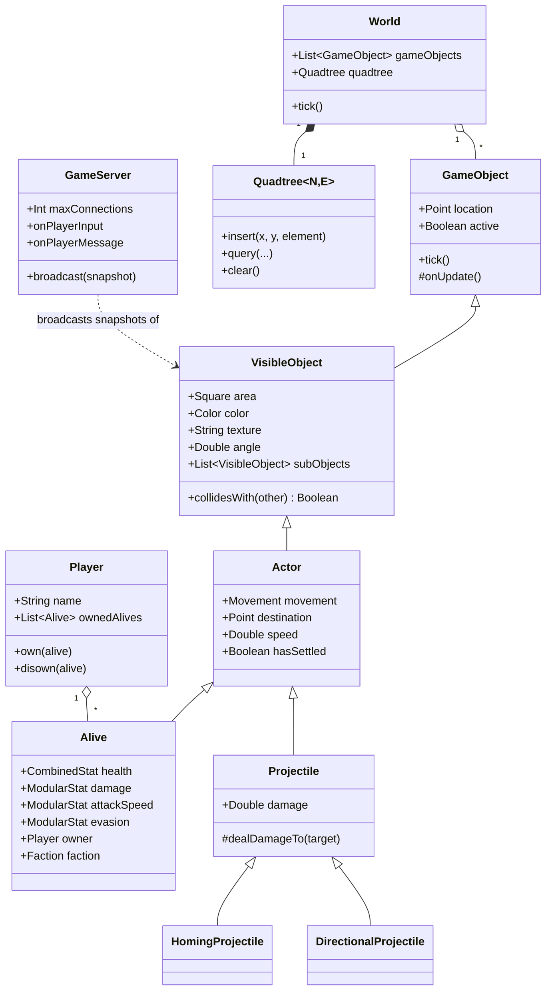

<div align="center">

# 🎮 GameTools

**A batteries-included Kotlin engine layer for 2D multiplayer games — game objects, stats, spatial indexing, and UDP networking, out of the box.**

[](https://github.com/SpartanLabsGaming/MyGameTools/actions/workflows/ci.yml)
[](https://central.sonatype.com/artifact/io.github.spartanlabsgaming/gametools)
[](https://kotlinlang.org)
[](http://www.apache.org/licenses/LICENSE-2.0.txt)
[](https://github.com/SpartanLabsGaming/MyGameTools)

</div>

---

## 📖 Overview

**GameTools** is a Kotlin/JVM library that supplies the reusable plumbing every simple 2D game engine needs so you can spend your time on gameplay instead of infrastructure. It is published to Maven Central as three coordinates — the **`gametools`** umbrella (everything, one dependency line), **`gametools-core`** (the object model, stats, spatial index, event bus and deterministic simulation — no networking), and **`gametools-net`** (the UDP `GameServer`, which depends on `gametools-core`):

- A **game-object hierarchy** — position, rendering, movement, combat, and ownership — built as small, composable layers rather than one giant class.
- A **stat system** (`ModularStat` / `CombinedStat` / `StatMod`) for buffs, debuffs, and resource bars (health, mana, stamina...) with proper additive/multiplicative stacking.
- A **quadtree spatial index** for fast proximity queries, used internally for collision and homing behavior.
- A **UDP `GameServer`** built on top of Spartan Laboratories' `WebTools`, handling client handshakes, a single shared multiplexed socket, input decoding, and JSON world-state broadcast.
- **Serializable snapshots** for every drawable object, ready to send over the wire as JSON.

It's the framework that powers Spartan Laboratories' own game projects, extracted so it can be reused (and improved) independently.

---

## 🧱 Architecture



**Layering, top to bottom:**

| Layer | Type | Responsibility |
|---|---|---|
| `GameObject` | abstract | Position + active flag + the `tick()` lifecycle hook every entity shares |
| `VisibleObject` | open | Adds rendering: area, color, texture, angle, and nested `subObjects` (health bars, nameplates) |
| `Actor` | open | Adds movement via a pluggable `Movement` strategy (`Targeting`, `Persistent`, fixed-angle, homing) |
| `Alive` | open | Adds combat: health, damage, attack timing/range/speed, evasion, faction, and `Player` ownership |
| `Projectile` / `HomingProjectile` / `DirectionalProjectile` | open/final | Travel-and-hit entities: home in on one target, or pierce in a straight line |
| `Player` | final | Owns a roster of `Alive` actors and tracks which are still living |
| `World` | final | Owns every `GameObject`, rebuilds the `Quadtree` and the `EntityId` index each frame, drives the tick loop, and publishes lifecycle/combat `GameEvent`s on its `EventBus` |
| `EventBus` | final | Synchronous, single-threaded `GameEvent` publish/subscribe, delivered in order with per-listener fault isolation |
| `SimulationLoop` | final | Opt-in fixed-timestep driver for a `World` — a daemon thread calling `tick()` at a live-tunable rate; nothing depends on it |
| `Quadtree<N, E>` | generic | Point-region spatial index for fast broad-phase proximity queries |
| `GameServer` | final | UDP transport: handshakes, a single shared multiplexed socket, input decoding, JSON broadcast |

### Modules

The library is split across three published Maven coordinates. Depend on the umbrella for
everything, or on `gametools-core` alone when you don't need the server.

| Module | Coordinate | Contains | Depends on |
|---|---|---|---|
| **core** | `io.github.spartanlabsgaming:gametools-core` | `com.spartanlabs.gaming.{gameobjects,spatial,event,simulation}.*` — the object hierarchy, stats & buffs, `Quadtree`, `EntityId`, `World`, `EventBus`, `SimulationLoop` — plus `com.spartanlabs.geometry.serializations.*` (the `@Serializable` geometry DTOs) | — |
| **net** | `io.github.spartanlabsgaming:gametools-net` | `com.spartanlabs.gaming.networking.*` — `GameServer`, the `MouseAction` wire type, and the `.command.*` typed `ClientCommand` protocol | `gametools-core` |
| **umbrella** | `io.github.spartanlabsgaming:gametools` | no source; re-exports both modules via `api` so one dependency line pulls the whole framework, exactly as the pre-4.0.0 `GameTools` artifact did | `gametools-core`, `gametools-net` |

---

## ✨ Features

### 🕹️ Game Objects
- **Composable entity hierarchy** — `GameObject → VisibleObject → Actor → Alive`, each layer adding exactly one concern (position, rendering, movement, combat).
- **Pluggable movement strategies** via the `Movement` sealed class: chase-and-stop (`Targeting`), chase-and-keep-chasing (`Persistent`), fixed-heading travel, or homing on another object.
- **Projectiles** that either chase a single target (`HomingProjectile`) or pierce everything along a straight line for a limited lifetime (`DirectionalProjectile`).
- **Attack lifecycle** — `Alive.issueAttack(target)` starts a chase-and-swing loop; `Alive.cancelAttack()` breaks it off (keeping the current destination) so a unit can be retreated or reassigned mid-fight; and the loop ends itself, via `onAttackEnded`, the moment the target dies or leaves the world.
- **Ownership model** — `Player` and `Alive.owner` are kept in sync automatically; an actor lives on at most one roster at a time.
- **Stable entity identity** — every object a `World` owns gets an `EntityId`, assigned in acquisition order and never reused. `World.byId(id)` resolves it (and returns `null` once it is gone — exactly the signal a command handler wants), and every `DrawableSnapshot` carries that `id` so clients track objects across frames instead of by list position.
- **Typed event bus** — `World.events` publishes a `GameEvent` stream (`EntitySpawned`, `EntityRemoved`, `AttackIssued`, `AttackLanded`, `DamageDealt`, `EntityDied`, …) so networking, scoring, or AI can react to what the simulation does without being wired into the code that does it. Synchronous, in-order, single-threaded; a throwing listener is isolated.
- **Deterministic tick** — every random choice the engine makes goes through a seeded `RandomSource` (`World(seed)` / `World.rng`), so a fixed seed and a fixed input sequence reproduce the run exactly. `World.tickCount` counts frames. The seed is logged on construction; pin it to replay a failure.
- **Opt-in fixed-timestep loop** — `SimulationLoop` drives `World.tick()` on a daemon thread at a live-tunable `LoopSettings.tickRateHz`, with a bounded catch-up after a stall. Purely a convenience: nothing in the engine depends on it, `World.tick()` stays callable directly, and `SimulationLoop.advance()` lets you drive the timestep from your own loop.
- **Serializable snapshots** (`DrawableSnapshot`) for every visible object and its nested sub-objects, each tagged with its `EntityId`, ready to JSON-encode and ship to clients.

### 📊 Stat System
- `ModularStat` — a `Double` reshaped by any number of named `StatMod`s (additive or multiplicative, with configurable stacking rules), so it drops in anywhere a plain number is expected.
- `CombinedStat` — a current/max pair (health, mana, stamina) that rescales `current` proportionally whenever the modified `max` changes, so buffs to a stat's ceiling don't waste or destroy the current value.

### 🗺️ Spatial Indexing
- A generic **point-region `Quadtree<N, E>`** used as the broad phase for collision and homing lookups — rebuilt once per frame by `World.tick()` so every object's own tick sees a consistent index.

### 🌐 Networking
- `GameServer`, built on Spartan Laboratories' `WebTools` `MultiConnectionUDPServer`: handles the `Iam <name>` handshake, replies with the bare token `REGISTERED`, and multiplexes every player's traffic - application data, broadcasts, and keepalives - over one shared socket (NAT-traversable end to end as of WebTools 2.0.0c), decodes `INPUT` datagrams into structured `MouseAction` events and `COMMAND` datagrams into typed `ClientCommand`s, routes everything else to your own callback, and enforces a configurable max player count. Callers are responsible for sending a bare `KA` token on that same socket roughly every 20s to keep their NAT mapping warm.
- **Typed command protocol** (`com.spartanlabs.gaming.networking.command`) — the client→server direction is library-owned, the way `DrawableSnapshot` owns server→client. `ClientCommand` is an open, `@Serializable` marker interface; GameTools ships six standard commands wired to mechanisms that already exist on `Actor` / `Alive` — `MoveTo`, `MoveDir`, `Follow`, `Stop`, `Attack`, `StopAttack` — all addressing objects by `EntityId`. `ClientCommandCodec` carries them over a `COMMAND <json>` envelope; `ClientCommand.applyTo(World)` resolves the ids and runs the mechanism (leaving authorization to you) — a movement command also calls off the actor's pending attack, so a manual move order overrides an auto-attack. A game registers its own commands in a `SerializersModule` handed to the codec.
- `MouseAction` — a serializable, typed representation of mouse `MOVE` / `PRESS` / `RELEASE` events in window pixel coordinates.

### 🧮 Geometry Serialization
- Drop-in `@Serializable` snapshot types (`PointSnapshot`, `DimensionsSnapshot`, `TwoDoublesSnapshot`) for encoding geometry values to JSON alongside game state.

---

## 📦 Installation

GameTools is published to **Maven Central** as three coordinates. Most projects want the
**`gametools`** umbrella — one line, the whole framework. Take **`gametools-core`** instead
if you only need the simulation side and not the UDP server; add **`gametools-net`** on top
if you later do.

**Gradle (Kotlin DSL)**
```kotlin
dependencies {
    implementation("io.github.spartanlabsgaming:gametools:5.0.0")          // everything
    // — or, à la carte —
    // implementation("io.github.spartanlabsgaming:gametools-core:5.0.0")  // no networking
    // implementation("io.github.spartanlabsgaming:gametools-net:5.0.0")   // GameServer (pulls in -core)
}
```

**Gradle (Groovy DSL)**
```groovy
dependencies {
    implementation 'io.github.spartanlabsgaming:gametools:5.0.0'
}
```

**Maven**
```xml
<dependency>
    <groupId>io.github.spartanlabsgaming</groupId>
    <artifactId>gametools</artifactId>
    <version>5.0.0</version>
</dependency>
```

> **Sources & docs.** The `gametools` umbrella's `-sources.jar` and `-javadoc.jar` bundle the
> Kotlin sources and combined Dokka API docs of *both* `gametools-core` and `gametools-net`,
> so IDE "Go to declaration" and quick-doc resolve through the single umbrella coordinate.
> (Releases before this one shipped empty sources/javadoc jars — see
> [#40](https://github.com/SpartanLabsGaming/MyGameTools/issues/40).)

> **Upgrading from `3.x`?** The single `io.github.spartanlabsgaming:GameTools` artifact is
> replaced by `io.github.spartanlabsgaming:gametools` (note the lowercase id) as of `4.0.0`.
> Swap the one dependency line; the umbrella's transitive contents are unchanged, so no
> imports move. See [CHANGELOG.md](CHANGELOG.md).
>
> GameTools transitively brings in Spartan Laboratories' [`WebTools`](https://github.com/SpartanLaboratories) (networking) and [`GeneralTools`](https://github.com/SpartanLaboratories) (shared utilities like `Color`), plus `kotlinx-serialization-json` and the `slf4j-api` logging facade — bring your own slf4j implementation (Logback, etc.) to see log output.

---

## 🚀 Quick Start

```kotlin
import com.spartanlabs.gaming.gameobjects.*
import com.spartanlabs.geometry.Point
import com.spartanlabs.geometry.Dimensions

// 1. Set up a world and a player
val world = World()
val player = Player("Spartak")

// 2. Spawn a unit
val hero = Alive(
    location = Point(x = 100.0, y = 100.0),
    dimensions = Dimensions(width = 40.0, height = 40.0),
    maxHealth = 250.0
)
player.own(hero)
world.gameObjects += hero

// 3. Buff a stat
hero.damage.applyMod(StatMod(name = "sword-of-power", value = 0.25, type = StatMod.Type.MULTIPLICATIVE))

// 4. Send it somewhere
hero.destination = Point(x = 400.0, y = 250.0)

// 5. Advance the simulation — call this once per frame
world.tick()
```

### Standing up a server

```kotlin
import com.spartanlabs.gaming.networking.GameServer
import com.spartanlabs.gaming.networking.command.ClientCommandCodec
import com.spartanlabs.gaming.networking.command.applyTo

val commands = ClientCommandCodec()   // + a SerializersModule for your own ClientCommand types

val server = GameServer(
    maxConnections = 8,
    onPlayerInput = { playerName, input ->
        println("$playerName -> $input")
    },
    onPlayerMessage = { playerName, message ->
        println("$playerName says: $message")
    },
    commandCodec = commands,
    onCommand = { playerName, command ->
        // authorize first — applyTo() does not — then run the mechanism the command names
        if (playerOwns(playerName, command)) command.applyTo(world)
    }
)

// Broadcast the current world state to every connected client, once per tick
// server.broadcast(DrawableSnapshot.from(someVisibleObject))
```

---

## 🧪 Testing

Tests are organized into a **five-level hierarchy** under `com.spartanlabs.gaming.testing.<level>`, each independently runnable so CI can gate them separately. Every module carries its own five-level test tree; each Gradle task below fans out across all modules:

| Gradle task | Level | Scope |
|---|---|---|
| `componentTest` | 2 — Component | Isolated component / business-logic tests |
| `integrationTest` | 3 — Integration | Integration & external-interface tests (binds real UDP ports) |
| `deterministicTest` | 4a — Deterministic | Pure-logic input/output and law-based tests |
| `e2eTest` | 4b — End-to-end | Full client↔server round-trip tests (binds real UDP ports) |
| `nonfunctionalTest` | 4c — Non-functional | Scalability & robustness tests (binds real UDP ports) |

```bash
./gradlew test              # run everything
./gradlew componentTest     # just the fast, isolated tests
./gradlew integrationTest   # networking integration tests
```

Because a `GameServer` binds a fixed common UDP port, any test task that starts one acquires a shared, single-permit Gradle build service so port-binding tasks never run concurrently.

---

## 🛠️ Building & Documentation

```bash
./gradlew build     # compile + test
./gradlew dokkaGeneratePublicationHtml   # generate API docs (Dokka)
```

API documentation is generated with [Dokka](https://kotlinlang.org/docs/dokka-introduction.html) and published as the Javadoc artifact alongside each Maven Central release.

---

## 📚 Tech Stack

| | |
|---|---|
| **Language** | Kotlin 2.2.0 (JVM) |
| **Serialization** | kotlinx.serialization (JSON) |
| **Logging** | slf4j API (bring your own binding) |
| **Testing** | JUnit 5 |
| **Docs** | Dokka |
| **Build** | Gradle multi-module — `gametools-core`, `gametools-net`, `gametools` umbrella; shared config in `build-logic/` convention plugins |
| **Publishing** | Vanniktech Maven Publish → Maven Central (three coordinates) |
| **Dependencies** | [WebTools](https://github.com/SpartanLaboratories) · [GeneralTools](https://github.com/SpartanLaboratories) |

---

## 🤝 Contributing

Development workflow, branching model, commit conventions, and the release process are in
[CONTRIBUTING.md](CONTRIBUTING.md). Release history is in [CHANGELOG.md](CHANGELOG.md).

---

## 📄 License

Licensed under the **Apache License, Version 2.0**. See [LICENSE](LICENSE) for details.

---

## 👤 Author

Built by **[Spartak Singh](https://github.com/SpaSinghOut)** under [Spartan Laboratories](https://github.com/SpartanLaboratories).
