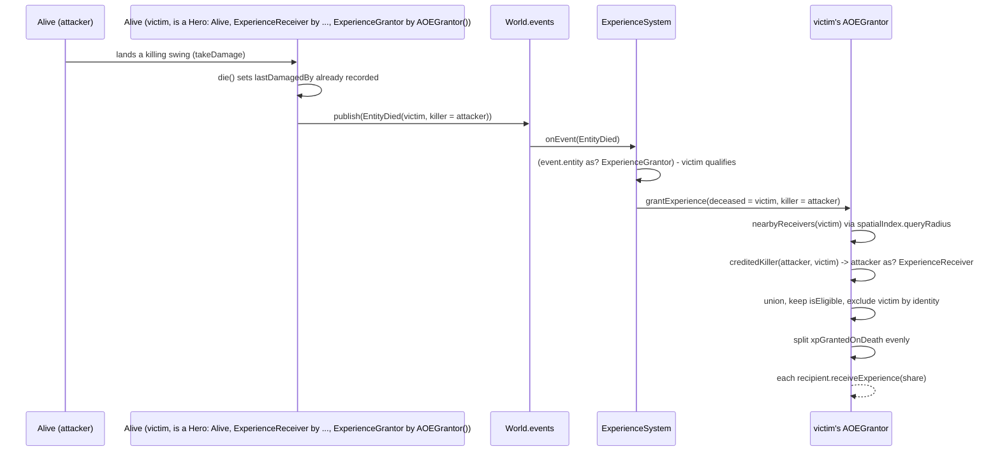
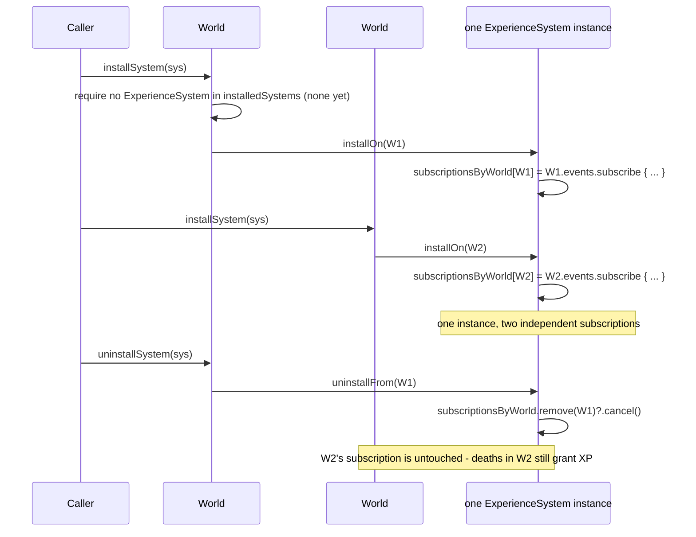

# Plan: `experience-system` — `ExperienceSystem` and the `ExperienceGrantor`/`AOEGrantor` reshape

## Header / Association

- **Covers:** [SpartanLabsGaming/MyGameTools#78](https://github.com/SpartanLabsGaming/MyGameTools/issues/78)
  — *"World Systems Stage 3: ExperienceSystem (event-driven XP granting on death)"* — the Combat
  Package (#71) deliverable. Also touches [SpartanLabsGaming/MyGameTools#71](https://github.com/SpartanLabsGaming/MyGameTools/issues/71)
  (*"Combat Package"*) only in that this unit reshapes the `ExperienceGrantor`/`AOEGrantor`
  contract #71 introduces; #71's own package-move scope is not re-litigated here.
- **Architecture:** `docs/world-systems-implementation-architecture.md`, unit slug
  `experience-system` (§10 decomposition table, row 3; scope in §4.6, stability in §8, open
  decisions OD2/OD4 in §12).
- **Branch:** `feature/78-experience-system`, cut from `master` **only after both #71 and #76
  (`world-system-core`) have merged into `master`**. None of #71's commits ride in this PR.
- **Commit:** TBD
- **PR:** TBD. This plan document is **not** part of the implementation PR: it lands earlier,
  together with the architecture and the other four unit plans, in the docs-only planning PR off
  `master` (architecture §1.2, "Other settled points"). The implementation PR references it,
  **Closes #78** and **Refs #71**.
- **What this plans:** a new `ExperienceSystem` (`WorldSystem`) that reacts to every
  `GameEvent.EntityDied` by dispatching to the dead entity's `ExperienceGrantor`; a reshape of
  `ExperienceGrantor`/`AOEGrantor` so the grantor (not the caller) owns credit policy and no
  longer needs a back-reference to "the entity that might die" at construction time; and the
  `DefaultExperienceReceiver` KDoc/import cleanup #71 left behind.
- **Status:** planning only. No source, test, or build file has been modified by this document.
- **Target release:** whatever Major release #71 lands in (§12 OD3 of the architecture; not
  re-decided here) — #71's `refactor(gameobjects)!:` commit is a `!`-suffixed breaking change, so
  #78 cannot ship in a release ahead of it.
- **Dependencies:** [#76](https://github.com/SpartanLabsGaming/MyGameTools/issues/76)
  (`world-system-core` — not yet implemented; plan at `docs/world-system-core-plan.md`) **and**
  #71 (branch `feature/71-combat-package` — not yet merged). Both must be on `master` before this
  branch is cut. **This plan's baseline for #71's landed shape is the CURRENT WORKING TREE of
  `feature/71-combat-package`** (read from disk, not from `dcb396e`, which the branch's own commit
  message says leaves `gametools-core` non-compiling). §1 records exactly what was read and where;
  §1.4 states what must be re-verified once #71 actually merges.
- **Related docs:** `docs/world-systems-implementation-architecture.md` (binding); `docs/issue-47-zones-plan.md`
  and `docs/physics-core-seams-plan.md` (plan-document skeleton and conventions this plan mirrors);
  `docs/world-system-core-plan.md` (#76, sibling — not yet written at the time of this reading);
  `docs/framework-vision-and-roadmap.md` §5 Open Decision E (partially answered by this unit, per
  architecture §7 pointer 7 — that pointer edit is applied by the architecture's own docs-only PR,
  not repeated here).

---

## 1. Context

### 1.1 The problem, restated

`ExperienceGrantor`/`AOEGrantor` and `ExperienceReceiver`/`DefaultExperienceReceiver` already
exist in `gametools-core`'s `gameobjects.combat` package (introduced by #71's `dcb396e`), but
nothing reacts to a death and calls them — issue #78's own body confirms this is the gap. Two
compounding problems, both binding per the user's C2 answer (architecture §1.2):

1. **The wiring gap.** No code anywhere calls `ExperienceGrantor.grantExperienceTo`. The most
   natural place to add it — a `World`-level listener on `GameEvent.EntityDied` — does not exist
   as a reusable, opt-in mechanism until `WorldSystem`/`World.installSystem` (#76) exist.
2. **A latent compile break in `AOEGrantor`'s current shape.** `AOEGrantor(val self: Alive)`
   (`gametools-core/src/main/kotlin/com/spartanlabs/gaming/gameobjects/combat/ExperienceGrantor.kt:30`,
   working tree) takes the entity it grants XP *for* as a constructor parameter. The moment a
   consumer writes the intended composition pattern —
   `class Hero(...) : Alive(...), ExperienceReceiver by DefaultExperienceReceiver(), ExperienceGrantor by AOEGrantor(this)` —
   Kotlin rejects `this` in a delegation-clause constructor argument ("'this' is not defined in
   this context"; verified against the 2.2.0 compiler by the architecture's research agent,
   independently confirmed here by reading the current constructor signature). **`AOEGrantor` as
   it stands today cannot be used the way its own KDoc implies it should be.**

C2 (binding, verbatim intent, architecture §1.2): *"ExperienceSystem calls the dead entity's
grantor on every death, passing (dead entity, killer: nullable). The grantor owns credit policy —
AOEGrantor shares XP among nearby receivers even with a null/non-receiver killer (fixing the
ranged/tower/environment-kill gap). No back-reference needed, so `ExperienceGrantor by
AOEGrantor()` compiles. #71 hasn't released, so change ExperienceGrantor/AOEGrantor signatures
freely."*

### 1.2 Verified facts — production code (working tree of `feature/71-combat-package`)

- **`ExperienceGrantor.kt`** (`gametools-core/src/main/kotlin/com/spartanlabs/gaming/gameobjects/combat/ExperienceGrantor.kt`):
  `interface ExperienceGrantor { val xpGrantedOnDeath: Double; fun grantExperienceTo(killer:
  ExperienceReceiver) }` (line 21, non-nullable, non-`Alive`-typed killer — the caller must
  already have cast/resolved a receiver); `open class AOEGrantor(val self: Alive) :
  ExperienceGrantor` (line 30) with `grantExperienceTo` (line 42) splitting `xpGrantedOnDeath`
  evenly across `getFullReceiverList(killer)` (line 58) — `getLocalReceiverList()` (line 51) calls
  `self.world!!.spatialIndex.queryRadius(self.location, xpGrantingRange)`, a **non-null-asserted**
  `world` access that throws `KotlinNullPointerException` for a worldless `self`, unfiltered for
  the deceased's own identity. `master` has no `gameobjects.combat` package and no
  `ExperienceGrantor` type at all (`git show master:gametools-core/.../gameobjects/ExperienceGrantor.kt`
  — path does not exist).
- **`ExperienceReceiver.kt`** (same directory): `myLoc` was removed from the file entirely, but
  `DefaultExperienceReceiver`'s KDoc (lines 33–35) still reads *"Completed but not usable on its
  own!!! Requires the using class to implement `myLoc`."* — stale. Three imports (`GameEvent`
  line 3, `log` line 4, `Point` line 5) are unused in the current file (confirmed: no `log.*`
  call, no `GameEvent` reference, no `Point` reference anywhere in the file's body).
- **`SpatialIndex.kt`** (`gametools-core/src/main/kotlin/com/spartanlabs/gaming/spatial/SpatialIndex.kt:76`):
  `fun queryRadius(location: Point, radius: Double) = queryRadius(location.x, location.y,
  radius)` — an **uncommitted working-tree addition**, not on `master` or in `dcb396e`.
  `AOEGrantor`'s reshape depends on this overload existing; this unit does not introduce it, but
  must re-verify it actually lands as part of #71's merged shape (§1.4).
- **`Alive.kt`** (`gametools-core/src/main/kotlin/com/spartanlabs/gaming/gameobjects/combat/Alive.kt`):
  `faction: String = DEFAULT_FACTION` (line 95), `DEFAULT_FACTION = "neutral"` (line 478) — every
  `Alive` starts in the same faction, so no built-in faction split exists to filter on.
  `lastDamagedBy: Alive?` (line 335) is `private`; `die()` (lines 381–400) applies
  `deathResponse` *before* publishing: `DeathResponse.RESPAWN` relocates to `respawn` and heals to
  full (lines 392–393) **before** `world?.events?.publish(GameEvent.EntityDied(this,
  lastDamagedBy))` (line 399) — documented limitation (b), §4.6 below. `AttackIntent` (lines
  493–514) is the existing precedent for a self-cancelling, per-object `EventBus.Subscription`.
- **`Projectile.kt`** (`gametools-core/src/main/kotlin/com/spartanlabs/gaming/gameobjects/Projectile.kt:33-39`):
  `dealDamageTo` does `target.health.current -= damage` directly, bypassing `Alive.takeDamage`
  entirely — a projectile kill never sets `lastDamagedBy`, so it reports a `null` or stale killer.
  Documented limitation (a), §4.6.
- **`GameEvent.kt`** (`gametools-core/src/main/kotlin/com/spartanlabs/gaming/event/GameEvent.kt:80`):
  `data class EntityDied(val entity: Alive, val killer: Alive?) : GameEvent` — already nullable,
  no change needed here.
- **`EventBus.kt`** (`gametools-core/src/main/kotlin/com/spartanlabs/gaming/event/EventBus.kt`):
  `subscribe` returns `fun interface Subscription { fun cancel() }` (lines 39–42), documented
  idempotent; `publish` (lines 73–89) iterates `listeners.toList()` — **a snapshot copy** — and
  wraps each listener call in `runCatching { }.onFailure { log.warn(...) }` (lines 82–83), so a
  throwing `ExperienceGrantor` cannot abort delivery to later listeners or propagate to the
  caller (typically `World.tick()`). Because the copy is taken before the loop, a listener
  cancelled by another listener *during* that same `publish` call still receives the event
  already in flight.
- **`World.kt`**: has **no** `installSystem`/`uninstallSystem`/`installedSystems`/`stepSystems`
  members today — confirmed by reading the full file. These are #76's to add; this plan treats
  their signatures as a fixed, binding contract (§2) and cannot itself add them.
- **No call site anywhere in the repo calls `grantExperienceTo` or constructs `AOEGrantor(...)`**
  (grepped `gametools-core`, `gametools-world`, `gametools-net`): the only occurrences of either
  symbol are inside `ExperienceGrantor.kt` itself. **Every caller this reshape must account for is
  therefore inside the one file being reshaped** — no other file in the repo needs a signature-change
  follow-up.
- **Existing tests**: `ExperienceReceiverTest.kt` (`testing.component.gameobjects`) and
  `ExperienceLawsTest.kt` (`testing.deterministic`, flat — no `.gameobjects` segment) both test
  only `DefaultExperienceReceiver`; neither references `ExperienceGrantor`/`AOEGrantor`. Both stay
  green untouched by this plan (`ExperienceReceiver`'s reshape is doc/import-only, §4.3).

### 1.3 Verified facts — repo conventions

- `.aiassistant/rules/CLAUDE.md`: `Result` for expected/operational failures, throw only for
  programmer/caller-wiring errors (with `@throws`); slf4j; KDoc on every public declaration;
  `//region`/`//endregion` grouping; numbered import-group comments. No MockK dependency exists in
  this repo (`build-logic/src/main/kotlin/gametools.kotlin-library.gradle.kts:29-32` — only
  `kotlin-test` and `logback-classic` for tests); every existing test file in `gametools-core`
  uses `kotlin.test` assertions with hand-rolled fakes, not MockK — this plan follows that
  established convention, not the rules file's generic "JUnit 5, MockK" phrasing.
- `com.spartanlabs.gaming.gameobjects.log` (`GameObject.kt:23`, `internal val log: Logger =
  LoggerFactory.getLogger("com.spartanlabs.gaming.gameobjects")`) is the shared logger for the
  whole `gameobjects` tree, including `gameobjects.combat` — `ExperienceReceiver.kt` already
  imports it (unused today, §1.2); `ExperienceGrantor.kt` does not import it yet and must, to log
  `AOEGrantor.grantExperience`'s lifecycle.
- Precedent for `require`-based caller-wiring rejection (thrown, not `Result`):
  `TiledMap.addSpawnPoint` (`gametools-world/.../world/map/TiledMap.kt:113-116`) and
  `ZoneGrid`'s constructor (`gametools-world/.../world/zone/ZoneGrid.kt:36`) — both
  `IllegalArgumentException`, matching the architecture's own §4.4 ruling for `World.installSystem`.
- Test package convention actually in force (verified against the branch's own test tree, not
  assumed): combat-adjacent component tests live in **`testing.component.gameobjects`** (flat,
  no `.combat` segment) even though the production types are in `gameobjects.combat` —
  `AliveCombatTest`, `AliveCombatEventsTest`, `ExperienceReceiverTest`, and every `World*Test` all
  follow this. Deterministic tests for combat/XP concepts live directly under
  **`testing.deterministic`** (flat — `ExperienceLawsTest`, `SeededCombatDeterminismTest`), not
  under a `.gameobjects` or `.combat` subpackage; `testing.deterministic.spatial` is the one
  exception, scoped to spatial-index property tests specifically. Integration tests for
  `gameobjects` live under `testing.integration.gameobjects` (`IntentSelfClearIntegrationTest`).
  **This existing placement is drift, not a convention to copy.** The user's global testing
  standard (`~/.claude/CLAUDE.md`, "Separate each level by folder / package") requires tests to
  mirror the production package below `testing.<level>`. The flat placement above predates #71's
  move of these types into `gameobjects.combat`; #71 moved the production classes but not their
  tests, and the flat deterministic files were never mirrored at all.

  **This plan's new tests follow the standard** and mirror the production package
  `gameobjects.combat` (§6), exactly as its sibling plans do (#76: `testing.*.gameobjects`,
  #77: `testing.*.world.zone`). Aligned in the planner's cross-plan pass. Relocating the existing
  drifted tests is not this unit's scope; it is named as a follow-up in §11.
- `gametools-core` has **no `e2e` or `nonfunctional/gameobjects` test tier today** (only
  `component`, `integration`, `deterministic`, and `nonfunctional/spatial`) — unlike
  `gametools-world`, which added an `e2e` tier for its `MapLoader`/`fixture-map.json` file-based
  scenario. This plan does not open a first `gametools-core` `e2e` tier (§6 rationale).
- CONTRIBUTING.md's module table row for `gametools-core` (`CONTRIBUTING.md:33`) lists **package
  globs** (`com.spartanlabs.gaming.{gameobjects,spatial,event,simulation}.*`), not individual
  class names — unlike the `gametools-world` row, which does enumerate class names per issue. The
  architecture's per-stage table (§7) says #78 "adds `ExperienceSystem` to the combat package
  mention" in CONTRIBUTING, but there is no such per-class mention to add to for `gametools-core`
  today; the glob already covers it. **Deviation noted, not silently applied** — see the report to
  the caller.
- README.md line 163: *"**Leveling** — ... Not yet wired to `Alive`/`Player` — a standalone
  accrual mechanism a consumer opts into."* This line becomes false the moment `ExperienceSystem`
  ships (§5). README nowhere mentions `ExperienceGrantor`/`AOEGrantor`/`ExperienceSystem` today —
  confirmed by grep. CHANGELOG.md `[Unreleased] ### Added` likewise has no bullet for
  `ExperienceGrantor`/`AOEGrantor` today, even though #71's own commit body claims to add them —
  **#71 has not yet discharged its own README/CHANGELOG duty for that surface** (§5).

### 1.4 What must be re-verified once #71 and #76 actually merge (before this branch is cut)

1. That `AOEGrantor` still exists on `master` after #71 merges, with the shape read in §1.2. If
   #71 drops `AOEGrantor` entirely (its own branch scope note allows this), this unit **creates**
   `ExperienceGrantor`/`AOEGrantor` fresh per §4.2, crediting #71 for `ExperienceGrantor`
   (assuming that interface itself survives) and #78 for whatever it has to build from scratch.
2. That `SpatialIndex.queryRadius(Point, Double)` (`SpatialIndex.kt:76`) actually lands as part of
   #71's merge (it is currently an uncommitted working-tree addition on `feature/71-combat-package`,
   not yet part of any commit on that branch).
3. That `WorldSystem`/`CoreSystemSlot`/`World`'s four registry members exist on `master` exactly
   as specified in §2 below (they are #76's to build, not yet implemented anywhere).
4. Whether #71's own PR added a CHANGELOG/README bullet for `ExperienceGrantor`/`AOEGrantor` in
   the interim — re-check before applying §5's CHANGELOG/README edits, since the exact wording to
   amend vs. add depends on what's actually there at branch time (§5.3).

---

## 2. `world-system-core` (#76) contract this unit consumes — treated as fixed and binding

Per the architecture (§4.2, §4.4), not redesigned here:

```kotlin
// com.spartanlabs.gaming.annotation
@RequiresOptIn(level = RequiresOptIn.Level.ERROR)
@Retention(AnnotationRetention.BINARY)
annotation class ExperimentalGameToolsApi

// com.spartanlabs.gaming.gameobjects
@SubclassOptInRequired(ExperimentalGameToolsApi::class)
interface WorldSystem {
    fun installOn(world: World)
    fun uninstallFrom(world: World) {}
    fun step(world: World) {}
    val coreSlot: CoreSystemSlot? get() = null
}

// members added to the existing final class World
@ExperimentalGameToolsApi fun World.installSystem(system: WorldSystem)      // throws IllegalArgumentException on duplicate instance or occupied slot; calls installOn; records only if installOn didn't throw
@ExperimentalGameToolsApi fun World.uninstallSystem(system: WorldSystem)    // idempotent; removes from the list, then calls uninstallFrom
@ExperimentalGameToolsApi val World.installedSystems: List<WorldSystem>    // fresh copy every access, step order; never contains the system currently being installed
@ExperimentalGameToolsApi fun World.stepSystems()                          // not used by this unit — ExperienceSystem has no step()
```

`ExperienceSystem` (§4.1) uses `installOn`/`uninstallFrom`, `WorldSystem`'s default `coreSlot =
null` (no override needed — tier 2), and `World.installedSystems` (to detect a second instance).
It does **not** use `CoreSystemSlot`/`CoreWorldSystemSlot` (no slot claimed) or `stepSystems`/
`step` (purely event-reactive, per issue #78's own body: *"no `step()` override — proves the
`WorldSystem` non-ticking path"*).

---

## 3. Design

### 3.1 Two independent pieces, one PR

1. **`ExperienceSystem`** (new) — a `WorldSystem` that subscribes to `world.events` on install and
   dispatches every `GameEvent.EntityDied` to the dead entity's `ExperienceGrantor`, if it has one.
2. **The `ExperienceGrantor`/`AOEGrantor` reshape** (modifies #71's landed shape) — moves credit
   policy from the caller into the grantor, removes the back-reference that makes delegation
   impossible, and fixes the self-XP bug as a side effect of tightening the invariant the template
   method now owns.

They ship together because `ExperienceSystem`'s call signature
(`grantor.grantExperience(deceased, killer)`) *is* the reshaped contract — there is no
intermediate state where one lands without the other compiling.

### 3.2 Flow — a death with a real killer



### 3.3 Flow — install / multi-world / uninstall



### 3.4 Identity-keyed subscription store

`ExperienceSystem` keys its per-`World` `EventBus.Subscription` in a
`java.util.IdentityHashMap<World, EventBus.Subscription>`, not a plain `HashMap`. `World` does not
override `equals`/`hashCode` today, so a plain `HashMap` would behave identically in practice —
but `IdentityHashMap` makes the intended semantics ("one entry per distinct `World` instance,
never by value") explicit and safe against a hypothetical future `World.equals` override, the same
defensive posture `World.installSystem`'s own "by reference identity" duplicate check takes
(architecture §4.4). Not thread-safe, matching every other `World`-adjacent type in this codebase
(`World` itself, `EventBus`) — single-threaded by convention.

### 3.5 The reshaped contract

```kotlin
interface ExperienceGrantor {
    val xpGrantedOnDeath: Double
    fun grantExperience(deceased: Alive, killer: Alive?)
}

open class AOEGrantor(
    override var xpGrantedOnDeath: Double = 10.0,
    var xpGrantingRange: Double = 1000.0,
) : ExperienceGrantor {

    final override fun grantExperience(deceased: Alive, killer: Alive?) {
        val nearby = nearbyReceivers(deceased)
        val credited = creditedKiller(killer, deceased)
        val candidates = if (credited != null && credited !in nearby) nearby + credited else nearby
        val recipients = candidates
            .filter { isEligible(it, deceased) }
            .filterNot { it === deceased }
        if (recipients.isEmpty()) {
            log.debug("AOEGrantor found no eligible recipients for a death; granting nothing")
            return
        }
        val share = xpGrantedOnDeath / recipients.size
        recipients.forEach { it.receiveExperience(share) }
        log.debug("AOEGrantor split {} XP across {} recipient(s)", xpGrantedOnDeath, recipients.size)
    }

    protected open fun nearbyReceivers(deceased: Alive): List<ExperienceReceiver> =
        deceased.world?.spatialIndex
            ?.queryRadius(deceased.location, xpGrantingRange)
            ?.filterIsInstance<ExperienceReceiver>()
            ?: emptyList()

    protected open fun creditedKiller(killer: Alive?, deceased: Alive): ExperienceReceiver? =
        killer as? ExperienceReceiver

    protected open fun isEligible(receiver: ExperienceReceiver, deceased: Alive): Boolean = true
}
```

```kotlin
@ExperimentalGameToolsApi
class ExperienceSystem : WorldSystem {
    private val subscriptionsByWorld: MutableMap<World, EventBus.Subscription> = IdentityHashMap()

    override fun installOn(world: World) {
        require(world.installedSystems.none { it is ExperienceSystem }) {
            "An ExperienceSystem is already installed on this World"
        }
        subscriptionsByWorld[world] = world.events.subscribe(::onGameEvent)
        log.debug("ExperienceSystem subscribed to a World's events (seed {})", world.seed)
    }

    override fun uninstallFrom(world: World) {
        subscriptionsByWorld.remove(world)?.let { subscription ->
            subscription.cancel()
            log.debug("ExperienceSystem unsubscribed from a World's events (seed {})", world.seed)
        }
    }

    private fun onGameEvent(event: GameEvent) {
        if (event !is GameEvent.EntityDied) return
        val grantor = event.entity as? ExperienceGrantor ?: return
        log.debug("ExperienceSystem dispatching death of {} (killer {}) to its grantor", event.entity, event.killer)
        grantor.grantExperience(event.entity, event.killer)
    }
}
```

The Hero litmus test now compiles:

```kotlin
class Hero(location: Point) : Alive(location, Dimensions(10.0, 10.0), maxHealth = 100.0),
    ExperienceReceiver by DefaultExperienceReceiver(),
    ExperienceGrantor by AOEGrantor()
```

### 3.6 Known, documented limitations — not fixed here (architecture §4.6/§12 OD4)

- **(a) Projectile kill misattribution.** `Projectile.dealDamageTo` (`Projectile.kt:33-39`)
  bypasses `Alive.takeDamage`/`lastDamagedBy`, so a projectile kill reports a `null` or stale
  `killer`. **Softened, not fixed, by this reshape.** The grantor is now called on every death
  with a nullable killer, so an unknown killer no longer prevents AOE sharing among nearby
  receivers. The issue's original sketch would have granted nothing whenever the killer was not a
  receiver. What is still lost:
  - for a `null` killer, the killer's credit when the shooter stands outside `xpGrantingRange`;
  - for a stale killer (an earlier melee attacker), a share credited to the wrong unit.
- **(b) RESPAWN relocation-before-event.** `Alive.die()` (`Alive.kt:381-400`) moves a
  `DeathResponse.RESPAWN` actor to `respawn` and heals it to full *before* publishing
  `EntityDied`. `AOEGrantor.nearbyReceivers` therefore queries the spatial index around the
  **respawn point**, not the death point, giving XP to whoever stands there instead of whoever
  was actually nearby when the kill happened — the more damaging of the two limitations for the
  common MOBA-hero-with-respawn shape. Not fixed here (out of scope, §12 OD4).
- **(c) Start-of-tick spatial positions.** `World.spatialIndex` is reconciled at the *start* of
  `tick()` (`World.kt:220`), so `nearbyReceivers` queries positions up to one tick stale — the
  same approximation every other in-tick spatial query in the engine already accepts.

---

## 4. File-by-file changes

### 4.1 New — `gametools-core/src/main/kotlin/com/spartanlabs/gaming/gameobjects/combat/ExperienceSystem.kt`

Full file, imports grouped per `.aiassistant/rules/CLAUDE.md` §6:

```kotlin
package com.spartanlabs.gaming.gameobjects.combat

//region 1. Organization Internal
// 1.2 Spartan Gaming
import com.spartanlabs.gaming.annotation.ExperimentalGameToolsApi
import com.spartanlabs.gaming.event.EventBus
import com.spartanlabs.gaming.event.GameEvent
import com.spartanlabs.gaming.gameobjects.World
import com.spartanlabs.gaming.gameobjects.WorldSystem
import com.spartanlabs.gaming.gameobjects.log
//endregion

//region 3. Utility / Catch-all
// 3.1 Java Standard library
import java.util.IdentityHashMap
//endregion

/** KDoc per §4.1 below. */
@ExperimentalGameToolsApi
class ExperienceSystem : WorldSystem { /* body per §3.5 */ }
```

- **`installOn(world: World): Unit`** — mutability: none of its own state is exposed;
  `subscriptionsByWorld` is a `private val` mutable map, never read externally. **Error
  handling**: `require(...)` throws `IllegalArgumentException` when a second `ExperienceSystem`
  instance is already present in `world.installedSystems` — a **caller-wiring error**, not an
  operational failure (matching `World.installSystem`'s own two `require`s, architecture §4.4);
  never returns `Result` because `WorldSystem.installOn`'s signature is fixed by #76 as `Unit`.
  If this `require` throws, nothing is subscribed and `World.installSystem` (the only intended
  caller) records nothing either (its own contract: "if `installOn` throws, nothing is
  recorded"). **Logging**: `DEBUG` "ExperienceSystem subscribed to a World's events (seed {})" on
  success. It is `DEBUG`, not `INFO`, because `World.installSystem` already logs the install
  lifecycle event at `INFO` (#76, `docs/world-system-core-plan.md` §3.5), and a second `INFO`
  line per install would duplicate it. The same rule applies to `ZoneWorldSystem` and
  `PhysicsWorldSystem`. There is no log line on the rejected path: the thrown exception itself is
  the signal, matching `TiledMap.addSpawnPoint`'s convention of not also logging a `require`
  failure.
- **`uninstallFrom(world: World): Unit`** — idempotent: a `world` with no tracked subscription is
  a silent no-op (no exception, no log), matching `World.uninstallSystem`'s own idempotency
  contract and `EventBus.Subscription.cancel`'s documented idempotency. **Logging**: `DEBUG`
  "ExperienceSystem unsubscribed from a World's events (seed {})", only when an actual
  subscription was cancelled (`World.uninstallSystem` logs the lifecycle event at `INFO`).
- **`onGameEvent(event: GameEvent): Unit`** (`private`) — never throws for an expected input (a
  non-`EntityDied` event or a non-grantor `entity` are both silently ignored via early returns,
  not exceptions). **If `grantor.grantExperience` throws** (a programmer error in a consumer's
  own `ExperienceGrantor`/`AOEGrantor` override), the exception propagates out of this function,
  but `EventBus.publish`'s `runCatching` (its caller, since this function *is* the subscribed
  `Listener`) catches and logs it at `WARN` — it never aborts delivery to a later subscriber or
  escapes to `World.tick()`. **Logging**: `DEBUG` "ExperienceSystem dispatching death of {}
  (killer {}) to its grantor" before every dispatch, so a `DEBUG`-level trace exists even when
  the grantor itself logs nothing.
- **Concurrency**: single-threaded by the same convention as `World`/`EventBus`; no
  synchronisation on `subscriptionsByWorld`.

### 4.2 Modified — `gametools-core/src/main/kotlin/com/spartanlabs/gaming/gameobjects/combat/ExperienceGrantor.kt`

Full rewrite per §3.5's snippet, plus:

- **Imports after the rewrite:** exactly one, `com.spartanlabs.gaming.gameobjects.log`, under
  `//region 1. Organization Internal` / `// 1.2 Spartan Gaming`. It is new; today's file does not
  import it.
  - The working tree's `com.spartanlabs.gaming.gameobjects.World` import is removed. `World` is
    reached only through `deceased.world`, whose type needs no import.
  - The `com.spartanlabs.geometry.Point` import is removed. `deceased.location` is passed straight
    to `queryRadius(Point, Double)`, and no `Point` type is named in the file.
  - `Alive` and `ExperienceReceiver` share the `combat` package and need no import.
- **`interface ExperienceGrantor`** — `xpGrantedOnDeath: Double` unchanged; `grantExperience(deceased:
  Alive, killer: Alive?): Unit` replaces `grantExperienceTo(killer: ExperienceReceiver): Unit`.
  **Breaking rename**, but the interface has never shipped in a release (§1.2), so it carries no
  semver weight (architecture §11).
- **`open class AOEGrantor`** — constructor drops `val self: Alive`; gains `xpGrantedOnDeath:
  Double = 10.0` and `xpGrantingRange: Double = 1000.0` as constructor parameters (previously
  `xpGrantedOnDeath` was a body-level `override var` with no constructor default, `xpGrantingRange`
  a body-level `var` — both now promoted to constructor parameters with the same defaults, purely
  a mechanical move since defaults are unchanged). `grantExperience` is `final` (owns the
  invariants; §3.6 rationale already stated in the architecture, restated in KDoc). Three new
  `protected open` hooks replace the two now-removed `protected fun getLocalReceiverList()` /
  `getFullReceiverList(killer)` helpers.
  - **Error handling for `nearbyReceivers`**: default never throws — `deceased.world` is
    null-safely chained (`?.spatialIndex?.queryRadius(...)?.filterIsInstance<...>() ?: emptyList()`),
    a **behavioural fix** over today's `self.world!!...` (which throws
    `KotlinNullPointerException` for a worldless grantor — a real, if unlikely, crash today for
    any `Alive` that dies before being added to a `World`). A subclass override that throws is a
    programmer error, uncaught by `AOEGrantor` itself, ultimately caught by `EventBus.publish`
    when the whole chain is invoked from `ExperienceSystem`.
  - **`creditedKiller`/`isEligible`**: pure functions, no failure path either has an expected
    error; a throwing override is likewise a programmer error, same propagation path.
  - **`grantExperience` itself**: never throws for an expected input; an empty recipient list is
    handled explicitly (§3.5) rather than divide-by-zero. `Unit`-returning per the interface's
    fixed signature — not `Result`, because there is no expected/operational failure mode to
    encode (every "nothing happened" case — no world, no receivers, empty candidates — is a
    legitimate, silent outcome, not a failure the caller needs to react to).
- **Mutability**: `xpGrantedOnDeath`/`xpGrantingRange` stay `var` (tunable per-instance, matching
  today's shape); `nearbyReceivers`'s returned `List<ExperienceReceiver>` is an immutable `List`
  (from `filterIsInstance`), never a mutable collection leaking internal state.
- **Logging**: `DEBUG` on both the "granted to N recipients" and "granted nothing" paths (§3.5).
  No `WARN`/`ERROR` level anywhere in this file — every path here is an expected outcome, not a
  failure.

### 4.3 Modified — `gametools-core/src/main/kotlin/com/spartanlabs/gaming/gameobjects/combat/ExperienceReceiver.kt`

- Remove the stale `DefaultExperienceReceiver` KDoc sentence referencing the removed `myLoc`
  property and the "Completed but not usable on its own!!!" phrasing (lines 33–35) — replace with
  accurate KDoc: the class is fully usable standalone (it already is — nothing about it requires
  a subclass to implement anything).
- Remove the three unused imports: `com.spartanlabs.gaming.event.GameEvent`,
  `com.spartanlabs.gaming.gameobjects.log`, `com.spartanlabs.geometry.Point` (lines 3–5).
- **No signature change, no behavioural change** — `ExperienceReceiver`/`DefaultExperienceReceiver`
  keep their existing contract exactly (`ExperienceReceiverTest`/`ExperienceLawsTest` stay green
  unmodified). No new logging is added to `receiveExperience` — out of this file's stated scope
  (doc/import cleanup only); flagged as a minor gap against the general "log lifecycle events"
  house rule, not silently fixed here (see Risks §7 and Open decisions §9).

### 4.4 No change (verified, not touched)

`World.kt`, `GameEvent.kt`, `Projectile.kt`, `Alive.kt`, `EventBus.kt`, `SpatialIndex.kt` — all
read in §1.2, none modified by this unit. `Actor.kt` shows as modified in the current working
tree, but that change belongs to #71's own scope, not #78's — **not carried into this unit's
commits** (§8).

---

## 5. Documentation impact

### 5.1 Rings touched

- **Inner Core** — `//region`/`//endregion` grouping in the new/rewritten `ExperienceGrantor.kt`
  and the new `ExperienceSystem.kt`, per house style.
- **Component Ring (KDoc)** — full KDoc (`@param`/`@return`/`@throws` where applicable) on:
  `ExperienceGrantor.grantExperience`, `AOEGrantor` (class doc explaining the template-method
  split), `AOEGrantor.grantExperience` (`@throws` note: none expected; propagates a hook's
  programmer error), `nearbyReceivers`/`creditedKiller`/`isEligible` (each documents its default
  and that it is the intended override seam — the faction-filtering example belongs on
  `isEligible`'s KDoc, citing Dota 2/LoL's ~1500–1600-unit enemy-side AOE convention as the
  worked-example rationale, not the shipped default), `ExperienceSystem` (class doc: install/
  uninstall/dispatch contract, the multi-world note, the in-flight-uninstall note), and the fixed
  `DefaultExperienceReceiver` KDoc.
- **Boundary Ring** — none. No wire/protocol type changes; `GameEvent.EntityDied` is unchanged.
- **Architectural Outer Layer** — README (§5.2), CHANGELOG (§5.3). CONTRIBUTING.md's module table:
  **no edit needed** for `gametools-core`'s row (§1.3 deviation note) — flagged to the caller, not
  silently applied as the architecture's per-stage table literally suggests.
  `docs/framework-vision-and-roadmap.md` §5 Open Decision E's own correction (architecture §7
  pointer 7) is applied by the architecture document's own docs-only PR, not repeated in this
  implementation PR.

### 5.2 README.md edits

- Line 163 (Leveling bullet) — rewrite to remove "Not yet wired to `Alive`/`Player`" and state
  the actual wiring:

  > **Leveling & kill-credit** — `ExperienceReceiver.receiveExperience(experience)` accrues
  > experience toward `nextLevelXPRequired`; `DefaultExperienceReceiver` uses `10 + level^2` and
  > loops the deposit across as many thresholds as it crosses. `ExperienceGrantor`/`AOEGrantor`
  > decide who receives XP on an `Alive`'s death and how much — `AOEGrantor` splits it evenly
  > among nearby `ExperienceReceiver`s (and the killer, if it is one), with `protected open`
  > hooks (`nearbyReceivers`, `creditedKiller`, `isEligible`) a game overrides for its own policy
  > (e.g. enemy-faction-only). `ExperienceSystem`, an opt-in `WorldSystem`
  > (`world.installSystem(ExperienceSystem())`), dispatches every death to the dying entity's
  > grantor automatically.

- **Coordination note (re-verify at branch time, §1.4 item 4):** if #71's own PR already added a
  README bullet documenting `ExperienceGrantor`/`AOEGrantor` before this branch is cut, **edit
  that bullet in place** to the wording above rather than adding a duplicate; if #71 added
  nothing (the current state), the bullet above is the first one for that surface and is added
  fresh, crediting both #71 (the interfaces) and #78 (the wiring) in prose, not by issue-number
  suffix (README doesn't use inline issue tags the way CHANGELOG does).
- No change needed to the module table (`README.md:147`, `gametools-core` row) — it is
  package-glob-style, already covers `com.spartanlabs.gaming.gameobjects.*`.

### 5.3 CHANGELOG.md `[Unreleased]` edit

**At branch time, first check what #71's merged commit(s) actually put under `[Unreleased] ###
Added`** (currently nothing, §1.2/§1.4):

- **If #71 added an `ExperienceGrantor`/`AOEGrantor` bullet** (describing `grantExperienceTo` and
  `AOEGrantor(self: Alive)`): **amend that bullet in place** to describe the reshaped
  `grantExperience(deceased, killer)` contract and the constructor-parameter change, per the
  architecture's explicit instruction not to add a `### Changed` entry for an API no release ever
  shipped. Add `ExperienceSystem` as a new, separate `### Added` bullet crediting `(#78)`.
- **If #71 added nothing** (the state observed while writing this plan): add two new `###
  Added` bullets under `[Unreleased]`, in the style of the existing #46/#47/#48 bullets:

  > - `com.spartanlabs.gaming.gameobjects.combat` — `ExperienceGrantor` (who receives XP on an
  >   `Alive`'s death and how much) and `AOEGrantor`, its default: splits `xpGrantedOnDeath`
  >   evenly among `ExperienceReceiver`s within `xpGrantingRange`, always credits the killer if it
  >   is one (even from outside that range), and never grants the deceased its own death XP.
  >   `protected open` hooks (`nearbyReceivers`, `creditedKiller`, `isEligible`) let a game
  >   substitute its own policy (e.g. enemy-faction-only) without reimplementing the split. No
  >   back-reference to the entity that might die — `class Hero(...) : Alive(...), ExperienceGrantor
  >   by AOEGrantor()` composes via Kotlin delegation. (#71)
  > - `ExperienceSystem` — an opt-in `WorldSystem` (`world.installSystem(ExperienceSystem())`)
  >   that dispatches every `GameEvent.EntityDied` to the dead entity's `ExperienceGrantor`, if it
  >   has one, passing the (now possibly `null`) killer through unchanged. A throwing grantor is
  >   caught and logged by `EventBus.publish`, never breaking `World.tick()`/`stepSystems()`.
  >   (#78)

---

## 6. Test plan (5-level hierarchy)

All new tests use `kotlin.test` + JUnit 5 + hand-rolled fakes (no MockK — §1.3), one test class
per file, backtick-named methods. Every new test class mirrors its production package,
`gameobjects.combat`, below `testing.<level>`, per the global testing standard (§1.3).

**Level 1 — local gating.** `./gradlew componentTest deterministicTest` run locally before every
commit in this unit's branch. Not a separate test class; covers levels 2 and 4a below.

**Level 2 — component** (`gametools-core/src/test/kotlin/com/spartanlabs/gaming/testing/component/gameobjects/combat/`, package `com.spartanlabs.gaming.testing.component.gameobjects.combat`)

- `AOEGrantorTest.kt` — a real `World` + a real `Alive`-derived fixture (the Hero litmus pattern
  from §3.5, doubling as the compile-time proof that `by AOEGrantor()` composes with `by
  DefaultExperienceReceiver()` on the same class): a deceased with several nearby receivers splits
  `xpGrantedOnDeath` evenly; a `null` killer still grants AOE XP to nearby receivers; a non-`null`,
  non-`ExperienceReceiver` killer (e.g. a bare `Alive` with no delegation) is not added to the
  candidate set and does not error; a killer outside `xpGrantingRange` is still credited exactly
  once via `creditedKiller`, not double-counted if it also happens to be nearby; the deceased
  itself, if it is also an `ExperienceReceiver` within its own query radius, never receives a
  share (the bug-fix case — construct a scenario where the old `getFullReceiverList` would have
  included it); an empty candidate set (no nearby receivers, no receiver killer) grants nothing
  and does not divide by zero; a worldless `Alive` (never added to a `World`)
  calling `grantExperience` returns cleanly with no receivers, no crash — a regression test for
  today's `self.world!!` behaviour being replaced; a subclass overriding `isEligible` to reject
  same-faction receivers (the documented worked example) is exercised as a concrete override
  test, not just described in KDoc.
- `ExperienceSystemTest.kt` — `installOn`/`uninstallFrom` called directly (not through
  `World.installSystem`, so the test isolates `ExperienceSystem`'s *own* guard): a fresh
  `ExperienceSystem` installed on a `World` subscribes and dispatches a published `EntityDied` to
  a fake `ExperienceGrantor`, passing the exact `(deceased, killer)` pair; `uninstallFrom` cancels
  the subscription — a subsequent `EntityDied` on the same `World` is no longer dispatched;
  **two distinct `ExperienceSystem` instances `installOn` the same `World`** — the second's
  `installOn` throws `IllegalArgumentException` (this is the case `World.installSystem`'s own
  identity check cannot catch, since the two instances are genuinely different references, so this
  test proves `ExperienceSystem`'s own `require` is load-bearing, not redundant); one
  `ExperienceSystem` instance `installOn` two different `World`s independently — cancelling one
  world's subscription leaves the other's dispatch intact (Design §3.3); a `GameEvent.EntityDied`
  whose `entity` is not an `ExperienceGrantor` is silently ignored (no call, no exception); a
  grantor that throws does not propagate out of `world.events.publish` (relies on `EventBus`'s
  own `runCatching`, exercised end-to-end here as a regression guard specific to this dispatch
  path).

**Level 3 — integration** (`gametools-core/src/test/kotlin/com/spartanlabs/gaming/testing/integration/gameobjects/combat/`, package `com.spartanlabs.gaming.testing.integration.gameobjects.combat`)

- `ExperienceSystemIntegrationTest.kt` — real `World`, real `Alive` combat loop (mirrors
  `AliveCombatEventsTest`'s fixture pattern), `ExperienceSystem` installed via
  `world.installSystem`:
  - An attacker kills a `DeathResponse.REMOVAL` Hero-style target across several `world.tick()`
    calls; the attacker (also a Hero) receives the correct XP share once the target dies.
  - **RESPAWN known-limitation test (labelled as such in the test name/KDoc, e.g.
    `` `RESPAWN relocates before EntityDied fires, so AOE is measured from the respawn point (known limitation, see architecture §4.6(b))` ``)**:
    a target with `deathResponse = RESPAWN` and a `respawn` point far from where it actually died;
    a receiver stands near the *death* point, another near the *respawn* point; the test asserts
    **today's documented (wrong) behaviour** — the respawn-point receiver is credited, the
    death-point one is not — with an inline comment/KDoc noting this assertion must flip the
    moment limitation (b) is fixed, so the test itself is the tripwire that forces a look when
    that happens.
  - A death with **no tracked killer** (health forced to `0.0` directly, mirroring
    `AliveCombatEventsTest`'s own `` `a death with no tracked attacker credits no killer` `` setup)
    still grants AOE XP to nearby receivers, with no killer-side entry.
  - **Mid-delivery uninstall**: a second listener subscribed on `world.events` *before*
    `ExperienceSystem`'s own installation calls `world.uninstallSystem(experienceSystem)` the
    moment it observes `EntityDied`; asserts the `ExperienceSystem` still processes that *same*
    event (because `EventBus.publish` iterates a pre-taken snapshot copy), but a second,
    independent death afterward is no longer dispatched — directly exercising the documented
    "in-flight delivery" note (§3.6/architecture §4.6).
  - Uninstalling and reinstalling a fresh `ExperienceSystem` instance on the same `World` works
    (no residual state prevents re-installation once uninstalled).

**Level 4a — deterministic** (`gametools-core/src/test/kotlin/com/spartanlabs/gaming/testing/deterministic/gameobjects/combat/AOEGrantorLawsTest.kt`, package `com.spartanlabs.gaming.testing.deterministic.gameobjects.combat`)

- Law: for any non-empty recipient set, the sum of XP distributed equals `xpGrantedOnDeath`
  (within floating-point tolerance) — sweep several `xpGrantedOnDeath` values and several
  recipient-count fixtures.
- Law: for an empty recipient set, zero total XP is distributed and no exception is thrown.
- Law: the deceased's own `experience` (when it is also an `ExperienceReceiver`) never increases
  as a result of its own `grantExperience` call, across every fixture in the sweep.
- Law: a killer outside `nearbyReceivers`' range is credited exactly once, never zero times and
  never twice (covers both "outside range" and "inside range and also the killer" as two branches
  of the same law).

**What's out of scope for a first `gametools-core` e2e/nonfunctional tier:** this unit adds
neither. No file-loading or multi-module composition scenario exists here the way `gametools-world`'s
`MapLoader`-driven e2e test needed one (§1.3) — the integration-level test above already exercises
`World` + `EventBus` + `Alive` + `ExperienceSystem` + `AOEGrantor` end to end with no network or
file boundary in play, so a further e2e tier adds no new coverage, only a `SimulationLoop`
wrapper around the same assertions. Nonfunctional: `grantExperience`'s cost is `O(receivers in
range)`, the same order as any other `SpatialIndex.queryRadius` caller already in the engine — no
new hot path is introduced; deferred, matching the `ZoneIndex` precedent of adding a nonfunctional
tier only once a real measurement need appears.

**Level 5 — UAT.** Human/AI review that: the Hero litmus test in `AOEGrantorTest`/KDoc reads as a
natural usage example a game author would actually write; the `isEligible` faction-filtering
worked example in KDoc is clear enough to copy-paste-adapt without reading `AOEGrantor`'s source;
the RESPAWN known-limitation test's naming makes the limitation legible to a future reader who
hits it in production, not just to someone who already read this plan. Not automatable — this is
a documentation-clarity and product-fit judgment, not a correctness check.

**What genuinely cannot be tested automatically:** whether the *amount* of XP `AOEGrantor`'s
`10.0`/`1000.0` defaults feel right for any given consumer's game balance (a per-game tuning call,
not a library correctness concern — the mechanism, not the numbers, is what's tested); whether the
absence of a default faction filter is the right call for a given game's genre (already settled as
a deliberate design decision, architecture §9, not re-litigated by a test).

---

## 7. Risks & edge cases

- **Breaking change, no semver weight.** `ExperienceGrantor.grantExperienceTo` → `grantExperience`
  and `AOEGrantor`'s constructor-parameter change are both breaking, but the type has never
  shipped in a release (§1.2) — no consumer migration needed, no deprecation shim, no major-bump
  attribution beyond whatever #71's own `refactor(gameobjects)!:` breaking-change status already
  carries (architecture §11).
- **#71 timing / shape drift.** If #71 lands with a different `AOEGrantor` shape than read in
  §1.2 (or drops it entirely), the file-by-file changes in §4.2 shift from "modify" to "create
  fresh" — already anticipated (§1.4 item 1), not a new risk, but the exact diff cannot be
  finalised until #71 actually merges.
- **#76 timing.** `WorldSystem`/`World`'s four registry members must exist on `master` exactly as
  specified in §2 before this branch is cut; if #76 lands with a different shape (e.g.
  `uninstallFrom` dropped, or a different duplicate-detection contract), `ExperienceSystem`'s
  `installOn`/`uninstallFrom` bodies need re-deriving against whatever actually landed — flagged,
  not assumed away.
- **RESPAWN misattribution (limitation (b)) is real and shipped**, not hypothetical — the
  integration test locks in *today's* wrong behaviour rather than silently accepting it; §12 OD4
  carries the human decision on whether to file it as its own issue.
- **In-flight-delivery semantics are subtle and easy to regress.** A future change to `EventBus`
  that stops snapshotting `listeners` before a delivery pass would silently change
  `ExperienceSystem`'s "still receives the event already in flight" behaviour; the integration
  test (§6) is the regression guard for that, not a defensive check inside `ExperienceSystem`
  itself (which has no way to detect it).
- **Concurrency/performance:** unchanged posture — single-threaded by convention, `O(receivers in
  range)` per death, no new hot path.
- **Cross-repo impact:** none. No wire/protocol change; `gametools-net` untouched. Per standing
  "no downstream consumer issues" guidance, `MyGameServer`/`GameGraphics` are not filed against
  even though they are the framework's own test-beds.
- **CONTRIBUTING.md deviation** (§1.3, §5.1): the architecture's per-stage documentation table
  assumes a CONTRIBUTING edit this unit's actual verified module-table format doesn't need. Flagged
  to the caller rather than silently applied or silently skipped.
- **Logging gap not closed.** `DefaultExperienceReceiver.receiveExperience` still logs nothing
  (§4.3) — a pre-existing gap against the house structured-logging rule, left alone because this
  unit's scope for that file is doc/import cleanup only, not behavioural change. Named in §9 as a
  candidate follow-up, not silently fixed.

---

## 8. Version control

- **Branch:** `feature/78-experience-system`, cut from `master` only after both #71 and #76 have
  merged (§1.4). No commit from `feature/71-combat-package` rides in this branch's history — if
  `Actor.kt`'s currently-uncommitted working-tree change (visible in `git status` today) is still
  outstanding on #71's branch when #78 is cut, it is #71's own commit to make, not this unit's.
- **Commits** (each a coherent, buildable unit):
  1. `feat(gameobjects): add ExperienceSystem and reshape ExperienceGrantor for delegation` — new
     `ExperienceSystem.kt`, rewritten `ExperienceGrantor.kt`, doc/import-fixed
     `ExperienceReceiver.kt`, and the four new/updated test files (§6). This plan document is not
     in this commit: it already landed in the docs-only planning PR. The body cites
     `docs/experience-system-plan.md`.
  2. `docs: document ExperienceSystem and the ExperienceGrantor reshape in README` — the §5.2
     README edit.
  3. `docs: changelog entry for ExperienceSystem and ExperienceGrantor` — the §5.3 CHANGELOG edit
     (amend or add, per what's actually on `master` at branch time).

  (A single combined commit is also defensible given the unit's size; split further only if
  implementation turns up its own natural seam.)
- Each commit ends with the repo's standard Conventional Commits trailer; the PR body states
  `Closes #78` and `Refs #71`.
- PR targets `master`, semi-linear merge, per `CONTRIBUTING.md`.
- Publishing to Maven Central is Spartak's manual step, out of scope for this PR.

---

## 9. Interfaces with sibling units

**Consumes from `world-system-core` (#76):**
- `com.spartanlabs.gaming.annotation.ExperimentalGameToolsApi` (`@RequiresOptIn(level = ERROR)`) —
  applied to `ExperienceSystem`.
- `com.spartanlabs.gaming.gameobjects.WorldSystem` — `installOn(world: World)`,
  `uninstallFrom(world: World) {}` (both overridden), `step(world: World) {}` (not overridden —
  no per-frame work), `val coreSlot: CoreSystemSlot? get() = null` (not overridden — tier 2).
- `World.installSystem(system: WorldSystem)`, `World.uninstallSystem(system: WorldSystem)`,
  `World.installedSystems: List<WorldSystem>` — used by tests and by `installOn`'s own duplicate
  guard. **Does not use** `World.stepSystems()`, `CoreSystemSlot`, or `CoreWorldSystemSlot` at all.

**Consumes from `feature/71-combat-package` (#71, not a plan-document sibling but a branch
dependency):** the pre-reshape `ExperienceGrantor`/`AOEGrantor` (as the starting point this unit
modifies), the unchanged `ExperienceReceiver`/`DefaultExperienceReceiver` contract, `Alive`
(`world`, `location`, `faction`), and `SpatialIndex.queryRadius(Point, Double)`.

**Provides to `world-system-graduation` (#79):** `ExperienceSystem` as one of the three concrete
types whose `@ExperimentalGameToolsApi` marker #79 removes (alongside `ZoneWorldSystem`). Confirms
for #79 that `ExperienceGrantor`/`AOEGrantor` carry **no** Experimental marker at all (per OD2's
recommendation below) — #79 has nothing to strip from that pair.

**No interface with `zone-world-system` (#77) or `physics-world-system` (#80)** — this unit shares
only the `WorldSystem` mechanism with them, not any data or call path.

---

## 10. Open decisions

Carried from the architecture (not re-litigated, restated for this unit's executor):

1. **OD2 — tier of the reshaped `ExperienceGrantor`/`AOEGrantor`.** Not settled by the interview.
   **Recommendation (unchanged from the architecture): Stable Core, untagged** — matching
   `ExperienceReceiver`'s own existing untagged tier. No `@ExperimentalGameToolsApi` anywhere on
   `ExperienceGrantor.kt`. This plan's §4.2 file-by-file change assumes this recommendation; if the
   human instead wants it Experimental, add `@ExperimentalGameToolsApi` to the interface and class
   before implementation and remove it again at #79 alongside the rest.
2. **OD4 — file the two known-limitation defects against `SpartanLabsGaming/MyGameTools`?** User
   approval required before filing (a planner never files). Both ship documented as known
   limitations either way (§3.6, tested at §6):
   - (a) Projectile kill attribution (`Projectile.dealDamageTo` bypasses `Alive.takeDamage`).
   - (b) RESPAWN relocation/heal before `EntityDied` fires. **This plan repeats the architecture's
     own flag: (b) is the one worth fixing before the release that ships #78**, since it sends a
     respawning hero's death XP to the wrong recipients in exactly the case `AOEGrantor` exists
     for.

New to this unit's own scope:

3. **New — should `AOEGrantor` gain a defensive `require(xpGrantedOnDeath >= 0)` /
   `require(xpGrantingRange >= 0)`?** Neither today's code nor the architecture's specified
   reshape includes one. **Recommendation: no** — adding validation not asked for by the
   architecture is scope creep for this unit; if wanted, it's a small, independent follow-up
   change to the same file, easy to land later without touching the reshape's own shape.
4. **New — one merged CHANGELOG bullet vs. two, for the #71/#78 surface (§5.3).** **Recommendation:
   two separate bullets**, each tagged with its own issue number, for git-blame/issue-tracing
   clarity — even though they land in the same PR under this plan's own commits if #71 never added
   its own. Low-stakes either way.

---

## 11. Sequencing & follow-ups

1. Land `world-system-core` (#76) and merge `feature/71-combat-package` (#71) into `master` first;
   re-verify §1.4's four facts against the merged `master` before cutting `feature/78-experience-system`.
2. Implement per §4, in the commit order at §8.
3. `world-system-graduation` (#79) removes `ExperienceSystem`'s `@ExperimentalGameToolsApi` marker
   once #77 and #78 have both merged — this plan does not need to anticipate that removal beyond
   what §9 already states.
4. If the human approves OD4(b), that fix should land **before** the release that ships #78, per
   the architecture's own recommendation — as its own issue and its own plan, not folded into this
   unit's scope.
5. The `DefaultExperienceReceiver.receiveExperience` logging gap (§7) is a candidate follow-up,
   not blocking — raise it only if the human wants it addressed now rather than left for a future
   pass over the combat package's logging coverage as a whole.
6. **Test-package drift (follow-up, not this unit).** The combat tests #71 left under
   `testing.component.gameobjects` (`AliveCombatTest`, `AliveCombatEventsTest`,
   `ExperienceReceiverTest`, …) should move under `testing.<level>.gameobjects.combat` to mirror
   their production package. So should the flat deterministic ones (`ExperienceLawsTest`,
   `SeededCombatDeterminismTest`). That is #71's cleanup or its own small `test:` change, not this
   unit's. This unit's new tests already follow the mirrored layout (§6).
