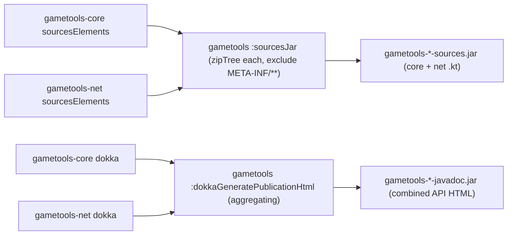

# Plan: fix the empty umbrella `-sources.jar` / `-javadoc.jar` (and every module's empty `-javadoc.jar`)

## Header / Association

- **Covers:** [SpartanLabsGaming/MyGameTools#40](https://github.com/SpartanLabsGaming/MyGameTools/issues/40)
  — *"5.0.0 umbrella `gametools` publishes an empty -sources.jar"* (issue title verbatim).
  Reported against the published artifact `io.github.spartanlabsgaming:gametools:5.0.0`;
  `gametools-core` and `gametools-net` sources jars are unaffected. The issue's "Proposed fix"
  lists three options (aggregate the module source trees / publish no sources jar / document
  the workaround) — this plan takes option 1 (aggregate). Scope was widened during planning to
  also fix the umbrella's empty `-javadoc.jar` (Resolved decisions #3) and then, during
  implementation, the **repo-wide** Dokka bug that also empties every module's `-javadoc.jar`
  (§ 1.2) — the javadoc half cannot land without it.
- **Branch:** `fix/40-umbrella-empty-docs-jars` off latest `master` (per `CONTRIBUTING.md`
  § Branching model, `fix/<issue#>-<slug>`).
- **Commit:** this plan document rides **commit 1** of three on
  `fix/40-umbrella-empty-docs-jars` (the repo-wide Dokka classloader fix) so
  `git log --follow docs/issue-40-umbrella-empty-sources-jar.md` binds plan to implementation.
  See § 7 for the three-commit breakdown.
- **PR:** opens against `master` with `Closes #40` — three commits, see § 7.
- **Status:** **complete on branch `fix/40-umbrella-empty-docs-jars`**; both halves landed.
  The repo-wide Dokka `KotlinBasePlugin` blocker (§ 1.2) is fixed as commit 1 (Kotlin + Dokka
  now applied from the root); the umbrella `-sources.jar` / `-javadoc.jar` aggregation and
  both `verifyUmbrella*` guards are wired into `check` and CI (commit 2); the Level-3 TestKit
  coverage with the javadoc assertions enabled is committed (commit 3). Suite green
  (311/311, including `:build-logic:integrationTest`). Merges to `master` via a merge commit;
  ships with the next release (no `coordinates(...)` bump on this branch).
- **Target version:** **rides the next release — no dedicated version bump on this branch**
  (Resolved decisions #1). #40 lands on `master` and ships with whatever the next
  `release/*` branch cuts (currently trending `5.1.0`, carrying #39 / PR #41). The
  `coordinates(...)` bump and the `CHANGELOG.md` `[Unreleased]` → version-heading move happen
  on that release branch per `CONTRIBUTING.md` § Releasing, never here.
- **Related docs:** `docs/module-split-plan.md` (§ "gametools umbrella module" and its Risks
  list both state the umbrella "emits an empty sources/javadoc jar — Central accepts it";
  this plan supersedes that for **both** jars); `CONTRIBUTING.md` § Module layout,
  § Versioning, § Releasing.

---

## 1. Context

There are **two independent defects** behind the empty umbrella docs artifacts:

- **1.1** — the umbrella carries no source, so its `sourcesJar` / javadoc-jar tasks have
  nothing local to bundle. This is what #40 reports. Fixed by aggregating the two modules'
  output (§ 2).
- **1.2** — a **repo-wide** Dokka v2 configuration bug: *every* module's Dokka publication is
  already empty on `master`, so even after 1.1's aggregation the umbrella `-javadoc.jar` would
  bundle two empty module sites. Must be fixed first. Discovered while implementing 1.1.

### 1.1 Root cause — the umbrella carries no source

The umbrella module carries no source of its own. `gametools/build.gradle.kts` is a
`plugins {}` block, an `api(project(...))` re-export of the two real modules, and a
`mavenPublishing { coordinates(...) }` block. Both the `sourcesJar` and the `javadocJar`
behaviour come entirely from the `gametools.published-library` convention plugin:

`build-logic/src/main/kotlin/gametools.published-library.gradle.kts:20`

```kotlin
configure(JavaLibrary(javadocJar = JavadocJar.Dokka("dokkaGeneratePublicationHtml"), sourcesJar = true))
```

- `sourcesJar = true` makes vanniktech call the Gradle `java` plugin's `withSourcesJar()`,
  which registers a `sourcesJar` `Jar` task bundling `sourceSets["main"].allSource`. For the
  umbrella that source set is empty, so the task produces an archive containing only
  `META-INF/MANIFEST.MF` — the 261-byte jar in the issue.
- `JavadocJar.Dokka("dokkaGeneratePublicationHtml")` makes vanniktech register a **Jar task
  named `dokkaJavadocJar`** (type `com.vanniktech.maven.publish.tasks.JavadocJar`, which
  extends `org.gradle.jvm.tasks.Jar` — *not* the narrower
  `org.gradle.api.tasks.bundling.Jar` the Kotlin-DSL `Jar` accessor resolves to; matters for
  `tasks.named<...>(...)`). There is **no** `javadocJar` task in this repo — confirmed with
  `./gradlew :gametools:tasks --all`. That task copies from **this project's**
  `dokkaGeneratePublicationHtml` output; the umbrella has no source for Dokka to document, so
  it emits a bare HTML shell (index + navigation + the Dokka UI-kit CSS/fonts) and the
  `-javadoc.jar` carries no API pages.

The umbrella's `.jar` (classes) is empty too and stays that way on purpose — classes reach
consumers transitively via the POM / Gradle-module-metadata dependencies on `gametools-core`
and `gametools-net`.

Verified locally against `gametools/build/`:

- `gametools/build/libs/gametools-sources.jar` — `META-INF/`, `META-INF/MANIFEST.MF` only.
- `gametools/build/publications/maven/module.json` — the `sourcesElements` variant lists
  `gametools-5.0.0-sources.jar`, size 261, i.e. the empty archive is what an IDE resolving
  the umbrella's sources variant receives.

### 1.2 Blocker — repo-wide: Dokka v2 cannot see the Kotlin plugin

**Symptom.** `./gradlew :gametools-core:dokkaGeneratePublicationHtml` (and `-net`, and the
root, and `:gametools`) prints, at configuration time:

```
warning: Dokka could not load KotlinBasePlugin in project ':gametools-core', even though
plugin org.jetbrains.kotlin.jvm is applied.
The most common cause is a Gradle limitation: the plugins applied to subprojects should be consistent.
Please try the following:
1. Apply the Dokka and Kotlin plugins to the root project using the `plugins {}` DSL.
   (If the root project does not need the plugins, use 'apply false')
2. Remove the Dokka and Kotlin plugins versions in the subprojects.
```

**Evidence gathered (clean `master`, Gradle 9.7.1):**

- `gametools-core/build/dokka/html/` — **0** `.html` files.
- root `build/dokka/html/` and `gametools/build/dokka/html/` — `index.html` + `navigation.html`
  only, with **empty** `gametools-core/` and `gametools-net/` module directories.
- `gametools/build/libs/gametools-javadoc.jar` — 493 KB but only **2** HTML files; the bulk is
  the Dokka UI-kit (CSS / web-fonts / JS). No API pages. So the published
  `gametools-core-5.0.0-javadoc.jar` / `-net` / `gametools` javadoc jars on Maven Central are
  **all** effectively empty — a pre-existing, unreported defect that predates #40.
- Reproduces after `git stash` of the #40 work → not caused by this branch.

**Root cause.** Dokka's Gradle plugin (DGP) detects Kotlin via
`project.plugins.withType<KotlinBasePlugin>()` (`KotlinAdapter.kt`). That only works if the
`KotlinBasePlugin` *class* visible to DGP is the same class (same classloader) as the one the
Kotlin Gradle plugin (KGP) actually applied. Gradle uses roughly per-project plugin
classloaders and only shares them when the buildscript classpath is **consistent across
projects**. In this repo it is not:

| Project | How KGP is applied | How DGP is applied | DGP version |
| --- | --- | --- | --- |
| root `build.gradle.kts` | **not applied at all** | `plugins { id("org.jetbrains.dokka") }` → `settings.gradle.kts:10` pluginManagement | **2.2.0** |
| `gametools-core` / `-net` / `gametools` | via `gametools.kotlin-library` precompiled convention plugin → `build-logic` classpath | via `gametools.published-library` precompiled convention plugin → `build-logic` classpath | **2.0.0** (`build-logic/build.gradle.kts:15`) |

So DGP is hoisted to the **root/parent** plugin classloader (2.2.0, from pluginManagement),
while KGP only ever lives in **child** (per-module) classloaders (from `build-logic`). DGP
running against a module resolves `KotlinBasePlugin` from its own defining classloader — the
parent — which has no KGP → `ClassNotFoundException` swallowed → the warning → **zero source
sets registered → zero doc pages**. The DGP 2.0.0-vs-2.2.0 split compounds it.

Already tried and **ruled out** by the executor: bumping `build-logic` DGP `2.0.0 → 2.2.0`
alone; additionally putting `org.jetbrains.kotlin:kotlin-gradle-plugin:2.2.0` on the
`build-logic` classpath. Neither makes the root/child classloader split go away, because the
root still never applies KGP.

**Fix (matches the warning's own advice — see § 2 / § 3):** apply KGP (and the Kotlin
serialization plugin) to the **root** project with `apply false`, declare their versions once
in `settings.gradle.kts` pluginManagement next to Dokka, and align `build-logic`'s DGP dep to
`2.2.0`. That hoists KGP and DGP into the *same* root classloader, shared down to every
module, so `withType<KotlinBasePlugin>()` resolves. Ref: Gradle
[#25616](https://github.com/gradle/gradle/issues/25616),
[#35117](https://github.com/gradle/gradle/issues/35117).

### 1.3 How Dokka aggregation is wired (for the umbrella javadoc fix)

- `build.gradle.kts` (root) — holds no source; applies `org.jetbrains.dokka`, declares
  `dokka(project(":gametools-core"))` / `dokka(project(":gametools-net"))`, sets
  `dokka { moduleName.set("GameTools") }`. Its `dokkaGeneratePublicationHtml` is the combined
  framework site (used by the `docs` CI job / local browsing; **not published**).
- `gametools-core` / `gametools-net` `build.gradle.kts` — each has a `dokka { … sourceLink … }`
  block; Dokka itself is applied by the convention plugin. Each module's
  `dokkaGeneratePublicationHtml` documents just that module and feeds its `dokkaJavadocJar`.
- The umbrella (working tree) now declares `dokka(project(":gametools-core"))` /
  `dokka(project(":gametools-net"))` — the same three-line pattern as the root aggregator — so
  its `dokkaGeneratePublicationHtml` aggregates both modules and the existing
  `JavadocJar.Dokka("dokkaGeneratePublicationHtml")` wiring picks it up unchanged. Plus
  `dokka { dokkaSourceSets.configureEach { suppress.set(true) } }` to keep the source-less
  umbrella out of its own site. This is correct and stays — it just produces nothing useful
  until 1.2 is fixed.

### Why it is a papercut

A consumer that takes the umbrella coordinate (the drop-in for the pre-4.0.0 single
`GameTools` artifact) and reaches for the umbrella's `-sources.jar` — a Maven user running
`dependency:sources`, anyone inspecting the artifact directly, or an IDE that maps the
umbrella component to its own sources variant — gets nothing. "Go to declaration" then lands
on decompiled bytecode instead of Kotlin. `-javadoc.jar` has the same hole for quick-doc /
offline API browsing off the umbrella coordinate. Transitive `gametools-core` /
`gametools-net` sources and docs are fine, so a Gradle IDE import that fully resolves
transitive jars is usually unaffected; the umbrella coordinate itself is the hole.

### Acceptance criteria

1. `./gradlew :gametools-core:dokkaGeneratePublicationHtml` (and `-net`, root, `:gametools`)
   runs **without** the "could not load KotlinBasePlugin" warning and produces a non-empty
   `build/dokka/html/` tree (real API pages, not just `index.html` + `navigation.html`).
2. `io.github.spartanlabsgaming:gametools-core:<next-version>-javadoc.jar` and `-net` contain
   that module's rendered Dokka HTML (no longer manifest-plus-chrome).
3. `io.github.spartanlabsgaming:gametools:<next-version>-sources.jar` contains the `.kt`
   source of both `gametools-core` and `gametools-net` (every file that ships in their own
   `-sources.jar`s).
4. `io.github.spartanlabsgaming:gametools:<next-version>-javadoc.jar` contains the rendered
   Dokka HTML for both modules' public API (top-level `index.html` plus per-module pages).
5. The umbrella's `.jar`, `.pom`, `.module`, wire protocol, and public Kotlin API are
   byte-for-byte unchanged in shape (no breaking change; sources/javadoc are documentation
   artifacts). The three modules' `.jar` / `.pom` / `.module` are likewise unchanged — only
   the previously-empty javadoc jars gain content.
6. CI fails if either umbrella jar regresses to empty (`verifyUmbrellaSourcesJar` **and**
   `verifyUmbrellaJavadocJar` wired into `check` and run in the `assemble` job).
7. No new Maven coordinate; `sourcesElements` / `javadocElements` still expose exactly one
   file each, with the same names.

---

## 2. Design

### Staging (three commits — see § 7)

1. **Commit 1 — repo-wide Dokka classloader fix (§ 2.0).** Prerequisite. Makes every module's
   Dokka output real. Independently landable and independently valuable. This plan doc is
   committed here.
2. **Commit 2 — umbrella docs aggregation (§ 2.1).** Sources-jar aggregation (already in the
   working tree) + `verifyUmbrellaJavadocJar` wired into `check` + CI + docs, now that
   commit 1 lets the javadoc guard pass.
3. **Commit 3 — TestKit coverage (§ 5).** `build-logic` test source set + the two test
   classes with the javadoc assertions enabled.

### 2.0 Repo-wide Dokka fix — hoist KGP + Dokka into one shared classloader

Straight from the Dokka warning's own remedy and Gradle #25616:

- **`settings.gradle.kts`** — in `pluginManagement { plugins { … } }`, add the Kotlin JVM and
  Kotlin serialization plugin ids at the same `2.2.0` already used for the marker deps, next
  to the existing Dokka `2.2.0` entry. One version source for all three ecosystem plugins.
- **`build.gradle.kts` (root)** — apply the Kotlin plugins with `apply false` (root has no
  source) alongside the Dokka plugin it already applies:

  ```kotlin
  plugins {
      // Applied only to pull KGP + the Kotlin serialization plugin onto the root's plugin
      // classpath so Gradle shares ONE plugin classloader with every subproject. Without this,
      // Dokka (resolved for the root from settings pluginManagement) sits in the root
      // classloader while KGP (applied to modules by the build-logic convention plugin) sits
      // in per-module child classloaders; Dokka then can't load KotlinBasePlugin and every
      // module's dokkaGeneratePublicationHtml renders an empty site. See issue #40, Gradle #25616.
      id("org.jetbrains.kotlin.jvm") apply false
      id("org.jetbrains.kotlin.plugin.serialization") apply false
      id("org.jetbrains.dokka")
  }
  ```

- **`build-logic/build.gradle.kts`** — bump the DGP dep
  `org.jetbrains.dokka:org.jetbrains.dokka.gradle.plugin:2.0.0 → 2.2.0` so the
  convention-plugin classpath matches settings + root (a single DGP version everywhere). KGP
  and serialization markers are already `2.2.0`; no change there.

Nothing changes in the module build files or the convention plugins — they keep applying KGP
and Dokka by id with no version (step 2 of the warning, "remove versions in subprojects", is
already satisfied here).

**Verification the executor must run** (cannot be pre-verified — Planner does not edit build
files): `./gradlew :gametools-core:dokkaGeneratePublicationHtml --rerun-tasks` → no warning,
`gametools-core/build/dokka/html/` has real `*.html` API pages; then
`./gradlew dokkaGeneratePublicationHtml :gametools:dokkaJavadocJar` → aggregated site +
umbrella javadoc jar both populated.

**Fallback if root `apply false` + version alignment is still not enough** (precompiled-script
classloader isolation can be stubborn): move Dokka application out of the
`gametools.published-library` convention plugin and into each module's own `build.gradle.kts`
`plugins {}` block — `id("org.jetbrains.dokka")` with no version (takes the pluginManagement
`2.2.0`), in `gametools-core`, `gametools-net` and `gametools`. That routes every Dokka
application through the identical `plugins {}` + pluginManagement path the root uses. The
convention plugin then applies only KGP + serialization + vanniktech. `dokka { }` config
blocks stay in the module scripts (already there for `-core`/`-net`; the umbrella's
`suppress` block stays in the umbrella script). Slightly more boilerplate, maximally
consistent classpath.

### 2.1 Chosen approach — umbrella docs aggregation

**Sources jar — aggregate the two modules' `sourcesElements` into the umbrella `sourcesJar`.**
Make the umbrella's existing `sourcesJar` task include the contents of each re-exported
module's own source jar. Consume them through a dedicated **resolvable configuration** that
depends on each module's `sourcesElements` outgoing variant (the variant `withSourcesJar()`
creates and the same one that feeds `gametools-core-*-sources.jar`), then unzip those into
the umbrella jar.

**Javadoc jar — aggregate the two modules' Dokka into the umbrella's
`dokkaGeneratePublicationHtml`.** Add `dokka(project(":gametools-core"))` and
`dokka(project(":gametools-net"))` to the umbrella's `dependencies {}` — the Dokka v2
aggregation mechanism, identical to the root build. `JavadocJar.Dokka("dokkaGeneratePublicationHtml")`
then builds the umbrella `-javadoc.jar` from the combined site with no further wiring.
Suppress the umbrella's own (empty) source set so it does not show as an empty module in its
own aggregated output.

The working-tree shape (already implemented for sources; javadoc guard present but not yet
gated):

```kotlin
val reexportedModuleSources: Configuration = configurations.create("reexportedModuleSources") {
    isCanBeConsumed = false; isCanBeResolved = true; isTransitive = false
}

dependencies {
    reexportedModuleSources(project(path = ":gametools-core", configuration = "sourcesElements"))
    reexportedModuleSources(project(path = ":gametools-net", configuration = "sourcesElements"))
    dokka(project(":gametools-core"))
    dokka(project(":gametools-net"))
}

tasks.named<Jar>("sourcesJar") {
    dependsOn(reexportedModuleSources)   // provider{zipTree} doesn't carry the task dep on its own
    from(provider { reexportedModuleSources.files.map(::zipTree) })
    exclude("META-INF/**")
    duplicatesStrategy = DuplicatesStrategy.EXCLUDE
}

dokka { dokkaSourceSets.configureEach { suppress.set(true) } }

// vanniktech 0.36.0 names the Dokka javadoc jar `dokkaJavadocJar`, type
// com.vanniktech.maven.publish.tasks.JavadocJar : org.gradle.jvm.tasks.Jar.
val umbrellaJavadocJar = tasks.named<org.gradle.jvm.tasks.Jar>("dokkaJavadocJar")

val verifyUmbrellaSourcesJar = tasks.register("verifyUmbrellaSourcesJar") { /* ZipFile scan: >=2 .kt, gameobjects, networking */ }
val verifyUmbrellaJavadocJar = tasks.register("verifyUmbrellaJavadocJar") { /* ZipFile scan: >=20 .html, gameobjects, networking */ }

tasks.named("check") { dependsOn(verifyUmbrellaSourcesJar, verifyUmbrellaJavadocJar) }
```

**Change this revision makes to the working tree:** the working tree currently has
`tasks.named("check") { dependsOn(verifyUmbrellaSourcesJar) }` plus a `NOTE`/`FIXME` comment
explaining the javadoc guard is not wired because module Dokka is empty. Commit 2 adds
`verifyUmbrellaJavadocJar` to that `dependsOn` and deletes the `NOTE`/`FIXME` block — safe
once commit 1 has landed. Both guards use the JDK `ZipFile` (not Gradle `zipTree`) inside
`doLast` and capture only the archive-file `Provider`, so they stay configuration-cache safe.

**Why the `sourcesElements` configuration and not `project(":gametools-core").sourceSets["main"].allSource`:**

- It bundles exactly what each module publishes (survives a module later adding a source
  directory, generated sources, or resource filtering) — the umbrella jar is the union of
  the two published jars by construction.
- Cross-project `project(...).sourceSets` access is not configuration-cache safe and depends
  on evaluation order; a resolvable configuration with a `project(...)` dependency is the
  configuration-cache-friendly, evaluation-order-independent form.
- Proper task-dependency wiring: resolving the configuration pulls each module's `sourcesJar`
  task automatically.

**Why the `dokka(project(...))` aggregation and not `zipTree` of each module's `-javadoc.jar`:**

- Three lines, copied from a pattern already proven in the root build of this repo.
- Cross-module Dokka links resolve (one coherent site) instead of two disjoint HTML trees.
- No dependency on the internal name/output layout of each module's javadoc `Jar` task.

### Jar composition after the fix



The umbrella `.jar` (classes) stays empty on purpose — classes are delivered transitively
and duplicating them would risk split-package / duplicate-class problems on a consumer
classpath. Only the *documentation* artifacts are aggregated, which is safe because a
sources/javadoc jar is never on the compile or runtime classpath.

### Alternatives considered

| Option | Verdict |
| --- | --- |
| **Publish no `-sources.jar` / `-javadoc.jar` for the umbrella** (`sourcesJar = false` etc.) | Rejected. `module-split-plan.md` records that Central *accepts* the empty jars, not that it accepts *missing* ones — validation risk. And it improves no consumer: the umbrella coordinate would still resolve nothing, just via absence instead of an empty file. |
| **Documentation only** ("depend on `-core` / `-net` for sources") | Rejected as *the* fix — leaves the papercut for every umbrella consumer. Kept as a supporting README line (Resolved decisions #4). |
| **Aggregate classes into the umbrella `.jar` too** (fat/shadow umbrella) | Rejected. Contradicts the "carries no source of its own" design; puts the same classes on the classpath twice; solves no problem. |
| **`project(...).sourceSets["main"].allSource` for sources** | Rejected — not configuration-cache safe; evaluation-order fragile. |
| **`zipTree` each module's `-javadoc.jar` into the umbrella javadoc jar** | Rejected in favour of Dokka `dokka(project(...))` aggregation — see above. (Also would not have helped: the module javadoc jars are themselves empty — § 1.2.) |
| **Fix javadoc in a later, separate issue** | Was the prior recommendation; **overridden** — Resolved decisions #3 pulls it into this change. |
| **Fix the Dokka `KotlinBasePlugin` blocker in a separate issue/PR** | Rejected — the coordinator confirmed the human wants it in this run, and the umbrella javadoc half cannot be delivered or CI-gated without it. Folded in as commit 1. |
| **Dokka blocker: only bump `build-logic` DGP 2.0.0→2.2.0** | Insufficient — the executor tried it; the root still never applies KGP, so the root/child classloader split remains. |
| **Dokka blocker: add `kotlin-gradle-plugin` to the `build-logic` classpath** | Insufficient — same reason; also redundant (the KGP marker already pulls it). |
| **Dokka blocker: apply Dokka directly in each module `build.gradle.kts` instead of via the convention plugin** | Kept as the documented **fallback** (§ 2.0) if root `apply false` + version alignment is not enough. Not the first choice — more boilerplate, moves shared config out of `build-logic`. |

---

## 3. File-by-file changes

Three commits. Files already touched in the working tree are marked **(WT)**; the rest are
new work this revision adds.

### Commit 1 — repo-wide Dokka `KotlinBasePlugin` fix (prerequisite)

#### `settings.gradle.kts` — declare the Kotlin plugin versions in pluginManagement

- In `pluginManagement { plugins { … } }`, next to the existing
  `id("org.jetbrains.dokka") version "2.2.0"`, add:

  ```kotlin
  id("org.jetbrains.kotlin.jvm") version "2.2.0"
  id("org.jetbrains.kotlin.plugin.serialization") version "2.2.0"
  ```

- Extend the existing explanatory comment: the version is declared once here so the root
  `plugins {}` block can apply KGP/serialization with no version, matching how the modules
  apply them (by id, via the convention plugin) and how the `build-logic` marker deps are
  pinned — one consistent version across the whole build so Gradle shares one plugin
  classloader.

#### `build.gradle.kts` (root) — apply KGP + serialization with `apply false`

```kotlin
plugins {
    // issue #40 (javadoc half): hoist KGP + the Kotlin serialization plugin onto the root's
    // plugin classpath so every subproject shares ONE plugin classloader with Dokka.
    // Without this, Dokka (root, from settings pluginManagement) and KGP (modules, via the
    // build-logic convention plugin) sit in sibling classloaders, Dokka can't load
    // KotlinBasePlugin, and every module's dokkaGeneratePublicationHtml renders an empty
    // site. Gradle #25616 / #35117; Dokka prints the remedy in its own warning.
    id("org.jetbrains.kotlin.jvm") apply false
    id("org.jetbrains.kotlin.plugin.serialization") apply false
    id("org.jetbrains.dokka")
}
```

The `dependencies { dokka(project(...)) }` and `dokka { moduleName.set("GameTools") }` blocks
are unchanged.

#### `build-logic/build.gradle.kts` **(WT)** — align the DGP version

- Change `implementation("org.jetbrains.dokka:org.jetbrains.dokka.gradle.plugin:2.0.0")` →
  `:2.2.0`. The KGP and serialization markers are already `2.2.0`.
- (The WT already added the `java.time.Duration` import + JUnit/TestKit deps + `integrationTest`
  task + `test` filter for commit 3 — leave those; this bump is the only commit-1 change here.
  If keeping commits clean matters, the DGP bump can be staged into commit 1 and the rest
  `git add -p`-ed into commit 3.)

#### No change to `gametools-core/build.gradle.kts` / `gametools-net/build.gradle.kts` / the convention plugins

They keep applying KGP + Dokka by id with no version. Step 2 of the Dokka remedy ("remove
versions in subprojects") is already satisfied. **Only** touch them if the § 2.0 fallback is
needed.

#### Executor verification for commit 1 (build-file edits the Planner cannot pre-run)

```
./gradlew :gametools-core:dokkaGeneratePublicationHtml --rerun-tasks   # no warning; real *.html
./gradlew :gametools-net:dokkaGeneratePublicationHtml  --rerun-tasks
./gradlew dokkaGeneratePublicationHtml                                 # root aggregate: per-module pages, not empty dirs
./gradlew :gametools-core:dokkaJavadocJar :gametools-net:dokkaJavadocJar
unzip -l gametools-core/build/libs/gametools-core-javadoc.jar          # many *.html, not MANIFEST-only
./gradlew build componentTest deterministicTest                        # nothing else regressed
```

If the warning persists, apply the § 2.0 fallback (Dokka in each module `plugins {}` block).

---

### Commit 2 — umbrella docs aggregation + gate the javadoc guard

#### `gametools/build.gradle.kts` **(WT, one change)**

Working tree already has: `reexportedModuleSources` config, the `dokka(project(...))` deps,
the `sourcesJar` `from(zipTree)` wiring, `dokka { …suppress… }`,
`val umbrellaJavadocJar = tasks.named<org.gradle.jvm.tasks.Jar>("dokkaJavadocJar")`,
`verifyUmbrellaSourcesJar`, `verifyUmbrellaJavadocJar`, and
`tasks.named("check") { dependsOn(verifyUmbrellaSourcesJar) }` with a `NOTE`/`FIXME` comment
block above `verifyUmbrellaJavadocJar` saying it is not gated because module Dokka is empty.

- **Change:** `tasks.named("check") { dependsOn(verifyUmbrellaSourcesJar, verifyUmbrellaJavadocJar) }`.
- **Delete** the `// NOTE (Rookie-Dev): …` + `// FIXME(issue #40 javadoc half): …` comment
  block — the blocker is resolved by commit 1.
- Keep everything else. Task name is `dokkaJavadocJar` (confirmed via `:gametools:tasks --all`);
  do **not** rename to `javadocJar` (no such task).
- Verify the `verifyUmbrellaJavadocJar` heuristics against the now-real aggregated tree:
  `./gradlew :gametools:dokkaGeneratePublicationHtml` then inspect the output dir. Expected
  shape for Dokka v2 aggregation is per-module dirs (`gametools-core/`, `gametools-net/`) each
  containing package/type `*.html`; the `>= 20` floor and the `gameobjects` / `networking`
  path substrings should hold but tune if the real layout differs.

#### `.github/workflows/ci.yml` **(WT, extend)**

- WT already changed the `assemble` job to
  `./gradlew assemble :gametools:verifyUmbrellaSourcesJar --stacktrace`. Add the javadoc guard:

  ```yaml
        - run: ./gradlew assemble :gametools:verifyUmbrellaSourcesJar :gametools:verifyUmbrellaJavadocJar --stacktrace
  ```

- `assemble` builds `dokkaJavadocJar` (via the publication wiring), which after commit 1
  triggers the umbrella `dokkaGeneratePublicationHtml` aggregation. Marginal CI cost: one
  module-pair Dokka render + two `ZipFile` scans. See § 6.
- *(Optional, recommended)* also strengthen the existing **`docs`** job — it runs
  `./gradlew dokkaGeneratePublicationHtml` and currently passes on empty output. A one-line
  guard (`test -n "$(find build/dokka -name '*.html' -path '*gametools-core*')"`) or a small
  root-project `verifyAggregatedDokka` task would catch a future module-Dokka regression at
  the source. Left as a follow-up if it bloats this PR.

#### `CHANGELOG.md` **(WT, replace the entry)**

Replace the WT `### Fixed` bullet (currently sources-only) with two bullets:

> ### Fixed
> - **Every module's published `-javadoc.jar` was empty.** `gametools-core-5.0.0-javadoc.jar`,
>   `gametools-net-5.0.0-javadoc.jar` and the `gametools` umbrella javadoc jar all shipped
>   with no API pages — Dokka could not see the Kotlin plugin through the convention-plugin
>   classloader split ("could not load KotlinBasePlugin"). The Kotlin and Dokka plugins are
>   now applied consistently from the root build, so every module's Dokka publication renders
>   real HTML. (#40)
> - **The `io.github.spartanlabsgaming:gametools` umbrella published empty `-sources.jar` and
>   `-javadoc.jar`.** They now bundle the Kotlin source and the combined Dokka API
>   documentation of both `gametools-core` and `gametools-net`. IDE "Go to declaration" and
>   quick-doc on a GameTools type reached through the umbrella coordinate now resolve. Binary,
>   POM and wire protocol are unchanged. (#40)

#### `README.md` **(WT, adjust wording)**

- The WT added a `> **Sources.**` blockquote (sources-only). Change it to cover both jars:

  ```markdown
  > **Sources & docs.** The `gametools` umbrella's `-sources.jar` and `-javadoc.jar` bundle the
  > Kotlin sources and combined Dokka API docs of *both* `gametools-core` and `gametools-net`,
  > so IDE "Go to declaration" and quick-doc resolve through the single umbrella coordinate.
  > (Releases before this one shipped empty sources/javadoc jars — see
  > [#40](https://github.com/SpartanLabsGaming/MyGameTools/issues/40).)
  ```

- The WT "🛠️ Building & Documentation" section already says *"published as the Javadoc
  artifact alongside each Maven Central release"* — that is now finally true; no edit needed,
  but sanity-check the sentence still reads correctly.
- The WT Testing paragraph (`:build-logic:integrationTest`) — update "`-sources.jar`" →
  "`-sources.jar` / `-javadoc.jar`" to match commit 3's re-enabled assertion.

#### `docs/module-split-plan.md` **(WT, adjust wording)**

- WT line ~202 note currently says the `-javadoc.jar` "is still empty, blocked on a repo-wide
  Dokka v2 issue". Change to: *"(both the `-sources.jar` and `-javadoc.jar` are populated
  since #40 — the umbrella folds in each module's `sourcesElements` and aggregates both
  modules' Dokka; the repo-wide Dokka `KotlinBasePlugin` blocker was fixed in the same PR).
  The `.jar` (classes) stays deliberately empty."*
- WT Risks "Empty umbrella jar" note — same: drop "the `-javadoc.jar` fix is still pending".

#### `docs/issue-40-umbrella-empty-sources-jar.md` — this document

`git add`-ed into **commit 1** (with the Dokka fix) so `git log --follow` binds plan to the
first implementation commit.

---

### Commit 3 — TestKit coverage (`build-logic` test source set)

#### `build-logic/build.gradle.kts` **(WT)**

Already implemented in the working tree: `java.time.Duration` import; `junit-bom:5.11.4`
platform + `junit-jupiter` + `gradleTestKit()` + `junit-platform-launcher` test deps;
`tasks.register<Test>("integrationTest")` (group `verification`, filters
`gametools.testing.integration.*`, `systemProperty("gametools.repoRoot", …/"..")`, 15-min
timeout); `tasks.named<Test>("test")` with `useJUnitPlatform()` + an
`excludeTestsMatching("gametools.testing.integration.*")` filter so `./gradlew build` does not
spawn nested Gradle builds. No further change needed. (Notes: no version catalog in this repo
— literal coordinate strings are correct; verify `5.11.4` is still current 5.x at
implementation.)

#### `build-logic/src/test/kotlin/gametools/testing/integration/UmbrellaArtifactAggregationTest.kt` **(WT — re-enable javadoc)**

Working tree has `sourcesJarBundlesKotlinFromBothModules`, `sourcesJarHasExactlyOneManifest`
and `regressionGuardsSucceedOnTheRealBuild` live, and `javadocJarBundlesApiDocsFromBothModules`
`@Disabled` with a message about the Dokka blocker. This revision (numbering per the § 5
table):

- **Remove the `@Disabled` annotation** from `javadocJarBundlesApiDocsFromBothModules`.
- Add `":gametools:dokkaJavadocJar"` and `":gametools:verifyUmbrellaJavadocJar"` to the
  `@BeforeAll` `GradleRunner.withArguments(...)` list (currently only `:gametools:sourcesJar`
  + `:gametools:verifyUmbrellaSourcesJar`).
- Extend `regressionGuardsSucceedOnTheRealBuild` (or add `javadocGuardSucceedsOnTheRealBuild`)
  to assert `result.task(":gametools:verifyUmbrellaJavadocJar")?.outcome == TaskOutcome.SUCCESS`.
- Add `moduleDokkaJavadocJarIsNotEmpty` — the direct regression guard for the § 2.0 fix:
  `@BeforeAll` also runs `:gametools-core:dokkaJavadocJar`; the test opens
  `gametools-core/build/libs/gametools-core-*-javadoc.jar` and asserts `> 20` `*.html` entries
  including a `gameobjects` path. If commit 1's classloader fix ever regresses, this reds
  before the umbrella-level test does, pointing at the real cause.

#### `build-logic/src/test/kotlin/gametools/testing/integration/UmbrellaVerifyTaskContractTest.kt` **(WT)**

Already implemented: throwaway `@TempDir` project, empty `withSourcesJar()`, a copy of the
`verifyUmbrellaSourcesJar` `check(...)` contract, `GradleRunner.…buildAndFail()`, asserts the
output contains "Umbrella sources jar has too few .kt files". No change required. *(Optional:
add a sibling `presenceCheckFailsWhenJavadocJarIsEmpty` mirroring it for the html contract.)*

#### `.github/workflows/ci.yml` **(WT)**

Already adds the `build-logic-tests` job running `./gradlew :build-logic:integrationTest`
with a `build-logic-test-reports` artifact upload on failure. No change.

---

## 4. Documentation impact (Audience-Reach rings)

| Ring | Touched? | What moves |
| --- | --- | --- |
| **Inner core** (in-editor) | Yes | `//region` block + why-comment + `// issue #40` marker on the new build code, per `.aiassistant/rules/CLAUDE.md` §5. |
| **Component ring** (KDoc / API contract) | No | No Kotlin API, class, or signature change. |
| **Boundary ring** (protocol / integration) | Yes | The Maven coordinate is a cross-project contract. `CHANGELOG.md [Unreleased]` gains two `### Fixed` bullets (module javadoc jars + umbrella docs jars); `README.md` Installation gains the sources/docs note. |
| **Architectural outer layer** | Minor | This plan document; the build-topology change (Kotlin/Dokka plugins now applied from the root — a deliberate, documented `plugins {}` layout choice, comment in `build.gradle.kts` + `settings.gradle.kts`); de-stale note in `docs/module-split-plan.md`; README Testing paragraph for the new `:build-logic:integrationTest` task. No C4 diagram change. |

README **is** updated this change: a new build/test task (`:build-logic:integrationTest`) and
a behavioural note about the published artifacts both count under the global README-currency
rule. Exact wording and insertion points are in § 3 (`README.md`).

---

## 5. Test plan (5-level hierarchy)

The change is build/packaging logic, so the automated tests are build-tool tests.

### Level 1 — Local Development Gating (`testing.gating`, manual/local, pre-commit)

Run on the fix branch before pushing; nothing committed as a test class.

**After commit 1 (Dokka fix):**
- `./gradlew :gametools-core:dokkaGeneratePublicationHtml :gametools-net:dokkaGeneratePublicationHtml --rerun-tasks`
  — no "could not load KotlinBasePlugin" warning; `*/build/dokka/html/` has real API pages.
- `./gradlew :gametools-core:dokkaJavadocJar` then `unzip -l …-core-javadoc.jar` — many
  `*.html`, not MANIFEST-only.
- `./gradlew build componentTest deterministicTest` — nothing else regressed (KGP now on the
  root classpath must not change compilation).

**After commit 2 (umbrella aggregation):**
- `./gradlew :gametools:sourcesJar` then `unzip -l gametools/build/libs/gametools-sources.jar`
  — expect `.kt` under `com/spartanlabs/gaming/gameobjects/`, `.../spatial/`, `.../event/`,
  `.../simulation/`, `com/spartanlabs/geometry/serializations/` (core) **and**
  `com/spartanlabs/gaming/networking/` (net); exactly one `META-INF/MANIFEST.MF`.
- `./gradlew :gametools:dokkaJavadocJar` then `unzip -l gametools/build/libs/gametools-javadoc.jar`
  — top-level `index.html` plus non-empty `gametools-core/` and `gametools-net/` HTML trees.
- `./gradlew :gametools:verifyUmbrellaSourcesJar :gametools:verifyUmbrellaJavadocJar` — pass.
- `./gradlew build` — green across all modules (both `check` deps run here).
- `./gradlew dokkaGeneratePublicationHtml` — green; root aggregate now has real per-module pages.
- Run `:gametools:sourcesJar` and `:gametools:dokkaJavadocJar` twice from clean; diff the jar
  digests (reproducibility, § 6).

**After commit 3 (tests):**
- `./gradlew :build-logic:integrationTest` — green.
- `./gradlew :build-logic:test --dry-run` — confirms no `testing.integration` class is selected.

### Level 3 — Integration & External Interfaces (`testing.integration`)

**New, committed (commit 3).** Two classes, two files, package `gametools.testing.integration`:

| File | Purpose |
| --- | --- |
| `.../testing/integration/UmbrellaArtifactAggregationTest.kt` | Tests 1–5 — the real module + umbrella jars are populated (positive direction). |
| `.../testing/integration/UmbrellaVerifyTaskContractTest.kt` | Test 6 — the presence-check *fails* when nothing is aggregated (negative direction; Resolved decisions #2, "assert `verifyUmbrellaSourcesJar` fails when the aggregation is removed"). |

Folder `build-logic/src/test/kotlin/gametools/testing/integration/`. Tooling: Gradle TestKit
(`gradleTestKit()`), JUnit 5. Bound to `:build-logic:integrationTest` by the package filter
(§ 3), mirroring the modules' `registerLevelTest("integrationTest", "integration", …)`
convention in `gametools.kotlin-library.gradle.kts:68`.

Structure of `UmbrellaArtifactAggregationTest`:

- `@BeforeAll` — run one nested build against the real repo and keep the `BuildResult`:

  ```kotlin
  private val repoRoot = File(System.getProperty("gametools.repoRoot"))
  result = GradleRunner.create()
      .withProjectDir(repoRoot)
      .withArguments(
          ":gametools:sourcesJar", ":gametools:dokkaJavadocJar",
          ":gametools-core:dokkaJavadocJar",
          ":gametools:verifyUmbrellaSourcesJar", ":gametools:verifyUmbrellaJavadocJar",
          "--stacktrace",
      )
      .forwardOutput()
      .build()
  ```

  (Task name is `dokkaJavadocJar`, not `javadocJar` — verified against this repo.)

- Helpers: locate `gametools/build/libs/gametools*-sources.jar` / `gametools*-javadoc.jar` and
  `gametools-core/build/libs/gametools-core*-javadoc.jar` (single match each); read entry
  names via `java.util.zip.ZipFile`.

Behaviours locked down (one `@Test` each):

| # | Test | Asserts |
| --- | --- | --- |
| 1 | `sourcesJarBundlesKotlinFromBothModules` | sources jar has `**/*.kt` entries whose path contains a `gametools-core` package fragment (`gameobjects`) **and** one containing `networking` (net). |
| 2 | `sourcesJarHasExactlyOneManifest` | exactly one `META-INF/MANIFEST.MF` entry; no stray `META-INF/` from the folded module jars. |
| 3 | `javadocJarBundlesApiDocsFromBothModules` | umbrella javadoc jar contains a top-level `index.html` and `.html` pages whose path references both a core package (`gameobjects`) and a net package (`networking`); `>= 20` html entries (well above the source-less/empty baseline of 2). **`@Disabled` in the working tree — this revision removes that annotation.** |
| 4 | `moduleDokkaJavadocJarIsNotEmpty` | **new** — `gametools-core-*-javadoc.jar` has `> 20` `*.html` entries including a `gameobjects` path. Direct regression guard for the commit-1 classloader fix: reds *before* test 3 if module Dokka breaks again, pointing at the real cause rather than the aggregation. |
| 5 | `regressionGuardsSucceedOnTheRealBuild` | `result.task(":gametools:verifyUmbrellaSourcesJar")?.outcome` **and** `...verifyUmbrellaJavadocJar` are `SUCCESS` (not `SKIPPED` / `NO-SOURCE` / `FAILED`). Because those tasks fail the build on regression, a mis-wired aggregation makes the `@BeforeAll` `.build()` throw — so shared setup + this method is the "guard runs and passes on a correct build" check. (WT currently asserts only the sources guard; add the javadoc one.) |

`UmbrellaVerifyTaskContractTest` (test 6, **required** — the negative direction):

| # | Test | Asserts |
| --- | --- | --- |
| 6 | `presenceCheckFailsWhenNothingIsAggregated` | In a `@TempDir`, write a minimal `settings.gradle.kts` + `build.gradle.kts` that applies `java`, calls `withSourcesJar()` on an empty source set, and registers a `verifyUmbrellaSourcesJar` task carrying the **same** `check(kt.size >= 2)` / "missing gametools-core" / "missing gametools-net" body as the production task (copied, not imported — build logic is not on the test classpath as a library). `GradleRunner.create().withProjectDir(tmp).withArguments("verifyUmbrellaSourcesJar").buildAndFail()`; assert the failure output contains the "too few .kt files" message. This is the committed stand-in for "delete the aggregation and watch the guard fail" — it exercises the guard's own contract without mutating the real build. Already implemented in the WT. *(Optional: a sibling for the javadoc html contract.)* |

Notes:
- The nested builds re-resolve WebTools / GeneralTools from Maven Central; in CI these are
  cached by `gradle/actions/setup-gradle`. Test 5's throwaway project pulls nothing external.
- `GradleRunner` runs without `.withPluginClasspath()` here — the real project already has
  `build-logic` on its classpath via `includeBuild`, and the temp project in test 5 uses only
  core Gradle plugins.
- If the `@BeforeAll` build is too slow to run per class, the two classes can share it via a
  JUnit 5 `@ExtendWith` resource or a top-level object; keep one class per file regardless.

### Level 5 — UAT / Exploratory (`testing.uat`, manual, cannot be automated here)

After the next release is published to Maven Central (the user runs the publish):

- Fetch `gametools-<ver>-sources.jar` and `-javadoc.jar` and
  `gametools-core-<ver>-javadoc.jar` / `gametools-net-<ver>-javadoc.jar` from
  `repo1.maven.org`, `unzip -l` — cross-module `.kt` / `.html` present in the umbrella jars,
  real API pages in each module javadoc jar.
- Bump `SpartanLabsGaming/GameGraphics` to `<ver>`, reload Gradle / re-download sources, and
  "Go to declaration" + quick-doc on `Stats`, `World`, `GameServer` — lands on `.kt` /
  renders Dokka HTML, not decompiled bytecode.

### Cannot be automated in this repo

- Maven Central publication and its server-side validation (deliberate human step,
  `CONTRIBUTING.md` § Releasing step 6).
- Real-IDE source/doc attachment behaviour in a downstream repo (Level 5 above).

---

## 6. Risks & edge cases

- **Dokka classloader fix may not be enough with root `apply false`.** Precompiled-script-plugin
  classloader isolation (Gradle #25616) is stubborn; the Dokka team's own remedy is exactly
  what commit 1 does, but if `:gametools-core:dokkaGeneratePublicationHtml --rerun-tasks`
  still warns, fall back to applying `id("org.jetbrains.dokka")` directly in each module's
  `plugins {}` block and removing it from the convention plugin (§ 2.0 fallback). Executor
  must verify; Planner cannot (no build-file edits).
- **KGP now on the root classpath.** `id("org.jetbrains.kotlin.jvm") apply false` at the root
  only adds KGP to the classpath — it does not apply it, and the root has no source. Low risk,
  but re-run `./gradlew build` + all test levels after commit 1 to confirm module compilation
  and the `jvmToolchain(23)` behaviour are unchanged.
- **Serialization plugin version lockstep.** `org.jetbrains.kotlin.plugin.serialization` must
  stay on the *same* version as KGP (`2.2.0`). Adding it to `settings.gradle.kts`
  pluginManagement at `2.2.0` alongside KGP keeps them in lockstep, matching the existing
  `build-logic` marker deps.
- **DGP 2.0.0 → 2.2.0 bump.** Commit 1 aligns `build-logic`'s DGP to the `2.2.0` already in
  `settings.gradle.kts`. Both are Dokka v2 (`V2Enabled` flag in `gradle.properties` stays
  valid). Skim the module `dokka { sourceLink { … } }` blocks still resolve after the bump
  (the `sourceLink` DSL is unchanged across 2.0→2.2).
- **vanniktech javadoc task name.** Confirmed **`dokkaJavadocJar`** (type
  `com.vanniktech.maven.publish.tasks.JavadocJar : org.gradle.jvm.tasks.Jar`) via
  `./gradlew :gametools:tasks --all` — there is no `javadocJar`. The `sourcesJar` task is
  standard. Re-confirm if vanniktech is upgraded.
- **`sourcesElements` variant name.** Standard for the `java` plugin's `withSourcesJar()`,
  stable across Gradle 9.x. Cross-project resolution via `project(path=…, configuration=…)`
  is supported.
- **Dokka aggregation cost.** After the fix, the umbrella's `dokkaGeneratePublicationHtml`
  aggregates both modules — the same work the root aggregator already does, so
  `./gradlew dokkaGeneratePublicationHtml` and `assemble` do it **twice** (and, now that
  module Dokka actually renders, each render is no longer a no-op — the `docs` CI job and
  `assemble` get materially slower, order tens of seconds). Acceptable for docs/release
  tasks. *Follow-up (not this PR):* drop the root aggregator and point local doc browsing at
  `:gametools:dokkaGeneratePublicationHtml` to de-duplicate — a change to the root build's
  stated purpose, out of scope here.
- **Empty umbrella module in its own Dokka site.** Mitigated by
  `dokkaSourceSets.configureEach { suppress.set(true) }` on the umbrella. Verify the combined
  site has no stray empty "gametools" module entry.
- **`verifyUmbrellaJavadocJar` heuristics.** The `>= 20` html floor and the
  `gameobjects` / `networking` path substrings are best-guess for the Dokka v2 aggregated
  layout; eyeball the real tree once (after commit 1, so it is populated) and tune. Keep the
  check permissive enough not to be brittle across Dokka patch versions, strict enough to
  catch "manifest-only" and "one module missing".
- **Reproducible builds.** Current empty jars have normalised `1980-02-01` timestamps, so
  reproducible-jar settings are active. Folding `zipTree` entries carries each source jar's
  already-normalised entries. Verify the umbrella `-sources.jar` is byte-stable across two
  clean runs; if not, set `isPreserveFileTimestamps = false` / `isReproducibleFileOrder = true`
  on the task. Dokka HTML output ordering is generally stable; confirm the `-javadoc.jar`
  digest is stable across two clean runs too.
- **Configuration cache.** The resolvable-configuration and `dokka(project(...))` approaches
  are CC-safe; the guards read archives with the JDK `ZipFile` and capture only the
  archive-file `Provider` (no `project` / script-helper reference in `doLast`). Run
  `./gradlew :gametools:sourcesJar :gametools:dokkaJavadocJar --configuration-cache` once to
  confirm (CC is not enabled by default in this repo, but staying compatible is cheap).
- **Package overlap between modules.** Today none (core is `…gameobjects/spatial/event/
  simulation` + `com.spartanlabs.geometry.serializations`; net is `…networking`).
  `DuplicatesStrategy.EXCLUDE` guards a future same-path collision but would silently drop the
  second copy — acceptable for a docs artifact; note it if a module boundary ever moves.
- **Nested-build test flakiness / runtime.** `:build-logic:integrationTest` spawns a full
  nested Gradle build. Isolated to its own CI job; 15-minute task timeout; not on the local
  `build` graph. If it proves flaky in CI, retry-once is acceptable for this job only.
- **Default `build-logic` `test` task must stay light.** The `kotlin-dsl` plugin makes `test`
  part of `check`/`build`. The TestKit classes live in the same `src/test` tree, so `test`
  **must** exclude `gametools.testing.integration.*` (§ 3) or `./gradlew build` starts
  spawning nested Gradle builds. Verify with `./gradlew :build-logic:test --dry-run` that no
  integration class is selected.
- **TestKit Gradle version.** `GradleRunner` defaults to the wrapper version
  (`gradle/wrapper/gradle-wrapper.properties`); do not pin `.withGradleVersion(...)` so the
  test tracks the repo's own Gradle.
- **Artifact size.** Umbrella sources jar 261 B → ~sum of the two module source jars; every
  javadoc jar (three modules + umbrella) 261 B → a rendered Dokka site (each low single-digit
  MB — the UI-kit is already ~0.5 MB even when empty). Negligible for Central.
- **Breaking change:** none. Published Kotlin API, every `.jar` (classes), `.pom`, `.module`
  dependency list, and wire protocol unchanged across all four coordinates.
  `sourcesElements` / `javadocElements` still expose one same-named file each. The clean-break
  API-evolution rule does not apply (no signature changes). The build-topology change (root
  now applies KGP/Dokka) is internal — not visible to consumers.
- **Central validation:** strictly safer than today — non-empty archives replace empty ones
  that already passed, for all four coordinates.

### Cross-repo impact

- **`SpartanLabsGaming/GameGraphics`** — `build.gradle.kts` declares
  `api("io.github.spartanlabsgaming:gametools:5.0.0")`. After release: bump version, reload
  Gradle, re-download sources/docs. **No code change.** Per `no-downstream-consumer-issues`,
  do **not** file an issue.
- **`SpartanLabsGaming/MyGameServer`** — declares
  `implementation("io.github.spartanlabsgaming:gametools:5.0.0")`. Same: version bump only,
  when convenient. No issue filed.
- **`SpartanLaboratories/WebTools`, `SpartanLaboratories/GeneralTools`** — not affected.
- No protocol or shared-type change, so no coordinated cross-repo release.

---

## 7. Version control

- **Branch:** `fix/40-umbrella-empty-docs-jars` (already created, off `master`). The working
  tree currently holds a mix of commit-2 and commit-3 work (see § 3 **(WT)** marks) and
  nothing unrelated. The executor should **restructure into the three commits below** — e.g.
  `git reset --soft` to `master` then re-stage — so the Dokka fix lands first and each commit
  is coherent. No unrelated pre-existing changes to isolate.
- **Commits** (semi-linear; rebase locally, merge with "Create a merge commit"):
  1. `fix(build): apply Kotlin & Dokka from the root so module Dokka renders`
     — `settings.gradle.kts` (KGP + serialization in pluginManagement),
     `build.gradle.kts` root (`apply false` for KGP + serialization),
     `build-logic/build.gradle.kts` (DGP `2.0.0 → 2.2.0` only),
     `CHANGELOG.md` `[Unreleased]` `### Fixed` (the "every module javadoc jar was empty"
     bullet), and `docs/issue-40-umbrella-empty-sources-jar.md` (this plan — same commit,
     binds plan to first implementation commit). Body: cite the Dokka warning + Gradle #25616;
     `Refs #40`.
  2. `fix(build): populate the umbrella -sources.jar and -javadoc.jar`
     — `gametools/build.gradle.kts` (`reexportedModuleSources` + `sourcesJar` wiring +
     `dokka(project(...))` + `suppress` + both `verifyUmbrella*` tasks + `check` dependsOn
     **both**; delete the `NOTE`/`FIXME` block),
     `.github/workflows/ci.yml` (`assemble` job runs **both** verify tasks),
     `CHANGELOG.md` (the umbrella-jars bullet), `README.md` Installation "Sources & docs"
     blockquote, `docs/module-split-plan.md` de-stale. `Refs #40`.
  3. `test(build): TestKit coverage for the module & umbrella documentation jars`
     — `build-logic/build.gradle.kts` (JUnit 5 + TestKit deps + `integrationTest` task +
     `test` exclusion of `testing.integration`; keep the DGP bump in commit 1),
     `build-logic/src/test/kotlin/gametools/testing/integration/UmbrellaArtifactAggregationTest.kt`
     (with the javadoc assertions **enabled** + the new module-jar test),
     `build-logic/src/test/kotlin/gametools/testing/integration/UmbrellaVerifyTaskContractTest.kt`,
     `README.md` Testing paragraph, `.github/workflows/ci.yml` (`build-logic-tests` job).
     `Refs #40`.
- **Commit body:** Conventional Commits, "why not what", `Refs #40`. PR description
  `Closes #40`. PR title must itself be a valid Conventional Commit (it becomes the merge
  subject). Trailer convention: this repo uses `Refs #` / `Closes #` footers; merge via
  GitHub "Create a merge commit" only.
- **Not a release commit.** No `coordinates(...)` bump on this branch (Resolved decisions #1).
  The version bump and the `CHANGELOG.md` `[Unreleased]` → version-heading move happen on a
  later `release/*` branch per `CONTRIBUTING.md` § Releasing.
- **Publish** (`./gradlew publishAndReleaseToMavenCentral`) is the user's manual step at
  release time.

---

## 8. Open decisions

The four original decisions were resolved by the human on 2026-09-07 (release vehicle: ride
the next release; test depth: TestKit now; empty `-javadoc.jar`: in scope; README note: add
it). The blocker (§ 1.2) was resolved on 2026-09-07 too: fix it in this same PR as commit 1.

One item is genuinely the human's call:

| # | Decision | Recommendation |
| --- | --- | --- |
| A | **File a tracking GitHub issue for the repo-wide empty-javadoc-jars defect?** It affects the *published* `gametools-core:5.0.0` / `-net:5.0.0` / `gametools:5.0.0` javadoc jars (and every `4.x`), which is broader than #40's "umbrella `-sources.jar`". Per `~/.claude/CLAUDE.md` ("surface issues"), a defect in a Spartan Labs repo normally gets an issue. | **Do not open a separate issue.** It is fixed in the same PR that this plan drives; a same-day open-then-close adds noise. Instead: (i) the commit-1 `CHANGELOG.md` bullet already records it, and (ii) the PR description should call it out explicitly ("also fixes: all module `-javadoc.jar`s were empty on `master` — Dokka/KGP classloader split"). If the human prefers a paper trail, file it and let this PR close it — either is fine; needs a yes/no before the executor writes the PR body. |

---

## 9. Sequencing & follow-ups

1. **Restructure the working tree** into three commits (`git reset --soft master`, re-stage).
   Decide Open decision A (issue or PR-body note).
2. **Commit 1 — Dokka fix.** Edit `settings.gradle.kts` (KGP + serialization in
   pluginManagement), root `build.gradle.kts` (`apply false`), `build-logic/build.gradle.kts`
   (DGP `2.0.0 → 2.2.0`). `CHANGELOG.md` module-javadoc bullet. `git add` this plan.
   **Verify:** `./gradlew :gametools-core:dokkaGeneratePublicationHtml :gametools-net:dokkaGeneratePublicationHtml --rerun-tasks`
   → no "KotlinBasePlugin" warning, real `*.html`; `unzip -l gametools-core/build/libs/*-javadoc.jar`
   → many html; `./gradlew build componentTest deterministicTest` green. If the warning
   persists → § 2.0 fallback (Dokka in each module `plugins {}`).
3. **Commit 2 — umbrella aggregation.** `gametools/build.gradle.kts`: add
   `verifyUmbrellaJavadocJar` to the `check` `dependsOn`, delete the `NOTE`/`FIXME` block.
   `ci.yml` `assemble` job runs both verify tasks. `CHANGELOG.md` umbrella bullet, `README.md`
   "Sources & docs" blockquote, `docs/module-split-plan.md` de-stale. Run
   `:gametools:dokkaGeneratePublicationHtml` once; tune `verifyUmbrellaJavadocJar` heuristics
   to the real aggregated tree.
4. **Level 1 gating** (§ 5): both umbrella jars, both `verifyUmbrella*` tasks, `./gradlew build`,
   `dokkaGeneratePublicationHtml`, `componentTest deterministicTest`; jar-digest reproducibility.
5. **Commit 3 — tests.** `build-logic/build.gradle.kts` test deps + `integrationTest` + `test`
   exclusion; `UmbrellaArtifactAggregationTest` (javadoc assertions enabled + module-jar test);
   `UmbrellaVerifyTaskContractTest`; README Testing paragraph; `build-logic-tests` CI job.
   Run `./gradlew :build-logic:integrationTest` and `:build-logic:test --dry-run`.
6. PR (`Closes #40`) → CI green (new `build-logic-tests` job + extended `assemble` job) →
   "Create a merge commit" to `master`. Fill this doc's `Commit:` / `PR:` header fields with
   real references once they exist.
7. Later `release/*` branch (separate work): bump `coordinates(...)` in all three modules,
   move `CHANGELOG.md` `[Unreleased]` under the version heading, tag, push.
8. User publishes to Maven Central.
9. Post-publish (Level 5): fetch the umbrella `-sources.jar` / `-javadoc.jar` and each module
   `-javadoc.jar` from Maven Central, confirm content; bump `GameGraphics` / `MyGameServer`
   when convenient and confirm IDE navigation + quick-doc. No downstream issues filed.

**Deliberately left for later:**

- De-duplicate Dokka aggregation between the root build and the umbrella (§ 6) — touches the
  root build's stated purpose; separate `chore`/`build` change.
- Broader TestKit coverage of the `build-logic` convention plugins (publication POM shape,
  five-level task wiring) now that the test source set exists — separate issue.
- Guard the `docs` CI job against a future module-Dokka regression at source (§ 3, commit 2
  optional note) — small follow-up if it did not ride this PR.
- `gametools-bom` (`java-platform`) — already deferred in `docs/module-split-plan.md`
  Open Decision C; unaffected by this change.
