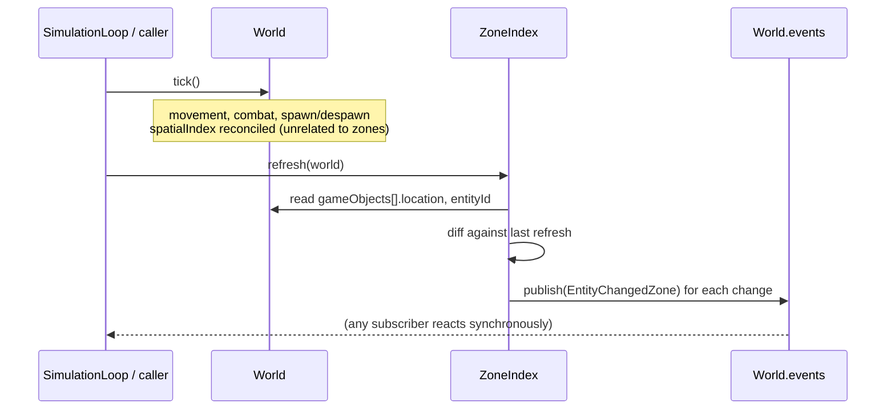

# Plan: zones / chunks — map partition + entity↔zone index

## Header / Association

- **Covers:** [SpartanLabsGaming/MyGameTools#47](https://github.com/SpartanLabsGaming/MyGameTools/issues/47)
  — *"Phase 1: zones / chunks — map partition + entity↔zone index"* (`type: feature`,
  `area: world`; item 2 of 5 in `docs/framework-vision-and-roadmap.md` §3 Phase 1; item 2 of
  the `5.2.0` series in `docs/phase-1-map-and-space-plan.md` §8).
- **Branch:** `feature/47-zones`, cut from current `master` (`e9e7501`).
- **Commit:** TBD
- **PR:** TBD — this plan document is to be committed together with the first commit of its
  implementation so `git log --follow` binds the two.
- **What this plans:** a new `com.spartanlabs.gaming.world.zone` package in `gametools-world`
  — `Zone`, `ZoneGrid` (a static, uniform `columns × rows` partition of a `Space`'s bounds),
  `ZoneIndex` (entity↔zone bookkeeping, recomputed once per frame on demand), and
  `EntityChangedZone` (a `gametools-world`-declared `GameEvent`, published on `World.events`).
  No `gametools-core` change and no automatic `World` wiring — `ZoneIndex.refresh(world)` is a
  plain method a consumer calls, exactly as `TiledMap` is inert data until a system chooses to
  consult it.
- **Status:** planning only. No source, test, or build file has been modified by this document.
- **Baseline:** GameTools `master` at `e9e7501` (`feat(world): bounded tiled map model (#46)
  (#65)`). Both roadmap items ahead of zones in the `5.2.0` series are already merged: #46 (map
  model) and #48 (spatial-index rework, plus the module bootstrap). Four published modules today
  — `gametools-core`, `gametools-net`, `gametools-world`, `gametools` (umbrella) — all still at
  `5.1.0` in `coordinates(...)`; the bump happens at `release/5.2.0` time. Issues #49 (physics)
  and #50 (vision) are the other two open Phase 1 items, both unstarted, no PRs open. Target
  release: `5.2.0`.
- **Related docs:** `docs/framework-vision-and-roadmap.md` (§3 Phase 1); `docs/phase-1-map-and-space-plan.md`
  (§2.3 zones design sketch, §9 Open Decision 11 — uniform grid v1; several of its
  "current-state facts" in §1.3 are now stale, see §1.2 below); `docs/module-split-plan.md`.

---

## 1. Context

### 1.1 The problem (from the issue)

The roadmap's scalable-netcode path (Phase 3, "vision → zone → distance" interest filtering)
and its persistent-world path (Phase 5, per-zone save/load) both need the world partitioned
into zones/chunks, each owning an interest scope and a subset of the entity set.
`World.gameObjects` (`gametools-core/.../gameobjects/World.kt:67`) is one flat `ArrayList`
today; there is no partition of it and no per-entity "which region is this in" query anywhere
in the codebase. The issue's proposed API sketch:

```kotlin
class Zone(val name: String, val bounds: Square)
class ZoneGrid(map: TiledMap, columns: Int, rows: Int) {
    val zones: List<Zone>
    fun zoneAt(point: Point): Zone
}
class ZoneIndex(private val grid: ZoneGrid) {
    fun refresh(world: World)
    fun zoneOf(entityId: EntityId): Zone?
    fun entitiesIn(zone: Zone): Set<EntityId>
}
```

with a zone change publishing `GameEvent.EntityChangedZone(entity, from, to)`. Scope is
explicit in the issue: the partition, the index, the event, and the queries — "tested, and
nothing more." Explicitly **out**: per-zone tick budgeting, per-zone `World`s, cross-zone
hand-off, irregular (non-grid) zones — all later phases.

### 1.2 Current-state facts (verified against `master` at `e9e7501`)

- **`World`** (`gametools-core/.../gameobjects/World.kt`) owns `gameObjects: ArrayList<GameObject>`
  (line 67), a `space: Space?` (line 123, `null` by default, purely descriptive — `tick()`
  never consults it), a `spatialIndex: SpatialIndex<VisibleObject>` (line 85, incrementally
  reconciled at the top of `tick()`, line 220/258), an `events: EventBus` (line 112), and
  `byId(EntityId): GameObject?` (line 154). `tick()`'s order: increment `tickCount` → reconcile
  `spatialIndex` → reindex `byId` (firing `EntitySpawned`) → tick every owned object over a
  `toList()` snapshot → drain `removeList` (firing `EntityRemoved`).
- **`Space`** (`gametools-core/.../gameobjects/Space.kt`) — `bounds: Square`, `contains(Point):
  Boolean`, `isWalkable(Point): Boolean`. `TiledMap` (`gametools-world/.../world/map/TiledMap.kt`)
  is the only implementation, `bounds = Square(Point(0,0), Dimensions(widthTiles·tileSize,
  heightTiles·tileSize))`, y-down.
- **`GameEvent`** (`gametools-core/.../event/GameEvent.kt:26`) is **already a plain `interface`,
  not `sealed`** — its own KDoc (lines 20–24) states *"`gametools-world`'s zone and vision
  systems are the first such module"* to declare events outside `core`. `EventBus.publish`
  (`event/EventBus.kt:73`) accepts any `GameEvent` implementer, with no constraint to nested
  members; `queued: ArrayDeque<GameEvent>` and `listeners: List<Listener>` are typed to the
  interface, not a sealed set. So there is nothing left to resolve here — Phase-1-plan §9 Open
  Decision 5 is already settled on `master`, and this issue's `EntityChangedZone` is exactly the
  first consumer of that openness the KDoc predicted.
- **`SpatialIndex<E>`** rework (#48) is fully merged: `gametools-core/.../spatial/` holds
  `SpatialIndex<E>`, `UniformGrid<E>`, `QuadtreeSpatialIndex<E>` (the `World.spatialIndex`
  default). `VisibleObject.lastIndexedLocation: IndexedPosition?` (`VisibleObject.kt:111`, a
  value snapshot, not a live `Point` alias) backs the incremental reconcile. `World.quadtree` is
  deprecated but still works.
- **No `Zone`, `ZoneGrid`, `ZoneIndex`, or `WorldSystems` exists anywhere** (grep across
  `gametools-core`, `gametools-net`, `gametools-world` confirms — no `zone`/`chunk`/`region`/
  `AOI` concept beyond source-organization `//region` fold markers and the one forward-reference
  already in `GameEvent`'s KDoc). `docs/phase-1-map-and-space-plan.md` §9 Open Decision 3 ("how
  do per-frame world systems run — `WorldSystems.step()`, a `SimulationLoop.onTick` hook, or an
  opt-in `World.systems` list") is genuinely unresolved project-wide; the issue text's own
  *"Refreshed from `WorldSystems.step()` (see the physics/vision items — plan Open Decision 3)"*
  describes a type that has not been built and explicitly defers the decision to #49/#50.
- **`SimulationLoop`** (`gametools-core/.../simulation/SimulationLoop.kt`) already exposes an
  `onTick: (tickCount: Long) -> Unit` callback invoked on the loop thread right after
  `World.tick()` (lines 39, 119) — an existing, zero-new-infrastructure hook a consumer can wire
  a per-frame `zoneIndex.refresh(world)` call into today, with no `WorldSystems` needed.
- **`GameObject`** (`gametools-core/.../gameobjects/GameObject.kt:39`) — every entity, visible
  or not, has a `location: Point` and a stable `entityId: EntityId` (`EntityId.UNASSIGNED`
  until a `World` numbers it, `EntityId.kt:37`). `World.byId`, `EntitySpawned`, and
  `EntityRemoved` all operate at this base level, not `VisibleObject` — the spatial index is the
  one mechanism scoped to `VisibleObject` only, because it exists specifically for broad-phase
  drawable queries. Zone membership (interest filtering, zone save/load — §1.1) has no such
  restriction.
- **GeneralTools `2.2.0`** (current dependency, per `CHANGELOG.md [Unreleased]`) ships `Point`
  (with `x`/`y` vars and vector helpers), `Dimensions` (`width`/`height`), `Square` (`location:
  Point` — top-left corner — plus `dimensions: Dimensions`, and `contains(Point)`), `CenteredBox`,
  `Segment`, `Ray`. `StaticGeometry` already uses `CenteredBox`; `TiledMap.bounds` and this
  plan's `Zone.bounds` use `Square`, matching `Space.bounds`'s own type. Confirmed directly:
  `MapLoaderIntegrationTest.kt:41-42` asserts `map.bounds.location == Point(0.0, 0.0)` and
  `map.bounds.dimensions == Dimensions(40.0, 30.0)`.
- **`.aiassistant/rules/CLAUDE.md` §2** — "Never throw raw exceptions for expected failures ...
  Return `Result.success(value)` or `Result.failure(exception)`." `TerrainLayer.terrainAt`
  already follows this (an out-of-range tile lookup is a `Result`, not a throw); `TiledMap`
  wraps that into a nullable convenience (`terrainAt(point) = terrain.terrainAt(tileAt(point)).getOrNull()`).
  This plan's `ZoneGrid.zoneAt` follows the same "operational lookup → `Result`" house rule
  rather than throwing for an out-of-grid point (§3.3).
- **Since `e9e7501`**, `git log` shows no further commits on `master` — the baseline the issue
  and this plan work from is current.

### 1.3 Acceptance criteria (derived from the issue; none are enumerated in the issue body itself)

1. `Zone`, `ZoneGrid`, `ZoneIndex` exist in `gametools-world`'s `com.spartanlabs.gaming.world.zone`
   package, each with full KDoc per the Component-Ring standard.
2. `ZoneGrid` partitions a `Space`'s bounds into a static, uniform `columns × rows` grid of
   named, non-overlapping `Zone`s covering the full extent (roadmap's own lean: uniform grid
   only in Phase 1, per `docs/phase-1-map-and-space-plan.md` §9 Open Decision 11).
3. `ZoneIndex.refresh(world)` recomputes `EntityId → Zone` and `Zone → Set<EntityId>` against
   the entity positions in `world.gameObjects`; `zoneOf`/`entitiesIn` answer correctly.
4. A zone transition — entering, leaving the grid, crossing between zones, or the owning entity
   leaving the world — publishes exactly one `EntityChangedZone` on `World.events`, carrying the
   entity, its previous zone (`null` if none), and its new zone (`null` if none).
5. Nothing in `World`/`gametools-core` changes — `space`, `spatialIndex`, `tick()`, `GameEvent`
   are all untouched; a `World` with no `ZoneIndex` in use behaves exactly as it does today.
6. Five-level test tree mirroring `world.map`'s existing coverage depth (component /
   integration / deterministic / e2e; nonfunctional deferred, see §7).
7. `README.md`, `CONTRIBUTING.md` module table, and `CHANGELOG.md [Unreleased]` updated; the
   issue closes at `5.2.0` release time (a release-PR edit, matching the #46/#48 precedent, not
   this feature PR).

---

## 2. Prior art & best practices

Zone/chunk-based entity indexing for interest management is a long-established MMO/RTS
server-architecture pattern, not something to design from first principles:

- **Grid-based area-of-interest (AOI) partitioning is the standard approach for this problem
  class.** Rectangular cells are the common default, with circular/hexagonal cells or pure
  vision-based filtering as genre-specific alternatives (mainly first-person games) — Dynetis
  Games, ["Interest management for multiplayer online
  games"](https://www.dynetisgames.com/2017/04/05/interest-management-mog/index.html). This
  directly supports the roadmap's own lean (uniform grid v1, irregular deferred,
  `docs/phase-1-map-and-space-plan.md` §9 Open Decision 11) rather than reopening it.
- **Track each entity's current cell/zone id and update it incrementally as it moves,
  publishing transitions rather than requiring pollers.** The same source describes this shape
  server-side almost exactly ("game objects store at all time the ID of the AOI they are
  currently in ... whenever they move, this ID is updated"). This is the shape `ZoneIndex`
  implements: `EntityId → Zone` bookkeeping plus a change event.
- **The "border effect."** An entity near a zone boundary is visually/physically close to
  entities in the *adjacent* zone but a naive AOI index treats it as unrelated — a widely-cited
  named pitfall in the same source, normally addressed by a consumer also considering a zone's
  neighbourhood, not the zone alone. Phase 1 explicitly does not implement neighbour-aware
  filtering — that is Phase 3's job — but the design keeps a cheap neighbour query available for
  that future consumer for free: `Zone` carries `column`/`row` grid coordinates, not just
  `name`/`bounds`, so "this zone plus its 8 neighbours" is arithmetic later rather than requiring
  a redesign now.
- **AOI/interest partitioning is a distinct concern from a broad-phase collision/query spatial
  index**, even though both answer "what's near this point." One keys entities to a small number
  of large, stable, server-authoritative interest regions for update batching, save/load
  partitioning, and eventual per-player filtering; the other keys drawables to whatever
  fine-grained structure answers a physics/vision "what's in this box/radius" query fastest. The
  same Dynetis source treats "AOI" and "space partitioning for spatial queries" as separate
  sections for exactly this reason. This confirms the repo's existing module split is correct:
  `SpatialIndex<VisibleObject>` stays a `gametools-core` broad-phase primitive (#48); zones are a
  `gametools-world`-level domain concept, conceptually built on the same idea but not
  implemented on top of `SpatialIndex` or coupled to it.
- No numerical-robustness or algorithmic-correctness concern applies to the partition itself — a
  static uniform grid over a bounded rectangle is closed-form integer-division geometry, not an
  algorithm with edge-case failure modes the way, say, `Quadtree`'s incremental-update fix (#48)
  was.

---

## 3. Design

### 3.1 Package overview

New package `com.spartanlabs.gaming.world.zone` in `gametools-world`, one class per file
(mirrors `world.map`'s granularity — `TileIndex.kt`, `SpawnPoint.kt`, etc., are each one small
type):

| File | Type |
|---|---|
| `Zone.kt` | `data class Zone` |
| `ZoneGrid.kt` | `class ZoneGrid` |
| `ZoneIndex.kt` | `class ZoneIndex` |
| `EntityChangedZone.kt` | `data class EntityChangedZone : GameEvent` |

### 3.2 `Zone`

```kotlin
/**
 * One cell of a [ZoneGrid]'s static partition: a named, axis-aligned region of the playfield.
 *
 * @property name a stable, human-readable identifier ("zone-<column>-<row>"), unique within
 *   the owning [ZoneGrid]
 * @property bounds the zone's extent in world coordinates
 * @property column this zone's 0-based column within its [ZoneGrid], west to east
 * @property row this zone's 0-based row within its [ZoneGrid], north to south (the engine's
 *   world space is y-down - see [com.spartanlabs.gaming.gameobjects.Space])
 */
data class Zone(val name: String, val bounds: Square, val column: Int, val row: Int)
```

A `data class` so two `Zone`s at the same grid coordinates compare equal by value — needed for
`ZoneIndex`'s `Map<Zone, ...>` keying and for tests to assert against freshly-built expected
zones without holding a reference into the grid's own list. `column`/`row` are carried alongside
`name`/`bounds` — a deliberate addition beyond the issue's minimal `Zone(name, bounds)` sketch,
justified in §2 (cheap future neighbour queries with no name-parsing or bounds re-derivation).
Using `Zone` as a `HashMap`/`Set` key this way is safe specifically because GeneralTools `2.2.0`
(the pinned dependency, `build-logic/.../gametools.kotlin-library.gradle.kts`) fixed
`TwoDoubles.hashCode()` being inconsistent with `equals()` for `Point`/`Dimensions`/`Square` — on
an earlier GeneralTools version, `Zone`'s value-equality via its `Square bounds` field would not
have been safe to key a hash-based collection on (§3.4).

### 3.3 `ZoneGrid`

```kotlin
/**
 * A static, uniform `columns × rows` partition of a [Space]'s [Space.bounds] into named
 * rectangular [Zone]s, covering the space's full extent with no gaps or overlaps. Phase 1 ships
 * this uniform-grid partition only; irregular zones are a later addition behind [zoneAt]'s
 * existing contract (`docs/phase-1-map-and-space-plan.md` Open Decision 11).
 *
 * @param space the playfield to partition; only [Space.bounds] is read at construction time -
 *   the grid does not track subsequent changes to [space] (see the class's risk note)
 * @param columns how many zones wide the grid is; must be positive
 * @param rows how many zones tall the grid is; must be positive
 * @throws IllegalArgumentException if [columns] or [rows] is not positive
 */
class ZoneGrid(space: Space, val columns: Int, val rows: Int) {
    init {
        require(columns > 0 && rows > 0) { "columns/rows must be positive" }
    }

    /** Every zone in this grid, row-major (row 0's columns first, then row 1's, ...). */
    val zones: List<Zone>

    /**
     * The zone [point] falls within.
     *
     * @param point the world coordinate to look up
     * @param clamped if `true` (the default), a [point] outside the grid's covered extent
     *   resolves to its nearest edge zone and this always succeeds - convenient for a caller
     *   that only wants *some* zone to attribute a point to. If `false`, a [point] outside the
     *   extent fails instead of guessing - the contract [ZoneIndex.refresh] uses internally,
     *   since silently clamping a departing entity to an edge zone would defeat the point of
     *   reporting that it left (§3.4).
     * @return the resolved [Zone] on success; on failure (only possible with `clamped = false`),
     *   a [Result.failure] wrapping an [IndexOutOfBoundsException]
     */
    fun zoneAt(point: Point, clamped: Boolean = true): Result<Zone>
}
```

- Built once from `space.bounds` (a `Square`), not a live reference to `space` — avoids
  `ZoneGrid` having to react to a map that could, in principle, be mutated after construction.
  `TiledMap`'s only post-construction mutation today is `addSpawnPoint`, which does not touch
  `bounds`, but `ZoneGrid` should not assume that stays true forever (documented as a risk,
  §7).
- `cellWidth = space.bounds.dimensions.width / columns`, `cellHeight = space.bounds.dimensions.height
  / rows`; zone `(c, r)`'s bounds is `Square(Point(bounds.location.x + c·cellWidth,
  bounds.location.y + r·cellHeight), Dimensions(cellWidth, cellHeight))`. Zone boundaries need
  not land on tile boundaries — zones partition continuous world space, independent of whatever
  terrain tile grid a `TiledMap` layers underneath.
- `zoneAt`'s resolution: `column = floor((point.x - bounds.location.x) / cellWidth).toInt()`,
  `row` likewise on `y`. If both land in `0 until columns` / `0 until rows`, index into `zones`
  (`row * columns + column`) and return `Result.success`. This mirrors `TiledMap.tileAt`/
  `terrainAt`'s existing floor-and-bounds-check pattern (`TiledMap.kt:77,87`), including the "a
  point on the far edge floors to the next index, which is then off-grid" behaviour
  `TiledMapTest` already locks in for tiles. Otherwise: `clamped = false` returns
  `Result.failure(IndexOutOfBoundsException(...))`; `clamped = true` (the default) independently
  `coerceIn`s `column`/`row` to their valid ranges and returns `Result.success` with the
  resulting edge zone. `Result<Zone>` rather than a throwing or nullable signature follows both
  `.aiassistant/rules/CLAUDE.md` §2 ("Result instead of thrown exceptions for expected
  failures") and `TerrainLayer.terrainAt`'s existing "operational out-of-range lookup"
  convention — a genuine improvement on the issue's literal non-null `fun zoneAt(point: Point):
  Zone` sketch, which cannot express "this point has left the grid" at all. The two-mode
  (`clamped`) signature is needed specifically because `ZoneIndex.refresh` and a casual UI-style
  caller want opposite answers to the same out-of-extent question (§3.4) — this is a design
  choice made for internal consistency with the rest of the codebase, not a product decision, so
  it is not listed as an Open Decision.
- **Deliberate generalisation beyond the issue's literal sketch:** the issue proposes
  `ZoneGrid(map: TiledMap, columns: Int, rows: Int)`; this plan widens the first parameter to
  `Space` — `gametools-core`'s existing port, which `TiledMap` already implements with no
  change. `ZoneGrid` only ever reads `.bounds`, so nothing is lost, `TiledMap` still works as the
  argument unchanged, and it keeps `world.zone` decoupled from `world.map` the same way
  `World.space: Space?` is decoupled from any one concrete map type. Non-breaking, and nothing
  external depends on the exact parameter type since nothing consumes zones yet — not raised as
  an Open Decision.
- **`columns`/`rows` are public `val` properties, not constructor-only parameters.** `zones: List<Zone>`
  alone leaves a consumer no direct way to read the grid's shape without reverse-engineering it
  from `zones.size` or scanning for the maximum `Zone.column`/`row`. Exposing them costs nothing
  (a one-word `val` each) and is exactly what a future neighbour-query consumer (§2, §3.2's
  `column`/`row` rationale) needs to do "this zone's column ± 1, row ± 1" arithmetic without going
  through `zones` at all.

### 3.4 `ZoneIndex`

```kotlin
/**
 * Bookkeeping of which [Zone] each [GameObject][com.spartanlabs.gaming.gameobjects.GameObject]
 * a [World] owns currently falls within, against a fixed [grid]. Not updated automatically -
 * call [refresh] once per frame (a natural place: a
 * [SimulationLoop][com.spartanlabs.gaming.simulation.SimulationLoop]'s `onTick` callback, or a
 * direct call right after [World.tick]) to bring it up to date with the frame's final
 * positions.
 *
 * @param grid the static partition this index tracks entities against
 */
class ZoneIndex(private val grid: ZoneGrid) {

    /**
     * Recomputes every owned [GameObject][com.spartanlabs.gaming.gameobjects.GameObject]'s zone
     * against [grid] and publishes [EntityChangedZone] on [world]'s [World.events] for every
     * entity whose zone changed since the last [refresh]: entering a zone for the first time
     * ([EntityChangedZone.from] `null`), moving between zones, leaving the grid's covered extent
     * ([EntityChangedZone.to] `null`), or leaving [world] entirely ([EntityChangedZone.to]
     * `null`, naming the entity's last-known reference). An entity not yet numbered by [world]
     * ([com.spartanlabs.gaming.gameobjects.EntityId.UNASSIGNED]) is skipped, mirroring
     * [World.byId]'s own "not yet resolvable" handling.
     *
     * @param world the world whose entities to reconcile against [grid]
     */
    fun refresh(world: World)

    /** The zone [entityId] was placed in by the most recent [refresh], or `null`. */
    fun zoneOf(entityId: EntityId): Zone?

    /** The entities the most recent [refresh] placed in [zone]; empty if none. A fresh copy, not a live view. */
    fun entitiesIn(zone: Zone): Set<EntityId>
}
```

`refresh`'s algorithm — a full recompute-and-diff each call, not an incremental per-move
reconcile (see §3.6 for why):

```kotlin
private val indexed: MutableMap<EntityId, Pair<GameObject, Zone>> = HashMap()
private val entitiesByZone: MutableMap<Zone, MutableSet<EntityId>> = HashMap()

fun refresh(world: World) {
    val current = HashSet<EntityId>()
    world.gameObjects.forEach { obj ->
        val id = obj.entityId
        if (id == EntityId.UNASSIGNED) return@forEach
        current += id
        val newZone = grid.zoneAt(obj.location, clamped = false).getOrNull()
        val oldZone = indexed[id]?.second
        if (newZone == oldZone) return@forEach

        oldZone?.let { entitiesByZone[it]?.remove(id) }
        if (newZone != null) {
            indexed[id] = obj to newZone
            entitiesByZone.getOrPut(newZone) { mutableSetOf() }.add(id)
        } else {
            indexed.remove(id)
        }
        world.events.publish(EntityChangedZone(obj, oldZone, newZone))
    }
    (indexed.keys - current).forEach { id ->
        val (obj, oldZone) = indexed.remove(id)!!
        entitiesByZone[oldZone]?.remove(id)
        world.events.publish(EntityChangedZone(obj, oldZone, null))
    }
}
```

Key design points:

- **`grid.zoneAt(obj.location, clamped = false)`, not the default-clamped overload.** `ZoneIndex`
  needs to know when an entity has genuinely left the grid's covered extent, so it can drop the
  entity from `entitiesIn`/`zoneOf` and publish `to = null`. The clamped default would silently
  pin a departing entity to its nearest edge zone, masking exactly the transition
  `EntityChangedZone` exists to report.
- **Tracks every top-level `GameObject`, not only `VisibleObject`.** `SpatialIndex`/
  `reconcileSpatialIndex` is `VisibleObject`-scoped because it exists for drawable broad-phase
  queries; zones exist for interest filtering and zone save/load (§1.1), which have no reason to
  exclude a non-visible entity (a trigger volume, a server-only aggro totem). `GameObject.location`
  is available at the base type, so nothing is lost tracking the wider set; `world.gameObjects`
  (top-level only, not `VisibleObject.subObjects`) matches the scope `EntitySpawned`/
  `EntityRemoved` already use.
- **`indexed` stores `(GameObject, Zone)` pairs, not just `Zone`**, specifically so a removed
  entity (no longer in `world.gameObjects`) can still be named in its final
  `EntityChangedZone(entity, oldZone, null)` — without this, an entity that despawns while zoned
  would vanish from `ZoneIndex` with no corresponding "left" event, exactly the transition a
  Phase 3 interest-management consumer would most want to observe.
- **`entitiesIn` returns a defensive copy** (`toSet()`), not the live internal `MutableSet` —
  consistent with `SpatialIndex.queryBox`/`queryRadius` returning fresh `List`s rather than
  exposing internal storage, and prevents a caller from corrupting `ZoneIndex`'s bookkeeping by
  mutating the returned set.
- **Ordering relative to `World.tick()`:** a consumer calls `refresh(world)` *after*
  `world.tick()` (documented in the KDoc), so zone membership and `EntityChangedZone` reflect the
  tick's final positions — the natural point for a per-frame broadcast build to consult it. This
  is a different point in the frame than `spatialIndex`'s own reconcile, which runs at the
  *start* of `tick()` (one-tick-stale by design, for internal movement/combat consistency within
  the tick itself) — the two indexes serve different consumers with different freshness needs,
  not a contradiction.
- **No `WorldSystems`, no automatic per-tick wiring** — see §3.5.

### 3.5 How `refresh` gets called each frame — no `WorldSystems` built here

The issue's own sketch says zones are *"Refreshed from `WorldSystems.step()`,"* but no such
aggregator exists on `master` (§1.2), and `docs/phase-1-map-and-space-plan.md` §9 Open Decision
3 ("how per-frame world systems run") is still genuinely unresolved project-wide. Resolving it
well needs to account for physics (#49) and vision (#50) too, both of which have real
*inter-system ordering* requirements (zone index → physics → vision, per the roadmap's own lean)
that a single `refresh(world)` call does not exercise. Speculatively designing that aggregator
against zones' needs alone risks getting its shape wrong for what #49/#50 actually require.

**This plan keeps #47 to exactly its stated scope**: `ZoneIndex.refresh(world)` is a plain
public method with no ordering dependency on anything else Phase 1 adds. A consumer runs it
today, with zero new infrastructure, either via `SimulationLoop`'s existing `onTick` hook —

```kotlin
val loop = SimulationLoop(world) { _ -> zoneIndex.refresh(world) }
```

— or by calling `world.tick(); zoneIndex.refresh(world)` directly in a hand-rolled loop.
Building `WorldSystems.step()` (and thereby actually resolving Open Decision 3) is left to #49,
the next Phase 1 item and the first one that genuinely needs multi-system ordering guarantees.
This narrowing is called out explicitly (§9 Open decisions, §11 Sequencing) so it is a visible
scope decision, not a silent deferral.



### 3.6 Alternatives considered and rejected

- **`ZoneIndex` tracks only `VisibleObject`, mirroring `SpatialIndex`.** Rejected — no
  interest-management or save/load reason to exclude non-visible entities from zone membership;
  see §3.4.
- **`ZoneGrid` takes a `TiledMap` directly, per the issue's literal sketch.** Rejected in favour
  of `Space` — see §3.3.
- **Incremental per-move reconcile (mirroring `spatialIndex`'s `insert`/`move`/`remove`) instead
  of a full recompute-and-diff each `refresh`.** Rejected for Phase 1: the issue specifies
  "refresh ... once per frame, from entity positions"; a full pass is `O(n)` in entity count
  either way at the target scale (≤10k, per the roadmap's medium-scale target); and a full
  recompute needs no extra per-`GameObject` bookkeeping field the way
  `VisibleObject.lastIndexedLocation` was needed for the spatial index. If a future nonfunctional
  measurement shows this is a hot path, an incremental version can be built later without
  changing `ZoneIndex`'s public signature (§7, §11).
- **Building `WorldSystems.step()` now, since the issue's sketch names it.** Rejected — see
  §3.5; the ordering questions it exists to answer belong to physics/vision, which don't exist
  yet.
- **`zoneAt` returning a bare `Zone` (per the issue's literal sketch) or a nullable `Zone?` (the
  `TiledMap.terrainAt` convenience pattern) instead of `Result<Zone>`.** Rejected: a bare `Zone`
  cannot express "this point is off the grid" without throwing, which `.aiassistant/rules/CLAUDE.md`
  §2 forbids for an expected/operational failure; a nullable return loses the distinction between
  "off the grid" (a real, expected condition `ZoneIndex.refresh` must detect precisely) and "an
  internal bug produced an inconsistent state," which `Result.failure(IndexOutOfBoundsException)`
  preserves. The `clamped` parameter keeps the issue's literal "always get *a* zone" ergonomics
  available as the default for a casual caller.

### 3.7 Blast-radius / adoption check

Grepped `gametools-core`, `gametools-net`, and `gametools-world` for any existing `zone`,
`chunk`, `region`, `AOI`, or interest-management concept: none exists, beyond source-organisation
`//region` fold markers and the one forward-reference already in `GameEvent`'s own KDoc (§1.2).
There is therefore no existing class to evaluate for "should this adopt `ZoneIndex`" the way, for
example, #48's spatial-index rework had `Actor.nearby`/`DirectionalProjectile`/`HomingProjectile`
as existing `Quadtree` callers that gained `SpatialIndex`-typed overloads. `ZoneIndex` is a pure
net-new capability with zero current consumers in this repo, matching the issue's own "nothing
consumes zones in Phase 1" scope note. (Its intended future consumers — Phase 3 interest
filtering, Phase 5 zone save/load — do not exist yet either; there is nothing to retrofit there
now.)

---

## 4. File-by-file changes

### `gametools-world` (new package)

- **new** `world/zone/Zone.kt` — `data class Zone(name, bounds, column, row)`, per §3.2.
- **new** `world/zone/ZoneGrid.kt` — `class ZoneGrid(space: Space, val columns: Int, val rows: Int)`,
  `zones: List<Zone>`, `zoneAt(point: Point, clamped: Boolean = true): Result<Zone>`, per §3.3.
- **new** `world/zone/ZoneIndex.kt` — `class ZoneIndex(grid: ZoneGrid)`, `refresh(World)`,
  `zoneOf(EntityId): Zone?`, `entitiesIn(Zone): Set<EntityId>`, per §3.4.
- **new** `world/zone/EntityChangedZone.kt` — `data class EntityChangedZone(val entity:
  GameObject, val from: Zone?, val to: Zone?) : GameEvent`, KDoc explaining the four transition
  shapes (`null → Zone`, `Zone → Zone'`, `Zone → null` via leaving the grid, `Zone → null` via
  leaving the world) and cross-referencing `ZoneIndex.refresh`.
- **new** test tree under `src/test/kotlin/.../testing/{component,integration,deterministic,e2e}/world/zone/`
  — see §6.
- No change to `world/map/*` — `ZoneGrid` consumes `Space`, and `TiledMap` already implements it.

### `gametools-core`

No change. `World`, `Space`, `GameEvent`, `EventBus`, `SpatialIndex` are all already exactly
what this plan needs (§1.2).

### `gametools-net`, `gametools` (umbrella)

No change. `gametools-world` is already re-exported and wired from the #46/#48 bootstrap; this
issue adds no new module, dependency, or umbrella surface.

### Root & meta

- `README.md` — the **world** module-table row (`README.md:149`) currently reads *"zones,
  physics and vision are still to come"*; update to name `world.zone` (`Zone`/`ZoneGrid`/
  `ZoneIndex`) and drop "zones" from the remaining list (physics/vision still pending). The
  architecture-prose paragraph that documents `world.map` types by name (`README.md:178`) gains
  a parallel sentence for `world.zone`.
- `CONTRIBUTING.md` — the module table's `gametools-world` "Contents" cell (`CONTRIBUTING.md:35`)
  gains the zone package alongside the existing map-model listing.
- `CHANGELOG.md` — `[Unreleased]` → `### Added`, a new bullet for `Zone`/`ZoneGrid`/`ZoneIndex`/
  `EntityChangedZone`, in the style of the existing #46/#48 bullets (draft text in §9).
- `docs/framework-vision-and-roadmap.md` — **no change** in this feature PR; §3 Phase 1 item 2 is
  marked done at `5.2.0` release time (a release-PR edit), matching the #46/#48 precedent.

---

## 5. Documentation impact

- **Component ring (KDoc).** Every new public declaration — `Zone`, `ZoneGrid`, `ZoneGrid.zoneAt`,
  `ZoneIndex`, `ZoneIndex.refresh`/`zoneOf`/`entitiesIn`, `EntityChangedZone` — gets full KDoc per
  §3's snippets (`@param`/`@return`/`@throws` where applicable), matching the existing style in
  `world.map`'s files.
- **Architectural ring.** `README.md`'s module table and architecture prose, per §4's Root & meta
  bullet. No Mermaid diagram edit needed in the README's existing object-model diagram —
  `ZoneIndex` is an external consumer of `World`, not a field it owns, mirroring how `TiledMap`
  is not drawn into that diagram either.
- `CONTRIBUTING.md` module table — per §4.
- No boundary-ring (wire/protocol) documentation — the issue states "no consumer-facing change;
  no wire change," and nothing here is `@Serializable`.

---

## 6. Test plan (5-level hierarchy)

Per-module tree under `com.spartanlabs.gaming.testing.<level>.world.zone`, one class per file,
mirroring `testing.*.world.map`'s existing depth (component / integration / deterministic / e2e;
`world.map` has no nonfunctional tier either — see the note below for why this plan follows that
precedent rather than adding one speculatively).

**Level 2 — component** (`gametools-world/src/test/kotlin/.../testing/component/world/zone/`)
- `ZoneGridTest` — `zones.size == columns * rows`, row-major order; `columns`/`rows` read back as
  the constructor values; every zone's `bounds` tiles the space's full extent with no gap/overlap
  (sum of zone areas equals the space's area; adjacent zones share exactly one edge); `zoneAt` for
  an interior point, for a point exactly on an internal boundary (floors to the "next" zone,
  mirroring `TiledMapTest`'s own edge-flooring case for tiles); `zoneAt(clamped = false)` for a
  point on the space's far edge and for a negative/out-of-bounds point both return `Result.failure`
  with `IndexOutOfBoundsException`; the same points with `clamped = true` (default) return
  `Result.success` with the nearest edge zone, including a point far outside on both axes clamping
  to the correct corner; constructor rejects non-positive `columns`/`rows`.
- `ZoneIndexTest` — a fresh `ZoneIndex` before any `refresh` has empty `zoneOf`/`entitiesIn`; one
  `refresh` places entities in the expected zones; a second `refresh` after moving an entity
  across a zone boundary updates both the old and new zone's `entitiesIn` and `zoneOf`; an entity
  still at `EntityId.UNASSIGNED` (added directly to `world.gameObjects`, before a `World.tick()`
  or `World.add` numbers it) is skipped, not indexed; an entity moved outside the grid's extent
  is dropped from `entitiesIn` and `zoneOf` returns `null`; a removed entity (via `World`'s
  `removeList`/`tick()`) is dropped from the index on the next `refresh`; `entitiesIn` returns a
  copy — mutating it does not affect the index.
- `EntityChangedZoneTest` — a fresh entity entering a zone publishes `from = null`; crossing zones
  publishes both the old and new zone; leaving the grid publishes `to = null`; a `GameObject`
  that is not a `VisibleObject` (a minimal test fixture type) still gets tracked and published —
  locking in §3.4's "every `GameObject`, not just `VisibleObject`" design point.

**Level 3 — integration** (`.../testing/integration/world/zone/`)
- `ZoneRefreshWorldIntegrationTest` — a real `World`, a `TiledMap`-backed `Space`, several
  `Actor`s added and ticked across multiple frames with `refresh(world)` called after each
  `World.tick()` (the documented ordering, §3.4); asserts the `EntityChangedZone` events observed
  on `world.events` exactly match the expected sequence for a scripted movement path crossing
  three zones, including one entity that despawns mid-scenario (a `to = null` event naming its
  last-known reference, not a missing event).

**Level 4a — deterministic** (`.../testing/deterministic/world/zone/`)
- `ZoneGridPartitionLawsTest` — seeded-random property test: for many random `(columns, rows,
  bounds)` combinations and many random query points, `zoneAt(point, clamped = false)` succeeds
  if and only if `space.bounds.contains(point)`, and on success the resolved zone's
  `bounds.contains(point)` holds — the partition never misreports which cell a point falls in.
  Separately, `zoneAt(point, clamped = true)` always succeeds, in or out of bounds.
- `ZoneIndexRefreshDeterminismTest` — the same `World` + `ZoneGrid` + the same seeded sequence of
  entity moves produces the same sequence of published `EntityChangedZone`s across repeated
  runs, matching the rest of the engine's "same seed, same result" contract (`World`'s own class
  KDoc).

**Level 4b — e2e** (`.../testing/e2e/world/zone/`)
- `ZoneDrivenSimulationE2ETest` — loads `fixture-map.json` (reused from `world.map`'s existing
  test resource) through `MapLoader`, builds a `ZoneGrid` over it, spawns a couple of `Actor`s at
  named spawn points, drives several `World.tick()`s with `zoneIndex.refresh(world)` after each
  (no `SimulationLoop`, no `GameServer` — matching `MapDrivenWorldE2ETest`'s own "prove the
  surface composes with `World`, nothing else" scope), and asserts final zone membership and the
  full `EntityChangedZone` history are consistent.

**Level 4c — nonfunctional: not added in this issue.** `ZoneIndex.refresh` is an `O(n)` pass over
`world.gameObjects` once per frame — the same order of cost as `World.tick()`'s own per-object
pass — and `world.map` (#46) shipped with no nonfunctional tier either. If a future measurement
against #49/#50's throughput targets shows `refresh` is a meaningful fraction of frame budget at
the ≤10k-entity target, add `testing.nonfunctional.world.zone.ZoneIndexScalabilityTest` then
(§11) rather than speculatively now.

**What can't be automated:** nothing in this slice. No UI, no timing-sensitive network behaviour,
no external service.

---

## 7. Risks & edge cases

| Risk | Mitigation |
|---|---|
| **Boundary "flicker."** An entity oscillating exactly on a zone edge (or a patrol AI crossing back and forth) publishes an `EntityChangedZone` on every `refresh` it crosses — potentially noisy for a future Phase 3 consumer. | Out of scope for Phase 1 to dampen — the issue asks for raw transitions, "tested, and nothing more." Documented in `EntityChangedZone`'s KDoc as a known characteristic, not a bug; a future consumer debounces on its own side. |
| **`ZoneGrid`'s partition is fixed at construction from `space.bounds`.** If a game swaps `World.space` for a differently-sized map without rebuilding `ZoneGrid`/`ZoneIndex`, zone lookups silently reflect the old map's extent. | Documented in `ZoneGrid`'s KDoc ("does not track subsequent changes to `space`"); no runtime detection added, matching `TiledMap`'s own "purely descriptive, no reactive wiring" posture — nothing in Phase 1 needs map hot-swapping. |
| **Non-uniform cell sizing when `bounds` isn't evenly divisible by `columns`/`rows`.** Not a bug (`Double` cell widths handle it fine), but a zone's `bounds` won't align with tile boundaries near the grid's own far edge. | Documented in `ZoneGrid`'s KDoc; `ZoneGridTest` exercises both evenly- and non-evenly-divisible fixture sizes. |
| **`refresh`'s full-recompute cost grows linearly with total entity count**, including entities far outside the grid extent (`zoneAt(clamped = false)` fails for them but they're still visited). | Acceptable at the roadmap's medium-scale target (≤10k, 10–20 Hz) — the same order of cost as `World.tick()`'s own per-object pass. Flagged in §6, not treated as a defect. |
| **Ordering ambiguity.** A consumer that calls `refresh(world)` *before* `world.tick()` instead of after gets one-tick-stale zone data relative to the intended ordering. | `ZoneIndex.refresh`'s KDoc states the intended ordering explicitly; nothing at the type level can enforce call order (mirrors `World.reindexSpatial()`'s own undocumented-at-the-type-level "call this after ..." contract). |
| **Open Decision 3 (how per-frame systems run) stays unresolved past this issue.** #49/#50 may introduce a `WorldSystems` shape that doesn't fit `ZoneIndex.refresh(world)`'s plain-method signature cleanly. | `refresh(world: World)` takes exactly the one argument any per-frame driver already has on hand — it composes with whatever #49 picks without needing to anticipate the shape now, and without being a breaking change if #49 wraps it differently. |
| **Cross-repo impact.** | None. No wire format, no `GameServer`/`ClientCommand` change, nothing `@Serializable`. `MyGameServer` (consumer) is unaffected unless it opts in — no issue filed there (downstream consumer, per standing "no downstream consumer issues" guidance). |

**Breaking-change assessment:** none. Every change is additive, entirely within the brand-new
`world.zone` package; `gametools-core` is untouched. Lands as part of the `5.2.0` Feature release
— no Major-version bump.

---

## 8. Version control

- **Branch:** `feature/47-zones`, cut from current `master`, per `CONTRIBUTING.md`'s
  `feature/<issue#>-<slug>` convention (matches `feature/46-map-model`, `feature/48-gametools-world-module`).
- **Commits** (each a coherent, buildable unit):
  1. `feat(world): add the zone domain model (Zone, ZoneGrid, ZoneIndex, EntityChangedZone)` —
     all four new files (§4) plus their component/integration/deterministic/e2e tests (§6), and
     this plan document (committed together so `git log --follow` binds the two).
  2. `docs: update README and CONTRIBUTING for the zone package` — the §4/§5 README/CONTRIBUTING
     edits.
  3. `docs: changelog entry for zones` — the `CHANGELOG.md [Unreleased]` addition below.

  (A single commit for #1 is also plausible given the package's small, self-contained size;
  split further only if implementation turns up its own follow-up finding.)
- Each commit ends with the repo's standard Conventional Commits trailer and references `(#47)`
  in the subject or body, per `CONTRIBUTING.md`'s Commit messages section and the existing
  #46/#48 CHANGELOG-entry style.
- PR targets `master`, semi-linear merge, per `CONTRIBUTING.md`.
- Publishing to Maven Central (the `release/5.2.0` step) is Spartak's manual step, not part of
  this feature PR.

### `CHANGELOG.md` — `[Unreleased]` draft addition

Under `### Added`, alongside the existing #46/#48 `gametools-world` bullets:

> - `com.spartanlabs.gaming.world.zone` — a static, uniform-grid map partition: `Zone` (a named,
>   bounded cell), `ZoneGrid` (partitions any `Space`'s bounds into `columns × rows` zones,
>   `zoneAt(Point, clamped)`), and `ZoneIndex` (entity↔zone bookkeeping, `refresh(World)` once
>   per frame, `zoneOf`/`entitiesIn`). A zone transition — entering, crossing, or leaving —
>   publishes `EntityChangedZone` on `World.events`. Nothing in `World`/`core` changes;
>   `ZoneIndex` is an external consumer of `World`, called explicitly (a `SimulationLoop.onTick`
>   hook is a natural place). The seam Phase 3 interest filtering and Phase 5 zone save/load
>   build on — nothing consumes it yet. (#47)

---

## 9. Open decisions

None of this plan's design choices require a human product call — `ZoneGrid` accepting `Space`
rather than `TiledMap`, `Zone`'s `column`/`row` fields, `ZoneIndex` tracking every `GameObject`
rather than only `VisibleObject`, the full-recompute `refresh` algorithm, `ZoneGrid` exposing
`columns`/`rows` as public properties, and `zoneAt`'s `Result<Zone>` + `clamped` signature are
each justified against existing codebase convention in §3.3–§3.6, with a single defensible answer
given the house style. Two items are worth the human's attention as awareness, not as blocking
decisions:

| ID | Item | Recommendation |
|----|------|-----------------|
| 1 | **`docs/phase-1-map-and-space-plan.md` §9 Open Decision 3** ("how per-frame world systems run") stays open project-wide after this issue. This plan narrows it only for #47's own scope (§3.5) — a plain `refresh(world)` method — without resolving it for #49/#50. | No action needed to land #47. Flagged so #49 (physics) is understood as the issue that actually has to settle this, since physics has real inter-system ordering requirements zones alone don't exercise. |
| 2 | **Whether to reuse `world.map`'s `fixture-map.json`** for the e2e test (§6) or add a second, zone-shaped fixture (e.g. one whose dimensions aren't evenly divisible by a reasonable `columns × rows`, to exercise the non-uniform-cell edge case in a realistic map context rather than only in the unit-level `ZoneGridTest`). | Lean: reuse `fixture-map.json` for `ZoneDrivenSimulationE2ETest` (keeps the e2e test aligned with `world.map`'s existing pattern); cover the non-evenly-divisible case at the component level in `ZoneGridTest` instead, which does not need a full map fixture. Low-stakes either way — flagging only because it is a testing-fixture choice the executor might otherwise make silently. |

---

## 10. Sequencing & follow-ups

1. Land this issue's PR into `master` as part of the `5.2.0` series — the third `feature/*`
   branch in that series after the already-merged map-model and spatial-index-rework work.
2. `docs/framework-vision-and-roadmap.md` §3 Phase 1 item 2 gets marked done at `5.2.0` release
   time — a release-PR edit, not part of this feature PR (§4).
3. **#49 (physics) is the right place to resolve Open Decision 3 for real** — it is the first
   Phase 1 item with genuine multi-system ordering requirements (zone refresh vs. physics
   integration order). Its plan should read this issue's §3.5 before designing
   `WorldSystems.step()`, so `ZoneIndex.refresh(world)`'s existing plain-method shape is
   accounted for (composes with any aggregator shape without a breaking change) rather than
   redesigned.
4. #50 (vision) will likely want to key its per-team aggregation off zone membership eventually
   (Phase 3's "vision → zone → distance" filtering order), but nothing in Phase 1 wires that up —
   vision's own Phase 1 scope (terrain-occlusion raycasting) has no zone dependency.
5. If a future measurement shows `ZoneIndex.refresh`'s per-frame cost matters at the ≤10k-entity
   target, add `testing.nonfunctional.world.zone.ZoneIndexScalabilityTest` then (§6) rather than
   speculatively now.
