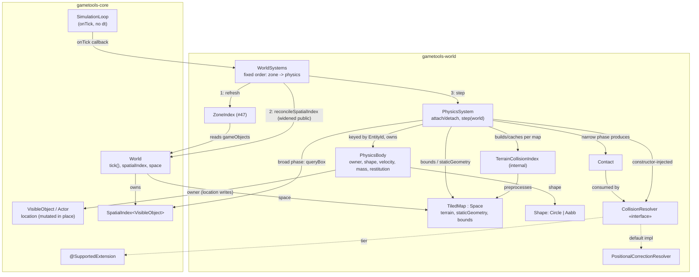

# Architecture: Phase 1 physics — motion integration + collision resolution

## Header / Association

- **Covers:** [SpartanLabsGaming/MyGameTools#49](https://github.com/SpartanLabsGaming/MyGameTools/issues/49)
  — *"Phase 1: physics — motion integration + collision resolution (push-out / slide)"*
  (item 4 of 5 in `docs/framework-vision-and-roadmap.md` §3 Phase 1).
- **Status:** systems design — implementation plans to follow. No source, test, or build file
  has been modified by this document.
- **Target release:** `5.3.0`, in the new `gametools-world` module. **`5.2.0` has not been cut
  yet** — all four published coordinates (`gametools`, `gametools-core`, `gametools-net`,
  `gametools-world`) still read `5.1.0` (`gametools-core/build.gradle.kts:6`,
  `gametools-world/build.gradle.kts:14`), and #42/#46/#47/#48 all sit under CHANGELOG
  `[Unreleased]` (`CHANGELOG.md:13`). `5.2.0` must be released first; `5.3.0` (this issue plus
  #50) follows it, per `docs/phase-1-map-and-space-plan.md`'s own sequencing (§ "Sequencing &
  follow-ups", item 4).
- **Baseline:** `master` @ `56ae9bc`. **Citation note:** the working tree also carries an
  uncommitted, in-flight refactor that moves `Alive`/`Buff`/`Capability`/`Intent`/
  `ModularStat`/`StatMod`/`CombinedStat`/`ExperienceReceiver` into a new `gameobjects.combat`
  subpackage and touches the import blocks of `Actor.kt`, `GameObject.kt`, `VisibleObject.kt`,
  `World.kt`, `DirectionalProjectile.kt`, `HomingProjectile.kt`, `Player.kt`, `Moddable.kt`,
  `gametools-core/build.gradle.kts`. Nothing in this design references or depends on that
  refactor landing — per standing instruction it does not ride in this work. Every `path:line`
  citation below is verified against the **committed `master` HEAD**, not the working tree.
- **Related docs:** `docs/phase-1-map-and-space-plan.md` (§9 Open Decisions 3/4/6, the original
  `world.physics`/`world.geometry`/`world.system` sketch); `docs/issue-46-map-model-plan.md`
  (`TiledMap`/`TerrainLayer`/`StaticGeometry`); `docs/issue-47-zones-plan.md` (`ZoneIndex`);
  `docs/issue-48-spatial-index-rework-plan.md` (`SpatialIndex`, `World.reconcileSpatialIndex`);
  `docs/api-openness-decisions-6.0.0.md` (D1 — `Movement` opens in `6.0.0`, and explicitly
  defers to whoever plans #49); `docs/framework-vision-and-roadmap.md` (§3 Phase 1 item 4,
  Open Decision C).

---

## 1. Requirements

### 1.1 The settled ask

Motion integration and collision resolution for `gametools-world` bodies: push-out
(positional correction) and slide, against (i) other bodies, (ii) `StaticGeometry` AABBs,
(iii) map bounds, and (iv) non-walkable terrain tiles.

### 1.2 Binding constraints (the user's interview answers — not re-litigated here)

1. `WorldSystems` is a **concrete** class with a **fixed internal ordering**, not a generic
   registry — this document resolves `docs/phase-1-map-and-space-plan.md` §9 Open Decision 3
   for real. #50 (vision) either extends `WorldSystems` additively or motivates a later
   generalisation; not decided here.
2. Collision scope is exactly: other bodies, `StaticGeometry` AABBs, map bounds, non-walkable
   terrain tiles. Terrain walkability **blocks** movement.
3. `attach`/`detach` take a **`VisibleObject`**, not `Actor`. Bodies live in an
   `entityId`-keyed map inside `gametools-world`. `gametools-core` gains **no physics types**.
   Eligible ≠ subject: a `VisibleObject` with no attached body moves exactly as today.
4. The resolution strategy is a **constructor-injected interface** (interface + supplied
   default implementation), tier `@SupportedExtension`. **This issue creates that annotation**
   — home, KDoc, targets, retention are part of this design. The shipped default resolver is
   written to be read as the tier's worked example.
5. Shape is **sealed**, exactly `Circle` + `Aabb`. `Aabb` defaults from the holder's
   `dimensions` and is overridable. `Circle` is new (GeneralTools has none) — this document
   decides its visibility.
6. `StaticGeometry` stays **map-sourced** for `5.3.0` — no provider seam, no runtime obstacle
   mutation. Recorded as a deliberate deferral, reasoned, so a later destructible-walls issue
   has a foundation.
7. Swept resolution is scoped to **`world` bodies**. `core`'s projectiles keep their discrete
   damage test; they are **not** fixed here. Roadmap Open Decision C is **partly** resolved,
   and its false claim about `DirectionalProjectile` is corrected.
8. No `world.geometry` package — GeneralTools 2.2.0 is used directly. None of the working
   tree's in-flight combat refactor rides in this work.

### 1.3 Acceptance shape

A `gametools-world` consumer can: attach a physics body to any `VisibleObject` already added to
a `World`; run one fixed-order per-frame step next to `World.tick()`; get bodies that
integrate motion, do not tunnel through a normal-speed collider, push apart on overlap, slide
along a blocking surface, and stop at non-walkable terrain / map edges — using only `master`
symbols plus GeneralTools 2.2.0, with `gametools-core` untouched except for one visibility
widening and one new documentary annotation.

---

## 2. Research findings applied

Only the conclusions that actually moved a decision below; the full research is not
re-summarised.

1. **Jacobi, not Gauss-Seidel, for positional correction — for a reason specific to this
   repo.** Accumulating corrections across all contacts and applying once per iteration (not
   resolving contacts one at a time in sequence) keeps the result **independent of contact
   order**. That matters here specifically because `SpatialIndex.queryBox`'s KDoc declares
   "unspecified order" (verified: `SpatialIndex.kt`, cited in
   `docs/issue-48-spatial-index-rework-plan.md:118-120`) — a Gauss-Seidel solver would make
   physics output depend on whether `World.spatialIndex` is a `QuadtreeSpatialIndex` or a
   `UniformGrid`, undermining #48's own point that the two are interchangeable
   (`docs/issue-48-spatial-index-rework-plan.md` §2.2). This drove §4.5's resolver contract and
   the requirement that `PhysicsSystem` sort contacts by a stable key before resolving.
2. **Slab-test the Minkowski-expanded box directly; don't derive TOI from
   `rayIntersectsBox`.** GeneralTools 2.2.0's `rayIntersectsBox` merges the per-axis entry
   times and discards exit times and per-axis identity — exactly the data a contact normal and
   a grazing-vs-hit test need. This fixed §4.3's narrow phase as its own local slab
   implementation, using `rayIntersectsBox`/`segmentIntersectsBox` only as a cheap boolean
   broad-phase reject, not as the source of truth.
3. **Preprocess terrain once at construction; don't walk tiles at query time.** Because
   `TerrainLayer` is immutable (verified: no mutation API, private `.toList()` defensive
   copies), merging adjacent same-walkability tiles into larger boxes — or a per-tile
   edge-exposure bitmask as fallback — can happen once, when a `TiledMap` is first seen, rather
   than on every narrow-phase query. This resolves both the internal-edge/ghost-collision risk
   (§4.3) and the diagonal-corner question (§4.6) as one side effect of the same preprocessing
   step, without extra machinery.
4. **`@SupportedExtension` belongs in `gametools-core`, not `gametools-world`.** `core` cannot
   see `world` (no dependency edge either way today, `gametools-core/build.gradle.kts` has no
   `gametools-world` dependency), and `docs/api-openness-decisions-6.0.0.md` D1 already commits
   `Movement` — a `core` type — to carrying this same annotation in `6.0.0`. If this issue put
   the annotation in `world`, D1 could not use it without inverting the module graph. This
   drove §4.1's package placement.

---

## 3. Current state (verified, not re-derived)

- `World.tick()` order (`World.kt:218-245`): `tickCount++` → `reconcileSpatialIndex()`
  (`World.kt:258`, incremental, `internal`) → `reindexEntities()` → tick every `GameObject` in
  insertion order (this is where `Movement` mutates `location`) → drain `removeList`.
  `reconcileSpatialIndex()` is `internal`; the only *public* resync is `reindexSpatial()`
  (`World.kt:278`), a full `O(n)` clear-and-reinsert.
- `World.spatialIndex: SpatialIndex<VisibleObject>` (`World.kt:85`) is populated only from
  `VisibleObject`s — a non-visible `GameObject` is invisible to the broad phase entirely.
  `queryBox`/`queryRadius` are documented as **unspecified order**
  (`docs/issue-48-spatial-index-rework-plan.md:118`), and the index stores **points**, not
  extents.
- `World.space: Space?` (`World.kt:123`) is purely descriptive — `tick()` never consults it.
  `Space` (`Space.kt:17-38`) exposes only `bounds: Square`, `contains(point)`,
  `isWalkable(point)`. `TiledMap : Space` (`TiledMap.kt:48-117`) adds `terrain: TerrainLayer`,
  `staticGeometry: StaticGeometry`, `tileAt(point)` (floor-divide by `tileSize`,
  `TiledMap.kt:77`), and its own KDoc names this issue directly: *"a system that wants to
  enforce them (physics, #49) queries this object itself"* (`TiledMap.kt:29-31`).
- `TerrainLayer` (`TerrainLayer.kt`) is immutable; `StaticGeometry(val obstacles:
  List<CenteredBox>)` (`StaticGeometry.kt:17-26`) exposes only `blocksPoint(point)`.
- `GameObject.entityId: EntityId` (`GameObject.kt:56-57`) is `internal set`, assigned once by a
  `World`; `EntityId.UNASSIGNED == EntityId(0L)` is a shared sentinel every un-enrolled object
  carries (`EntityId.kt:50`). `GameObject.location` (`GameObject.kt:39`) is a `val Point`
  **mutated in place** — every existing mover (`Actor.stepTowardsDestination`,
  `stepAlongAngle`, `Actor.kt:198-224`) writes through it via `location.setTo(...)` /
  `location += ...`, never reassigns it.
- `Actor.movement: Movement` defaults to `Movement.Targeting`
  (`Actor.kt:116-127`); `Movement.Targeting.step` (`Movement.kt:24-29`) latches
  `Actor.hasSettled` (`Actor.kt:106`, `internal`) once the actor reaches `destination` and
  never re-checks position after that. `Actor.destination`'s setter (`Actor.kt:133-155`)
  unconditionally clears `hasSettled` and recomputes `angle` from the actor's *current*
  `location` toward the assigned value — including when the assigned value equals the current
  `destination`.
- `Movement` is `sealed` and stays that way through `5.3.0`: `docs/api-openness-decisions-6.0.0.md`
  D1 opens it (to an `interface`, `@SupportedExtension`) only in the `6.0.0` Major, bundled
  with a `step`-signature change (Phase 1 Open Decision 4's "delta" refactor). This design does
  not touch `Movement` and is compatible with that deferral (§5.5).
- `SimulationLoop` (`SimulationLoop.kt`) threads **no `dt`**: `advance()`'s catch-up loop calls
  `world.tick()` then `onTick(world.tickCount)` once per whole tick
  (`SimulationLoop.kt:118-119`) — `onTick` receives only the tick count, never elapsed time.
  `LoopSettings.tickRateHz` (`SimulationLoop.kt:154-158`) is a live-tunable `@Volatile var`
  that governs *pacing*, not a physics timestep. `World`'s own contract is explicitly
  deterministic given a seed and a call sequence (`World.kt:42-43`).
- `ZoneIndex.refresh(world: World)` (`ZoneIndex.kt:38-62`) reads `world.gameObjects` directly
  (never touches `spatialIndex`) and is meant to be called once per frame "a natural place: a
  `SimulationLoop`'s `onTick` callback, or a direct call right after `World.tick()`"
  (`ZoneIndex.kt:12-14`).
- `GeneralTools 2.2.0` ships `Point`, `Dimensions`, `Square`, `Segment`, `Ray`,
  `AxisAlignedBox`/`CenteredBox`, `segmentIntersectsBox`/`rayIntersectsBox` (entry-`t`/boolean
  only, no exit, no normal — `Intersections.kt:131-237`), `dot`/`cross`/`length`/
  `normalized()`/`projectedOnto` (`Vectors.kt`). **No circle primitive, no box-vs-box overlap
  test, no contact normal of any kind.** `SegmentIntersection` (`Intersections.kt:18-38`) is
  the one precedent in this dependency for a `sealed interface` result type dispatched by
  `when` — the model this design's `Shape` follows.
- `gametools-core/build.gradle.kts` has no dependency on `gametools-world`; no `annotation`
  package exists yet in `core`. `gametools-world/build.gradle.kts` depends on `gametools-core`
  via `api(project(":gametools-core"))`.

---

## 4. Design

### 4.1 System inventory

| System | Module.package | Owns | Does not own |
|---|---|---|---|
| **`@SupportedExtension`** | `gametools-core` / `com.spartanlabs.gaming.annotation` (new) | A documentary marker: "this public seam is a likely-but-non-core extension point, same semver guarantee as Stable Core." | Any enforcement — it is binary-retained and carries no compiler gate. |
| **`Shape`** | `gametools-world` / `com.spartanlabs.gaming.world.physics` (new) | The two supported collider footprints (`Circle`, `Aabb`) and their own geometric parameters. | Position (a `Shape` is placement-independent; `PhysicsBody.owner.location` supplies the position), collision math. |
| **`PhysicsBody`** | `world.physics` | One entity's physics-only state: `owner` (the attached `VisibleObject`), `shape`, `inverseMass`, `velocity`, `acceleration`, `restitution`. | Position (delegates to `owner.location`, never duplicates it), broad/narrow phase, resolution policy. |
| **`Contact`** | `world.physics` | One tick's evidence that two things overlap: the two participants, a unit normal, a penetration depth. Short-lived — built and consumed within one `PhysicsSystem.step()` call, never retained. | Any live reference into a body's mutable `location`. |
| **`CollisionResolver`** *(interface, `@SupportedExtension`)* | `world.physics` | The policy for turning a tick's `Contact` list into velocity and position changes. | Detecting contacts, holding body state, deciding *when* to run. |
| **`PositionalCorrectionResolver`** *(default impl)* | `world.physics` | Slop + clamped-linear-projection push-out (Box2D-style, not Baumgarte), Jacobi-accumulated across contacts, plus one velocity/restitution pass. Doubles as the seam's worked example. | Nothing beyond its own algorithm — fully substitutable. |
| **`TerrainCollisionIndex`** *(internal)* | `world.physics` | A one-time-per-`TiledMap` preprocessing of `TerrainLayer` into merged non-walkable AABB regions, queried by the narrow phase. | Raw `TerrainLayer` data (reads it once, never mutates it), any public API. |
| **`PhysicsSystem`** | `world.physics` | The `entityId`-keyed body registry (`attach`/`detach`), one tick's integrate → broad phase → narrow phase → resolve → commit pipeline, and the injected `CollisionResolver`. | The resolution algorithm (delegated), the fixed cross-system frame order (that is `WorldSystems`'s job). |
| **`WorldSystems`** | `gametools-world` / `com.spartanlabs.gaming.world.system` (new) | The **fixed, documented** per-frame order in which a game's optional world-level systems run: zone index refresh, then physics. | Any system's internal behaviour; whether a slot is populated at all (both are constructor-optional). |

### 4.2 Why the annotation lands where it does

`@SupportedExtension` is created by this issue but is not a physics type — it is generic
stability-tier infrastructure, so placing it in `gametools-core`'s new `annotation` package
adds no physics surface to `core` and stays within constraint 3. Shape, per Research §2.4:

```kotlin
// gametools-core/.../annotation/SupportedExtension.kt
@MustBeDocumented
@Retention(AnnotationRetention.BINARY)
@Target(
    AnnotationTarget.CLASS,
    AnnotationTarget.FUNCTION,
    AnnotationTarget.PROPERTY,
    AnnotationTarget.CONSTRUCTOR,
    AnnotationTarget.TYPEALIAS,
)
annotation class SupportedExtension(val note: String = "")
```

No `@RequiresOptIn` — this tier is a documentary promise ("same semver guarantee as Stable
Core"), not a compiler gate, modelled on JetBrains' `ApiStatus.NonExtendable`. Not repeatable
(no need). This is the only new `gametools-core` public type; `docs/api-openness-decisions-6.0.0.md`
D1 applies it to `Movement` in `6.0.0` without further design work — the annotation's shape
is settled here, once.

### 4.3 `Shape`, `PhysicsBody`, `Contact` — the data model

```kotlin
// world.physics
sealed interface Shape {
    data class Circle(val radius: Double) : Shape       // radius > 0, validated
    data class Aabb(val dimensions: Dimensions) : Shape  // both dimensions > 0, validated
}
```

`sealed`, matching GeneralTools' own `SegmentIntersection` precedent (`Intersections.kt:18-38`)
and the user's own rule that `sealed` is right exactly where an exhaustive `when` is *part of
the contract* — here, every pairwise narrow-phase test (`Circle`-`Circle`, `Circle`-`Aabb`,
`Aabb`-`Aabb`) is written as one `when` over this set, and adding a third case would force every
one of those tests to change. This is a **public** type (constructor 5: `Circle` is new,
decided public) because `PhysicsBody.shape` and `Aabb.dimensions`'s default derivation are both
public surface. `Aabb` carries `Dimensions` (full width/height, matching
`VisibleObject.dimensions`'s vocabulary, `VisibleObject.kt:60-64`), not half-extents — kept
distinct from GeneralTools' `CenteredBox` (which is half-extent, centre-origin); `PhysicsSystem`
converts to a `CenteredBox` internally, on demand, wherever it needs to call
`segmentIntersectsBox`/`rayIntersectsBox` or test against `StaticGeometry.obstacles`.

```kotlin
// world.physics — plain class, not open, not data (see §5.1/§5.2)
class PhysicsBody internal constructor(
    val owner: VisibleObject,
    var shape: Shape,
    var inverseMass: Double,   // validated >= 0.0; 0.0 = immovable
    var restitution: Double,   // validated, clamped 0.0..1.0
) {
    var velocity: Point = Point(0.0, 0.0)
    var acceleration: Point = Point(0.0, 0.0)
}
```

`owner` is `val` — the one invariant (a body never changes which entity it augments) stays
final; the rest are validated `var`s mirroring `VisibleObject.angle`'s normalising-setter idiom
(`VisibleObject.kt:74-78`). `PhysicsBody` never stores a position of its own: position is
`owner.location`, the same `Point` every other mover already writes through in place
(`GameObject.kt:39`) — this is a deliberate, load-bearing choice (§5.2): duplicating position
onto `PhysicsBody` would create two sources of truth for where an entity is.

```kotlin
// world.physics
data class Contact(
    val a: PhysicsBody,
    val b: PhysicsBody?,       // null = static geometry / terrain / map bounds
    val normal: Point,         // unit vector, points from a toward b (or outward from a, when b is null)
    val penetration: Double,   // >= 0, along normal
)
```

`b == null` represents an environment contact (bounds, `StaticGeometry`, non-walkable terrain)
uniformly, as an implicit `inverseMass == 0`, zero-velocity partner — no synthetic
`VisibleObject`/`PhysicsBody` pair needs constructing for a wall. `normal` is a freshly computed
`Point`-as-vector (matching `Actor.locmod`'s existing use of `Point` for a displacement, not a
position, `Actor.kt:173-179`) — never an alias into any body's live `location`, and `Contact` is
never retained past the `PhysicsSystem.step()` call that built it, directly answering the
aliasing hazard the `lastIndexedLocation` KDoc already defends against
(`VisibleObject.kt:108-113`).

### 4.4 `PhysicsSystem` — registry + per-tick pipeline

```kotlin
// world.physics
class PhysicsSystem(private val resolver: CollisionResolver = PositionalCorrectionResolver()) {

    fun attach(
        holder: VisibleObject,
        shape: Shape = Shape.Aabb(holder.dimensions),
        inverseMass: Double = 1.0,
        restitution: Double = 0.0,
    ): PhysicsBody   // requires holder.entityId != EntityId.UNASSIGNED — see §4.7

    fun detach(holder: VisibleObject)

    fun bodyFor(entityId: EntityId): PhysicsBody?

    fun step(world: World)
}
```

`step(world)` — no `dt` parameter (§4.8) — does, in order, once per call:

1. **Integrate.** For each attached body: `velocity += acceleration` (semi-implicit Euler, one
   tick = one unit of simulated time — §4.8), then compute (not yet commit) a proposed new
   `owner.location + velocity`.
2. **Broad phase, once.** For each moving body, query `world.spatialIndex.queryBox(...)` over a
   box covering the union of the body's shape at its current and proposed positions, expanded
   by its own half-extent (the index stores points, not extents — `queryBox`'s own contract).
   Filter candidates to those with an attached `PhysicsBody` via `bodyFor` (a returned
   `VisibleObject` with no body is not a subject — constraint 3's "eligible ≠ subject", applied
   at the query boundary). Also test the body's swept bounding box against `world.space?.bounds`,
   `(world.space as? TiledMap)?.staticGeometry`, and the cached `TerrainCollisionIndex` for that
   map (§4.6).
3. **Narrow phase.** Build the tick's `Contact` list (§4.6): the shape-pair tests are entirely
   local to `world.physics` (Research §2.4/§2.5) — `segmentIntersectsBox`/`rayIntersectsBox` are
   used only as a cheap boolean pre-filter, never as the source of a normal or a TOI.
4. **Sort** the contact list by a stable key (e.g. the pair of `EntityId`s involved, with a
   fixed tie-break for environment contacts) — the determinism guarantee Jacobi resolution
   depends on (Research §2.1) is only real if the *input* order is deterministic too, since
   `queryBox` itself is not.
5. **Resolve once.** `resolver.resolve(contacts)` — the entire injected seam, one call, over the
   full contact set built in steps 2-4. `PositionalCorrectionResolver`'s own internal iteration
   (3-4 Jacobi passes plus one velocity/restitution pass) happens inside this single call; the
   broad/narrow phase is **not** re-run between iterations.
6. **Commit.** The resolver has already mutated each involved body's `velocity` and its
   `owner.location` in place (through the same `Point`-mutation idiom every other mover uses);
   nothing further to flush.

`PhysicsSystem` is a plain, concrete, `final` class — like `ZoneIndex`, not like `SpatialIndex`
— because, unlike collision *resolution*, there is no second reasonable algorithm for "integrate,
broad-phase, narrow-phase, resolve, commit" that a consumer would plausibly want to substitute
wholesale; the one genuinely substitutable piece is carved out as `CollisionResolver` (§4.5).

### 4.5 `CollisionResolver` — the one injected seam

```kotlin
// world.physics
@SupportedExtension
interface CollisionResolver {
    fun resolve(contacts: List<Contact>)
}
```

Named by role (`CollisionResolver`), not `*Strategy`, matching `SpatialIndex`/
`QuadtreeSpatialIndex` and `ZoneGrid`/`ZoneIndex`'s existing naming convention. Called exactly
once per `PhysicsSystem.step()`, given the whole tick's contact set; free to iterate internally.

**`PositionalCorrectionResolver`** — the shipped default, written to double as the tier's
worked example per the global library-design rule:

- **Position:** slop + clamped linear projection, not Baumgarte —
  `correction = max(penetration - slop, 0) * correctionPercent`, split between `a`/`b` by
  their `inverseMass` ratio, clamped to a `maxCorrection` per pass. `slop`, `correctionPercent`
  (`0.2` default, Box2D's dimensionless value), `maxCorrection`, and `iterations` (3-4 default)
  are all runtime-tunable constructor parameters, not hardcoded — the policy-parameterisation
  rule applied directly. Guards the `inverseMass(a) == 0 && (b == null || inverseMass(b) == 0)`
  degenerate case by skipping correction (nothing can move).
- **Velocity/restitution:** one pass after position correction, using a **parameterised
  restitution-combine function** (`(Double, Double) -> Double`, default `::minOf` — the
  conservative choice; a consumer wanting bouncier or additive combine substitutes their own),
  applied only when the closing speed exceeds a small threshold (also a constructor parameter,
  default matching a near-rest cutoff) so resting contacts do not jitter. For an environment
  contact (`b == null`) the combine function is not invoked — `a`'s own `restitution` is used
  directly.
- **Ordering independence:** iterates the same, already-sorted contact list every pass,
  accumulating each body's correction across all its contacts before applying any of them
  (Jacobi), never resolving one contact fully before moving to the next (Gauss-Seidel) — this
  is the property that makes physics output independent of which `SpatialIndex` implementation
  produced the broad-phase candidates (§2 finding 1).

**Tier: `@SupportedExtension`.** Collision resolution feel (hard-blocking vs. soft RTS-style
push, a stiffer or softer correction, a different restitution model) is exactly the
"likely-but-non-core" need the tier exists for, and `PositionalCorrectionResolver`'s KDoc must
be written to be read as the worked example of implementing this interface, per the global
rule. **No `@RequiresOptIn`** — nothing about this seam is unproven; it is the one interface
the issue explicitly asks to be substitutable from day one.

### 4.6 Narrow phase against terrain / `StaticGeometry` / bounds — the correctness-critical piece

- **Swept AABB-vs-AABB:** a per-axis entry/exit slab test on the Minkowski-expanded box,
  computed locally (not derived from `rayIntersectsBox` — Research §2). This single test yields
  both the earliest TOI and the face normal it enters through.
- **Swept Circle-vs-AABB:** expand the AABB by the circle's radius, slab-test the four flat
  faces, then a local ray-vs-circle test for the four corner regions (written locally;
  GeneralTools ships neither). Earliest valid `t` wins.
- **Overlap-first:** before the swept test, a cheap non-swept overlap + MTV depenetration check
  runs first — the swept formula misclassifies genuine overlap as "no collision" at near-zero
  relative velocity, which is exactly the spawn-inside-a-wall / teleport case.
- **Tile band:** the union of the shape's start-of-tick and proposed-end-of-tick AABBs,
  converted to an inclusive `TileIndex` rectangle via `TiledMap.tileAt` — **not** a DDA ray
  walk (which under-tests a wide body).
- **`TerrainCollisionIndex` (internal, one per encountered `TiledMap` instance, cached by
  reference since `TerrainLayer` is immutable):** at first use, greedily merges adjacent
  non-walkable tiles into larger `CenteredBox` regions — the same box type `StaticGeometry`
  already uses, so terrain and `StaticGeometry` narrow-phase tests are **one code path**, not
  two. Built once per map, read every tick.
- **Diagonal one-tile-gap policy — decided:** two non-walkable tiles that touch only at a
  corner do **not** get an explicit "seal the corner" rule. Because every `Shape` is required
  to have strictly positive extent (validated at construction, §4.3) and merged obstacle boxes
  present hard right-angle corners, any body attempting to pass through the shared corner point
  overlaps one of the two boxes before its centre can reach that point. **A blocked diagonal is
  therefore a structural consequence of merging plus positive-size shapes, not a separate rule**
  — and it is the conservative, common choice a future pathfinding system should match (no
  diagonal corner-cutting through two blocked tiles).
- **Collider test order** within one body's narrow phase: bounds (four axis clamps against
  `world.space?.bounds`) → `StaticGeometry` → `TerrainCollisionIndex` → other bodies, keeping
  the global-minimum-`t` result. Each pairwise test is one 2-D sweep producing one normal;
  colliders are tested in sequence, never the two axes of one test in sequence (the latter is a
  documented tile-sized-gap regression pattern to avoid).

### 4.7 Hazard resolutions, collected

| # | Hazard | Resolution |
|---|---|---|
| 1 | **Stale spatial index** at the point physics' broad phase runs (`World.tick()` reconciles at its own step 2, then moves at step 4; physics runs after `tick()` returns). | **`World.reconcileSpatialIndex()` (`World.kt:258`) is widened from `internal` to `public`** — additive, adds no physics type to `core`, fully within constraint 3. `WorldSystems.step()` calls it explicitly, once, immediately before `physicsSystem.step(world)` (§4.9), so physics' broad phase sees this tick's actual post-movement positions. Cost: one extra `O(n)` position-comparison scan over `gameObjects` per frame (n ≈ 10k at the stated target) — materially cheaper than `reindexSpatial()`'s full tree rebuild, and only paid when a `physicsSystem` is actually installed. Alternative considered: a `PhysicsSystem`-owned index over only attached bodies (~2k) — rejected for `5.3.0` as unnecessary duplication of #48's investment; recorded in §6 as the fallback if profiling later shows the extra full-population scan matters. |
| 2 | **`hasSettled` latch** — a `Movement.Targeting` actor physics displaces post-arrival never resumes, since `Targeting.step` short-circuits once `hasSettled` and `hasSettled` is `internal` (unreachable from `world`). | **Not worked around — documented as a known limitation (Open Decision 2, resolved).** `PhysicsSystem` does **not** attempt to clear the latch. A `Movement.Targeting` actor that physics displaces *after* it has already arrived stays where physics put it and does not walk back; it resumes normally the next time the consumer assigns a `destination` or changes `movement`, both of which clear `hasSettled` (`Actor.kt:123-127`, `:140-142`). **A consumer who wants push-back uses `Movement.Persistent`, which already promises exactly that** — "resuming the approach whenever the actor is displaced - so an actor that gets pushed keeps trying to get back to it" (`Movement.kt:31-34`) — and composes with physics for free, as do `Homing` (re-points every tick) and `Directional` (no destination concept). Three rejected alternatives, recorded: reassigning `actor.destination` to itself to provoke the setter's latch-clear (rejected — leans on a setter side effect that a future change would silently break, spams `log.debug` per displaced body per tick in a 20 Hz loop, and **silently converts `Targeting` into `Persistent` semantics**, contradicting `Targeting`'s documented "holds position until a new [destination] is assigned", `Movement.kt:21-23`, while inviting the push-out↔walk-back crowd oscillation research flags as the classic naive-push failure); a new public `core` method to re-evaluate settlement (rejected — new API that `6.0.0`'s `Movement` refactor would likely deprecate within one Major); and opening `hasSettled` (rejected — it is an invariant of `Targeting`, not consumer state). **The real fix belongs to the `6.0.0` `Movement` delta refactor (D1)**, where displacement-aware movement can be designed rather than retrofitted. This limitation is documented in `PhysicsSystem`'s KDoc, in the README physics section, and in the CHANGELOG entry, because it affects the primary intended consumer — an `Alive` standing at its destination, jostled by another unit. |
| 3 | **`EntityId.UNASSIGNED` collision** — every un-enrolled `VisibleObject` shares `EntityId(0L)` (`EntityId.kt:50`); attaching a body to one would silently overwrite in the `entityId`-keyed map. | **`attach` rejects via `require`**: `require(holder.entityId != EntityId.UNASSIGNED) { ... add it to a World before attaching a physics body ... }` — matching `TiledMap`'s own precedent for programmer error (`TiledMap.kt:56-63`). The natural flow (`world.add(holder)` then `physicsSystem.attach(holder, ...)`) is unaffected, since `World.add` assigns the id synchronously (`World.kt:208-213`); only attaching *before* adding to a world is rejected, immediately and debuggably, rather than silently skipped (`ZoneIndex.refresh`'s skip-unassigned precedent applies to a *bulk scan* over existing world entities, a different situation from a single explicit consumer call naming one object). |
| 4 | **The `Space` gap** — physics needs obstacle boxes and tiles; `Space` gives only point queries. | `Space.bounds` (available on **any** `Space`, not just `TiledMap`) covers the map-bounds test generically. `StaticGeometry` and the per-tile terrain grid have no generic `Space` equivalent, so those two tests require `world.space as? TiledMap`. **Fails soft, per test:** `world.space == null` → only body-vs-body collision runs (no bounds/geometry/terrain — consistent with `Space`'s own "unbounded plane" default, `Space.kt:14-16`); a non-`null`, non-`TiledMap` `Space` → bounds still enforced (generic), `StaticGeometry`/terrain skipped (documented limitation), with a cheap non-swept `Space.isWalkable(point)` sample at the proposed end position as a partial (non-tunnel-proof) fallback for terrain. |
| 5 | **Restitution combine rule** — two bodies each carry `restitution`; nothing says how they combine. | **Parameterised**, not fixed: `PositionalCorrectionResolver`'s constructor takes `restitutionCombine: (Double, Double) -> Double`, default `::minOf` (the conservative choice — avoids surprising bounciness, matches the "current behaviour as the default" framing since today nothing bounces at all). A custom `CollisionResolver` is free to combine however it wants; the parameter only governs the shipped default. |
| 6 | **The contact/manifold type.** | `Contact` (§4.3) — normal + penetration + the two participants (`b` nullable for environment), built fresh every tick, never retained past one `PhysicsSystem.step()` call, never aliasing a live `Point`. |
| 7 | **Diagonal one-tile-gap policy.** | Decided in §4.6: blocked, as a structural consequence of AABB-merge preprocessing plus the requirement that every `Shape` have strictly positive extent — no separate corner rule needed. |
| 8 | **Contested `WorldSystems` ordering** (zone → physics vs. physics → zone). | **Resolved: physics → zone** (Open Decision 1, flipped by the user from the earlier lean). `WorldSystems.step()` runs `reconcileSpatialIndex()` → `physicsSystem.step()` → `zoneIndex.refresh(world)`. Zone membership is computed against the frame's **final** positions, eliminating the one-frame `EntityChangedZone` lag. No second reconcile is needed, because `ZoneIndex.refresh` reads `obj.location` directly and never consults `world.spatialIndex` (`ZoneIndex.kt:38-62`, verified). Hazard 1's reconcile stays where it was and for the same reason, so unit 1's justification is unchanged. Full reasoning, including the retraction of the earlier objection, in §4.9. |

### 4.8 No `dt` — one `step()` call is one unit of simulated time

`PhysicsSystem.step(world)` takes **no elapsed-time parameter**. `velocity` is expressed in
world units per tick and `acceleration` in world units per tick², exactly mirroring
`Actor.speed`'s existing "units per tick" convention (`Actor.kt:95-105`) rather than
introducing a second, competing time model. The supporting reasoning: `World`
is explicitly deterministic given a seed and a fixed call sequence (`World.kt:42-43`), and
`SimulationLoop` already threads no `dt` into `onTick` — only `tickCount`
(`SimulationLoop.kt:118-119`). Feeding physics a *wall-clock* `dt` would make its output depend
on real elapsed time between calls, breaking that determinism guarantee the moment a frame
hitches; feeding it a *fixed* `dt` in seconds would just be a constant multiplier on
already-per-tick units, adding a knob with no behavioural benefit.

> **Resolved (Open Decision 4): no `dt`.** Confirmed by the user, who verified the three premises
> independently. `PhysicsSystem.step()` and `WorldSystems.step()` both take **no argument**.
> The engine is fixed-timestep end to end: `SimulationLoop.advance(realElapsedNanos)` accumulates
> real time into whole ticks and calls `world.tick()` with no arguments (`SimulationLoop.kt:112-119`),
> and `onTick` receives a tick *count*, not a duration. Recorded for the record: the `dt` parameter
> was never an independently considered choice — it rode along from the issue body's proposed API
> sketch into `docs/phase-1-map-and-space-plan.md` §2.5 — so dropping it is a **correction of an
> unexamined detail, not the reversal of a deliberate decision**. §7 carries the corresponding
> correction to the phase-1 plan.

### 4.9 `WorldSystems` — fixed order, documented like `World.tick()`'s

```kotlin
// gametools-world / com.spartanlabs.gaming.world.system
class WorldSystems(
    val world: World,
    val zoneIndex: ZoneIndex? = null,
    val physicsSystem: PhysicsSystem? = null,
) {
    fun step() {
        if (physicsSystem != null) {
            world.reconcileSpatialIndex()
            physicsSystem.step(world)
        }
        zoneIndex?.refresh(world)
    }
}
```

A concrete class with a hardcoded order — **not** a registry — per constraint 1. Both slots are
constructor-optional so a game can run zones without physics, physics without zones, or
neither (in which case `WorldSystems` is simply not constructed). A consumer runs it once per
frame, alongside `World.tick()`, typically from a `SimulationLoop`'s `onTick` callback (or a
direct call right after `world.tick()` if not using `SimulationLoop` at all) — `WorldSystems`
has no dependency on the `simulation` package, keeping it usable from any driver.

**Documented order — physics first, then zones (Open Decision 1, resolved: flipped).** Written
out the way `World.tick()`'s own order is documented (`World.kt:29-40`):

1. `world.reconcileSpatialIndex()` — resyncs the broad-phase index to the positions
   `World.tick()` just produced. Necessary because `tick()` reconciles at its *own* step 2 and
   then moves objects at its step 4 (`World.kt:218-226`), so on return the index is a step
   behind. Skipped entirely when no `physicsSystem` is installed.
2. `physicsSystem.step()` — integrates and resolves collisions, committing final positions by
   mutating `location` in place.
3. `zoneIndex.refresh(world)` — computed against those **final** positions.

**Why the flip is straightforwardly better, and what it actually costs.** `ZoneIndex.refresh`
iterates `world.gameObjects` and reads `obj.location` directly — it never touches
`world.spatialIndex` (`ZoneIndex.kt:38-62`; verified, zero references). So running it after
physics needs **no second reconcile**: it reads the mutated-in-place `location` values physics
just committed, which are the frame's final positions. Three consequences:

- **The one-frame `EntityChangedZone` lag is gone.** A push-out that carries an entity across a
  zone boundary is seen by the *same* frame's refresh, not the next one.
- **Spatial-index staleness at end of frame is unchanged.** Physics is the last thing that moves
  anything under either ordering, so the index sits at pre-physics positions from the moment
  physics commits until the next `World.tick()` either way. The flip neither improves nor worsens
  this. It is documented in §11 as a standing property, not a cost of this ordering.
- **Hazard 1's reconcile is still needed, in the same place, for the same reason** — physics'
  broad phase must see post-`tick()` positions. Unit 1's justification for widening
  `World.reconcileSpatialIndex()` to public is therefore unaffected by the flip, and unit 6's
  scope changes only in the order of three statements.

An earlier draft of this document argued against the flip on the grounds that it would compute
zone membership "against a position not yet reflected anywhere else that frame." **That
objection was tested and is wrong**: post-physics positions *are* the frame's final positions and
are exactly what `location` holds. The pre-flip ordering was the one computing zones against a
superseded position. Recorded here rather than quietly dropped.

Physics consults no zone data (it uses `spatialIndex`, `StaticGeometry` and terrain), so running
zones second deprives it of nothing, and nothing in Phase 1 consumes `EntityChangedZone` yet
(`docs/issue-47-zones-plan.md` §2.3 — zones exist as a seam for Phase 3/5). #50 (vision) will
also want post-physics positions, so it slots in after physics alongside the zone refresh, or —
if by then a hardcoded order is too rigid — motivates generalising `WorldSystems`; neither is
decided here.

---

## 5. Interactions



- **`World` ↔ `WorldSystems`:** call, not event. `WorldSystems` holds a `World` reference;
  crosses the boundary as plain method calls (`refresh(world)`, `reconcileSpatialIndex()`,
  `step(world)`). No new shared mutable state beyond what already exists.
- **`PhysicsSystem` ↔ `SpatialIndex`:** call (`queryBox`), read-only from physics' side.
- **`PhysicsSystem` ↔ `TiledMap`:** call, read-only (`bounds`, `staticGeometry.obstacles`,
  `terrain` via `TerrainCollisionIndex`). No mutation, consistent with constraint 6 (map-sourced,
  static for `5.3.0`).
- **`PhysicsSystem` ↔ `VisibleObject`:** call — direct mutation of `location` in place, the same
  idiom every existing mover already uses; no new field added to `VisibleObject`/`GameObject`.
- **`PhysicsSystem` ↔ `CollisionResolver`:** call, constructor-injected dependency, the one
  substitutable seam.
- **`ZoneIndex` ↔ `WorldSystems`:** call; no change to `ZoneIndex`'s own public contract.

---

## 6. Integration with existing systems, and adoption verdicts

| Existing system | How they meet | Adoption verdict |
|---|---|---|
| **`World`** (`World.kt`) | `WorldSystems` holds and drives it; `PhysicsSystem` reads `world.spatialIndex`/`world.space`. | **In scope now:** widen `World.reconcileSpatialIndex()` `internal` → `public` (§4.7 hazard 1), with its KDoc updated to describe the new caller. No other `World.kt` change. |
| **`VisibleObject`/`GameObject`** | `attach`/`detach` take a `VisibleObject`; `PhysicsSystem` mutates `.location` in place. | **In scope now: none.** `location` is already public and already mutated this way by every existing mover; nothing to adopt. |
| **`Actor`/`Movement`** | `PhysicsSystem` displaces an `Actor`'s position; the `destination`-reassignment trick (§4.7 hazard 2) reads `Actor.destination`, which is public. | **Not in scope now**, by design: `Movement` stays `sealed`/closed through `5.3.0` per D1's `6.0.0` deferral. **Named follow-up:** the `6.0.0` `Movement` delta refactor (already tracked as Phase 1 Open Decision 4 + D1) must re-verify or replace the `hasSettled`-reset workaround against `Movement`'s new shape. |
| **`DirectionalProjectile` / `HomingProjectile` / `Projectile`** (`DirectionalProjectile.kt`, `HomingProjectile.kt`, `Projectile.kt`) | None, structurally — constraint 7. A consumer *can* already opt a projectile into swept physics today, with zero core change, by calling `physicsSystem.attach(myProjectile, ...)` (a `Projectile` **is** a `VisibleObject`) alongside its existing discrete damage test. | **Not in scope now.** **Named follow-up:** if projectile tunnelling through a thin wall at low tick rate becomes a real problem, a dedicated issue should decide whether to (a) document the opt-in `attach` path above as the answer, or (b) give `DirectionalProjectile`/`HomingProjectile` a first-class swept mode. Roadmap correction, §7. |
| **`ZoneIndex`/`ZoneGrid`** (`ZoneIndex.kt`, `ZoneGrid.kt`) | `WorldSystems` calls `zoneIndex.refresh(world)` first in the fixed order. | **In scope now: none required.** `ZoneIndex.refresh` remains directly callable exactly as before (`WorldSystems` is an additive convenience, not a replacement); a consumer not using `WorldSystems` loses nothing. |
| **`SpatialIndex`/`QuadtreeSpatialIndex`/`UniformGrid`** (#48) | `PhysicsSystem`'s broad phase is the first real consumer of `world.spatialIndex.queryBox` as intended by #48's own follow-up note (`docs/issue-48-spatial-index-rework-plan.md:665`). | **In scope now: none required** to these files themselves. **Outstanding, unrelated to #49:** `Actor.nearby`, `DirectionalProjectile`, `HomingProjectile` remain hardcoded to `Quadtree` (not `SpatialIndex`) — already a named #48 follow-up, not fixed here, repeated for completeness of this ledger. |
| **`TiledMap`/`TerrainLayer`/`StaticGeometry`/`Space`** (#46) | `PhysicsSystem` reads `world.space`, casts to `TiledMap` for `staticGeometry`/`terrain`. | **In scope now: none.** `TiledMap`'s own KDoc already names this issue as the intended consumer (`TiledMap.kt:29-31`) — this design fulfils that promise without changing `TiledMap`/`TerrainLayer`/`StaticGeometry`/`Space` at all. |
| **`SimulationLoop`/`LoopSettings`** | Natural place to call `worldSystems.step()` from `onTick`. | **In scope now: none.** No `dt` is threaded through (§4.8); `SimulationLoop` needs no change. |
| **`EventBus`/`GameEvent`** | Not used by this design. | **Not in scope.** A future `BodiesCollided`-style event is a plausible, non-required extension; not designed here since no hazard or constraint calls for it. |

---

## 7. Documentation and roadmap corrections owed

1. **`docs/framework-vision-and-roadmap.md:247`** — Open Decision C currently claims
   *"`DirectionalProjectile` already sweeps along a line."* **False, verified**:
   `DirectionalProjectile.onUpdate` (`DirectionalProjectile.kt:71-81`) advances via
   `Movement.Directional` then tests overlap only at the **post-move** position
   (`DirectionalProjectile.kt:83-86`) — discrete, not swept. Correct the line, and mark Open
   Decision C **partly resolved**: `gametools-world` bodies now get real swept resolution
   (this issue); `core`'s projectiles are unchanged and are the named follow-up in §6.
2. **`docs/phase-1-map-and-space-plan.md`**'s original `world.geometry` package sketch (internal
   `Segment`/`Ray`/`Aabb`/`Intersections`, "until GeneralTools ships them") is superseded —
   GeneralTools 2.2.0 now ships `Segment`/`Ray`/`AxisAlignedBox`/`CenteredBox` directly, and
   constraint 8 confirms no `world.geometry` package is created. Note the package list entry as
   superseded rather than deleting the historical record.
3. **`docs/phase-1-map-and-space-plan.md` §9** — Open Decision 3 (world-systems ordering)
   resolved by `WorldSystems` (§4.9), with the ordering **physics → zone** — note that §2.5's
   own "zone then physics" lean is superseded; Open Decision 4 (physics ↔ `Movement` glue)
   resolved as **no `Movement` change in `5.3.0` and no latch workaround** — the desired-position
   reading of an `Actor`'s post-`move()` location stands, and the `Targeting` displacement
   limitation is documented rather than worked around (§4.7 hazard 2); Open Decision 6
   (collision shape) resolved as both `Circle` and `Aabb` (§4.3), matching its own lean.
6. **`docs/phase-1-map-and-space-plan.md` §2.5** — its `PhysicsSystem.step(dt)` sketch is
   superseded by the no-`dt`, per-tick integrator (§4.8, Open Decision 4). Record that the `dt`
   parameter rode along from the issue body's proposed API and was never independently chosen, so
   this is a correction rather than a reversal. §2.5's five-step `step` outline is otherwise
   retained, with its single-pass "resolve" step superseded by the iterated Jacobi solver (§4.5).
4. **`docs/api-openness-decisions-6.0.0.md`** — note that `@SupportedExtension` (D1 already
   assumes this exists) is created by this issue, living in `gametools-core`'s new
   `annotation` package; D1's `6.0.0` work applies it to `Movement` directly, no further design
   needed there.
5. **CHANGELOG `[Unreleased]`** — each landing unit adds its own entry per the existing
   convention (see #48's own CHANGELOG bullets); a summary "Phase 1 physics" line belongs to
   whichever unit lands last (§8, `world-systems`), matching how #48's own bootstrap-then-rework
   split its CHANGELOG entries across PRs.

---

## 8. Extension & stability — every new public surface

| Surface | Open or closed | Mechanism | Parameterised | Tier |
|---|---|---|---|---|
| `SupportedExtension` | N/A (annotation) | — | — | Stable Core (infrastructure for stability itself must be stable) |
| `Shape` (+ `Circle`, `Aabb`) | **Closed** (`sealed`) | Exhaustive `when` dispatch is part of the contract, matching `SegmentIntersection`'s precedent | Shape *parameters* (radius, dimensions) are constructor args | Stable Core |
| `PhysicsBody` | **Closed** (plain `class`, not `open`) — no behaviour hook exists to override (unlike `Buff`'s `onApplied`/`onTick`/`onExpired`); per-body extra metadata is better served by side-keying on `EntityId`, the pattern `World`/`ZoneIndex` already use | Data holder, not a domain/entity peer of `GameObject`'s hierarchy (it augments a `VisibleObject` externally, matching `Zone`/`StaticGeometry`/`TerrainLayer`'s closed-data precedent, not `Buff`'s open-behaviour one) | `shape`, `inverseMass`, `velocity`, `acceleration`, `restitution` are all mutable, validated | Stable Core |
| `Contact` | **Closed** (`data class`) | Plain value carrier | — | Stable Core |
| `CollisionResolver` | **Open** (`interface`) | Interface + supplied default impl — systems/infrastructure rule | The entire resolution algorithm is the parameter | **`@SupportedExtension`** |
| `PositionalCorrectionResolver` | Ships as the default impl, itself closed to subclassing (no need — substitute the interface instead) | — | `iterations`, `slop`, `correctionPercent`, `maxCorrection`, `restitutionCombine`, restitution velocity threshold — all constructor parameters with today's-behaviour defaults | Stable Core (its removal/behaviour break is itself a breaking change; its KDoc must double as the seam's worked example) |
| `PhysicsSystem` | **Closed** (plain `class`) | Concrete orchestrator, matching `ZoneIndex`'s precedent — the one substitutable piece is `CollisionResolver`, injected | `resolver` is a constructor parameter | Stable Core |
| `WorldSystems` | **Closed** (plain `class`, fixed order) | Concrete, per constraint 1 | `zoneIndex`/`physicsSystem` slots are constructor-optional | Stable Core (its documented order carries the same guarantee `World.tick()`'s order does) |
| `World.reconcileSpatialIndex()` (widened) | Existing method, now public | Call | — | Stable Core from this point on |

---

## 9. Alternatives considered

- **A generic `WorldSystems` registry (`List<(World) -> Unit>` or similar) instead of a
  concrete, fixed-slot class.** Rejected outright — constraint 1 settles this; a registry would
  reopen exactly the ordering ambiguity this issue is asked to close. Would win if a third
  Phase-1-or-later system needed a *consumer-defined* relative order rather than a
  framework-defined one; #50 is the first real test of whether that need materialises.
- **Gauss-Seidel (resolve-as-you-go) instead of Jacobi for positional correction.** Simpler to
  implement and slightly cheaper per iteration. Rejected because it makes physics output depend
  on `queryBox`'s unspecified ordering (§2 finding 1), reintroducing exactly the kind of
  index-dependent behaviour #48 was built to make irrelevant. Would win only if `SpatialIndex`
  ever documented a stable order — it does not, and changing that is out of this issue's scope.
- **`PhysicsSystem` owning its own `SpatialIndex<VisibleObject>` over only attached bodies**,
  instead of reusing `world.spatialIndex` plus a widened `reconcileSpatialIndex()`. Rejected for
  `5.3.0`: duplicates #48's index-maintenance machinery for a body count (~2k) that is a
  fraction of the world's total (~10k), for a saving (skipping the full-population reconcile
  scan) that is not known to matter yet. Would win if a nonfunctional measurement later shows
  the extra `O(n)` reconcile call is a real bottleneck at target scale — recorded as the
  fallback in §4.7 hazard 1.
- **Deriving swept-AABB TOI and normal from `rayIntersectsBox`** instead of a local slab
  implementation. Rejected — `rayIntersectsBox` merges per-axis entry times and discards exit
  times (§2 finding 2), exactly what a contact normal needs; using it as the source of truth
  would either silently produce a wrong normal or require re-deriving the discarded per-axis
  data anyway, at which point it is not actually being reused.
- **Storing position on `PhysicsBody` instead of delegating to `owner.location`.** Rejected —
  it would create two sources of truth for an entity's position (`GameObject.location` vs. a
  `PhysicsBody.position` that some code paths might forget to sync), a strictly worse invariant
  than the single mutable `Point` the rest of the engine already relies on.
- **A `RequiresOptIn`-gated Experimental tier for `CollisionResolver`** instead of
  `@SupportedExtension`. Rejected per constraint 4 and research: nothing about this seam's shape
  is unproven — it is the one interface the issue exists to make substitutable — and the global
  rule reserves Experimental for a seam with no real consumer yet.
- **Opening `Movement` now, ahead of `6.0.0`, to let `gametools-world` reset `hasSettled`
  directly.** Rejected — it would break `docs/api-openness-decisions-6.0.0.md` D1's plan to
  land the `Movement` interface conversion together with its `step`-signature ("delta") change
  in one coordinated `6.0.0` break, and constraint 3 rules out `core` physics coupling anyway.
  The `destination`-reassignment resolution (§4.7 hazard 2) achieves the same practical effect
  through already-public API, at no cost.

---

## 10. Decomposition — plannable units

Six units. The split follows the system inventory (§4.1) directly: one unit per system with a
genuinely separable responsibility and test surface, ordered so each only depends on
already-landed ones. `physics-body-model` and `physics-narrow-phase` are kept apart from
`physics-resolution` because "does this overlap, and how" (detection) and "what do we do about
it" (policy) are different concerns with different risk profiles — narrow-phase/terrain
correctness is flagged by research as the single largest correctness risk in this issue and
deserves its own focused test matrix; the resolver is the one `@SupportedExtension` seam and
deserves its own KDoc-as-worked-example care.

| # | Slug | Scope | Depends on | Landing order |
|---|---|---|---|---|
| 1 | `physics-core-seams` | `gametools-core`: new `annotation` package with `@SupportedExtension` (§4.2); widen `World.reconcileSpatialIndex()` `internal` → `public` with updated KDoc (§4.7 hazard 1). | none | 1 |
| 2 | `physics-body-model` | `gametools-world/world.physics`: `Shape` (sealed, `Circle`/`Aabb`), `PhysicsBody`, `Contact` — pure data/value types, validated constructors, no algorithm (§4.3). | none (independent of unit 1; may land in parallel) | 2 |
| 3 | `physics-narrow-phase` | `world.physics` (internal): swept AABB-vs-AABB and swept Circle-vs-AABB local slab/ray math, overlap-first MTV pre-check, `TerrainCollisionIndex` construction-time preprocessing (merge, diagonal policy), collider test ordering (§4.6). | 2 | 3 |
| 4 | `physics-resolution` | `world.physics`: `CollisionResolver` interface (`@SupportedExtension`) + `PositionalCorrectionResolver` default impl (Jacobi position correction, restitution pass, restitution-combine parameter) — KDoc written as the tier's worked example (§4.5). | 1, 2 | 4 |
| 5 | `physics-system` | `world.physics`: `PhysicsSystem` — `attach`/`detach` registry with the `EntityId.UNASSIGNED` guard (§4.7 hazard 3), the integrate → broad-phase → narrow-phase → resolve → commit pipeline (§4.4), the `Space`/`TiledMap` fail-soft rules (§4.7 hazard 4). Also owns **documenting the `Movement.Targeting` displacement limitation** (§4.7 hazard 2) in `PhysicsSystem`'s KDoc — there is no latch-reset code to write. | 1, 2, 3, 4 | 5 |
| 6 | `world-systems` | `com.spartanlabs.gaming.world.system`: `WorldSystems` — fixed **physics → zone** order with the `reconcileSpatialIndex()` call preceding physics (§4.9), wiring to the existing `ZoneIndex`; the cross-cutting documentation/roadmap corrections of §7; the README Architecture/Features prose for physics as a whole. | 5 (and the already-landed #47 `ZoneIndex`) | 6 |

**Documentation is per-unit, not concentrated in unit 6.** `CONTRIBUTING.md` and
`docs/phase-1-map-and-space-plan.md` §8 establish that *each* feature PR updates `README.md` and
`CHANGELOG.md` for the surface it adds, and the global README rule says the same. Unit 6 owns only
the **cross-cutting** items: the §7 roadmap corrections (including the false
`DirectionalProjectile` sweep claim) and the `README.md` Architecture/Features prose describing
physics as a whole. Every other unit carries its own `CHANGELOG.md` `[Unreleased]` entry for the
surface it lands. This matters most for **unit 1**, which adds genuinely public `gametools-core`
API (`@SupportedExtension`, and `World.reconcileSpatialIndex()` becoming public) — that must be
in the CHANGELOG in the PR that lands it, not five PRs later.

---

## 11. Risks at the systems level

- **Breaking changes:** none to any existing public signature. `World.reconcileSpatialIndex()`
  moves from `internal` to `public` — additive by Kotlin visibility rules, cannot break an
  existing caller. Everything else is new surface.
- **Cross-repo impact:** none identified. No wire-format or `ClientCommand`/protocol change; no
  `gametools-net` dependency added. `MyGameServer`/`GameGraphics` are unaffected unless they
  opt in (no issue filed against either, per standing "no downstream consumer issues"
  guidance) — CHANGELOG documents the new surface so they can adopt on their own schedule.
- **Concurrency/performance shape:** unchanged threading model — `WorldSystems.step()` and
  `PhysicsSystem.step()` run on whatever thread calls them (the `SimulationLoop` thread, or the
  caller's own), matching `World.tick()`'s existing "single-threaded driver" assumption
  (`SimulationLoop.kt:28-30`). The one new steady-state cost is the extra `O(n)`
  `reconcileSpatialIndex()` scan per frame when physics is installed (§4.7 hazard 1) — bounded
  and cheap relative to a full rebuild, but real; worth a nonfunctional measurement once
  implemented, at the same ~10k-entity / 10-20Hz target #48 used.
- **The `hasSettled`/`Targeting` limitation (§4.7 hazard 2) is real, if narrow:** it only
  affects `Actor`s using the *default* `Movement.Targeting` that get displaced *after* already
  reaching their destination — the resolution (§4.7) fully closes it via public API, but it is
  worth restating here because it is the primary way most consumers will encounter physics
  (an `Alive` unit standing at its destination, jostled by another unit arriving).
- **Migration:** none required for an existing `World`/`Actor`/`VisibleObject` — nothing moves
  or collides until a consumer explicitly constructs a `PhysicsSystem` and calls `attach`.

---

## 12. Open decisions — all resolved

All four were escalated to the user and answered before any implementation plan was drafted.
None was resolved silently. Recorded here with the outcome and its reasoning.

1. **`WorldSystems` per-frame order — RESOLVED: physics → zone.** The user **flipped** this from
   the earlier zone → physics lean carried by `docs/phase-1-map-and-space-plan.md` §2.5. The
   design now runs `reconcileSpatialIndex()` → `physicsSystem.step()` → `zoneIndex.refresh(world)`
   (§4.9). The flip is a clear improvement: zone membership is computed against the frame's final
   positions, so the one-frame `EntityChangedZone` lag is eliminated, and it costs nothing —
   `ZoneIndex.refresh` reads `obj.location` directly and never consults the spatial index
   (`ZoneIndex.kt:38-62`), so no second reconcile is required. **The planner's earlier objection —
   that the flip would compute zones "against a position not yet reflected anywhere else that
   frame" — was tested against the flipped pipeline and found wrong**, and is retracted in §4.9;
   post-physics positions *are* the frame's final positions. End-of-frame spatial-index staleness
   is identical under both orderings and is documented in §11 as a standing property.

2. **The `hasSettled` latch — RESOLVED: document the limitation.** No workaround, no new `core`
   API. A `Movement.Targeting` actor displaced by physics after arriving stays displaced;
   consumers wanting push-back use `Movement.Persistent`, which already promises exactly that
   (`Movement.kt:31-34`). The self-assignment trick and a purpose-built `core` method were both
   considered and rejected, with reasons recorded in §4.7 hazard 2. The real fix belongs to
   `6.0.0`'s `Movement` delta refactor (D1). The limitation is surfaced in `PhysicsSystem`'s
   KDoc, the README physics section, and the CHANGELOG entry.

3. **`TerrainCollisionIndex` visibility — RESOLVED: internal for `5.3.0`.** The merged obstacle
   region set stays `internal`; no inspection or visualisation API ships. Widening `internal` to
   public later is **purely additive** and needs no major, so this forecloses nothing if a
   consumer later asks for debug tooling.

4. **`PhysicsSystem.step()`'s `dt` — RESOLVED: no `dt`.** `PhysicsSystem.step()` and
   `WorldSystems.step()` both take no argument; `velocity`/`acceleration` are expressed in world
   units per tick and per tick², mirroring `Actor.speed`'s existing convention (`Actor.kt:96`,
   "movement rate in units per tick"). The user verified the three supporting premises
   independently: the per-tick convention, `World`'s seed-plus-call-sequence determinism
   guarantee (`World.kt:42-43`), and that `SimulationLoop.advance(realElapsedNanos)` accumulates
   real time into whole ticks and calls `world.tick()` with no arguments, passing `onTick` a tick
   count rather than a duration (`SimulationLoop.kt:112-119`). The engine is fixed-timestep end to
   end. **Recorded explicitly: `dt` was never an independently considered choice** — it rode along
   from the issue body's proposed-API sketch into the phase-1 plan — so this is a correction of an
   unexamined detail rather than the reversal of a deliberate decision. §7 carries the
   corresponding correction to `docs/phase-1-map-and-space-plan.md` §2.5.
