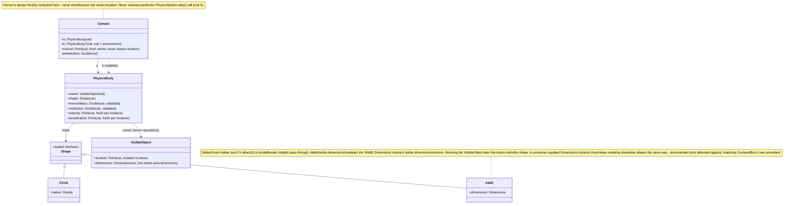

# Plan: `physics-body-model` — `Shape`, `PhysicsBody`, `Contact` for `gametools-world`

## Header / Association

- **Covers:** [SpartanLabsGaming/MyGameTools#49](https://github.com/SpartanLabsGaming/MyGameTools/issues/49)
  — *"Phase 1: physics — motion integration + collision resolution (push-out / slide)"* (item 4
  of 5 in `docs/framework-vision-and-roadmap.md` §3 Phase 1). This plan covers **unit 2 of 6**
  only.
- **Architecture:** `docs/issue-49-physics-architecture.md`, unit slug `physics-body-model`
  (§10 decomposition table, row 2; design in §4.3, stability tiers in §8).
- **Branch:** `feature/49-physics-body-model`, off current `master`.
- **Commit:** TBD
- **PR:** TBD — this plan document is committed together with the first commit of its
  implementation (the `Shape` hierarchy, §5.1 below) so `git log --follow` binds the two.
- **What this plans:** the pure data/value-type layer physics is built on — a new
  `com.spartanlabs.gaming.world.physics` package in `gametools-world` holding `Shape`
  (`Circle`/`Aabb`), `PhysicsBody`, and `Contact`. No detection algorithm, no resolution policy,
  no registry, no wiring into `World`/`WorldSystems` — those are units 3, 4, 5, and 6.
- **Status:** planning only. No source, test, or build file has been modified by this document.
- **Target release:** `5.3.0`. **`5.2.0` has not been cut yet** — all four published
  coordinates still read `5.1.0` (`gametools-world/build.gradle.kts:14`, verified against
  `master`), and #42/#46/#47/#48 all sit under `CHANGELOG.md`'s `[Unreleased]` heading. This
  unit's commits land on `master` under `[Unreleased]` like every unit ahead of it; this plan
  does not bump any version number or cut a release.
- **Dependencies:** none. Per architecture §10 this unit is independent of unit 1
  (`physics-core-seams`) and may land in parallel with it. Units 3 (`physics-narrow-phase`), 4
  (`physics-resolution`), and 5 (`physics-system`) all depend on this unit's exact signatures.
- **Related docs:** `docs/issue-49-physics-architecture.md` (§4.1 system inventory, §4.3 data
  model, §4.6 diagonal-gap policy, §4.7 hazard 6, §8 stability tiers, §10 decomposition);
  `docs/physics-core-seams-plan.md` (unit 1, sibling, independent); `docs/issue-46-map-model-plan.md`
  (`StaticGeometry`/`CenteredBox` precedent this design follows); GeneralTools `2.2.0`
  (`Point`, `Dimensions`, `CenteredBox` — the vocabulary this unit's types are built from).

---

## 1. Context

### 1.1 What exists today (verified against `master`)

- `gametools-world` has no `com.spartanlabs.gaming.world.physics` package; its only packages are
  `world.map` and `world.zone` (verified: `gametools-world/src/main/kotlin/com/spartanlabs/gaming/world/*`).
- `gametools-world/build.gradle.kts` applies `id("gametools.published-library")`, which pulls in
  `gametools.kotlin-library`'s `dependencies` block directly — `api("io.github.spartanlaboratories:GeneralTools:2.2.0")`
  (`build-logic/src/main/kotlin/gametools.kotlin-library.gradle.kts:19`). **`gametools-world`
  already has a direct `api` dependency on GeneralTools 2.2.0** (not merely transitive through
  `gametools-core`), so `com.spartanlabs.geometry.Point`/`Dimensions` are resolvable today with
  **no build-file change**.
- `GameObject.location` is `val Point` (`GameObject.kt:42`), mutated in place by every existing
  mover (`Actor.stepTowardsDestination`/`stepAlongAngle`, `Actor.kt:190-224`) via
  `location.setTo(...)` / `location += ...`. GeneralTools' `Point`/`Dimensions` extend
  `TwoDoubles`, which defines `plusAssign`/`minusAssign`/`timesAssign`/`divAssign` as mutating
  operators but **no `plus`/`minus` operator returning a new instance** (verified,
  `TwoDoubles.kt` in the GeneralTools `2.2.0` sources jar) — `location += x` compiles,
  `location + x` does not.
- `VisibleObject.angle` (`VisibleObject.kt:74-78`) is the repo's one precedent for a
  *normalising* custom setter: an out-of-range assignment is coerced into range and logged at
  `WARN`, never rejected. `VisibleObject.dimensions` (`VisibleObject.kt:62-64`) is a `var`
  shortcut reading/writing straight through to `area.dimensions` — the vocabulary this unit's
  `Aabb` matches.
- `VisibleObject.lastIndexedLocation`'s KDoc (`VisibleObject.kt:107-113`) states the aliasing
  hazard this design must avoid explicitly: *"a value snapshot, not a reference to `location`
  (which is mutated in place; aliasing it here would make every object look permanently
  unmoved)."*
- `EntityId` (`EntityId.kt:36-37`) is the repo's `@JvmInline value class` precedent, for an
  **immutable identifier** — not the shape this unit's mutable, multi-field types (`PhysicsBody`)
  should take.
- `TiledMap`'s `init` block (`TiledMap.kt:57`) is the repo's precedent for **`require`-based
  rejection of a structurally-invalid constructor input as programmer error**:
  `require(widthTiles > 0 && heightTiles > 0 && tileSize > 0.0) { "widthTiles/heightTiles/tileSize must be positive" }`.
- `StaticGeometry` (`gametools-world/src/main/kotlin/com/spartanlabs/gaming/world/map/StaticGeometry.kt`)
  is the one existing `gametools-world` consumer of GeneralTools' `CenteredBox` — its own KDoc
  calls out matching "GeneralTools 2.2.0's collision convention directly rather than an internal
  box type," the same convention this unit follows for `Shape`.
- GeneralTools `2.2.0`'s `CenteredBox` (its own KDoc) is the direct precedent for **not**
  validating a value type against `Point`/`Dimensions` mutability, instead documenting the
  hazard: *"Value type. `Point` and `Dimensions` are mutable, so do not mutate `center` or
  `halfExtents` after handing them to a `CenteredBox`, and note that `copy` shares the same
  instances."* This unit's `Aabb`/`Contact` KDoc mirror that wording directly (§4.2, §4.5).
- No file under `gametools-world/src/main/kotlin` calls `LoggerFactory`/uses slf4j today
  (verified by search) — **this unit is the first to add logging to `gametools-world`'s main
  source**, following `gametools-core`'s own `GameObject.kt`-style shared package logger.
- `gametools-world`'s existing test tree uses `kotlin.test` on the JUnit 5 platform, one class
  per file, `com.spartanlabs.gaming.testing.<level>.world.<subpackage>` packaging (verified:
  `StaticGeometryTest.kt`, `TiledMapQueryLawsTest.kt`) — no MockK anywhere in the repo (verified
  by search), matching `docs/physics-core-seams-plan.md` §6's same finding for `gametools-core`.

### 1.2 Acceptance criteria for this unit

- `gametools-world` compiles a new package `com.spartanlabs.gaming.world.physics` with exactly
  three public declarations: `sealed interface Shape` (with nested `Circle`/`Aabb`), `class
  PhysicsBody`, `data class Contact` — matching the exact signatures in §5 below, which units 3,
  4, and 5 depend on verbatim.
- `Shape.Circle`/`Shape.Aabb` reject a non-positive or non-finite radius/dimension at
  construction, throwing `IllegalArgumentException` (never a silently-accepted degenerate
  shape) — the structural precondition architecture §4.6's diagonal-gap policy depends on.
- `PhysicsBody`'s `inverseMass`/`restitution` are validated on every assignment (constructor and
  later), never merely at construction.
- No algorithm of any kind — no overlap test, no distance/normal computation, no `TerrainCollisionIndex`,
  no `PhysicsSystem`. This unit's three files each compile with `gametools-core` and
  GeneralTools `2.2.0` as their only non-test dependencies.
- `gametools-core` gains nothing from this unit — confirmed by this plan touching only
  `gametools-world`.
- CHANGELOG and README document this unit's own surface in its own commits (§7), per
  architecture §10's per-unit-documents-its-own-surface rule.

---

## 2. Design

### 2.1 Package placement

`com.spartanlabs.gaming.world.physics`, exactly as architecture §4.1/§10 name it. Sibling to the
existing `world.map`/`world.zone` packages, matching `gametools-world`'s established
one-top-level-package-per-system convention. All three types land in this one package; no
sub-packaging (three files do not warrant it).

### 2.2 `Shape` — closed union, validated at construction

```kotlin
sealed interface Shape {
    data class Circle(val radius: Double) : Shape
    data class Aabb(val dimensions: Dimensions) : Shape
}
```

- **`sealed interface`, not `sealed class`** — matches GeneralTools' own `SegmentIntersection`
  precedent (a `sealed interface` result type dispatched by `when`) and carries no shared state
  or behaviour for `Circle`/`Aabb` to inherit, so an interface is the honest shape.
- **Nested, not top-level** — `Shape.Circle`/`Shape.Aabb`, matching architecture §4.3's own code
  block and the cross-unit contract's `Shape.Aabb(holder.dimensions)` usage in unit 5's `attach`
  default.
- **`Circle` is public** (the visibility this unit must decide, per architecture §4.3's own
  note that it "decides its visibility"). Justification, stated precisely: `Shape` itself is
  public (`PhysicsBody.shape: Shape` is a public property), and Kotlin requires every direct
  subtype reachable from a public sealed type's public API to be at least as visible — a
  consumer's own exhaustive `when (shape) { is Shape.Circle -> ...; is Shape.Aabb -> ... }`
  cannot reference a branch it cannot name. Making `Circle` `internal` while `Shape` stays public
  would make the sealed hierarchy publicly *closed* but privately *unusable* — a contradiction,
  since the entire point of sealing `Shape` is to let an external `CollisionResolver`
  implementation (unit 4's `@SupportedExtension` seam) exhaustively branch on it (architecture
  §4.5's shipped resolver does exactly this internally, and a consumer's substitute resolver is
  expected to as well).
- **`Aabb` carries `Dimensions`, not half-extents.** This matches `VisibleObject.dimensions`'s
  own vocabulary (`VisibleObject.kt:62-64`) rather than GeneralTools' centre-origin,
  half-extent `CenteredBox`, so that `PhysicsSystem.attach`'s default
  (`shape = Shape.Aabb(holder.dimensions)`, unit 5) is a direct, unconverted pass-through — no
  divide-by-two, no risk of a units mismatch at the one call site every `attach()` without an
  explicit `shape` argument goes through. Conversion to a `CenteredBox` (half-extents, centred at
  `owner.location`) happens only inside the narrow phase (unit 3) and the resolver (unit 4),
  on demand — **this unit deliberately does not ship that conversion** (see §8, sibling
  interfaces).
- **Validation: `require`, not `Result`.** Both `Circle.radius` and `Aabb.dimensions`
  (`width`/`height`) must be strictly positive **and finite**:

  ```kotlin
  init { require(radius > 0.0 && radius.isFinite()) { "Circle radius must be finite and positive (was $radius)" } }
  init { require(dimensions.width > 0.0 && dimensions.width.isFinite() && dimensions.height > 0.0 && dimensions.height.isFinite()) {
      "Aabb dimensions must be finite and positive (was ${dimensions.width} x ${dimensions.height})"
  } }
  ```

  A comparison against `0.0` already excludes `NaN` for free — `Double.NaN > 0.0` is `false` by
  IEEE-754, so `radius > 0.0` alone rejects zero, every negative value, and `NaN` in one
  condition. The explicit `.isFinite()` conjunct is this plan's own addition **beyond the
  literal "reject zero/negative/NaN" instruction** (flagged, not silent — see §9 open decision
  1): `radius > 0.0` alone would *accept* `Double.POSITIVE_INFINITY`, and an infinite shape
  extent is exactly as structurally unsound for architecture §4.6's merged-obstacle-box
  diagonal-gap argument as a zero or negative one, plus it would poison downstream half-extent
  and penetration arithmetic with more infinities/`NaN`s the moment anything subtracts from it.
  **Why `require` (programmer/config error) and not `Result`:** a `Shape`'s extent is a
  design-time configuration value a caller writes as a literal or reads from level/unit-authoring
  data they control, not user input arriving over a wire — exactly the same category `TiledMap`
  treats as a `require` failure for its own `widthTiles`/`heightTiles`/`tileSize`
  (`TiledMap.kt:57`, precedent applied directly). This is *unlike* `MapLoader.fromJson`, which
  wraps genuinely untrusted external JSON in `Result` (`docs/issue-46-map-model-plan.md`) —
  the difference is where the untrusted boundary actually is, not the kind of value. A future
  call site that *does* face untrusted input (e.g. a level editor parsing a shape from a file)
  is responsible for catching `IllegalArgumentException` and translating it into its own
  `Result`, the same way any `require`-based constructor in this codebase already works.
- **One `internal` derived helper, and no other shared behaviour on `Shape` itself.**
  `Shape.halfExtents(): Dimensions` (§5.1) is the one exception to "declare the closed set,
  validate it, nothing else" — added after review with unit 5 (`physics-system`)'s author
  identified that both unit 3's swept overlap pre-check and unit 5's broad-phase query-box
  expansion (architecture §4.4 step 2: "expanded by its own half-extent") need the exact same
  position-independent half-width/half-height derivation, and the architecture assigns it to
  neither unit by name. Providing it once, here, as an `internal` (not public) extension
  function avoids two independently-written, potentially-divergent copies of the same three-line
  `when`. It stops short of a full `Shape`-plus-position conversion to a GeneralTools
  `CenteredBox` — that still needs a position `Shape` deliberately does not carry, and stays
  architecture §4.3's assigned job for whichever unit (3 or 5) is actually holding one. No other
  method (`area()`, a full `toCenteredBox()`, etc.) is added.

### 2.3 `PhysicsBody` — mutable per-tick state, closed to subclassing, `internal` factory

```kotlin
class PhysicsBody internal constructor(
    val owner: VisibleObject,
    initialShape: Shape,
    initialInverseMass: Double,
    initialRestitution: Double,
) {
    var shape: Shape = initialShape

    var inverseMass: Double = coerceInverseMass(initialInverseMass)
        set(value) { field = coerceInverseMass(value) }

    var restitution: Double = coerceRestitution(initialRestitution)
        set(value) { field = coerceRestitution(value) }

    var velocity: Point = Point(0.0, 0.0)
    var acceleration: Point = Point(0.0, 0.0)
}
```

- **Plain `class`, never `data class`, never `open`.** Per architecture §8: no behaviour hook
  exists to override (unlike `Buff`'s `onApplied`/`onTick`/`onExpired`), and it is a data holder
  external to `GameObject`'s hierarchy, matching `Zone`/`StaticGeometry`/`TerrainLayer`'s closed
  precedent, not `Buff`'s open one. `equals`/`hashCode` are therefore the default **reference**
  identity — deliberate: `PhysicsSystem`'s `entityId`-keyed registry (unit 5) returns a specific
  body instance from `bodyFor(entityId)`, and two bodies with numerically identical fields are
  still two different bodies. A `data class` here would silently make that untrue.
- **`internal constructor`** — architecture §4.3/§4.7 hazard 3 make `PhysicsSystem.attach` (unit
  5) the sole factory, so it can enforce `require(holder.entityId != EntityId.UNASSIGNED)` before
  a body ever exists. This compiles cleanly with `PhysicsBody` itself being a **public class**:
  Kotlin only forbids exposing a *less*-visible type through a *more*-visible signature, and
  restricting who may *call the constructor* is orthogonal to the class's own visibility — the
  same "public type, internal factory" shape as, e.g., a `buildXxx {}`-style builder. §8 below
  explains why the class itself must stay public regardless.
- **`owner: VisibleObject` is `val`** — the one invariant ("a body never changes which entity it
  augments") stays final. `PhysicsBody` **never stores its own position**; every consumer reads
  `body.owner.location` — deliberately, per architecture §4.3/§9's rejected alternative
  ("storing position on `PhysicsBody` … would create two sources of truth"). This unit does not
  add any new field to `VisibleObject`/`GameObject`.
- **`shape` is a plain `var`, no custom setter.** `Shape.Circle`/`Shape.Aabb` already validate
  themselves at construction (§4.2); reassigning `shape` just swaps which already-valid value
  the body points at (e.g. a stance change widening a hitbox). No re-validation needed here.
- **`inverseMass`/`restitution` are validated `var`s, mirroring `VisibleObject.angle`'s
  normalising-setter idiom (`VisibleObject.kt:74-78`) exactly**: coerce into range and log a
  `WARN`, never throw. Two private top-level functions do the coercion so the exact same logic
  runs both at construction (via the property initializer) and on every later reassignment
  (via the setter):

  ```kotlin
  /** Clamps [value] to `>= 0.0` (0 = immovable); NaN and negative values are logged and coerced to `0.0`. */
  private fun coerceInverseMass(value: Double): Double = when {
      value.isNaN() -> { log.warn("PhysicsBody.inverseMass {} is NaN; coerced to 0.0 (immovable)", value); 0.0 }
      value < 0.0 -> { log.warn("PhysicsBody.inverseMass {} is negative; coerced to 0.0 (immovable)", value); 0.0 }
      else -> value
  }

  /** Clamps [value] into `0.0..1.0`; NaN is logged and coerced to `0.0`, an out-of-range value is logged and clamped. */
  private fun coerceRestitution(value: Double): Double =
      if (value.isNaN()) { log.warn("PhysicsBody.restitution {} is NaN; coerced to 0.0", value); 0.0 }
      else value.coerceIn(0.0, 1.0).also { coerced -> if (coerced != value) log.warn("PhysicsBody.restitution {} clamped to {}", value, coerced) }
  ```

  **A correctness detail worth being exact about, since it is easy to get wrong:** Kotlin's
  `Double.coerceIn`/`coerceAtLeast` implement their bound checks as `this < minimum` /
  `this > maximum` — every comparison against `NaN` is `false`, so `NaN.coerceIn(0.0, 1.0)`
  returns `NaN` **unchanged**, silently defeating a naïve `value.coerceIn(0.0, 1.0)` one-liner.
  The explicit `value.isNaN()` branch above is not decorative; it is the only thing that actually
  catches a `NaN` assignment.
- **A second correctness detail, also worth being exact about:** the constructor parameters are
  named `initialShape`/`initialInverseMass`/`initialRestitution` — deliberately **not** the same
  names as the properties they seed. If they were (`class PhysicsBody(inverseMass: Double) { var
  inverseMass: Double = inverseMass; ... }`), a property initializer referencing the
  constructor parameter is fine for that one line, but Kotlin resolution shadows the parameter
  name with the property from that declaration onward — an `init { this.inverseMass = inverseMass }`
  written *after* the property declaration would then read the identifier `inverseMass` as the
  **property itself**, not the original constructor argument, silently turning the "validate on
  construction" call into a harmless-but-pointless self-assignment. Distinct parameter names sidestep
  the ambiguity entirely and make `coerceInverseMass(initialInverseMass)` unambiguous at the
  property-initializer call site.
- **`velocity`/`acceleration` default to a fresh `Point(0.0, 0.0)` per instance**, not a shared
  constant. Kotlin evaluates a property initializer expression once per object construction, so
  two `PhysicsBody`s never share the same `Point` instance here (verified as a locked-in
  assertion, §6). This matters because `Point`/`Dimensions` are mutable
  (`TwoDoubles.kt`'s `var first`/`second`): a `companion object { val ZERO = Point(0.0, 0.0) }`-style
  shared default would make mutating one body's `velocity` in place corrupt every other body's
  default velocity — the exact class of bug `VisibleObject.lastIndexedLocation`'s KDoc
  (`VisibleObject.kt:107-113`) already warns against for a different field. **Unlike
  `owner.location`** (a `val Point` every mover writes through in place and must never
  reassign), `velocity`/`acceleration` are owned solely by `PhysicsBody` with nothing else
  aliasing them, so unit 5's integrator is free to either mutate them in place
  (`velocity.setTo(...)`) or reassign the `var` wholesale (`velocity = Point(...)`) — both are
  safe here in a way reassigning `owner.location` itself would not be.
- **A logging gap worth flagging for unit 5:** GeneralTools `2.2.0`'s `Point`/`TwoDoubles` define
  `plusAssign`/`minusAssign`/`timesAssign`/`divAssign` but **no `plus` operator returning a new
  `Point`**. Architecture §4.4 step 1 describes computing "a proposed new `owner.location +
  velocity`," which is not literal, compiling Kotlin against this GeneralTools version — unit 5
  (and unit 3's swept-AABB math) will need to do the addition component-wise
  (`Point(location.x + velocity.x, location.y + velocity.y)`) or add a local `operator fun
  Point.plus(other: Point): Point` extension of their own. Not this unit's problem to solve (no
  algorithm lives here), but recorded so unit 5's plan does not silently assume an operator that
  does not exist.

### 2.4 `Contact` — the manifold, undecorated

```kotlin
data class Contact(
    val a: PhysicsBody,
    val b: PhysicsBody?,
    val normal: Point,
    val penetration: Double,
)
```

- **`data class`**, matching architecture §8's own tier table ("Contact — Closed (`data
  class`)"). Structural `equals`/`hashCode`/`copy`/`toString` are all useful here: a
  `CollisionResolver` implementer's own unit test (§8) wants to build an expected `Contact` and
  compare it by value, and `Contact.a`/`.b` compare by `PhysicsBody`'s own (reference) equality,
  so two `Contact`s are equal only when they name literally the same bodies plus an
  equal normal/penetration — appropriate for a value that exists for exactly one tick.
- **`b: PhysicsBody?` nullable** represents bounds/`StaticGeometry`/terrain uniformly as an
  environment contact, per architecture §4.3 — no synthetic `VisibleObject`/`PhysicsBody` is
  constructed for a wall. **This is not a failure case and is not modelled as `Result`** — a
  miss (no contact at all) is a `null` `Contact?` at the call site that builds one (unit 3's
  concern, not this type's); `b == null` on an *existing* `Contact` means "the other participant
  is the environment," a perfectly normal, expected value, not an absent one.
- **`normal`/`penetration` carry no constructor-time validation**, matching GeneralTools'
  `CenteredBox` precedent directly (its own KDoc: *"Negative or `NaN` `halfExtents` are not
  rejected here … the intersection functions reject a box whose size is negative or
  non-finite"*) rather than `Shape`'s stricter policy (§4.2). Three reasons, stated explicitly
  since this is a deliberate asymmetry within the same unit, not an oversight:
  1. **Different producer, different trust boundary.** A `Shape` is typically a
     design-time/config value a human sets up once; a `Contact` is computed, every tick, by
     unit 3's narrow-phase math from already-validated inputs. Re-validating (a `sqrt` to check
     `normal`'s length is `~1.0`, a sign check on `penetration`) on every one of what could be
     hundreds of contacts per tick is a cost with no correctness upside — the producer already
     owns correctness of its own output.
  2. **Architecture §4.6's diagonal-gap argument depends on `Shape` always having positive
     extent structurally; nothing in this issue depends on `Contact.normal` being validated at
     the type level** — only on the *narrow phase* actually supplying a correct one, which is
     unit 3's test surface, not this unit's.
  3. It keeps `Contact` genuinely free to serve a `CollisionResolver` implementer's own tests
     (§8): a resolver unit test that hand-builds a `Contact` with an arbitrary `normal`/
     `penetration` to drive a specific code path should not have to first defeat a validation
     rule this type was never asked to enforce.

  The expected invariants (`normal` is unit length, `penetration >= 0`) are documented in
  `Contact`'s own KDoc as **the producer's responsibility**, not enforced here — mirrored by the
  L4a law test in §6, which builds a `normal` the intended way (via GeneralTools'
  `Point.normalized()`) and checks the result is unit length, rather than asserting `Contact`
  itself would reject a non-unit one.
- **Lifetime and aliasing, stated in KDoc:** built fresh every `PhysicsSystem.step()` call
  (unit 5), never retained past it, and `normal` is always a freshly computed `Point`
  representing a *displacement*, matching `Actor.locmod`'s own existing use of `Point` for a
  vector rather than a position (`Actor.kt:173-179`) — never an alias into `owner.location`
  itself. Because `Point` is mutable, `Contact`'s own generated `copy()` shares the same
  `normal` instance with the original (matching `CenteredBox`'s documented `copy()` warning
  verbatim) — worth restating explicitly here rather than leaving a reader to rediscover it.

### 2.5 Type relationships and aliasing (diagram)



---

## 3. Staging

Single-stage unit — three small, mutually-referencing files with no meaningful independent
landing order beyond compile-order (`Shape` has no dependency on the other two; `PhysicsBody`
depends on `Shape`; `Contact` depends on `PhysicsBody`). Staged as three source commits plus one
documentation commit (§7), not as separately reviewable PRs — this unit is too small to justify
splitting into multiple PRs the way units 3-6 might be.

---

## 4. Documentation impact (Audience-Reach rings)

- **Inner Core (in-editor):** the repo's import-region convention (`.aiassistant/rules/CLAUDE.md`
  §6) applies to every new file's import block; given each file's imports are short, only the
  present groups get a region comment (e.g. `Shape.kt` needs only `//region 1. Organization
  Internal` / `// 1.1 Spartan Laboratories`, no `1.2` subgroup, matching `StaticGeometry.kt`'s
  own precedent of omitting an empty subgroup). No member-level `//region` grouping is added
  inside `PhysicsBody`/`Contact` — both are short enough that `StaticGeometry.kt`'s (no internal
  regions) precedent applies, not `GameObject.kt`'s (regions for genuinely large member groups).
- **Component Ring (KDoc/API contracts):** the primary ring this unit touches. Full KDoc
  (`@param`/`@property`/`@throws` as applicable) on `Shape`, `Shape.Circle`, `Shape.Aabb`,
  `PhysicsBody`, and `Contact` — all five are genuinely public API from this commit onward (see
  §8 for why `PhysicsBody`'s public-class-but-internal-constructor shape still needs full KDoc:
  every property is publicly readable/writable). Must render cleanly under
  `./gradlew dokkaGeneratePublicationHtml`.
- **Boundary Ring (protocol/integration):** **not touched.** None of `Shape`/`PhysicsBody`/
  `Contact` is `@Serializable` — no wire format, no snapshot DTO. This is a deliberate scope
  limit stated here rather than left implicit: nothing in the architecture or the acceptance
  shape (§1.3 of the architecture doc) asks a client to see raw `velocity`/`inverseMass`/
  `restitution`; the existing `VisibleObjectSnapshot`'s `gameObject.location`/`dimensions`
  already carries what a client needs to render the *result* of physics. If a future phase wants
  client-side prediction using raw physics state, that is a new, separate design decision, not a
  silent gap in this one (flagged in §9 as an open item for the record).
- **Architectural Outer Layer:** `docs/issue-49-physics-architecture.md` already documents this
  unit's design in full (§4.3); no update owed to it by this unit specifically. The `§7`
  cross-cutting roadmap corrections remain unit 6's responsibility (already assigned there by
  architecture §10 and restated by `docs/physics-core-seams-plan.md` §9 for unit 1's own
  boundary — this plan draws the same boundary for unit 2).
- **README / CHANGELOG currency:** both updated in this unit's own commits (§7.3), per the
  global README-currency rule and architecture §10's explicit per-unit-documents-its-own-surface
  instruction — narrowly scoped to the Modules-table row for `world` (§7.3), **not** the
  Features-prose section describing physics as a whole, which architecture §10 explicitly
  reserves for unit 6.

---

## 5. File-by-file changes

### 5.1 New: `gametools-world/src/main/kotlin/com/spartanlabs/gaming/world/physics/Shape.kt`

```kotlin
package com.spartanlabs.gaming.world.physics

//region 1. Organization Internal
// 1.1 Spartan Laboratories
import com.spartanlabs.geometry.Dimensions
//endregion

/**
 * The collider footprint a [PhysicsBody] uses in `PhysicsSystem`'s broad and narrow phases -
 * placement-independent: a `Shape` carries only its own size, never a position (that comes from
 * [PhysicsBody.owner]'s [com.spartanlabs.gaming.gameobjects.GameObject.location]). `PhysicsSystem`
 * is not part of this unit (it lands with unit 5) - referenced here only in prose, not as a KDoc
 * link, since it does not exist yet when this file's own PR merges.
 *
 * Sealed to exactly [Circle] and [Aabb] deliberately: every pairwise narrow-phase test
 * (Circle-Circle, Circle-Aabb, Aabb-Aabb) is written as one exhaustive `when` over this set, and
 * a closed set turns a future third shape into a compile error at every one of those call
 * sites rather than a silent runtime gap. Matches GeneralTools' own `SegmentIntersection`
 * precedent for a `sealed interface` result type dispatched by `when`.
 */
sealed interface Shape {

    /**
     * A circular collider of [radius].
     *
     * @property radius the circle's radius; must be strictly positive and finite
     * @throws IllegalArgumentException if [radius] is not finite or not strictly positive
     *   (zero, negative, `NaN`, or infinite)
     */
    data class Circle(val radius: Double) : Shape {
        init {
            require(radius > 0.0 && radius.isFinite()) {
                "Circle radius must be finite and positive (was $radius)"
            }
        }
    }

    /**
     * An axis-aligned box collider spanning [dimensions] (full width/height, not half-extents),
     * matching [com.spartanlabs.gaming.gameobjects.VisibleObject.dimensions]'s own vocabulary so
     * that deriving one from a [com.spartanlabs.gaming.gameobjects.VisibleObject] is a direct,
     * unconverted pass-through. Distinct from GeneralTools' centre-origin, half-extent
     * `CenteredBox`; a consumer of this shape converts to one only where the collision math
     * actually needs it.
     *
     * [Dimensions] is mutable - treat the instance handed to this constructor as owned by this
     * `Aabb` from that point on (this type does not defensively copy it, so mutating the same
     * instance elsewhere - including a live [com.spartanlabs.gaming.gameobjects.VisibleObject.dimensions]
     * this `Aabb` was built from - changes this shape too), and note [copy] shares the same
     * [Dimensions] instance with the original, exactly like GeneralTools' own `CenteredBox`.
     *
     * @property dimensions the box's full width and height; both components must be strictly
     *   positive and finite
     * @throws IllegalArgumentException if either component of [dimensions] is not finite or not
     *   strictly positive (zero, negative, `NaN`, or infinite)
     */
    data class Aabb(val dimensions: Dimensions) : Shape {
        init {
            require(dimensions.width > 0.0 && dimensions.width.isFinite() &&
                dimensions.height > 0.0 && dimensions.height.isFinite()) {
                "Aabb dimensions must be finite and positive (was ${dimensions.width} x ${dimensions.height})"
            }
        }
    }
}

/**
 * This shape's placement-independent bounding half-width/half-height: a [Shape.Circle]'s
 * bounding-square half-extent is `(radius, radius)`; a [Shape.Aabb]'s is exactly half of its own
 * [Shape.Aabb.dimensions] on each axis.
 *
 * `internal` - a shared derivation for `gametools-world`'s own broad-phase query-box expansion
 * and narrow-phase overlap pre-check (needed identically by the swept detection landing with
 * unit 3, `physics-narrow-phase`, and the broad-phase query expansion landing with unit 5,
 * `physics-system` - see architecture §4.4 step 2's "expanded by its own half-extent"). Not
 * public API: a consumer implementing their own resolution policy has no need for it, since the
 * system that owns position (unit 5) already does this conversion before anything reaches a
 * resolver. Deliberately narrower than a full shape-plus-position conversion to a GeneralTools
 * `CenteredBox` - this function needs no position, matching [Shape]'s own placement-independence
 * (per its class doc above); centring the result on a body's own
 * [com.spartanlabs.gaming.gameobjects.GameObject.location] is left to whichever unit actually
 * needs the positioned box, exactly as architecture §4.3 already assigns that fuller conversion
 * to the system that has a position to give it.
 *
 * @return this shape's half-width and half-height as a fresh [Dimensions] instance
 */
internal fun Shape.halfExtents(): Dimensions = when (this) {
    is Shape.Circle -> Dimensions(radius, radius)
    is Shape.Aabb -> Dimensions(dimensions.width / 2.0, dimensions.height / 2.0)
}
```

**Error handling:** `Circle`/`Aabb` throw `IllegalArgumentException` via `require` for a
non-positive/non-finite extent — a programmer/config error, not an expected operational
failure, per the reasoning in §2.2 (`TiledMap.kt:57` precedent). Not encapsulated in `Result`.
`Shape.halfExtents()` is a total function over an already-valid `Shape` (every `Circle`/`Aabb`
in existence has already passed its own `require`) — nothing left for it to fail on, so it
returns a plain `Dimensions`, not a `Result`.

**Mutability:** `Circle.radius` is `val` (a `Double`, immutable by nature). `Aabb.dimensions` is
`val` but the referenced `Dimensions` instance itself is mutable (GeneralTools' own design) —
documented, not defended against, exactly like `CenteredBox`. `Shape.halfExtents()` always
returns a **fresh** `Dimensions` instance, never a reference into an `Aabb`'s own `dimensions` —
so halving it and handing it to a caller cannot alias back into the `Shape` it was derived from.

**Logging:** none. A `require` failure's own exception message carries the diagnostic; no file
in this unit's scope has a runtime code path worth logging beyond that (see §5.2 for the one
file that does log). `halfExtents()` is pure arithmetic with nothing to report.

**Stability tier:** **Stable Core**, closed (`sealed`), for `Shape`/`Circle`/`Aabb`. Per
architecture §8: exhaustive `when` dispatch is part of the contract; shape *parameters*
(`radius`, `dimensions`) are ordinary constructor arguments, not a policy seam.
`Shape.halfExtents()` itself carries **no stability tier** at all — it is `internal`, not part
of the public API surface, so it is outside `CONTRIBUTING.md`'s semver governance entirely and
can change freely as units 3/5 are actually implemented, so long as it stays `internal`.

### 5.2 New: `gametools-world/src/main/kotlin/com/spartanlabs/gaming/world/physics/PhysicsBody.kt`

```kotlin
package com.spartanlabs.gaming.world.physics

//region 1. Organization Internal
// 1.1 Spartan Laboratories
import com.spartanlabs.geometry.Point
// 1.2 Spartan Gaming
import com.spartanlabs.gaming.gameobjects.VisibleObject
//endregion

//region 4. Programming Infrastructure and Support
// 4.1 Logging
import org.slf4j.Logger
import org.slf4j.LoggerFactory
//endregion

/** Shared slf4j logger for the physics package; bound to the facade only, never an implementation. */
internal val log: Logger = LoggerFactory.getLogger("com.spartanlabs.gaming.world.physics")

/**
 * One entity's physics-only state, attached to [owner] by `PhysicsSystem.attach` (unit 5,
 * `physics-system` - not part of this file's own module state yet, so referenced here only in
 * prose, never as a KDoc link).
 *
 * A `PhysicsBody` never stores its own position - every consumer reads
 * `body.owner.location` directly, the same [com.spartanlabs.gaming.gameobjects.GameObject.location]
 * every existing mover already mutates in place. Duplicating position here would create two
 * sources of truth for where [owner] is.
 *
 * Two bodies with identical field values are still different bodies: equality is the default
 * reference identity, not structural - there is no meaningful sense in which two attachments to
 * two different [VisibleObject]s are "the same" body.
 *
 * @property owner the [VisibleObject] this body augments; fixed for this body's lifetime
 * @property shape this body's current collider footprint
 * @property inverseMass `1 / mass`; `0.0` means immovable. Assigning a negative or `NaN` value
 *   is logged at `WARN` and coerced to `0.0` rather than rejected, mirroring
 *   [VisibleObject.angle]'s own normalising-setter idiom
 * @property restitution the bounciness this body contributes to a collision, clamped to
 *   `0.0..1.0`. Assigning an out-of-range or `NaN` value is logged at `WARN` and clamped/coerced
 *   rather than rejected, mirroring [VisibleObject.angle]'s own normalising-setter idiom
 * @property velocity this body's current velocity, in world units per tick (there is no `dt` -
 *   see `PhysicsSystem`, unit 5). Defaults to a fresh zero vector, never shared with any other
 *   body's default
 * @property acceleration this body's current acceleration, in world units per tick squared.
 *   Defaults to a fresh zero vector, never shared with any other body's default
 */
class PhysicsBody internal constructor(
    val owner: VisibleObject,
    initialShape: Shape,
    initialInverseMass: Double,
    initialRestitution: Double,
) {
    var shape: Shape = initialShape

    var inverseMass: Double = coerceInverseMass(initialInverseMass)
        set(value) { field = coerceInverseMass(value) }

    var restitution: Double = coerceRestitution(initialRestitution)
        set(value) { field = coerceRestitution(value) }

    var velocity: Point = Point(0.0, 0.0)

    var acceleration: Point = Point(0.0, 0.0)
}

/**
 * Coerces [value] to a valid [PhysicsBody.inverseMass]: `>= 0.0`. A negative or `NaN` [value] is
 * logged at `WARN` and coerced to `0.0` (immovable) rather than rejected.
 */
private fun coerceInverseMass(value: Double): Double = when {
    value.isNaN() -> {
        log.warn("PhysicsBody.inverseMass {} is NaN; coerced to 0.0 (immovable)", value)
        0.0
    }
    value < 0.0 -> {
        log.warn("PhysicsBody.inverseMass {} is negative; coerced to 0.0 (immovable)", value)
        0.0
    }
    else -> value
}

/**
 * Coerces [value] to a valid [PhysicsBody.restitution]: `0.0..1.0`. A `NaN` [value] is logged at
 * `WARN` and coerced to `0.0`; an in-range-but-out-of-bounds value is logged at `WARN` and
 * clamped. `Double.coerceIn` alone is not sufficient here - every comparison against `NaN` is
 * `false`, so `Double.NaN.coerceIn(0.0, 1.0)` returns `NaN` unchanged.
 */
private fun coerceRestitution(value: Double): Double =
    if (value.isNaN()) {
        log.warn("PhysicsBody.restitution {} is NaN; coerced to 0.0", value)
        0.0
    } else value.coerceIn(0.0, 1.0).also { coerced ->
        if (coerced != value) log.warn("PhysicsBody.restitution {} clamped from {} to {}", value, value, coerced)
    }
```

**Error handling:** no `Result`, no thrown exception from `PhysicsBody` itself. Every
out-of-domain input (`NaN`/negative `inverseMass`, `NaN`/out-of-range `restitution`) is an
*expected*, recoverable input a game might legitimately compute (e.g. a stat formula briefly
producing a small negative number) — coerced and logged rather than treated as a programmer
error, exactly mirroring `VisibleObject.angle`'s own precedent (`VisibleObject.kt:74-78`), which
is why `Shape`'s stricter `require` policy (§5.1) is *not* reused here: a shape's extent is a
one-time setup value where degeneracy is a real configuration mistake worth halting on; a body's
`inverseMass`/`restitution` are runtime-tunable values a live game may reassign every tick from
a formula, where halting the game over a transient bad number is the wrong failure mode. `owner`
being `val` prevents reassignment entirely (no setter, no coercion needed).

**Mutability:** `owner` is `val` (fixed for the body's life). `shape`, `inverseMass`,
`restitution`, `velocity`, `acceleration` are all `var` — `shape` reassignable outright (already
self-validating per §5.1), `inverseMass`/`restitution` reassignable through a validating setter,
`velocity`/`acceleration` reassignable or mutable-in-place at the caller's discretion (§2.3).

**Concurrency:** none addressed — `PhysicsBody` inherits the same single-threaded-driver
assumption every other `gametools-core`/`gametools-world` mutable type carries
(`World`/`SimulationLoop`'s documented contract). No new guarantee, none claimed.

**Logging:** `WARN`-level, one line per out-of-domain assignment, via the shared
`com.spartanlabs.gaming.world.physics` logger declared here (the first logger in
`gametools-world`'s main source, per §1.1). Lifecycle events this unit's own file can log: an
invalid `inverseMass`/`restitution` assignment, at construction or later. No `DEBUG`-level
per-tick logging is added here, since nothing in this unit runs per tick (that begins at unit 5's
`PhysicsSystem.step()`).

**Stability tier:** **Stable Core**, closed (plain `class`, not `open`) — per architecture §8:
no behaviour hook exists to override; the substitutable seam for collision *policy* is
`CollisionResolver` (unit 4), not this type.

### 5.3 New: `gametools-world/src/main/kotlin/com/spartanlabs/gaming/world/physics/Contact.kt`

```kotlin
package com.spartanlabs.gaming.world.physics

//region 1. Organization Internal
// 1.1 Spartan Laboratories
import com.spartanlabs.geometry.Point
//endregion

/**
 * One tick's evidence that two things overlap - the manifold `PhysicsSystem`'s narrow phase
 * (unit 3/5) hands to a `CollisionResolver` (unit 4): the two participants, a unit normal, and a
 * penetration depth. Neither type exists in this module yet, so both are named here only in
 * prose, never as a KDoc link, until their own units land.
 *
 * Built fresh every `PhysicsSystem.step()` call and never retained past that one call - do not
 * cache or store a `Contact` across ticks. [normal] is always a freshly computed vector, never a
 * reference into either participant's live
 * [com.spartanlabs.gaming.gameobjects.GameObject.location] (which is mutated in place; aliasing
 * it here would have the same "looks permanently unmoved" hazard
 * [com.spartanlabs.gaming.gameobjects.VisibleObject.lastIndexedLocation]'s own KDoc warns
 * against). Because [com.spartanlabs.geometry.Point] is mutable, [copy] shares the same
 * [normal] instance with the original - treat a copied `Contact` the same way GeneralTools'
 * `CenteredBox` documents its own `copy()`.
 *
 * Neither [normal] nor [penetration] is validated here: this is a computed result, not a
 * configuration value (contrast [Shape]'s constructor-time validation), and re-checking a
 * `sqrt`-based invariant on what may be hundreds of contacts a tick has no correctness upside
 * when the one producer (the narrow phase, `PhysicsSystem`) already owns getting it right. The
 * expected invariants below are the producer's responsibility, not this type's.
 *
 * @property a one participant; always present
 * @property b the other participant, or `null` for an environment contact - map bounds,
 *   [com.spartanlabs.gaming.world.map.StaticGeometry], or non-walkable terrain - modelled as an
 *   implicit `inverseMass == 0`, zero-velocity partner rather than a synthetic [PhysicsBody]
 * @property normal expected to be unit length, pointing from [a] toward [b] (or outward from
 *   [a], when [b] is `null`)
 * @property penetration expected to be `>= 0`, the overlap depth measured along [normal]
 */
data class Contact(
    val a: PhysicsBody,
    val b: PhysicsBody?,
    val normal: Point,
    val penetration: Double,
)
```

**Error handling:** none — no validation, by the deliberate design decision in §2.4. `Contact`
itself never fails to construct; "no contact" is represented by the *absence* of a `Contact`
(a nullable `Contact?` at the narrow phase's own call site, unit 3's concern), never by a failed
`Result` or a thrown exception from this type.

**Mutability:** every property is `val` — `Contact` is a genuinely immutable value once built,
consistent with "built fresh, never retained." `a`/`b` are `PhysicsBody` references (whose own
fields remain mutable, per §5.2) and `normal` is a `Point` (mutable by GeneralTools' own design,
per §2.4's aliasing note) — `Contact`'s own fields do not change, but what they point to can, by
design (a resolver mutates `a`/`b`'s `velocity` and `owner.location` in place; it does not
reassign `Contact.a`/`.b` themselves).

**Logging:** none. A value carrier with no computation of its own has nothing to report.

**Stability tier:** **Stable Core**, closed (`data class`) — per architecture §8: a plain value
carrier, no substitutable seam of its own (the seam is `CollisionResolver`, which *consumes*
`Contact`, unit 4).

### 5.4 No build-file change

`gametools-world/build.gradle.kts` needs no edit. `gametools-world` already declares a direct
`api` dependency on `io.github.spartanlaboratories:GeneralTools:2.2.0` via the
`gametools.kotlin-library` convention plugin it applies
(`build-logic/src/main/kotlin/gametools.kotlin-library.gradle.kts:19`) — confirmed by reading
the applied plugin, not assumed. `com.spartanlabs.geometry.Point`/`Dimensions` resolve today
with zero dependency changes.

---

## 6. Test plan (5-level hierarchy)

### Level 1 — gating

No `com.spartanlabs.gaming.testing.gating` package exists anywhere in this repo (verified: only
`component`/`integration`/`deterministic`/`e2e`/`nonfunctional` directories exist under
`gametools-world/src/test/kotlin/.../testing/`, matching `docs/physics-core-seams-plan.md` §5's
identical finding for `gametools-core`). Not invented here. Level 1 for this unit in practice
means `./gradlew :gametools-world:componentTest :gametools-world:deterministicTest` before
pushing, using the level 2/4a tests below.

### Level 2 — component

New package `com.spartanlabs.gaming.testing.component.world.physics`, mirroring
`StaticGeometryTest.kt`'s conventions (`kotlin.test` + JUnit 5 platform, one class per file, no
MockK — nothing here makes an external call to mock).

- **`gametools-world/src/test/kotlin/com/spartanlabs/gaming/testing/component/world/physics/ShapeTest.kt`**
  - `Circle` accepts a positive radius; rejects `0.0`, a negative value, `NaN`, and
    `Double.POSITIVE_INFINITY`, each with `assertFailsWith<IllegalArgumentException>`.
  - `Aabb` accepts positive `width`/`height`; rejects each of the same five invalid categories
    independently on `width` and on `height` (an invalid `width` with a valid `height`, and vice
    versa, both fail).
  - Two `Circle`/`Aabb` instances built from equal parameters are structurally `equals` (data
    class default, locked in as a regression guard since a future change to a non-`data class`
    would silently break resolver-test equality assumptions built on it, §8).
  - `Shape.Circle(radius = 4.0).halfExtents()` is `Dimensions(4.0, 4.0)`; `Shape.Aabb(Dimensions(6.0,
    10.0)).halfExtents()` is `Dimensions(3.0, 5.0)`. `halfExtents()` is `internal`, so this test
    (same module) calls it directly, exactly as `PhysicsBody`'s own tests construct against its
    `internal` constructor (§6's "cannot be tested automatically" note explains why that is
    possible).
- **`gametools-world/src/test/kotlin/com/spartanlabs/gaming/testing/component/world/physics/PhysicsBodyTest.kt`**
  - `owner` on a constructed body is the exact same reference passed in (`assertSame`).
  - A negative `inverseMass` at construction is coerced to `0.0`; a `NaN` `inverseMass` at
    construction is coerced to `0.0`; both re-assignable afterward through the setter with the
    same coercion re-applied (assign an invalid value post-construction, assert the stored value
    is coerced, not the original).
  - A `restitution` of `-0.5` is clamped to `0.0`; `1.5` clamped to `1.0`; `NaN` coerced to
    `0.0`; a valid `0.35` passes through unchanged.
  - **Two distinct `PhysicsBody` instances never share the same default `velocity`/
    `acceleration` `Point` instance** (`assertNotSame`) — the regression guard for §2.3's
    "fresh per instance, not a shared constant" design point, specifically because it is the
    kind of correctness property a later refactor toward a shared default could silently break
    without any other test noticing (mutating one body's `velocity` would otherwise corrupt
    every other body's default).
  - Reassigning `shape` replaces the reference read back by the getter (`assertSame` on the new
    `Shape` instance).
  - **Not asserted here:** the `WARN`-level log line itself. This repo has no log-capturing test
    harness in any existing test (verified by search); the coerced *value* is what every test
    above actually checks, which is the behaviour that matters. Recorded as a known
    automated-testing gap in §6's "cannot be tested automatically" note, not silently skipped.
- **`gametools-world/src/test/kotlin/com/spartanlabs/gaming/testing/component/world/physics/ContactTest.kt`**
  - Constructs with `b = null` (environment contact) and with a real second `PhysicsBody`; both
    succeed with no validation to defeat.
  - Structural equality: two `Contact`s built from the same `a`/`b`/`normal`-value/`penetration`
    are `equals`; changing any one field (including swapping `a`/`b`, both non-null) breaks
    equality.
  - `copy()` sharing `normal`'s instance is demonstrated directly: `original.copy().normal ===
    original.normal` (`assertSame`) - turning §2.4's KDoc claim into a checked fact, not just
    prose.

### Level 3 — integration

Not applicable. No external interface, database, network call, or third-party service is
touched by three pure value types. No test added.

### Level 4a — deterministic

New package `com.spartanlabs.gaming.testing.deterministic.world.physics`, matching
`TiledMapQueryLawsTest.kt`'s "law checked over boundary points plus a seeded random sample"
shape.

- **`gametools-world/src/test/kotlin/com/spartanlabs/gaming/testing/deterministic/world/physics/ShapeValidationLawsTest.kt`**
  - For a fixed boundary set `{0.0, -0.0, -1.0, Double.NaN, Double.POSITIVE_INFINITY,
    Double.NEGATIVE_INFINITY}` plus a seeded random sample of negative and NaN-adjacent values,
    `Shape.Circle(x)` and `Shape.Aabb(Dimensions(x, 1.0))` / `Shape.Aabb(Dimensions(1.0, x))`
    each throw `IllegalArgumentException` for every `x` in the set.
  - For a seeded random sample of strictly positive, finite values, both constructors succeed
    and echo the given value back unchanged (`circle.radius == x`).
- **`gametools-world/src/test/kotlin/com/spartanlabs/gaming/testing/deterministic/world/physics/AabbDimensionsRoundTripTest.kt`**
  - The "straight pass-through" law from §2.2/§8: for a seeded random sample of valid
    `Dimensions` instances `d`, `Shape.Aabb(d).dimensions === d` (the *same* reference, not
    merely an equal one) - locking in the deliberate no-defensive-copy design decision as a
    checked fact, since a future "helpful" refactor toward defensive copying would silently
    break unit 5's live-tracking-from-`holder.dimensions` default without any compiler error to
    catch it.
  - **`halfExtents()` doubles back to the original extent:** for the same seeded sample,
    `Shape.Aabb(d).halfExtents().width * 2.0 == d.width` and `... .height * 2.0 == d.height`;
    for a seeded sample of positive radii `r`, `Shape.Circle(r).halfExtents() ==
    Dimensions(r, r)`. Locks in the shared derivation units 3 and 5 both consume (§8) as a
    checked law, not just a worked example in this plan.
- **`gametools-world/src/test/kotlin/com/spartanlabs/gaming/testing/deterministic/world/physics/ContactNormalUnitLengthTest.kt`**
  - For a seeded random sample of non-zero vectors, build each one's `Point.normalized().getOrThrow()`
    result, use it as a `Contact.normal`, and assert the stored `normal`'s `length` (GeneralTools'
    own `Point.length` extension) is within a small epsilon of `1.0` - the explicit law the task
    calls out, expressed as "the standard way of supplying a normal produces one," consistent
    with §2.4's decision that `Contact` itself does not enforce this.

### Level 4b — e2e

Not applicable. No full client-server or `World`-driving flow exists yet for physics (that begins
at unit 5/6); this unit has no `World` interaction at all.

### Level 4c — non-functional

No new test. Three cheap-to-construct value types with a handful of comparisons each have no
meaningful allocation or throughput profile worth benchmarking in isolation; the real
non-functional risk this issue carries - many `Contact` allocations per tick at ~10k-entity
scale - belongs to unit 3 (the narrow phase that actually produces them at volume) and unit 5
(the system that runs it every tick), per architecture §11.

### Level 5 — UAT

No `com.spartanlabs.gaming.testing.uat` package exists anywhere in this repo. Not invented here.
Three value types with no observable runtime behaviour of their own produce nothing for a human
or AI evaluator to assess in isolation - any UAT signal for issue #49 belongs to whichever unit
first produces observable physics (unit 5 or 6), matching `docs/physics-core-seams-plan.md`
§5's identical conclusion for unit 1.

### What genuinely cannot be tested automatically, here and now

- **The `WARN` log lines themselves** (§6, Level 2) - no log-capturing test harness exists in
  this repo today; only the coerced *value* is asserted, not the log emission.
- **That `PhysicsSystem.attach` (unit 5, not yet landed) is actually the only realistic path to
  a `PhysicsBody` a consumer holds.** This unit's own `internal constructor` is directly callable
  from any test file within the `gametools-world` module (Kotlin `internal` is module-scoped,
  not file-scoped - the same mechanism `docs/physics-core-seams-plan.md` §1.1 relies on for
  `World.reconcileSpatialIndex()` and `SpatialIndexScalabilityTest`), so this unit's own tests
  construct `PhysicsBody` directly rather than through `attach`. Proving the *intended* external
  path (`attach` is the only way an actual downstream consumer, outside this module, can obtain
  one) is unit 5's own test surface, once `PhysicsSystem` exists.

---

## 7. Version control

- **Branch:** `feature/49-physics-body-model` (per `CONTRIBUTING.md`'s `feature/<issue#>-<slug>`
  convention, using the architecture's own unit slug).
- **This unit's commits carry no unrelated changes.** The working tree currently holds an
  uncommitted, in-flight refactor moving `Alive`/`Buff`/`Capability`/`Intent`/`ModularStat`/
  `StatMod`/`CombinedStat`/`ExperienceReceiver` into a new `gameobjects.combat` subpackage
  (visible in `git status`: renames plus a new `BuffPlacer.kt`), and other in-flight work
  reported alongside it (`ProjectilePrefabs`, wide test churn). **None of it rides in this
  plan's commits.** Branch off `master` fresh (not off the dirty working tree), so this branch's
  diff to `master` contains exactly the three new files in §5 plus the documentation edits in
  §7.3, and nothing else. If that refactor is meant to land, it does so as its own,
  separately planned commit(s) on its own branch.
- **Commit sequence** (each a coherent, independently-reviewable unit; ordered so each compiles
  on its own given the one before it):
  1. `feat(world): add Shape sealed hierarchy for physics colliders` — adds
     `docs/physics-body-model-plan.md` (this document),
     `gametools-world/src/main/kotlin/com/spartanlabs/gaming/world/physics/Shape.kt` (§5.1,
     including the `internal Shape.halfExtents()` derivation), and its component + deterministic
     tests (`ShapeTest.kt`, `ShapeValidationLawsTest.kt`, `AabbDimensionsRoundTripTest.kt`).
     Body: cites the diagonal-gap dependency on strictly-positive extent (architecture §4.6), the
     `TiledMap.kt:57` `require` precedent, and the shared `halfExtents()` derivation added for
     units 3/5 (§2.2, §8), referencing #49.
  2. `feat(world): add PhysicsBody attached-state holder` — adds
     `gametools-world/src/main/kotlin/com/spartanlabs/gaming/world/physics/PhysicsBody.kt`
     (§5.2) and its component tests (`PhysicsBodyTest.kt`). Body: cites the
     `owner.location`-delegation decision (no duplicated position) and the
     `VisibleObject.angle`-style coercing-setter idiom, referencing #49.
  3. `feat(world): add Contact collision manifold` — adds
     `gametools-world/src/main/kotlin/com/spartanlabs/gaming/world/physics/Contact.kt` (§5.3)
     and its component + deterministic tests (`ContactTest.kt`,
     `ContactNormalUnitLengthTest.kt`). Body: cites the aliasing hazard this type is built to
     avoid (`VisibleObject.lastIndexedLocation`'s KDoc) and the deliberate no-validation
     decision against `CenteredBox`'s precedent, referencing #49.
  4. `docs(world): document the physics body-model surface in README and CHANGELOG` —
     `CHANGELOG.md` and `README.md` edits (§7.3). Body: notes these are this unit's own
     documentation obligations per architecture §10's per-unit-documents-its-own-surface rule.
- **PR title** (becomes the merge-commit subject, must be a valid Conventional Commit):
  `feat(world): add physics body-model value types (Shape, PhysicsBody, Contact)`. Body
  references `Refs #49`; the PR does not close #49 (four more units remain after this one).
- **Trailer reminder:** attribute per the repo's existing commit convention; no `BREAKING
  CHANGE:` footer — every symbol added by this unit is new.

### 7.1 CHANGELOG.md entry

Appended to `[Unreleased]` → `### Added`, after the existing `(#47)` `ZoneIndex` bullet
(`CHANGELOG.md:62-69`) and before `### Changed` (`CHANGELOG.md:71`):

```markdown
- `com.spartanlabs.gaming.world.physics` — the physics data model: `Shape` (sealed, `Circle`/
  `Aabb`, both validated to a finite, strictly-positive extent at construction), `PhysicsBody`
  (a `VisibleObject`'s attached physics state - `shape`, `velocity`, `acceleration`,
  `inverseMass`, `restitution`; constructed only through `PhysicsSystem.attach`, landing in a
  later `5.3.0` unit), and `Contact` (one tick's overlap evidence - two participants, a unit
  normal, a penetration depth; `b` nullable for an environment contact against bounds/
  `StaticGeometry`/terrain). Pure data - no detection, no resolution, and no wiring into `World`
  yet; those follow in later `5.3.0` units. (#49)
```

### 7.2 README.md edit

Only the **world** row of the Modules table (`README.md:149`), the surface this unit adds, per
architecture §10's per-unit rule (mirroring `docs/physics-core-seams-plan.md` §3.4's identical
scoping for its own unit).

Before: `...ZoneIndex, EntityChangedZone (#47); physics and vision are still to come`

After: `...ZoneIndex, EntityChangedZone (#47); com.spartanlabs.gaming.world.physics.*: Shape (Circle/Aabb), PhysicsBody, Contact — the physics data model, not yet wired into a runnable system (#49); vision is still to come`

The Features-prose "🗺️ Map & Space" section (`README.md:177-181`) is **not** touched — the
physics-as-a-whole Architecture/Features prose is explicitly unit 6's responsibility per
architecture §10.

---

## 8. Interfaces with sibling units

- **Depends on:** nothing. Per architecture §10 this is one of two units (with unit 1) that may
  land in any order relative to the other.
- **Provides to unit 3 (`physics-narrow-phase`):** `Shape` (`Circle`/`Aabb`) as the pairwise
  test's exhaustive input type; `PhysicsBody.shape`/`.owner.location`/`.velocity` as the data a
  swept test reads to build a start/end AABB or circle position; and `Contact` as unit 3's
  **output** type — unit 3 constructs `Contact` instances itself (this unit does not construct
  any). **This unit deliberately does not provide a `Shape → CenteredBox` conversion helper** —
  architecture §4.3 explicitly assigns that conversion to `PhysicsSystem`/the narrow phase, "on
  demand," not to `Shape` itself; unit 3's plan should not assume such a helper exists on
  `Shape`/`Aabb` unless unit 3 itself adds one as its own file.
- **Provides to unit 4 (`physics-resolution`):** `Contact` as `CollisionResolver.resolve`'s
  parameter type, and `PhysicsBody` as the type whose `velocity`/`owner.location` the shipped
  `PositionalCorrectionResolver` mutates. **Load-bearing ergonomics note for unit 4's KDoc (the
  seam's worked example):** because `PhysicsBody`'s constructor is `internal`, an external
  consumer implementing their own `CollisionResolver` cannot construct a bare `PhysicsBody` for
  a unit test of their resolver in isolation - they obtain one the same way any consumer does, by
  calling the public `PhysicsSystem.attach(...)` (unit 5) against a real `World`/`VisibleObject`,
  then freely mutate its public `var`s (`velocity`, `inverseMass`, `restitution`, `shape`) to set
  up their test scenario before building a `Contact` by hand. This is not a broken extension
  point - `attach`'s return type is the public `PhysicsBody` class, only its constructor is
  gated - but it is heavier than "just `new` one up," and unit 4's own KDoc-as-worked-example
  should show this exact pattern rather than assume a lighter path exists.
- **Provides to unit 5 (`physics-system`):** the exact three types `attach`/`detach`/`bodyFor`/
  `step` are typed against. **Flagged discrepancy for alignment:** the cross-unit contract
  sketch this plan was given renders `PhysicsBody`'s signature without an `owner: VisibleObject`
  parameter and without the `internal constructor` marker; this plan follows
  `docs/issue-49-physics-architecture.md` §4.3's complete, authoritative signature instead
  (`internal constructor(val owner: VisibleObject, shape: Shape, inverseMass: Double, restitution:
  Double)`), since `owner` is structurally required for `PhysicsBody`'s entire "delegates
  position, never duplicates it" design (§2.3) — omitting it would not compile against
  `PhysicsSystem.attach(holder: VisibleObject, ...)`'s own described behaviour. Unit 5's plan
  should construct against the full signature above, not the elided sketch.
- **Also flagged for unit 5 specifically:** GeneralTools `2.2.0`'s `Point` has no `plus` operator
  (§2.3) — architecture §4.4 step 1's "`owner.location + velocity`" phrasing is descriptive, not
  literal Kotlin against this dependency version; unit 5's integrator will need component-wise
  addition or its own local extension operator.
- **Provides to unit 6 (`world-systems`):** nothing directly — `WorldSystems` (unit 6) never
  references `Shape`/`PhysicsBody`/`Contact` itself, only `PhysicsSystem` (unit 5)'s public
  surface.
- **Does not provide:** any algorithm, any registry, any wiring into `World`/`WorldSystems`, any
  `@SupportedExtension`-tagged surface (that annotation and its one application,
  `CollisionResolver`, are units 1 and 4's).

---

## 9. Open decisions

1. **Rejecting infinite (`Double.POSITIVE_INFINITY`/`NEGATIVE_INFINITY`) shape extents, not just
   zero/negative/`NaN`.** The task's binding instruction names "zero/negative/NaN" explicitly;
   this plan's `Shape.Circle`/`Aabb` validation additionally requires `.isFinite()` (§2.2, §5.1).
   **Recommendation: keep the stricter check.** `radius > 0.0` alone accepts
   `Double.POSITIVE_INFINITY`, which is exactly as structurally unsound for architecture §4.6's
   merged-obstacle-box diagonal-gap argument as a zero/negative extent, and GeneralTools' own
   `CenteredBox` KDoc already treats "negative or non-finite" as one rejected category for box
   validity — this plan's `Shape` is simply enforcing that one category fully at construction
   instead of leaving it to a later intersection function. Low-risk: nothing legitimate ever
   needs an infinite collider size. Flagged rather than silently done because it is, strictly,
   validation beyond the letter of the given instruction.
2. **Whether `Shape`/`PhysicsBody` should ever get a `@Serializable` snapshot type** for a future
   client-prediction feature. Out of scope for `5.3.0` — nothing in the architecture or the
   acceptance shape asks for one, and the existing `VisibleObjectSnapshot` already carries the
   *result* of physics (final `location`/`dimensions`) that a client needs today.
   **Recommendation: no snapshot type now**; revisit only if/when a concrete client-prediction
   feature actually needs raw `velocity`/`inverseMass`/`restitution` on the wire, at which point
   it is a new, separately-scoped design decision (likely a Boundary-Ring concern for whichever
   phase adds client-side prediction), not a retrofit onto this unit's types.
3. **Whether `PhysicsBody`'s `internal constructor` should instead be public**, to make a
   `CollisionResolver` implementer's own unit tests lighter (§8's ergonomics note).
   **Recommendation: keep it `internal`.** Architecture §4.7 hazard 3 ties the constructor's
   restriction directly to `PhysicsSystem.attach`'s `EntityId.UNASSIGNED` guard — a public
   constructor would let a consumer build a `PhysicsBody` whose `owner` was never added to a
   `World`, silently defeating that guard. The heavier but fully workable path described in §8
   (obtain a body via a real `attach()` call, then mutate its public fields for a test) is a
   one-time cost paid by whoever writes `CollisionResolver` test fixtures, not a recurring one,
   and preserves the invariant architecture already decided was worth protecting.

---

## 10. Sequencing & follow-ups

- Lands second or, per architecture §10, in parallel with unit 1 (`physics-core-seams`) — this
  unit has no dependency on it. Units 3, 4, and 5 must land after this one; unit 6 depends on
  unit 5 (and the already-landed #47 `ZoneIndex`), not directly on this unit.
- **Follow-up owed elsewhere, not here:** a `Shape → CenteredBox` conversion (half-extents,
  centred at a body's position) is explicitly deferred to whichever of units 3/4/5 first needs
  it, per architecture §4.3's "on demand" framing — not pre-built speculatively here.
- **Follow-up owed elsewhere, not here:** the README's physics Architecture/Features prose
  (beyond the one Modules-table row this unit edits) is unit 6's to write once the whole
  pipeline (detection → resolution → system → wiring) is real and demonstrable end to end.
- No release is cut by this plan. `5.2.0` must be released before `5.3.0` per
  `docs/phase-1-map-and-space-plan.md`'s own sequencing note (restated in the architecture
  header); this unit's commits simply add to `[Unreleased]` like every other in-flight unit
  today.
