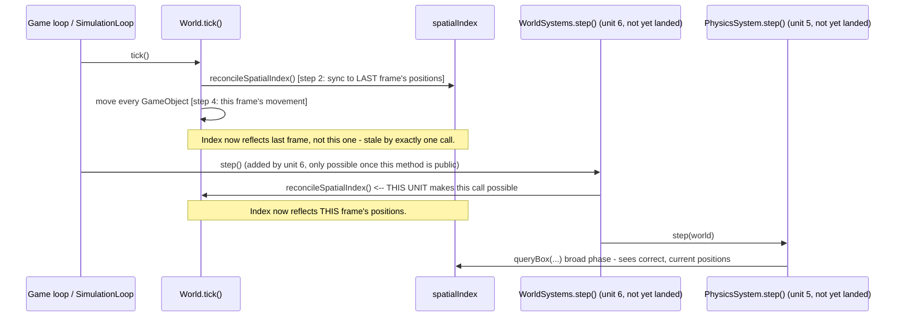

# Plan: `physics-core-seams` — the `gametools-core` seams Phase 1 physics builds on

> **Partly superseded — 2026-09-22, World Systems Implementation (issues #76–#80).** This unit had
> two halves.
>
> - **The `@SupportedExtension` half is superseded.** #76 (`docs/world-system-core-plan.md`) now
>   creates `com.spartanlabs.gaming.annotation.SupportedExtension` in exactly the parameterless
>   shape §2.2/§3.1 below settled, beside an Experimental opt-in marker, `@ExperimentalGameToolsApi`,
>   in the same package. Its first user is `WorldSystem`, at #79. Do not re-create it: §3.1, its
>   component test, and its CHANGELOG/README/CONTRIBUTING items are #76's.
> - **The `World.reconcileSpatialIndex()` widening half stands** and stays #49's to re-plan, but its
>   named caller changes. It is no longer the retired `WorldSystems.step()` (§1.2 point 2, §2.3,
>   §2.4's diagram, §3.2's KDoc draft, §9 "Provides to unit 6"). It is now `PhysicsWorldSystem.step()`
>   (#80, `docs/physics-world-system-plan.md`), which calls it immediately before
>   `physicsSystem.step(world)` from inside `World.stepSystems()`.
>
> Architecture: `docs/world-systems-implementation-architecture.md`.

## Header / Association

- **Covers:** [SpartanLabsGaming/MyGameTools#49](https://github.com/SpartanLabsGaming/MyGameTools/issues/49)
  — *"Phase 1: physics — motion integration + collision resolution (push-out / slide)"* (item 4
  of 5 in `docs/framework-vision-and-roadmap.md` §3 Phase 1). This plan covers **unit 1 of 6**
  only.
- **Architecture:** `docs/issue-49-physics-architecture.md`, unit slug `physics-core-seams`
  (§10 decomposition table, row 1; scope defined in §4.2 and §4.7 hazard 1).
- **Branch:** `feature/49-physics-core-seams`, off current `master`.
- **Commit:** TBD
- **PR:** TBD — this plan document is committed together with the first commit of its
  implementation (the `SupportedExtension` addition, §8 below) so `git log --follow` binds the
  two.
- **What this plans:** the *only* two `gametools-core` changes in all of issue #49 — a new
  `@SupportedExtension` annotation in a new `com.spartanlabs.gaming.annotation` package, and
  widening `World.reconcileSpatialIndex()` (`World.kt:258`) from `internal` to `public`, with
  its KDoc corrected. No physics type of any kind is added to `gametools-core`.
- **Status:** planning only. No source, test, or build file has been modified by this document.
- **Target release:** `5.3.0`. **`5.2.0` has not been cut yet** — all four published
  coordinates (`gametools`, `gametools-core`, `gametools-net`, `gametools-world`) still read
  `5.1.0` (`gametools-core/build.gradle.kts:6`, verified against `master`), and #42/#46/#47/#48
  all sit under `CHANGELOG.md`'s `[Unreleased]` heading. This unit's commits land on `master`
  under `[Unreleased]` like everything ahead of it; **this plan does not bump any version
  number or cut a release** — that is `5.2.0`'s and then `5.3.0`'s own release-branch step
  (`CONTRIBUTING.md` §Releasing), out of scope here.
- **Dependencies:** none. This unit depends on nothing else in the decomposition and lands
  first; units 4 (`physics-resolution`) and 6 (`world-systems`) depend on it.
- **Related docs:** `docs/issue-49-physics-architecture.md` (§4.1 system inventory, §4.2
  package placement, §4.7 hazard 1, §8 stability tiers, §10 decomposition, §12 open decisions);
  `docs/api-openness-decisions-6.0.0.md` D1 (assumes `@SupportedExtension` exists for
  `Movement`'s `6.0.0` opening); `docs/issue-48-spatial-index-rework-plan.md` (the incremental
  reconcile this method implements).

---

## 1. Context

### 1.1 What exists today (verified against `master`)

- `World.reconcileSpatialIndex()` is `internal fun`, `World.kt:258-270`. Its KDoc
  (`World.kt:252-256`) gives its *only* stated reason for being `internal` rather than
  `private`: "solely so a same-module nonfunctional benchmark (`SpatialIndexScalabilityTest`)
  can call it directly... Not part of the public API." That justification is now stale — see
  §1.2.
- `World.tick()` (`World.kt:218-245`) runs, in order: `tickCount++` → `reconcileSpatialIndex()`
  (step 2) → `reindexEntities()` → every `GameObject.tick()` in insertion order, which is where
  `Movement` mutates `location` (step 4) → drains `removeList`. The index is therefore
  reconciled *before* anything moves this frame; on return from `tick()`, `spatialIndex` reflects
  **last** frame's positions, not this frame's.
- `gametools-core/build.gradle.kts` (verified, `git show master:gametools-core/build.gradle.kts`)
  has no dependency on `gametools-world` in either direction; `gametools-world/build.gradle.kts`
  depends on `gametools-core` via `api(project(":gametools-core"))`. `core`'s existing top-level
  packages are `event`, `gameobjects`, `simulation`, `spatial` (verified,
  `gametools-core/src/main/kotlin/com/spartanlabs/gaming/*`); no `annotation` package exists.
- No `@SupportedExtension`/`@RequiresOptIn`-style annotation exists anywhere in the codebase
  today (verified by search) — this issue creates the first one.

### 1.2 Why these two changes, and why they plug in exactly here

1. **`@SupportedExtension` must live in `gametools-core`.** `core` cannot see `world` (no
   dependency edge either way), and `docs/api-openness-decisions-6.0.0.md` D1 already commits
   `Movement` — a `core` type — to carrying this same annotation when it opens in `6.0.0`. If the
   annotation lived in `world`, D1 could not use it without inverting the module graph
   (architecture §4.2, Research finding 4). It is not a physics type: it is generic
   stability-tier infrastructure, so it adds no physics surface to `core` and stays inside the
   binding constraint that `core` gains no physics types.
2. **`World.reconcileSpatialIndex()` must become public** because `gametools-world`'s
   `WorldSystems` (unit 6) needs to call it once per frame, immediately before
   `physicsSystem.step(world)`, so physics' broad phase sees this tick's actual post-movement
   positions rather than the previous frame's (architecture §4.7 hazard 1, §4.9). The KDoc's
   current "internal for one benchmark" framing is superseded the moment a second, cross-module
   caller exists; leaving it unwidened would force unit 6 to either duplicate #48's
   index-maintenance work in `world` or reach for a full `reindexSpatial()` rebuild every frame,
   both rejected in architecture §9.
3. **Both are additive.** Kotlin visibility widening (`internal` → public, the implicit default)
   cannot break an existing caller — `tick()`'s own call site and `SpatialIndexScalabilityTest`'s
   direct call both keep compiling unchanged. Adding a new annotation type is new surface with no
   existing caller to break.

### 1.3 Acceptance criteria for this unit

- `gametools-core` compiles a new public annotation class `SupportedExtension` in
  `com.spartanlabs.gaming.annotation`, exactly matching the declaration in §3.1.
- `World.reconcileSpatialIndex()` is callable from outside `gametools-core` (proved for real
  only once unit 6 lands and calls it — see §9).
- `gametools-core` gains **no** physics type — confirmed by this plan touching only the
  `annotation` package (new) and `World.kt` (visibility + KDoc only).
- CHANGELOG, README, and CONTRIBUTING document both changes in this unit's own commits, not
  deferred to a later unit (architecture §10, last paragraph, names this unit specifically).

---

## 2. Design

### 2.1 Package placement — confirmed, not changed

Architecture §4.1/§4.2 proposes `com.spartanlabs.gaming.annotation`. **Confirmed as the right
name, unchanged.** Reasoning:

- It matches `core`'s existing convention of one flat, singular-noun top-level package per
  concern (`event`, `gameobjects`, `simulation`, `spatial`) rather than nesting under an existing
  one.
- It is not domain-specific to `gameobjects` (the annotation says nothing about game objects) and
  is not physics-specific — it is meta-infrastructure any current or future module's public
  surface can reference (already earmarked for `Movement` in `6.0.0`, and for `CollisionResolver`
  in `gametools-world` unit 4). A dedicated top-level package is the honest reflection of that;
  burying it inside `gameobjects` would misdescribe its scope the moment a non-`gameobjects` type
  wants to use it.
- It mirrors the two real-world precedents this design is modelled on: JetBrains'
  `org.jetbrains.annotations` (flat, dedicated package for cross-cutting annotations) and
  Kotlin's own `kotlin.annotation` package for its meta-annotations. No naming collision results
  (fully qualified names differ), and Kotlin/IDE tooling resolves `com.spartanlabs.gaming.annotation.SupportedExtension`
  unambiguously.

### 2.2 The annotation itself — exact declaration, no parameters

```kotlin
// gametools-core/src/main/kotlin/com/spartanlabs/gaming/annotation/SupportedExtension.kt
package com.spartanlabs.gaming.annotation

@MustBeDocumented
@Retention(AnnotationRetention.BINARY)
@Target(
    AnnotationTarget.CLASS, AnnotationTarget.FUNCTION, AnnotationTarget.PROPERTY,
    AnnotationTarget.CONSTRUCTOR, AnnotationTarget.TYPEALIAS,
)
annotation class SupportedExtension
```

**Discrepancy flagged, not silently resolved:** architecture §4.2's own reproduced code block
shows `annotation class SupportedExtension(val note: String = "")` — a free-text `note`
parameter — while the task instruction that scoped this unit states the declaration
**exactly**, with **no parameters**, and explicitly "no parameters" as a stated design
constraint. This plan follows the **no-parameter** form, since it was given as the binding,
exact declaration for this unit, but the mismatch between the two sources is real and is called
out to the caller in this plan's handback (see also the report accompanying this document) —
it is not this plan's call to make silently. Practical consequence either way is small: without
a `note` parameter, any extra context for *why* a particular declaration carries the tag belongs
in that declaration's own KDoc (e.g., `CollisionResolver`'s KDoc, §4.5 of the architecture doc,
already does this at length) rather than inline in the annotation usage — which is arguably the
better home for prose anyway, since KDoc renders in Dokka and an annotation parameter does not.

No `@RequiresOptIn`: this tier is a documentary promise, not a compiler gate — modelled on
JetBrains' `ApiStatus.NonExtendable`. Not `@Repeatable` (no need — a declaration either carries
the tier or it does not). `AnnotationRetention.BINARY` because the tag is for humans and tools
(Dokka, IDE navigation, code review) reading the *declaration*, never for a runtime decision —
matching the "no enforcement, ever" line in architecture §4.1's system inventory.

### 2.3 `World.reconcileSpatialIndex()` — widen and re-document, no behavioural change

The method body is untouched except for adding one debug-level log line (§3.2); the only
semantic change is the visibility modifier. The KDoc's justification for its access level is
rewritten to state the real, current reason: a second, cross-module, per-frame caller
(`gametools-world`'s `WorldSystems`, landing in unit 6) needs it, and the existing benchmark
caller keeps working unchanged.

### 2.4 Flow this unit exists to unblock

Not a protocol or thread interaction — `World` remains single-threaded, unchanged — but the
sequencing hazard this widening fixes is easiest to see as a sequence diagram of one frame,
comparing today's `World.tick()`-only flow with the flow unit 6 will add on top of it once this
method is public:



---

## 3. File-by-file changes

### 3.1 New: `gametools-core/src/main/kotlin/com/spartanlabs/gaming/annotation/SupportedExtension.kt`

New file, new package. No imports needed — `MustBeDocumented`, `Retention`, `AnnotationRetention`,
`Target`, `AnnotationTarget` are all `kotlin.annotation.*`/`kotlin.*` and resolve without an
explicit import; no import-region comments are required per the repo's import-grouping rule
("if a group/subgroup is not present a comment line is not required").

```kotlin
package com.spartanlabs.gaming.annotation

/**
 * Marks a public declaration as **Supported Extension**: a seam for a likely-but-non-core need
 * — something a fair number of consumers will plausibly want, that is not what the surrounding
 * library exists fundamentally to provide.
 *
 * This tier carries **the same semver guarantee as Stable Core** — the tag marks *purpose*, not
 * a weaker stability promise. A breaking change to a `@SupportedExtension` declaration is a
 * breaking change to the library, governed by the same versioning rules
 * (`CONTRIBUTING.md` §Versioning) as anything else public. Contrast with an
 * `@RequiresOptIn`-gated *Experimental* seam, whose shape may still change in a minor release
 * because no real consumer has built against it yet — nothing tagged `@SupportedExtension` is
 * unproven in that sense.
 *
 * Where this tag lands on an `interface`, its shipped default implementation(s) double as the
 * seam's **worked example** of how to extend it: written to be read, not merely to work.
 *
 * Purely documentary — `BINARY` retention, no `@RequiresOptIn` gate, no parameters. It changes
 * nothing about how the annotated declaration compiles or runs; it exists for Dokka, IDE
 * navigation, and a human deciding whether to extend something, not for the compiler to enforce.
 * Modelled on JetBrains' `org.jetbrains.annotations.ApiStatus.NonExtendable` precedent for a
 * documentary stability marker.
 */
@MustBeDocumented
@Retention(AnnotationRetention.BINARY)
@Target(
    AnnotationTarget.CLASS, AnnotationTarget.FUNCTION, AnnotationTarget.PROPERTY,
    AnnotationTarget.CONSTRUCTOR, AnnotationTarget.TYPEALIAS,
)
annotation class SupportedExtension
```

**Error handling:** none applicable — an annotation class has no execution path, so there is no
failure to encapsulate in a `Result` and nothing to throw. Stated explicitly rather than left
implicit, per the standard that every new signature's failure path is planned, not skipped: this
one has none by construction.

**Mutability:** none applicable — no properties, no state.

**Logging:** none applicable — no runtime code path exists to log from.

**Stability tier:** **Stable Core.** Per architecture §8: "infrastructure for stability itself
must be stable." `SupportedExtension` is not itself tagged `@SupportedExtension` — it is the
mechanism, not an extension seam.

### 3.2 Changed: `gametools-core/src/main/kotlin/com/spartanlabs/gaming/gameobjects/World.kt`

Widen `internal fun reconcileSpatialIndex()` (currently `World.kt:258-270`) to public, and
replace its KDoc's stale justification. No change to `tick()`, `add()`, `reindexSpatial()`, or
any other member. Before:

```kotlin
    /**
     * ...
     * `internal` rather than `private` solely so a same-module nonfunctional benchmark
     * (`SpatialIndexScalabilityTest`) can call it directly, isolated from the rest of [tick]'s
     * work, for a true reconcile-vs-rebuild comparison against [reindexSpatial]. Not part of the
     * public API.
     */
    internal fun reconcileSpatialIndex() {
        gameObjects.forEach { obj -> ... }
    }
```

After:

```kotlin
    /**
     * Reconciles [spatialIndex] against the positions the owned [VisibleObject]s hold right now
     * - a first-seen object is [SpatialIndex.insert]ed, a moved one is [SpatialIndex.move]d, and
     * an unchanged one costs nothing. Replaces the pre-`5.2.0` clear-and-reinsert-everything
     * `rebuildQuadtree` this method used to be.
     *
     * Public since `5.3.0` so a driver that moves objects *after* [tick] returns can resync
     * [spatialIndex] to that movement before querying it - the intended caller is
     * `gametools-world`'s `WorldSystems.step()`, which runs a `PhysicsSystem`'s broad phase
     * immediately after [tick]. [tick] itself still calls this at its own step 2, *before* step
     * 4 moves anything (see the class doc), so on return from [tick] the index reflects the
     * *previous* frame's positions, not this one's; calling this again catches it up. Cheap
     * relative to [reindexSpatial]'s full rebuild - an `O(n)` scan that only touches an object
     * whose position actually changed - but real at scale, so call it only when something
     * besides [tick] is about to query [spatialIndex] against fresh positions.
     *
     * Still not something most callers need directly: `tick()`'s own use above is the common
     * case, and this is also exercised directly by a same-module nonfunctional benchmark
     * (`SpatialIndexScalabilityTest`) for a reconcile-vs-rebuild comparison against
     * [reindexSpatial].
     */
    fun reconcileSpatialIndex() {
        var reconciled = 0
        gameObjects.forEach { obj ->
            if (obj !is VisibleObject) return@forEach
            val last = obj.lastIndexedLocation
            val x = obj.location.x
            val y = obj.location.y
            when {
                last == null -> { spatialIndex.insert(x, y, obj); reconciled++ }
                last.x != x || last.y != y -> { spatialIndex.move(last.x, last.y, x, y, obj); reconciled++ }
            }
            obj.lastIndexedLocation = IndexedPosition(x, y)
        }
        log.debug("World.reconcileSpatialIndex: inserted/moved {} of {} visible object(s)", reconciled, gameObjects.size)
    }
```

**Error handling:** unchanged — returns `Unit`, no `Result`. This is a total function over
in-memory state with no expected failure mode; nothing a caller can pass makes it fail (it takes
no arguments), so neither `Result` nor a thrown exception applies. If `gameObjects` were ever
mutated concurrently from another thread during this scan, that is a violation of `World`'s
already-documented single-threaded-driver assumption (`SimulationLoop.kt`), i.e. a programmer
error, not an operational failure this method should catch or wrap.

**Mutability:** unchanged — mutates `spatialIndex` (already a `var`-free mutable structure) and
each reconciled `VisibleObject.lastIndexedLocation` in place, exactly as today.

**Concurrency:** unchanged. Widening visibility adds no thread-safety guarantee. `World` remains
documented as single-threaded; a caller invoking this from a different thread than its own
`tick()` driver already violates that contract today and continues to after this change. Worth
restating in the KDoc's audience is now wider (§4).

**Logging:** new — one `DEBUG`-level line per call, `World.reconcileSpatialIndex: inserted/moved
{} of {} visible object(s)`, mirroring `tick()`'s own `log.debug("World tick: advancing {} game
object(s)", ...)` pattern (`World.kt:224`) and using slf4j's lazy `{}` placeholders so the cost
is a no-op with debug logging disabled. This is the one genuinely new lifecycle-observability
surface this unit adds: once a second, cross-module caller exists, being able to see how much
work each call actually did (versus a caller that queries `spatialIndex` expecting it to already
be current) is exactly the kind of data-flow signal the global logging standard asks for.

### 3.3 Changed (KDoc only): `gametools-core/src/test/kotlin/com/spartanlabs/gaming/testing/nonfunctional/spatial/SpatialIndexScalabilityTest.kt`

No test logic changes — the assertions, fixtures, and method calls are all unaffected by a pure
visibility widening. The class KDoc (currently lines 24-37) states: *"repeated calls to
[World.reconcileSpatialIndex] (the incremental reconcile [World.tick] uses,
`internal`-exposed for this benchmark only)"* — that parenthetical is now false and must be
corrected in the same commit that makes the method public, so the doc never describes a
visibility that no longer exists. Replace with wording along the lines of: *"repeated calls to
[World.reconcileSpatialIndex] (the incremental reconcile [World.tick] uses, public as of `5.3.0`
so `gametools-world` can call it directly - exercised here as a same-module micro-benchmark, not
because it needs special access any more)"*. This is a Component-ring (KDoc) documentation fix,
not a new test — it belongs in the same commit as §3.2's KDoc rewrite, since both describe the
same fact.

### 3.4 Changed: `README.md`

Only the **core** row of the Modules table (line 147) — the surface this unit adds, per the
architecture's own "each unit documents its own surface" rule (§10). The physics-as-a-whole
Architecture/Features prose is explicitly unit 6's job (§10: "Unit 6 owns... the README.md
Architecture/Features prose describing physics as a whole") and is **not** touched here.

Before: `` `com.spartanlabs.gaming.{gameobjects,spatial,event,simulation}.*` `` (package list),
ending "... plus `com.spartanlabs.geometry.serializations.*` (the `@Serializable` geometry
DTOs)".

After: add `annotation` to the package list and name the new type: `` `com.spartanlabs.gaming.{gameobjects,spatial,event,simulation,annotation}.*` `` ... `` `com.spartanlabs.gaming.annotation.SupportedExtension` (a documentary stability-tier marker for a likely-but-non-core extension seam - same semver guarantee as the rest of Stable Core; first applied by `gametools-world`'s `CollisionResolver` in a later `5.3.0` unit) `` — inserted before the existing "plus `com.spartanlabs.geometry.serializations.*`" clause.

### 3.5 Changed: `CONTRIBUTING.md`

Same fact, second location — the Module layout table (line 33) lists `core`'s contents with the
same package list as README's Modules table and must not drift from it. Add `annotation` to the
`gametools-core` row's package list, mirroring §3.4's README edit exactly (no need to duplicate
the `SupportedExtension` prose here — `CONTRIBUTING.md`'s table is intentionally terser than
README's).

### 3.6 Changed: `CHANGELOG.md`

One `[Unreleased]` entry in **`### Added`** (the new annotation) and one in **`### Changed`**
(the widened method), per this unit's own responsibility (architecture §10: *"This matters most
for unit 1, which adds genuinely public `gametools-core` API... that must be in the CHANGELOG in
the PR that lands it, not five PRs later"*). Appended after the existing #47 entry
(`CHANGELOG.md:62-69`) and after the existing `Quadtree` KDoc entry (`CHANGELOG.md:94-96`)
respectively, matching the file's existing per-bullet `(#issue)` citation convention:

```markdown
### Added
- `com.spartanlabs.gaming.annotation.SupportedExtension` - a documentary marker for a
  "Supported Extension" API-stability tier: a seam for a likely-but-non-core need, carrying the
  same semver guarantee as Stable Core. No `@RequiresOptIn` gate, no runtime effect - `BINARY`
  retention, applicable to a class, function, property, constructor, or type alias. Created for
  `gametools-world`'s `CollisionResolver` and for `Movement`'s planned `6.0.0` opening
  (`docs/api-openness-decisions-6.0.0.md` D1); lives in `gametools-core` because `core` cannot
  depend on `world` and `Movement` is a `core` type. (#49)

### Changed
- `World.reconcileSpatialIndex()` is now public (was `internal`). Additive - every existing
  caller keeps compiling unchanged. Lets a driver that moves objects after `World.tick()`
  returns (a physics system, starting with `gametools-world`'s `WorldSystems` in a later `5.3.0`
  unit) resync the spatial index to that movement before querying it, rather than paying for a
  full `reindexSpatial()` rebuild every frame. (#49)
```

---

## 4. Documentation impact (Audience-Reach rings)

- **Inner Core (in-editor):** no `//region`/`TODO` changes needed beyond the standard
  import-grouping convention, which does not apply to `SupportedExtension.kt` (no imports).
- **Component Ring (KDoc/API contracts):** the primary ring this unit touches. Full KDoc on the
  new `SupportedExtension` (§3.1) explaining the tier's meaning, and a corrected KDoc on
  `World.reconcileSpatialIndex()` (§3.2) describing its real caller and the ordering hazard it
  resolves. Both are genuinely public API from this commit onward and must render correctly
  under `./gradlew dokkaGeneratePublicationHtml` (a broken KDoc link would fail that task per
  `CONTRIBUTING.md`'s own note).
- **Boundary Ring (protocol/integration):** not touched. No wire format, no `ClientCommand`, no
  cross-service concern in this unit.
- **Architectural Outer Layer:** `docs/issue-49-physics-architecture.md` already documents this
  unit's design; no update owed to it. `docs/api-openness-decisions-6.0.0.md`'s D1 footnote
  (confirming `@SupportedExtension` now exists, with its real package) is explicitly assigned to
  **unit 6** by architecture §10 ("Unit 6 owns... the §7 roadmap corrections") and is
  **deliberately not touched by this plan** — see §9.
- **README / CONTRIBUTING currency:** both updated in this unit's own commits (§3.4, §3.5), per
  the global README-currency rule and the architecture's explicit per-unit-documents-its-own-surface
  instruction.

---

## 5. Test plan (5-level hierarchy)

### Level 1 — gating

No `com.spartanlabs.gaming.testing.gating` package exists anywhere in this repo today (verified:
only `component`, `integration`, `deterministic`, `e2e`, `nonfunctional` directories exist under
`gametools-core/src/test/kotlin/.../testing/`). This unit does not invent one. Per the repo's
established convention, level 1 in practice means "compiles and passes `componentTest` +
`deterministicTest` before pushing" (`CONTRIBUTING.md` §Running the build), not a checked-in
suite — so level 1 for this unit is `./gradlew componentTest deterministicTest`, using the level
2/4a tests below; there is no separate artifact to add.

### Level 2 — component

**New:** `gametools-core/src/test/kotlin/com/spartanlabs/gaming/testing/component/annotation/SupportedExtensionTest.kt`
(new package `com.spartanlabs.gaming.testing.component.annotation`, mirroring the new production
package). One test class, `kotlin.test` + JUnit 5 platform (matching this repo's existing
convention — see §6 note on MockK).

- **The authoritative check is a compile-time fixture, not reflection.** The file declares one
  small, test-local example annotated with `@SupportedExtension` for each of the five declared
  targets — a class, a top-level function, a property, a secondary constructor, and a type
  alias. If `@Target` in the production annotation ever drops one of these five, this file stops
  compiling, which is a stronger and less ambiguous guarantee than any runtime introspection:
  Kotlin's `AnnotationTarget.PROPERTY`/`TYPEALIAS` do not reliably round-trip through plain JVM
  reflection (`java.lang.annotation.ElementType` has no `TYPEALIAS`, and Kotlin properties are
  not a single JVM element), so a reflection-based assertion of the full target set would be
  fragile in a way a compile fixture is not.
  - `it fails to compile if a documented annotation target is removed` — expressed as the fixture
    itself; the test method's body only needs to reference each fixture once to force compilation
    (e.g., call the annotated function, read the annotated property) so an unused-fixture warning
    does not hide a future accidental deletion of one of the five usages.
- **Runtime-observable facts, checked by reflection where it is unambiguous:**
  - `carries @MustBeDocumented` — `SupportedExtension::class.java.isAnnotationPresent(MustBeDocumented::class.java)`.
  - `retention is BINARY (not visible on a usage at runtime)` — apply `@SupportedExtension` to a
    test-local class and assert
    `annotatedClass.java.isAnnotationPresent(SupportedExtension::class.java) == false`. This is
    the one negative test that actually matters: it locks in that the tag is deliberately
    invisible at runtime (matching "purely documentary, never a runtime decision," §2.2), so an
    accidental future change to `RUNTIME` retention — which would silently turn this into
    something a consumer could branch on at runtime, defeating the "documentary, not opt-in-gated"
    design intent — fails this test immediately.
  - **Flagged, not asserted as fact:** the exact JVM-reflection surface for a Kotlin annotation's
    own compiled `@Retention`/`@Target` meta-annotations (i.e., asserting the *retention policy
    value itself* via `java.lang.annotation.Retention`, versus just observing usage-visibility as
    above) depends on how the Kotlin compiler lowers `AnnotationRetention`/`AnnotationTarget` to
    JVM `RetentionPolicy`/`ElementType` for a given Kotlin/JVM toolchain version, which this plan
    has not independently verified against this repo's exact compiler version. The implementer
    should treat the compile-fixture and the usage-invisibility check above as the load-bearing
    assertions, and only add a direct `java.lang.annotation.Retention` value check as a bonus if
    it turns out to work cleanly — not as a blocking requirement.

**Level 2 — `World.reconcileSpatialIndex()`:** no new component test is required. Its behaviour
is unchanged and already covered indirectly via `World.tick()` in the existing
`gametools-core/src/test/kotlin/com/spartanlabs/gaming/testing/component/gameobjects/WorldSpatialIndexTest.kt`
(confirmed present; `SpatialIndexScalabilityTest`'s own KDoc names it as the place reconcile
correctness is covered). A visibility widening that changes no logic has nothing new to assert
at this level — see §6 for what is honestly untestable here.

### Level 3 — integration

Not applicable. No external interface, database, or third-party service is touched by either
change. No test added.

### Level 4a — deterministic

Not applicable as a *new* test: `reconcileSpatialIndex()`'s input→output behaviour is unchanged
and any existing determinism coverage of `World.tick()` (seeded-run reproducibility) already
exercises it exactly as before. The annotation has no input/output mapping to speak of — its
level-2 compile-fixture and reflection checks are the right home for it, not 4a.

### Level 4b — e2e

Not applicable. No full client↔server flow is implicated.

### Level 4c — non-functional

No new test. The existing `SpatialIndexScalabilityTest.kt` continues to run unchanged (§3.3 is a
KDoc-only edit); a visibility widening has no measurable performance effect (JVM invocation cost
is identical for `internal` and public members within the same module, and the new caller this
unit *enables* does not exist until unit 6 lands — there is nothing new to benchmark yet).

### Level 5 — UAT

No `com.spartanlabs.gaming.testing.uat` package exists anywhere in this repo. Not invented here.
A documentary annotation and a visibility widening produce no observable behaviour for a human
or AI evaluator to assess in isolation — there is no UI, no gameplay effect, nothing to "feel."
Any UAT signal for issue #49 belongs to whichever unit first produces observable physics
(`physics-resolution` / `physics-system` / `world-systems`), not this one.

---

## 6. What genuinely cannot be tested automatically, here and now

- **That `World.reconcileSpatialIndex()` is actually callable from `gametools-world`.** This
  unit's own test suite runs inside `gametools-core`, which has no dependency on
  `gametools-world` and never will (§1.1) — so nothing in *this* unit's test tree can prove the
  cross-module call compiles. The only real proof is unit 6's own test suite, once `WorldSystems`
  calls it. Flagged here explicitly rather than papered over with an in-module test that would
  not actually exercise the cross-module boundary; see §9.
- **The exact JVM-level reflection surface of the annotation's own meta-annotations** — noted
  as a flagged uncertainty in §5's level-2 section rather than asserted.

**Note on MockK:** the global testing standard calls for JUnit 5 + MockK with external calls
mocked at level 2. This repo's actual convention (`build-logic/src/main/kotlin/gametools.kotlin-library.gradle.kts:29`)
is `kotlin.test` on the JUnit 5 platform, and no module in this repo currently depends on MockK
(verified by search). Neither of this unit's two changes makes any external call to mock, so the
question does not arise in practice; the new component test follows the existing repo convention
(`kotlin.test`) rather than introducing MockK for a file with nothing to mock.

---

## 7. Risks & edge cases

- **Breaking changes:** none. `internal` → public is additive by Kotlin's own visibility rules;
  every existing caller (`tick()`, `SpatialIndexScalabilityTest`) keeps compiling unchanged. A
  new annotation type has no existing caller to break.
- **API surface commitment:** from this commit, `SupportedExtension` and the now-public
  `reconcileSpatialIndex()` are both Stable Core (architecture §8) — any future change to either
  is a breaking change requiring a major version bump per `CONTRIBUTING.md` §Versioning. This is
  a real, if small, commitment: worth the caller's awareness that "just widen a visibility
  modifier" now carries the same semver weight as any other public API addition.
- **Cross-repo impact:** none. No wire/protocol change, no `gametools-net` dependency. Per
  standing "no downstream consumer issues" guidance, `MyGameServer`/`GameGraphics` are not
  filed against; they are unaffected unless they opt in.
- **Concurrency:** none changed — `World` remains single-threaded by convention; widening
  visibility does not add any new thread-safety guarantee, and the KDoc says so (§3.2).
- **The discrepancy in §2.2** (parameterless vs. `note`-carrying annotation) is the one open
  point genuinely worth a second look before this lands — see the report accompanying this plan.
- **Documentation drift risk:** README's Modules table and CONTRIBUTING's module-layout table
  list the same package set in two places (§3.4/§3.5); a future package addition to `core` that
  updates one and not the other silently reintroduces this exact drift. Not a new risk this unit
  creates, but this unit's edit is a chance to note it — no action taken beyond keeping both in
  sync here.

---

## 8. Version control

- **Branch:** `feature/49-physics-core-seams` (per `CONTRIBUTING.md`'s `feature/<issue#>-<slug>`
  convention, using the architecture's own unit slug).
- **This unit's commits carry no unrelated changes.** The working tree currently holds an
  uncommitted, in-flight refactor moving `Alive`/`Buff`/`Capability`/`Intent`/`ModularStat`/
  `StatMod`/`CombinedStat`/`ExperienceReceiver` into a new `gameobjects.combat` subpackage
  (visible in `git status`: renames plus a new `BuffPlacer.kt`, touching `Actor.kt`,
  `GameObject.kt`, `VisibleObject.kt`, `World.kt`, `DirectionalProjectile.kt`,
  `HomingProjectile.kt`, `Player.kt`, `Moddable.kt`, `gametools-core/build.gradle.kts`). **None
  of it rides in this plan's commits.** Branch off `master` fresh (not off the dirty working
  tree) so this branch's diff to `master` contains exactly the changes in §3 above, and nothing
  from that refactor. If that refactor is meant to land, it does so as its own, separately
  planned commit(s) on its own branch.
- **Commit sequence** (each a coherent, independently-reviewable unit):
  1. `feat(annotation): add SupportedExtension stability-tier marker` — adds
     `docs/physics-core-seams-plan.md` (this document) and
     `gametools-core/src/main/kotlin/com/spartanlabs/gaming/annotation/SupportedExtension.kt`
     (§3.1) plus its component test (§5). Body: why the tier and the package placement (§2.1),
     referencing #49 and D1 in `docs/api-openness-decisions-6.0.0.md`.
  2. `feat(gameobjects): open World.reconcileSpatialIndex for gametools-world physics` — `World.kt`
     visibility + KDoc + logging (§3.2), and the KDoc-only fix to
     `SpatialIndexScalabilityTest.kt` (§3.3). Body: cites the hazard-1 ordering problem
     (`World.kt:218-226`) and names `WorldSystems` as the intended caller, referencing #49.
  3. `docs: document SupportedExtension and the public reconcileSpatialIndex` — `CHANGELOG.md`
     (§3.6), `README.md` (§3.4), `CONTRIBUTING.md` (§3.5). Body: notes these are this unit's own
     documentation obligations per the architecture's per-unit-documents-its-own-surface rule.
- **PR title** (becomes the merge-commit subject, must be a valid Conventional Commit):
  `feat(core): add SupportedExtension stability tier and open World.reconcileSpatialIndex for gametools-world`.
  Body references `Refs #49`; the PR does not close #49 (five more units remain).
- Trailer reminder: attribute per the repo's existing commit convention; no `BREAKING CHANGE:`
  footer — nothing here breaks an existing caller.

---

## 9. Interfaces with sibling units

- **Provides to unit 4 (`physics-resolution`):** `com.spartanlabs.gaming.annotation.SupportedExtension`,
  ready to apply to `CollisionResolver` (the interface) exactly as shown in architecture §4.5.
  Unit 4 must import from `com.spartanlabs.gaming.annotation`, not redeclare or relocate it.
- **Provides to unit 6 (`world-systems`):** `World.reconcileSpatialIndex(): Unit`, now public,
  ready for `WorldSystems.step()` to call immediately before `physicsSystem.step(world)`
  (architecture §4.9). Unit 6's own test suite is where this widening is actually proven to work
  across the module boundary — this unit cannot prove that itself (§6).
- **Depends on:** nothing. This is the only unit with no dependency on any other in the
  decomposition (architecture §10).
- **Does not provide:** any physics type — `Shape`, `PhysicsBody`, `Contact`, `PhysicsSystem`,
  `CollisionResolver`'s own shape, and `WorldSystems`'s own shape are entirely units 2-6's
  concern, all living in `gametools-world`. This unit's `gametools-core` diff is exactly the two
  changes in §3 and nothing else.
- **Explicitly not this unit's job:** the `docs/api-openness-decisions-6.0.0.md` D1 footnote
  confirming `@SupportedExtension`'s real package (architecture §7 item 4) is bundled by
  architecture §10 into "the §7 roadmap corrections," which that same section assigns to unit 6
  as a cross-cutting item. This plan deliberately does not touch that file, to avoid
  double-claiming a correction unit 6's plan should own. Flagged here so unit 6's plan does not
  drop it.

---

## 10. Open decisions

1. **`SupportedExtension`'s parameter list — `note: String = ""` (architecture §4.2's shown
   code) vs. no parameters (this unit's binding "exact declaration").** This plan implements the
   **no-parameter** form because it was given as the exact, binding declaration for this unit.
   **Recommendation:** keep it parameterless. A free-text `note` on every usage site is
   redundant with (and less discoverable than) putting the same prose in the annotated
   declaration's own KDoc, which is where architecture §4.5 already puts `CollisionResolver`'s
   own tier rationale at length. If a `note` is wanted later, adding an optional parameter with a
   default is itself additive and can be done without a major bump. **This is flagged to the
   caller as a real discrepancy between two source documents, not a decision this plan is
   making unilaterally** — worth a one-line confirmation before the branch is opened.
2. **Whether to add the `log.debug` line to `reconcileSpatialIndex()` at all (§3.2).** Not
   requested by the architecture doc, which describes no logging change for this method.
   **Recommendation:** add it — cheap (lazy slf4j placeholders), consistent with `tick()`'s own
   debug logging one line above the call site, and directly useful for diagnosing hazard-1-style
   staleness bugs once a second caller exists. Low-risk enough that this plan treats it as
   decided rather than blocking on confirmation, but it is called out here since it is the one
   place this plan goes slightly beyond the architecture document's letter.

---

## 11. Sequencing & follow-ups

- Lands first, as architecture §10 requires; units 2 and 3 (`physics-body-model`,
  `physics-narrow-phase`) do not depend on this unit and may be planned/implemented in parallel.
  Units 4, 5, and 6 must land after this one.
- **Follow-up owed elsewhere, not here:** the `docs/api-openness-decisions-6.0.0.md` D1 footnote
  (§9) is unit 6's to write once all six units have landed and the full picture is real.
- No release is cut by this plan. `5.2.0` must be released before `5.3.0` per
  `docs/phase-1-map-and-space-plan.md`'s own sequencing note (restated in architecture header);
  this unit's commits simply add to `[Unreleased]` like every other in-flight unit today.
