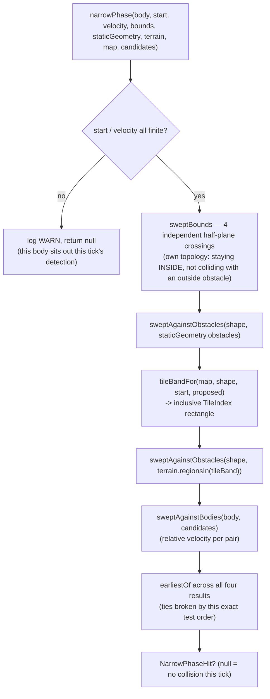

# Plan: `physics-narrow-phase` — swept collision detection against terrain, static geometry, bounds, and other bodies

## Header / Association

- **Covers:** [SpartanLabsGaming/MyGameTools#49](https://github.com/SpartanLabsGaming/MyGameTools/issues/49)
  — *"Phase 1: physics — motion integration + collision resolution (push-out / slide)"* (item 4
  of 5 in `docs/framework-vision-and-roadmap.md` §3 Phase 1). This plan covers **unit 3 of 6**
  only.
- **Architecture:** `docs/issue-49-physics-architecture.md`, unit slug `physics-narrow-phase`
  (§10 decomposition table, row 3; scope defined by §4.6, with supporting context from §4.3,
  §4.4 step 3, and §4.7 hazard 7).
- **Branch:** `feature/49-physics-narrow-phase`, off `master` — but see §8: this branch cannot be
  *implemented* until units 1 and 2 have actually landed real code, not just plan documents (see
  Sequencing, §11).
- **Commit:** TBD
- **PR:** TBD — this plan document is committed together with the first commit of its
  implementation (§8) so `git log --follow` binds the two.
- **What this plans:** the internal-only detection math for `gametools-world`'s physics: swept
  AABB-vs-AABB, swept Circle-vs-AABB, the overlap-first minimum-translation-vector (MTV)
  pre-check, tile-band selection, `TerrainCollisionIndex` construction-time terrain
  preprocessing, and the collider test-order aggregation that reduces one body's candidates to a
  single global-minimum result per tick. Nothing here decides *what to do* about a detected
  collision (that is unit 4, `physics-resolution`) or *when* detection runs (that is unit 5,
  `physics-system`).
- **Status:** planning only. No source, test, or build file has been modified by this document.
- **Target release:** `5.3.0`. **`5.2.0` has not been cut yet** (all four published coordinates
  still read `5.1.0`, `gametools-world/build.gradle.kts:14`) — per
  `docs/issue-49-physics-architecture.md`'s own header and `docs/physics-core-seams-plan.md`'s
  header, `5.2.0` must be released first. This plan does not bump any version number or cut a
  release; this unit's commits land on `master` under `[Unreleased]`.
- **Dependencies:** unit 2 (`physics-body-model` — `Shape`, `PhysicsBody`, `Contact`), landing
  order 2. This unit lands third. Units 4/5/6 depend on this one.
- **Related docs:** `docs/issue-49-physics-architecture.md` (§4.3 data model, §4.6 narrow-phase
  design — this unit's primary source, §4.7 hazards 1/4/7, §8 stability tiers, §10 decomposition,
  §12 Open Decision 3); `docs/physics-core-seams-plan.md` (unit 1, settled, referenced for
  convention only — this unit does not touch `gametools-core`); `docs/issue-46-map-model-plan.md`
  (`TiledMap`/`TerrainLayer`/`StaticGeometry`, verified against `master` in §1 below).

---

## 1. Context

### 1.1 Why this unit exists, and why it is split from resolution

Research flagged narrow-phase/terrain correctness as **the single largest correctness risk in
issue #49** (task brief; corroborated by architecture §10's own framing: *"narrow-phase/terrain
correctness is flagged by research as the single largest correctness risk in this issue and
deserves its own focused test matrix"*). Concretely, three independent failure modes have to be
solved at once, each individually well-documented in tile/AABB physics literature and each
individually easy to get wrong:

1. **Tunneling.** A fast-moving body's proposed end position can be past a thin obstacle even
   though it visibly passed through it mid-tick. A discrete (post-move) overlap test misses this
   entirely — the reason a *swept* test is required at all.
2. **Missed spawn-inside-a-wall.** The swept formula (an entry/exit time on a ray) mathematically
   reports "no collision" when the two shapes are already overlapping with near-zero relative
   velocity, because there is no future crossing to find — the entry time is undefined or
   negative. A body spawned or teleported into a wall must never be invisible to detection.
3. **The internal-edge / ghost-collision bug.** Testing a wide or fast body against many small,
   individually-adjacent tile boxes (rather than one merged box) can produce a spurious collision
   normal at the seam between two collinear tiles — the classic tile-grid failure that makes a
   sliding body stutter or catch on a perfectly flat run of ground.

Architecture §10 splits `physics-narrow-phase` (unit 2, detection: *"does this overlap, and
how"*) from `physics-resolution` (unit 4, policy: *"what do we do about it"*) precisely because
these are different concerns with different risk profiles. This unit owns only the first
question, for every collider category a body can hit: map bounds, `StaticGeometry`, non-walkable
terrain, and other `PhysicsBody`-attached bodies.

### 1.2 What exists today (verified against `master` @ `56ae9bc`)

- `gametools-world/.../world/map/TiledMap.kt:48-117` — `TiledMap(widthTiles, heightTiles,
  tileSize, terrain, staticGeometry, spawnPoints) : Space`. `tileAt(point) = TileIndex(floor(x /
  tileSize), floor(y / tileSize))` (`TiledMap.kt:77`) — the floor-divide convention every tile
  lookup in this plan must match exactly. `bounds: Square` is `(0,0)` to
  `(widthTiles*tileSize, heightTiles*tileSize)` (`TiledMap.kt:66`).
- `TerrainLayer.kt:16-49` — immutable (`private val` copies at `:33-34`, no mutation API,
  verified by search), `terrainAt(tile: TileIndex): Result<TerrainType>`, `Result.failure` only
  for an out-of-grid tile index.
- `StaticGeometry.kt:17-26` — `class StaticGeometry(val obstacles: List<CenteredBox>)`,
  `blocksPoint(point)`. No swept or normal-producing query of any kind.
- `TileIndex.kt:12` — `data class TileIndex(val x: Int, val y: Int)`, tile-space only, no
  rectangle/range type exists yet.
- `com.spartanlabs.gaming.gameobjects.Space` (`Space.kt:17-38`) — `bounds: Square`,
  `contains(point)`, `isWalkable(point)`. Purely descriptive; nothing enforces it today.
- **GeneralTools 2.2.0** (verified against the published sources jar, `GeneralTools-2.2.0-sources.jar`):
  - `Point`/`Dimensions` (`Point.kt:14-51`) are **mutable** (`var x`/`var y` etc.) — never store a
    caller's `Point` by reference across a tick boundary; always construct a fresh one.
  - `CenteredBox(center: Point, halfExtents: Dimensions) : AxisAlignedBox` (`CenteredBox.kt:22-59`)
    — `min`/`max`/`size` are computed properties, not stored fields.
  - `AxisAlignedBox.contains(p)` (`AxisAlignedBox.kt:35-36`) is a closed-interval test
    (`>=`/`<=` on every side).
  - `EPSILON: Double = 1e-10` (`Vectors.kt:27`) — an **absolute** tolerance, GeneralTools' own
    zero-length/collinear/on-boundary cutoff. Reused directly by this plan for the same purpose,
    rather than inventing a second, competing tolerance constant.
  - `Point.normalized(): Result<Point>` (`Vectors.kt:74-87`) fails only for a sub-`EPSILON`-length
    or `NaN` vector.
  - `rayIntersectsBox`/`segmentIntersectsBox` (`Intersections.kt:131-237`) — NaN-safe slab tests
    that return a **merged** entry `t` (ray) or a boolean (segment); **no exit time, no per-axis
    identity, no normal.** Confirmed by reading the implementation: `tmin`/`tmax` are computed
    internally and never returned. This is exactly Research finding 2's basis for writing the
    slab test locally (§2 below) — using these two functions only as a boolean pre-filter would
    still require re-deriving the discarded per-axis data to get a normal, at which point nothing
    is actually being reused.
  - **No circle primitive, no ray-vs-circle, no box-vs-box overlap/MTV test of any kind** —
    verified by listing every file in the sources jar (`geometry/*.kt`); confirmed as a real gap,
    not an oversight on this plan's part.
- No `gametools-world/.../world/physics` package exists yet (verified: no such directory).
  Neither does `docs/physics-body-model-plan.md` — unit 2 has an architecture-level design
  (§4.3) but no implementation plan has been written yet at the time of this plan; see §11.

### 1.3 Acceptance shape for this unit

A later unit (5, `physics-system`) can call one function, once per attached body per tick, and
get back either `null` ("no collision this tick") or a single result carrying everything needed
to build that tick's `Contact` and to clamp the body's proposed position before committing it —
without that caller needing to know anything about slabs, Minkowski sums, or tile merging. Every
function in this unit is a pure, deterministic, allocation-conscious computation over plain
geometry and already-validated `Shape`/`PhysicsBody` values; none of it decides how a body
actually responds to what it found.

---

## 2. Design

### 2.1 Package and file layout

New package `gametools-world/src/main/kotlin/com/spartanlabs/gaming/world/physics/` (shared with
unit 2's `Shape`/`PhysicsBody`/`Contact` — same package, so no cross-package import is needed
between this unit's code and unit 2's types). Ten small files, each independently unit-testable,
split by concern rather than bundled into one large "Physics.kt":

| File | Owns |
|---|---|
| `ShapeGeometry.kt` | `Shape.halfExtents` — the one small shared conversion every other file needs. |
| `SweepResult.kt` | `SweepHit` / `OverlapHit` — tiny internal value types shared by the sweep/overlap primitives. |
| `AabbSweep.kt` | `sweptAabbVsAabb`, `overlapAabbVsAabb` — item 1. |
| `CircleSweep.kt` | `rayVsCircle`, `sweptCircleVsAabb`, `overlapCircleVsAabb`, `sweptCircleVsCircle`, `overlapCircleVsCircle` — item 2 plus the circle-circle case the task's own enumeration omits (§2.6). |
| `BoundsSweep.kt` | `sweptBounds` — the four-axis-clamp map-edge test, its own topology. |
| `ObstacleSweep.kt` | `sweptAgainstObstacles` — the one shared code path `StaticGeometry` and `TerrainCollisionIndex` both funnel through. |
| `BodySweep.kt` | `sweptAgainstBodies` — pairwise body-vs-body dispatch over all three `Shape` combinations, via relative velocity. |
| `TileBand.kt` | `TileBand`, `tileBandFor` — item 4. |
| `TerrainCollisionIndex.kt` | The construction-time greedy tile merge and the tile-band query — item 5. |
| `NarrowPhase.kt` | `NarrowPhaseHit`, `toContact`, `earliestOf`, and the top-level `narrowPhase` orchestrator — items 3, 6, and the bridge to `Contact`. |

### 2.2 The normal-direction convention — pinned here, flagged for cross-unit confirmation

Unit 2's `Contact` KDoc (architecture §4.3) reads: *"normal ... points from `a` toward `b` (or
outward from `a`, when `b` is null)."* Read literally this is ambiguous between two opposite
conventions — "from `a` toward the obstacle" (into the collision) versus "away from the
obstacle, in the direction `a` should be pushed" (the near-universal Box2D/Chipmunk convention,
where a resolver applies correction along `+normal` with no extra sign flip). **This plan adopts
the push-out convention**, because it is the one every function in this unit can produce directly
from its own slab/MTV arithmetic without an extra negation, and the one a `CollisionResolver`
naturally consumes (`correction = +normal * magnitude`):

> **Convention (this unit, load-bearing): `normal` always points away from the obstacle or other
> body, in the exact direction body `a` must be displaced to end the overlap.** For an
> axis-aligned obstacle this is the outward face normal of the face entered or overlapped; for a
> circle, the outward radial direction from the circle's centre through the contact point.

This is flagged explicitly in §10 (Open Decisions) and in the handback to the caller — it is
**not** re-litigating architecture's `Contact` design, only pinning down a genuinely ambiguous
phrase in a way this unit's math can act on, and asking whoever finalizes unit 2's `Contact` KDoc
and unit 4's resolver to confirm the reading matches.

### 2.3 The `Contact`-vs-TOI gap — a bridge type, flagged as a real architecture gap

`Contact` (unit 2, architecture §4.3) carries `a`, `b`, `normal`, `penetration` — **no
time-of-impact field**. But a swept test's entire value is the TOI: without it, nothing tells the
caller *where along this tick's motion* the body should be clamped before a final `penetration`
is even meaningful (architecture §4.4 step 1 explicitly computes the proposed position but does
**not** commit it; step 6 says the position is committed only once, by the resolver). This unit
cannot silently drop the TOI it computes, so it exposes a small **internal-only bridge type**:

```kotlin
internal data class NarrowPhaseHit(
    val other: PhysicsBody?,      // null = bounds / StaticGeometry / terrain, matching Contact's own b == null convention
    val normal: Point,            // see §2.2's convention
    val penetration: Double,      // > 0.0 only for an overlap-first hit; 0.0 for a swept touch (not yet overlapping)
    val timeOfImpact: Double,     // 0.0 for an overlap (resolve now, no further motion this tick); in (0.0, 1.0] for a swept hit
)
```

`NarrowPhaseHit.toContact(a: PhysicsBody): Contact = Contact(a, other, normal, penetration)` is
provided as a convenience, but **unit 5 must call it only after clamping `a.owner.location` to
`start + velocity * timeOfImpact` when `timeOfImpact < 1.0`** — otherwise the whole point of a
swept test (not tunneling) is lost between detection and commit. This is the single most
important interface fact for unit 5's plan to pick up; restated in §9.

**Flagged to the caller as a real gap in the architecture document, not a design this plan is
free to skip:** `Contact`'s shape (unit 2) does not, as written, carry the information a swept
narrow phase produces. Either `Contact` needs a `timeOfImpact` field (making `NarrowPhaseHit`
redundant and letting unit 3 hand `Contact` values straight to unit 4, matching the cross-unit
contract's literal wording that unit 3 "PRODUCES the `Contact` values"), or unit 5 owns the
clamp-then-build step this plan describes. This plan proceeds with the latter (an internal bridge
type, invisible to any consumer, resolved entirely within `gametools-world`) since it requires no
change to unit 2's already-settled public contract — but the two other plans (2 and 5) should
confirm this reading, since "unit 3 produces `Contact` directly" was the literal cross-unit
contract text this plan was given.

### 2.4 Collider test order and the global-minimum selection

One call to `narrowPhase(...)` per attached body per tick, in the fixed order architecture §4.6
specifies — **bounds → `StaticGeometry` → `TerrainCollisionIndex` → other bodies** — keeping only
the single most urgent result. "Most urgent" is defined once, reused everywhere a list of
candidate hits is reduced to one:



`earliestOf(a: NarrowPhaseHit?, b: NarrowPhaseHit): NarrowPhaseHit` (in `NarrowPhase.kt`, reused
by `sweptAgainstObstacles`'s per-obstacle loop and `sweptAgainstBodies`'s per-candidate loop, not
just the top level):

```kotlin
private fun earliestOf(a: NarrowPhaseHit?, b: NarrowPhaseHit): NarrowPhaseHit = when {
    a == null -> b
    a.penetration > 0.0 && b.penetration > 0.0 -> if (b.penetration > a.penetration) b else a // both overlaps: resolve the deeper one first
    a.penetration > 0.0 -> a  // an overlap always outranks a mere future touch
    b.penetration > 0.0 -> b
    else -> if (b.timeOfImpact < a.timeOfImpact) b else a // both swept: earliest wins
}
```

Ties keep `a` (the earlier-tested collider) in every branch, so the documented test order is also
the deterministic tie-break — no reliance on `SpatialIndex`'s own "unspecified order" (the
candidates list passed to `sweptAgainstBodies` is already narrowed and ordered by whoever calls
`narrowPhase`, per unit 5's own responsibility to sort before calling, mirroring architecture
§4.4 step 4's contact-list sort — this unit does not re-sort `candidates`, only picks the single
best result from whatever order it is given, so its own output is deterministic regardless of
input order).

**Known, accepted simplification, stated explicitly (not silently accepted):** exactly one
`NarrowPhaseHit` is produced per body per tick, even if a body is genuinely touching two
colliders at once (e.g., wedged in a corner). A second overlap not chosen this tick is picked up
on the **next** tick, since the overlap-first check re-runs unconditionally every tick regardless
of velocity (§2.5) — so a body can never get permanently stuck ignoring a real overlap, but a
two-collider corner case converges over more than one tick rather than resolving as a single
manifold in one pass. This matches architecture §4.6's own literal "keeping the global-minimum-t
result" wording (singular result), and is called out in §7 as an accepted risk, not an oversight.

### 2.5 Overlap-first, before any swept test

Per collider category, `narrowPhase` (via `sweptAgainstObstacles` / `sweptAgainstBodies` /
`sweptBounds`'s own internal check) always tests **overlap at the current position first**,
independent of velocity, before attempting a swept test. This directly fixes failure mode 2
(§1.1): a body at zero velocity, or moving too slowly for the swept formula's entry time to be
well-defined, is still caught the moment it is examined, every tick, for as long as the overlap
persists — never only on the tick it first appeared. An already-touching-but-not-overlapping pair
(`overlap <= 0.0`, a closed-interval boundary touch) is deliberately **not** treated as an overlap
— it flows through the normal swept/no-hit path instead, so a body resting exactly against a
surface does not re-trigger MTV correction every tick purely from floating-point boundary
contact.

### 2.6 Circle-vs-Circle — not in the task's enumerated scope, included as a structural necessity

The task's scope list names swept AABB-vs-AABB and swept Circle-vs-AABB explicitly, but not
Circle-vs-Circle. `Shape` (unit 2) is sealed to exactly `Circle` and `Aabb`, and architecture
§4.3 states every pairwise narrow-phase test is "written as one `when` over this set" —
`Circle`-`Circle`, `Circle`-`Aabb`, `Aabb`-`Aabb`. Leaving Circle-vs-Circle out would leave
`sweptAgainstBodies` unable to handle two circle-shaped bodies colliding, a real and unremarkable
case (any two round units). It is included here as the smallest possible addition: once
`rayVsCircle` exists for Circle-vs-AABB's corner-region fallback (§2.7), Circle-vs-Circle is
exactly one call to it with a combined radius — no new Minkowski-shape complexity, which is
presumably why the task's enumeration did not call it out as its own risk item. Flagged, not
silently added, per this plan's own reporting obligation.

### 2.7 Swept AABB-vs-AABB — the slab test, precisely

```kotlin
// AabbSweep.kt
internal fun sweptAabbVsAabb(
    movingHalfExtents: Dimensions,
    start: Point,
    velocity: Point,
    obstacle: CenteredBox,
): SweepHit? {
    if (velocity.x == 0.0 && velocity.y == 0.0) return null // zero-length motion: nothing to sweep; overlap-first already covers a stationary overlap
    val expanded = CenteredBox(
        obstacle.center,
        Dimensions(obstacle.halfExtents.width + movingHalfExtents.width, obstacle.halfExtents.height + movingHalfExtents.height),
    )
    val (txEntry, txExit) = axisTimes(start.x, velocity.x, expanded.min.x, expanded.max.x) ?: return null
    val (tyEntry, tyExit) = axisTimes(start.y, velocity.y, expanded.min.y, expanded.max.y) ?: return null
    val entry = maxOf(txEntry, tyEntry)
    val exit = minOf(txExit, tyExit)
    if (entry > exit || entry > 1.0) return null
    val normal = if (txEntry > tyEntry) Point(if (velocity.x > 0.0) -1.0 else 1.0, 0.0)
                 else Point(0.0, if (velocity.y > 0.0) -1.0 else 1.0)
    return SweepHit(entry.coerceAtLeast(0.0), normal) // clamps a hairline-negative entry from fp rounding at an exact t=0 touch
}

private fun axisTimes(startCoord: Double, velocityCoord: Double, min: Double, max: Double): Pair<Double, Double>? = when {
    velocityCoord == 0.0 -> if (startCoord in min..max) Double.NEGATIVE_INFINITY to Double.POSITIVE_INFINITY else null
    velocityCoord > 0.0 -> (min - startCoord) / velocityCoord to (max - startCoord) / velocityCoord
    else -> (max - startCoord) / velocityCoord to (min - startCoord) / velocityCoord
}
```

This is the standard swept-AABB slab test on the Minkowski-expanded box (the obstacle expanded by
the mover's own half-extents), computed **entirely locally** — GeneralTools'
`rayIntersectsBox`/`segmentIntersectsBox` are not called here at all, since Research finding 2
already established they cannot supply the per-axis entry/exit data this function needs; there is
nothing cheap left to pre-filter with once the full slab computation is this short (`axisTimes`
plus the four-line reduction is the "~15 lines" the task's own scope estimate names). Every
degenerate case named by the task is handled explicitly, not by relying on IEEE `0 * Infinity`
propagation the way GeneralTools' own `rayIntersectsBox` does:

- **Zero-length motion:** guarded at the top, before any division — returns `null` outright.
- **Axis-aligned grazing (`velocity.x == 0.0` or `velocity.y == 0.0`):** branched explicitly in
  `axisTimes` — never divides by zero. When the stationary coordinate is within the slab, that
  axis contributes no constraint (`-Infinity`/`+Infinity`, always dominated by the other axis's
  finite bound once at least one axis has nonzero velocity, which the top guard already
  guarantees); when it is outside, the whole function returns `null` immediately, since the
  boxes can never overlap on that axis regardless of the other axis.
- **Already-overlapping at `t == 0`:** excluded from this function's job entirely — the
  overlap-first check (§2.5, `overlapAabbVsAabb` below) runs first and short-circuits before this
  function is even called. `entry.coerceAtLeast(0.0)` only guards a *hairline* negative value
  from floating-point rounding at an exact boundary touch, not a genuine overlap.
- **Zero-size box:** unit 2 validates both `Shape.Aabb.dimensions` components `> 0`
  (architecture §4.3) and `StaticGeometry`/`TerrainCollisionIndex` obstacles are always built
  from a positive `tileSize`/authored geometry, so a zero-size input never legitimately reaches
  this function; not specially guarded (a `0`-half-extent input would still behave correctly —
  `expanded` degenerates to the plain obstacle box — but is not a case this plan spends test
  budget proving, since it cannot arise from validated input, only from a caller bypassing
  `Shape`'s own constructor validation, i.e. a programmer error outside this unit's contract).

**Overlap / MTV, `AabbSweep.kt`:**

```kotlin
internal fun overlapAabbVsAabb(moving: CenteredBox, obstacle: CenteredBox): OverlapHit? {
    val overlapX = minOf(moving.max.x, obstacle.max.x) - maxOf(moving.min.x, obstacle.min.x)
    val overlapY = minOf(moving.max.y, obstacle.max.y) - maxOf(moving.min.y, obstacle.min.y)
    if (overlapX <= 0.0 || overlapY <= 0.0) return null
    return if (overlapX < overlapY) {
        OverlapHit(Point(if (moving.center.x >= obstacle.center.x) 1.0 else -1.0, 0.0), overlapX)
    } else {
        OverlapHit(Point(0.0, if (moving.center.y >= obstacle.center.y) 1.0 else -1.0), overlapY)
    }
}
```

**Degenerate case, explicit:** two boxes with exactly coincident centres on the chosen axis
(`moving.center.x == obstacle.center.x` when the x-axis is the least-penetration axis) would make
`kotlin.math.sign`-style logic return `0.0` — a zero-length, useless normal. The `>=` tie-break
above deterministically picks `+1.0` rather than computing a sign from a possibly-zero
difference, so this case is a defined, tested behaviour (push right, arbitrarily but
consistently) rather than a silent zero-normal bug.

### 2.8 Swept Circle-vs-AABB — flat faces plus the corner fallback

```kotlin
// CircleSweep.kt
internal fun sweptCircleVsAabb(radius: Double, start: Point, velocity: Point, box: CenteredBox): SweepHit? {
    if (velocity.x == 0.0 && velocity.y == 0.0) return null
    val expanded = CenteredBox(box.center, Dimensions(box.halfExtents.width + radius, box.halfExtents.height + radius))
    val flatHit = sweptAabbVsAabb(Dimensions(0.0, 0.0), start, velocity, expanded) ?: return null
    val hitPoint = Point(start.x + flatHit.t * velocity.x, start.y + flatHit.t * velocity.y)
    // A genuine flat-face hit always has exactly one coordinate inside the BASE box's own span
    // (the other sits exactly on the expanded slab boundary); a true corner region has NEITHER
    // coordinate inside the base box's span, because the expanded box's square corner is a
    // false extension of what the real rounded-rectangle Minkowski shape leaves as an arc. This
    // holds regardless of which axis "won" the slab race, so no extra bookkeeping of the winning
    // axis is needed here.
    val onFlatFace = hitPoint.x in box.min.x..box.max.x || hitPoint.y in box.min.y..box.max.y
    if (onFlatFace) return flatHit
    val cornerX = if (hitPoint.x < box.min.x) box.min.x else box.max.x
    val cornerY = if (hitPoint.y < box.min.y) box.min.y else box.max.y
    return rayVsCircle(start, velocity, Point(cornerX, cornerY), radius)
}
```

`rayVsCircle` (also used directly by `sweptCircleVsCircle`, §2.6):

```kotlin
internal fun rayVsCircle(origin: Point, direction: Point, center: Point, radius: Double): SweepHit? {
    val a = direction.x * direction.x + direction.y * direction.y
    if (a < EPSILON) return null // zero-length motion: overlap-first covers a stationary overlap
    val fx = origin.x - center.x
    val fy = origin.y - center.y
    val b = 2.0 * (fx * direction.x + fy * direction.y)
    val c = fx * fx + fy * fy - radius * radius
    val discriminant = b * b - 4.0 * a * c
    if (discriminant < 0.0) return null // the ray's supporting line never reaches the circle
    val t = (-b - sqrt(discriminant)) / (2.0 * a) // earlier root; entering-from-outside, since overlap-first already excludes c < 0
    if (t !in 0.0..1.0) return null
    val hitX = origin.x + t * direction.x
    val hitY = origin.y + t * direction.y
    val nx = hitX - center.x
    val ny = hitY - center.y
    val len = sqrt(nx * nx + ny * ny)
    // len ~ 0 only if radius ~ 0 (a degenerate, near-zero-size circle); Shape.Circle validates
    // radius > 0 at construction, so this is a defensive fallback, not a reachable state from
    // validated input — a fixed, documented direction rather than a NaN-producing 0/0 divide.
    val normal = if (len > EPSILON) Point(nx / len, ny / len) else Point(1.0, 0.0)
    return SweepHit(t, normal)
}
```

Written as a **direct inline normalize**, not a call to GeneralTools' `Point.normalized()`, on
purpose: `rayVsCircle` is the corner-region fallback path, potentially invoked once per candidate
obstacle per body per tick — exactly the hot-loop path the task calls out for KT-39198's
`Result<T>`-boxing-across-generics concern. Composing `.normalized()` here would allocate a
`Result<Point>` per call for a value that is immediately unwrapped and discarded; the inline
`len`/divide/guard above is the same three lines of math without the wrapper.

**Overlap / MTV, `CircleSweep.kt`:**

```kotlin
internal fun overlapCircleVsAabb(center: Point, radius: Double, box: CenteredBox): OverlapHit? {
    val closestX = center.x.coerceIn(box.min.x, box.max.x)
    val closestY = center.y.coerceIn(box.min.y, box.max.y)
    val dx = center.x - closestX
    val dy = center.y - closestY
    val distSq = dx * dx + dy * dy
    if (distSq >= radius * radius) return null
    val dist = sqrt(distSq)
    if (dist > EPSILON) return OverlapHit(Point(dx / dist, dy / dist), radius - dist)
    // Degenerate: the circle's centre is strictly inside the box on both axes, so the
    // closest-point vector is (0, 0) and has no direction. Push out through the nearest face
    // instead — NOT by reusing overlapAabbVsAabb with a zero-size "point box": that formula's
    // overlapX/overlapY collapse to exactly 0 for a point strictly inside a box (min == max ==
    // center on both terms), which would wrongly report "no overlap". A dedicated
    // nearest-face computation is required.
    val distToMinX = center.x - box.min.x
    val distToMaxX = box.max.x - center.x
    val distToMinY = center.y - box.min.y
    val distToMaxY = box.max.y - center.y
    val nearest = minOf(distToMinX, distToMaxX, distToMinY, distToMaxY)
    val normal = when (nearest) {
        distToMinX -> Point(-1.0, 0.0)
        distToMaxX -> Point(1.0, 0.0)
        distToMinY -> Point(0.0, -1.0)
        else -> Point(0.0, 1.0)
    }
    return OverlapHit(normal, nearest + radius) // the circle's edge must clear the face entirely
}

internal fun overlapCircleVsCircle(centerA: Point, radiusA: Double, centerB: Point, radiusB: Double): OverlapHit? {
    val combined = radiusA + radiusB
    val dx = centerA.x - centerB.x
    val dy = centerA.y - centerB.y
    val distSq = dx * dx + dy * dy
    if (distSq >= combined * combined) return null
    val penetration = combined - sqrt(distSq)
    val normal = Point(dx, dy).normalized().getOrElse { Point(1.0, 0.0) } // concentric centres: no defined direction, arbitrary fixed fallback
    return OverlapHit(normal, penetration)
}

internal fun sweptCircleVsCircle(radiusA: Double, start: Point, velocity: Point, obstacleCenter: Point, obstacleRadius: Double): SweepHit? =
    rayVsCircle(start, velocity, obstacleCenter, radiusA + obstacleRadius)
```

`overlapCircleVsCircle` **does** call GeneralTools' `Point.normalized()`, immediately unwrapped
via `getOrElse` with a documented fallback and never propagated further — this call site is
per-overlapping-pair, not per-corner-candidate, so it is not on the same hot path as
`rayVsCircle`'s inline normalize; the two are deliberately handled differently and this plan
states why, rather than picking one style everywhere out of habit.

**The center-inside-box fallback bug caught during this design, stated for the record:** an
earlier draft of `overlapCircleVsAabb`'s degenerate branch reused `overlapAabbVsAabb` with the
circle's centre modelled as a zero-size box. That formula's `overlapX = min(a.max.x, b.max.x) -
max(a.min.x, b.min.x)` collapses to exactly `0.0` whenever the zero-size box's single point lies
strictly inside the other box (its own `min == max == center` on that axis), which the function's
own `overlapX <= 0.0` guard then reads as "no overlap" — silently wrong for exactly the case the
branch exists to handle. The dedicated four-distance nearest-face computation above replaces it.
Recorded here because it is exactly the kind of subtle, plausible-looking bug this unit's test
matrix (§6) has to catch, not just the kind of bug a reviewer should trust the plan avoided by
construction.

### 2.9 Bounds — its own topology

```kotlin
// BoundsSweep.kt
internal fun sweptBounds(halfExtents: Dimensions, start: Point, velocity: Point, bounds: Square): NarrowPhaseHit? {
    outsideBoundsOverlap(halfExtents, start, bounds)?.let { return it }
    if (velocity.x == 0.0 && velocity.y == 0.0) return null
    val hits = buildList {
        crossingTime(start.x - halfExtents.width, velocity.x, bounds.min.x)?.let { add(it to Point(1.0, 0.0)) }
        crossingTime(bounds.max.x - (start.x + halfExtents.width), -velocity.x, 0.0)?.let { add(it to Point(-1.0, 0.0)) }
        crossingTime(start.y - halfExtents.height, velocity.y, bounds.min.y)?.let { add(it to Point(0.0, 1.0)) }
        crossingTime(bounds.max.y - (start.y + halfExtents.height), -velocity.y, 0.0)?.let { add(it to Point(0.0, -1.0)) }
    }
    val earliest = hits.minByOrNull { it.first } ?: return null
    return NarrowPhaseHit(other = null, normal = earliest.second, penetration = 0.0, timeOfImpact = earliest.first)
}
```

Deliberately **not** a 2-D box sweep: bounds constrain a body to stay *inside* a region, the
opposite topology from colliding with an obstacle *outside* it, so it gets its own four
independent half-plane checks rather than being forced through the obstacle machinery (matching
the task's own "four axis clamps" wording literally). `outsideBoundsOverlap` mirrors §2.5's
overlap-first principle for the one collider category that has no `List<CenteredBox>` to check
against `overlapAabbVsAabb` — a direct four-comparison test of whether the body's current AABB
already exceeds any edge, returning an immediate `NarrowPhaseHit(timeOfImpact = 0.0, penetration
= <amount outside>)` pushed back inward, so a body that spawns or gets pushed off the map edge is
caught exactly like any other overlap. `crossingTime` is the same explicit,
never-divide-by-a-literal-zero pattern as `axisTimes` (§2.7): a zero-velocity component on an
edge already satisfied contributes no crossing (`null`), never a `NaN`.

### 2.10 Tile band — an inclusive rectangle, not a DDA walk

```kotlin
// TileBand.kt
internal data class TileBand(val minX: Int, val minY: Int, val maxX: Int, val maxY: Int)

internal fun tileBandFor(map: TiledMap, shape: Shape, start: Point, proposed: Point): TileBand {
    val halfExtents = shape.halfExtents
    val startBox = CenteredBox(start, halfExtents)
    val proposedBox = CenteredBox(proposed, halfExtents)
    val unionMin = Point(minOf(startBox.min.x, proposedBox.min.x), minOf(startBox.min.y, proposedBox.min.y))
    val unionMax = Point(maxOf(startBox.max.x, proposedBox.max.x), maxOf(startBox.max.y, proposedBox.max.y))
    val minTile = map.tileAt(unionMin)
    val maxTile = map.tileAt(unionMax)
    return TileBand(minTile.x, minTile.y, maxTile.x, maxTile.y)
}
```

The union of the shape's start-of-tick and proposed-end-of-tick AABBs, converted via
`TiledMap.tileAt` (the same `floor(p / tileSize)` every other tile lookup in the codebase uses,
`TiledMap.kt:77`) — never an Amanatides-Woo DDA ray walk, which would only test tiles a
zero-width ray crosses and under-test a body wider than one tile moving diagonally (exactly the
first required failure-mode test in §6). No clamping to the grid's own extent is needed:
`TerrainCollisionIndex.regionsIn` (§2.11) looks up each tile in the band via a `Map` and simply
finds nothing for an out-of-grid key — safe, no exception, no special-casing here.

**Boundary case, explicit:** if `unionMax.x` lands exactly on a tile edge (`k * tileSize`),
`floor` places it in tile `k`, one tile past the shape's actual rightmost occupied tile
(`k - 1`). This over-includes tile `k` in the band — always safe (a spurious extra candidate that
`sweptAgainstObstacles` will simply find no overlap/hit against), never under-includes. Tested
explicitly in §6 rather than left as an unverified assumption.

### 2.11 `TerrainCollisionIndex` — greedy merge, built once per map

```kotlin
// TerrainCollisionIndex.kt
internal class TerrainCollisionIndex private constructor(
    private val regions: List<CenteredBox>,
    private val regionIndexByTile: Map<TileIndex, Int>,
) {
    internal fun regionsIn(band: TileBand): List<CenteredBox> {
        val seen = LinkedHashSet<Int>()
        for (y in band.minY..band.maxY) for (x in band.minX..band.maxX) {
            regionIndexByTile[TileIndex(x, y)]?.let(seen::add)
        }
        return seen.map(regions::get)
    }

    internal companion object {
        internal fun build(terrain: TerrainLayer, widthTiles: Int, heightTiles: Int, tileSize: Double): TerrainCollisionIndex {
            val blocked = Array(heightTiles) { y ->
                BooleanArray(widthTiles) { x -> terrain.terrainAt(TileIndex(x, y)).fold({ !it.walkable }, { false }) }
            }
            val visited = Array(heightTiles) { BooleanArray(widthTiles) }
            val regions = mutableListOf<CenteredBox>()
            val regionIndexByTile = mutableMapOf<TileIndex, Int>()
            for (y in 0 until heightTiles) for (x in 0 until widthTiles) {
                if (!blocked[y][x] || visited[y][x]) continue
                var w = 1
                while (x + w < widthTiles && blocked[y][x + w] && !visited[y][x + w]) w++
                var h = 1
                extendHeight@ while (y + h < heightTiles) {
                    for (dx in 0 until w) if (!blocked[y + h][x + dx] || visited[y + h][x + dx]) break@extendHeight
                    h++
                }
                val index = regions.size
                regions += CenteredBox(
                    Point((x + w / 2.0) * tileSize, (y + h / 2.0) * tileSize),
                    Dimensions(w * tileSize / 2.0, h * tileSize / 2.0),
                )
                for (dy in 0 until h) for (dx in 0 until w) {
                    visited[y + dy][x + dx] = true
                    regionIndexByTile[TileIndex(x + dx, y + dy)] = index
                }
            }
            log.debug("TerrainCollisionIndex.build: merged {} non-walkable tile(s) into {} region(s) for a {}x{} map", regionIndexByTile.size, regions.size, widthTiles, heightTiles)
            return TerrainCollisionIndex(regions, regionIndexByTile)
        }
    }
}
```

**Algorithm:** row-major scan; for each unvisited blocked tile, greedily extend a rectangle first
horizontally (a maximal run of blocked, unvisited tiles in the current row), then vertically (as
long as the row directly below repeats the *exact same* horizontal span, still blocked and
unvisited). Every tile in the resulting rectangle is marked visited and mapped to that region's
index before moving on.

**Correctness argument for why this actually fixes the internal-edge bug** (not merely asserted,
since this is the correctness-critical piece): a *full straight run* of non-walkable tiles — the
literal shape of the internal-edge/ghost-collision bug — always collapses to exactly **one**
`CenteredBox`, because the horizontal-extension loop already consumes the entire run in one
rectangle (a horizontal run has `h = 1` and `w` = the run's full length), and the
vertical-extension loop, run against a solid rectangular block, always pulls in a directly-below
row with the *identical* span before that row is reached by the outer scan — so two separately
emitted rectangles can never share an internal edge that is not a genuine corner of the merged
obstacle shape's own outline. The one place this does **not** produce a single box is a
genuinely L-shaped or otherwise non-rectangular non-walkable region, where the shared edge
between the emitted rectangles corresponds to a real reflex corner of the merged shape, not an
artifact of testing individual tiles — a case where a body legitimately experiencing a corner is
the *correct* physical outcome, not the bug this preprocessing exists to remove. This is a
simplest-correct greedy decomposition, not an optimal minimal-rectangle-count partition (an
L-shape could in principle be tiled more cleverly); optimality is not required by architecture
§4.6, only the absence of spurious seams on straight runs, which this greedy approach delivers by
construction.

**Diagonal one-tile-gap, mechanically confirmed:** two non-walkable tiles touching only at a
shared corner are never orthogonally adjacent, so the horizontal/vertical extension loops never
merge them — they remain two separate one-tile `CenteredBox` regions. Combined with every `Shape`
having strictly positive extent (unit 2, validated), a body's centre can never reach the shared
corner point without its shape's Minkowski-expanded footprint first overlapping one of the two
regions (§4.6's own reasoning, mechanically true of this exact data structure — not a separate
rule this unit has to implement).

**Visibility, per architecture §12 Open Decision 3 (resolved, not re-litigated):** `internal` for
`5.3.0`. Widening later is purely additive.

**Caching is explicitly not this unit's job.** Architecture's own interaction diagram (§5) draws
`Phys -- "builds/caches per map" --> Terrain` — `PhysicsSystem` (unit 5) owns *when* to call
`TerrainCollisionIndex.build` and how to cache the result keyed by `TiledMap` reference identity
(`TiledMap` does not override `equals`/`hashCode`, verified — `TiledMap.kt`, no such override —
so a plain `Map<TiledMap, TerrainCollisionIndex>` already compares by reference with no extra
work). This unit provides only the pure `build` factory and `regionsIn` query, with no caching
concern of its own; flagged again in §9 for unit 5's plan.

### 2.12 Wiring StaticGeometry and terrain through one code path

```kotlin
// ObstacleSweep.kt
internal fun sweptAgainstObstacles(shape: Shape, start: Point, velocity: Point, obstacles: List<CenteredBox>): NarrowPhaseHit? {
    var best: NarrowPhaseHit? = null
    for (obstacle in obstacles) {
        val hit = overlapAgainst(shape, start, obstacle)?.let { NarrowPhaseHit(null, it.normal, it.penetration, 0.0) }
            ?: sweptAgainst(shape, start, velocity, obstacle)?.let { NarrowPhaseHit(null, it.normal, 0.0, it.t) }
            ?: continue
        best = earliestOf(best, hit)
    }
    return best
}

private fun overlapAgainst(shape: Shape, position: Point, obstacle: CenteredBox): OverlapHit? = when (shape) {
    is Shape.Aabb -> overlapAabbVsAabb(CenteredBox(position, shape.halfExtents), obstacle)
    is Shape.Circle -> overlapCircleVsAabb(position, shape.radius, obstacle)
}

private fun sweptAgainst(shape: Shape, start: Point, velocity: Point, obstacle: CenteredBox): SweepHit? = when (shape) {
    is Shape.Aabb -> sweptAabbVsAabb(shape.halfExtents, start, velocity, obstacle)
    is Shape.Circle -> sweptCircleVsAabb(shape.radius, start, velocity, obstacle)
}
```

Called with `staticGeometry.obstacles` directly and with `terrain.regionsIn(tileBandFor(...))` —
literally the same function, satisfying architecture §4.6's "terrain and `StaticGeometry`
narrow-phase tests are one code path, not two" as a structural fact rather than a claim.

### 2.13 Body-vs-body — relative velocity, all three `Shape` combinations

```kotlin
// BodySweep.kt
internal fun sweptAgainstBodies(body: PhysicsBody, start: Point, velocity: Point, candidates: List<PhysicsBody>): NarrowPhaseHit? {
    var best: NarrowPhaseHit? = null
    for (other in candidates) {
        if (other === body) continue
        val relativeVelocity = Point(velocity.x - other.velocity.x, velocity.y - other.velocity.y)
        val hit = pairwise(body.shape, start, relativeVelocity, other.shape, other.owner.location) ?: continue
        best = earliestOf(best, hit.copy(other = other))
    }
    return best
}
```

`pairwise(...)` dispatches over the three real combinations (`Circle`-`Circle`, `Circle`-`Aabb`,
`Aabb`-`Aabb`) plus the one asymmetric case (`Aabb`-`Circle`, `body` is the box, `other` is the
circle): that branch calls the same Circle-vs-AABB primitives with the roles swapped (the circle
as mover, the box as obstacle) and then **negates the returned normal**, since "the direction the
circle should move to separate from the box" is exactly opposite "the direction the box (`body`)
should move to separate from the circle" — the one sign-flip this unit's dispatch logic must get
right, called out explicitly here and tested explicitly in §6 rather than left implicit in a
`when` block. Relative velocity (`bodyVelocity - otherVelocity`) lets one sweep call correctly
handle two independently-moving bodies without a second reference frame or a second pass.

---

## 3. File-by-file changes

All ten files are **new**, in `gametools-world/src/main/kotlin/com/spartanlabs/gaming/world/physics/`.
Every top-level declaration is `internal` (no public surface — see §5 stability). Every function
below is a `val`-only, side-effect-free computation over its parameters; none retains a reference
to any argument past its own return (matching `Contact`'s own no-aliasing discipline, architecture
§4.3). Concurrency: every function is a pure computation with no shared mutable state, **except**
`TerrainCollisionIndex`, whose `regions`/`regionIndexByTile` are populated once in `build` and
never mutated afterward — safe for concurrent reads from multiple threads even though `World`'s
own single-threaded-driver convention means this is a bonus property, not a requirement.

### 3.1 `ShapeGeometry.kt`

```kotlin
internal val Shape.halfExtents: Dimensions
    get() = when (this) {
        is Shape.Circle -> Dimensions(radius, radius)
        is Shape.Aabb -> Dimensions(dimensions.width / 2.0, dimensions.height / 2.0)
    }
```

**Error handling:** none — total over an already-validated `Shape` (unit 2 rejects non-positive
`radius`/`dimensions` at construction; this unit trusts that invariant rather than re-validating
it on every call in a hot loop). **Mutability:** pure, returns a fresh `Dimensions`. **Logging:**
none (a per-call log on this granularity would spam the hot path for no diagnostic value).

### 3.2 `SweepResult.kt`

```kotlin
internal data class SweepHit(val t: Double, val normal: Point)
internal data class OverlapHit(val normal: Point, val penetration: Double)
```

Two tiny, immutable value types; no behaviour, no failure path.

### 3.3 `AabbSweep.kt`, 3.4 `CircleSweep.kt`, 3.5 `BoundsSweep.kt`

Exact contents per §2.7–§2.9. **Error handling:** every function returns a nullable result for
"no collision"; none throws and none returns `Result`, per the scoping in §4 below. **Mutability:**
pure. **Logging:** none — these are the innermost, highest-call-frequency functions in the unit
(potentially several per candidate obstacle per body per tick); a log line here would be the
single biggest avoidable logging cost in the whole physics pipeline, so none is added. Diagnostic
visibility for a body that never detects a collision it should have lives at the caller (unit 5),
which has the tick/entity context to make a rate-limited or aggregate log meaningful; this unit's
job is correctness, proven by the test matrix in §6, not per-call tracing.

### 3.6 `ObstacleSweep.kt`, 3.7 `BodySweep.kt`

Exact contents per §2.12–§2.13. Same error-handling/mutability/logging posture as 3.3–3.5.

### 3.8 `TileBand.kt`

Exact contents per §2.10. Pure, no failure path, no logging (called once per body per tick when
terrain is present; still not worth a log line at this call frequency for a value with no
"failure" reading — an empty band from a shape entirely inside one tile is a completely normal,
common outcome, not an event).

### 3.9 `TerrainCollisionIndex.kt`

Exact contents per §2.11. **Error handling:** `build` is a total function over an
already-validated `TiledMap`/`TerrainLayer` (both enforce their own invariants in their own
constructors — grid size match, positive dimensions — verified in §1.2); `terrain.terrainAt`'s
`Result` is folded locally (`.fold({ !it.walkable }, { false })`), treating an unreachable
out-of-grid lookup as "not blocked" defensively rather than propagating a failure that cannot
actually occur given the loop's own bounds. `regionsIn` is total (an absent tile key simply
contributes nothing). **Mutability:** `regions`/`regionIndexByTile` are `private val`, populated
once by `build` and never mutated afterward — the same immutable-after-construction discipline
`TerrainLayer` itself already follows. **Logging:** one `DEBUG`-level line in `build`, once per
map (not per tick): `"TerrainCollisionIndex.build: merged {} non-walkable tile(s) into {}
region(s) for a {}x{} map"` — a genuine, infrequent lifecycle event (this is where the whole
internal-edge-bug fix either does or does not pay off, and its own compression ratio is a useful
diagnostic the very first time a real map is loaded).

### 3.10 `NarrowPhase.kt`

Exact contents per §2.3–§2.4. **Error handling:** `narrowPhase` guards non-finite
`start`/`velocity` explicitly:

```kotlin
if (!start.x.isFinite() || !start.y.isFinite() || !velocity.x.isFinite() || !velocity.y.isFinite()) {
    log.warn("narrowPhase: non-finite state for entity {} (start={}, velocity={}); skipping detection this tick", body.owner.entityId, start, velocity)
    return null
}
```

This is the one place in the unit that treats a genuinely degenerate *input* specially, and it is
deliberately **not** a `Result.failure`: a runaway integration elsewhere (e.g., a division
producing `Infinity` that later gets multiplied into `acceleration`) is a real, if rare,
production condition this unit can observe but not fix, and it affects exactly one body — turning
it into a thrown exception or a `Result.failure` would force unit 5 to either crash the whole
tick's `step()` call for every other body or thread a per-body try/recover through its pipeline
for a condition this unit can already handle by itself (treat as "no collision detected," log it
loudly, let the offending body coast unconstrained until whatever produced the `NaN` is fixed or
the body leaves the world). This is consistent with the explicit standard that "no overlap" is
the common, data-dependent, nullable answer — extended here to "no *reliable* detection result,"
with the `WARN` log substituting for the observability a `Result.failure` would otherwise carry.
No other function in this unit performs this guard; it is centralised here because every call
path into the unit passes through `narrowPhase` first.

**Mutability:** pure; `NarrowPhaseHit` is an immutable `data class`. **Concurrency:** none beyond
what §3 already states. **Logging:** the one `WARN` above, plus none else — every per-collider
category log would be redundant with it (a non-finite `velocity` cannot silently produce a
plausible-looking hit past the guard).

---

## 4. `Result` scoping — stated once, for the whole unit

Per the explicit standard given for this unit: **"no overlap" is nullable, not `Result.failure`**,
and every function in §3 follows that exactly — a miss is `null`, never a wrapped failure. The one
genuinely degenerate-input case this unit's own code produces (non-finite `start`/`velocity`, in
`narrowPhase`) is handled by returning `null` plus a `WARN` log, for the reasons given in §3.10,
rather than a `Result.failure` that would force every caller to unwrap a `Result` on the hot path.

The one place `Result` genuinely crosses into this unit's code is consuming GeneralTools'
`Point.normalized(): Result<Point>` (§2.8's `overlapCircleVsCircle`) — unwrapped immediately via
`.getOrElse { <fixed fallback> }`, never propagated, never re-wrapped, and deliberately avoided
altogether on the hottest per-corner-candidate path (`rayVsCircle`) via an inline normalize
instead, per the task's own KT-39198 note about `Result<T>` boxing across a generic boundary in a
hot loop. No function in this unit *returns* `Result<T>` to its own caller.

---

## 5. Documentation impact (Audience-Reach rings)

- **Inner Core (in-editor):** the repo's import-region convention (`.aiassistant/rules/CLAUDE.md`
  §6) applies to every new file that has more than one import group — e.g. `AabbSweep.kt` imports
  `com.spartanlabs.geometry.{CenteredBox, Dimensions, Point}` under `// 1.1 Spartan Laboratories`
  and `kotlin.math.*` (none needed there) — files that genuinely need `kotlin.math.sqrt` (`CircleSweep.kt`)
  add a `// 3.2.1 Standard library` group. `// TODO`/`@formatter:off` — none needed.
  Non-obvious algorithm comments (the slab degenerate-case handling, the `onFlatFace`
  classification reasoning, the greedy-merge correctness argument) are written inline at the
  point they apply, per §2's code blocks above — Level 1 comments, present before this lands, not
  added after review.
- **Component Ring (KDoc):** **every declaration in this unit is `internal`**, so none of it is
  *published* API and none is required to carry the full public-API KDoc contract a `Component
  Ring` consumer outside the module would need. This plan still writes full KDoc on every
  `internal` type/function's non-obvious contract (degenerate cases, the normal-direction
  convention, what `null` means) as **Inner Core** documentation for the next `gametools-world`
  contributor reading this package — the repo's own precedent (`TiledMap`, `StaticGeometry`, both
  fully KDoc'd despite `TiledMap` itself being public and `StaticGeometry`'s constructor
  parameters being simple) is to document generously regardless of visibility tier.
- **Boundary Ring:** not touched — no wire format, no cross-service protocol.
- **Architectural Outer Layer:** `docs/issue-49-physics-architecture.md` already documents this
  unit's design (§4.6); no update owed to it by this unit specifically (architecture §7's
  documentation-correction ledger assigns cross-cutting roadmap corrections to unit 6, not this
  one).
- **README / CHANGELOG:** **no README change.** Every declaration this unit adds is `internal` —
  nothing a consumer can reach, nothing README's Modules/Features tables (which describe
  consumer-facing surface) would need updated for. This is a deliberate judgement call, not an
  oversight: contrast with unit 1 (`physics-core-seams`), which *did* update README because
  `SupportedExtension` and the widened `reconcileSpatialIndex()` are genuinely public. **One
  brief `CHANGELOG.md` `[Unreleased]` → `### Added` bullet**, since the global README-currency
  rule is scoped to consumer-facing shape and this unit adds none, but the CHANGELOG's own
  existing convention (e.g. #48's "bootstrapped empty" entry) does note significant *internal*
  engineering milestones for a still-in-progress module:

  ```markdown
  - `gametools-world`'s physics narrow phase (internal, not yet wired to any public API): swept
    AABB-vs-AABB and swept Circle-vs-AABB detection, an overlap-first depenetration pre-check, and
    a one-time-per-map `TerrainCollisionIndex` that merges adjacent non-walkable tiles to remove
    the tile-seam "ghost collision" bug. No consumer-visible change yet — `PhysicsSystem`
    (tracked separately) is what will expose this. (#49)
  ```

---

## 6. Test plan (5-level hierarchy)

`gametools-world`'s test tasks (`componentTest`, `integrationTest`, `deterministicTest`,
`e2eTest`, `nonfunctionalTest`) already exist and filter by package
(`gametools-world/build.gradle.kts` via `gametools.kotlin-library.gradle.kts:52-71`), so every
level below runs and gates independently once these files exist. Per the repo's actual, verified
convention (no MockK dependency anywhere in the repo; `kotlin.test` on the JUnit 5 platform is
what every existing test uses) — this plan follows that, not the global JUnit5+MockK default,
exactly as unit 1's plan already established for this repo. Nothing in this unit makes an
external call to mock, so the question does not materially arise regardless.

### Level 1 — gating

No `testing.gating` package exists anywhere in the repo (verified). Not invented here. In
practice: `./gradlew componentTest deterministicTest` before pushing, using the suites below.

### Level 2 — component

Path: `gametools-world/src/test/kotlin/com/spartanlabs/gaming/testing/component/world/physics/`.
One class per production file (mirroring the package below it):

| File | Covers |
|---|---|
| `AabbSweepTest.kt` | `sweptAabbVsAabb`: basic hit with correct axis/normal, clean miss, both grazing guards (`vx == 0`, `vy == 0`) both inside and outside the slab, zero-velocity early return, entry-time-past-1.0 rejection. `overlapAabbVsAabb`: overlapping, touching-not-overlapping (`overlap == 0.0` excluded), non-overlapping, and the exact-centre tie-break. |
| `CircleSweepTest.kt` | `rayVsCircle`: hit, miss, discriminant `< 0`, zero-length direction, `t` outside `[0,1]`, near-zero-radius fallback normal. `sweptCircleVsAabb`: a flat-face hit on each of the four sides, a genuine corner hit (verifying the `rayVsCircle` fallback fires), and a near-corner-but-still-flat case (verifying `onFlatFace` does not false-trigger the fallback). `overlapCircleVsAabb`: outside-the-box overlap, the centre-strictly-inside-the-box fallback (the bug described in §2.8, regression-pinned), and no-overlap. `overlapCircleVsCircle`/`sweptCircleVsCircle`: overlapping, non-overlapping, and the concentric-centres fallback. |
| `BoundsSweepTest.kt` | Inside moving toward and past each of the four edges, already-outside-on-each-edge (overlap path), zero velocity both inside and already-outside, motion exactly parallel to one edge (the perpendicular component alone should never falsely trigger that edge). |
| `ObstacleSweepTest.kt` | Dispatch correctness for both `Shape` variants against a `List<CenteredBox>`; empty list returns `null`; the global-minimum pick across several obstacles, including one overlapping and one merely swept-touching (overlap must win per §2.4's `earliestOf`). |
| `BodySweepTest.kt` | All three real `Shape` pairings plus the asymmetric `Aabb`-vs-`Circle` sign-flip case (§2.13) — pinned by asserting the normal points the opposite direction from the equivalent `Circle`-vs-`Aabb` call with roles reversed. Both bodies moving (relative velocity correctness): a body catching up to a same-direction, slower-moving other body. |
| `TileBandTest.kt` | The union-of-two-boxes computation, the exact-tile-boundary over-inclusion case (§2.10), a shape entirely within one tile (band of size 1x1), and a large diagonal motion spanning several tiles. |
| `TerrainCollisionIndexTest.kt` | Straight horizontal run → one region; straight vertical run → one region; a solid rectangular block → one region; two diagonal single tiles → two separate regions (not merged); an all-walkable grid → zero regions; `regionsIn` for a band overlapping one region, several regions, and no regions. |
| `NarrowPhaseTest.kt` | The full collider-order/global-minimum orchestration with hand-built fixtures (no real `TiledMap` needed for the bounds/`StaticGeometry` cases): `bounds == null` (skip that stage only), `terrain == null` / `map == null` (skip that stage only), an overlap on one collider beating a nearer-in-time swept hit on another, the non-finite-input guard (asserts `null` plus — via a captured logback appender, matching the repo's existing logging-verification precedent — the `WARN` line fired). |

### Level 3 — integration

Path: `gametools-world/src/test/kotlin/com/spartanlabs/gaming/testing/integration/world/physics/`.

`TerrainCollisionIndexFromLoadedMapIntegrationTest.kt` — loads the existing
`src/test/resources/fixture-map.json` fixture through `MapLoader.fromJson` (the same fixture
`MapLoaderIntegrationTest` already uses — two isolated water tiles at `(1,1)` and `(3,2)`, not
adjacent), builds a `TerrainCollisionIndex` from the resulting `TiledMap.terrain`, and asserts it
succeeds with exactly two one-tile regions and that `regionsIn` finds the right one for a tile
band over each. This is the one genuine "data exchange across a component interface" case in this
unit — a real map-loading boundary (#46) feeding this unit's preprocessing — everything else in
this unit is pure in-memory computation with no actual/simulated external interface, so no other
Level 3 test is added.

### Level 4a — deterministic (the centrepiece)

Path: `gametools-world/src/test/kotlin/com/spartanlabs/gaming/testing/deterministic/world/physics/`.

- **`SweptAabbBruteForceOracleTest.kt`** — a brute-force oracle exactly mirroring how
  `UniformGridTest`/`TiledMapQueryLawsTest` validate a structure against a linear scan: for a
  seeded (`Random(...)`, fixed seed) sample of `(movingHalfExtents, start, velocity, obstacle)`
  tuples, march `t` from `0.0` to `1.0` in `2000` small steps, test discrete
  `overlapAabbVsAabb`-style overlap at each step, and take the smallest `t` at which overlap
  first becomes true as the oracle's answer. Assert `sweptAabbVsAabb`'s analytic `t` agrees with
  the oracle within `1 / 2000` (the step size) whenever the oracle finds a hit at all, and that
  `sweptAabbVsAabb` returns `null` whenever the oracle finds no hit within `[0, 1]`. Also
  includes, as fixed (non-random) cases: **very fast motion spanning several obstacle-widths**
  (verifying no tunnel and the earliest-in-time obstacle wins when two are placed along the same
  path) and **motion exactly parallel to an obstacle edge** (verifying the grazing guard neither
  false-hits nor mis-normals).
- **`SweptCircleBruteForceOracleTest.kt`** — the same oracle technique for
  `sweptCircleVsAabb`, with the random sample specifically weighted toward near-corner approach
  angles (start positions offset diagonally from a box corner, velocity aimed roughly at it, with
  the offset angle swept across a fixed set of values plus a random jitter) — the required "circle
  clipping an AABB corner at varying angles (flat-face vs corner-region branch selection)" test,
  directly asserting both branches of `onFlatFace` get exercised across the angle sweep and that
  both produce a `t`/normal agreeing with the oracle.
- **`TerrainCollisionIndexMergeLawsTest.kt`** — property-style laws checked over a fixed
  fixture *and* a seeded-random terrain grid (same fixed-plus-random split as
  `TiledMapQueryLawsTest`): every non-walkable tile is covered by exactly one emitted region;
  every emitted region is entirely non-walkable; no two regions overlap each other; a
  hand-built straight run of `N >= 3` tiles always yields exactly one region (the "flat run"
  regression pin).
- **`NarrowPhaseFailureModesTest.kt`** — every remaining named scenario from the task's own
  required list, each its own `@Test`, using small hand-built `TiledMap`/`StaticGeometry`
  fixtures:
  - Body larger than one tile moving diagonally into a merged region — one hit, one `t`, one
    normal (not two, not a stutter across the region's internal tile boundaries).
  - Body sliding along a flat run of `>= 3` non-walkable tiles at a shallow angle, sampled at
    several consecutive positions along the run — the same single region, the same normal, no
    spurious extra hit at any internal tile boundary.
  - Body approaching a diagonal one-tile-gap corner-first — a hit is produced (blocked) before
    the body's centre can reach the shared corner point, against either of the two regions
    (both are acceptable per the deterministic tie-break in §2.4; the test asserts *a* hit
    occurs, and separately that it is one of the two known regions).
  - Body spawned/teleported already overlapping terrain, a `StaticGeometry` box, and outside
    bounds (three separate cases) — each produces a non-null hit with `timeOfImpact == 0.0` and
    `penetration > 0.0`, at every velocity including exactly `Point(0.0, 0.0)`.
  - Zero velocity against non-overlapping geometry — `null` (no swept test attempted, no
    overlap present).
  - Position exactly on a tile boundary (`x == k * tileSize`), both stationary and sliding along
    the boundary — `tileAt`'s own floor convention is respected consistently by `tileBandFor` and
    by the merged region lookup (no off-by-one tile membership disagreement).
  - Very fast motion spanning several tiles — the earliest blocking tile-region wins, not a
    later one the body's proposed end position happens to land in/near.

### Level 4b — e2e

Not applicable to this unit's own test suite. There is no public entry point yet — every
declaration in this package is `internal`, and no `PhysicsSystem`/`WorldSystems` exists to drive
a full attach-and-step flow. **Named follow-up, not silently dropped:** unit 5's own `testing.e2e`
suite is where "attach a fast body, run several ticks, assert it never tunnels through a thin
wall" belongs, once `PhysicsSystem` exists to call `narrowPhase`.

### Level 4c — non-functional

Path: `gametools-world/src/test/kotlin/com/spartanlabs/gaming/testing/nonfunctional/world/physics/`.

`TerrainCollisionIndexScalabilityTest.kt` — `TerrainCollisionIndex.build` on a large
(e.g. `200x200`) tile grid with a realistic non-walkable fraction completes within a stated
budget (mirroring `SpatialIndexScalabilityTest`'s own shape), and — the property that actually
matters for steady-state cost — `regionsIn` for a small tile band (a body's own footprint) returns
in time independent of total map size, not proportional to it, verified by comparing the same
band-sized query's wall-clock cost on a `50x50` grid versus the `200x200` grid and asserting they
are within the same order of magnitude. This is the concrete payoff of storing a
`Map<TileIndex, Int>` rather than scanning every region on every query, and is worth a guard
before a naive future refactor regresses it silently.

### Level 5 — UAT

No `testing.uat` package exists anywhere in the repo. Not invented here — nothing in this unit is
observable to a human or AI evaluator in isolation (internal math with no rendering, no gameplay
effect). Any UAT signal for issue #49 belongs to whichever later unit first produces observable
physics behaviour.

### What genuinely cannot be tested automatically, here and now

- **That this unit's output is actually correct end-to-end once wired into `PhysicsSystem`** —
  by construction, this unit's tests exercise pure functions with hand-built inputs; the true
  proof that, e.g., a real `Actor` with a real `Movement` never visibly tunnels through a real
  `TiledMap` wall at a real tick rate is unit 5's (and 6's) e2e suite, not this one's.
  Deliberately not faked here with a partial `PhysicsSystem` stand-in, since that would just be
  re-implementing unit 5's scope inside unit 3's test tree.
  - **"Feel"** — whether a slide along a merged terrain region looks/feels smooth to a human
    playing the game — is a UAT concern for a later unit, not measurable by any test this unit
    can write.
  - **The exact floating-point behaviour of the brute-force oracles' own step size** is a
    tolerance choice (`1/2000` above), not a proof of exactness; a pathological obstacle placement
    could in principle need a finer oracle step to distinguish a real off-by-epsilon bug from
    oracle quantisation noise. Flagged so a future maintainer does not mistake the oracle's own
    resolution for the analytic function's precision.

---

## 7. Risks & edge cases

- **Breaking changes:** none possible — every declaration in this unit is new and `internal`;
  nothing outside `gametools-world`'s own module can reference it, and nothing inside the module
  yet does either (units 4/5/6 have not landed).
- **One-contact-per-body-per-tick simplification (§2.4):** a body simultaneously overlapping two
  colliders (a corner wedge) resolves over more than one tick rather than as a single manifold.
  Accepted, per architecture §4.6's own literal wording, and never a permanent lock (the
  overlap-first check re-examines every collider category, unconditionally, every tick) — but
  worth flagging precisely because "never lock up permanently" is an explicit required property
  and this plan's answer is "converges over N ticks," not "resolves in one."
- **Greedy merge is not optimal for non-rectangular regions (§2.11):** an L-shaped non-walkable
  area may be decomposed into more rectangles than a true maximal-rectangle algorithm would use.
  Purely a (small, one-time, per-map) performance consideration, never a correctness one — every
  non-walkable tile is still covered by exactly one region, and the only shared edges between
  regions are genuine corners of the merged shape.
  - **Corner sign-flip in body-vs-body dispatch (§2.13):** the one place a maintainer could
    plausibly introduce a sign bug later (adding a fourth `Shape` variant, or refactoring the
    `when` dispatch) without a test catching it immediately — mitigated by `BodySweepTest.kt`
    explicitly asserting the negation against the reversed-roles call, not just asserting a
    plausible-looking normal direction.
- **The normal-direction convention (§2.2) and the `Contact`-vs-TOI gap (§2.3) are both real,
  load-bearing assumptions this plan makes that units 2/4/5 have not yet independently
  confirmed** — both are flagged again in §9/§10 and in this plan's handback; if either is wrong,
  every sweep/overlap function's return value needs a sign flip (§2.2) or `NarrowPhaseHit`
  needs to become `Contact` directly with an added `timeOfImpact` field (§2.3), both mechanical
  but real rework.
- **Performance:** `narrowPhase` runs once per attached body per tick; its cost is dominated by
  `sweptAgainstBodies`'s candidate count (bounded by whatever broad-phase filtering unit 5
  applies before calling in — not this unit's concern) and `TerrainCollisionIndex.regionsIn`'s
  tile-band size (bounded by the moving body's own footprint plus its motion this tick, never by
  total map size — verified by §6's Level 4c test). No unbounded cost identified.
- **Concurrency:** none introduced; every function is either pure or (for `TerrainCollisionIndex`)
  immutable-after-construction, matching `World`'s documented single-threaded-driver convention.
- **Cross-repo impact:** none. Fully internal to `gametools-world`; no wire format, no
  `gametools-net` dependency, no consumer-visible surface change.

---

## 8. Version control

- **Branch:** `feature/49-physics-narrow-phase`, off `master`.
- **Sequencing blocker, stated plainly:** this branch cannot actually be implemented — its code
  will not compile — until unit 2's `Shape`/`PhysicsBody`/`Contact` exist as real code in
  `master` (or in a branch this one is stacked on). At the time of writing, neither unit 1 nor
  unit 2 has landed any implementation commits (verified: `git log` shows no
  `physics-core-seams`/`physics-body-model` commits, only their plan/architecture documents).
  This is a real dependency, not a formality — see §11.
- **No unrelated changes ride in this unit's commits.** The working tree currently carries an
  uncommitted, in-flight refactor moving `Alive`/`Buff`/`Capability`/`Intent`/`ModularStat`/
  `StatMod`/`CombinedStat`/`ExperienceReceiver` into a new `gameobjects.combat` subpackage
  (visible in `git status`: renames plus a new `BuffPlacer.kt`, touching `Actor.kt`,
  `GameObject.kt`, `VisibleObject.kt`, `World.kt`, `DirectionalProjectile.kt`,
  `HomingProjectile.kt`, `Player.kt`, `Moddable.kt`, `gametools-core/build.gradle.kts`). **None of
  it rides in this plan's commits.** This unit does not touch `gametools-core` at all, so the
  overlap risk is low, but the branch should still be cut from a clean `master` checkout (or
  cherry-picked cleanly onto unit 2's branch), never from the current dirty working tree, so its
  diff contains exactly this unit's files and nothing from that refactor.
- **Commit sequence** (each independently reviewable):
  1. `feat(world-physics): add swept AABB and circle detection primitives` — `ShapeGeometry.kt`,
     `SweepResult.kt`, `AabbSweep.kt`, `CircleSweep.kt`, `BoundsSweep.kt`, plus their Level 2
     tests (§6). Body: cites Research finding 2 (local slab math, not derived from
     `rayIntersectsBox`) and the normal-direction convention decision (§2.2).
  2. `feat(world-physics): add TerrainCollisionIndex and the shared obstacle/body sweep dispatch` —
     `TileBand.kt`, `TerrainCollisionIndex.kt`, `ObstacleSweep.kt`, `BodySweep.kt`, plus their
     Level 2/3/4c tests. Body: cites the internal-edge bug and the greedy-merge correctness
     argument (§2.11).
  3. `feat(world-physics): add the narrowPhase collider-order orchestrator` — `NarrowPhase.kt`,
     its Level 2 test, and the Level 4a deterministic oracle/failure-mode suites (§6). Adds
     `docs/physics-narrow-phase-plan.md` (this document) in this same commit, per the plan's own
     commit-with-implementation rule. Body: cites the `Contact`-vs-TOI gap (§2.3) and the
     one-contact-per-body-per-tick simplification (§2.4).
  4. `docs: log the physics narrow phase in the changelog` — `CHANGELOG.md` only (§5). No README
     change, stated in the body why.
- **PR title:** `feat(world-physics): add swept collision detection for terrain, static geometry, bounds and bodies`.
  Body references `Refs #49`; does not close it (three more units remain).
- Trailer reminder: attribute per the repo's existing commit convention; no `BREAKING CHANGE:`
  footer — nothing here is public, nothing here can break anything.

---

## 9. Interfaces with sibling units

- **Depends on unit 2 (`physics-body-model`):** `Shape` (sealed, `Circle`/`Aabb`, both with
  positive validated extents — this unit trusts that invariant rather than re-checking it),
  `PhysicsBody` (specifically `owner.location`, `velocity`, `shape`), and `Contact`'s shape
  (`a`, `b: PhysicsBody?`, `normal: Point`, `penetration: Double`) — this unit's
  `NarrowPhaseHit.toContact` builds exactly that shape. **This unit cannot compile until unit 2
  lands.**
- **Provides to unit 4 (`physics-resolution`):** indirectly, via unit 5 — `NarrowPhaseHit.toContact`
  produces the exact `Contact` values `CollisionResolver.resolve(contacts: List<Contact>)`
  consumes. This unit's chosen normal-direction convention (§2.2: away from the obstacle, the
  push-out direction) is a **hard cross-unit dependency** for unit 4's `PositionalCorrectionResolver`
  — it must apply correction along `+normal`, not `-normal`. Flagged for unit 4's plan to confirm
  explicitly, not assumed silently compatible.
- **Provides to unit 5 (`physics-system`):**
  - `narrowPhase(body: PhysicsBody, start: Point, velocity: Point, bounds: Square?, staticGeometry: List<CenteredBox>, terrain: TerrainCollisionIndex?, map: TiledMap?, candidates: List<PhysicsBody>): NarrowPhaseHit?`
    — the one function unit 5's per-tick pipeline calls, once per attached body, after computing
    that body's proposed position and its broad-phase candidate list. `null` means "no collision
    this tick, commit the body's full proposed motion unmodified."
  - **Unit 5 must clamp position before building `Contact`:** when `hit.timeOfImpact < 1.0`,
    `owner.location` must be set to `start + velocity * hit.timeOfImpact` (not the full proposed
    position) before calling `hit.toContact(body)` — otherwise the swept test's entire purpose
    (not tunneling) is defeated between detection and commit. This is the single most important
    fact unit 5's plan needs from this one; restated from §2.3 because it is easy to miss if only
    the type signatures are skimmed.
  - `TerrainCollisionIndex.build(terrain: TerrainLayer, widthTiles: Int, heightTiles: Int,
    tileSize: Double): TerrainCollisionIndex` and `.regionsIn(band: TileBand): List<CenteredBox>`
    — unit 5 owns the **cache** (keyed by `TiledMap` reference identity, built at first use per
    map, per architecture §4.7 hazard 1's sibling reasoning and the interaction diagram in
    architecture §5). This unit provides no caching of its own.
  - **The generic (non-`TiledMap`) `Space` fail-soft fallback (architecture §4.7 hazard 4 — a
    non-null, non-`TiledMap` `Space` still enforces bounds but skips `StaticGeometry`/terrain,
    with a boolean `Space.isWalkable(point)` sample at the proposed end position as a partial,
    non-tunnel-proof fallback) is entirely unit 5's responsibility.** It calls no function this
    unit provides — a boolean sample carries no normal or penetration this unit's types could
    represent meaningfully, so unit 5 must synthesize whatever partial `Contact` it produces
    (if any) itself. Not designed here.
- **Does not depend on, and is not depended on by, units 1 (`physics-core-seams`) or 6
  (`world-systems`)** — this unit never touches `gametools-core` and has no relationship with
  `WorldSystems`'s frame ordering.

---

## 10. Open decisions

1. **The normal-direction convention (§2.2).** `Contact`'s own KDoc phrasing is ambiguous between
   "from `a` toward the obstacle" and "away from the obstacle" (push-out). **This plan implements
   push-out** (normal usable directly as `+correction` by a resolver, matching the near-universal
   physics-engine convention) and needs unit 2's `Contact` KDoc and unit 4's
   `PositionalCorrectionResolver` to confirm the same reading. **Recommendation: confirm push-out
   and tighten `Contact`'s own KDoc wording to state it unambiguously** (e.g. "points away from
   `b` (or the environment), in the direction `a` should be displaced to end the overlap") rather
   than leave two equally plausible readings live across three separate implementation plans.
2. **The `Contact`-vs-time-of-impact gap (§2.3).** `Contact` as specified carries no `timeOfImpact`
   field, but a swept detector's output is meaningless to commit without one. This plan resolves
   it with an internal `NarrowPhaseHit` bridge type consumed only within `gametools-world`, never
   crossing into unit 2's public contract. **Recommendation: keep `Contact` exactly as specified**
   (no `timeOfImpact` field) and have unit 5 own the clamp-then-`toContact` step as this plan
   describes — adding a field to `Contact` for a value only unit 5 ever reads would leak an
   implementation detail of the physics pipeline into a type architecture describes as
   consumer-facing-shaped, whereas the bridge type is invisible outside this module. Needs unit
   2's and unit 5's plans to agree, not silently diverge.
3. **The one-contact-per-body-per-tick simplification (§2.4, §7).** Accepted here as a direct,
   literal reading of architecture §4.6's "keeping the global-minimum-t result," but it is a real
   behavioural choice (multi-tick convergence for simultaneous multi-surface contact, not
   single-tick manifold resolution). **Recommendation: accept it for `5.3.0`** — a full contact
   manifold per body is materially more complex, is not what architecture asked for, and the
   "never lock up permanently" requirement is still met via multi-tick convergence; revisit only
   if playtesting surfaces visible corner-wedging jitter.

---

## 11. Sequencing & follow-ups

- **Landing order:** unit 1 and unit 2 first (this unit depends only on unit 2, but unit 2's own
  plan has not been written yet at the time of this document — flagged to the caller as a real
  gap in the overall issue's planning sequence: `docs/physics-body-model-plan.md` does not exist).
  This unit lands third; units 4, 5, 6 depend on it and must land after.
- **Follow-up owed to unit 4's plan:** confirm the normal-direction convention (§2.2, Open
  Decision 1) before `PositionalCorrectionResolver` is implemented against it.
- **Follow-up owed to unit 5's plan:** the TOI-clamp-before-commit requirement (§2.3, §9), the
  `TerrainCollisionIndex` cache ownership (§2.11, §9), and the generic-`Space` fallback (§9) are
  all unit 5's to design, not resolved here.
- **Follow-up owed to unit 6's plan:** none — this unit has no interaction with `WorldSystems`.
- **Not done here, by design:** any wiring into `World`/`PhysicsSystem`/broad-phase candidate
  selection (all unit 5); any resolution policy (unit 4); any public API of any kind (this unit's
  entire surface is `internal` for `5.3.0`, per architecture §12 Open Decision 3's precedent for
  `TerrainCollisionIndex` specifically, extended here to the whole package since none of it is
  reachable by a consumer yet regardless).
