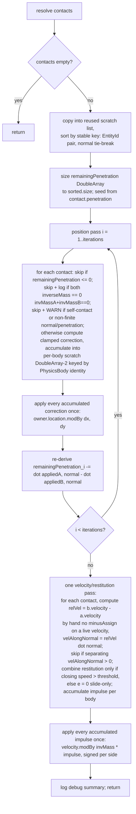

# Plan: `physics-resolution` — the `CollisionResolver` seam and its default `PositionalCorrectionResolver`

## Header / Association

- **Covers:** [SpartanLabsGaming/MyGameTools#49](https://github.com/SpartanLabsGaming/MyGameTools/issues/49)
  — *"Phase 1: physics — motion integration + collision resolution (push-out / slide)"* (item 4
  of 5 in `docs/framework-vision-and-roadmap.md` §3 Phase 1). This plan covers **unit 4 of 6**
  only.
- **Architecture:** `docs/issue-49-physics-architecture.md`, unit slug `physics-resolution`
  (§10 decomposition table, row 4; design in §4.5, hazard table entry §4.7 row 5, stability in
  §8, dependency/landing order in §10, algorithm requirements handed down from the caller's
  task brief and cited throughout this plan).
- **Branch:** `feature/49-physics-resolution`, off current `master` (which by the time this
  branch is cut must already carry units 1–3 merged: `physics-core-seams`, `physics-body-model`,
  `physics-narrow-phase`).
- **Commit:** TBD
- **PR:** TBD — this plan document is committed together with the first commit of its
  implementation (§8 below) so `git log --follow` binds the two.
- **What this plans:** the one `@SupportedExtension` seam in issue #49 — `interface
  CollisionResolver` in `gametools-world`'s `com.spartanlabs.gaming.world.physics` package, plus
  its shipped default, `PositionalCorrectionResolver`: Jacobi-accumulated slop + clamped-linear-
  projection push-out (Box2D-lineage, not Baumgarte) over 3–4 positional iterations, followed by
  one Jacobi-accumulated velocity/restitution pass that also produces slide as a side effect of
  zeroing the normal velocity component. No physics *detection* code, no `PhysicsSystem`, no
  `WorldSystems` — those are units 3, 5, and 6.
- **Status:** planning only. No source, test, or build file has been modified by this document.
- **Target release:** `5.3.0`. **`5.2.0` has not been cut yet** — see §8.
- **Dependencies:** units 1 (`physics-core-seams`) and 2 (`physics-body-model`), per the
  architecture's own decomposition table (§10 row 4). **Not** unit 3
  (`physics-narrow-phase`) — see §3.5 for why that is load-bearing for this unit's design, not
  incidental. Lands fourth in the stated sequence; units 5 (`physics-system`) and 6
  (`world-systems`) depend on it.
- **Related docs:** `docs/issue-49-physics-architecture.md` (§4.1, §4.5, §4.7 row 5, §8, §9, §10,
  §12 Open Decision 4); `docs/physics-core-seams-plan.md` (unit 1, already written — this plan
  imports its `SupportedExtension` without redeclaring or relocating it); `docs/api-openness-
  decisions-6.0.0.md` D1 (the other planned consumer of the same annotation).

---

## 1. Context

### 1.1 What this unit is for

Issue #49 gives `gametools-world` bodies push-out and slide. Push-out and slide are policy, not
mechanism — an RTS wants soft, forgiving overlap resolution; an MMO-lite wants hard blocking; a
brawler might want bouncier restitution. Constraint 4 of the architecture (§1.2) settles that
this policy is a constructor-injected interface with a supplied default, tier
`@SupportedExtension`, and that **this issue creates the annotation** (done — unit 1) and **this
unit's default implementation must be written to be read as the tier's worked example**
(architecture §4.5, and the global library-design rule in `~/.claude/CLAUDE.md`).

### 1.2 What exists today (verified)

- `com.spartanlabs.gaming.annotation.SupportedExtension` — **assumed landed by unit 1**,
  parameterless, `@MustBeDocumented @Retention(BINARY) @Target(CLASS, FUNCTION, PROPERTY,
  CONSTRUCTOR, TYPEALIAS)`, in `gametools-core` (`docs/physics-core-seams-plan.md` §2.2, §3.1).
  This plan imports it verbatim; it does not redeclare or relocate it, per the caller's binding
  instruction.
- `com.spartanlabs.gaming.world.physics.{Shape, PhysicsBody, Contact}` — **assumed landed by
  unit 2**, per architecture §4.3 and the cross-unit contract in the caller's brief:
  ```kotlin
  sealed interface Shape { data class Circle(val radius: Double); data class Aabb(val dimensions: Dimensions) }
  class PhysicsBody internal constructor(val owner: VisibleObject, var shape: Shape,
      var inverseMass: Double, var restitution: Double) {
      var velocity: Point = Point(0.0, 0.0)
      var acceleration: Point = Point(0.0, 0.0)
  }
  data class Contact(val a: PhysicsBody, val b: PhysicsBody?, val normal: Point, val penetration: Double)
  ```
  `PhysicsBody` defines no custom `equals`/`hashCode` (architecture §4.3: "plain class, not
  data") — default reference identity applies, which this plan relies on directly (§3.2).
  `b == null` means an environment contact (bounds / `StaticGeometry` / non-walkable terrain);
  only `a` moves. `owner: VisibleObject` never stores its own position — position is always
  `owner.location`, a `val Point` **mutated in place** (`GameObject.kt:42`, `location: val`),
  never reassigned — verified against `master`.
- `com.spartanlabs.geometry` (GeneralTools `2.2.0`, verified from its sources jar):
  `Point`/`Dimensions` extend `sealed class TwoDoubles(var first, var second)`
  (`TwoDoubles.kt:13`), which supplies **only compound-assignment arithmetic** —
  `setTo`/`modBy`/`plusAssign`/`minusAssign`/`timesAssign`/`divAssign` — and **no plain
  `plus`/`minus` operator**. `Vectors.kt` supplies `infix fun Point.dot`, `infix fun Point.cross`,
  `val Point.length`, `fun Point.normalized(): Result<Point>`, `infix fun Point.projectedOnto`.
  **This is load-bearing for §3.2**: computing a relative-velocity vector as `a.velocity -
  b.velocity` is not expressible without either mutating one of the live velocities in place
  (`a.velocity -= b.velocity` really does mutate `a.velocity`) or building the difference by hand
  from `.x`/`.y`. The implementation must do the latter — flagged explicitly in §3.2 and §7 as a
  concrete footgun this plan's code must avoid.
- `GameObject.entityId: EntityId` (`GameObject.kt:59-60`) — public getter, `internal set`.
  `EntityId` (`EntityId.kt:37`) is a `@JvmInline value class(val raw: Long) : Comparable<EntityId>`.
  Both facts matter for §3.3's canonical ordering.
- `Actor.speed` defaults to `ModularStat(base = 10.0)` "units per tick" (`Actor.kt:105`,
  `Actor.kt:40`) — the repo's existing per-tick unit-rate convention this plan's velocity/
  acceleration fields already follow (architecture §4.8, Open Decision 4, resolved: no `dt`).
- `VisibleObject`'s no-arg constructor defaults to a `25.0 x 25.0` box (`VisibleObject.kt:38-41`)
  — the only "typical unit size" this codebase actually defines anywhere; half-extent `12.5`.
  Used in §3.2 to scale the length-dimensioned tuning defaults, per the caller's explicit
  instruction not to copy Box2D's metre-scale raw numbers.
- No `com.spartanlabs.gaming.world.physics` package exists yet on `master` (verified: only
  `world.map` and `world.zone` exist under `gametools-world/src/main/kotlin/.../world`). Units 2
  and 3 create it ahead of this one; this plan's files land inside it.
- No module in this repo depends on MockK; tests use `kotlin.test` on the JUnit 5 platform
  (`build-logic/.../gametools.kotlin-library.gradle.kts:29`, verified) — this plan's tests follow
  that convention, not the global standard's MockK default, since nothing in this unit makes an
  external call to mock in the first place.
- `gametools-world` has no `nonfunctional` test-source directory yet (verified: only `component`,
  `deterministic`, `e2e`, `integration` exist under `gametools-world/src/test/kotlin/.../testing`)
  — §6's one nonfunctional test creates it for the first time in this module.

### 1.3 Acceptance shape for this unit

A consumer (starting with unit 5's `PhysicsSystem`, but usable standalone by anyone holding a
`List<Contact>`) can call `someResolver.resolve(contacts)` once per tick and get: bodies pushed
apart proportionally to their `inverseMass`, an immovable body (`inverseMass == 0.0`) that never
moves, a slide response that falls out of the same velocity pass with no separate mechanism, and
a result that does not depend on the order `contacts` arrived in — using only `master` symbols
(units 1–2) plus GeneralTools `2.2.0`, adding no dependency on unit 3.

---

## 2. Design

### 2.1 The interface — the entire injected seam

```kotlin
package com.spartanlabs.gaming.world.physics

@SupportedExtension
interface CollisionResolver {
    fun resolve(contacts: List<Contact>)
}
```

**Exact contract, stated precisely per the caller's instruction:**

- **Receives** the whole tick's contacts **in one call** — not one at a time. A resolver is free
  to iterate internally as many times as it wants (`PositionalCorrectionResolver` does 3–4
  positional passes plus one velocity pass, §2.3), but `PhysicsSystem` (unit 5) calls `resolve`
  exactly once per `step()`.
- **Mutates** two things, both already-shared mutable state: every touched `PhysicsBody.velocity`
  (a `var Point`, mutated in place, never reassigned to a fresh `Point`, to avoid a per-contact
  allocation) and every touched body's `owner.location` (a `val Point`, mutated in place — the
  same idiom every existing mover already uses, `GameObject.kt:42`).
- **Returns** `Unit`. See §2.4 for why, and why this is not a `Result`-returning signature.
- **Gets corrections back to `PhysicsSystem` by construction, not by return value**: because both
  mutated fields are the *same* `Point` instances `PhysicsSystem`, `VisibleObject`, and every
  other mover already read and write, there is nothing to "flush" — the mutation *is* the commit.
  This mirrors architecture §4.4 step 6 exactly ("nothing further to flush").
- **Aliasing rule (binding, restated for this seam specifically):** an implementation must never
  retain a `Contact`, a `Point` read off one, or a `PhysicsBody` reference past the `resolve()`
  call's own stack frame into a *new* long-lived field — `Contact` is documented as built fresh
  every tick and never retained past the call that built it (architecture §4.3). A conforming
  `CollisionResolver` **may** hold its own **reusable scratch state** across calls (arrays, maps)
  for performance (§2.3 does exactly this) — that is not the same thing as aliasing a *body's*
  live `Point`; the distinction is: cache *identity keys and computed scalars*, never a `Point`
  object taken from a `Contact` or a `PhysicsBody`.
- **Ordering:** `contacts`' order affects only bit-level floating-point reproducibility, never
  correctness — see §2.2 for why, and why `PositionalCorrectionResolver` does not lean on its
  caller to guarantee that reproducibility either.

Named `CollisionResolver`, by role, matching `SpatialIndex`/`ZoneIndex`'s convention (their
implementations are named for mechanism — `QuadtreeSpatialIndex`, `UniformGrid` — not suffixed
`*Strategy`), per the caller's binding naming instruction.

**Tier:** `@SupportedExtension` on the interface declaration (the `CLASS` target covers
interfaces in Kotlin's `AnnotationTarget`). No `@RequiresOptIn` — nothing about this seam is
unproven; it is the interface the issue exists to make substitutable (architecture §8, §9 last
bullet).

### 2.2 Why Jacobi, restated precisely for *this* unit's algorithm

Architecture §2 finding 1 and the caller's brief both establish *that* Jacobi is required. The
precise mechanism matters for this plan because "order-independent" has two different meanings
that must both hold:

1. **Mathematical order-independence**: the *converged* result does not depend on which contact
   is processed first, because every contact's correction for a pass is computed from the *same*
   pre-pass state and applied only after every contact in that pass has been evaluated
   (accumulate-then-apply, never resolve-one-then-move-to-the-next).
2. **Bit-level floating-point order-independence**: IEEE 754 addition is commutative for two
   operands (`a + b == b + a` exactly) but **not associative** for three or more
   (`(a + b) + c` can differ from `a + (b + c)` by a rounding ULP). A body touched by three or
   more contacts in the same pass therefore *can* get a different final `Double` depending on the
   order those contacts were summed in — even though the underlying algorithm is Jacobi and
   mathematically order-independent. This is exactly what a test that shuffles the input list and
   asserts identical output (§6, level 4a) would catch if it were not handled.

Architecture §4.4 step 4 puts the fix at the caller: `PhysicsSystem` sorts contacts by a stable
key before ever calling `resolve`. That is correct and necessary for `PhysicsSystem`'s own
guarantee (independent of which `SpatialIndex` produced the broad-phase candidates). **This plan
additionally has `PositionalCorrectionResolver` establish its own canonical order internally**,
on a private, reused scratch copy of `contacts`, before any accumulation happens. Reasoning:

- `CollisionResolver` is a public `@SupportedExtension` interface. Any caller — not only
  `PhysicsSystem` — can construct a `PositionalCorrectionResolver` and call `resolve()` directly
  with a hand-built, arbitrarily-ordered `List<Contact>`. If `PositionalCorrectionResolver`'s own
  reproducibility depended on its caller having sorted first, the tier's worked-example
  implementation would only be reproducible *by convention*, not *by construction* — a weaker
  guarantee than what "the acceptance criterion Jacobi exists to satisfy" (the caller's own
  framing) asks for.
- The cost is small and bounded: one `sortedWith` over a list whose size is the tick's contact
  count (expected in the hundreds, not the ~10k entity count), reusing a scratch `ArrayList`
  rather than allocating a fresh sorted list every tick (§3.2).
- This is **flagged to the architecture as a gap this plan fills, not a silent addition**: §4.5's
  text places the sort at `PhysicsSystem` only. This plan does not weaken or replace that
  requirement (unit 5 must still implement it, for the general seam guarantee across *any*
  injected resolver, not only this default one) — it makes the shipped default's own guarantee
  self-contained in addition. See the handback report for this flagged explicitly to the caller.

The canonical key: `(a.owner.entityId, b?.owner.entityId ?: EntityId(Long.MIN_VALUE))`, comparing
`EntityId`'s wrapped `raw: Long` (it is already `Comparable<EntityId>`, `EntityId.kt:37`), with
`normal.x` then `normal.y` as a further tie-break for the theoretical case of two contacts
sharing the same body pair (e.g., a corner overlap producing two manifold points) — this only
matters for two contacts between the *same* pair with *different* normals; two contacts with an
identical `(a, b, normal)` would be duplicate/redundant contacts, a narrow-phase deduplication
question that belongs to unit 3, not here.

### 2.3 `PositionalCorrectionResolver` — the algorithm



**Position phase, per iteration, per contact** (`penetration` is that contact's current
`remainingPenetration[i]`, not the original `Contact.penetration` after the first pass):

```
correctionMagnitude = min(max(penetration - slop, 0.0) * correctionPercent, maxCorrection)
totalInverseMass     = invMassA + invMassB        // invMassB = b?.inverseMass ?: 0.0
shareA = invMassA / totalInverseMass
shareB = invMassB / totalInverseMass
// normal points from a toward b (or outward from a when b == null); moving a away from b is -normal
accumulate(a, -normal.x * correctionMagnitude * shareA, -normal.y * correctionMagnitude * shareA)
if (b != null) accumulate(b, normal.x * correctionMagnitude * shareB, normal.y * correctionMagnitude * shareB)
```

`totalInverseMass == 0.0` (both sides immovable) is guarded **before** this division — skip the
contact entirely (§3.2), the explicit "guard the 0/0 case" requirement.

**Re-deriving penetration without re-running narrow-phase detection.** After a pass applies its
accumulated corrections, the next pass needs each contact's *updated* separation. `resolve()` has
no access to unit 3's narrow-phase code — by design: **the architecture's own decomposition table
scopes unit 4's dependencies to units 1 and 2 only, not unit 3** (§10 row 4), which this plan
takes as confirmation that a fresh geometric re-test between iterations is deliberately out of
this seam's contract, not an oversight. Instead, since each contact's `normal` is fixed for the
whole `resolve()` call, the change in separation along that normal after applying a pass's
corrections is derived algebraically: a body's net applied displacement this pass, dotted with
the contact's normal, is exactly how much closer or further apart the two bodies moved along that
axis. This is the same simplification real positional-correction solvers in this lineage use
internally (a fixed manifold normal/anchor updated by incremental point tracking across solver
iterations, not a full re-test per iteration) — it is standard for this class of solver, not a
shortcut invented for this plan:

```
remainingPenetration[i] = max(0.0, remainingPenetration[i] - (dot(appliedA, normal) - dot(appliedB, normal)))
```

where `appliedA`/`appliedB` are the net `(dx, dy)` this pass actually applied to `a`/`b` (zero if
that body was not itself touched this pass, or if `b == null`).

**Velocity / restitution pass, once, after all position iterations** (standard impulse-based
resolution, matching the Box2D-lineage convention this whole design is modelled on):

```
relVel        = Point(b.velocity.x - a.velocity.x, b.velocity.y - a.velocity.y)  // built by hand, see §3.2
velAlongNormal = relVel dot normal
if (velAlongNormal > 0.0) return@contact   // separating already; no impulse (Jacobi: accumulate, don't apply yet)
closingSpeed = -velAlongNormal
e = when {
    b == null                              -> if (closingSpeed > restitutionVelocityThreshold) a.restitution else 0.0
    closingSpeed > restitutionVelocityThreshold -> restitutionCombine(a.restitution, b.restitution)
    else                                    -> 0.0
}
j = -(1.0 + e) * velAlongNormal / totalInverseMass
impulse = Point(j * normal.x, j * normal.y)
accumulateVelocity(a, -invMassA * impulse.x, -invMassA * impulse.y)
if (b != null) accumulateVelocity(b, invMassB * impulse.x, invMassB * impulse.y)
```

then apply every accumulated velocity delta once, exactly as the position phase does. **This one
formula is where slide and restitution both come from, with no separate mechanism**: with `e ==
0.0` (below the closing-speed threshold, or by an unforgiving custom `restitutionCombine`), the
impulse exactly cancels the closing normal-velocity component and leaves the tangential
(sliding) component untouched — that *is* slide. With `e > 0.0`, the same formula overshoots past
zero and reverses it — that is bounce. Per architecture §4.7 row 5, `b == null` uses `a`'s own
`restitution` directly, never through `restitutionCombine`.

**Why the velocity pass is also Jacobi-accumulated, not applied contact-by-contact.** The
architecture text describes "one velocity/restitution pass" without specifying its own internal
discipline. This plan applies the same accumulate-then-apply-once rule used for position, for the
identical reason: a body touched by three or more contacts in the velocity pass would otherwise
see partially-updated velocities from whichever contact happened to be processed first in that
pass, reintroducing exactly the order-dependence §2.2 rules out for position. This is this plan's
own extension of the architecture's algorithm, made for consistency with its stated rationale —
flagged here rather than left implicit.

### 2.4 Error handling for this unit's two signatures

- **`CollisionResolver.resolve(contacts: List<Contact>): Unit`** — no `Result`. Per the caller's
  explicit scoping instruction, resolution over a contact set is a **bulk** operation, following
  `World.tick()`/`ZoneIndex.refresh`'s precedent (log-and-skip one anomalous element, return
  `Unit`), not `Movement.step`'s per-entity `Result`. Concretely: a self-contact (`contact.a ===
  contact.b`), a non-finite `normal` or `penetration` (`NaN`/`Infinity`), or a total inverse mass
  of exactly `0.0` are all **skipped, not thrown** — the first two are logged at `WARN` (they
  indicate a malformed `Contact`, a real bug somewhere upstream, worth surfacing even without
  debug logging enabled); the third is logged at `TRACE` (two immovable things overlapping is an
  expected, unremarkable steady state, not an anomaly). **KT-39198 does not arise here**: nothing
  in this hot path constructs a `Result<T>` per contact or per body — the log-and-skip pattern
  needs no boxed wrapper at all, avoiding the generic-boundary boxing pitfall by construction, not
  by careful avoidance.
- **`PositionalCorrectionResolver`'s constructor** — throws `IllegalArgumentException` via
  `init { require(...) }` for an invalid tuning parameter (`iterations < 1`, `slop < 0.0`,
  `correctionPercent` outside `0.0..1.0`, `maxCorrection < 0.0`, `restitutionVelocityThreshold <
  0.0`). This is a **programmer/configuration error**, not an operational failure — thrown, not
  wrapped in `Result`, matching `TiledMap`'s and `ZoneGrid`'s existing `init { require(...) }`
  idiom in this exact codebase (`TiledMap.kt:56-63`, `ZoneGrid.kt:35-37`, both verified).

---

## 3. File-by-file changes

### 3.1 New: `gametools-world/src/main/kotlin/com/spartanlabs/gaming/world/physics/CollisionResolver.kt`

```kotlin
package com.spartanlabs.gaming.world.physics

//region 1. Organization Internal
// 1.2 Spartan Gaming
import com.spartanlabs.gaming.annotation.SupportedExtension
//endregion

/**
 * The one substitutable policy in `gametools-world`'s physics pipeline: given a tick's full set
 * of [Contact]s, decide what happens - push apart, slide, bounce, or something a consumer
 * invents entirely (a hard-blocking MMO stop, an RTS-soft nudge, a no-op for a game that only
 * wants overlap *detection*).
 *
 * Called exactly once per tick, with the *entire* tick's contact list - not one [Contact] at a
 * time - so an implementation is free to iterate internally (the shipped
 * [PositionalCorrectionResolver] runs several passes inside one [resolve] call). A resolver
 * commits its decisions by mutating [PhysicsBody.velocity] and [PhysicsBody.owner]'s `location`
 * directly, in place, through the same mutable [com.spartanlabs.geometry.Point] instances every
 * other mover in this engine already writes through - there is no return value to carry a
 * result back, and nothing further for a caller to "commit".
 *
 * ### Writing your own [CollisionResolver]
 * - Never retain a [Contact], or a [com.spartanlabs.geometry.Point] read off one or off a
 *   [PhysicsBody], past the [resolve] call that handed it to you - a [Contact] is rebuilt fresh
 *   every tick and is not a stable identity. Caching your *own* scalars or identity keys across
 *   calls (for a reused scratch buffer, say) is fine; caching someone else's [Point] is not.
 * - [Contact.b] is `null` for an environment contact (map bounds, static geometry, non-walkable
 *   terrain) - treat it as an immovable, zero-velocity partner, never as "no contact".
 * - The order of [contacts] is not guaranteed by this interface to be stable across calls (a
 *   caller *should* sort it for its own reproducibility - see [PositionalCorrectionResolver]'s
 *   own KDoc for why), so do not rely on encounter order for anything beyond a stable-sort key
 *   you establish yourself.
 * - This interface is `@SupportedExtension`: substituting it carries no less of a stability
 *   guarantee than anything in this library's Stable Core. Changing [resolve]'s signature later
 *   is exactly as breaking as changing any other public method.
 *
 * @see PositionalCorrectionResolver the shipped default, and this seam's worked example
 */
@SupportedExtension
interface CollisionResolver {

    /**
     * Resolves every contact in [contacts] - the current tick's complete set, built fresh by
     * whatever produced it (typically `PhysicsSystem`, landing in a later #49 unit) and never
     * retained past this call. Implementations mutate the involved [PhysicsBody]s' `velocity`
     * and `owner.location` directly; there is nothing to return.
     *
     * @param contacts every contact detected this tick; empty if none. Never mutated by the
     *   caller during or after this call - do not alias it past this call's own scope either.
     */
    fun resolve(contacts: List<Contact>)
}
```

**Error handling:** none applicable to the interface declaration itself (no body); the contract
for implementations is stated in KDoc (§2.4) rather than enforced by the type system.

**Mutability:** the interface prescribes no state; `resolve` is documented as mutating its
arguments' component objects, never the `List<Contact>` itself.

**Logging:** none at the interface level - an interface has no execution path to log from.

**Stability tier:** `@SupportedExtension` (architecture §8). Same semver guarantee as Stable
Core; the tier marks *purpose* (a likely-but-non-core seam), not a weaker promise.

### 3.2 New: `gametools-world/src/main/kotlin/com/spartanlabs/gaming/world/physics/PositionalCorrectionResolver.kt`

```kotlin
package com.spartanlabs.gaming.world.physics

//region 1. Organization Internal
// 1.1 Spartan Laboratories
import com.spartanlabs.geometry.Point
import com.spartanlabs.geometry.dot
//endregion

//region 4. Programming Infrastructure and Support
// 4.1 Logging
import org.slf4j.Logger
import org.slf4j.LoggerFactory
//endregion

/**
 * Shared slf4j logger for `world.physics`. **Coordination note for the implementer:** if unit 2
 * (`physics-body-model`) or unit 3 (`physics-narrow-phase`) already declared a package-level
 * `internal val log` for this package by the time this unit lands (both land first, per the
 * architecture's own sequencing), delete this declaration and use theirs instead - a duplicate
 * top-level property of the same name in the same package is a compile error. This plan cannot
 * see those units' output ahead of time and assumes, based on `master`'s state today, that
 * neither has declared one yet.
 */
internal val log: Logger = LoggerFactory.getLogger("com.spartanlabs.gaming.world.physics")

/**
 * The shipped default [CollisionResolver] - slop-plus-clamped-linear-projection push-out
 * (the Box2D lineage, not Baumgarte-only integration, which overshoots into jitter or
 * undershoots into sinking) accumulated **Jacobi-style** across every contact touching a body
 * before any of it is applied, run for [iterations] passes, followed by one impulse-based
 * velocity/restitution pass that produces slide as a side effect of zeroing the closing velocity
 * along each contact's normal - not a separate mechanism.
 *
 * ### Why Jacobi, specifically, in this engine
 * [com.spartanlabs.gaming.spatial.SpatialIndex.queryBox]'s own contract documents its result
 * order as **unspecified**, and a [com.spartanlabs.gaming.gameobjects.World] can be configured
 * with either a `QuadtreeSpatialIndex` or a `UniformGrid`. A solver that resolved contacts one
 * at a time, mutating state as it went (Gauss-Seidel), would make this library's physics output
 * depend on *which* spatial index a consumer happened to install - silently reopening the very
 * interchangeability #48 exists to guarantee. Jacobi - compute every contact's correction from
 * the *same* pre-pass state, accumulate per body, apply once - does not have that dependency.
 *
 * This implementation goes one step further than strict mathematical Jacobi requires: because
 * floating-point addition is commutative but not associative, a body touched by three or more
 * contacts in one pass can still produce a different `Double`, bit-for-bit, depending on the
 * *order* those contacts were summed in - even though the algorithm is mathematically
 * order-independent. Rather than depend on its caller having sorted [Contact]s into a canonical
 * order first (a real, documented requirement on `PhysicsSystem`, but not one this class can see
 * or enforce from the other side of the seam), this resolver sorts its own private working copy
 * by each contact's participant [com.spartanlabs.gaming.gameobjects.EntityId] pair (with a
 * `normal`-based tie-break) before doing anything else - so shuffling the input list handed to
 * [resolve] never changes the result, on its own, regardless of what any particular caller does.
 *
 * ### Tuning
 * Every numeric knob is a constructor parameter with a default, never hardcoded, per this
 * library's "parameterise policy" rule - none of Box2D's own metre-scale constants are copied
 * directly; each length-dimensioned default below is instead derived from this engine's own
 * typical scale (a [com.spartanlabs.gaming.gameobjects.VisibleObject]'s default `25 x 25` box,
 * half-extent `12.5`, is the closest thing this codebase defines to "a typical unit's radius"):
 *
 * | Parameter | Default | Derivation |
 * |---|---|---|
 * | [iterations] | `4` | 3-4 positional passes, per this issue's own scoping - this repo has no stacking/joint problem, so it does not need Box2D's 8/3 split |
 * | [slop] | `0.2` | `~0.015 x 12.5` (the `0.01-0.02 x r` range this issue specifies) |
 * | [correctionPercent] | `0.2` | Box2D's own dimensionless value - transfers directly, no rescaling needed |
 * | [maxCorrection] | `6.25` | `0.5 x 12.5` exactly, per this issue's own formula |
 * | [restitutionVelocityThreshold] | `0.5` | a "near-rest" cutoff relative to [com.spartanlabs.gaming.gameobjects.Actor.speed]'s own `10.0`-units-per-tick default - about 5% of typical movement speed. **The least formula-anchored of these five and the one most worth confirming against real gameplay feel before release** (see this plan's Open Decisions). |
 * | [restitutionCombine] | `::minOf` | the conservative choice - matches "nothing bounces today" as the current, unsurprising behaviour |
 *
 * This class is deliberately **not open to subclassing** - the substitutable seam is
 * [CollisionResolver] itself; a consumer wanting different behaviour implements that interface
 * directly rather than overriding pieces of this one.
 *
 * Not thread-safe: this class holds reused scratch state across calls for performance (§ see the
 * source for the exact fields) and assumes, like every other stateful piece of this engine
 * (`World`, `SpatialIndex`), a single driver thread calling [resolve] - never concurrently with
 * itself.
 *
 * @param iterations positional-correction passes per [resolve] call; must be at least `1`
 * @param slop the penetration depth below which no correction is applied, preventing correction
 *   jitter at rest; must be `>= 0.0`
 * @param correctionPercent the fraction of each pass's over-slop penetration actually corrected;
 *   must be in `0.0..1.0`
 * @param maxCorrection the largest position correction applied to a single contact in a single
 *   pass, preventing a deeply-overlapping pair from teleporting apart in one tick; must be
 *   `>= 0.0`
 * @param restitutionVelocityThreshold the closing speed below which restitution is suppressed
 *   entirely (only the slide/slop response applies) to prevent resting-contact jitter; must be
 *   `>= 0.0`
 * @param restitutionCombine how two bodies' [PhysicsBody.restitution] values combine into one
 *   coefficient for a body-to-body contact; not consulted for an environment contact
 *   ([Contact.b] `== null`), where [PhysicsBody.restitution] of the moving body is used directly
 * @throws IllegalArgumentException if any parameter fails the bound stated above
 */
class PositionalCorrectionResolver(
    val iterations: Int = 4,
    val slop: Double = 0.2,
    val correctionPercent: Double = 0.2,
    val maxCorrection: Double = 6.25,
    val restitutionVelocityThreshold: Double = 0.5,
    val restitutionCombine: (Double, Double) -> Double = ::minOf,
) : CollisionResolver {

    init {
        require(iterations >= 1) { "iterations must be at least 1; got $iterations" }
        require(slop >= 0.0) { "slop must be >= 0.0; got $slop" }
        require(correctionPercent in 0.0..1.0) { "correctionPercent must be in 0.0..1.0; got $correctionPercent" }
        require(maxCorrection >= 0.0) { "maxCorrection must be >= 0.0; got $maxCorrection" }
        require(restitutionVelocityThreshold >= 0.0) { "restitutionVelocityThreshold must be >= 0.0; got $restitutionVelocityThreshold" }
    }

    // Reused scratch state - grown, never shrunk, across calls; see §3.2 of the plan this
    // class implements for the reasoning. Not full object pooling (premature at this stage,
    // per the plan's own note) - just "do not reallocate the container every tick".
    private val sorted: ArrayList<Contact> = ArrayList()
    private var remainingPenetration: DoubleArray = DoubleArray(0)
    private val positionScratch: HashMap<PhysicsBody, DoubleArray> = HashMap()
    private val velocityScratch: HashMap<PhysicsBody, DoubleArray> = HashMap()
    private val touchedThisPass: ArrayList<PhysicsBody> = ArrayList()

    override fun resolve(contacts: List<Contact>) {
        if (contacts.isEmpty()) return
        // ... build `sorted` (§2.2), size `remainingPenetration` to sorted.size, run
        // `iterations` position passes (§2.3), then the one velocity/restitution pass (§2.3).
        // Full body per the pseudocode and hot-loop idioms in §2.3/§3.2 of the plan.
    }
}
```

**Error handling:** as specified in §2.4 - constructor `require`s throw `IllegalArgumentException`
for a programmer/configuration error; `resolve()` returns `Unit` and log-and-skips a per-contact
anomaly, never throwing out of the hot loop for a single malformed element.

**Mutability:** `iterations`/`slop`/`correctionPercent`/`maxCorrection`/
`restitutionVelocityThreshold`/`restitutionCombine` are `val` - fixed for the life of one resolver
instance, matching `ZoneGrid`'s `val columns`/`val rows` precedent (`ZoneGrid.kt:34`) for a
publicly-readable, constructor-only-configurable tuning value. The five private scratch fields
are `var`/mutable collections, deliberately - the entire point of §2.3's design is to reuse them
across calls rather than reallocate.

**Concurrency:** not thread-safe, by design and by necessity (the reused scratch fields are
instance state); documented in the class KDoc. Matches this engine's existing single-driver-
thread assumption (`World`, `SpatialIndex`) - not a new constraint this class introduces.

**Logging - events and levels:**

| Event | Level | When |
|---|---|---|
| `PositionalCorrectionResolver.resolve: {} contact(s), {} iteration(s)` | `DEBUG` | once per non-empty `resolve()` call, before any work |
| `Skipping contact between {} and {}: both sides immovable` | `TRACE` | a contact with `invMassA + invMassB == 0.0` - expected, not exceptional |
| `Skipping malformed contact ({}): {}` | `WARN` | a self-contact (`a === b`) or a non-finite `normal`/`penetration` - indicates a real upstream bug, worth surfacing even with debug logging off |
| `PositionalCorrectionResolver.resolve: resolved {} of {} contact(s); {} received a velocity/restitution impulse` | `DEBUG` | once per non-empty `resolve()` call, after the velocity pass |

All using slf4j's lazy `{}` placeholders, matching `World.tick()`'s own `log.debug(...)`
convention (`World.kt:224`), so the cost is a no-op with debug logging disabled - important given
this runs in a 10-20 Hz hot loop once `PhysicsSystem` exists.

**Stability tier:** Stable Core (architecture §8) - this is the shipped default, itself closed to
subclassing (no `open`); its removal or a behavioural change to it is exactly as breaking as
changing any other public Stable Core surface. Its six constructor parameters are Stable Core
surface too - renaming, removing, or reordering any of them (Kotlin named-argument call sites
would still break on reordering with defaults) is a breaking change requiring a major bump.

### 3.3 Hazard called out explicitly: never use a `Point`'s compound-assignment operators on a *live*, shared field to compute a temporary

GeneralTools' `Point`/`Dimensions` expose only `plusAssign`/`minusAssign`/`timesAssign`/
`divAssign` (`TwoDoubles.kt:49-55`) - no plain, non-mutating `plus`/`minus`. Writing
`a.velocity -= b.velocity` to compute "the relative velocity" would **mutate `a.velocity` in
place** rather than produce a temporary difference - a real correctness bug this implementation
must avoid by building `Point(b.velocity.x - a.velocity.x, b.velocity.y - a.velocity.y)` by hand
wherever a *temporary* vector difference is needed (§2.3's velocity pass), reserving
`modBy`/`+=`-style compound assignment exclusively for the places this design actually intends to
mutate `owner.location` or `velocity` permanently (applying an accumulated correction or
impulse). This is called out here, separately from the code block above, because it is exactly
the kind of footgun a reviewer glancing at "just subtract the two velocities" would not
immediately catch.

### 3.4 No changes to any other file in `gametools-core` or `gametools-world`

This unit adds two new files to a package units 2 and 3 already created; it does not touch
`Shape`, `PhysicsBody`, `Contact`, any narrow-phase code, `PhysicsSystem` (does not exist yet),
or `WorldSystems` (does not exist yet). **Deliberately does not reference either of the latter
two with a bracket-style `[PhysicsSystem]`/`[WorldSystems]` KDoc link anywhere in §3.1/§3.2** -
neither symbol exists in this module at the point this unit lands (they arrive in units 5 and 6),
and an unresolvable KDoc link would fail `./gradlew dokkaGeneratePublicationHtml`
(`CONTRIBUTING.md`'s own noted check) on *this* unit's own PR, before either class exists to
resolve against. Both are mentioned only as plain, backtick-quoted prose - see the KDoc text
above, which already does this correctly, and treat it as the pattern to follow if either name
needs to appear anywhere else in this unit's code.

### 3.5 Dependency scoping confirmed, not merely assumed

Architecture §10's decomposition table lists unit 4's dependencies as **"1, 2"** - not 3. This
plan takes that as confirmation (not an oversight) that `PositionalCorrectionResolver` must not
call into unit 3's (internal, same-package) narrow-phase machinery to re-test geometry between
positional iterations, and designs §2.3's "re-derive penetration" step as a self-contained
analytic projection instead, using only what `Contact`/`PhysicsBody` already expose. A reviewer
who notices `PositionalCorrectionResolver` never touches `PhysicsBody.shape` should read that as
intentional: the resolver is shape-agnostic by construction, exactly because every piece of
geometry it needs (`normal`, `penetration`) is already baked into `Contact` by whatever produced
it.

---

## 4. Documentation impact (Audience-Reach rings)

- **Inner Core (in-editor):** the coordination `//` comment on `internal val log`'s declaration
  (§3.2) is the one Inner Core artifact this unit adds - a maintenance note for whoever lands
  units 2/3/4 in whichever actual order they end up merging in. No `TODO`/`FIXME` needed
  otherwise.
- **Component Ring (KDoc/API contracts):** the primary ring this unit touches, and the one
  carrying the extra weight the caller's brief calls for. `CollisionResolver`'s KDoc states the
  seam's exact contract (§2.1); `PositionalCorrectionResolver`'s KDoc is written to double as the
  tier's worked example - it explains not just *what* the class does but *why* Jacobi, *why* the
  extra internal sort, and how the tuning defaults were derived, so a consumer implementing their
  own `CollisionResolver` has a complete worked reference to read, not just a class to copy.
- **Boundary Ring (protocol/integration):** not touched - no wire format, no `ClientCommand`, no
  cross-service concern in this unit.
- **Architectural Outer Layer:** `docs/issue-49-physics-architecture.md` already documents this
  unit's design; no update owed to it by this unit specifically. The one cross-cutting
  architectural note this unit surfaces - the internal defensive sort going beyond §4.5's literal
  text (§2.2) - is reported to the caller in this plan's handback, not silently absorbed into the
  architecture document (not this plan's file to edit).
- **README:** **deliberately not touched by this unit.** Architecture §10's last paragraph
  assigns "the README.md Architecture/Features prose describing physics as a whole" to unit 6
  specifically, precisely because no end-to-end physics behaviour exists to describe until
  `PhysicsSystem`/`WorldSystems` land - a `CollisionResolver` no consumer can yet inject anywhere
  is not something a README reader can act on. This is a deliberate, reasoned deferral, not an
  oversight - see §7 (Interfaces with sibling units) for the explicit hand-off to unit 6.
- **CHANGELOG:** own `[Unreleased]` entry, in this unit's own commit, per §8 and the caller's
  explicit standard ("your own `[Unreleased]` entry in your own PR").

---

## 5. Test plan (5-level hierarchy)

Production package under test: `com.spartanlabs.gaming.world.physics`. Mirrored test packages:
`com.spartanlabs.gaming.testing.<level>.world.physics`, under
`gametools-world/src/test/kotlin/com/spartanlabs/gaming/testing/<level>/world/physics/`.

### Level 1 - gating

**No `testing.gating` package exists anywhere in this repo** (verified across both `gametools-
core` and `gametools-world`). Not invented here. In practice, level 1 for this unit is
`./gradlew componentTest deterministicTest` before every push, using the level 2 and 4a tests
below - there is no separate checked-in artifact.

### Level 2 - component

Package: `com.spartanlabs.gaming.testing.component.world.physics`.

- **`CollisionResolverContractTest.kt`** - one test class.
  - `CollisionResolver carries @SupportedExtension` - reflection check,
    `CollisionResolver::class.java.isAnnotationPresent(SupportedExtension::class.java)`, mirroring
    unit 1's own `SupportedExtensionTest` pattern (`docs/physics-core-seams-plan.md` §5).
  - `a minimal custom CollisionResolver compiles and is substitutable` - a tiny test-local
    `object NoOpResolver : CollisionResolver { override fun resolve(contacts: List<Contact>) {} }`,
    referenced once so it is not flagged as dead code. This is a deliberately small "does the
    seam actually work as a seam" sanity check, distinct from testing
    `PositionalCorrectionResolver`'s own behaviour below.

- **`PositionalCorrectionResolverTest.kt`** - one test class, the main behavioural suite:
  - `constructor rejects an invalid iterations/slop/correctionPercent/maxCorrection/threshold` -
    five cases (or five separate `@Test` methods), each asserting `IllegalArgumentException`.
  - `a contact where both bodies have inverseMass 0.0 is skipped without dividing by zero` - two
    immovable `PhysicsBody`s, `resolve()` does not throw and neither body's `owner.location`
    changes.
  - `a self-contact (a === b) is skipped and logged` - constructs a `Contact` whose `a` and `b`
    are the same `PhysicsBody`; asserts no position/velocity change and (via a captured logback
    appender, matching this repo's existing logback-in-tests convention) a `WARN`-level log line.
  - `restitution is suppressed below restitutionVelocityThreshold` - two bodies closing below the
    threshold with `restitution = 1.0` each; asserts the post-resolve relative normal velocity is
    (approximately) zero, not reversed.
  - `restitution applies above restitutionVelocityThreshold using restitutionCombine` - same
    setup above the threshold; asserts the combine function was actually invoked (a resolver
    constructed with a spy/tracking lambda, not MockK - this repo has no MockK dependency) and its
    result, not each body's own `restitution` alone, determined the bounce.
  - `an environment contact (b == null) uses a's own restitution directly, not restitutionCombine`
    - asserts the combine lambda is never invoked for a `Contact` whose `b` is `null`.
  - `slide leaves the tangential velocity component unchanged` - a body approaching a surface at
    an angle; asserts the normal component of velocity is zeroed (or scaled by `1 -
    restitution`) while the tangential component survives resolve() intact.
  - `a NaN or infinite normal/penetration is skipped and logged at WARN, not thrown` - malformed
    `Contact` fixtures constructed directly (bypassing whatever validation, if any, unit 2/3 apply
    - this is exactly the "third-party caller can hand-build a bad Contact" case §2.1 documents).

### Level 3 - integration

Not applicable. No external interface, database, or third-party service is touched by this unit -
`CollisionResolver`/`PositionalCorrectionResolver` operate entirely on in-memory `PhysicsBody`/
`Contact` values. No test added.

### Level 4a - deterministic (the centrepiece, per the caller's own framing)

Package: `com.spartanlabs.gaming.testing.deterministic.world.physics`. Placed at level 4a rather
than level 2 following this exact repo's own precedent for a *stateful-but-deterministic* system
(`ZoneIndexRefreshDeterminismTest`, which also asserts reproducible in-place mutation, not a pure
return value - `gametools-world/src/test/kotlin/.../testing/deterministic/world/zone/`, verified
present) - `resolve()` mutates state in place rather than returning a value, but "same input,
always the same output" is exactly a determinism law, not a component-behaviour spec.

- **`PositionalCorrectionResolverSymmetryTest.kt`** - one test class: two bodies of **equal**
  `inverseMass`, overlapping head-on, `resolve()`d; asserts each moved by an equal and opposite
  distance along the normal (within a tight epsilon for the one `sqrt`-free comparison this needs
  - no `sqrt` is actually required here since the displacement is measured along the known
  normal axis directly).
- **`PositionalCorrectionResolverImmovableBodyTest.kt`** - one test class: a movable body against
  an immovable one (`inverseMass == 0.0`), and separately against an environment contact (`b ==
  null`); asserts the immovable body's `owner.location` is bit-identical before and after
  `resolve()` in both cases, and that 100% of the correction magnitude went to the movable side
  (`shareA`/`shareB` reduces to `0`/`1` or `1`/`0` exactly, not approximately).
- **`PositionalCorrectionResolverOrderIndependenceTest.kt`** - one test class, **the acceptance
  criterion Jacobi exists to satisfy**: build a fixture with one "hub" body touched by **three or
  more** simultaneous contacts (the case §2.2 identifies as the one where floating-point
  summation order can actually matter) plus several independent pairs; run `resolve()` against
  the contact list in its original order and against several `kotlin.random.Random(fixedSeed)`-
  shuffled permutations of the *same* list (fresh, identical body/state fixtures for each
  permutation - never reusing already-mutated bodies across permutations); assert every
  permutation produces **bit-identical** final `owner.location`/`velocity` values. This is exactly
  the test that would fail without §2.2's internal defensive sort, and exists specifically to
  prove that sort is load-bearing, not decorative.

**Explicitly out of this unit's test scope, flagged rather than silently skipped:** "physics
output is identical under `UniformGrid` and `QuadtreeSpatialIndex`" (named in the caller's brief
as an L4a behaviour) **cannot be exercised by this unit's own tests** - `CollisionResolver`/
`PositionalCorrectionResolver` have no dependency on, or awareness of, `SpatialIndex` at all; that
guarantee is necessarily an end-to-end property of `PhysicsSystem`'s broad phase plus this
resolver together, and belongs in unit 5's test plan. This plan's own order-independence test
(above) is the piece of that larger guarantee this unit can actually prove in isolation.

### Level 4b - e2e

Not applicable to this unit alone - a full `World`/`PhysicsSystem`/`WorldSystems` flow does not
exist until units 5-6 land. No test added here; named as owed to unit 6 (or unit 5) instead.

### Level 4c - non-functional

Package: `com.spartanlabs.gaming.testing.nonfunctional.world.physics` - **new to
`gametools-world`** (no `nonfunctional` test-source directory exists in this module today,
verified). One light test, recommended but not required by the architecture text (flagged as an
Open Decision, §9):

- **`PositionalCorrectionResolverScratchStabilityTest.kt`** - calls `resolve()` on the same
  resolver instance repeatedly (hundreds of ticks) against a contact set of stable size, and
  asserts the resolver's own scratch collections (exposed for the test via `internal` visibility
  or reflection, whichever this repo's existing nonfunctional tests already prefer - check
  `SpatialIndexScalabilityTest`'s own access pattern before choosing) do not grow without bound
  after the first few calls. This is a direct, cheap regression guard on the specific "reused, not
  reallocated" claim this plan's design makes (§3.2) - not a throughput/latency benchmark (no
  target Hz or entity count is asserted, since that belongs to unit 5/6's own end-to-end
  nonfunctional suite once a real `PhysicsSystem` exists to drive load through).

### Level 5 - UAT

**No `testing.uat` package exists anywhere in this repo.** Not invented here. A resolver with
nothing yet able to inject it (`PhysicsSystem` does not exist until unit 5) produces no
observable, playable behaviour for a human or AI evaluator to assess. Any UAT signal for issue
#49 belongs to whichever unit first produces observable, driveable physics - unit 5 or 6 - not
this one.

---

## 6. What genuinely cannot be tested automatically

- **True bit-for-bit floating-point reproducibility across different JVMs/JIT compilations.**
  §5's order-independence test asserts bit-identical results *within one test run*, which is the
  practically meaningful guarantee (a single running server producing reproducible physics for
  its own replay/determinism needs). Whether two *different* JVM builds or JIT paths (e.g.,
  differing FMA instruction selection) could theoretically still diverge at the ULP level is a
  known, general floating-point-determinism caveat this plan does not claim to close, and no
  practical automated test in this repo's tooling can fully rule it out.
- **Real gameplay feel for the tuning defaults** (`slop`, `maxCorrection`,
  `restitutionVelocityThreshold` particularly) - whether push-out feels responsive rather than
  mushy, whether the near-rest cutoff actually eliminates visible jitter in a real running game -
  needs human playtesting once a runnable demo exists (units 5/6), not something this unit's
  automated suite can assert.
- **Cross-module compilation of the seam from a real `PhysicsSystem`** - this unit's own test tree
  cannot prove `PhysicsSystem(resolver: CollisionResolver = PositionalCorrectionResolver())`
  actually compiles and behaves as intended end-to-end, since `PhysicsSystem` does not exist
  until unit 5. Flagged here rather than papered over; unit 5's own test suite is where that gets
  proven for real.

---

## 7. Risks & edge cases

- **Breaking changes:** none - both files are wholly new. From this commit onward, however,
  `CollisionResolver` and `PositionalCorrectionResolver` (including its six constructor
  parameters) are governed by full semver: a later signature change to either is a breaking
  change requiring a major bump, exactly as much as any Stable Core change (architecture §8's
  point that `@SupportedExtension` "marks purpose, not a weaker promise").
- **Cross-unit correctness dependency on unit 2, flagged forward:** `PositionalCorrectionResolver`'s
  math assumes `PhysicsBody.inverseMass`/`restitution` are always non-negative (and `restitution`
  within `0.0..1.0`) at the moment `resolve()` reads them. Architecture §4.3 documents these as
  "validated `var`s" but does not state whether that validation happens only at *construction* or
  on *every* reassignment (both fields are `var`, mutable after `attach`). **Recommendation
  surfaced to unit 2's plan (and reviewer):** use a validating setter for `inverseMass`/
  `restitution` (mirroring `VisibleObject.angle`'s own normalising-setter idiom, `VisibleObject.
  kt:74-78`, already cited as the model by the architecture doc itself), not just an `init`-time
  check, so a consumer reassigning either field after `attach()` cannot silently hand this
  resolver a negative inverse mass or an out-of-range restitution. This plan's own tests
  (§5) do not defend against that case, since it is unit 2's invariant to hold, not this unit's to
  re-validate on every contact in a hot loop.
- **The `Point` compound-assignment footgun (§3.3):** a real, easy-to-introduce bug if a future
  maintainer "simplifies" the velocity-pass code by writing `a.velocity -= b.velocity` directly.
  Flagged prominently in both the KDoc and this section specifically so it survives a future
  refactor.
- **Package-level `internal val log` collision (§3.2):** a mechanical, low-stakes coordination
  risk with units 2/3 landing first - resolved at PR-review time by whichever unit's declaration
  arrives first in the actual merge order, not a design ambiguity.
- **Performance:** per `resolve()` call, `O(n log n)` for the internal sort plus `O(n x
  iterations)` for the position passes plus `O(n)` for the velocity pass, where `n` is the tick's
  contact count (expected in the hundreds at the ~10k-entity target scale the architecture cites,
  not the full entity count). Cheap relative to narrow-phase detection itself; the internal sort
  is the one cost this plan adds beyond the architecture's literal text (§2.2), and is flagged in
  Open Decisions (§9) for the caller's awareness of that trade-off.
- **Concurrency:** none beyond the engine's existing single-driver-thread assumption; this class's
  own reused scratch state makes that assumption load-bearing in a way a purely-stateless resolver
  would not have needed to (documented in KDoc, §3.2).
- **Cross-repo impact:** none. No wire/protocol change; `MyGameServer`/`GameGraphics` are
  unaffected unless they opt in, per standing "no downstream consumer issues" guidance.

---

## 8. Version control

- **Branch:** `feature/49-physics-resolution`, off the latest `master` at the time units 1-3 are
  merged.
- **This unit's commits carry no unrelated changes.** The working tree currently holds an
  uncommitted, in-flight refactor moving `Alive`/`Buff`/`Capability`/`Intent`/`ModularStat`/
  `StatMod`/`CombinedStat`/`ExperienceReceiver` into a new `gameobjects.combat` subpackage
  (visible in `git status`: renames plus a new `BuffPlacer.kt`, touching `Actor.kt`,
  `GameObject.kt`, `VisibleObject.kt`, `World.kt`, `DirectionalProjectile.kt`,
  `HomingProjectile.kt`, `Player.kt`, `Moddable.kt`, `gametools-core/build.gradle.kts`). **None of
  it rides in this plan's commits.** Branch off `master` fresh, not off the dirty working tree,
  so this branch's diff to `master` contains exactly the two new files in §3 plus their tests and
  the CHANGELOG entry below - nothing from that refactor. If that refactor is meant to land, it
  does so as its own, separately planned commit(s) on its own branch.
- **Target release `5.3.0`; `5.2.0` has not been cut yet.** All four published coordinates still
  read `5.1.0` (verified, matching `docs/physics-core-seams-plan.md`'s own citation); #42/#46/
  #47/#48/#63/#68/#69 and this issue's earlier-landed units all sit under `CHANGELOG.md`'s
  `[Unreleased]` heading. This unit's commits land there too, exactly like every other in-flight
  unit today - `5.2.0` must be released before `5.3.0` per `docs/phase-1-map-and-space-plan.md`'s
  own sequencing note (restated in the architecture header). This plan does not bump any version
  number or cut a release.
- **Commit sequence** (each a coherent, independently-reviewable unit):
  1. `feat(world): add CollisionResolver seam with PositionalCorrectionResolver default` - adds
     `docs/physics-resolution-plan.md` (this document),
     `gametools-world/src/main/kotlin/com/spartanlabs/gaming/world/physics/CollisionResolver.kt`,
     `gametools-world/src/main/kotlin/com/spartanlabs/gaming/world/physics/
     PositionalCorrectionResolver.kt`, and every test in §5 (levels 2, 4a, 4c). Interface and
     default implementation land together deliberately - per the tier's own definition ("a seam
     with a supplied default"), the pair is one coherent, indivisible unit of review, not two.
     Body: why Jacobi specifically in this engine (§2.2), citing architecture §2 finding 1 and
     #48; references #49.
  2. `docs: changelog entry for CollisionResolver and PositionalCorrectionResolver` -
     `CHANGELOG.md` only (see §4 for why README is deliberately not touched here). Body: notes
     the deferral of the README physics prose to unit 6, referencing #49.
- **PR title** (becomes the merge-commit subject, must be a valid Conventional Commit):
  `feat(world): add the CollisionResolver seam and its PositionalCorrectionResolver default`.
  Body references `Refs #49`; the PR does not close #49 (two more units remain after this one).
- Trailer reminder: attribute per the repo's existing commit convention; no `BREAKING CHANGE:`
  footer - nothing here breaks an existing caller (both files are new).

**CHANGELOG entry** (appended to `[Unreleased]` → `### Added`, after the existing `#47` zone
entry - the current last bullet in that section - matching unit 1's own stated insertion point so
the two units' plans do not conflict on where they land):

```markdown
- `com.spartanlabs.gaming.world.physics.CollisionResolver` - the constructor-injected seam a
  later `PhysicsSystem` (#49) will resolve a tick's contacts through: given the whole tick's
  `Contact` list once, an implementation mutates each involved body's velocity and position
  directly. `@SupportedExtension` - same semver guarantee as Stable Core. Ships with
  `PositionalCorrectionResolver`, the default: Jacobi-accumulated slop + clamped-linear-
  projection push-out (Box2D lineage, not Baumgarte) over 3-4 positional iterations plus one
  velocity/restitution pass that produces slide as a side effect of the same formula, no
  separate mechanism. Order-independent by construction - including bit-for-bit, via an internal
  canonical sort - so output does not depend on which `SpatialIndex` (#48) produced the
  broad-phase candidates that fed it. Every tuning knob (`iterations`, `slop`,
  `correctionPercent`, `maxCorrection`, `restitutionVelocityThreshold`, `restitutionCombine`) is
  constructor-parameterised, never hardcoded. (#49)
```

---

## 9. Interfaces with sibling units

- **Depends on unit 1 (`physics-core-seams`):** imports `com.spartanlabs.gaming.annotation.
  SupportedExtension` verbatim on `CollisionResolver`'s class declaration - does not redeclare or
  relocate it, per the caller's binding instruction.
- **Depends on unit 2 (`physics-body-model`):** consumes `Contact` and `PhysicsBody` exactly as
  architecture §4.3 defines them. **Never touches `PhysicsBody.shape`** - the resolver is
  shape-agnostic by construction (§3.5); everything it needs is already in `Contact`'s `normal`/
  `penetration` plus each body's `inverseMass`/`velocity`/`restitution`/`owner.location`.
  **Expects from unit 2** (flagged as a risk in §7, not assumed silently): `inverseMass` and
  `restitution` stay validated (non-negative; `restitution` within `0.0..1.0`) across every
  reassignment, not only at construction - recommend a validating setter, matching
  `VisibleObject.angle`'s idiom.
- **No dependency on unit 3 (`physics-narrow-phase`)**, despite landing after it in the stated
  sequence - confirmed deliberate, not incidental (§3.5). `PositionalCorrectionResolver`'s
  "re-derive penetration" step is a self-contained analytic projection using only `Contact`'s
  fixed `normal`, specifically because this seam has no visibility into unit 3's (internal)
  geometry code.
- **Provides to unit 5 (`physics-system`):** `CollisionResolver` and `PositionalCorrectionResolver()`,
  ready for `PhysicsSystem(resolver: CollisionResolver = PositionalCorrectionResolver())` exactly
  as architecture §4.4 already fixes the signature. **Unit 5 must still perform its own stable
  sort of `contacts` before calling `resolve()`** (architecture §4.4 step 4) - this plan's
  internal defensive sort (§2.2) makes the *shipped default's own* guarantee self-contained, but
  it does not relieve `PhysicsSystem` of sorting for the *general* seam guarantee across any
  injected resolver, including a consumer's own that does not defensively sort. Unit 5's plan
  should not treat this unit's internal sort as a reason to skip its own.
- **No interaction with unit 6 (`world-systems`):** `WorldSystems` never references
  `CollisionResolver` directly - it only holds a `PhysicsSystem`, which holds the resolver.
- **Explicitly deferred to unit 6:** the README.md "physics as a whole" Architecture/Features
  prose (§4) - this unit's surface is mentioned there once unit 6 can describe it alongside
  actual end-to-end behaviour, not before.

---

## 10. Open decisions

1. **The five numeric tuning defaults** (`slop = 0.2`, `maxCorrection = 6.25`,
   `restitutionVelocityThreshold = 0.5`, `iterations = 4`; `correctionPercent = 0.2` is already
   fixed by the architecture text itself). **Recommendation:** ship these as computed (§3.2's
   derivation table), but treat `restitutionVelocityThreshold` in particular as worth a real
   playtest pass before `5.3.0` releases - it is the one default with no explicit formula handed
   down (unlike `slop`/`maxCorrection`, which are direct applications of the architecture's own
   `0.01-0.02 x r` / `0.5 x r` formulas), and it directly governs how "bouncy vs. dead" contact
   feels. Not blocking implementation - all five are ordinary constructor defaults, changeable
   without a source break for as long as their *existence and meaning* don't change.
2. **This resolver's internal defensive contact sort (§2.2), beyond what architecture §4.5's text
   literally asks for.** **Recommendation: keep it.** It costs `O(n log n)` over the tick's
   contact count (small relative to detection cost) and makes the shipped default's own
   order-independence guarantee self-contained rather than borrowed from `PhysicsSystem`'s
   discipline - directly what this unit's own required L4a shuffle test (§5) needs to hold
   robustly rather than by accident. Flagged for the caller's/architect's awareness since it is an
   addition this plan is making, not a literal reading of §4.5.
3. **Whether the level 4c scratch-stability test (§5) belongs in this unit at all, versus waiting
   for unit 5/6's own nonfunctional suite once a real load-generating `PhysicsSystem` exists.**
   **Recommendation: include the light version here** (no throughput/latency target, just "does
   not grow unbounded") - cheap, and it is the one automatable check on a specific claim this
   plan's own design makes (§3.2's "reused, not reallocated" scratch state). A heavier,
   entity-count-scaled benchmark is rightly unit 5/6's job.

---

## 11. Sequencing & follow-ups

- Lands fourth, after units 1-3 are merged, per architecture §10. Technically requires only units
  1 and 2 to compile (§3.5, §9) - noted for completeness, not as license to reorder the stated
  landing sequence.
- **Follow-up owed elsewhere, not here:** the README.md physics prose (§4, §9) is unit 6's to
  write, once `PhysicsSystem`/`WorldSystems` exist to describe end-to-end. The
  `SpatialIndex`-implementation-parity end-to-end test named in the caller's brief (§5) is unit
  5's to write, for the same reason.
- No release is cut by this plan. `5.2.0` must ship before `5.3.0` (§8); this unit's commits
  simply add to `[Unreleased]` like every other in-flight #49 unit today.
