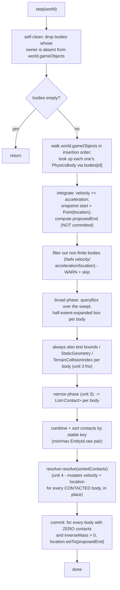

# Plan: `physics-system` — the `PhysicsSystem` orchestrator (unit 5 of 6)

> **Partly superseded — 2026-09-22, World Systems Implementation (issues #76–#80).** This plan's
> `PhysicsSystem` design is untouched and stays the reference shape for #49's re-plan, but it
> predates #49's reopening and is now provisional. What changed around it: the retired
> `WorldSystems` aggregator (unit 6) that this plan names as `PhysicsSystem`'s driver — §3.1's class
> KDoc ("see `WorldSystems`, `com.spartanlabs.gaming.world.system`"), the Level 3/4b/5 notes in the
> test plan, §8 "Provides to unit 6", §10 "Follow-up owed to unit 6" — is replaced by the
> `WorldSystem` registry on `World` (#76) plus a thin `PhysicsWorldSystem` adapter (#80,
> `docs/physics-world-system-plan.md`). The adapter occupies the library-reserved
> `CoreWorldSystemSlot.PHYSICS` slot and, on every `World.stepSystems()`, calls
> `world.reconcileSpatialIndex()` then `physicsSystem.step(world)`. #80 treats `step(world: World)`
> as a provisional contract and adapts if #49's re-plan changes it. Architecture:
> `docs/world-systems-implementation-architecture.md`.

## Header / Association

- **Covers:** [SpartanLabsGaming/MyGameTools#49](https://github.com/SpartanLabsGaming/MyGameTools/issues/49)
  — *"Phase 1: physics — motion integration + collision resolution (push-out / slide)"* (item 4
  of 5 in `docs/framework-vision-and-roadmap.md` §3 Phase 1). This plan covers **unit 5 of 6**
  only.
- **Architecture:** `docs/issue-49-physics-architecture.md`, unit slug `physics-system` (§10
  decomposition table, row 5; scope defined in §4.4, §4.7 hazards 2/3/4, §4.6's collider-order
  contract, §6 adoption verdicts, §8 stability tiers, §12 open decisions).
- **Branch:** `feature/49-physics-system`, off `master` (see §8 — **not** off any of units 2-4's
  branches; this plan assumes units 1-4 have already merged to `master` by the time this branch
  is cut, per the landing order in architecture §10).
- **Commit:** TBD
- **PR:** TBD — this plan document is committed together with the first commit of its
  implementation so `git log --follow` binds the two.
- **What this plans:** `PhysicsSystem` — the `entityId`-keyed body registry (`attach`/`detach`/
  `bodyFor`) and the single per-tick `step(world)` pipeline (integrate → broad phase → narrow
  phase → resolve → commit) that orchestrates units 2 (`Shape`/`PhysicsBody`/`Contact`), 3
  (narrow-phase detection, `TerrainCollisionIndex`), and 4 (`CollisionResolver`) into the one
  public entry point a `gametools-world` consumer calls. Also owns **documenting** (not
  code-fixing) the `Movement.Targeting` displacement limitation (architecture §4.7 hazard 2) in
  `PhysicsSystem`'s own KDoc.
- **Status:** planning only. No source, test, or build file has been modified by this document.
- **Target release:** `5.3.0`. **`5.2.0` has not been cut yet** (see §8) — this unit's commits
  land on `master` under `[Unreleased]` like every other unit ahead of it.
- **Dependencies:** units 1 (`physics-core-seams`), 2 (`physics-body-model`), 3
  (`physics-narrow-phase`), 4 (`physics-resolution`) — all four must be merged first. Unit 6
  (`world-systems`) depends on this one landing.
- **Related docs:** `docs/issue-49-physics-architecture.md` (§4.4, §4.6, §4.7, §6, §8, §10, §12);
  `docs/physics-core-seams-plan.md` (unit 1, settled — `SupportedExtension`,
  `World.reconcileSpatialIndex()`); unit plans for `physics-body-model`,
  `physics-narrow-phase`, `physics-resolution` are **not yet written** at the time of this
  plan (only unit 1's plan exists in `docs/` as of this writing) — this plan consumes their
  contracts exactly as given in the task's cross-unit-contract block and architecture §4.3/§4.5,
  and flags every place that block under-specifies a call shape this unit needs (§10).

---

## 1. Context

### 1.1 What exists today (verified against `master` @ `56ae9bc`)

- No `com.spartanlabs.gaming.world.physics` package exists anywhere in the repo yet (verified:
  `gametools-world/src/main/kotlin/com/spartanlabs/gaming/world/` has only `map/` and `zone/`).
  Units 2-4 have not landed; this plan is written against their *specified* contracts, not
  against code that exists.
- `World.reconcileSpatialIndex()` is still `internal fun` (`World.kt:258`) — unit 1's widening
  has not landed either. This plan assumes it lands first and is public by the time unit 5's
  branch is cut.
- `World.gameObjects: ArrayList<GameObject>` (`World.kt:67`) is insertion-ordered and is what
  `World.tick()`'s own step 4, `World.reconcileSpatialIndex()`, and `ZoneIndex.refresh`
  (`ZoneIndex.kt:40`) all iterate directly — **never** `world.spatialIndex`'s own iteration
  order, which `SpatialIndex.queryBox`/`queryRadius` document as "unspecified"
  (`SpatialIndex.kt:55,66`). This is the precedent §2.3 below builds the registry-iteration
  design on.
- `ZoneIndex` (`ZoneIndex.kt:18-69`) is the closest existing sibling to `PhysicsSystem`: a plain,
  concrete, `EntityId`-keyed-map-holding class (`private val indexed: MutableMap<EntityId,
  Pair<GameObject, Zone>> = HashMap()`, `ZoneIndex.kt:21`) with one bulk `refresh(world: World)`
  entry point that takes `World` as a **parameter**, never stores it, and self-cleans stale
  entries by diffing against `world.gameObjects` each call (`ZoneIndex.kt:57-61`: `(indexed.keys
  - current).forEach { ... }`). `PhysicsSystem`'s registry design in §2.3 mirrors this pattern
  directly rather than inventing a new one.
- `GameObject.entityId` is `internal set` (`GameObject.kt:59-60`), assigned once by `World.add`
  / `World.enrol` (`World.kt:163-170`), never reused (`EntityId.kt:33` / `:56` KDoc: "never
  reused for another"). `EntityId.UNASSIGNED == EntityId(0L)` (`EntityId.kt:50`).
- `TiledMap` (`TiledMap.kt:48-117`) is a plain `class`, no `equals`/`hashCode` override — default
  reference identity. `TerrainLayer` (`TerrainLayer.kt:16-45`) is immutable (no mutator, private
  defensive `.toList()` copies at lines 32-33).
- `com.spartanlabs.geometry.Point` (GeneralTools 2.2.0, decompiled from the cached
  `GeneralTools-2.2.0.jar` since no sources jar is present locally) extends `TwoDoubles`, which
  exposes **only mutating** `setTo(double,double)`, `setTo(TwoDoubles)`, `plusAssign`,
  `minusAssign`, `timesAssign`, `divAssign` — **no immutable `operator fun plus` that returns a
  new `Point`**. Every existing mover already works around this by mutating `location` in place
  (`Actor.kt:208,210,220`: `location.setTo(destination)`, `location += locmod`) — never by
  constructing `location + something`. This is a real, load-bearing fact for §2.4's design: a
  *proposed, not-yet-committed* position cannot be expressed as `location + velocity` (no such
  operator exists); it must be built as a fresh `Point(location.x + velocity.x, location.y +
  velocity.y)`.
- `Actor.movement` defaults to `Movement.Targeting`; `Movement.Targeting.step`
  (`Movement.kt:24-29`) latches `Actor.hasSettled` (`internal`, `Actor.kt:112`) on arrival and
  never re-checks position once latched. `Movement.Persistent` (`Movement.kt:35-37`) has no such
  latch and "resumes the approach whenever the actor is displaced." `Movement.Homing`
  (`Movement.kt:53-58`) re-points every tick, also latch-free. Verified directly against
  `master`, matching architecture §4.7 hazard 2 exactly.

### 1.2 Acceptance criteria for this unit

Restating the task's binding shape as concrete pass/fail conditions:

1. `PhysicsSystem(resolver: CollisionResolver = PositionalCorrectionResolver())` compiles with
   exactly `attach`, `detach`, `bodyFor`, `step` as specified in the task, in
   `com.spartanlabs.gaming.world.physics`.
2. A `VisibleObject` with no attached body has a bit-identical trajectory to today, whether or
   not a `PhysicsSystem` is in play elsewhere in the same `World` (the headline "eligible ≠
   subject" acceptance criterion, architecture §1.3 / constraint 3).
3. `attach` on a holder with `EntityId.UNASSIGNED` throws `IllegalArgumentException` via
   `require`, immediately, before any registry mutation.
4. `detach` on a holder with no attached body is a no-op — no exception, no log-level escalation
   beyond debug.
5. Two overlapping bodies separate; an `inverseMass == 0` body never moves, under any
   circumstance (own velocity included — see §2.4's step 6); a body cannot enter
   `StaticGeometry`; a body stops at non-walkable terrain and at map bounds; a fast body does not
   tunnel a thin wall (all delegated to units 3/4's math, exercised here through the full
   pipeline at Level 3).
6. `world.space == null` → body-vs-body only; a non-`TiledMap` `Space` → bounds enforced,
   `StaticGeometry`/terrain skipped, with the documented non-swept `isWalkable` fallback sample.
7. `gametools-core` gains nothing from this unit — every new type lives in `gametools-world`.
8. `PhysicsSystem`'s KDoc documents the `Movement.Targeting` displacement limitation and the
   attach-after-add precondition, per architecture §12 item 2 and §6's `Actor`/`Movement` row.

---

## 2. Design

### 2.1 Confirming the task's registry placement (point 1)

**Confirmed, with the reasoning made explicit.** The `entityId`-keyed body map is a `private`
field of `PhysicsSystem` itself — `PhysicsSystem` lives in `gametools-world`'s `world.physics`
package, so the map is physically never a field on any `gametools-core` type, satisfying the
constraint by construction rather than by convention. `PhysicsSystem` holds **no** `World`
reference as a field; `step(world: World)` receives it as a parameter and uses it only for the
duration of that one call, exactly mirroring `ZoneIndex.refresh(world: World)`'s own shape
(§1.1). This is the right design, not merely the specified one, for the reason the task states:
if `PhysicsSystem` cached a `World` from an earlier `attach` or a constructor argument, nothing
would stop a consumer from later calling `worldSystems.step()` (unit 6) against a *different*
`World` instance than the one `PhysicsSystem` remembered, silently splitting one game's physics
across two worlds with no compiler or runtime signal. Taking `world` fresh on every `step` call
makes "which world does this tick's physics apply to" a question with exactly one answer, chosen
by the caller of `step`, every time.

### 2.2 The `EntityId.UNASSIGNED` guard (point 2, hazard 3) — confirmed as `require`, justified

```kotlin
fun attach(
    holder: VisibleObject,
    shape: Shape = Shape.Aabb(holder.dimensions),
    inverseMass: Double = 1.0,
    restitution: Double = 0.0,
): PhysicsBody {
    require(holder.entityId != EntityId.UNASSIGNED) {
        "cannot attach a physics body to a VisibleObject with no EntityId - add it to a World " +
            "before attaching a physics body to it"
    }
    ...
}
```

**Why `require`, not `Result`, matching the repo's own precedent for this exact category of
error.** `TiledMap`'s constructor `init` block (`TiledMap.kt:56-63`) rejects a structurally
invalid map (`widthTiles <= 0`, mismatched terrain grid, duplicate spawn point names) the same
way: `require(...)`, immediately, at the point of misuse, for a condition that is entirely under
the *caller's* control and never varies with runtime data the caller doesn't already have in
hand. Attaching a body to an unenrolled `VisibleObject` is the same category: the caller decides
the call order (`world.add(holder)` then `physicsSystem.attach(holder, ...)`), the fix is
one-line and obvious ("add it first"), and there is nothing an `attach` caller could sensibly do
with a `Result.failure` here that `require`'s message doesn't already tell them directly — unlike
`TerrainLayer.terrainAt` (`TerrainLayer.kt:34-42`), whose out-of-range tile lookup is an
*operational* condition a caller (pathfinding, a raycast) can hit routinely from data it doesn't
fully control, and which correctly returns `Result.failure`. `ZoneIndex.refresh`'s own
skip-unassigned handling (`ZoneIndex.kt:41-42`: `if (id == EntityId.UNASSIGNED) return@forEach`)
is not a counter-precedent, for the reason architecture §4.7 hazard 3 already gives: that is a
**bulk scan** silently skipping whichever of *many* pre-existing world entities happen to be
unenrolled, not a single, explicit, named-object call a programmer just wrote — an
`attach(myUnit, ...)` failing loudly at the exact line that got the order wrong is strictly more
debuggable than the body silently never being registered and the bug surfacing three systems
later as "why doesn't my unit collide with anything."

### 2.3 The registry itself — mirroring `ZoneIndex`, not inventing a new shape

```kotlin
class PhysicsSystem(private val resolver: CollisionResolver = PositionalCorrectionResolver()) {

    /** Every attached body, keyed by its owner's [EntityId]. Never iterated directly in
     *  [EntityId]-unstable order - see [step]'s own iteration, which walks [World.gameObjects]. */
    private val bodies: MutableMap<EntityId, PhysicsBody> = HashMap()

    /** One [TerrainCollisionIndex] per encountered [TiledMap], built lazily and cached by
     *  reference (identity, matching [TiledMap] having no [equals]/[hashCode] override). A
     *  [WeakHashMap] - not a plain [HashMap] - so a [TiledMap] no longer referenced by any
     *  [World.space] (a level transition) can be collected along with its cached index instead
     *  of leaking for the lifetime of this [PhysicsSystem]. */
    private val terrainIndexes: MutableMap<TiledMap, TerrainCollisionIndex> = WeakHashMap()

    ...
}
```

`bodies` is a plain `HashMap`, matching `ZoneIndex.indexed`'s own choice (§1.1) — safe precisely
*because*, per §2.4, `step` never iterates `bodies.values` directly for anything
ordering-sensitive; it always walks `world.gameObjects` (insertion-ordered) and looks bodies up
by `EntityId`, the same discipline `ZoneIndex.refresh` and `World.reconcileSpatialIndex` already
use. `terrainIndexes` is new relative to any existing sibling (`ZoneIndex` has no analogous
per-map cache) — the `WeakHashMap` choice is this plan's own addition to architecture §4.6's
"cached by reference" instruction, closing a memory-hygiene gap the architecture doc does not
mention: a plain `HashMap<TiledMap, TerrainCollisionIndex>` would pin every `TiledMap` a
`PhysicsSystem` ever saw for the rest of the process's life, which matters for a long-running
game server that changes levels.

`attach`/`detach`/`bodyFor` on top of this map:

```kotlin
fun attach(
    holder: VisibleObject,
    shape: Shape = Shape.Aabb(holder.dimensions),
    inverseMass: Double = 1.0,
    restitution: Double = 0.0,
): PhysicsBody {
    require(holder.entityId != EntityId.UNASSIGNED) { /* §2.2 */ }
    val body = PhysicsBody(holder, shape, inverseMass, restitution)
    val replaced = bodies.put(holder.entityId, body)
    if (replaced != null) {
        log.warn(
            "PhysicsSystem.attach replaced an existing body for entityId {} - the previous " +
                "body's velocity/acceleration are discarded", holder.entityId,
        )
    } else {
        log.debug("PhysicsSystem attached a {} body to entityId {}", shape, holder.entityId)
    }
    return body
}

fun detach(holder: VisibleObject) {
    val removed = bodies.remove(holder.entityId)
    if (removed != null) log.debug("PhysicsSystem detached the body for entityId {}", holder.entityId)
    // no-op, no log, when absent - matches GameObject.removeBuff's own early-return-if-absent shape (GameObject.kt:184-185)
}

fun bodyFor(entityId: EntityId): PhysicsBody? = bodies[entityId]
```

**Re-attach behaviour (a design gap the architecture doc does not address, resolved here, not
escalated):** calling `attach` a second time for a holder that already has a body replaces it
rather than throwing — `Map.put`'s own natural semantics, matching `Actor.movement`'s setter
(`Actor.kt:122-127`, replace-and-reset-state, logged) rather than `TiledMap.addSpawnPoint`'s
reject-on-duplicate (`TiledMap.kt:113-115`). Replace, not reject, because a body's fields
(`shape`, `inverseMass`, `restitution`) are exactly the kind of thing a consumer legitimately
wants to swap on a live entity (an item pickup that changes an actor's mass, a shape change on
armour break) and a `PhysicsBody`'s `owner` is immutable per unit 2's own design, so there is no
`owner` mismatch risk requiring rejection. Logged at `WARN` (not `DEBUG`) specifically because
the previous body's `velocity`/`acceleration` — genuinely live simulation state, not just
configuration — are silently discarded, which a consumer swapping *only* `shape` might not
intend; the log line exists so that surprise is at least visible in the log stream rather than
purely silent.

**Error handling summary for this trio:**
- `attach`: `IllegalArgumentException` via `require` for the one programmer-error precondition
  (§2.2); otherwise always succeeds and returns the new `PhysicsBody` — no `Result`, matching
  `TiledMap`'s constructor precedent exactly.
- `detach`: never fails; always returns `Unit`.
- `bodyFor`: never fails; returns `PhysicsBody?`, matching `ZoneIndex.zoneOf`'s own
  `Zone?`-returning shape (`ZoneIndex.kt:65`) for "look up by id, `null` if not tracked."

### 2.4 The `step(world: World)` pipeline — the orchestration this unit exists to write

**`step` is a bulk, per-frame operation and returns `Unit`, per the task's own scoping rule.**
Contrast `Movement.step(actor): Result<Unit>` (`Movement.kt:18`), which is per-entity and whose
one caller, `Actor.move()` (`Actor.kt:195`), is itself called from `Actor.onUpdate()`
(`Actor.kt:186-192`), which **swallows** the failure into a log line
(`move().onFailure { cause -> log.error(...) }`) rather than propagating it — a single actor's
bad `Point` never aborts the rest of that actor's tick, let alone the world's. `PhysicsSystem.step`
is one level up: it is `World.tick()`'s and `ZoneIndex.refresh`'s peer, not `Movement.step`'s —
both of those return `Unit` and internally skip-and-log rather than fail-and-propagate (`World.tick`
has no failure path at all; `ZoneIndex.refresh` skips an unenrolled entity per-iteration,
`ZoneIndex.kt:41-42`, without any `Result` anywhere in its signature). One anomalous body (a NaN
velocity a consumer wrote directly into `body.velocity.x`, or - defensively, see below - a
degenerate shape) must not blank out an entire frame's physics for every other body in the
world; it is dropped from that tick's integration with a `WARN` log line, exactly as `World.tick`
would rather crash the frame than one bad `GameObject`... except `World.tick` in fact has no
such guard today, because nothing in `core` can produce a NaN through public API the way a
directly-mutated `Point.x`/`Point.y` (no validating setter, confirmed §1.1) can here.



**Step-by-step, with the exact fill-in this plan is responsible for where architecture §4.4's
prose leaves a gap (flagged individually, not silently resolved):**

1. **Self-clean (new relative to architecture §4.4's six listed steps — this plan's own
   addition, mirroring `ZoneIndex.refresh`'s exact pattern, `ZoneIndex.kt:57-61`).** Build
   `val present = world.gameObjects.mapTo(HashSet(), GameObject::entityId)`, then
   `bodies.keys.retainAll(present)`, logging at `DEBUG` how many stale entries were dropped (`0`
   the overwhelmingly common case, logged lazily). Without this, a consumer who removes a
   `GameObject` from a `World` (adds it to `removeList`) but forgets a matching
   `physicsSystem.detach(holder)` leaks that entry in `bodies` for the life of the
   `PhysicsSystem` — see §7 for the tradeoff this introduces, and §10 Open Decision 1 for why
   this is flagged rather than silently shipped.
2. **Deterministic iteration order (fills a gap architecture §4.4 leaves implicit).** Build the
   tick's working list by walking `world.gameObjects` — **not** `bodies.values`, whose `HashMap`
   iteration order is unspecified and would silently reintroduce exactly the
   `SpatialIndex.queryBox`-style nondeterminism the whole Jacobi-not-Gauss-Seidel design (research
   finding 1, architecture §2 item 1) exists to eliminate, one level earlier than the contact
   list itself:
   ```kotlin
   val moving: List<PhysicsBody> = world.gameObjects.asSequence()
       .filterIsInstance<VisibleObject>()
       .mapNotNull { obj -> bodies[obj.entityId] }
       .toList()
   ```
3. **Integrate + snapshot (architecture §4.4 step 1, made concrete against the `Point`/
   `TwoDoubles` fact in §1.1).** For each body in `moving`: `body.velocity += body.acceleration`
   (in-place, `TwoDoubles.plusAssign`). Snapshot `val start = Point(body.owner.location)` (a
   **copy**, via `Point`'s copy constructor — never an alias, matching `VisibleObject
   .lastIndexedLocation`'s own "value snapshot, not a reference" discipline,
   `VisibleObject.kt:108-113`) *before* anything writes to `owner.location` this tick, and
   compute `val proposedEnd = Point(start.x + body.velocity.x, start.y + body.velocity.y)` — a
   **new** `Point`, never `owner.location` itself. **`owner.location` is not touched by this
   step or by step 4/5's narrow phase — see §10 Open Decision 2 for why the final commit is
   deferred to step 7, and to whom.**
4. **Non-finite guard (new — the "skip one anomalous body" contract the task assigns this
   unit).**
   ```kotlin
   private fun PhysicsBody.isFinite(): Boolean =
       velocity.x.isFinite() && velocity.y.isFinite() &&
       acceleration.x.isFinite() && acceleration.y.isFinite() &&
       owner.location.x.isFinite() && owner.location.y.isFinite()
   ```
   A body failing this is logged at `WARN` (`"PhysicsSystem skipping entityId {} this tick: " +
   "non-finite velocity/acceleration/location"`) and excluded from every later step **for this
   tick only** — it is not detached, so a consumer that later corrects the bad value (or a stray
   one-tick NaN from an unrelated bug) sees the body resume normally next tick. **On "degenerate
   shape":** unit 2's `Shape.Circle`/`Shape.Aabb` are stated to validate strictly-positive
   extent at construction (architecture §4.3, §4.6's diagonal-policy reasoning explicitly leans
   on this being an enforced invariant) — if that validation is genuinely construction-time and
   throwing, a degenerate `Shape` can never reach a live `PhysicsBody.shape` in the first place,
   making a runtime "degenerate shape" guard here dead code under the *current* contract. This
   plan does not add one for that reason, and flags the testing-standard's explicit call for
   "degenerate shape" skip coverage as **only reachable via `PhysicsBody.shape`'s own construction
   failing before `attach` ever calls it** — see §5's Level 2 test for how this is actually
   exercised (a construction-time `IllegalArgumentException`, not a `step`-time skip).
5. **Broad + narrow phase (architecture §4.4 steps 2-3, §4.6's collider ordering).** Per body in
   the finite-filtered `moving` list:
   - Compute the swept, half-extent-expanded query box from `start`/`proposedEnd` and
     `body.shape`'s half-extent (see §10 Open Decision 3 — the exact half-extent helper's home is
     flagged, not invented twice).
   - `world.spatialIndex.queryBox(minX, minY, maxX, maxY)`, filter out `body.owner` itself and
     anything without an attached body via `bodyFor`, per constraint 3's "eligible ≠ subject"
     applied at the query boundary (architecture §4.4 step 2, verbatim).
   - Resolve this tick's environment sources once: `val space = world.space`, `val bounds =
     space?.bounds`, `val map = space as? TiledMap`, `val staticGeometry = map?.staticGeometry`,
     `val terrainIndex = map?.let(::terrainIndexFor)` — see §2.5 for the fail-soft rule these
     feed.
   - Call into unit 3's narrow-phase entry point with `(body, start, proposedEnd, candidateBodies,
     bounds, staticGeometry, terrainIndex)` in the collider order architecture §4.6 fixes (bounds
     → `StaticGeometry` → `TerrainCollisionIndex` → other bodies), collecting whatever
     `List<Contact>` it returns — **this call shape is this plan's own assumption about unit 3's
     public surface into `world.physics`; flagged explicitly in §10 Open Decision 4, since
     architecture §4.6 describes the *math* in prose but never names a callable function this
     unit is meant to invoke.**
6. **Sort (architecture §4.4 step 4).**
   ```kotlin
   private fun Contact.sortKey(): Pair<Long, Long> {
       val aId = a.owner.entityId.raw
       val bId = b?.owner?.entityId?.raw ?: -1L   // every real id is >= 1 (World.enrol starts at 1)
       return minOf(aId, bId) to maxOf(aId, bId)
   }
   val sorted = contacts.sortedBy { it.sortKey() }
   ```
   `-1L` is a safe, fixed tie-break for an environment contact because no attached body's owner
   can ever carry a non-positive `raw` id (§2.2's guard forbids `UNASSIGNED`, and `World`'s own
   allocator starts at `1`, `World.kt:127,165`) — so this key groups every environment contact
   ahead of every body-body contact, globally ordered by the lower involved id, with
   `sortedBy`'s documented **stability** preserving each body's own bounds → geometry → terrain
   sub-order from step 5 as a free secondary tie-break, with no extra field needed on `Contact`
   itself.
7. **Resolve (architecture §4.4 step 5).** `resolver.resolve(sorted)` — one call, over the
   tick's full contact set, exactly as specified. Per unit 4's contract (architecture §4.5), this
   call is expected to mutate `velocity` and `owner.location` **in place**, starting from each
   contacted body's *current* `owner.location` — which, per step 3, is still the pre-tick
   position, since nothing before this point has written to it. **This ordering — resolver reads
   and writes from the pre-tick position, not from `proposedEnd` — is this plan's own resolution
   of an ambiguity in architecture §4.4's ("compute, not yet commit... nothing further to flush")
   phrasing; flagged in full in §10 Open Decision 2, since unit 4's own plan must agree the
   resolver's base position is pre-tick `owner.location`, not a PhysicsSystem-precommitted
   proposal.**
8. **Commit (architecture §4.4 step 6, this plan's concrete completion of it).** A body that
   appears in **zero** contacts this tick was never touched by step 7 at all — `resolver.resolve`
   only ever sees bodies named in `sorted`. For every such body, *and* only if `inverseMass >
   0.0`, `PhysicsSystem` itself commits the free-motion result: `body.owner.location.setTo(
   proposedEnd)` (via `TwoDoubles.setTo`, matching `Actor.stepTowardsDestination`'s own
   `location.setTo(destination)`, `Actor.kt:208`). **An `inverseMass == 0.0` body is excluded
   from this commit unconditionally, regardless of its own velocity** — this is what makes
   "`inverseMass == 0` never moves" (the task's literal acceptance criterion) hold even for a
   free body with no contact to speak of; unit 4's own degenerate-case guard (architecture §4.5:
   "skips correction" when both sides of a contact are immovable) only covers a *contacted*
   immovable body, so an uncontacted one is squarely this step's responsibility, not the
   resolver's.

### 2.5 The `Space`/`TiledMap` fail-soft rule (point 5, hazard 4) — restated concretely

```kotlin
val space = world.space
val bounds: Square? = space?.bounds                     // any Space - generic
val map = space as? TiledMap
val staticGeometry: StaticGeometry? = map?.staticGeometry
val terrainIndex: TerrainCollisionIndex? = map?.let(::terrainIndexFor)
```

- `space == null` → `bounds`, `staticGeometry`, `terrainIndex` all `null` → the narrow phase
  (unit 3) is called with no environment sources at all, so only body-vs-body contacts can ever
  be produced this tick — matching `Space`'s own "unbounded plane" default (`Space.kt:14-16`).
- `space` non-null, not a `TiledMap` → `bounds` is populated (works against *any* `Space`,
  generically), `staticGeometry`/`terrainIndex` are `null`. **This plan's concrete reading of the
  documented non-swept fallback** (architecture §4.7 hazard 4's last sentence: "a cheap
  non-swept `Space.isWalkable(point)` sample at the proposed end position as a partial
  (non-tunnel-proof) fallback for terrain"): after the swept narrow phase runs (bounds-only,
  since `staticGeometry`/`terrainIndex` are absent), `PhysicsSystem` additionally samples
  `space.isWalkable(proposedEnd)` for each moving body; if `false`, that body is **excluded from
  step 8's free-motion commit for this tick only** (it simply stays at its pre-tick position,
  rather than being pushed out or slid along a normal-less synthetic contact — deliberately
  weaker and explicitly non-swept, exactly as the architecture's own "non-tunnel-proof" framing
  promises: a fast body can still skip past the sampled point undetected, and this fallback does
  not pretend otherwise). This is this plan's own concrete mechanics for a fallback the
  architecture only sketches in one sentence — no `Contact` is fabricated for it (a synthetic
  environment `Contact` would need a `normal`, and a point sample gives none), so it never
  touches unit 4's resolver at all; it is a `PhysicsSystem`-local, resolver-bypassing clamp.
- `map` is a real `TiledMap` → the full pipeline (bounds, `StaticGeometry`, cached
  `TerrainCollisionIndex`) runs exactly as architecture §4.6 specifies, with no fallback needed.

### 2.6 `TerrainCollisionIndex` caching — this unit's responsibility per the architecture's own diagram

Architecture §5's interaction diagram states the edge explicitly: `Phys -- "builds/caches per
map" --> Terrain` — `PhysicsSystem`, not `TerrainCollisionIndex` itself nor unit 3's own code,
owns the lazy-build-and-cache. Unit 3 owns the class and its preprocessing algorithm; this unit
owns *when* an instance is constructed and *how long* it lives:

```kotlin
private fun terrainIndexFor(map: TiledMap): TerrainCollisionIndex =
    terrainIndexes.getOrPut(map) { TerrainCollisionIndex(map.terrain, map.tileSize) }
```

**The exact constructor parameters (`TerrainLayer`, and whether `tileSize` is also needed to
produce world-coordinate `CenteredBox` regions) are this plan's own assumption about unit 3's
public/internal surface — flagged in §10 Open Decision 4 alongside the narrow-phase call shape,
since both come from the same not-yet-written unit 3 plan.**

### 2.7 Adoption verdicts (architecture §6), restated concretely for this unit

- **`Alive` is the primary intended consumer.** No `Alive`-specific code exists in
  `PhysicsSystem` — an `Alive` is eligible exactly because it is a `VisibleObject`, and becomes a
  subject only once a consumer calls `attach(myAliveUnit, ...)`. Nothing in this unit special-cases
  `Alive`.
- **`Movement.Persistent` and `Movement.Homing` compose with physics for free** — both re-derive
  their step from the actor's *current* `location` every tick (`Movement.kt:36`, `:55-56`), so a
  physics-displaced actor using either resumes toward its destination on its own next `Actor.tick`,
  no `PhysicsSystem` cooperation needed.
- **`Movement.Targeting` has the documented displacement limitation** (§3's KDoc, §1.1's
  restatement of architecture §4.7 hazard 2) — **no code addresses it in this unit**, by design.
  `PhysicsSystem` never reads or writes `Actor.hasSettled`, never touches `Actor`/`Movement` at
  all beyond the `owner.location` mutation every existing mover already performs.
- **Projectiles do not adopt.** `DirectionalProjectile`/`HomingProjectile`/`Projectile` are
  structurally unaffected by this unit — a consumer *can* already opt one into physics today by
  calling `physicsSystem.attach(myProjectile, ...)` (a `Projectile` **is** a `VisibleObject`),
  but nothing in this plan does that, tests that path as a first-class feature, or changes
  `Projectile`'s own discrete damage test. This plan's own component tests (§5) exercise `attach`
  only against plain `VisibleObject` and `Actor` fixtures, not a `Projectile` subtype, to avoid
  implying a level of support this unit does not actually provide.
- **Plain `VisibleObject` scenery is eligible but opt-in** — `attach`'s signature takes
  `VisibleObject`, not `Actor`, precisely so a non-`Actor` prop can be given a body (e.g. a
  pushable crate); nothing about this unit assumes an `Actor`.
- **Static level geometry stays in `StaticGeometry`.** This unit only *reads*
  `TiledMap.staticGeometry` (§2.4 step 5); it adds no provider seam, no mutation API, matching
  architecture constraint 6 and its own §6 "in scope now: none" verdict for `TiledMap`/
  `StaticGeometry`.

---

## 3. File-by-file changes

### 3.1 New: `gametools-world/src/main/kotlin/com/spartanlabs/gaming/world/physics/PhysicsSystem.kt`

The only production file this unit adds. Full class per §2.3/§2.4, with KDoc carrying:

```kotlin
/**
 * The entry point for `gametools-world` physics: attaches [PhysicsBody]s to [VisibleObject]s
 * already owned by a [World], and advances every attached body one tick at a time via [step].
 *
 * [PhysicsSystem] holds no [World] reference of its own - [step] takes one as a parameter, used
 * only for the duration of that call, so a driver that calls [step] against the wrong [World]
 * gets exactly that [World]'s objects moved, with no ambiguity about which world "the" physics
 * belongs to. Call [step] once per frame, immediately after
 * [World.reconcileSpatialIndex] (see `WorldSystems`, `com.spartanlabs.gaming.world.system`) - not
 * from inside [World.tick] itself.
 *
 * ### Known limitation: [Movement.Targeting] and displacement
 *
 * An [Actor] using the default [Movement.Targeting] that physics displaces *after* it has
 * already reached its destination stays displaced - `Targeting` only re-evaluates on a fresh
 * [Actor.destination] assignment or a [Actor.movement] change, and physics does not, and will
 * not, reach into that latch. A consumer that wants an actor to walk back after being jostled
 * assigns [Movement.Persistent] instead, which already re-derives its approach from the actor's
 * current position every tick and composes with this system for free; so does [Movement.Homing].
 * See `docs/issue-49-physics-architecture.md` §4.7 hazard 2 for the full reasoning, including why
 * this is documented rather than worked around, and `docs/api-openness-decisions-6.0.0.md` D1 for
 * where the real fix lands (`6.0.0`'s `Movement` refactor).
 *
 * @param resolver the collision-resolution policy this system delegates to once per [step];
 *   defaults to [PositionalCorrectionResolver]. Substitutable per [CollisionResolver]'s own
 *   [SupportedExtension] contract.
 */
class PhysicsSystem(private val resolver: CollisionResolver = PositionalCorrectionResolver()) {

    /**
     * Attaches a [PhysicsBody] to [holder], keyed by its [VisibleObject.entityId]. [holder] must
     * already belong to a [World] - [World.add] assigns the id this registry keys on.
     *
     * Calling this again for a [holder] that already has a body **replaces** it; the previous
     * body's [PhysicsBody.velocity]/[PhysicsBody.acceleration] are discarded (logged at `WARN`).
     *
     * @param holder the object to attach a body to; eligible the moment it is [World]-owned,
     *   but not a physics *subject* until this call - an unattached [VisibleObject] is untouched
     *   by [step]
     * @param shape the body's collider footprint; defaults to an [Shape.Aabb] matching [holder]'s
     *   own [VisibleObject.dimensions]
     * @param inverseMass the body's inverse mass; `0.0` means immovable - see [step]'s own commit
     *   rule, which never moves such a body regardless of its velocity
     * @param restitution this body's own bounciness, `0.0..1.0`, combined with a contact
     *   partner's per [CollisionResolver]'s own policy
     * @return the newly attached [PhysicsBody]
     * @throws IllegalArgumentException if [holder]'s [VisibleObject.entityId] is
     *   [EntityId.UNASSIGNED] - add [holder] to a [World] first
     */
    fun attach(
        holder: VisibleObject,
        shape: Shape = Shape.Aabb(holder.dimensions),
        inverseMass: Double = 1.0,
        restitution: Double = 0.0,
    ): PhysicsBody { /* §2.3 */ }

    /**
     * Detaches [holder]'s body, if any. A no-op - no exception, no state change - if [holder]
     * has none.
     *
     * @param holder the object whose body to remove
     */
    fun detach(holder: VisibleObject) { /* §2.3 */ }

    /**
     * The body currently attached to [entityId], or `null` if none - either it was never
     * attached, it was [detach]ed, or its owner is no longer present in the [World] most
     * recently passed to [step] (see [step]'s own self-cleaning pass).
     *
     * @param entityId the entity to look up
     */
    fun bodyFor(entityId: EntityId): PhysicsBody? = bodies[entityId]

    /**
     * Advances every attached body by one tick against [world]: integrates velocity, detects
     * this tick's contacts (other bodies, [world]'s bounds, and - when [world]'s [World.space] is
     * a [TiledMap] - its [StaticGeometry] and terrain), delegates resolution to the constructor
     * -injected [CollisionResolver], and commits final positions by mutating [GameObject.location]
     * in place, the same idiom every other mover already uses. See the class doc for what this
     * does and does not do to a [Movement.Targeting] actor.
     *
     * Never throws for an operational condition: a body whose velocity/acceleration/location has
     * gone non-finite is logged at `WARN` and skipped for this tick only, so one bad body cannot
     * blank out an entire frame's physics for everything else attached.
     *
     * @param world the world to step; not retained past this call
     */
    fun step(world: World) { /* §2.4 */ }
}
```

**Mutability:** `bodies`/`terrainIndexes` are private mutable maps, never exposed; every public
accessor (`bodyFor`) returns an immutable snapshot value (`PhysicsBody?`) or `Unit`. `resolver` is
a `val` constructor parameter - the one substitutable policy, never reassigned after
construction (no setter), matching `PhysicsSystem`'s own "concrete, not itself substitutable"
stability-tier verdict (architecture §8).

**Concurrency:** single-threaded, by the same convention every other `gametools-world`/
`gametools-core` type already assumes (`World`'s own "one thread drives it," `TiledMap.kt:33-36`).
No new synchronization is added; calling `attach`/`detach`/`step` from multiple threads
concurrently is a programmer error, not a condition this class defends against - consistent with
`ZoneIndex`'s and `World`'s own silence on the matter.

**Logging (new lifecycle events this unit introduces, all slf4j, all through the shared
`world.physics` logger):**

| Event | Level | Where |
|---|---|---|
| Body attached | `DEBUG` | `attach`, no prior body for that id |
| Body replaced | `WARN` | `attach`, a prior body existed (velocity/acceleration discarded) |
| Body detached | `DEBUG` | `detach`, a body was present |
| Stale bodies pruned | `DEBUG` (count only; silent when `0`) | `step`, self-clean pass |
| Anomalous body skipped | `WARN`, per body | `step`, non-finite guard |
| Step summary | `DEBUG` (bodies moved / contacts resolved, counts) | `step`, end of pipeline - mirrors `World.tick`'s own `"World tick: advancing {} game object(s)"` pattern (`World.kt:224`) |

### 3.2 New (same package): `internal fun Shape.halfExtents(): Dimensions` — home flagged, not decided unilaterally

`PhysicsSystem`'s own broad-phase box math (§2.4 step 5) needs a `Shape -> Dimensions`
half-extent conversion (`Circle(radius)` → `Dimensions(radius, radius)`, `Aabb(dimensions)` →
`Dimensions(dimensions.width / 2, dimensions.height / 2)`). **This plan does not commit this
function to `PhysicsSystem.kt` outright** - see §10 Open Decision 3: unit 3's narrow phase almost
certainly needs the exact same conversion for its own overlap/MTV pre-check (architecture §4.6),
and duplicating it in two files is the kind of drift this plan should not introduce
unilaterally. **Working assumption for this plan's own file list:** if unit 3's plan (not yet
written) does not already expose such a helper from `Shape.kt` or its own narrow-phase file,
`PhysicsSystem.kt` adds a small `private fun Shape.halfExtents(): Dimensions` local to itself as
a fallback, with a `// TODO:` region-tagged inline comment pointing at this open decision so a
later consolidation is easy to find.

### 3.3 Test files (new) — see §5 for the full per-level breakdown and rationale

- `gametools-world/src/test/kotlin/com/spartanlabs/gaming/testing/component/world/physics/PhysicsSystemAttachDetachTest.kt`
- `gametools-world/src/test/kotlin/com/spartanlabs/gaming/testing/component/world/physics/PhysicsSystemStepOptInTest.kt`
- `gametools-world/src/test/kotlin/com/spartanlabs/gaming/testing/component/world/physics/PhysicsSystemFailSoftTest.kt`
- `gametools-world/src/test/kotlin/com/spartanlabs/gaming/testing/integration/world/physics/PhysicsSystemWorldIntegrationTest.kt`
- `gametools-world/src/test/kotlin/com/spartanlabs/gaming/testing/deterministic/world/physics/PhysicsSystemOrderingDeterminismTest.kt`
- `gametools-world/src/test/kotlin/com/spartanlabs/gaming/testing/nonfunctional/world/physics/PhysicsSystemThroughputTest.kt`

All new packages (`world/physics` does not yet exist under any test-level directory in
`gametools-world`); one class per file per the repo's own rule.

### 3.4 Changed: `README.md`

Only this unit's own surface, per architecture §10's per-unit-documents-its-own-surface rule (the
cross-cutting Architecture/Features physics prose is explicitly unit 6's job, not this one's).
Add `PhysicsSystem` to the Modules table's `world` row (line 149) package list, and one bullet
under a (new, if not already added by units 2-4) `### ⚙️ Physics` Features section naming
`PhysicsSystem`'s `attach`/`detach`/`bodyFor`/`step` shape and the `Movement.Targeting`
limitation in one sentence, cross-referencing the fuller KDoc. If units 2-4 have already added
this section by the time this branch is cut, this unit appends to it rather than creating a
second one.

### 3.5 Changed: `CHANGELOG.md`

One `[Unreleased]` → `### Added` entry, per architecture §10's "every unit carries its own
CHANGELOG entry" rule:

```markdown
- `PhysicsSystem` (`com.spartanlabs.gaming.world.physics`) - the physics orchestrator:
  `attach`/`detach`/`bodyFor` register a `PhysicsBody` against a `VisibleObject` already owned by
  a `World` (keyed by `EntityId`, guarded against an un-enrolled holder), and `step(world)` runs
  one tick's integrate -> broad-phase -> narrow-phase -> resolve -> commit pipeline, delegating
  resolution to an injected `CollisionResolver` (`PositionalCorrectionResolver` by default). An
  unattached `VisibleObject` is unaffected - opt-in, not automatic. Fails soft when `World.space`
  is absent or not a `TiledMap` (body-vs-body only, or bounds-only respectively). A
  `Movement.Targeting` actor displaced after settling stays displaced by design - use
  `Movement.Persistent` for push-back; see the KDoc. (#49)
```

---

## 4. Documentation impact (Audience-Reach rings)

- **Inner Core:** the one `// TODO:`-tagged region flagging §10 Open Decision 3's half-extent
  helper placement (§3.2), plus the repo's standard import-region comments in the new file.
- **Component Ring (KDoc):** the primary ring. Full KDoc on `PhysicsSystem` and all four members
  per §3.1, including the `Movement.Targeting` limitation and the attach-after-add precondition
  verbatim in the class doc, per the task's explicit requirement. Must render cleanly under
  `./gradlew dokkaGeneratePublicationHtml`.
- **Boundary Ring:** not touched — no wire format, no protocol change.
- **Architectural Outer Layer:** `docs/issue-49-physics-architecture.md` already documents this
  unit's design; no update owed to it by this unit specifically (unit 6 owns the §7 roadmap
  corrections and the umbrella physics prose per architecture §10).
- **README currency:** updated in this unit's own commit (§3.4), per the global README rule and
  architecture's explicit per-unit convention.

---

## 5. Test plan (5-level hierarchy)

Convention note, matching unit 1's own finding (`docs/physics-core-seams-plan.md` §6): this
repo's actual test stack is **`kotlin.test` on the JUnit 5 platform**, not MockK — no module
depends on MockK today. Where the global standard calls for mocking `CollisionResolver` at Level
2, this plan uses a small, hand-written test-local fake implementing `CollisionResolver`
(recording the `List<Contact>` it was called with, or applying a trivial no-op/known
transformation) rather than introducing MockK as a new dependency for one interface with a
single-method contract — consistent with how the repo already tests its other injected-interface
seams (`SpatialIndex` implementations are tested directly, not mocked).

### Level 1 — gating

No `com.spartanlabs.gaming.testing.gating` package exists anywhere in this repo (verified,
matching unit 1's own finding). Per the established convention, Level 1 for this unit is
`./gradlew componentTest deterministicTest` before every push, using the Level 2/4a tests below —
no separate checked-in artifact.

### Level 2 — component

`gametools-world/src/test/kotlin/com/spartanlabs/gaming/testing/component/world/physics/` (new
package, mirroring the new `world.physics` production package):

- **`PhysicsSystemAttachDetachTest.kt`**
  - `attach` on a holder with `EntityId.UNASSIGNED` throws `IllegalArgumentException`.
  - `attach` on a `World`-added holder succeeds and `bodyFor` returns it.
  - `attach` twice on the same holder replaces the body (new instance returned by `bodyFor`
    afterward; the old instance's later mutation does not affect the world).
  - `detach` on an attached holder removes it (`bodyFor` afterward is `null`).
  - `detach` on a never-attached holder is a no-op (no exception).
  - `PhysicsBody.shape` defaults to `Shape.Aabb(holder.dimensions)` when omitted, and reflects a
    caller-supplied `Shape.Circle` when given.
- **`PhysicsSystemStepOptInTest.kt`** — the headline acceptance criterion:
  - A `VisibleObject` (and, separately, an `Actor` using each of `Movement.Targeting` /
    `Persistent` / `Directional` / `Homing`) that is **never** `attach`ed to a `PhysicsSystem`
    produces a bit-identical trajectory across N ticks whether or not a `PhysicsSystem.step(world)`
    call runs alongside `world.tick()` every frame - asserted by comparing two otherwise-identical
    `World`s driven for the same N ticks, one with a `PhysicsSystem.step` call interleaved and one
    without, both containing only unattached objects.
  - An `inverseMass == 0.0` attached body's `owner.location` is unchanged after `step`, even when
    its `velocity`/`acceleration` are non-zero and it has zero contacts (exercises §2.4 step 8's
    guard directly, in isolation from any resolver behaviour).
  - Two overlapping `inverseMass > 0` bodies separate after one `step` call (uses the real
    default `PositionalCorrectionResolver` from unit 4, or the hand-written fake resolver to
    isolate `PhysicsSystem`'s own orchestration from unit 4's actual math - both variants
    included, since they test different things: the fake proves `PhysicsSystem` calls `resolve`
    with the right contact set and commits correctly for uncontacted bodies; the real resolver
    proves the end-to-end default behaviour).
  - A body with velocity and zero contacts is committed to its free-motion `proposedEnd`
    (exercises §2.4 step 8's non-immovable branch).
  - A body with a non-finite `velocity.x` is skipped for that tick (no exception, `owner.location`
    unchanged, `WARN` logged) and resumes normally the following tick once corrected.
  - Attaching a body constructs it via `PhysicsBody`'s own validated constructor (unit 2's
    contract) - this test file also exercises **"degenerate shape"** indirectly: `attach(holder,
    shape = Shape.Aabb(Dimensions(0.0, 0.0)))` throws at construction time (unit 2's own
    guarantee), before `PhysicsSystem` ever holds a reference to it - documenting, per §2.4 step
    4, that this is where "degenerate shape" is actually caught, not in `step`.
- **`PhysicsSystemFailSoftTest.kt`**
  - `world.space == null` → two attached bodies still separate on overlap (body-vs-body still
    runs); a body is free to cross what would be a `TiledMap`'s bounds (no bounds enforced at
    all).
  - `world.space` set to a minimal hand-written `Space` (not a `TiledMap`) with a fixed `bounds`
    and `isWalkable` → a body is stopped at `bounds`; a body moving into a region where
    `isWalkable` returns `false` is not committed past its pre-tick position that tick (the
    documented non-swept fallback, §2.5); `StaticGeometry`/terrain are never queried (the fake
    `Space`'s `isWalkable`/`contains` call counts, if tracked, are exactly what the fail-soft rule
    predicts - no cast to `TiledMap` succeeds).
  - A real `TiledMap` → bounds, `StaticGeometry`, and (indirectly, since unit 3 owns its
    internals) terrain are all enforced; a `TerrainCollisionIndex` is built exactly once per
    distinct `TiledMap` instance across repeated `step` calls (asserted via a call-count on a
    test-local subclass point, or by asserting identical narrow-phase results across many ticks
    with no observable rebuild cost - whichever unit 3's actual `TerrainCollisionIndex` shape
    makes practical once its plan exists).

### Level 3 — integration

`gametools-world/src/test/kotlin/com/spartanlabs/gaming/testing/integration/world/physics/PhysicsSystemWorldIntegrationTest.kt`
— drives a **real** `World` + real `TiledMap` (built from `MapLoader`/`MapDefinition`, matching
`MapLoaderIntegrationTest`'s own existing convention in the sibling `map` package) for N ticks:

- A body walking at high speed toward a thin `StaticGeometry` wall for enough ticks to have
  tunnelled under a naive discrete-only check never ends up on the far side or inside the
  obstacle (the tunnelling acceptance criterion, exercised end-to-end rather than unit-testing
  unit 3's slab math in isolation).
- A body walking off the walkable region of a real `TerrainLayer` stops at the boundary and does
  not cross into non-walkable terrain over N ticks.
- A body pushed by another body's overlap across a `TiledMap`'s bounds is clamped to bounds, not
  ejected outside them.
- `World.reconcileSpatialIndex()` (now public, per unit 1) is called once immediately before each
  `PhysicsSystem.step(world)` in this test's own driving loop, mirroring what `WorldSystems`
  (unit 6) will do — this test is this unit's own proof that the public widening unit 1 shipped
  is actually usable from `gametools-world`, closing the gap unit 1's own plan flagged as
  untestable from inside `gametools-core` (`docs/physics-core-seams-plan.md` §6).

### Level 4a — deterministic

`gametools-world/src/test/kotlin/com/spartanlabs/gaming/testing/deterministic/world/physics/PhysicsSystemOrderingDeterminismTest.kt`
— the ordering-independence property the whole Jacobi design (research finding 1) exists to
guarantee, made concrete for this unit specifically:

- Running the same fixed scenario (same seed, same bodies, same starting positions/velocities)
  for N ticks produces byte-identical final positions whether `world.spatialIndex` is a
  `QuadtreeSpatialIndex` or a `UniformGrid` — directly exercising that `step`'s own
  `world.gameObjects`-ordered iteration (§2.4 step 2) and stable contact sort (§2.4 step 6) make
  the result independent of `queryBox`'s documented "unspecified order," regardless of which
  `SpatialIndex` implementation produced the candidates.
- Re-running the identical scenario twice in the same process produces identical results (basic
  determinism, no hidden time-based or hash-based nondeterminism).

### Level 4b — e2e

Not applicable to this unit specifically — a full client↔server flow through `gametools-net` is
out of scope for `gametools-world`'s own physics orchestration. No test added; unit 6's
`WorldSystems` is the more natural home for any full-stack physics e2e coverage, if one is ever
wanted.

### Level 4c — non-functional

`gametools-world/src/test/kotlin/com/spartanlabs/gaming/testing/nonfunctional/world/physics/PhysicsSystemThroughputTest.kt`
— matching `WorldTickThroughputTest`'s and `SpatialIndexScalabilityTest`'s own existing
conventions in `gametools-core`: ~2,000 attached bodies in a `World` of ~10,000 total entities
(matching architecture §11's stated target), each `step(world)` call (preceded by
`world.reconcileSpatialIndex()`) measured to complete within the 10-20 Hz per-frame budget
(50-100ms) architecture §11 names, across a representative mix of free motion and overlapping
contacts. Not a correctness gate — a regression trip-wire, run under `nonfunctionalTest` (Level
4c's own Gradle task), not on every push.

### Level 5 — UAT

No `com.spartanlabs.gaming.testing.uat` package exists anywhere in this repo (verified). Not
invented here. A `PhysicsSystem` producing correct pushed-apart/slid/stopped trajectories has no
UI of its own to evaluate for "feel" in isolation — any UAT signal for issue #49 as a whole
belongs to whichever consuming game (`MyGameServer`/`GameGraphics`, per the standing "no
downstream consumer issues" guidance — not filed against them, but where a human would actually
play against physics) exercises `WorldSystems` end-to-end, which is beyond this unit's and this
repo's own test tree.

### What genuinely cannot be tested automatically here

- **A fast-enough body defeating the swept tunnelling guard entirely** is, by construction,
  impossible to prove absent for *every* speed/shape/wall-thickness combination — Level 3's
  integration test proves it holds for a specific, representative high-speed scenario, not as a
  mathematical guarantee for arbitrary inputs. Framed as "known to work for the tested regime,"
  not "proven safe in general."
- **The non-swept `Space.isWalkable` fallback's own honesty** (§2.5) — that it can miss a fast
  body — is, definitionally, not something a passing test can demonstrate is *safe*; the Level 2
  fail-soft test proves the fallback *runs* and clamps in the slow-body case it is designed for,
  not that no fast body can ever slip through it (the architecture's own "non-tunnel-proof"
  framing already concedes this).
- **Real-world "feel"** (how push-out feels at actual game speeds, whether `Movement.Targeting`'s
  documented limitation is actually a problem in practice for a shipped game) — Level 5's own
  gap, restated.

---

## 6. Risks & edge cases

- **The registry leak / self-clean tradeoff (§2.4 step 1, §10 Open Decision 1).** Flagged as an
  Open Decision rather than silently shipped either way — see §10.
- **Wrong-`World` calls to `step`.** Since `PhysicsSystem` holds no `World` reference (§2.1), a
  consumer that calls `step(worldB)` when every attached body's owner actually lives in `worldA`
  will, under this plan's self-clean design (§2.4 step 1), have every one of those bodies silently
  pruned from the registry on the very first such call (none of their owners are present in
  `worldB.gameObjects`). This is the same category of foot-gun `ZoneIndex.refresh(wrongWorld)`
  already has today (`ZoneIndex.kt:38-62` would equally misbehave against the wrong world) - not
  a new hazard this design introduces, but worth naming explicitly here since it is silent rather
  than throwing. Documented in `PhysicsSystem.step`'s KDoc.
- **`inverseMass == 0` semantics are "static," not "kinematic."** This design (§2.4 step 8) makes
  an immovable body immovable **even under its own velocity** - there is no scripted/kinematic
  body category in this v1 design (a body that should move under script control but push other
  things around without being pushed itself). If a future consumer wants that, it is a new
  category, not a mode of `inverseMass == 0` - worth flagging for whoever designs Phase-1-and-later
  physics extensions, but out of scope here.
- **`TerrainCollisionIndex` cache correctness under a mutated `TiledMap` reference reuse.** Since
  `TerrainLayer` is immutable (§1.1) and the cache is keyed by `TiledMap` identity, a `TiledMap`
  instance is safe to cache for its entire lifetime; a **new** `TiledMap` instance for "the same"
  logical level (e.g., a level reload that constructs a fresh `TiledMap` rather than mutating one
  in place) correctly gets its own fresh `TerrainCollisionIndex` - no staleness risk, just a
  one-time rebuild cost the `WeakHashMap` choice (§2.3) already accounts for.
- **Breaking changes:** none - every type in this unit is new. `gametools-core` is untouched by
  this unit specifically.
- **Cross-repo impact:** none identified. No wire/protocol change. Per standing "no downstream
  consumer issues" guidance, `MyGameServer`/`GameGraphics` are not filed against; they can adopt
  `PhysicsSystem` on their own schedule once `5.3.0` ships.
- **Concurrency:** none added beyond the existing single-threaded-driver convention (§3.1).
- **Performance:** the one new steady-state cost this unit itself introduces beyond unit 1's
  reconcile scan (already accounted for in architecture §11) is `step`'s own self-clean pass
  (§2.4 step 1) - an `O(bodies + gameObjects)` set build and diff per call, materially cheaper
  than the broad/narrow phase it precedes, but real; covered by the Level 4c throughput test.

---

## 7. Version control

- **Branch:** `feature/49-physics-system`, off `master`, cut only once units 1-4 have merged.
- **This unit's commits carry no unrelated changes.** The working tree currently holds an
  uncommitted, in-flight refactor moving `Alive`/`Buff`/`Capability`/`Intent`/`ModularStat`/
  `StatMod`/`CombinedStat`/`ExperienceReceiver` into a new `gameobjects.combat` subpackage
  (visible in `git status`: renames plus new `BuffPlacer.kt`/`ProjectilePrefabs.kt`, touching
  `CHANGELOG.md`, `docs/phase-1-map-and-space-plan.md`, `gametools-core/build.gradle.kts`,
  `Actor.kt`, `DirectionalProjectile.kt`, `GameObject.kt`, `HomingProjectile.kt`, `Moddable.kt`,
  `Player.kt`, `Projectile.kt`, `VisibleObject.kt`, `World.kt`, plus a long list of touched test
  files under `gametools-core/src/test`, and `gametools-net`'s `GameServer.kt`/`ClientCommand.kt`/
  `StandardCommandApplier.kt`). **None of it rides in this plan's commits.** This branch is cut
  fresh off `master` (not off the dirty working tree), so its diff to `master` contains exactly
  the changes in §3 above and nothing from that refactor. If that refactor is meant to land, it
  does so as its own, separately planned commit(s) on its own branch.
- **Commit sequence:**
  1. `feat(world): add PhysicsSystem attach/detach registry and step pipeline` — adds
     `docs/physics-system-plan.md` (this document) and `PhysicsSystem.kt` (§3.1/§3.2) plus its
     Level 2 tests (§5). Body: cites architecture §4.4/§4.7 hazards 2-4, references #49.
  2. `test(world): integration/deterministic/nonfunctional coverage for PhysicsSystem` — the
     Level 3/4a/4c test files (§3.3/§5). Kept separate from commit 1 so the production surface and
     its cross-cutting proofs (ordering determinism, real-`TiledMap` integration, throughput) are
     independently reviewable.
  3. `docs: document PhysicsSystem in README and CHANGELOG` — §3.4/§3.5.
- **PR title:** `feat(world): add PhysicsSystem physics orchestrator`. Body references `Refs #49`
  (does not close it — unit 6 remains).
- Trailer reminder: attribute per the repo's existing commit convention; no `BREAKING CHANGE:`
  footer — nothing here breaks an existing caller.

---

## 8. Interfaces with sibling units

- **Depends on unit 1 (`physics-core-seams`):** `com.spartanlabs.gaming.annotation.SupportedExtension`
  (consumed transitively, only through unit 4's `CollisionResolver`, never referenced directly by
  this unit's own code) and the now-public `World.reconcileSpatialIndex()` (consumed only in this
  unit's own Level 3 test's driving loop, §5 — `PhysicsSystem.step` itself never calls it, per the
  binding constraint that unit 6 owns that call and this unit must not duplicate it).
- **Depends on unit 2 (`physics-body-model`):** `Shape` (`Circle`/`Aabb`), `PhysicsBody`
  (constructed via its `internal constructor(owner, shape, inverseMass, restitution)` per
  architecture §4.3 — **note:** the task's own abbreviated cross-unit-contract block lists
  `PhysicsBody(velocity, acceleration, inverseMass, restitution, shape)`, omitting `owner` and
  listing `velocity`/`acceleration` as if they were constructor parameters; this plan follows
  architecture §4.3's fuller, unambiguous declaration instead — `owner`/`shape`/`inverseMass`/
  `restitution` as constructor parameters, `velocity`/`acceleration` as separate mutable `var`s
  defaulting to `Point(0.0, 0.0)` — and flags the discrepancy for the caller's alignment pass
  rather than silently picking one), and `Contact` (`a`, `b`, `normal`, `penetration`). This
  unit's own broad-phase math additionally needs a `Shape → half-extent` conversion that
  architecture §4.3 does not assign to any unit by name — see §10 Open Decision 3: this plan
  expects unit 2 (or unit 3) to provide it, and only adds its own private copy if neither does.
- **Depends on unit 3 (`physics-narrow-phase`):** the swept detection math and
  `TerrainCollisionIndex`'s construction/preprocessing, called from `PhysicsSystem.step` per
  §2.4 step 5 and §2.6. **The exact callable surface (function name, parameter order, whether it
  takes a single position or a `(start, proposedEnd)` pair, and `TerrainCollisionIndex`'s
  constructor signature) is this plan's own assumption, not a confirmed contract** — flagged in
  full in §10 Open Decision 4, since unit 3's plan does not yet exist. This unit also expects
  unit 3's narrow phase to accept a `(start, proposedEnd)` pair rather than a single "current"
  position, since a swept test is meaningless against one point — see §10 Open Decision 2 for why
  this matters for who commits an uncontacted body's motion.
- **Depends on unit 4 (`physics-resolution`):** `CollisionResolver.resolve(contacts: List<Contact>)`,
  called exactly once per `step` over the tick's full sorted contact list (§2.4 step 7). **This
  unit's design assumes the resolver mutates a contacted body's `velocity`/`owner.location`
  starting from that body's pre-tick position** (§2.4 step 7, §10 Open Decision 2) — unit 4's own
  plan must confirm this is where `PositionalCorrectionResolver`'s correction is applied *from*,
  since `PhysicsSystem` deliberately never pre-writes a contacted body's `owner.location` before
  calling `resolve`.
- **Provides to unit 6 (`world-systems`):** `PhysicsSystem` itself, as the `physicsSystem:
  PhysicsSystem?` constructor slot `WorldSystems` holds (architecture §4.9) and calls via
  `physicsSystem.step(world)` immediately after `world.reconcileSpatialIndex()`. Unit 6 must call
  `step` **after** its own `reconcileSpatialIndex()` call, never duplicate that call inside
  `PhysicsSystem` itself (this plan's `step` never calls it, confirmed above), and must pass the
  **same** `World` instance `WorldSystems` itself holds (§6's own "wrong-`World`" risk, §7, applies
  identically to `WorldSystems`' own single `world` field).
- **Does not provide:** any resolution policy, narrow-phase math, or body/contact data model of
  its own — those remain entirely units 2-4's surface, consumed here, not reimplemented.

---

## 9. Open decisions

1. **Self-clean the registry every `step`, against `world.gameObjects`, or leave stale entries as
   a documented consumer responsibility (§2.4 step 1, §6)?** This plan's design **does**
   self-clean, mirroring `ZoneIndex.refresh`'s own exact pattern (`ZoneIndex.kt:57-61`) — nothing
   in architecture §4.4's six listed steps calls for this, so it is this plan's own addition, not
   a literal reading of the spec. **Recommendation: keep the self-clean.** It is cheap (one
   `HashSet` build reusing work `step` needs anyway), it closes a real unbounded-growth leak for a
   long-running server, and it has exact precedent in the sibling `ZoneIndex` this design
   otherwise mirrors throughout. The cost, named in §6, is that a `step(wrongWorld)` call now
   silently prunes every body rather than doing nothing — judged an acceptable, already-precedented
   tradeoff, not a blocking concern.
2. **Where does a contacted body's position commit actually happen — inside `resolver.resolve`,
   starting from the body's pre-tick `owner.location`, or does `PhysicsSystem` pre-write the
   proposed position before calling `resolve` and the resolver only *corrects* it?** Architecture
   §4.4's own prose ("compute, not yet commit, a proposed new... location" at step 1, then "the
   resolver has already mutated... `owner.location`... nothing further to flush" at step 6) does
   not actually say which of these two shapes is intended, and the difference matters: whichever
   is right, this plan's own §2.4 step 8 (an uncontacted body's commit) only works correctly if
   both `PhysicsSystem` and unit 4's resolver agree on it. **This plan's recommendation, adopted
   in §2.4 step 7/8: the resolver reads/writes from each contacted body's still-pre-tick
   `owner.location`; `PhysicsSystem` itself commits an uncontacted body's free-motion proposal.**
   This needs an explicit yes from whoever plans/reviews unit 4, since it is exactly the seam
   between "what `PhysicsSystem` does" and "what the injected `CollisionResolver` does."
3. **Where does the `Shape → half-extent` conversion `PhysicsSystem`'s broad phase needs (§2.4 step
   5, §3.2) live — a shared internal utility from unit 2/3, or a private duplicate in this unit's
   own file?** Not assigned to any unit by architecture §4.1's system inventory.
   **Recommendation:** unit 2's `Shape.kt` is the natural home (it already owns `Shape`'s own
   geometric parameters, per architecture §4.1's own "Shape... owns... its own geometric
   parameters" row) as an `internal` extension function, shared by both this unit's broad phase
   and unit 3's narrow-phase overlap pre-check, to avoid two independently-maintained copies of
   the same radius/dimensions-to-half-extent arithmetic. If unit 2's plan does not add it, this
   unit adds its own private copy as a documented fallback (§3.2).
4. **Unit 3's exact narrow-phase call surface and `TerrainCollisionIndex` constructor signature
   are unknown** — no plan for `physics-narrow-phase` exists yet at the time of this plan, and
   architecture §4.6 describes the detection *math* in prose without naming a callable function
   or class constructor this unit is meant to invoke. This plan's §2.4 step 5 and §2.6 state this
   plan's own working assumption (a function taking `(body, start, proposedEnd, candidateBodies,
   bounds, staticGeometry, terrainIndex)` returning `List<Contact>`, and
   `TerrainCollisionIndex(terrain: TerrainLayer, tileSize: Double)`) explicitly as an assumption,
   not a confirmed contract. **This needs the cross-plan alignment pass to reconcile once unit 3's
   plan exists** — flagged per the task's own instruction to surface exactly this kind of gap
   rather than invent a shape that might not match.
5. **Re-attach behaviour (§2.3): replace-and-warn, or reject like `TiledMap.addSpawnPoint`?**
   Decided in this plan as replace-and-warn, for the reasoning given in §2.3. Not escalated as a
   full Open Decision since it is a small, reversible implementation choice with no cross-unit
   dependency, but named here for visibility since architecture is silent on it.

---

## 10. Sequencing & follow-ups

- Lands fifth, after units 1-4 merge, per architecture §10's landing order; unit 6
  (`world-systems`) depends on this one.
- **Before this branch is cut:** confirm units 2/3/4's actual shipped signatures against §10 Open
  Decisions 2-4 above — this plan's `step` implementation is written against the *assumed* shapes
  in §2.4/§2.6 and will need a short reconciliation pass (not a redesign) once those three plans
  exist and, later, once their code lands.
- **Follow-up owed elsewhere, not here:** the projectile-sweeping question (architecture §6's
  `DirectionalProjectile`/`HomingProjectile` row) is explicitly not this unit's to resolve — a
  future, separate issue decides whether to document the existing opt-in `attach` path or give
  projectiles a first-class swept mode. This plan does not test or advertise that path as
  supported (§2.7).
- **Follow-up owed to unit 6:** confirm, once `WorldSystems` is written, that its `step()`
  ordering (`reconcileSpatialIndex()` → `physicsSystem.step(world)` → `zoneIndex.refresh(world)`)
  passes the *same* `World` instance to all three calls — this plan's §6/§8 risk notes assume that
  invariant holds and does not re-verify it from this unit's own side.
- **Follow-up for a possible `6.0.0`:** the `inverseMass == 0` "static-only, no kinematic" limitation
  (§6) and the `Movement.Targeting` displacement limitation (§2.7, §3.1's KDoc) are both named,
  reasoned deferrals, not oversights — both are candidates for the `6.0.0` `Movement`/physics
  refactor window already tracked elsewhere (`docs/api-openness-decisions-6.0.0.md` D1).
