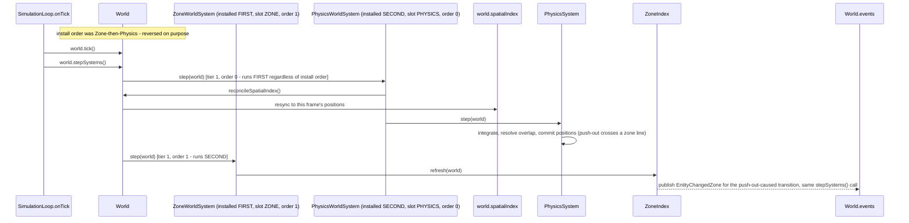

# Plan: `physics-world-system` — the `PhysicsWorldSystem` adapter (World Systems Stage 5 of 5)

## Header / Association

- **Covers:** [SpartanLabsGaming/MyGameTools#80](https://github.com/SpartanLabsGaming/MyGameTools/issues/80)
  — *"World Systems Stage 5: physics `WorldSystem` adapter"*.
- **Architecture:** `docs/world-systems-implementation-architecture.md`, unit slug
  `physics-world-system` (§4.8 design, §5.2 interaction diagram, §7 scope note and per-stage
  documentation table, §8 stability tiers, §10 decomposition row 5, §11 "#80's dependency
  drift").
- **Branch:** `feature/80-physics-world-system`, off `master`, cut only after **#49 is
  re-planned and re-implemented** and **#76** (`world-system-core`) has merged — in practice
  after **#79** (`world-system-graduation`) as well, so this adapter lands already Stable Core
  with no Experimental marker (architecture §10, §1.2 "Other settled points").
- **Commit:** TBD
- **PR:** TBD — this plan document itself is **not** committed on `feature/80-physics-world-system`.
  It lands now, together with the architecture document and its four sibling stage plans, via a
  docs-only PR off `master` (the same pattern `docs/issue-49-physics-architecture.md` and its
  unit plans used, landed by commit `32ddd38`/PR #73). `feature/80-physics-world-system`'s own
  first commit references this already-merged document; it does not re-commit it.
- **What this plans:** `PhysicsWorldSystem` — the thin `WorldSystem` adapter that wires an
  already-built `PhysicsSystem` (#49) into `World`'s tier-1 `PHYSICS` slot (#76) — and its
  regression test suite proving physics-before-zone ordering holds regardless of install order.
  Physics itself is entirely #49's concern and is **not** designed here.
- **Status: Blocked on #49 — provisional; re-verify every #49-derived signature at branch time.**
  No source, test, or build file has been modified by this document.
- **Target release:** first release containing #49's re-implementation and #76/#79; not fixed
  here (architecture §12 OD3 leaves release targeting open at the systems-design level).
- **Dependencies:** `world-system-core` (#76 — `WorldSystem`, `CoreSystemSlot`/
  `CoreWorldSystemSlot`, `World`'s registry members); `world-system-graduation` (#79 — for
  landing order, not a hard compile dependency); **#49, re-planned and re-implemented**
  (`PhysicsSystem`, `World.reconcileSpatialIndex()` made public). `zone-world-system` (#77) is a
  **test-only** dependency (§8) — `PhysicsWorldSystem.kt` itself never references
  `ZoneWorldSystem`.
- **Related docs:** `docs/world-systems-implementation-architecture.md` (binding); `docs/physics-system-plan.md`
  §2–§3 (`PhysicsSystem`'s last-planned shape — **stale, pending #49's re-plan**, per that
  document's own header-callout entry 3 in the architecture doc's §7 table); `docs/world-systems-plan-draft.md`
  §1.2, §5 (superseded `WorldSystems` aggregator — kept as the historical source of the
  physics-then-zone ordering requirement and its headline regression test, both carried forward
  here in the tier-1-slot register); `docs/issue-49-physics-architecture.md` (physics's own,
  not-yet-revised design).

---

## 1. Context

### 1.1 Verified facts

- **Nothing in this unit's dependency chain exists in the repo yet.** Confirmed by search: no
  `WorldSystem`, `CoreSystemSlot`, `PhysicsWorldSystem`, `com.spartanlabs.gaming.annotation`
  package, or `com.spartanlabs.gaming.world.physics` package exists anywhere under
  `gametools-core`/`gametools-world` main source as of this writing (`git status` on
  `feature/71-combat-package` @ `dcb396e`; no other local or remote branch carries any of them
  either — `git branch -a` lists only `docs/issue-49-physics-plans`, `docs/issue-72-api-openness-review`,
  `feature/71-combat-package`, and `master`). This unit plans against contracts, not code.
- **`World.reconcileSpatialIndex()` is `internal fun`** (`gametools-core/src/main/kotlin/com/spartanlabs/gaming/gameobjects/World.kt:258`),
  called from `World.tick()`'s own step 2 (`World.kt:220`), before `tick()`'s step 4 moves any
  `GameObject` (`World.kt:218-226`). On return from `tick()`, `spatialIndex` reflects the
  *previous* frame's positions — the one call `PhysicsWorldSystem.step` makes before delegating
  to `PhysicsSystem.step` exists to close exactly this one-step staleness
  (`docs/world-systems-plan-draft.md` §1.2 point 3, reproduced in §2.2 below).
- **`PhysicsSystem`'s last-planned shape** (`docs/physics-system-plan.md` §2.1, §2.3, §3.1 —
  **stale, pending #49's re-plan**):
  ```kotlin
  class PhysicsSystem(private val resolver: CollisionResolver = PositionalCorrectionResolver()) {
      fun attach(holder: VisibleObject, shape: Shape = Shape.Aabb(holder.dimensions),
                 inverseMass: Double = 1.0, restitution: Double = 0.0): PhysicsBody
      fun detach(holder: VisibleObject)
      fun bodyFor(entityId: EntityId): PhysicsBody?
      fun step(world: World)
  }
  ```
  `PhysicsSystem` holds **no `World` reference of its own** — `step(world)` takes it as a
  parameter, used only for that one call, exactly mirroring `ZoneIndex.refresh(world: World)`
  (`docs/physics-system-plan.md` §2.1). Its body registry (`bodies: MutableMap<EntityId,
  PhysicsBody>`) is keyed **only** by `EntityId`, with no `World` component to the key
  (`docs/physics-system-plan.md` §2.3) — the same shape `ZoneIndex.indexed` already has. This is
  the fact §2.4 below builds the install-guard recommendation on.
- **`ZoneWorldSystem` (#77) is not yet planned or built.** Its declaration is given by the
  architecture doc (§4.5) as `class ZoneWorldSystem(val zoneIndex: ZoneIndex) : WorldSystem`,
  `coreSlot = CoreWorldSystemSlot.ZONE`, `step(world) = zoneIndex.refresh(world)`, with `installOn`
  guarding "only against the *same instance* being installed on a second `World` concurrently."
  This unit's tests construct a `ZoneWorldSystem` purely as a **test fixture** to exercise
  ordering against — `PhysicsWorldSystem.kt` itself never imports it.
- **`ZoneIndex.refresh`** (`gametools-world/src/main/kotlin/com/spartanlabs/gaming/world/zone/ZoneIndex.kt:38-62`)
  reads `obj.location` directly and never touches `world.spatialIndex` (verified: zero
  occurrences of `spatialIndex` in `ZoneIndex.kt`) — confirming, independent of #77's own plan,
  that no *second* reconcile is needed between `PhysicsWorldSystem.step` and a subsequent
  `ZoneWorldSystem.step` in the same `stepSystems()` pass.
- **`SimulationLoop.advance(realElapsedNanos: Long)`** (`gametools-core/src/main/kotlin/com/spartanlabs/gaming/simulation/SimulationLoop.kt:112-127`)
  calls `world.tick()` then `onTick(world.tickCount)` once per whole tick, threading no `dt`
  anywhere in the call chain — the e2e test (§5) drives `world.stepSystems()` from exactly this
  `onTick` closure, mirroring `ZoneDrivenSimulationE2ETest`'s registration idiom but adding a real
  `SimulationLoop` for the first time in `gametools-world`'s test suite.
- **`EventBus.subscribe`/`publish`** (`gametools-core/src/main/kotlin/com/spartanlabs/gaming/event/EventBus.kt:39-42,59-65,73-89`)
  delivers synchronously, in subscription order, catching and logging (`WARN`) a throwing
  listener rather than aborting delivery — the reason a throwing `ZoneWorldSystem`/`PhysicsWorldSystem`
  cannot itself be observed via `EventBus`; it is `World.stepSystems()` (#76), not `EventBus`,
  that lets a `WorldSystem`'s own exception propagate uncaught (architecture §4.4).
- **`gametools-world` has no slf4j logger in any main-source file today** (verified: zero
  `LoggerFactory` occurrences under `gametools-world/src/main/kotlin`). Whichever of #49/#77 lands
  first in `world.physics`/`world.zone` establishes the file-level-logger convention
  (`.aiassistant/rules/CLAUDE.md` §3; repo precedent `SimulationLoop.kt:20`, `EventBus.kt:10`) for
  that package first; `PhysicsWorldSystem.kt` declares its own file-level logger regardless,
  scoped to the same `"com.spartanlabs.gaming.world.physics"` logger name (SLF4J's `LoggerFactory.getLogger`
  returns the same cached instance for a repeated name, so this needs no coordination with
  whatever #49's own `PhysicsSystem.kt` does).
- **No `com.spartanlabs.gaming.testing.nonfunctional.world` package exists in `gametools-world`
  yet** (verified by directory listing) — this unit's optional 4c test (§5) would be the first.

### 1.2 Acceptance criteria

1. `gametools-world` gains a new public class `PhysicsWorldSystem` in
   `com.spartanlabs.gaming.world.physics`, implementing `WorldSystem` (#76) with
   `coreSlot = CoreWorldSystemSlot.PHYSICS`.
2. A `World` with `PhysicsWorldSystem` installed **after** a `ZoneWorldSystem` (install order
   reversed on purpose) still steps physics before zones on every `stepSystems()` call — the
   headline regression test (§5) proves a push-out-caused zone transition is visible on the
   *same* `stepSystems()` call that caused it, regardless of install order.
3. `stepSystems()`'s ordering guarantee is unaffected by which of `PhysicsWorldSystem`/
   `ZoneWorldSystem` was installed first — the improvement this design has over the superseded
   `WorldSystems` aggregator's install-order-dependent contract (architecture §4.8, §5.2).
4. Uninstalling `PhysicsWorldSystem` frees the `PHYSICS` slot for a different physics
   `WorldSystem` to legally claim.
5. `gametools-core` gains nothing from this unit — the adapter is wholly a `gametools-world`
   type, consuming `WorldSystem`/`CoreSystemSlot` from `gametools-core` without modifying either.

---

## 2. Design

### 2.1 The adapter declaration

```kotlin
// gametools-world/src/main/kotlin/com/spartanlabs/gaming/world/physics/PhysicsWorldSystem.kt
class PhysicsWorldSystem(val physicsSystem: PhysicsSystem) : WorldSystem {

    private var installedOn: World? = null

    override val coreSlot: CoreSystemSlot = CoreWorldSystemSlot.PHYSICS

    override fun installOn(world: World) {
        check(installedOn == null) {
            "PhysicsWorldSystem is already installed on a World - uninstall it there first " +
                "before installing it on a second one"
        }
        installedOn = world
        log.debug("PhysicsWorldSystem installed on World (seed={})", world.seed)
    }

    override fun uninstallFrom(world: World) {
        installedOn = null
        log.debug("PhysicsWorldSystem uninstalled from World (seed={})", world.seed)
    }

    override fun step(world: World) {
        world.reconcileSpatialIndex()
        physicsSystem.step(world)
    }
}
```

The guard uses `check` → `IllegalStateException`, exactly like `ZoneWorldSystem`'s
(`docs/zone-world-system-plan.md` §2.2). It tests this receiver's own state (already attached
elsewhere), not the validity of the `world` argument. The rule shared by all three adapters
(architecture "Cross-plan alignment"):
- a guard on the adapter's own state throws `IllegalStateException` via `check`;
- a conflict with what the `World` already holds (`World.installSystem`'s duplicate/slot checks,
  `ExperienceSystem`'s second-instance check) throws `IllegalArgumentException` via `require`.

There is no per-`step` log line, matching `ZoneWorldSystem`: `World.stepSystems()` already logs
once per call at `DEBUG` (#76).

Lands **untagged Stable Core from birth** (architecture §8) — no `@ExperimentalGameToolsApi`,
since #80 is sequenced after #79's graduation. Doubles, alongside `ZoneWorldSystem`, as a worked
example of the "systems/infrastructure → interface + supplied default implementation" library
rule: a consumer substitutes `WorldSystem` itself, not this class.

### 2.2 Why the explicit `reconcileSpatialIndex()` call

`World.tick()` reconciles `spatialIndex` at its own step 2 and only moves objects at its step 4
(`World.kt:218-226`) — on return from `tick()`, `spatialIndex` is one step behind. Any body's
broad-phase query inside `PhysicsSystem.step` that used `world.spatialIndex` unreconciled would
see last frame's neighbours, not this frame's. `docs/world-systems-plan-draft.md` §1.2 point 3
gives the same reasoning for the superseded `WorldSystems.step()`; this design carries it forward
unchanged, now scoped to `PhysicsWorldSystem.step` alone rather than a shared aggregator method.
**Drop this call outright if #49's re-plan folds the reconcile into `PhysicsSystem.step` itself**
(§2.5's re-verification table, row 1) — at that point `PhysicsWorldSystem.step` reduces to the
single delegating line `physicsSystem.step(world)`.

No second reconcile is needed between this adapter's `step` and a subsequent `ZoneWorldSystem.step`
in the same `stepSystems()` pass, because `ZoneIndex.refresh` reads `obj.location` directly and
never consults `world.spatialIndex` (§1.1) — unchanged from the superseded design's own reasoning.

### 2.3 Ordering: tier-1 slots, not install order — the improvement over the old design



Under the superseded `WorldSystems` aggregator (`docs/world-systems-plan-draft.md` §2.2), this
exact scenario — a caller wiring zone-before-physics — would have produced a **silent,
one-frame-late** `EntityChangedZone`, with no compiler or runtime signal. Under `WorldSystem`'s
two-tier model (#76), `CoreWorldSystemSlot.PHYSICS.order == 0 < CoreWorldSystemSlot.ZONE.order == 1`
makes the correct order a property of `World.stepSystems()`'s own tier-1 sort (architecture §4.4),
not of which `install*` call the consumer happened to make first. This is the property §5's
headline test exists to lock in — with install order **deliberately reversed** relative to the
"obvious" physics-then-zone install sequence, precisely so the test cannot pass by accident.

### 2.4 The `installOn` single-`World` guard — recommended, flagged as Open Decision 1

`PhysicsSystem`'s body registry is `EntityId`-keyed with no `World` component to the key (§1.1) —
the same shape `ZoneIndex.indexed` has, which is exactly why architecture §4.5 gives
`ZoneWorldSystem` its own concurrent-install guard rather than relying on `World.installSystem`'s
identity/slot checks (both of which are scoped to *one* `World`'s own registry and cannot see a
second `World` at all). Installing the same `PhysicsWorldSystem` instance on two `World`s at once
would let `PhysicsSystem.step` mix two worlds' `EntityId` spaces in one `bodies` map — a live
hazard since `World`'s own `EntityId` allocator restarts at `1` for every `World` instance
(`World.kt:127,165` per the architecture doc's own citation), so a collision is the *common* case,
not an edge case, the moment two worlds are in play. **Recommendation: mirror `ZoneWorldSystem`'s
guard shape exactly** (§2.1's `installedOn` field) — same reasoning, same shape, same limitation.
This does **not** fully close the hazard: two *different* `PhysicsWorldSystem` instances wrapping
the *same* underlying `PhysicsSystem` and installed on two different `World`s would each pass
their own guard independently while still corrupting the shared `bodies` map — an identical,
pre-existing limitation of `ZoneWorldSystem`/`ZoneIndex`'s own shape, not a new gap this unit
introduces, and not fixed here. See Open Decisions (§9 OD1) and the re-verification checklist
(§2.5) for how this could change once #49's actual `PhysicsSystem` shape lands.

### 2.5 Re-verification checklist (run before writing a line of this unit's code)

1. Confirm `com.spartanlabs.gaming.world.physics` exists with a `PhysicsSystem` class exposing
   `attach`/`detach`/`bodyFor`/`step(world: World)` matching §1.1's cited shape (or note the
   actual shape and update §2.1/§2.2 accordingly).
2. Confirm `World.reconcileSpatialIndex()` is `public` (#49's re-planned unit 1).
3. Confirm `WorldSystem`, `CoreSystemSlot`/`CoreWorldSystemSlot`, and `World`'s four registry
   members carry `@SupportedExtension`/are untagged Stable Core (post-#79) — if #80 is
   implemented before #79 lands, apply the propagating `@ExperimentalGameToolsApi` to
   `PhysicsWorldSystem` per the architecture's stated fallback (§4.8), to be stripped when #79
   lands.
4. Confirm `CoreWorldSystemSlot.PHYSICS.order` is still `0` and `ZONE.order` is still `1`
   (unchanged since #76's design, but re-verify against the landed enum, not this document).
5. Confirm whether `PhysicsSystem` now holds any per-`World` state (would change or remove the
   need for §2.4's guard).
6. Confirm `ZoneWorldSystem`'s actual constructor/`installOn` guard shape (#77) for this unit's
   test fixtures to match exactly, and check whether #77 introduced any shared `World`-with-two-zones
   test-fixture helper this unit's headline test should reuse instead of duplicating.
7. Confirm whether `gametools-world` already has a file-level logger convention established by
   whichever of #49/#77 landed first, to keep `PhysicsWorldSystem.kt`'s own logging consistent in
   style (level choices, message shape) with its sibling adapter.

### 2.6 What changes if #49 decides X

| If #49's re-plan decides… | …then #80 |
|---|---|
| The reconcile moves inside `PhysicsSystem.step` itself | Drop the explicit `world.reconcileSpatialIndex()` call in `PhysicsWorldSystem.step` (§2.2) — a single-line, single-call-site change; no test besides the reconcile-freshness test (§5) needs updating in shape, only in what it asserts is *inside* `PhysicsSystem.step` versus the adapter. |
| `PhysicsSystem.step` is renamed, or gains a `dt: Double` parameter | Update `PhysicsWorldSystem.step`'s delegating call to match. A `dt` parameter is a new open question this document does not anticipate — nothing in `World.tick()`/`SimulationLoop`/`WorldSystem.step(world: World)` threads a `dt` value anywhere today (§1.1); sourcing one would need its own design decision upstream of this adapter, escalated as a new open decision at that time, not resolved here. |
| `PhysicsSystem` gains its own per-`World` state (e.g. keys `bodies` by `(World, EntityId)`) | §2.4's guard may become unnecessary — re-derive the recommendation against the new shape rather than keeping the guard by default. |
| `PhysicsSystem` itself becomes a `WorldSystem` (absorbing `coreSlot`/`installOn`/`step` directly) | `PhysicsWorldSystem` becomes unnecessary — recommend #80 reduces to closing the issue as "resolved by #49 directly" with no new adapter type, rather than shipping a redundant pass-through wrapper. Flag this outcome to the user before acting on it, since it changes #80's own scope, not just its implementation. |

---

## 3. File-by-file changes

### 3.1 New: `gametools-world/src/main/kotlin/com/spartanlabs/gaming/world/physics/PhysicsWorldSystem.kt`

Full declaration per §2.1, with KDoc:

```kotlin
/**
 * Wires an already-built [PhysicsSystem] into [World]'s tier-1 [CoreWorldSystemSlot.PHYSICS]
 * slot, so it steps before any [com.spartanlabs.gaming.world.zone.ZoneWorldSystem] every frame,
 * regardless of which was installed first (see [World.installSystem]'s tier-1 ordering).
 *
 * [step] resyncs [World.spatialIndex] to this frame's positions ([World.reconcileSpatialIndex])
 * immediately before delegating to [PhysicsSystem.step] - necessary because [World.tick]
 * reconciles at its own step 2 and only moves objects at its step 4, leaving the index one step
 * stale on return. Physics itself, and everything [PhysicsSystem] resolves against, is entirely
 * [PhysicsSystem]'s own concern - this class adds no physics behaviour of its own.
 *
 * A single [PhysicsWorldSystem] instance may be installed on only one [World] at a time -
 * [installOn] rejects a second, concurrent installation. This does not protect two *different*
 * [PhysicsWorldSystem] instances that wrap the *same* [PhysicsSystem] from being installed on two
 * [World]s at once; that remains a caller-managed invariant, matching
 * [com.spartanlabs.gaming.world.zone.ZoneWorldSystem]'s identical shape and limitation.
 *
 * @param physicsSystem the physics orchestrator this adapter steps every frame
 * @throws IllegalStateException from [installOn] if this instance is already installed on a
 *   [World]
 */
class PhysicsWorldSystem(val physicsSystem: PhysicsSystem) : WorldSystem { /* §2.1 */ }
```

**Error handling:** `installOn` throws `IllegalStateException` via `check` for the one
caller-wiring precondition (§2.4). That is a programmer error, not an operational failure, so it
is thrown, never `Result`-wrapped. `check` rather than `require` because the condition is this
receiver's own state; this matches `ZoneWorldSystem`'s guard and the shared rule in §2.1.
`uninstallFrom` never fails and returns `Unit`.
`step` propagates any exception `PhysicsSystem.step` or `World.reconcileSpatialIndex` raises,
uncaught — matching `World.stepSystems()`'s own no-wrapping behaviour (architecture §4.4) and
`WorldSystems.step()`'s superseded precedent (`docs/world-systems-plan-draft.md` §3.1).

**Mutability:** `physicsSystem` is a `val` constructor property, never reassigned. `installedOn`
is a `private var`, the adapter's own single piece of mutable state, mutated only from `installOn`/
`uninstallFrom`.

**Concurrency:** single-threaded, by the same convention every other `World`-adjacent type
assumes; no synchronization added.

**Logging** (file-level `private val log: Logger = LoggerFactory.getLogger("com.spartanlabs.gaming.world.physics")`,
matching the repo's file-level-logger convention):

| Event | Level | Where |
|---|---|---|
| Adapter installed on a `World` | `DEBUG` | `installOn`, guard passed (`World.installSystem` itself logs the `INFO` lifecycle line) |
| Adapter uninstalled | `DEBUG` | `uninstallFrom` |

No per-`step` log line (see §2.1).

No log line precedes the `installOn` guard's thrown exception, matching `TiledMap`/`ZoneGrid`'s
own `require`-throws-no-log convention (the exception message is the record).

### 3.2 Changed: `README.md`

`Modules` table, `world` row — append, inline after whatever `world.physics.*` clause #49's own
landed unit already added: *", and `PhysicsWorldSystem` — the `WorldSystem` adapter wiring it
into `World`'s tier-1 `PHYSICS` slot (#80)"*. Per architecture §7's scope note, this unit does
**not** touch the physics-as-a-whole Architecture/Features prose or the roadmap Open Decision C
correction — those remain owed to whoever re-plans #49 as a whole.

### 3.3 Changed: `CONTRIBUTING.md`

`gametools-world` module-layout row (`CONTRIBUTING.md:35`) — append `, PhysicsWorldSystem (#80)`
to whatever `world.physics.*` clause is already there by the time this branch lands.

### 3.4 Changed: `CHANGELOG.md`

One `[Unreleased]` → `### Added` bullet:

```markdown
- `PhysicsWorldSystem` (`com.spartanlabs.gaming.world.physics`) - the `WorldSystem` adapter
  wiring `PhysicsSystem` into `World`'s tier-1 `PHYSICS` slot (`CoreWorldSystemSlot.PHYSICS`,
  order `0`), so an installed `PhysicsWorldSystem` steps before `ZoneWorldSystem` every frame
  regardless of install order. `step` resyncs `World`'s spatial index to the frame's current
  positions (`World.reconcileSpatialIndex()`) immediately before delegating to
  `PhysicsSystem.step`, so a push-out that carries an entity across a zone boundary is visible
  to `ZoneWorldSystem`'s own refresh in the *same* `stepSystems()` call. A single instance may be
  installed on only one `World` at a time; uninstalling frees the `PHYSICS` slot for a
  replacement physics `WorldSystem`. (#80)
```

### 3.5 New test files

See §5 for the full per-level breakdown.

- `gametools-world/src/test/kotlin/com/spartanlabs/gaming/testing/component/world/physics/PhysicsWorldSystemStepTest.kt`
- `gametools-world/src/test/kotlin/com/spartanlabs/gaming/testing/component/world/physics/PhysicsWorldSystemInstallGuardTest.kt`
- `gametools-world/src/test/kotlin/com/spartanlabs/gaming/testing/component/world/physics/PhysicsWorldSystemZoneOrderingTest.kt`
- `gametools-world/src/test/kotlin/com/spartanlabs/gaming/testing/integration/world/physics/PhysicsWorldSystemWorldIntegrationTest.kt`
- `gametools-world/src/test/kotlin/com/spartanlabs/gaming/testing/deterministic/world/physics/PhysicsWorldSystemDeterminismTest.kt`
- `gametools-world/src/test/kotlin/com/spartanlabs/gaming/testing/e2e/world/physics/PhysicsWorldSystemSimulationE2ETest.kt`
- `gametools-world/src/test/kotlin/com/spartanlabs/gaming/testing/nonfunctional/world/physics/PhysicsWorldSystemThroughputTest.kt` (optional — §9 OD3)

All new packages under `testing/*/world/physics/`; one class per file.

---

## 4. Documentation impact (Audience-Reach rings)

- **Inner Core:** the repo's standard import-region comments in the new file (§ import groups
  per `.aiassistant/rules/CLAUDE.md` §6 — `1.2 Spartan Gaming` for `World`/`WorldSystem`/
  `CoreSystemSlot`/`CoreWorldSystemSlot`/`PhysicsSystem`, `4.1 Logging` for slf4j).
- **Component Ring (KDoc):** the primary ring — full KDoc on `PhysicsWorldSystem` and its
  members (§3.1), doubling as a `WorldSystem` worked example alongside `ZoneWorldSystem`, since
  it lands untagged Stable Core. Must render cleanly under `./gradlew dokkaGeneratePublicationHtml`.
- **Boundary Ring:** not touched — no wire format, no protocol change.
- **Architectural Outer Layer:** `docs/world-systems-implementation-architecture.md` already
  documents this unit's design fully; no update owed to it by this unit's own implementation.
  This plan document is the concretisation, not a correction, of that architecture.
- **README/CONTRIBUTING/CHANGELOG currency:** updated in this unit's own implementation commit
  (§3.2–§3.4), per the global README rule and architecture §7's per-stage documentation table.
  This unit does **not** carry the physics-wide README prose or roadmap correction — those stay
  owed to #49's own re-plan (architecture §7 scope note, restated in §3.2 above).

---

## 5. Test plan (5-level hierarchy)

Convention: `kotlin.test` on the JUnit 5 platform against real collaborator objects — no MockK
anywhere in this repo (verified, matching `docs/physics-core-seams-plan.md` §6 and
`docs/world-systems-plan-draft.md` §5's own finding). `PhysicsSystem` is, per its last-planned
shape, a concrete, non-open class with no interface seam — this rules out an isolating fake for
pure call-order verification without introducing MockK; §5's "cannot be tested automatically"
note below records this explicitly rather than silently testing something narrower than intended.

### Level 1 — gating

No `com.spartanlabs.gaming.testing.gating` package exists in this repo. Per established
convention, level 1 is `./gradlew componentTest deterministicTest` before every push, using the
level 2/4a tests below.

### Level 2 — component (`.../testing/component/world/physics/`)

- **`PhysicsWorldSystemStepTest.kt`**
  - `step` resyncs `world.spatialIndex` to the frame's current positions before delegating to
    `physicsSystem.step` — asserted by the *effect*, not the call order (§ note above): move an
    entity via `world.tick()`, then call `physicsWorldSystem.step(world)` with an otherwise-inert
    `PhysicsSystem` (no attached bodies), and confirm `world.spatialIndex.queryBox(...)` around
    the entity's *new* location now returns it, contrasting a bare `world.tick()` with no
    `step(world)` call, where the index still reflects the stale, pre-tick position.
  - `step` delegates to `physicsSystem.step`: attach two overlapping bodies via `physicsSystem.attach`
    directly, call `physicsWorldSystem.step(world)` once, and assert they separate — proving the
    adapter's delegation actually runs the real pipeline, not just the reconcile half.
  - `step` propagates an exception thrown by `physicsSystem.step` uncaught (construct a scenario
    that reaches whatever `PhysicsSystem`'s own documented failure mode is, once #49's plan names
    one — flagged as pending #49, §2.5 item 1).
- **`PhysicsWorldSystemInstallGuardTest.kt`**
  - `installOn` on a second `World`, while still installed on a first, throws
    `IllegalStateException` without mutating either `World`'s registry.
  - `uninstallFrom` clears the guard; a subsequent `installOn` on a new `World` succeeds.
  - Installing `PhysicsWorldSystem` via `world.installSystem` when the `PHYSICS` slot is already
    occupied by a different `WorldSystem` throws `IllegalArgumentException` (exercises
    `World`'s own slot check as consumed by this adapter — not a re-test of #76's registry logic
    in depth).
  - Uninstalling `PhysicsWorldSystem` frees the `PHYSICS` slot for a hand-rolled fake `WorldSystem`
    (`coreSlot = CoreWorldSystemSlot.PHYSICS`) to then install successfully — the "legal
    substitution" acceptance criterion, using a fake rather than a second real `PhysicsSystem` to
    keep this test decoupled from #49's actual implementation details (§9 OD4).
- **`PhysicsWorldSystemZoneOrderingTest.kt` — the headline regression test**, adapted from
  `docs/world-systems-plan-draft.md` §5's Level 2 "Headline test" to the tier-1-slot mechanism:
  build a real `World`, a `ZoneGrid`/`ZoneIndex` pair with two adjacent zones split by a line, a
  `PhysicsSystem` (default resolver) with two overlapping attached bodies positioned so resolving
  them pushes one across that line, wrap them as `ZoneWorldSystem(zoneIndex)` and
  `PhysicsWorldSystem(physicsSystem)`, and:
  - **Obvious install order**, `PhysicsWorldSystem` then `ZoneWorldSystem`. After one
    `world.tick()` and one `world.stepSystems()`, assert that the pushed entity's
    `zoneIndex.zoneOf(...)` already reflects the new zone, and that a matching `EntityChangedZone`
    was published on `world.events` during that same `stepSystems()` call.
  - **Reversed install order**, `ZoneWorldSystem` then `PhysicsWorldSystem` — the case the
    superseded install-order design got wrong. Identical assertions, identical result. This proves
    §2.3's claim (tier-1 order holds regardless of install order) is not an accident of one
    particular install sequence.

### Level 3 — integration (`.../testing/integration/world/physics/PhysicsWorldSystemWorldIntegrationTest.kt`)

A real `World` with a `TiledMap`-backed `space` (via `MapLoader`, matching `MapLoaderIntegrationTest`'s
own convention), several attached `Actor`s (including one colliding with `StaticGeometry` and one
crossing non-walkable terrain), a `ZoneGrid`/`ZoneIndex`/`ZoneWorldSystem`, and a
`PhysicsSystem`/`PhysicsWorldSystem`, driven for several `world.tick()` + `world.stepSystems()`
cycles with install order reversed as in the headline test. Asserts `EntityChangedZone` events
fire in the documented order relative to each frame's physics resolution across a realistic,
map-backed scenario, and that `World.reconcileSpatialIndex()` — now public per #49's re-planned
unit 1 — is genuinely callable across the `core`/`world` module boundary (the same closing-the-gap
role `docs/world-systems-plan-draft.md` §5 Level 3 assigned its own integration test).

### Level 4a — deterministic (`.../testing/deterministic/world/physics/PhysicsWorldSystemDeterminismTest.kt`)

Same `World(seed)`, same `ZoneGrid`/`PhysicsSystem` construction, same scripted sequence of
`world.tick()` + `world.stepSystems()` calls, install order reversed vs. not — produces the same
sequence of published `EntityChangedZone` events and the same final positions across repeated
runs. Locks in that composing the two adapters through `World`'s tier-1 registry introduces no
incidental nondeterminism beyond what #49/#77 already guarantee individually.

### Level 4b — e2e (`.../testing/e2e/world/physics/PhysicsWorldSystemSimulationE2ETest.kt`)

Loads `fixture-map.json` through `MapLoader` (reusing `world.map`'s existing fixture, matching
`ZoneDrivenSimulationE2ETest`'s precedent), builds `World` + `ZoneGrid`/`ZoneIndex`/`ZoneWorldSystem`
+ `PhysicsSystem`/`PhysicsWorldSystem`, and drives it with a real
`com.spartanlabs.gaming.simulation.SimulationLoop` via its public `advance(realElapsedNanos)`,
with `onTick = { world.stepSystems() }`. It is the second `gametools-world` e2e test to do so,
after #77's `ZoneWorldSystemSimulationLoopE2ETest`; reuse that test's `SimulationLoop`/`advance`
driving pattern rather than re-deriving it. Asserts
final positions, final zone membership, and that no physics-caused `EntityChangedZone` lags
behind the tick that caused it, over a fixed tick count.

### Level 4c — non-functional (optional; `.../testing/nonfunctional/world/physics/PhysicsWorldSystemThroughputTest.kt`)

Frame throughput of `world.stepSystems()` with both adapters installed at the roadmap's
medium-scale target (~10k entities, ~2k physics-active, 10–20 Hz). **Recommended, not required**
(§9 OD3) — mirrors `docs/world-systems-plan-draft.md` §5's own Level 4c reasoning; may duplicate
work a narrower `PhysicsSystem`-only throughput test in #49's own suite already covers.

### Level 5 — UAT

No `com.spartanlabs.gaming.testing.uat` package exists anywhere in this repo; none is invented
here. Worth noting: this is the first genuinely "feelable" surface across the whole World Systems
decomposition and #49's own six units combined — a human watching two units push apart while a
zone-boundary crossing fires the same frame is the first place this whole effort produces
something a UAT pass could actually evaluate. No harness is built for that here.

### What genuinely cannot be tested automatically

- **True call-order isolation of `step`'s two delegated calls** (`reconcileSpatialIndex()` then
  `physicsSystem.step`), absent either an interface seam on `PhysicsSystem` or a mocking
  framework this repo does not use — tested via observable effects instead (§5 Level 2), per
  repo convention.
- **That `#49`'s actual landed `PhysicsSystem` shape matches this plan's assumptions.** Inherently
  unverifiable until #49 lands; addressed by the re-verification checklist (§2.5), not a test.
- **A genuine "feel" evaluation of push-out + zone-crossing behaviour** (Level 5 note above).
- **That the documentation edits (§3.2–§3.4) read correctly to a human** — no automated
  correctness check beyond rendering.

---

## 6. Risks & edge cases

- **Dependency drift on #49 (architecture §11).** Every signature this plan cites from
  `PhysicsSystem` is sourced from a stale plan (`docs/physics-system-plan.md`) predating #49's
  reopening. §2.5/§2.6 exist specifically to bound this risk with a checklist and a
  decision table rather than leaving it implicit.
- **The reconcile widening landing elsewhere.** If #49's re-plan moves the reconcile call inside
  `PhysicsSystem.step`, this adapter's own call becomes redundant or wrong (double-reconcile) —
  §2.6 row 1 is the concrete mitigation; must be checked, not assumed, at branch-cut time.
- **Same-`World` invariant is only partially enforced.** §2.4's `installedOn` guard stops the
  same `PhysicsWorldSystem` instance from serving two `World`s at once, but not two different
  adapter instances sharing one underlying `PhysicsSystem` — an inherited, not new, limitation
  matching `ZoneWorldSystem`/`ZoneIndex`'s identical shape (architecture §4.5). Documented, not
  fixed, in both places.
- **Sequencing/scope risk if #80 is implemented before #79 lands.** The adapter then needs the
  propagating `@ExperimentalGameToolsApi` marker (architecture §4.8's stated fallback) rather than
  landing untagged; #79 strips it along with the other two adapters' markers when it lands. Not
  expected under the stated landing order (§10), but the fallback must be applied if the order
  slips.
- **Breaking changes:** none — `PhysicsWorldSystem` is a wholly new type with no prior public
  surface to break.
- **Wire/schema compatibility:** unaffected — no `@Serializable` type, no wire format.
- **Concurrency:** unchanged — single-threaded `World`-driver convention, no synchronization
  added.
- **Performance:** the adapter itself adds negligible virtual-call overhead; the
  `reconcileSpatialIndex()` cost (if it remains this adapter's own call, §2.6 row 1) is #49's own
  to measure, per architecture §11.
- **Cross-repo impact:** none identified — no wire change; `MyGameServer`/`GameGraphics` are
  unaffected (no issue filed, per standing "no downstream consumer issues" guidance).
- **Migration:** none required for an existing `World`/`ZoneIndex`/`PhysicsSystem` consumer —
  nothing behaves differently until a consumer explicitly installs `PhysicsWorldSystem`.
- **Test-suite risk:** every test body in §5 is written against `PhysicsSystem`'s *last-planned*
  shape. All must be re-verified against the actual landed API before this unit's own PR opens —
  restated from `docs/world-systems-plan-draft.md` §6's identical sequencing-risk note for its own
  now-superseded design.

---

## 7. Version control

- **Branch:** `feature/80-physics-world-system`, cut from `master` only once #49 (re-planned and
  merged) and #76 have landed — in practice after #79 as well (§ Header). If cut earlier for
  drafting purposes, it will not compile until those dependencies exist, and its final rebase onto
  `master` should happen right before this unit's PR opens.
- **This unit's commits carry no unrelated changes.** Do not carry forward any in-flight,
  unrelated working-tree state present on whatever branch this is cut from (verify with
  `git status` before the first commit).
- **Commit sequence:**
  1. `feat(world): add PhysicsWorldSystem, the physics WorldSystem adapter` — adds
     `PhysicsWorldSystem.kt` (§3.1) plus its component, integration, deterministic, and e2e tests
     (§5). Body cites the tier-1 ordering guarantee (architecture §4.8, §5.2) and names the
     headline regression test. **References this already-merged plan document by path; does not
     recommit it.**
  2. `docs(world): README/CONTRIBUTING/CHANGELOG for PhysicsWorldSystem` — the `README.md`,
     `CONTRIBUTING.md`, `CHANGELOG.md` edits (§3.2–§3.4).
  3. **Optional, only if the Level 4c throughput test is included in this PR rather than
     deferred:** `test(world): add PhysicsWorldSystem frame throughput benchmark` as its own
     commit.
- **PR title:** `feat(world): add PhysicsWorldSystem`. Body: `Closes #80`. **May reference #49**
  (e.g. "built against #49's landed `PhysicsSystem`") but does not close it — #49's own
  re-implementation PR closes #49 independently, per the decomposition's landing order.
- Trailer reminder: attribute per the repo's existing commit convention; no `BREAKING CHANGE:`
  footer — nothing here breaks an existing caller.

---

## 8. Interfaces with sibling units

- **Depends on `world-system-core` (#76):** `interface WorldSystem { fun installOn(world: World);
  fun uninstallFrom(world: World) {}; fun step(world: World) {}; val coreSlot: CoreSystemSlot?
  get() = null }`; `sealed interface CoreSystemSlot { val order: Int }`; `enum class
  CoreWorldSystemSlot(override val order: Int) : CoreSystemSlot { PHYSICS(0), ZONE(1) }`;
  `World.installSystem`/`uninstallSystem`/`installedSystems`/`stepSystems()`. `PhysicsWorldSystem`
  implements `WorldSystem`, returns `coreSlot = CoreWorldSystemSlot.PHYSICS`, and is installed/
  uninstalled/stepped exclusively through `World`'s registry — it never calls `installOn`/`step`
  on itself or on any other `WorldSystem`.
- **Depends on `zone-world-system` (#77) — test-only.** `class ZoneWorldSystem(val zoneIndex:
  ZoneIndex) : WorldSystem` with `coreSlot = CoreWorldSystemSlot.ZONE`. Used solely as a fixture
  in this unit's own headline/integration/e2e tests to prove ordering; `PhysicsWorldSystem.kt`'s
  production code has zero reference to it. If #77's actual constructor or guard shape differs
  from architecture §4.5's sketch, only this unit's test fixtures need updating, not
  `PhysicsWorldSystem.kt` itself.
- **Depends on `world-system-graduation` (#79)** for landing order only: by the time #80 lands,
  `WorldSystem`/`CoreSystemSlot`/`World`'s four members are `@SupportedExtension`/untagged Stable
  Core, so `PhysicsWorldSystem` carries no Experimental marker (fallback in §6 if sequencing
  slips).
- **Depends on #49 (physics, provisional — every element flagged):** `class PhysicsSystem
  { fun attach(...): PhysicsBody; fun detach(holder: VisibleObject); fun bodyFor(entityId:
  EntityId): PhysicsBody?; fun step(world: World) }`; `World.reconcileSpatialIndex(): Unit`,
  widened to `public` by #49's re-planned unit 1. `PhysicsWorldSystem` treats `PhysicsSystem.step(world:
  World): Unit` as the whole of the contract it needs, mirroring the superseded `WorldSystems`
  design's own minimal coupling to it (`docs/world-systems-plan-draft.md` §8) — it never calls
  `attach`/`detach`/`bodyFor` itself and needs nothing about `Shape`/`PhysicsBody`/`Contact`/
  `CollisionResolver` internals.
- **Provides to:** nothing further downstream in this five-stage decomposition — #80 is the
  terminal stage. Provides a second worked `WorldSystem` example (alongside `ZoneWorldSystem`)
  for any future adapter (e.g. a `#50` vision `WorldSystem`, if it ever claims a tier-1 slot) to
  follow, though nothing in this unit's own scope designs that.

---

## 9. Open decisions

1. **OD1 — confirm the `installOn` single-`World` guard (§2.4).** Not settled by the interview;
   this plan's own addition, reasoned from `PhysicsSystem`'s last-planned, `EntityId`-only-keyed
   registry shape. **Recommendation: adopt it**, mirroring `ZoneWorldSystem`'s identical guard —
   same underlying hazard, same shape, same known (not newly introduced) limitation for two
   adapter instances sharing one `PhysicsSystem`. Must be re-confirmed once #49's actual
   `PhysicsSystem` shape lands (§2.5 item 5) — if it turns out to hold per-`World` state, the
   guard may become unnecessary rather than merely redundant.
2. **OD2 — whether to keep the explicit `reconcileSpatialIndex()` call by default (§2.2, §2.6).**
   **Recommendation:** keep it, matching the last-planned shape, but gate this unit's branch-cut
   on #49's re-plan explicitly stating where the reconcile call lives, not merely on #49's code
   compiling — a silent double-reconcile (if #49 also folds it into `step`) is a correctness bug,
   not just a redundant call.
3. **OD3 — ship the Level 4c throughput test in this unit's first PR, or defer it.**
   **Recommendation: defer**, mirroring `docs/world-systems-plan-draft.md` §9 item 3's identical
   reasoning — nothing makes it a hard requirement for this unit specifically, and #49's own units
   may already carry a narrower `PhysicsSystem`-only throughput test.
4. **OD4 — use a hand-rolled fake `WorldSystem` (rather than a second real `PhysicsSystem`) for
   the slot-substitution test (§5, `PhysicsWorldSystemInstallGuardTest`).**
   **Recommendation: yes** — keeps that one test decoupled from #49's actual implementation
   details and consistent with this repo's no-MockK, hand-rolled-fake convention for isolating a
   single collaborator's behaviour.

---

## 10. Sequencing & follow-ups

- Lands last of the five-stage World Systems decomposition (#76 → #77 → #78 → #79 → #80), and
  additionally gated on #49's own re-plan and re-implementation landing to `master` — this unit
  cannot be started, only drafted against contracts, until both are true.
- Before this unit's branch is cut: work through the re-verification checklist (§2.5) and the
  "what changes if #49 decides X" table (§2.6) against #49's actual landed code, updating §2.1–§2.2
  and the affected tests in §5 as needed. This is expected, ordinary re-verification for a
  unit explicitly blocked on another in-flight design — not a sign this plan was wrong when
  written.
- **Named follow-ups this unit records but does not build**, restated from the architecture doc so
  they are not lost: the physics-wide README/roadmap corrections (architecture §7 scope note) —
  the false `DirectionalProjectile`-sweeps claim, the umbrella README physics-as-a-whole prose —
  remain owed to whoever re-plans #49 as a whole, **not** to this unit's own commit; a future
  `#50` (vision) `WorldSystem`'s own decision about whether it needs a third tier-1 slot or
  composes independently of this decomposition entirely (architecture §11's tier-2 ordering
  limitation risk) is likewise out of this unit's scope.
