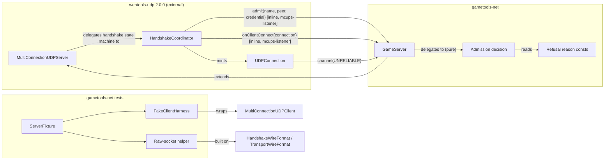
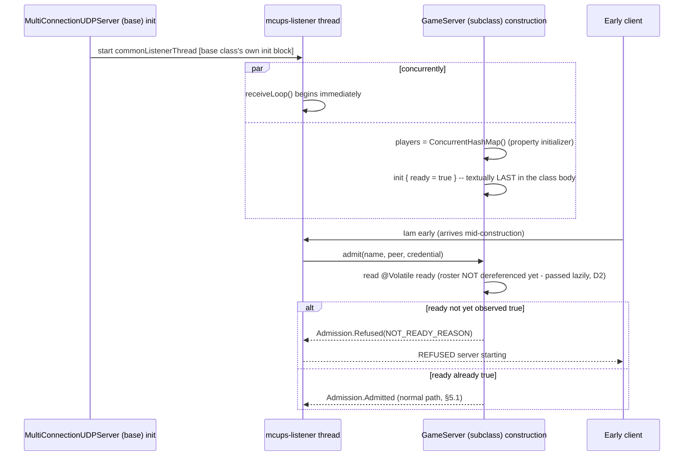

# Architecture: Adopt `webtools-udp` 2.0.0 in `gametools-net` (#124)

## Header / Association

- **Covers:** [SpartanLabsGaming/MyGameTools#124](https://github.com/SpartanLabsGaming/MyGameTools/issues/124)
  — *"Adopt webtools-udp 2.0.0 in gametools-net"*, milestone `6.0.0`.
- **What this designs:** the systems-level shape of the port from the retired
  `io.github.spartanlaboratories:WebTools:2.0.0c` to `io.github.spartanlaboratories:webtools-udp:2.0.0`
  inside `gametools-net` — the dependency swap, `GameServer`'s adaptation to the framed wire and the
  `admit()` pre-accept hook, the new pure admission decision, and the test-double architecture that
  replaces the hand-rolled fake socket client. It does not spec method bodies, file-by-file edits,
  or the test matrix — see the implementation plan to follow.
- **Status:** systems design, reviewed by the planner (amendments listed at the top of §6). One
  plannable unit (§12); its implementation plan is `docs/plans/124-webtools-udp-2.0.0-upgrade/plan.md`. No
  source, test, or build file has been modified by this document.
- **Instruction:** Spartak Singh's binding interview answers, 2026-09-27, via a Claude Code planning
  session (recapped in full in §1.2 below). Every design choice in §6 traces back to one of them or
  to the planner's DECIDED design, which this document adopts without change (§6 states this
  explicitly per decision; no disagreement was found on evidence).
- **Baseline:** `master` @ `e2192b0` (2026-09-26). Every `path:line` citation below against
  `gametools-net` is verified against that commit; every citation into the unpacked upstream sources
  is against the scratchpad copies of `webtools-udp:2.0.0` (`udp200/`) and the retired
  `WebTools:2.0.0c` (`wt200c/`) named in the brief.
- **Related docs:** `docs/api-openness-decisions-6.0.0.md` ("Follow-up" — the owed `gametools-net`
  review, re-homed here to #103, §10); `docs/framework-vision-and-roadmap.md` §3 Phase 3 (upstream
  prerequisite note, now satisfied) and §7 (the WebTools/transport boundary table, now the released
  `webtools-udp` split); `docs/plans/18-webtools-2.0.0c-upgrade/plan.md` and
  `docs/plans/14-webtools-2.0.0b-upgrade/plan.md` (style precedent for a WebTools-version upgrade);
  `docs/plans/87-world-systems/76-world-system-core/architecture.md` and `docs/plans/86-phase-1-map-and-space/49-physics/architecture.md` (header/
  association precedent). Upstream: `SpartanLaboratories/WebTools#38` (blank-name parse), `#39`
  (client-side origin screening on the reliable branch only), `#40` (fixed in 2.0.0), `#41`
  (unbounded WARN volume), `#47` (JDK 23 bytecode vs. a JDK 11+ README claim — already filed).

---

## 1. Requirements

### 1.1 The settled ask

Port `gametools-net` off the retired monolithic `WebTools:2.0.0c` onto the split
`webtools-udp:2.0.0` artifact: swap the dependency, rename the imported package, move `GameServer`
off the deprecated `Connection.actuate(String)`/`push(String)` onto `connection.channel(UNRELIABLE)`,
move the `maxConnections` refusal into an `admit()` override so an over-cap client is told `REFUSED
<reason>` at handshake time instead of being silently dropped after acceptance, rebuild the test
client on the real `MultiConnectionUDPClient`, and update the docs the change touches. Every other
new `webtools-udp` capability (credentials, liveness/disconnect events, scheduled keepalive,
link-quality probe, binary payloads, the reliable-ordered channel, buffer/size constructor
pass-through) is explicitly deferred, each to a named Phase 3 issue (§7.2).

### 1.2 Binding interview answers (recap)

1. **Scope = B.** The full port as described above, `admit` refuses `NOT_READY`/blank-name/over-cap,
   nothing else new is adopted now.
2. **Release = B.** Ships in the already-planned `6.0.0` Phase 2 Major. Planned now; branched and
   merged only after the last `5.x` feature release is tagged; no version renumbering. Breaking:
   `feat(networking)!:` + a `BREAKING CHANGE:` footer.
3. **Public API = A.** `GameServer` keeps inheriting `MultiConnectionUDPServer`; the dependency
   stays `api`. Two items are recorded against #103 rather than decided now: (a) whether `GameServer`
   should decouple from WebTools via composition so the dependency could become `implementation`;
   (b) the openness review of `GameServer` / `ClientCommandCodec` / `ApplyResult` that
   `docs/api-openness-decisions-6.0.0.md`'s "Follow-up" said to do "before `6.0.0` is planned" —
   re-homed to #103 by this instruction.
4. **Scope limits.** Code changes only in `gametools-net` and its build file. No client wrapper
   ships (roadmap §1 decision #1). No issues filed against downstream consumer repos
   (`MyGameServer`, `GameGraphics`) — the wire break is CHANGELOG-only. Unrelated uncommitted
   `WorldSystem` work in `gametools-core` and `docs/plans/96-phase-3-authoritative-networking/client-event-feed-plan-draft.md` are untouched.
   Six docs are updated **at implementation time**, not by this document: `README.md` (four spots),
   `CHANGELOG.md` `[Unreleased]`, `GameServer` KDoc, `website/index.html`, and
   `docs/framework-vision-and-roadmap.md` (two spots). The README's "three coordinates" wording
   drift is fixed only on lines this change already edits.
5. **Tracking.** Issue #124 exists (milestone `6.0.0`); branch `feature/124-webtools-udp-2.0.0`.
   The upstream JDK mismatch is `SpartanLaboratories/WebTools#47` — a risk note only, since GameTools
   already targets JDK 23.

### 1.3 Acceptance criteria

- `gametools-net` compiles and its existing 56 tests (adapted to the framed wire) stay green under
  `webtools-udp:2.0.0`, with no reference to `com.spartanlabs.webtools` (non-`.udp`) remaining.
- An over-cap, blank-name, or pre-ready handshake is refused at the transport level (`REFUSED
  <reason>`, nothing registered) rather than accepted and then dropped.
- A refused client observes the refusal: `MultiConnectionUDPClient.handshake` fails with
  `HandshakeRefusedException` whose `reason` equals the matching public `GameServer.*_REASON`
  constant (§6 D3); a returning player under an already-connected name is still admitted when full.
- A player who reconnects under their own name — including after being dropped by
  `GameServer.disconnect()` or previously refused for capacity — can rejoin from the same socket
  (fact 5's fix, locked in by a new test).
- A near-maximum framed client datagram (~65,000 payload bytes) reaches `GameServer` intact (the
  receive-buffer fix, locked in by the reframed robustness test).
- `README.md`, `CHANGELOG.md`, `website/index.html` and the roadmap describe the 2.0 wire, the
  handshake-time refusal, and the new dependency; the `GameServer` KDoc carries the new contract.
- No other module, and no downstream repo, is touched.

---

## 2. Research findings applied

Only the conclusions that changed something in this design; the rest of the planner's synthesis is
already reflected in §6 without being restated.

1. **Pre-accept admission, run inline on the single I/O thread, is the established pattern** across
   LiteNetLib (`ConnectionRequest.Reject`), Lidgren (`Deny(reason)`), netcode.io/yojimbo
   (connection-denied), and Valve GameNetworkingSockets (`AcceptConnection`/`CloseConnection`) — it
   gives check-then-insert atomicity without locks, and "accept then drop" is a named anti-pattern.
   This is exactly `webtools-udp`'s own `admit()` shape, and it is why the design keeps the admission
   *decision* pure and socket-free (§6 D2) rather than reaching back into any I/O state: a pure
   function is what makes "runs inline on the listener thread, must never throw, must return
   promptly" verifiable by inspection.
   Sources: LiteNetLib `ConnectionRequest` API docs; `mas-bandwidth/netcode` README; Gaffer On Games,
   *Client/Server Connection*; Valve `NetConnectionEnd` wiki; Mirror `NetworkAuthenticator` docs.
2. **Test strategy: drive well-formed flows through the real client library, keep a narrow raw-socket
   path only for adversarial/malformed input.** This is why the test architecture (§6 D9) replaces
   `FakeClientHarness`'s hand-rolled socket with a thin wrapper over the real
   `MultiConnectionUDPClient` for every well-formed flow, and adds a *separate*, narrow raw-socket
   helper built on `webtools-udp`'s own public `HandshakeWireFormat`/`TransportWireFormat` builders —
   rather than hand-rolled byte arrays — for the handful of cases the real client cannot produce
   (a same-socket retransmit, a legacy unframed datagram, a non-zero channel byte).
   Source: torrust-tracker's UDP tracker contract-test refactor plan.
3. **Semver breaks on three independent axes, and a supertype/parameter dependency forces `api`.**
   The wire format itself, the source/binary shape of the public supertype (`GameServer`'s base class
   moves package), and observable behaviour (handshake-time refusal replacing accept-then-drop, plus
   the rejoin and receive-buffer fixes — §9) are three separate major triggers, any one of which would
   be sufficient. Combined with Gradle's own rule that a type
   appearing as a public supertype or in a public method's parameter list forces `api`, not
   `implementation`, this confirms D1 and the `feat(networking)!:` + `BREAKING CHANGE:` commit
   convention, and rules out quietly downgrading the dependency to `implementation` in this same
   change (that question is instead recorded against #103, per the user's Q3(a)).
   Sources: Kotlin API-guidelines backward-compatibility page; semver.org FAQ; Gradle
   `java-library`-plugin user guide.

---

## 3. Context: the as-built upstream delta

`webtools-udp:2.0.0`'s POM depends only on `slf4j-api:2.0.13` and `kotlin-stdlib:2.2.0` — the retired
`WebTools:2.0.0c` also dragged `GeneralTools:2.0.1`, `selenium-java:4.0.0`, `jsoup`, `unirest`,
`skrapeit`, and bundled `chromedriver`/`firefoxdriver` executables onto every `gametools-net`
consumer's classpath (confirmed: `wt200c/chromedriver-win64/chromedriver.exe`,
`wt200c/firefoxdriver/firefoxdriver.exe` in the unpacked artifact). None of that is used by
`gametools-net`; the swap alone shrinks the module's transitive footprint.

| Aspect | `WebTools` 2.0.0c | `webtools-udp` 2.0.0 |
|---|---|---|
| Package | `com.spartanlabs.webtools` | `com.spartanlabs.webtools.udp` |
| Handshake accept reply | bare `REGISTERED` | `REGISTERED 2` (verb + wire major); cross-major peer fails `handshake()` cleanly |
| Handshake refusal | none — `admit` hook does not exist | `REFUSED <reason>`, trimmed, via `open fun admit(name, peer, credential): Admission` |
| Post-handshake framing | plain UTF-8 text (`KA`, raw `INPUT {...}`, etc.) | 1-byte `DatagramType` tag; `0x80` keepalive, `0x81`/`0x82` probe, `0x90 [channel] [payload]` unreliable data, `0xA0`/`0xA1` reliable |
| Unframed / legacy datagram | the whole wire | WARN-dropped, never reaches a handler (`HandshakeCoordinator.kt:220-232`) |
| `Connection.actuate`/`push(String)` | current API | deprecated; `channel(DeliveryMode.UNRELIABLE)` is the replacement (`Connection.kt:63-67,133-137`) |
| `terminate()` | unbinds the handler only; registration persists (`wt200c/…/UDPConnection.kt:38-39`, `wt200c/…/HandshakeCoordinator.kt:102-104`); a fresh `Iam` from that origin hits the "already-registered" echo branch and never re-fires `onClientConnect` (`wt200c/…/HandshakeCoordinator.kt:69-72`) | fully deregisters, idempotent (`UDPConnection.kt:67-69` → `HandshakeCoordinator`'s `deregister`); a second `terminate()` is a no-op |
| Receive buffer | fixed `1024`, silently truncating | configurable, defaults to `65507` (`MultiConnectionUDPServer.kt:193-196,568`) |
| Credential | none | optional opaque token in `Iam <name> <credential>`, passed to `admit` verbatim, never adopted here |
| Threads | listener + dispatch | listener + dispatch, plus opt-in liveness/keepalive/probe/retransmit executors — none of which this port arms |

Two items in this table are **user-visible fixes** the port inherits for free and must lock in with a
test: the terminate/rejoin behaviour, and the larger default receive buffer (§6 D9's robustness test
rewrite; §9 risk R2).

---

## 4. System inventory

| System | Responsibility (one sentence) | Placement | Owns | Does not own |
|---|---|---|---|---|
| **`webtools-udp` transport** | Multiplexes every client's UDP traffic over one socket and runs the handshake/admission/framing state machine. | External dependency (`io.github.spartanlaboratories:webtools-udp:2.0.0`, `api`) | The socket, the listener/dispatch threads, the wire format, `Admission`/`DisconnectReason`/`DeliveryMode`. | Any game-specific policy — capacity, credential meaning, message vocabulary. |
| **`GameServer` (transport adapter)** | Turns the generic transport into the game's protocol: who may join, who is currently a player, and how their messages route. | `gametools-net/…/networking/GameServer.kt` (unchanged placement) | The player roster (`players: ConcurrentHashMap<String, Connection>`), verb dispatch (`INPUT`/`COMMAND`/other), broadcast (`STATE`), the `admit` override, the construction-readiness flag. | The admission *decision* itself (delegated, see below); the wire framing (delegated to `webtools-udp`). |
| **Admission decision** (new) | Decides Admitted/Refused for one handshake, given only the facts that matter to that decision. | New internal function/file beside `GameServer.kt`, e.g. `gametools-net/…/networking/PlayerAdmission.kt` (it decides readiness, name validity *and* capacity, so not "capacity" alone) | The evaluation order (§6 D2) and the refusal-reason wiring. | Any I/O, any mutable state — it is pure. |
| **Refusal reason constants** (new) | Give the wire's `REFUSED <reason>` text stable, matchable identity. | `GameServer.companion` | `SERVER_FULL_REASON`, `BLANK_NAME_REASON`, `NOT_READY_REASON`. | Free-text/internal detail — each string is short and non-leaking, per the external-practice finding. |
| **Real-client test harness** (`FakeClientHarness`, adapted) | Drives well-formed handshake/data flows through the actual client library a consumer would use. | `gametools-net/src/test/…/testing/integration/networking/FakeClientHarness.kt` (thin wrapper over `MultiConnectionUDPClient`) | The handshake/send/receive/keepalive convenience surface tests already call. | Adversarial/malformed input — not producible through the real client. |
| **Raw-socket test helper** (new) | Produces the handful of malformed/edge inputs the real client cannot. | New file beside `FakeClientHarness.kt`, e.g. `RawSocketClient.kt` | Retransmit-from-same-socket, blank name, legacy unframed datagram, non-zero channel byte, same-socket re-handshake after disconnect. | Anything a well-formed client flow already covers. |
| **`ServerFixture`** (adapted) | Owns the `GameServer` under test and every client double against it. | `gametools-net/src/test/…/testing/integration/networking/ServerFixture.kt` | Hands out both the real-client harness and the raw-socket helper; teardown ordering. | Test assertions themselves. |
| **`CommonPort`** (KDoc fix only) | Blocks until the fixed common port is bindable again between tests. | `gametools-net/src/test/…/testing/integration/networking/CommonPort.kt` | Port-release polling. | — |
| **Documentation** (Component + Boundary rings) | Describes the new contract to internal consumers and integrators. | `GameServer` KDoc (Component ring: admission rules, threading, deprecation warnings); README/website/roadmap prose (Boundary ring: wire version, dependency shape) | — | — |

---

## 5. Interactions



### 5.1 Admitted handshake

```mermaid
sequenceDiagram
    participant C as Client (MultiConnectionUDPClient)
    participant L as mcups-listener (HandshakeCoordinator)
    participant GS as GameServer
    participant AD as Admission decision (pure)

    C->>L: Iam alice [credential]
    L->>GS: admit(name="alice", peer, credential)
    GS->>AD: evaluate("alice", ready, maxConnections, { players.keys })
    AD-->>GS: Admission.Admitted
    GS-->>L: Admission.Admitted
    L->>L: register Connection (UDPConnection), no supersede (name unknown)
    L-->>C: REGISTERED 2
    L->>GS: onClientConnect(connection) [same thread, after send]
    GS->>GS: players.put("alice", connection)
    GS->>GS: connection.channel(UNRELIABLE).actuate { msg -> dispatch("alice", msg) }
    Note over L,GS: Later app datagrams arrive framed (0x90); mcups-dispatch runs dispatch()
```

### 5.2 Refused handshake (over capacity)

```mermaid
sequenceDiagram
    participant C as Client
    participant L as mcups-listener (HandshakeCoordinator)
    participant GS as GameServer
    participant AD as Admission decision (pure)

    C->>L: Iam bob
    L->>GS: admit(name="bob", peer, credential)
    GS->>AD: evaluate("bob", ready=true, maxConnections, { players.keys } -> 2/2 full, "bob" absent)
    AD-->>GS: Admission.Refused(SERVER_FULL_REASON)
    GS-->>L: Admission.Refused(SERVER_FULL_REASON)
    L-->>C: REFUSED server full
    Note over L,GS: nothing registered; onClientConnect never fires; C's handshake() returns Result.failure(HandshakeRefusedException)
```

### 5.3 Same-name supersede (reconnect from a new origin)

```mermaid
sequenceDiagram
    participant C2 as New client ("alice", new origin)
    participant L as mcups-listener (HandshakeCoordinator)
    participant GS as GameServer
    participant AD as Admission decision (pure)

    C2->>L: Iam alice (new socket)
    L->>GS: admit(name="alice", newPeer, credential)
    GS->>AD: evaluate("alice", ready, maxConnections, { players.keys } -> "alice" already present)
    AD-->>GS: Admission.Admitted (already-connected name bypasses the cap)
    GS-->>L: Admission.Admitted
    L->>L: findByName("alice") -> stale registration
    L->>L: cancel stale's keepalive/probe/retransmit schedules
    L->>L: onDisconnect(stale.connection, SUPERSEDED) [not wired by this port]
    L->>L: stale.connection.terminate() -- full deregister, WebTools-level
    L->>L: register new Connection; send REGISTERED 2
    L->>GS: onClientConnect(newConnection)
    GS->>GS: players.put("alice", newConnection) returns the OLD Connection reference
    Note over GS: no second terminate() call (D5) -- the stale WebTools registration is already gone;<br/>a repeat terminate() would be a no-op anyway (fact 5)
```

### 5.4 Construction race (handshake arrives before `GameServer`'s own fields are ready)



---

## 6. Decisions

The planner's DECIDED design (brief §"Planner's DECIDED design") is adopted **without change**. No
item below was reversed; where the brief invited pushback, the evidence gathered during this pass
(the full read of `GameServer.kt`, the test suite, and the upstream sources) confirmed rather than
contradicted each call. Each entry states the rationale in systems terms and the sources checked.

*Planner's review amendments (2026-09-28):* D2 gained its evaluation-order constraint (the roster is
passed lazily so it is never dereferenced before readiness); D4 now states that `ready`'s own
initializer must sit above the final `init` block; §9 now lists all three behaviour changes; §7.1
gained six adoption rows; D1 moves the pom-description edit into commit 1; several `path:line`
citations were corrected against the sources.

### D1 — Dependency: `api("io.github.spartanlaboratories:webtools-udp:2.0.0")`

`gametools-net/build.gradle.kts:9` today reads `api("io.github.spartanlaboratories:WebTools:2.0.0c")`;
the comment at `:7-8` already documents *why* it is scoped here rather than in the shared convention
plugin (so `gametools-core`/`gametools-world` consumers do not inherit networking). `api` is
required, not a preference: `GameServer : MultiConnectionUDPServer()` puts the base class in
`GameServer`'s own public supertype position, and `admit`/`onClientDisconnect` put `Connection`/
`DisconnectReason` in public override signatures — Gradle's `java-library` rule is that any of those
forces `api` (research finding 3). The pom description (`:16`, "built on WebTools") is updated to say
`webtools-udp` in the same commit as the dependency line (D11 commit 1) — it is the same build file,
and it is what Maven Central shows consumers of the artifact.

### D2 — Admission is a pure, internal, socket-free decision

A pure internal function evaluates, in order:
1. not ready → `Refused(NOT_READY_REASON)`;
2. `name.isBlank()` → `Refused(BLANK_NAME_REASON)`;
3. connected count ≥ `maxConnections` **and** `name` not already connected → `Refused(SERVER_FULL_REASON)`;
4. else → `Admitted`.

Its inputs are exactly what the decision needs — the name, a `ready` flag, the cap, and the
currently-connected names — not the `InetSocketAddress` or the credential `admit()` itself receives
(`MultiConnectionUDPServer.kt:385`); the credential is ignored pending #102's `AuthProvider`. It never
throws — a hard requirement, since `HandshakeCoordinator.handleHandshake` (`HandshakeCoordinator.kt:260-263`)
catches and drops the handshake silently on any exception from `admit`, which would otherwise be
indistinguishable from a network blip to the client.

**Evaluation-order constraint (planner's alignment review).** The roster must not be *dereferenced*
until readiness is established. If the override passed `players.keys` as an eager argument, Kotlin
would evaluate it *before* the decision's own `ready` check ran — during the construction race
(§5.4) `players` is still `null`, so the argument evaluation itself would throw on `mcups-listener`,
which `HandshakeCoordinator` swallows as a silently-dropped handshake rather than the designed
`REFUSED server starting`. So the connected-names input is passed **lazily** — a supplier the decision
invokes only after branches 1–2 have passed (e.g. `connectedNames: () -> Set<String>`, called as
`{ players.keys }`) — or, equivalently, the override tests `ready` itself before touching `players`.
The supplier form is preferred because it keeps branch 1 inside the pure function, so the
`NOT_READY` branch stays Level-4a-testable alongside the others. `maxConnections` is a constructor
`val` of primitive type: reading it before readiness yields at worst its default `0` and is unused on
the not-ready branch, so it may be passed eagerly.

Why pure and internal rather than the seam #102 will eventually generalise: purity makes it
Level-4a-testable (every branch, no port bound) as the global testing standard requires for
"pure, stateless functions where input X always yields output Y" — constructing *any* `GameServer`
binds port `9998` (`GameServer.kt:53-56`'s own KDoc on the construction side effect), so a decision
that needed a live server to exercise would push this coverage down to Level 3 integration instead,
losing the fast, isolated gate. Making it a public, pluggable policy object now would also pre-empt
#102's `AuthProvider` design before that issue is planned — this stays internal on purpose.

Read order correctness, checked against `HandshakeCoordinator.kt:243-292`: `admit` runs once, only
for a first `Iam` from an unknown origin, and — critically — *before* any same-name supersede
(`HandshakeCoordinator.kt:277-287`). So when "alice" reconnects from a new origin while the server is
at capacity, `GameServer.players` (the internal roster this decision reads) **still contains alice's
old entry** at the moment `admit` runs (the roster is only updated later, in `onClientConnect` →
`listenTo`). Branch 3's "name not already connected" therefore correctly reads as true-for-alice and
the returning-player bypass fires — this is exactly what
`GameServerCapacityTest.kt:59` (`a returning player is admitted even when the server is full`)
already asserts and must keep passing.

### D3 — Refusal reasons: public `const val`s on `GameServer.companion`

`SERVER_FULL_REASON = "server full"`, `BLANK_NAME_REASON = "blank name"`,
`NOT_READY_REASON = "server starting"`. This follows the module's existing wire-constant convention
verbatim — `STATE_VERB` and `INPUT_VERB` are already public `const val`s on the same companion
(`GameServer.kt:314,317`) that both tests and, implicitly, any client author match against. A test or
a client-side author matches `HandshakeRefusedException.reason` (`HandshakeRefusedException.kt:3-11`)
against these constants rather than a hand-typed literal. **Tier: Stable Core** — once shipped, these
strings are part of the wire contract in the same sense `STATE_VERB`/`INPUT_VERB` already are; a
change to any of them is a wire-behaviour break, not a source-level one, so semver governs it exactly
like the verbs. **Level-2 KDoc** (Component ring): each constant documents which admission branch
produces it.

### D4 — Construction guard: a textually-last `@Volatile ready` flag

Replaces `isFullyConstructed`'s `@Suppress("SENSELESS_COMPARISON") private val isFullyConstructed:
Boolean get() = players != null` (`GameServer.kt:208-216`) — a null-check on a `val` the Kotlin
compiler believes can never be null. It is meaningful only because the listener thread can observe
the field at its default `null` during the escape window, and it establishes no happens-before edge
with the constructor's writes: a non-null read does not guarantee the listener also sees
`maxConnections`, the callbacks, or the map's initialised state. It works by timing, not by any JMM
guarantee.
`@Volatile private var ready = false`, flipped `true` by an `init` block that is **the textually last
initializer in the class body** (after every property initializer — currently `players` and `ready`
itself; the constructor-parameter properties initialize before any body-level declaration runs).
Kotlin runs property initializers and `init` blocks in strict textual order, so this is a real
ordering guarantee, not a convention — and it cuts both ways: `ready`'s own `= false` initializer
must also sit *above* that `init` block, or it would run after it and reset the flag. Any property
added later in the file below the `init` block would silently reopen the race, so this ordering
constraint is itself something the KDoc (D7) and a Level-1 line comment must state as an invariant
for future maintainers, not just satisfy once.

JMM reasoning: the listener thread's read of `GameServer`'s own fields races their initialization
because `this` escapes to the base class's already-running listener thread *during* construction
(`MultiConnectionUDPServer.kt:312-319`'s `init` block starts `mcups-listener` before the subclass body
finishes) — a well-known unsafe-publication hazard. A volatile write after every field write, read
first by `admit` before touching anything else, gives the happens-before edge the JMM actually
promises; a plain null check does not. This matches the existing precedent
`SimulationLoop.kt`'s bare `@Volatile` usage in the same codebase (not re-cited path:line here, since
that file is outside `gametools-net` and unrelated to this change — see the brief's own citation).
`onClientConnect` needs no separate readiness check: it only ever runs after an `Admitted` result from
`admit` on the very same listener-thread call sequence, so the happens-before edge already covers it;
this invariant should be stated in the KDoc rather than re-checked in code.

### D5 — `onClientConnect` only registers and listens; the redundant `stale.terminate()` is removed

`listenTo` (`GameServer.kt:151-158`) currently does `players.put(connection.name, connection)?.let {
stale -> stale.terminate() }`. Under 2.0.0c this call carried real weight, because WebTools' own
`terminate()` only unbound the message handler and left the registration in place
(`wt200c/…/UDPConnection.kt:38-39`, `wt200c/…/HandshakeCoordinator.kt:69-72` — the "already-registered
origin" echo branch that never re-fires `onRegistered`). Under 2.0.0, `HandshakeCoordinator`'s own
same-name supersede (`HandshakeCoordinator.kt:277-287`) already calls `stale.connection.terminate()`
*before* `onClientConnect` for the replacement ever fires — fully deregistering it at the
`webtools-udp` level. By the time `GameServer.listenTo` runs for the new connection, `stale` (still
held by `GameServer`'s own map) has therefore already been terminated once; calling `.terminate()` a
second time on it is a verified no-op (`UDPConnection.kt:67-69` → `ClientChannel.deregister`, which is
idempotent by construction — a second `removeByOrigin` on an absent entry is simply `false`). Removing
the call is the adoption of `webtools-udp`'s own supersede contract in place of `GameServer`'s
hand-rolled mirror of it — a duplicate mechanism retired in favour of the one now guaranteed upstream.
The informative "reconnected" log line stays, reworded to say the old connection is already gone
rather than that this call is what tears it down.

### D6 — Channel migration: fetch `channel(UNRELIABLE)` per call

`listenTo` (actuate), `push` (send), and `pushToAllPlayers` (send, in its existing fold) each fetch
`connection.channel(DeliveryMode.UNRELIABLE)` at the point of use rather than caching the handle,
consistent with `UdpChannel`'s own KDoc contract — "stateless and cheap — hold it, or fetch it per
call; either is correct" (`UdpChannel.kt:6`; the type is tagged **Stable Core** upstream at `:13`). The roster stays
`ConcurrentHashMap<String, Connection>` as the single source of truth (unchanged shape); only the send/
actuate call sites change their target from the deprecated `Connection.actuate`/`push(String)`
(`Connection.kt:63-67,133-137`, both `@Deprecated` with a `ReplaceWith` pointing at `channel(...)`) to
the channel handle. `channel(UNRELIABLE).actuate` decodes UTF-8 and trims
(`UdpChannel.kt:51-52`) — byte-for-byte equivalent to what `GameServer.dispatch` already expects
(`GameServer.kt:173-174`'s own `.trim()` plus space-split), so `dispatch`'s own body is unaffected.
The private `Result.andThen` helper (`GameServer.kt:333-334`) stays: the stdlib has no `flatMap` for
`Result`, and `webtools-udp`'s own equivalent is `internal`
(`ResultExtensions.kt:19`; the file's own top comment, lines 3-5: "Deliberately duplicated in
webtools-scraping... a shared webtools-core artifact just to host it would not earn its keep") —
the same reasoning applies one level up, so
`GameServer.kt`'s copy is kept rather than reached for across the module boundary.

### D7 — `GameServer` KDoc content (Component + Boundary rings)

Per the Audience-Reach model, this is Component-ring content (the contract a `gametools-net`
consumer needs) blended with Boundary-ring content (the wire version and threading model an
integrator needs), on the existing class-level KDoc plus each affected member:

- the 2.0 wire: `REGISTERED 2`, `REFUSED <reason>`, the framed post-handshake datagrams, and that
  keepalive is now the client's job (`MultiConnectionUDPClient.startKeepAlive` or a bare `0x80`) —
  `GameServer` itself arms none of the opt-in scheduled features;
- the admission rules and each refusal reason's meaning;
- the threading contract inherited from `webtools-udp` (`admit`/`onClientConnect` inline on
  `mcups-listener`; message routing on `mcups-dispatch`);
- a warning against the inherited, now-visible `start`/`startBytes`/`startReliable`: each rebinds
  every connection's handler in one call, silently detaching `GameServer.dispatch` — these are
  `final` in the base, so only a KDoc warning is possible here; the composition question that would
  let `GameServer` hide them entirely is recorded against #103 (D10);
- the name-hijack caveat (anyone sending `Iam <connected-name>` from a new origin is admitted and
  supersedes the real player) — pre-existing, unchanged, closed by credentials/auth in #102;
- `pushToAllPlayers`'s corrected rationale: its existing KDoc claim that "WebTools never prunes a
  registration" (`GameServer.kt:256`, sourced to commit `ff1c2fa`) is now false — `pushToAll` now
  reaches only currently-registered connections, same as `pushToAllPlayers`, except for the
  transient window before `onClientConnect` completes and the rare orphaned-registration case
  (§9 R4); `pushToAllPlayers` stays the roster-defined broadcast, since "every player *I* currently
  track" remains a distinct, useful guarantee even once the two mostly coincide;
- `disconnect`'s existing "free to handshake again" (`GameServer.kt:286`) is now **actually true**,
  where under 2.0.0c it silently was not (fact 5) — the KDoc already makes this claim, so no wording
  change is owed there beyond confirming it, but the fix itself is worth a line;
- which upstream members are deprecated and no longer used by this class.

### D8 — Deferred capabilities → Phase 3 home (verified against issue text)

| Capability | Phase 3 home | Verified against |
|---|---|---|
| `admit`'s credential slot | #102 (`AuthProvider`) | `gh issue view 102`: "Create gametools-session with AuthProvider, TrustingAuthProvider, PlayerId, and SessionRegistry reconnect-grace semantics." — matches. |
| `onClientDisconnect` + `idleTimeoutMillis` liveness | #102 (SessionRegistry reconnect grace) | same issue — reconnect-grace semantics is exactly the liveness consumer. |
| `Connection.startKeepAlive` (server-side keepalive policy) | #103 | #103's text ("Rework GameServer to compose the Phase 3... layers") is the general catch-all for anything about `GameServer`'s own composition that has no dedicated issue yet — keepalive policy has none, so this is the correct, if broad, home. |
| `startProbe`/`linkQuality` (RTT/jitter/loss) | #100 (authoritative input / reconciliation) | `gh issue view 100`: "returns the last processed input sequence for client reconciliation" — RTT/jitter feed exactly that reconciliation timing. |
| Binary `push`/`actuateBytes`/`startBytes`/`pushToAll(ByteArray)` | #97 (binary `SnapshotCodec`) | `gh issue view 97`: "a compact binary production implementation" — direct match. |
| Reliable-ordered channel | #103 (which DeliveryMode each message kind rides), consumers #98 (spawn/despawn) and the not-yet-issued client-event-feed draft | #98: "per-tick baseline and delta snapshots" — spawn/despawn events are the natural reliable-channel payload; #103 is where the composition choice is made. |
| `receiveBufferBytes`/`reliableMaxMessageBytes` pass-through | #103, with #98 as the payload-size driver | consistent — #98 determines typical delta-snapshot size, which in turn determines whether the defaults need raising. |

`MultiConnectionUDPClient` in production is the separate client project's concern, not GameTools' —
inside this repo it is used by tests only (D9). `GameServer`'s constructor signature is unchanged by
this port.

### D9 — Test architecture

- **`FakeClientHarness` becomes a thin wrapper over `MultiConnectionUDPClient`** for every
  well-formed flow, keeping its existing call shape where practical
  (`handshake(name): Result<Unit>`, `send(message)`, `receive(timeout)` fed by
  `channel(UNRELIABLE).actuate`, `sendKeepAlive()`); a refusal now surfaces as a `Result.failure`
  carrying `HandshakeRefusedException` rather than the harness's own `parseReply` string check
  (`FakeClientHarness.kt:99-101`, which only ever recognised the bare `REGISTERED` token and would
  need updating to `REGISTERED 2` even if this were not otherwise being replaced).
- **A new, narrow raw-socket helper** covers only what the real client cannot produce, built on
  `webtools-udp`'s own public `HandshakeWireFormat`/`TransportWireFormat` builders rather than
  hand-rolled byte arrays (research finding 2): a retransmitted `Iam` from the same socket
  (`MultiConnectionUDPClient.handshake` twice is documented undefined behaviour,
  `MultiConnectionUDPClient.kt:77-84`); a blank name `Iam  x`; a legacy unframed `KA` /
  `INPUT {...}` / empty datagram (confirms the WARN-drop, `HandshakeCoordinator.kt:229-231`); a
  non-zero channel byte; a same-socket re-handshake after disconnect/refusal (locks in fact 5).
- **`ServerFixture` hands out both kinds** (`client()` today returns only `FakeClientHarness`,
  `ServerFixture.kt:61` — this gains a second factory method for the raw helper). Two tests build the
  harness themselves rather than through the fixture — `e2e/ClientServerRoundTripTest.kt` and
  `nonfunctional/GameServerRobustnessTest.kt` — and move with the harness rewrite too.
- **`CommonPort` stays**, with its KDoc corrected: `awaitCommonPortFree`'s claim that the socket is
  closed "from its listener thread" (`CommonPort.kt:17-19`) is inaccurate under either WebTools
  version — `stop()` closes the socket inline on the calling thread, after signalling the listener
  (`MultiConnectionUDPServer.kt:512-524`); the flake this guards against is real, the stated cause is
  not.
- **The logback logger name changes** from `"com.spartanlabs.webtools"` to
  `"com.spartanlabs.webtools.udp"` (`logback-test.xml:21`) — purely cosmetic: Logback's dot-separated
  logger hierarchy makes `com.spartanlabs.webtools` the ancestor of every `com.spartanlabs.webtools.udp.*`
  logger, so the old name still applies; the rename is for precision now that the monolithic artifact
  is retired. (`gametools-core`'s own `logback-test.xml:21` carries the same stale line although that
  module no longer depends on WebTools — out of this unit's scope, left untouched.)
- **The 4c robustness test is reframed**, not just ported: the malformed burst
  (`GameServerRobustnessTest.kt:70-93`) now goes through the *framed* transport via the real client,
  so it is `GameServer`'s own decoders (`dispatch`, `decodeInput`) being stressed, not the wire
  classifier — a separate, new case asserts the transport itself drops a legacy unframed datagram.
  "Oversized" (`GameServerRobustnessTest.kt:96-109`, today `"x".repeat(20_000)` sent as raw text)
  becomes "a near-maximum framed datagram (~65,000 bytes) is delivered intact" — locking in the
  65507-byte default receive buffer as a fix, not merely "does not crash."
- **Test levels**, per the project's five-level hierarchy:
  - **L1** (pre-push gate): `componentTest deterministicTest` plus compile.
  - **L2 component**: none new identified beyond what already exists.
  - **L3 integration**: handshake/capacity/input/broadcast/command over real sockets — `REFUSED`
    reasons, the returning-player-when-full case, retransmit-not-re-screened, same-socket
    re-handshake after disconnect, legacy-unframed-dropped.
  - **L4a deterministic**: the pure admission decision, every branch (§6 D2's rationale for why this
    belongs here, not at L2).
  - **L4b e2e**: `ClientServerRoundTripTest` over the real client.
  - **L4c nonfunctional**: the reframed robustness suite, plus a refusal storm (many over-cap
    handshakes must not grow the roster or disturb existing players).
  - **L5 UAT**: interop with the separate client project once *it* moves to `webtools-udp` 2.0.0,
    plus real-NAT exploratory testing — manual, out of this port's automated scope.

### D10 — Recorded against #103

Both items from Q3 are captured here as the systems-level record (§10 below carries the detail); the
implementation-time docs commit (D11, commit 3) amends
`docs/api-openness-decisions-6.0.0.md`'s "Follow-up" section (the `gametools-net` review re-homed to
#103) and `docs/framework-vision-and-roadmap.md`'s Phase 3 item 7. A comment on #103 itself is left
for the planner to propose to the orchestrator — not made here, since this agent does not comment on
issues.

### D11 — Version control

A planning PR now (this document plus the implementation plan to follow), docs-only, `Refs #124`,
matching repo precedent (e.g. "docs(world): world-system-core implementation plan (#76)"). It stages
**only** those two new files — the working tree's unrelated uncommitted edits must not ride along. The
implementation branch `feature/124-webtools-udp-2.0.0` is cut from a clean `master` **after** the
last `5.x` feature release is tagged — the working tree today carries unrelated uncommitted edits to
`CHANGELOG.md`, `CONTRIBUTING.md`, `README.md`, and `docs/framework-vision-and-roadmap.md` (confirmed
via `git status`) that must not ride along. Three commits, each green:

1. `feat(networking)!:` the port itself — build file, `GameServer` package/channel/KDoc, the
   real-client harness, the raw-socket helper, tests adapted to the framed wire — admission is still
   post-accept at the end of this commit.
2. `feat(networking)!:` `admit`-based refusal — the pure decision, the `admit` override, the `ready`
   flag, the capacity-test flips, the new refusal/reconnect-fix tests.
3. `docs:` README, CHANGELOG, website, roadmap, and the `api-openness-decisions-6.0.0.md`
   follow-up amendment.

Each `feat!:` commit carries its own `BREAKING CHANGE:` footer and `Refs #124`; the PR body (not a
commit) carries `Closes #124`. The PR title is a valid Conventional Commit; merge commit only.

`release/6.0.0` later bumps all **four** published coordinates. When this document was drafted,
the repo's `CONTRIBUTING.md` (pre-#125: `:196`, `:210-211`) named only three of them, omitting
`gametools-world`. PR #125 (merged 2026-09-28) resolved that drift: the slimmed repo
`CONTRIBUTING.md` §Versioning and §Releasing now name all four. Shared process — planning
`Refs`/`Closes`, branching, Conventional Commits, PRs, the semi-linear merge, the versioning
table and the release steps — now lives in the
[organization guide](https://github.com/SpartanLabsGaming/.github/blob/main/CONTRIBUTING.md).

---

## 7. Adoption verdict and new-capability mapping

### 7.1 Superseded-mechanism adoption verdicts

| Existing mechanism | File | Verdict | Scope |
|---|---|---|---|
| `isFullyConstructed` (`players != null` null-check) | `GameServer.kt:208-216` | Replaced by the volatile `ready` flag (D4) | In scope now |
| Hand-rolled "register then silently refuse over cap" (the old `admit`/`listenTo` pair, `GameServer.kt:134-142`) | `GameServer.kt` | Replaced by the `webtools-udp` `admit()` override (D2/D3) | In scope now |
| `listenTo`'s own `stale.terminate()` call | `GameServer.kt:152-155` | Removed — adopts `webtools-udp`'s own supersede contract (D5) | In scope now |
| `Connection.actuate`/`push(String)` | `GameServer.kt:157,268,281` | Replaced by `channel(UNRELIABLE)` (D6) | In scope now |
| `FakeClientHarness`'s hand-rolled `DatagramSocket` client | `FakeClientHarness.kt` | Replaced by a thin wrapper over `MultiConnectionUDPClient` (D9) | In scope now |
| `FakeClientHarness`'s private wire literals (`"Iam"`, `"REGISTERED"`, `"KA"`) | `FakeClientHarness.kt:113-119` | Retired: well-formed flows go through the real client; the raw helper builds its datagrams from `webtools-udp`'s public `HandshakeWireFormat`/`TransportWireFormat`. This closes the duplication `SpartanLaboratories/WebTools#3` was filed about from the 2.0.0b upgrade (`docs/plans/14-webtools-2.0.0b-upgrade/plan.md` §9) | In scope now |
| Direct constructions of the harness outside `ServerFixture` | `e2e/ClientServerRoundTripTest.kt`, `nonfunctional/GameServerRobustnessTest.kt` (both call `FakeClientHarness()` themselves) | Move with the harness rewrite; the robustness test's premise is reframed (D9) | In scope now |
| `ServerFixture.client()` handing out one kind of double | `ServerFixture.kt:61` | Adapted: a second factory for the raw helper | In scope now |
| `pushToAllPlayers` and its "WebTools never prunes" rationale | `GameServer.kt:249-270` | Method **kept** (roster-defined broadcast, fold unchanged); KDoc rationale corrected (D7) | In scope now (KDoc) |
| The text-`KA` keepalive contract in prose ("send a bare `KA` token every ~20s") | `GameServer.kt:39-42` KDoc, `README.md` networking bullet | Replaced by the 2.0 contract: the client runs `MultiConnectionUDPClient.startKeepAlive()` (or sends `0x80`) | In scope now (docs) |
| `CommonPort.awaitCommonPortFree` | `CommonPort.kt` | Kept; KDoc corrected only | In scope now (docs-only edit) |
| logback logger name `"com.spartanlabs.webtools"` | `logback-test.xml:21` | Renamed to `.udp` | In scope now |
| `GameServer` extending `MultiConnectionUDPServer` directly (vs. composing it) | `GameServer.kt:82` | **Not decided here** — recorded against #103 per Q3(a) | Named follow-up (#103) |
| `GameServer`/`ClientCommandCodec`/`ApplyResult` openness review (`open`/`final`, inheritance vs. interface) | `GameServer.kt`, `ClientCommandCodec.kt`, `StandardCommandApplier.kt` | **Not decided here** — re-homed from `docs/api-openness-decisions-6.0.0.md`'s "Follow-up" | Named follow-up (#103) |

Every file in `gametools-net` that imports `com.spartanlabs.webtools` (non-`.udp`) is covered above:
`GameServer.kt`, `FakeClientHarness.kt`, `CommonPort.kt`, plus `logback-test.xml`'s logger name. No
class outside `gametools-net` references the WebTools package (confirmed: `grep`'s only matches for
`class GameServer` and `MultiConnectionUDPServer`/`Connection` imports are the files listed in
§4/§7.1, plus `build-logic/src/main/kotlin/GameServerPortsLock.kt`, which locks a port number and
does not import the WebTools package — no action needed there).

### 7.2 New-capability → Phase 3 mapping

See D8's table (§6) — repeated here only for cross-reference from this section's header. No
additional new capability was found during the repo read that D8 missed.

---

## 8. Extension & stability

| Surface | Open/closed | Mechanism | Parameterised? | Tier | Confidence |
|---|---|---|---|---|---|
| `GameServer.admit(name, peer, credential): Admission` (override) | Overrides an `open fun` from the base class; `GameServer`'s own override is not itself further overridable (the class stays non-`open`) | Interface-style override of upstream's extension point | Delegates to the internal pure decision, not itself parameterised | **Stable Core** (the override's behavioural contract — who gets in — is core to what a consumer expects a `GameServer` to do) | High |
| `GameServer.SERVER_FULL_REASON` / `BLANK_NAME_REASON` / `NOT_READY_REASON` | Public `const val`s | N/A (constants) | No | **Stable Core** (D3) | High |
| The internal admission-decision function | `internal`, not a public surface | N/A | Its inputs are already the parameters a future public seam would need | Not tiered — internal | — |
| `GameServer`'s inherited, now player-visible `start`/`startBytes`/`startReliable`/`pushToAll(String/ByteArray)`/`pushToAllReliable` | Already public via inheritance from the base class; `final` there, so `GameServer` cannot narrow them | Inherited, not GameTools-authored | N/A | Inherited **Stable Core** of `webtools-udp` itself, but a documented **hazard** for `GameServer` consumers (D7) | High that they need a KDoc warning; **whether GameServer should hide them via composition is explicitly not decided here** (§10) |
| `GameServer` itself: `open`/`final`, inheritance vs. composition | Currently `final` (implicit), extends by inheritance | N/A yet | N/A | **Not assigned here** | Deferred to #103 by the user's own Q3 instruction — not a confidence gap on this agent's part, a deliberate deferral |
| `ClientCommandCodec` / `ApplyResult` openness | Unreviewed | N/A | N/A | **Not assigned here** | Same — deferred to #103 |

No new domain/entity type is introduced by this change (there is no new `GameObject`/`Actor`/`Buff`
peer here), so the inheritance-vs-interface question from the global library-design rule applies only
to the two deferred items above, both explicitly out of this unit's scope by the user's own
instruction.

---

## 9. Semver / compatibility analysis

Three independent major-bump triggers, any one of which alone would force `6.0.0`:

- **Source + binary.** `GameServer`'s public supertype moves package
  (`com.spartanlabs.webtools.MultiConnectionUDPServer` → `com.spartanlabs.webtools.udp.…`); any
  downstream code that references the old package, or that overrides `onClientConnect`/
  `onClientDisconnect` against the old `Connection`/`DisconnectReason` types, fails to compile until
  it moves too.
- **Wire.** The handshake reply changes shape (`REGISTERED` → `REGISTERED 2`), and every post-handshake
  datagram gains a framing byte. A pre-2.0 client and a 2.0 server (or vice versa) fail the handshake
  cleanly (`IncompatibleProtocolException`) rather than silently misbehaving — but they cannot talk to
  each other at all. This is a full transport break, coordinated only via the CHANGELOG per the user's
  binding scope limit (no issue against downstream consumer repos).
- **Behaviour.** Three observable changes, the first of which is the point of commit 2:
  1. **Refusal at handshake time.** An over-capacity, blank-name, or still-starting handshake used to
     receive `REGISTERED` and then be silently terminated (the client believed it was connected); it
     now receives `REFUSED <reason>` (the public `*_REASON` constants, D3), nothing is registered,
     and a `MultiConnectionUDPClient` surfaces it as `HandshakeRefusedException`. A returning player
     under an already-connected name is still admitted when full.
  2. **Rejoin from the same socket** (fact 5, §3): a player dropped by `disconnect()` — or refused —
     can now handshake again from the same socket; under 2.0.0c that origin was stuck on the
     "already-registered" echo branch forever.
  3. **No receive truncation**: a client datagram up to 65,505 payload bytes now reaches `GameServer`
     intact; under 2.0.0c anything past 1024 bytes was silently truncated.

  (2) and (3) are bug fixes from the user's point of view but behaviour changes from semver's; the
  CHANGELOG states all three explicitly (D11, commit 3).

CHANGELOG precedent for a WebTools bump in this repo is `### Changed` (breaking bullets) plus
`### Dependencies` — this change follows the same shape. The dependency itself stays `api` (D1); the
`implementation`-scoping question is explicitly deferred, not silently resolved, per Q3(a) (§10).

---

## 10. Recorded against #103

Two items, per the user's binding Q3, are captured here rather than decided by this design and are
to be carried into #103's own eventual plan:

1. **Composition vs. inheritance for `GameServer`'s relationship to `webtools-udp`.** Today
   `GameServer : MultiConnectionUDPServer()` (`GameServer.kt:82`) — extension by inheritance, which is
   why the dependency must stay `api` (D1, confirmed by research finding 3). If `GameServer` instead
   *held* a `MultiConnectionUDPServer`-like object rather than extending it, the dependency could drop
   to `implementation`, and the hazardous inherited members (`start`/`startBytes`/`startReliable`,
   §8) could be hidden entirely rather than merely warned against in KDoc. This is a genuine design
   fork for #103, not resolved here.
2. **The owed openness review of `GameServer` / `ClientCommandCodec` / `ApplyResult`.**
   `docs/api-openness-decisions-6.0.0.md`'s "Follow-up" section (lines 217-221) names exactly these
   three as "not yet reviewed" and says to do it "before `6.0.0` is planned" — superseded by the
   user's 2026-09-27 instruction re-homing it to #103. At implementation time, the docs commit (D11,
   commit 3) should amend that Follow-up section to record the re-homing, not silently leave it
   contradicted.

Both items are to be surfaced to #103 by a comment the planner proposes to the orchestrator — this
architect does not open or comment on issues (hard boundary).

---

## 11. Alternatives considered

- **Decouple `GameServer` from WebTools via composition, now.** Would let the dependency drop to
  `implementation` and let `GameServer` hide the hazardous inherited broadcast/actuate methods in this
  same change. Rejected for this unit: the user's Q3(a) explicitly defers this to #103, and it is a
  materially larger, independently-plannable change (a new adapter type, a new internal wiring layer)
  that does not need to gate the 2.0.0 wire port. It would win if #103 concludes the openness review
  wants `GameServer` open to third-party base types generally — a bigger question than this port.
- **Make the admission decision a public, pluggable policy object now** (an early `AuthProvider`-shaped
  seam). Rejected: #102 owns `AuthProvider`'s actual design, including the credential slot this
  decision explicitly ignores; shipping a public seam now risks a shape #102 later has to break.
  Keeping it `internal` costs nothing today and loses no information — every input this decision reads
  is still available to a future public version.
- **Keep `isFullyConstructed`'s null-check pattern**, just updated for the renamed package. Rejected on
  the evidence in D4: it works today by timing, not by JMM guarantee, and the port is a natural point
  to fix it since the class is already being touched throughout.
- **Reproduce the construction race with a timing-dependent integration test.** Rejected: a test
  that fires `Iam` at a server mid-construction is inherently racy (it passes whether or not the
  guard exists, depending on scheduling) and would be flaky under CI load. Instead the `NOT_READY`
  branch is covered deterministically at Level 4a through the pure decision (D2), and the flag's
  ordering invariant is carried by KDoc, a Level-1 line comment, and review (D4).
- **Split this port into more than one plannable unit** (e.g., dependency swap + package rename as
  one unit, `admit`-based refusal as a second, test-harness rebuild as a third). Rejected: every
  change is confined to one module (`gametools-net`) and its build file, and none of the pieces
  compiles on its own once any other piece has started — `build.gradle.kts` pointing at
  `webtools-udp` while `GameServer.kt` still imports `com.spartanlabs.webtools` (no `.udp`) fails to
  compile immediately, and `GameServer.kt` importing the new package while `FakeClientHarness.kt`
  still speaks the bare-`REGISTERED` handshake fails the entire test suite, not just the harness's
  own tests. A green CI state exists only once the whole port has landed. This is why D11 already
  expresses the work as three **commits** inside one **PR**, not three units — the plannable-unit
  granularity this document is required to declare is genuinely one, confirmed by attempting to find
  a compilable midpoint and finding none.

---

## 12. Decomposition

| Slug | Scope | Depends on | Lands |
|---|---|---|---|
| `webtools-udp-2.0.0-upgrade` | The entire port: dependency swap, package rename, `GameServer` channel/admission/KDoc adaptation, the real-client test harness plus the new raw-socket helper, and the CHANGELOG/README/website/roadmap docs edits listed in §1.2 point 4. One PR, three commits (D11), confined to `gametools-net` and its build file. | None internal to this repo. Externally: `io.github.spartanlaboratories:webtools-udp:2.0.0` must already be on Maven Central (confirmed, 2026-09-26) and the last `5.x` feature release must already be tagged before the implementation branch is cut (Q2). | First (and only) unit for #124; ships in `6.0.0`. |

This matches the brief's own expectation of a single unit, for the reason given in §11's last
alternative: no internal split yields an independently-compilable, independently-green midpoint.

---

## 13. Risks at the systems level

- **R1 — Breaking change, by design.** Package, wire, and behaviour all break at once (§9). Mitigated
  by batching into the already-planned `6.0.0` Major and by the CHANGELOG documenting all three axes
  explicitly (D11 commit 3). No downstream-repo issue is filed, per the user's binding scope limit —
  `MyGameServer` and `GameGraphics` (and the separate client project) discover the break only through
  the CHANGELOG when they next update. This is a **cross-repo impact accepted by the user's own
  instruction**, not an oversight: both consumer repos and the client project must move to
  `webtools-udp` 2.0.0 in lockstep with this release, or their existing 2.0.0c-speaking code stops
  interoperating the moment a `6.0.0` `gametools-net` is in the loop.
- **R2 — Upstream JDK mismatch (`SpartanLaboratories/WebTools#47`).** `webtools-udp:2.0.0` ships Java
  23 bytecode; its own README claims JDK 11+. Already filed upstream. Relevant to this repo only as a
  risk note, since GameTools already targets JDK 23 (`jvmToolchain(23)`,
  `build-logic/src/main/kotlin/gametools.kotlin-library.gradle.kts:12`) — no action
  needed here, but any *other* consumer of `webtools-udp` on an older JDK would fail to load the
  class files.
- **R3 — Known open upstream issues.** `#38` (a double-space `Iam  x` parses to an empty name) is the
  direct reason `BLANK_NAME_REASON`'s branch exists (D2) — mitigated by this design, not merely noted.
  `#39` (client-side origin screening only on the reliable branch) and `#41` (unbounded per-datagram
  WARN log volume under a malformed burst) are relevant to this repo's own tests only — `#41`
  specifically means the reframed L4c robustness test (D9) should not assert on log *volume*, only on
  server behaviour, since the log noise itself is a known, separately-tracked upstream characteristic.
  `#40` is already fixed in 2.0.0 and needs no mitigation.
- **R4 — Two unfiled upstream defect candidates, documented but not filed in this run.** (i) A
  registration is added to `HandshakeCoordinator`'s table *before* the `REGISTERED` reply is sent, and
  `onRegistered` is chained via `.map` on that send's `Result` (`HandshakeCoordinator.kt:288-291`) — if
  the send fails, the registration persists with no `onClientConnect` ever having fired, and a
  retransmit does not recover it (the retransmit branch only re-sends the reply, it does not re-check
  whether `onRegistered` ran). Low severity, present in 2.0.0c too. (ii) `stop()` joins the blocked
  listener thread for up to a full second before closing the socket
  (`MultiConnectionUDPServer.kt:512-524`) — the listener is parked in `receive()` with no
  `SO_TIMEOUT`, so the join always waits the full second rather than returning early; also present in
  2.0.0c. Both are noted here as risks a future maintainer should recognise if they surface as flaky
  tests or slow teardown, not filed against WebTools by this design, per the run's explicit scope.
- **R5 — Concurrency shape is unchanged, but now load-bearing in a new way.** `admit` and
  `onClientConnect` both run inline on `mcups-listener`; `admit`'s pure decision is deliberately O(1)
  and allocation-light (a set-membership check and a size compare) so it cannot become the slow-`admit`
  hazard the upstream KDoc warns about (`MultiConnectionUDPServer.kt:365-368`).
- **R6 — Performance.** The default receive buffer grows from 1024 to 65507 bytes — a per-server, not
  per-connection, allocation (`MultiConnectionUDPServer.kt:327`'s `receiveLoop` allocates the buffer
  once) — negligible at the medium scale target (§ roadmap item 12).
- **R7 — Migration timing.** The implementation branch must not be cut until the last `5.x` feature
  release is tagged (Q2). The working tree currently carries unrelated uncommitted edits to four files
  that must not ride along with this branch (confirmed via `git status`, §6 D11). The local checkout
  also sits one docs-only merge behind `origin/master` (PR #125); branch from an updated `master`.

---

## 14. Open decisions

None. Every genuinely human call this design touches — the composition-vs-inheritance question for
`GameServer`, and the `GameServer`/`ClientCommandCodec`/`ApplyResult` openness review — was already
made by the user's own binding Q3 answer: defer both to #103, and record them here rather than decide
them now (§10). This document does not surface a new one.

---

## Cross-plan alignment

Planner's alignment pass, 2026-09-28, over the one implementation plan this design decomposes into:
`docs/plans/124-webtools-udp-2.0.0-upgrade/plan.md`. With a single unit there are no sibling plans to
reconcile, so the pass checked the plan against this architecture, the user's binding answers,
and the facts.

### What was checked

- **Contracts at the seams.** Each decision's contract matches the plan:

  | Decision | Contract | Plan |
  |---|---|---|
  | D2 | `decideAdmission(name, ready, maxConnections, connectedNames: () -> Set<String>)` | invoked as `{ players.keys }`, so the roster is never dereferenced before `ready` |
  | D3 | constant names and values | match |
  | D4 | `ready` declared above a textually-last `init { ready = true }` | match |
  | D5 | the redundant `stale.terminate()` is removed | in commit 1 |
  | D6 | per-call `channel(UNRELIABLE)`, attempt-everyone fold unchanged | match |
  | D9 | real-client harness plus raw helper plus fixture factory | match |
  | D11 | three commits | match |

- **No duplicated work.** The plan reuses `TestResultExtensions.andThen` for the raw helper rather
  than adding a second chaining helper.
- **No gaps.** Every §7.1 adoption row maps to a plan file.
- **No contradictions.**
  - Naming: `PlayerAdmission.kt` / `decideAdmission` / `*_REASON`.
  - Packages: `networking`, with tests under `testing.<level>.networking`.
  - Error handling: the decision never throws; the harness and raw helper return `Result`.
  - Logging: the decision does not log, since `HandshakeCoordinator` already logs every refusal.
  - Tiers: the constants are Stable Core; the decision is `internal`.
- **Ordering.** The plan makes explicit that D5/D6 and the rejoin fix land in commit 1, because they
  are properties of the dependency itself; commit 1 keeps admission post-accept, so the capacity
  tests stay green unchanged until commit 2 flips them.
- **Coverage.** Every §1.3 acceptance criterion has a named test. The binding answers are honoured:
  - Q1 = B (`admit` + blank + not-ready; everything else deferred per D8);
  - Q2 = B (6.0.0, after the last 5.x);
  - Q3 = A (`api`; #103 records in commit 3's docs);
  - #124 and WebTools#47 are both cited.
- **Standards.** The plan meets each one:
  - file-by-file changes;
  - signatures carrying their error handling, mutability and threading;
  - a five-level test table giving a level and a path;
  - the four documentation rings plus README currency;
  - version control.

### What the pass changed in the plan

1. **A test that would have failed.** The retransmit-not-re-screened test sent `sendHandshake("")`,
   i.e. `Iam `. The server trims that to `Iam` (`CommonChannel.kt:78`), and it then fails to parse
   (`HandshakeProtocol.kt:57`) before the known-origin branch runs, so no reply comes back. The test
   now sends `Iam bob` from the registered origin: a name `admit` would refuse as full, so a
   `REGISTERED 2` reply proves no re-screening.
2. **The legacy-unframed test** now registers its raw origin first, so it proves the *unframed*
   drop (`HandshakeCoordinator.kt:229-231`) rather than the separate unregistered-origin drop.
3. **`GameServerRobustnessTest`.**
   - The legacy-burst case referenced a fixture the class does not have; it now uses a class-level
     `RawSocketClient`.
   - `tearDown` now awaits the common port, since the class grows to four port-binding methods and
     was the only port-binding class not waiting.
   - `ClientServerRoundTripTest`'s copy of the "frees the port off-thread" misstatement is corrected
     alongside `CommonPort`'s.
4. **Kotlin hygiene.**
   - `listenTo` no longer binds an unused `stale` parameter.
   - Public KDoc no longer links the `internal` `decideAdmission`, which would be an unresolved
     Dokka link.
   - The final `init` block carries the Level-1 invariant comment D4 requires.
5. **CHANGELOG and README.**
   - "Code overriding `GameServer`" is replaced by "code that imports these types", because
     `GameServer` is final.
   - Added: the newly visible inherited members and the start-family warning.
   - Added: the dropped transitive dependencies (Selenium, jsoup, unirest, skrapeit, the drivers,
     GeneralTools 2.0.1).
   - The README networking bullet now tells client authors to use webtools-udp 2.0.0's client.
6. **Version control.**
   - Commit 2's body said `Closes #124`; commits now `Refs`, and the PR body `Closes`.
   - The PR title now covers all three commits.
   - All five `ci.yml` jobs are named.
   - Dokka runs before commits 1 and 2, and commit 1 runs the full `:gametools-net:test`.
   - Process citations now point at the organization guide (PR #125).
   - The "three coordinates" CONTRIBUTING drift is marked resolved by #125.
7. **Preconditions and risks.**
   - A newer `webtools-udp` at branch time is now a stop-and-ask gate.
   - The local checkout is behind `origin/master` by #125.
   - #39 does touch the rebuilt test client (its unreliable branch accepts any origin).
   - The ~60,000-byte datagram must pass on Windows (the maintainer's platform) and on ubuntu CI.
8. **Open decisions.** The plan's two draft items were not human choices. One was a test-construction
   detail, now settled; the other was a conditional execution gate, now §7 precondition 5. Plan and
   architecture both list **None**.

### Shared risks that remain

- **Staleness.** The branch is cut only after the last 5.x release, so every `path:line` in both
  documents must be re-verified then (plan §7 gates).
- **Cross-repo lockstep.** Every client must move to `webtools-udp` 2.0.0. This is communicated only
  through the CHANGELOG, under the standing no-downstream-issues rule.
- **Upstream.** Two issues are open and are mitigated or tolerated here:
  - WebTools#38 (blank-name parse) is mitigated by `BLANK_NAME_REASON`;
  - WebTools#41 (unbounded WARN logs) is tolerated: no log assertions.

  WebTools#39 and WebTools#47 are open as well; their effect here is covered in §13 and plan §6.
- **Two unfiled upstream candidates** (§13 R4):
  - the orphaned registration on a failed first reply;
  - `stop()`'s full-second join before closing the socket.
- **Deferred by design.**
  - The name-hijack caveat stays until #102.
  - The inherited start-family hazard stays until #103.
