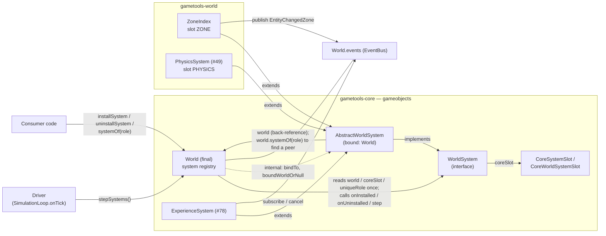
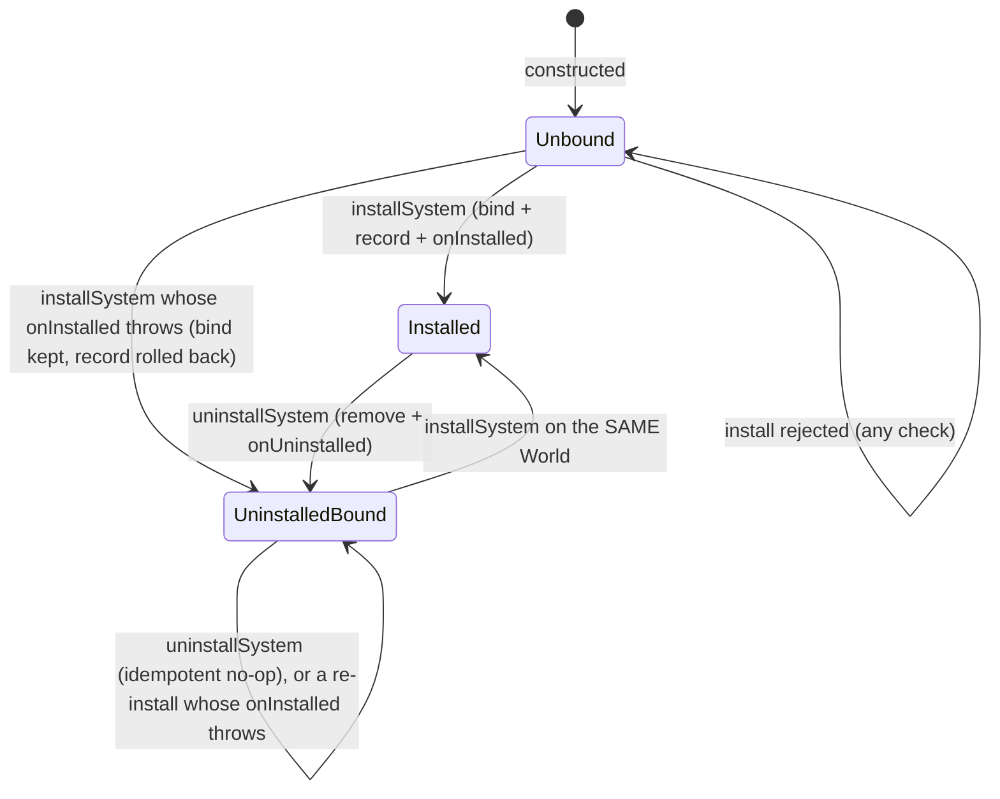

# Architecture: `WorldSystem` Binding — a system knows its `World`; `ZoneIndex` is the zone system

## Header / Association

- **Covers:** [SpartanLabsGaming/MyGameTools#77](https://github.com/SpartanLabsGaming/MyGameTools/issues/77)
  — the zone `WorldSystem` — and the rework of #76's already-merged `WorldSystem` core (PR #130)
  that #77's design pass showed it needs. Touches #78 (`ExperienceSystem`), #79 (graduation) and
  #80 (physics `WorldSystem`) as consequences only. Since the user's decisions of 2026-10-04 and
  2026-10-05 (C23–C34) it also covers unit 3: `TiledMap`'s keyed lookups return `Result`, and `ZoneGrid.zoneAt`'s unclamped
  miss gets a stackless type of its own. The user judged that a small decision rather than an issue of
  its own, so it is recorded as part of #77's design.
- **What this designs:** replaces "the `World` is a per-call parameter of every hook" with "a
  system is bound to exactly one `World` and reads it as `system.world`", adds an
  `AbstractWorldSystem` base class that holds that binding, moves uniqueness from an in-hook guard
  to a rule the system declares, and folds the zone system into `ZoneIndex` itself. It also adopts
  `Result` over nullable for lookups that can miss (C23), applying it to `ZoneIndex.zoneOf` (C22)
  and to `TiledMap.spawnPoint` / `terrainAt` (C24–C26), and gives each such miss a stackless,
  dedicated exception type — `ZoneGrid.zoneAt`'s included (C30).
- **Status:** systems design. **No open decisions remain** (§13.2), in any of the three units.
  Resolved:
  - OD1–OD4, by the user on 2026-09-30;
  - OD4a–OD4c, the API-shape details of OD4's lookup, on 2026-10-01;
  - OD5 and OD6 (the `systemOf` miss type; `zoneOf`'s `Result`) on 2026-10-02;
  - OD7 (`TiledMap`'s nullable lookups) on 2026-10-04;
  - OD8–OD10 (`OutOfGridException`'s payload and constructor; `ZoneGrid.zoneAt`'s miss) on
    2026-10-04;
  - OD11 (whether `UnzonedPointException` also copies its point on every read) on 2026-10-05.
  
  All are folded in: §13.1 records them, and §1.2 carries them as binding constraints C14–C39,
  together with the directives that close no OD (among them C35–C39, from the QA pass of 2026-10-06
  to 2026-10-08).
  Implementation plans:
  - `docs/plans/87-world-systems/77-zone-world-system/plan-world-system-binding.md` (unit 1);
  - `docs/plans/87-world-systems/77-zone-world-system/plan-zone-world-system.md` (unit 2, which replaces the superseded #77 plan of the same
    name);
  - `docs/plans/87-world-systems/77-zone-world-system/plan-tiled-map-result-lookups.md` (unit 3, "Result lookups: `TiledMap` + `ZoneGrid.zoneAt`").
  
  They are aligned against each other in §14 (latest pass 2026-10-04, updated 2026-10-05).
  Planner-owned edits to older documents, all approved by the user and applied:
  - §11.2, approved on 2026-10-01 and applied the same day;
  - §11.3, the C21–C22 callouts, approved on 2026-10-02 and applied;
  - §11.4, unit 3's callouts, approved on 2026-10-04 and applied;
  - §11.5, the C30 callout, approved on 2026-10-05 and applied.
  
  These correct older documents only and block no unit. No source, test, or build file has been
  modified by this document.
- **Baseline:** branch `feature/77-zone-world-system` at `b5e57b0`, plus an uncommitted
  working-tree implementation of the earlier #77 plan (`ZoneWorldSystem`, an `internal`
  `ZoneIndex` constructor and `refresh`, and their tests and doc edits). That implementation is
  **superseded** by this document. Latest tag `v5.1.0`; #76 and #47 are unreleased. *(2026-10-04:
  unit 1's Step 0 has parked that implementation in its path-limited stash, and units 1 and 2 are
  implemented, uncommitted, in the working tree; unit 3's anchors were verified against that tree.)*
- **Supersedes, in part:** `docs/plans/87-world-systems/architecture.md` (§4.2, §4.4, §4.5,
  §4.6, §4.8 and their rows in §6, §8, §10) and `docs/plans/87-world-systems/76-world-system-core/architecture.md` (§4.2
  reservation, the mid-install visibility guarantee, the multi-`World` policy), and — since
  2026-10-04 — `docs/plans/86-phase-1-map-and-space/46-map-model/plan.md`'s nullable `terrainAt(point)` / `spawnPoint(name)`
  design and `docs/plans/86-phase-1-map-and-space/47-zones/plan.md`'s stack-traced `IndexOutOfBoundsException` for
  `zoneAt(point, clamped = false)`. The callouts those documents need are listed in §11 of this one;
  this document does not edit them.
- **Related docs:** `docs/plans/87-world-systems/77-zone-world-system/plan-world-system-binding.md`, `docs/plans/87-world-systems/77-zone-world-system/plan-zone-world-system.md` and
  `docs/plans/87-world-systems/77-zone-world-system/plan-tiled-map-result-lookups.md` (this design's three unit plans; the second replaces the
  superseded #77 plan of the same name), `docs/plans/86-phase-1-map-and-space/46-map-model/plan.md`,
  `docs/plans/86-phase-1-map-and-space/47-zones/plan.md`, `docs/plans/87-world-systems/76-world-system-core/plan.md`, `docs/plans/87-world-systems/78-experience-system/plan.md`,
  `docs/plans/87-world-systems/79-world-system-graduation/plan.md`, `docs/plans/87-world-systems/80-physics-world-system/superseded/plan-2026-09-30.md`,
  `docs/plans/86-phase-1-map-and-space/49-physics/architecture.md`.

---

## 1. Requirements

### 1.1 The settled ask

Make a `WorldSystem` know the `World` it serves, so a system's hooks need no `World` argument and
a system that keeps per-`World` state (zone bookkeeping keyed by `EntityId`, a body registry, an
event subscription) is structurally unable to be pointed at a second `World`. Make `ZoneIndex`
itself the zone system. Everything lands inside #77's one PR. On 2026-10-02 the ask grew by one
read: `ZoneIndex.zoneOf` returns a `Result<Zone>`, its miss an `UnzonedEntityException` (C22). On
2026-10-04 it grew by a convention and a third unit: lookups that can miss return `Result` rather
than a nullable (C23). `TiledMap.spawnPoint` and `TiledMap.terrainAt` do so, and `TerrainLayer`'s
off-grid miss becomes a stackless `OutOfGridException` (C24–C26). All of it lands last, as unit 3
(C27). The same day's answers to unit 3's questions settled `OutOfGridException`'s payload and
constructor (C28, C29), gave `ZoneGrid.zoneAt`'s unclamped miss a stackless type of its own,
`UnzonedPointException` (C30), and widened unit 3 to carry it (C31).

### 1.2 Binding constraints (the user's decisions — not re-litigated)

- **C1.** `WorldSystem` (gametools-core, `com.spartanlabs.gaming.gameobjects`) stays an interface
  with `val world: World` and parameterless no-op-default hooks `onInstalled()`, `onUninstalled()`,
  `step()`. They replace #76's `installOn(world)`, `uninstallFrom(world)`, `step(world)`. The
  optional tier-1 `coreSlot: CoreSystemSlot?` is unchanged.
- **C2.** `world.installSystem(system)` does everything itself, in this order: (1) all checks —
  already installed or re-entrant; core slot free; the system is not bound to a different `World`
  (`IllegalArgumentException`); uniqueness; (2) bind `system.world`; (3) record the system in step
  order; (4) only then call `onInstalled()`, a notification that cannot reject the install by
  returning. A *throwing* `onInstalled()` rolls the record back (C14).
- **C3.** `uninstallSystem` removes the record, then calls `onUninstalled()`; idempotent no-op if
  the system is absent. The binding is **kept** (bind-for-life); re-install on the same `World`
  stays legal.
- **C4.** `abstract class AbstractWorldSystem : WorldSystem` holds lateinit world storage. Only
  `World` binds it, through a hook `internal` to gametools-core. A system can be constructed
  before it has a `World`.
- **C5.** A direct implementor (a class that must extend another class) supplies `world` itself
  and must know its `World` before install. `World` checks `system.world === this` and rejects a
  mismatch with `IllegalArgumentException`.
- **C6.** A system already bound to a different `World` gets `IllegalArgumentException` from
  `installSystem`, checked before binding and hooks. There is **no** public `isBound`.
- **C7.** Uniqueness is a rule the *system declares* and `World` enforces, rejecting a second
  system before binding. It replaces #78's in-hook guard
  `require(world.installedSystems.none { it is ExperienceSystem })`.
- **C8.** `WorldSystem` and `AbstractWorldSystem` are Experimental now
  (`@SubclassOptInRequired(ExperimentalGameToolsApi::class)` on **both**) and become
  `@SupportedExtension` at #79. Shipped systems (`ZoneIndex`, `ExperienceSystem`, `PhysicsSystem`)
  are the worked examples and become untagged Stable Core at #79.
- **C9.** `ZoneIndex(grid: ZoneGrid)` **is** the zone `WorldSystem`: extends `AbstractWorldSystem`,
  claims `CoreWorldSystemSlot.ZONE`, has public `zoneOf`/`entitiesIn`, keeps its bookkeeping inside
  `step()` (no separate refresh). `ZoneWorldSystem.kt` is deleted; everything landed or planned
  under that name folds into `ZoneIndex`. `ZoneIndex` carries a class-level
  `@ExperimentalGameToolsApi` until #79.
- **C10.** `ExperienceSystem` (#78) subscribes to `world.events` in `onInstalled()`, cancels in
  `onUninstalled()`, single subscription, no per-`World` map. It declares uniqueness.
- **C11.** `PhysicsSystem` (#49, unbuilt) will itself be the `WorldSystem`; no wrapper/adapter pair
  anywhere. #80 is recorded as "resolved by #49". (GitHub issue #80 is not touched.)
- **C12.** One PR, branch `feature/77-zone-world-system`. #76 (PR #130) and `ZoneIndex` (#47) are
  unreleased and `5.2.0` will not be cut before #77 merges, so reworking them carries no semver
  weight.
- **C13.** Standing: shared test fixture `ZoneFixtures.kt`; website updates wait for Phase 1's
  close (#86); inside #77 remove the unused `GameEvent` import at `EntityChangedZoneTest.kt:7` and
  the `docs/` pointers in the `ZoneGrid.kt:22,26` KDoc; superseded physics docs stay as historical
  record; the 5-level test hierarchy and Audience-Reach KDoc standard apply.

The user's decisions of 2026-09-30 on this document's first-draft open decisions (§13):

- **C14 (OD1 → option b).** If `onInstalled()` throws, `World` rolls the record back and rethrows
  the original exception unchanged. `onUninstalled()` is not called for the failed attempt. The
  binding is kept (bind-for-life), so a retry on the same `World` is legal.
- **C15 (OD2 → option i).** `world.stepSystems()` and `world.uninstallSystem(self)` called from
  inside `onInstalled()` are allowed and documented as legal-but-discouraged. No in-flight guard.
- **C16 (OD3).** `ZoneIndex` and `PhysicsSystem` declare a `uniqueRole` — their own class — so the
  one role-keyed lookup (C17) finds core systems as well as extension systems. The slot check and
  the role check overlap for them; that is accepted.
- **C17 (OD4).** A `World`-side lookup by role, `world.systemOf(role)`, is planned now (not
  deferred), designed within this architecture and keyed on `uniqueRole` per §4.3. Its design is
  §4.4; the user settled its API shape on 2026-10-01 (C18–C20).

The user's decisions of 2026-10-01 on the API shape of `systemOf` (§13.1):

- **C18 (OD4a → option b).** `systemOf` returns `Result<T>`, **not** a nullable: a hit is
  `Result.success(system)`, a miss is `Result.failure(...)`. Which exception the failure carries is
  not decided by the user or forced by this design — it is open decision **OD5** (§13.2).
  *(Resolved 2026-10-02: C21.)*
- **C19 (OD4b → option b).** A reified `world.systemOf<T>()` is added beside the `KClass` form; it
  also returns `Result<T>`.
- **C20 (OD4c → option a).** `systemOf` (both forms) graduates **with the rest of the registry at
  #79**, not separately after a consumer has used it. #79's completeness check — a repo-wide search
  for `ExperimentalGameToolsApi` finds only the marker's own declaration — therefore holds
  unchanged, with `systemOf` in #79's removal list like every other registry member.

The user's decisions of 2026-10-02 on the last two open decisions (§13.1):

- **C21 (OD5 → option c).** A `systemOf` miss carries a dedicated exception type,
  **`MissingWorldSystemException`**. It extends `NoSuchElementException`, carries
  `val role: KClass<out WorldSystem>` (the role that was looked up), and is stackless — it
  overrides `fillInStackTrace` — so a miss is cheap. It lives in a new file
  `MissingWorldSystemException.kt` in gametools-core's `com.spartanlabs.gaming.gameobjects`, is
  `@ExperimentalGameToolsApi`, and graduates with `systemOf` at #79.
- **C22 (OD6 → `Result`).** **`ZoneIndex.zoneOf(entityId)` returns `Result<Zone>`** instead of
  `Zone?`. A miss — the entity is not placed in any zone — is
  `Result.failure(UnzonedEntityException(...))`, never a throw and never `null`.
  **`UnzonedEntityException`** is a new public type in gametools-world's
  `com.spartanlabs.gaming.world.zone`: it extends `NoSuchElementException`, carries
  `val entityId: EntityId`, is stackless, and is `@ExperimentalGameToolsApi` — `ZoneIndex`'s own
  tier (class-level Experimental until #79, C9) — graduating with `ZoneIndex` at #79.
  `entitiesIn(zone)` is unchanged: it still returns a `Set`, empty when the zone has nobody. #77's
  scope expands explicitly to cover this change; `ZoneIndex` (#47) is unreleased and `5.2.0` is not
  cut before #77 merges (C12), so it carries no semver weight.

The user's decisions of 2026-10-04 on `TiledMap`'s keyed lookups (OD7, §13.1). The user judged them
a small decision, not an issue of their own, so they are recorded here as part of #77's design:

- **C23 (standing convention).** Always prefer `Result<T>` over a nullable `T?` for lookups and reads
  that can miss. *(Planner's note: per the user's rule for "always" directives, it governs lookups
  designed or reworked from now on and does not by itself retrofit existing ones. C22 and C24–C26 are
  its explicit applications; §7.6 gives a verdict for every other case.)*
- **C24.** `TiledMap.spawnPoint(name)` returns `Result<SpawnPoint>`. A miss is
  `Result.failure(MissingSpawnPointException(name))`: **`MissingSpawnPointException`** is stackless,
  extends `NoSuchElementException`, and carries `val name: String`.
- **C25.** `TiledMap.terrainAt(point)` returns `Result<TerrainType>`. An off-grid miss carries
  **`OutOfGridException`**: stackless, extends `IndexOutOfBoundsException`. (What it carries and how
  it is constructed are open decisions OD8 and OD9, §13.2.) *(Resolved 2026-10-04: C28, C29.)*
- **C26.** `TerrainLayer.terrainAt(tile)` already returns `Result`, but its miss carries a
  stack-traced `IndexOutOfBoundsException`. It switches to the same `OutOfGridException`, so
  `TiledMap.terrainAt(point)` passes the layer's failure through.
- **C27.** C24–C26 land in the same #77 PR, as a new unit 3 after unit 2. Units 1 and 2 — under
  implementation when this was decided — keep their content and commit order; unit 3 is additive and
  lands last. #46's map model is unreleased (not in `v5.1.0`), so, as with C12, the change carries no
  semver weight.

The user's decisions of 2026-10-04 on unit 3's open questions (OD8–OD10, §13.1), with two further
directives:

- **C28 (OD8 → a).** `OutOfGridException` carries `val tile: TileIndex`. `TiledMap.terrainAt(point)`
  stays a pure pass-through of `TerrainLayer.terrainAt`'s failure.
- **C29 (OD9 → i).** `OutOfGridException`'s constructor is `(tile)` only. The message is built inside
  the type, e.g. `tile (4, 3) is outside the terrain grid`.
- **C30 (OD10 → b).** `ZoneGrid.zoneAt(point, clamped = false)` fails with a stackless type of its
  own, **`UnzonedPointException`**, instead of the stack-traced `IndexOutOfBoundsException`. The type
  is:
  - `final` and stackless, extending `IndexOutOfBoundsException`;
  - built with a public constructor `(point)` only, the message built inside the type, no cause;
  - carrying `val point: Point`, defensively copied because `Point` is mutable;
  - untagged, matching `ZoneGrid` — Stable Core from the first release containing #47.
- **C31.** Unit 3 becomes "Result lookups: `TiledMap` + `ZoneGrid.zoneAt`" and carries C30 as an
  additive commit after unit 2. Unit 2 is implemented and green; its plan's content does not change.
- **C32.** Unit 3's docs commit also adds the missing `TileIndex` to the README and CONTRIBUTING map
  lists.
- **C33 (standing documentation rule).** Cite documents by section and code by symbol or region
  (e.g. `ZoneIndex.step`, "`TiledMap.isWalkable`"), never `file:line` or a bare line number. It
  applies to everything written from 2026-10-04 on; units 1 and 2 and older documents are not swept.

The user's decision of 2026-10-05 on unit 3's last open question (OD11, §13.1). The same answer kept
unit 3's plan at `docs/plans/87-world-systems/77-zone-world-system/plan-tiled-map-result-lookups.md` with its slug unchanged, and approved
§11.5:

- **C34 (OD11 → a).** `UnzonedPointException` copies its point once, when it is built
  (`val point: Point = Point(point)`). Every read returns that same copy; a read does not copy again.

The user's decisions of 2026-10-06 and 2026-10-08 on findings from the QA pass (§13.1). They close
no OD:

- **C35 (2026-10-06).** `ZoneIndex.step` iterates a snapshot of `World.gameObjects`, as
  `World.tick` does, so an `EntityChangedZone` listener may add or remove objects during a step.
  Those changes are seen on the next step.
- **C36 (2026-10-06).** `ZoneGrid` copies its origin `Point` at construction, so a later change to
  the space's bounds cannot move the grid.
- **C37 (2026-10-08).** `Zone` stays a data class, but `equals` and `hashCode` use only `name`,
  `column` and `row`. `bounds` is shared, mutable GeneralTools geometry and is not part of a zone's
  identity; GeneralTools#8 tracks read-only views of `Point` and `Square`.
- **C38 (2026-10-08).** `StaticGeometry.blocksPoint` becomes an indexed loop with no iterator
  allocation, in its own `perf(world)` commit in this PR. The indexed loop runs only when
  `obstacles` is `RandomAccess`; any other `List` falls back to `any { }`, so a linked list cannot
  make it quadratic (user decision, 2026-10-08).
- **C39 (2026-10-08).** `AbstractWorldSystem.world`'s runtime error message is reworded to match
  the binding KDoc: a system is bound by the first `World.installSystem` call whose checks pass.

### 1.3 Acceptance shape

A `World` that installs nothing behaves exactly as before. A system written against the new
contract can be constructed with no `World`, installed once, reads `world` from its hooks and from
`step()`, and cannot be installed on a second `World`. A second `ExperienceSystem` on one `World`
is rejected by `World` before any of its code runs. `ZoneIndex` installed on a `World` and driven
by `stepSystems()` publishes `EntityChangedZone` exactly as the earlier `ZoneWorldSystem` did. A
system whose `onInstalled()` throws is absent from `installedSystems` afterwards, is never
stepped, and is still bound. `world.systemOf<ZoneIndex>()` (or the `KClass` form) returns the
installed `ZoneIndex` as `Result.success`, and a lookup for a role no installed system declared
returns `Result.failure` carrying a `MissingWorldSystemException` whose `role` is the role looked up
(C21). `zoneIndex.zoneOf(id)` returns `Result.success(zone)` for an entity the most recent step
placed, and otherwise `Result.failure` carrying an `UnzonedEntityException` for that `id` (C22).
Neither lookup throws or returns `null`, and neither exception carries a stack trace. Unit 3's
lookups behave the same way:
- `map.spawnPoint(name)` is `Result.success` for a registered name and otherwise a failure carrying
  a `MissingSpawnPointException` for `name` (C24).
- `map.terrainAt(point)` is `Result.success` for an in-grid tile and otherwise the
  `OutOfGridException` failure of `TerrainLayer.terrainAt`, carrying the tile and passed through
  (C25, C26, C28).
- `map.isWalkable(point)` answers exactly as before.
- `grid.zoneAt(point, clamped = false)` for a point outside the grid is a failure carrying an
  `UnzonedPointException` whose `point` equals, but is not, the queried point (C30).

None of the three exceptions carries a stack trace.

---

## 2. Research findings applied

Only the conclusions that moved a decision. The planner's full synthesis is not restated.

1. **A container-set back-reference, one world per instance, is the dominant pattern.** Artemis
   sets `BaseSystem.world` from `WorldConfiguration`; Unity sets `SystemBase.World`; Ashley sets
   `EntitySystem.engine` (and also passes it per call); Fleks binds at construction. Bevy and Flecs
   pass the world per call. Neither Ashley nor Artemis guards reuse across worlds — the
   `IllegalArgumentException`-on-a-different-`World` rule is stricter than the field, which is what
   `ZoneIndex`'s `EntityId`-keyed bookkeeping needs. This is why hooks lose their `World`
   parameter (C1) and why the binding is checked, not merely stored (C6).
   Sources: [Artemis `WorldConfiguration`](https://raw.githubusercontent.com/junkdog/artemis-odb/master/artemis-core/artemis/src/main/java/com/artemis/WorldConfiguration.java),
   [Ashley `SystemManager`](https://raw.githubusercontent.com/libgdx/ashley/master/ashley/src/com/badlogic/ashley/core/SystemManager.java),
   [Fleks `world.kt`](https://raw.githubusercontent.com/Quillraven/Fleks/master/src/commonMain/kotlin/com/github/quillraven/fleks/world.kt).
2. **Record, then notify — and a throwing hook is where the engines part ways.** Ashley, Fleks and
   Unity all record before the registration hook so it can see itself and its peers (Unity
   documents this as two-phase construction). Ashley and Fleks then leave a throwing system
   registered, by code order rather than documented intent. Unity Entities deliberately catches,
   removes the system again, skips its teardown hook and rethrows. This split is why OD1 existed;
   the user chose Unity's roll-back (C14).
   Source: [Unity Entities `WorldUnmanaged.cs`/`World.cs`](https://raw.githubusercontent.com/needle-mirror/com.unity.entities/master/Unity.Entities/WorldUnmanaged.cs).
   Fleks PR [#145](https://github.com/Quillraven/Fleks/pull/145) adds that re-add after remove
   re-runs hook logic, so `onUninstalled` must fully undo whatever `onInstalled` registered.
3. **Uniqueness: opt-in, key declared by the system, reject — never replace.** Exact-class
   uniqueness is universal (Ashley replaces; Artemis and Fleks reject); Bevy defaults to unique
   with an opt-out and rejects; Unity is opt-in; Ktor keys plugins with `Plugin.key` and throws
   `DuplicatePluginException`. Fleks has a wart worth avoiding: uniqueness is checked by exact class
   but lookup uses `is T`. This design uses one key for both.
   Source: [Ktor `ApplicationPlugin.kt`](https://raw.githubusercontent.com/ktorio/ktor/main/ktor-server/ktor-server-core/common/src/io/ktor/server/application/ApplicationPlugin.kt).
4. **Kotlin facts (compile-verified on 2.2.0) that fix the shape of `AbstractWorldSystem`.**
   `lateinit var world … internal set` compiles to a **public JVM field**
   (`javap`: `public World world;`), so Java code in another module could bind it and bypass
   `World`; `lateinit` also cannot be reset and reads before init throw a poor
   `UninitializedPropertyAccessException`. Hence a *private* lateinit behind a `final` getter with a
   clear message and a `@JvmSynthetic internal` bind hook. `@SubclassOptInRequired` must sit on
   both the interface and the abstract class (`@OptIn` on the abstract class would leak the
   requirement away). `KClass ==` and `KClass.isInstance` work without `kotlin-reflect`, which main
   code may not use. A base-class `init` must never read open members. Docs:
   [Java-to-Kotlin interop](https://kotlinlang.org/docs/java-to-kotlin-interop.html),
   [opt-in requirements](https://kotlinlang.org/docs/opt-in-requirements.html).
5. **A keyed system lookup: nullable is the common core, exact keys are the norm, and a throwing
   default tends to grow an `OrNull` twin later** (added 2026-09-30 for C17). Artemis-odb
   (`<T extends BaseSystem> T getSystem(Class<T>)`) and Ashley (`getSystem(Class<T>)`) return
   `null` on a miss and match the exact class; Unity Entities' `GetExistingSystemManaged<T>()`
   returns `null`. Ktor pairs a throwing `plugin(key)` (`MissingApplicationPluginException`, an
   `IllegalStateException`) with `pluginOrNull(key)`; Koin pairs `get<T>()` / `getOrNull<T>()`;
   Bevy pairs a panicking `resource::<R>()` with `get_resource::<R>() -> Option`. Fleks shipped
   only a throwing `system<T>()` and had to add `systemOrNull`/`contains` later
   ([PR #146](https://github.com/Quillraven/Fleks/pull/146)) — and its lookup uses `is T` while its
   duplicate check uses the exact class, the wart §4.3 avoids. Kotlin's own guidance points the
   same way for a single-cause miss: the `Result` KEEP says to use "nullable types, when these
   failures do not carry additional business meaning"
   ([result.md](https://github.com/Kotlin/KEEP/blob/master/proposals/stdlib/result.md)).
   Compile- and run-verified on Kotlin 2.2.0 with `kotlin-stdlib` alone: a public
   `fun <T : WorldSystem> systemOf(role: KClass<T>): T?` and an
   `inline fun <reified T : WorldSystem> systemOf(): T?` coexist as members of a final class, the
   inline one needs its own opt-in annotation and no `@PublishedApi`; `role.java.cast(x)` and
   `kotlin.reflect.cast` both type the result without `kotlin-reflect`; `KClass ==` (never `===`)
   and `isInstance` work without it; a role `Base` declared by a `Derived` system is found by
   `systemOf<Base>()` and missed by `systemOf<Derived>()`; Java can call only the `KClass` form, and
   a `Result<T>` return is name-mangled (`systemOf-<hash>`) and erased to `Object` for Java callers.
   Without `kotlin-reflect`, `KClass.toString()` prints "(Kotlin reflection is not available)", so
   every message that names a role uses `role.java.name` or `simpleName`, never `role` itself.
   *(2026-10-02: the nullable shape this finding pointed to was not taken. The user chose `Result`
   for `systemOf` (C18) and for `ZoneIndex.zoneOf` (C22), each miss carrying a dedicated, stackless
   `NoSuchElementException` subclass that names the missed key (C21, C22; §4.5).)*
   Sources: [Artemis `World.java`](https://github.com/junkdog/artemis-odb/blob/master/artemis-core/artemis/src/main/java/com/artemis/World.java),
   [Ashley `SystemManager.java`](https://github.com/libgdx/ashley/blob/master/ashley/src/com/badlogic/ashley/core/SystemManager.java),
   [Ktor `ApplicationPlugin.kt`](https://github.com/ktorio/ktor/blob/main/ktor-server/ktor-server-core/common/src/io/ktor/server/application/ApplicationPlugin.kt),
   [Koin `Scope.kt`](https://github.com/InsertKoinIO/koin/blob/main/projects/core/koin-core/src/commonMain/kotlin/org/koin/core/scope/Scope.kt),
   [Fleks `world.kt`](https://github.com/Quillraven/Fleks/blob/master/src/commonMain/kotlin/com/github/quillraven/fleks/world.kt),
   [Unity `GetExistingSystemManaged`](https://docs.unity3d.com/Packages/com.unity.entities@1.0/api/Unity.Entities.World.GetExistingSystemManaged.html),
   [Bevy `World`](https://docs.rs/bevy/latest/bevy/ecs/world/struct.World.html).

---

## 3. Current state (verified in the working tree)

- **Hook call sites.** The only callers of the three hooks are `World.kt:395` (`installOn(this)`),
  `:434` (`uninstallFrom(this)`) and `:477` (`step(this)`). The registry is a single ordered list of
  `InstalledSystemRecord` (`World.kt:304,320`); ordering never depends on a hash of a slot
  (`World.kt:314-320`) — that determinism property must survive this rework.
- **Reservation machinery.** `Reservation` (`World.kt:309-311`), `installReservations`
  (`:322-327`), consulted at `:384,:390,:393-398`. It exists only because #76 runs a user hook
  *between* "checks passed" and "recorded". Under C2's order no user code runs in that window.
- **Only main-code implementer.** `ZoneWorldSystem.kt` (untracked); `WorldSystem.kt` itself
  carries the multi-`World` policy in KDoc (`:19-22`) that this design reverses.
- **`ZoneIndex`** at `HEAD` is a public class with a public constructor and public `refresh`
  (commit `a0f1717`); the working tree narrows both to `internal`. Its bookkeeping is keyed by
  `EntityId` and has no reset (`ZoneIndex.kt:21-24`), which is the whole reason bind-for-life exists.
- **Stale wording.** `CoreSystemSlot.kt:15` and `:39` say "adapter"; the working-tree edit at `:42`
  names `ZoneWorldSystem`.
- **The uncommitted code on top of `HEAD` is disposable; the uncommitted doc edits are not
  uniformly so.** `ZoneWorldSystem.kt`, its four tests, `ZoneFixtures.kt` and the `ZoneIndex`
  narrowing are not in any commit (`git status`), so landing order is not constrained by a
  committed intermediate state (§10). Unit 1's Step 0 parks that code — and the superseded README,
  CHANGELOG and CONTRIBUTING hunks — in one path-limited stash, recoverable until the PR merges
  (`docs/plans/87-world-systems/77-zone-world-system/plan-world-system-binding.md` §4.0). The uncommitted Markdown edits in `docs/` mix two things: wording for
  the superseded `ZoneWorldSystem` / `internal ZoneIndex` design (to be rewritten), and the user's
  2026-09-28 decision that every World Systems website update waits for Phase 1's close (#86),
  which is still true and must be kept (e.g. `docs/plans/87-world-systems/76-world-system-core/architecture.md` I2/R8/F1,
  `docs/plans/87-world-systems/76-world-system-core/plan.md` F1, `docs/plans/87-world-systems/79-world-system-graduation/plan.md`'s Website bullet).
  §11 classifies them per document.
- **No `World`-side lookup exists.** A system can be found today only by scanning
  `installedSystems`; no main-code caller does so (the only planned one, #78's uniqueness guard at
  `docs/plans/87-world-systems/78-experience-system/plan.md:359`, is replaced by `uniqueRole`, not by a lookup).
- **Tests asserting behaviour this rework removes.** In
  `gametools-core/.../component/gameobjects/WorldInstallSystemTest.kt`: `:59` (installedSystems
  excludes the system during the hook), `:95`, `:105`, `:118`, `:229` (failure-atomic install),
  `:208` (helper recorded before the outer system), `:219` (self-uninstall inside the hook is a
  no-op). And `WorldSystemEventBusIntegrationTest.kt:84` (one instance on two `World`s).
- **`ExperienceSystem` does not exist in source yet**; its plan (`docs/plans/87-world-systems/78-experience-system/plan.md:356`)
  holds a per-`World` `IdentityHashMap<World, Subscription>` and the in-hook uniqueness guard.
- **No other module** references `WorldSystem` (`gametools-net`, the umbrella, and `website/` are
  clean) — no cross-repo surface.

---

## 4. System inventory

| System | Module / package | Owns | Does not own |
|---|---|---|---|
| **`WorldSystem`** (reworked) | `gametools-core` / `gameobjects` | The contract: `world`, the three hooks, `coreSlot`, `uniqueRole` (which is also the key `World.systemOf` looks up). | Storing the `World` (that is the base class or the implementor); scheduling. |
| **`AbstractWorldSystem`** (new) | `gametools-core` / `gameobjects` | The write-once binding to one `World`, set by the first `installSystem` call whose checks pass, and the clear failure when `world` is read before that (its message says so, C39); the `internal` bind/inspect hooks `World` uses. | Any check, any ordering, any hook behaviour — it is storage plus a guarded getter. |
| **`World` system registry** (reworked members of the existing `final class World`) | `gametools-core` / `gameobjects` | The whole install protocol (checks → bind → record → notify, with roll-back of a throwing notify), uninstall, step order, slot occupancy, uniqueness enforcement, binding-mismatch enforcement, and the role-keyed lookup `systemOf` (§4.4), whose miss is a `Result.failure` carrying a `MissingWorldSystemException`. | Any system's behaviour; deciding what a system's uniqueness *means* (the system declares it). |
| **`MissingWorldSystemException`** (new, C21) | `gametools-core` / `gameobjects` | The failure a `systemOf` miss carries: the looked-up `role`, a message naming it by `role.java.name`, no stack trace (§4.4, §4.5). | Being thrown by `systemOf` — it never is; a caller's `getOrThrow()` throws it. |
| **`CoreSystemSlot` / `CoreWorldSystemSlot`** (KDoc only) | `gametools-core` / `gameobjects` | Unchanged: the closed set of tier-1 slots. | — |
| **`ZoneIndex`** (now a system) | `gametools-world` / `world.zone` | Zone bookkeeping, refreshed once per `stepSystems()` from the `ZONE` slot, publishing `EntityChangedZone`; each step iterates a snapshot of `World.gameObjects`, so a listener's additions and removals are seen on the next step (C35); the public reads `zoneOf` (a `Result<Zone>`, C22) and `entitiesIn` (a `Set`), §4.5; declares `uniqueRole = ZoneIndex::class` (C16), so `world.systemOf(ZoneIndex::class)` finds it. | Its binding (inherited). |
| **`UnzonedEntityException`** (new, C22) | `gametools-world` / `world.zone` | The failure a `zoneOf` miss carries: the queried `entityId`, a message naming it, no stack trace (§4.5). | Being thrown by `zoneOf` — it never is. |
| **`TiledMap`'s keyed lookups** (reworked, unit 3: C24, C25) | `gametools-world` / `world.map` | `spawnPoint(name)` → `Result<SpawnPoint>`; `terrainAt(point)` → `Result<TerrainType>`, passing `TerrainLayer`'s failure through; `isWalkable` folds it, answering as before (§4.6). | The grid bounds check (that is `TerrainLayer`'s). |
| **`TerrainLayer.terrainAt`** (miss type changed, unit 3: C26) | `gametools-world` / `world.map` | The grid bounds check, failing with `OutOfGridException` (§4.6). | — |
| **`StaticGeometry.blocksPoint`** (allocation-free, C38) | `gametools-world` / `world.map` | The same answers, from an indexed loop rather than an iterator, so it adds no allocation to `isWalkable`'s path. | — |
| **`MissingSpawnPointException`** (new, C24) | `gametools-world` / `world.map` | The failure a `spawnPoint` miss carries: the looked-up `name`, a message naming it, no stack trace. Untagged, like `TiledMap` (§4.6). | Being thrown by `spawnPoint` — it never is. |
| **`OutOfGridException`** (new, C25, C26, C28, C29) | `gametools-world` / `world.map` | The failure an off-grid terrain lookup carries: the looked-up `tile`, a message naming it, no stack trace; an `IndexOutOfBoundsException`. Constructor `(tile)` only. Untagged (§4.6). | Being thrown by either lookup — it never is. |
| **`ZoneGrid.zoneAt`** (miss type changed, unit 3: C30) | `gametools-world` / `world.zone` | With `clamped = false`, a point outside the grid fails with `UnzonedPointException` instead of a stack-traced `IndexOutOfBoundsException` (§4.6). The grid answers from its own copy of the space's origin, taken at construction (C36). | Its caller's handling — `ZoneIndex.step` unwraps with `getOrNull()` and never inspects the type. |
| **`Zone`** (identity changed, C37) | `gametools-world` / `world.zone` | A grid cell, still a data class; `equals`/`hashCode` use only `name`, `column` and `row`, so a zone stays a stable key for `ZoneIndex` even if its `bounds` are mutated in place. | Its `bounds`: shared, mutable GeneralTools geometry, not part of identity (GeneralTools#8 tracks read-only views). |
| **`UnzonedPointException`** (new, C30) | `gametools-world` / `world.zone` | The failure an out-of-grid `zoneAt(…, clamped = false)` carries: a defensive copy of the queried `point`, a message naming it, no stack trace; an `IndexOutOfBoundsException`. Untagged, like `ZoneGrid` (§4.6). | Being thrown by `zoneAt` — it never is. |
| **`ExperienceSystem`** (#78, consequence) | `gametools-core` / `gameobjects.combat` | One subscription to `world.events`, lifecycle via the two hooks; declares `uniqueRole = ExperienceSystem::class`. | Credit policy (the grantor's). |
| **`PhysicsSystem`** (#49, consequence) | `gametools-world` / `world.physics` (per #49) | Physics, and by C11 it is itself the `WorldSystem` claiming `PHYSICS`; declares `uniqueRole = PhysicsSystem::class` (C16). | — |

`ZoneWorldSystem` is **removed** from the inventory: nothing wraps `ZoneIndex`.

### 4.1 `WorldSystem` (contract sketch)

```kotlin
@SubclassOptInRequired(ExperimentalGameToolsApi::class)
interface WorldSystem {
    val world: World                       // the one World this system serves; read-only to a consumer
    fun onInstalled() {}                   // notification: recorded and bound before this runs
    fun onUninstalled() {}                 // undo whatever onInstalled acquired
    fun step() {}                          // once per World.stepSystems() while installed
    @ExperimentalGameToolsApi val coreSlot: CoreSystemSlot? get() = null
    @ExperimentalGameToolsApi val uniqueRole: KClass<out WorldSystem>? get() = null   // new, read once; also the systemOf key
}
```

`world` is abstract and non-defaulted: a system that has no `World` yet must say so by throwing
from the getter (an `AbstractWorldSystem` does; a direct implementor may). `uniqueRole` and
`coreSlot` are read exactly once, at install, and must be constant for the object's life. Adding
`uniqueRole` as a defaulted member is binary-safe under Kotlin 2.2's default `-jvm-default=enable`,
and moot anyway while unreleased. `uniqueRole` does two jobs with one key: it makes the system
unique on its `World`, and it is the key under which `World.systemOf` (§4.4) finds it. A system
that declares no role is never found by that lookup.

### 4.2 `AbstractWorldSystem` (contract sketch)

```kotlin
@SubclassOptInRequired(ExperimentalGameToolsApi::class)
abstract class AbstractWorldSystem : WorldSystem {
    private lateinit var bound: World
    final override val world: World get() {
        check(::bound.isInitialized) { "${this::class.simpleName ?: this::class.java.name}.world was read before any World.installSystem call for this system passed its checks" }   // wording per C39
        return bound
    }
    @JvmSynthetic internal fun bindTo(world: World)          // write-once; World is the only caller
    @JvmSynthetic internal fun boundWorldOrNull(): World?    // lets World inspect without throwing
}
```

Why not the "public lateinit with an `internal set`" example: it compiles to a public JVM field
(§2 finding 4), is not write-once, and gives a poor pre-install error. Storage is still a lateinit
and still bound only through an `internal` hook; only the exposure differs. `world` is `final` so a
subclass cannot lie to `World`'s mismatch check. The class is deliberately behaviourless beyond the
binding: it is a helper for the common case, not a seam a consumer must extend — `WorldSystem`
remains the substitution point.

### 4.3 Rules the registry enforces

- **Bind-for-life.** Binding happens the first time an install passes all its checks (step 5 of
  §5.1, before `onInstalled()` runs) and is never undone — not by `uninstallSystem`, and not by
  the roll-back of an `onInstalled()` that throws (C14). A retry on the same `World` is legal;
  any other `World` is rejected. The system object therefore keeps its `World` reachable after
  uninstall (see §12).
- **One key for uniqueness and lookup.** `uniqueRole` is the single key used for both the
  duplicate check and `World.systemOf` (§4.4), so the Fleks exact-class-versus-`is` mismatch cannot
  arise. The author chooses the granularity: exact class = `override val uniqueRole = Me::class`;
  a family of interchangeable implementations = a shared base type or interface. `World` rejects a
  role that is not a supertype of the system (`role.isInstance(system)` false — a copy-paste
  guard) and a role equal to an installed system's. Reject, never replace. The shipped systems all
  declare their own class: `ZoneIndex::class`, `PhysicsSystem::class` (C16) and
  `ExperienceSystem::class`, so the one lookup finds core (slot-claiming) systems as well as
  extension systems.
- **Slot and role overlap (C16, accepted).** For a slot-claiming system that also declares a role,
  both checks guard the same thing. The slot check runs first (§5.1 step 3), so a second
  `ZoneIndex` on one `World` is rejected with a message naming the `ZONE` slot, and the role check
  never runs for it. A consumer's substitute zone system that claims `ZONE` under its own role is
  likewise rejected by the slot check while a `ZoneIndex` is installed.
- **Roll-back of a throwing `onInstalled()` (C14).** `World` removes *this attempt's own record*,
  if it is still present, and marks it inactive; the slot and the role are released with it
  (both are derived from the record list). It does not call `onUninstalled()`. It keeps the
  binding. It rethrows the original exception unchanged. Helpers the failing hook installed stay
  installed (#76's existing rule: the system cleans up its own partial work before throwing). If
  the hook already uninstalled its own system (legal, C15), there is nothing to roll back — and if
  it then re-installed itself, that newer record completed its own `onInstalled()` and is not
  touched: roll-back targets the failed attempt's record by identity, never another record of the
  same instance (records are per-install, as #76's R9 already established).
- **Re-entrancy while `onInstalled()` runs (C15).** Because the system is recorded before its
  hook, two calls that were impossible under #76 are now possible, and both are legal and
  documented as discouraged: `world.stepSystems()` (when no step pass is already running — R2
  still rejects re-entry from a `step()`) steps the just-recorded system before its `onInstalled()`
  has returned; `world.uninstallSystem(self)` removes it and runs `onUninstalled()` before
  `onInstalled()` returns. No in-flight counter or guard exists.
- **Exceptions.** Every rejection is `IllegalArgumentException`, matching `World`'s existing
  preconditions and the `TiledMap.addSpawnPoint`/`ZoneGrid` precedent. A dedicated `IAE` subtype
  could be added later additively; not now. A message that names a role uses `role.java.name` (or
  `simpleName`), never the `KClass` itself, whose `toString()` without `kotlin-reflect` reads
  "(Kotlin reflection is not available)" (§2 finding 5). A `systemOf` miss is not a rejection and
  throws nothing: it returns `Result.failure` (C18) carrying a `MissingWorldSystemException` (C21,
  §4.4).

### 4.4 `World.systemOf` — the role-keyed lookup (C17)

**What it is for.** A system that needs a peer (a zone-aware system reading `ZoneIndex`; a future
interest filter), or consumer code that wants a shipped system without threading its own
reference around, asks the `World` for "the system that holds this role". Before C17 the only way
was to scan `installedSystems` with `is` — exactly the exact-class-versus-`is` split that §4.3's
one-key rule exists to prevent.

**Contract sketch** (C17–C21):

```kotlin
// Two members of the existing final class World.
@ExperimentalGameToolsApi
fun <T : WorldSystem> systemOf(role: KClass<T>): Result<T>    // hit: success(system); miss: failure(MissingWorldSystemException(role))

@ExperimentalGameToolsApi                                       // the inline member needs its own marker
inline fun <reified T : WorldSystem> systemOf(): Result<T> = systemOf(T::class)

// New file gametools-core/.../gameobjects/MissingWorldSystemException.kt (C21; shape shared with UnzonedEntityException, §4.5)
@ExperimentalGameToolsApi
class MissingWorldSystemException(val role: KClass<out WorldSystem>) :
    NoSuchElementException("no system installed on this World declared uniqueRole ${role.java.name}") {
    override fun fillInStackTrace(): Throwable = this         // stackless: a miss costs two small allocations (this and its Result box), no stack walk
}
```

**Decided properties, and what forces each:**

| Property | Decided as | Forced by |
|---|---|---|
| Home | A member of `World`, not an extension function. | It must read the role recorded at install, which lives in the private record list. Re-reading `system.uniqueRole` would break the read-once rule (§4.1) and could disagree with what the duplicate check saw. `installedSystems` exposes systems, not their recorded roles. |
| Matching | Exact key: the record whose recorded role `== role`. Never `role.isInstance(system)`. | §4.3's one-key rule; C17 ("keyed on `uniqueRole` per §4.3"). |
| Consequences of exact matching | A system that declared no role is never found. A system is found only under the role it declared: `ZoneIndex` under `ZoneIndex::class`; a member of a family role under the family type, not under its own class. A consumer's substitute `ZONE` system with its own role is not found under `ZoneIndex::class`. | Same. |
| Result count | At most one system. | The duplicate-role check (§4.3). |
| Result type | `Result<T>`, typed by the role; callers never cast. | The `Result` wrapper is the user's choice (C18). The `T` is forced: the parameter is `KClass<T>` with `T : WorldSystem` (the type of `uniqueRole`), and the install check `role.isInstance(system)` guarantees that the system recorded under `role` is a `T`, so the single cast inside `World` is sound. An untyped `WorldSystem` result would only move an unchecked cast into every caller. `role.java.cast(system)` performs the cast with `kotlin-stdlib` alone (§2 finding 5). |
| Miss | `Result.failure(MissingWorldSystemException(role))`, never a throw and never `null`; the message names the role by `role.java.name`. | C18, C21; §4.3's message rule. |
| Miss exception | `MissingWorldSystemException`: a `NoSuchElementException` — so a handler for that type, like one for the `GameServer.push`/`disconnect` misses, handles it too — carrying `role`; stackless; `final`, with a public constructor taking only the role; `@ExperimentalGameToolsApi`. | Name, parent, `role`, stacklessness, file and tier: the user (C21). `final`, the constructor and the message: §4.5's shape, shared with `UnzonedEntityException`. |
| Forms | The `KClass` form, plus a reified `systemOf<T>()` that delegates to it and returns the same `Result<T>`. | C19. The reified form is `inline`, so it carries its own `@ExperimentalGameToolsApi` and needs no `@PublishedApi` (it calls only the public `KClass` form) — compile-verified (§2 finding 5). |
| Side effects | None — a pure read of the registry. No hook runs; nothing is logged at `INFO`. | It is a query. |
| When callable | From anywhere on the `World`'s thread — outside any hook, and from any `onInstalled()`, `onUninstalled()` or `step()` — with no guard. | Single-threaded like every `World` member; C15 chose no in-flight machinery, and a read needs none. |
| What it sees | The live registry, never a step pass's snapshot. A system finds itself from inside its own `onInstalled()` (it is recorded first, §5.1). It is not found after a roll-back (C14) or an uninstall, although it stays bound. During a step pass, a system uninstalled earlier in the pass is not found, and one installed mid-pass is found although it steps only from the next pass. | §5.1's record-then-notify order; #76's R9 snapshot semantics. |
| Implementation shape | A linear scan of the registry's one ordered record list; no second index. | One source of truth, which roll-back and uninstall already maintain; the determinism rule (§12) forbids iterating a hash-keyed collection; a `World` hosts a handful of systems. |
| Tier | `@ExperimentalGameToolsApi` now — the library's one Experimental marker; no new marker. Graduates **with the rest of the registry at #79** (both forms), and `MissingWorldSystemException` with it (C21). | Now: its key, `uniqueRole`, is itself `@ExperimentalGameToolsApi` (P5), and a lookup cannot promise more stability than its key; every sibling registry member is Experimental until #79. Graduation: the user's decision (C20), which sets aside for this member the library-design rule's "graduate once a consumer has built against it". |
| Lookup by slot | Not provided. | Not asked for; C16 makes every shipped slot-claiming system findable by role. A slot-keyed lookup could be added additively if a consumer needs "whichever system holds `ZONE`". |

**Usage guidance its KDoc must carry (Level 2):**

- Look a peer up when you use it, or be ready for it to disappear: a reference cached in
  `onInstalled()` goes stale if the peer is uninstalled later, and nothing notifies the holder.
- A system that *requires* a peer unwraps the lookup in `onInstalled()` with `getOrThrow()`: if
  the peer is absent, the `MissingWorldSystemException` naming the missing role is thrown, C14's
  roll-back undoes the install, and nothing stays recorded. The exception carries no stack trace
  (C21), so its message — and the roll-back's `WARN` line, which names the system and the cause —
  is the diagnostic. The peer must already be installed when the lookup runs — the lookup neither
  waits for nor orders installs.
- A system that can live without a peer unwraps it with `getOrNull()`, `onSuccess { … }` or
  `fold(…)`. A miss is cheap but not free: it allocates a stackless `MissingWorldSystemException`
  and the `Result` failure box that carries it (no stack walk, C21), so a system that polls for an
  *absent* optional peer on every `step()` pays two small allocations per frame — negligible at the
  design's 10–20 Hz and handful of systems, but the KDoc should say so.

### 4.5 `ZoneIndex`'s reads, and the one shape both exception types share (C21, C22)

```kotlin
// gametools-world, com.spartanlabs.gaming.world.zone — the reads of ZoneIndex (C9, C22)
@ExperimentalGameToolsApi
class ZoneIndex(grid: ZoneGrid) : AbstractWorldSystem() {
    fun zoneOf(entityId: EntityId): Result<Zone>    // hit: success(zone); miss: failure(UnzonedEntityException(entityId)); never throws, never null
    fun entitiesIn(zone: Zone): Set<EntityId>       // unchanged: a fresh copy, empty when nobody is there
}

// New file gametools-world/.../world/zone/UnzonedEntityException.kt (C22)
@ExperimentalGameToolsApi
class UnzonedEntityException(val entityId: EntityId) :
    NoSuchElementException("entity $entityId is not placed in any zone") {   // EntityId prints as #<raw>
    override fun fillInStackTrace(): Throwable = this
}
```

`zoneOf` thereby takes the shape its package-mate `ZoneGrid.zoneAt` already has (`Result<Zone>`,
whose `clamped = false` failure was a stack-traced `IndexOutOfBoundsException`; since C30 it is the
stackless `UnzonedPointException`, still an `IndexOutOfBoundsException` — §4.6) and the shape
`systemOf` has in core. "Not placed in any zone" covers every way an id can miss — never seen by a step, outside the
grid's extent, removed from the `World`, never numbered (`EntityId.UNASSIGNED`), or never assigned
at all; the exception does not tell them apart (C22 gives it only the `entityId`).

What the reads see follows from two QA-driven decisions. `step()` iterates a snapshot of
`World.gameObjects` (C35), so an object an `EntityChangedZone` listener adds during a step is
"never seen by a step" until the next one, and an object it removes is reported as having left on
the next step. And the `Zone` that `zoneOf` returns, and that `entitiesIn` takes, is identified by
its `name`, `column` and `row` alone (C37), so it stays a stable key even if a caller mutates its
shared `bounds` in place.

**One shape for both exception types.** They are the repo's first custom exception types — no main
source in any module declares one today (verified 2026-10-02) — so they set the pattern a later
type will copy, and the two units build them identically. Unit 3's two types copy it too, untagged
(§4.6):

| Property | Both types | Decided by |
|---|---|---|
| Parent | `NoSuchElementException` — the repo's precedent for a by-key miss (`GameServer.kt:282`, `:295`), so a handler for that type handles both | the user (C21, C22) |
| Payload | the missed key as a public `val` (`role`, `entityId`) and nothing else; no cause | the user (the key); planner (no cause) |
| Message | built inside the type from the key: the role by `role.java.name`, never the `KClass` (§4.3); the entity by `EntityId`'s own `toString()`, `#<raw>` | planner |
| Stack trace | none: `override fun fillInStackTrace(): Throwable = this`. `Throwable`'s constructor calls it before the subclass's properties are initialised, so it must read none (it reads none); `stackTrace` is then empty, and stays empty when the exception is thrown | the user (stackless); planner (the mechanism note) |
| Open or final | `final`. Not an extension point under the library-design rule: the library is the only producer, and consumers catch the type rather than extend it; a consumer that wants to report the same miss from its own code (say, a substitute `ZONE` system's own read) constructs one | planner |
| Constructor | public, taking only the key | planner |
| Tier | class-level `@ExperimentalGameToolsApi`; untagged Stable Core at #79, with `systemOf` and with `ZoneIndex` respectively | the user (C21, C22) |
| Thrown by the lookup? | never — the lookup returns it inside `Result.failure`; it reaches a `catch` only when a caller unwraps with `getOrThrow()` | C18, C22 |

Compile- and run-verified on Kotlin 2.2.0 with `kotlin-stdlib` alone (2026-10-02, a scratch probe
outside the repo): both declarations compile as `final` subclasses of
`java.util.NoSuchElementException`; `stackTrace` is empty after construction, after
`throw`/`catch`, and after `Result.failure(…).getOrThrow()`; `fillInStackTrace()` returns the same
instance; the messages read `no system installed on this World declared uniqueRole <java name>`
and `entity #7 is not placed in any zone` (`#0` for `UNASSIGNED`); a class-level marker on
`ZoneIndex` and the function-level marker on `systemOf` let their bodies construct the marked
exception with no `@OptIn`; and an unopted `is UnzonedEntityException` or
`is MissingWorldSystemException` is a compile **error**. For Java callers, `javap` shows
`MissingWorldSystemException`'s constructor and `getRole()` plain, `UnzonedEntityException`'s
constructor and `entityId` getter value-class-mangled (`getEntityId-<hash>`), and `zoneOf`
mangled — as it already was before C22, by its `EntityId` parameter.

### 4.6 Unit 3's `Result` lookups: `TiledMap` and `ZoneGrid.zoneAt` (C23–C32, C34)

```kotlin
// gametools-world, com.spartanlabs.gaming.world.map
class TiledMap(/* unchanged */) : Space {
    fun spawnPoint(name: String): Result<SpawnPoint>      // hit: success; miss: failure(MissingSpawnPointException(name))
    fun terrainAt(point: Point): Result<TerrainType> =     // TerrainLayer's failure, passed through unchanged (C26, C28)
        terrain.terrainAt(tileAt(point))
    override fun isWalkable(point: Point): Boolean =       // same answers as before
        contains(point) && terrainAt(point).fold({ it.walkable }, { false }) && !staticGeometry.blocksPoint(point)
}
class TerrainLayer(/* unchanged */) {
    fun terrainAt(tile: TileIndex): Result<TerrainType>    // miss: failure(OutOfGridException(tile))
}
class MissingSpawnPointException(val name: String) : NoSuchElementException("no spawn point named '$name'") {
    override fun fillInStackTrace(): Throwable = this
}
class OutOfGridException(val tile: TileIndex) :            // C28 (payload), C29 (constructor)
    IndexOutOfBoundsException("tile (${tile.x}, ${tile.y}) is outside the terrain grid") {
    override fun fillInStackTrace(): Throwable = this
}

// gametools-world, com.spartanlabs.gaming.world.zone (C30)
class ZoneGrid(/* unchanged */) {
    fun zoneAt(point: Point, clamped: Boolean = true): Result<Zone>   // clamped = false, outside: failure(UnzonedPointException(point))
}
class UnzonedPointException(point: Point) :
    IndexOutOfBoundsException("point (${point.x}, ${point.y}) is outside the zone grid") {
    val point: Point = Point(point)                        // defensive copy, taken once: Point is mutable (C30, C34)
    override fun fillInStackTrace(): Throwable = this
}
```

**The same shape, untagged.** All three new types follow §4.5's table row for row: the parent is the
user's; the key is a public `val`; the message is built inside the type; there is no cause; they are
stackless, `final`, and have a public constructor taking only the key. The one exception is
**Tier**: every declaration in `com.spartanlabs.gaming.world.map` and `ZoneGrid` in
`com.spartanlabs.gaming.world.zone` is untagged (verified 2026-10-04), so these types are untagged
too. They are part of untagged methods' contracts: an Experimental exception returned by an untagged
method would force an opt-in on stable callers merely to inspect the failure. They therefore become
Stable Core in the first release that contains #46 (the map types) or #47 (`UnzonedPointException`),
and they are **not** in #79's removal list.

`UnzonedPointException` is the first type whose key is mutable. `Point` (GeneralTools) has `setX`,
`setY` and `setTo`, so the constructor copies the caller's point (C30). The message is built from
`x` and `y` explicitly, because `Point.toString()` prints `1.5, -2.0` without parentheses. The copy
is taken once, at construction, and every read returns that same copy (C34, OD11 → a).

Compile- and run-verified on Kotlin 2.2.0 (2026-10-04, scratch probes outside the repo, the second
against GeneralTools 2.2.0's real `Point`):
- all three are `final` subclasses of `java.util.NoSuchElementException` or
  `java.lang.IndexOutOfBoundsException`, with an empty `stackTrace`, also after `throw`/`catch`;
- a `TerrainLayer` failure passed through `TiledMap.terrainAt` keeps its type;
- `fold` gives `isWalkable` its old answers;
- `UnzonedPointException`'s `point` equals the caller's point but is a distinct instance, and
  neither it nor the message changes when the caller later mutates its own point;
- `TiledMap.terrainAt` and `spawnPoint` become name-mangled, `Object`-returning methods for Java,
  while `UnzonedPointException`'s constructor and `getPoint()` stay plain.

**No hot path gets slower.**
- In `isWalkable`, `contains` is inclusive on both edges (`AxisAlignedBox.contains`, `javap -c`) and
  still runs first, so an out-of-bounds point never reaches `terrainAt`.
- An in-grid point allocates nothing new: `Result.success` of a reference is not boxed and `fold` is
  inline. This is verified by review rather than by a test, because a per-call allocation test
  depends on JIT state (unit 3 §6.8). Review found one pre-existing allocation on the path, an
  iterator in `StaticGeometry.blocksPoint`, which C38 removes.
- Only a point exactly on a far edge — contained, but flooring to an off-grid tile — misses. It costs
  one stackless exception where today it costs a stack-traced one.
- In `ZoneIndex.step`, which calls `zoneAt(…, clamped = false)` once per entity per step and unwraps
  with `getOrNull()` (it never inspects the type), each out-of-extent entity now costs a few small
  objects (the stackless exception, its `Point` copy and the `Result` box) instead of a full stack
  walk.

Unit 3's plan, §2.5 and §6.6, guards both.

---

## 5. Interactions



Dependency direction is unchanged in kind: `gametools-world` depends on `gametools-core`, never the
reverse; `World` names only core types (`WorldSystem`, `AbstractWorldSystem`, `CoreSystemSlot`).
`World` referencing `AbstractWorldSystem` (a concrete core base class, not an adapter) does not
break the history that "add-ons import `World`, never the reverse" (`0d586b5`, `a0f1717`); the
`World` ↔ system reference cycle already existed through `WorldSystem` and is inside one package.

### 5.1 Install protocol

```mermaid
sequenceDiagram
    participant C as Caller
    participant W as World
    participant S as System

    C->>W: installSystem(S)
    W->>W: 1. already installed? (identity)  → IAE
    W->>S: 2. binding: AbstractWorldSystem → boundWorldOrNull()<br/>direct implementor → read world (throws propagate, nothing changed)
    W->>W: bound to another World / world !== this  → IAE
    W->>S: 3. read coreSlot once; slot occupied → IAE
    W->>S: 4. read uniqueRole once; not a supertype or role taken → IAE
    W->>S: 5. bindTo(this) if unbound
    W->>W: 6. record in step order (the record holds the role read at step 4)
    W->>S: 7. onInstalled()
    alt onInstalled() returned
        W-->>C: return
    else onInstalled() threw (C14)
        W->>W: 8. remove THIS attempt's record if still present; mark it inactive<br/>(slot and role released; binding kept; onUninstalled() NOT called)
        W-->>C: rethrow the original exception unchanged
    end
```

Steps 1–4 read only; a rejection leaves no trace and runs no user hook beyond the `coreSlot`,
`uniqueRole` and (for a direct implementor) `world` getters. Steps 5–6 cannot fail. Step 7 is the
only place user code runs with the system recorded: from inside it, `systemOf` finds the system,
`installedSystems` contains it, and a `stepSystems()` or self-`uninstallSystem` call is legal but
discouraged (C15). Step 8 runs only if step 7 throws (C14; §4.3 "Roll-back").

### 5.2 Lifecycle relative to one `World`



`systemOf` and `installedSystems` see a system only in `Installed`. "Bound" is invisible to both:
a system in `UninstalledBound` is simply not installed, whichever way it got there.

### 5.3 What crosses each boundary

| Boundary | Direction | Crosses | Kind |
|---|---|---|---|
| `World` → `WorldSystem` | World calls system | `onInstalled()`, `onUninstalled()`, `step()`; one-time reads of `coreSlot`, `uniqueRole`, `world` | call |
| `World` → `AbstractWorldSystem` | World calls base class | `bindTo(world)`, `boundWorldOrNull()` — `internal`, `@JvmSynthetic` | call, module-private |
| system → `World` | system reads | `world` (the back-reference) — its `events`, `gameObjects`, `installSystem` for a helper, `systemOf(role)` for a peer | shared reference |
| consumer or system → `World` | query | `systemOf(role)` / `systemOf<T>()` → `Result` of the installed system that declared exactly that role; a miss carries a `MissingWorldSystemException` (§4.4) | call, read-only |
| `ZoneIndex` → consumers | event | `EntityChangedZone` on `world.events` | event |
| consumer → `ZoneIndex` | query | `zoneOf(entityId)` → `Result<Zone>`, a miss carrying an `UnzonedEntityException`; `entitiesIn(zone)` → `Set<EntityId>` (§4.5) | call, read-only |
| consumer → `TiledMap` (unit 3) | query | `spawnPoint(name)` → `Result<SpawnPoint>` (miss: `MissingSpawnPointException`); `terrainAt(point)` → `Result<TerrainType>` (miss: `OutOfGridException`, passed through from `TerrainLayer.terrainAt`); `isWalkable(point)` → `Boolean`, unchanged (§4.6) | call, read-only |
| consumer or `ZoneIndex` → `ZoneGrid` (unit 3) | query | `zoneAt(point, clamped)` → `Result<Zone>`; with `clamped = false`, a point outside the grid is a failure carrying an `UnzonedPointException` (C30, §4.6) | call, read-only |

---

## 6. Behavioural changes to #76's already-merged contract

Stated plainly because they reverse documented, tested guarantees:

1. **Hooks lose their `World` parameter**; the `World` is `system.world`.
2. **`installedSystems` now contains the system while `onInstalled()` runs.** #76 guaranteed the
   opposite (`WorldSystem.kt:34-41`; `docs/plans/87-world-systems/76-world-system-core/architecture.md` §1.2, and #78 depended on
   it). With the guarantee reversed, #78's old guard `installedSystems.none { it is ExperienceSystem }`
   would now see *itself* and reject every install — it must be replaced by `uniqueRole`, not kept.
3. **Multi-`World` use is reversed.** #76 said one instance may serve several `World`s and the
   implementation keys state per `World`; now an instance serves exactly one, for life.
4. **A helper installed from `onInstalled()` is recorded *after* the outer system** (was: before).
5. **Re-entrant self-install / same-slot install from a hook** still yields
   `IllegalArgumentException`, but for a different reason ("already installed", "slot occupied"),
   with no reservation list.
6. **`uninstallSystem(self)` from inside `onInstalled()` now genuinely uninstalls** (was: a no-op,
   because the system was not yet recorded), and **`stepSystems()` from inside `onInstalled()`
   steps the just-recorded system**. Both legal, documented as discouraged (C15).
7. **Failure of `onInstalled()`** — #76's failure-atomicity is kept (C14), but it is now achieved
   by record-then-roll-back instead of notify-then-record: after the throw the system is not
   installed, its slot and role are free, `onUninstalled()` has not run, and the exception reaches
   the caller unchanged. New: the system stays bound, so a retry must be on the same `World`.
8. **New, additive: `World.systemOf(role)`** (§4.4), whose miss carries the new
   `MissingWorldSystemException` (C21). Nothing existing changes behaviour because of it.

Unchanged and to be preserved: R2 (`stepSystems` re-entrancy → `IllegalStateException`), R9
(snapshot stepping, an `active` flag skipping systems uninstalled mid-pass), single-threaded
operation, the single-list ordering that avoids hashing a slot, and `installSystem`/`uninstallSystem`
being legal from inside `step()`.

**And to #47's already-merged (also unreleased, C12) `ZoneIndex` contract:** `refresh(world)` is
gone and `step()` holds the bookkeeping (C9); the class is class-level Experimental, so its reads
need opt-in until #79 (C9); and `zoneOf(entityId)` returns `Result<Zone>` — a miss carrying an
`UnzonedEntityException` — instead of `Zone?` (C22, §4.5). The public constructor and
`entitiesIn` are unchanged. In unit 3, `ZoneGrid.zoneAt(point, clamped = false)`'s failure becomes
an `UnzonedPointException` instead of a stack-traced `IndexOutOfBoundsException` (C30, §4.6). It is
a subtype, so a handler for the old type still catches it, but the message text changes. The QA pass
changed three more #47 behaviours:
- `ZoneIndex.step` iterates a snapshot of `World.gameObjects`, so a listener that adds or removes
  objects during a step no longer risks a `ConcurrentModificationException`; its changes are seen on
  the next step (C35).
- `ZoneGrid` copies its origin `Point` at construction instead of holding a reference to the
  space's own, so a later change to the space's bounds no longer moves the grid (C36).
- Two `Zone`s are equal when their `name`, `column` and `row` match, whatever their `bounds` (C37);
  before, a data class's generated equality compared `bounds` too.

**And to #46's already-merged (unreleased, C27) map model** (unit 3, §4.6):
- `TiledMap.spawnPoint(name)` returns `Result<SpawnPoint>` instead of `SpawnPoint?` (C24).
- `TiledMap.terrainAt(point)` returns `Result<TerrainType>` instead of `TerrainType?` (C25).
- `TerrainLayer.terrainAt(tile)`'s failure is an `OutOfGridException` instead of a stack-traced
  `IndexOutOfBoundsException` (C26). It is a subtype, so a handler for the old type still catches it,
  but the message text changes.

`isWalkable`, `tileAt`, `contains`, `addSpawnPoint` and both constructors are unchanged.
`StaticGeometry.blocksPoint` answers as before, but no longer allocates an iterator (C38).

---

## 7. Integration with existing systems, and adoption verdicts

The superseded mechanism is "a `WorldSystem` hook that takes a `World` argument", plus the two
guards implemented in system code (`ZoneWorldSystem`'s bind-for-life, `ExperienceSystem`'s planned
uniqueness `require` and per-`World` map). Every user of either is answered below.

### 7.1 Core (unit `world-system-binding`)

| File / class | How it meets the design | Verdict |
|---|---|---|
| `gametools-core/.../gameobjects/WorldSystem.kt` | Reworked to §4.1; KDoc multi-`World` policy rewritten. | **In scope now** |
| `gametools-core/.../gameobjects/World.kt` (registry region, `:295-482`) | Install protocol §5.1 including C14's roll-back; `Reservation`/`installReservations` (`:309-311`, `:322-327`, `:384-398`) deleted as dead code; `InstalledSystemRecord` gains the read-once `uniqueRole`; new member `systemOf` (§4.4); KDoc documents C15's legal-but-discouraged calls; R2/R9 kept. | **In scope now** |
| `gametools-core/.../gameobjects/CoreSystemSlot.kt` (`:15,:39,:42`) | KDoc only: drop "adapter"; `PHYSICS` is claimed by `PhysicsSystem` (#49), `ZONE` by `ZoneIndex`. | **In scope now** |
| `gametools-core/.../gameobjects/AbstractWorldSystem.kt` | New (§4.2). | **In scope now** |
| `gametools-core/.../gameobjects/MissingWorldSystemException.kt` | New (C21; §4.4, §4.5), landing with `systemOf`. | **In scope now** |
| Core tests that implement the old hooks: `WorldInstallSystemTest`, `WorldInstalledSystemsTest`, `WorldStepSystemsTest`, `WorldSystemDefaultsTest`, `WorldUninstallSystemTest`, `WorldSystemOrderingLawsTest`, `WorldSystemSimulationLoopE2ETest`, `WorldSystemEventBusIntegrationTest`, `WorldSystemRegistryRobustnessTest` (all under `gametools-core/src/test/.../testing/...`) | Fakes move to `AbstractWorldSystem` (or a direct implementor for the C5 tests). Assertions that flip: `WorldInstallSystemTest` `:59,:208,:219`; `WorldSystemEventBusIntegrationTest:84` becomes "second `World` is rejected". Assertions that survive with the hook renamed (C14): `:95,:105,:118,:229`. New coverage: mismatch, bound-elsewhere, uniqueness (incl. non-supertype role), read-before-install message, bind-for-life across uninstall/re-install; roll-back (binding kept after a throw, slot and role released, `onUninstalled()` not called, self-uninstall-then-throw leaves nothing to roll back, a re-install done inside the failing hook survives); C15's two legal calls behave as documented; `systemOf` in both forms (hit as `Result.success`, miss as `Result.failure` carrying a `MissingWorldSystemException` whose `role` is the queried role, exact-key versus family role, a role-less system is never found, finds itself inside its own `onInstalled()`, gone after roll-back and after uninstall, live registry rather than a pass snapshot, typed result, the reified form equal to the `KClass` form, determinism of the scan); `MissingWorldSystemException` itself (`role`, the `NoSuchElementException` subtype, stackless, message, no cause). | **In scope now** |
| `CoreWorldSystemSlotTest` | Does not implement `WorldSystem` (verified). | No change |
| `SimulationLoop`, `EventBus` | Driver / transport; not systems. | No change (unchanged verdicts from the grand design) |
| `GameServer`, `StandardCommandApplier`, `Alive`/`AttackIntent`, `IntentSource` | Per-datagram / per-object; none uses the hook-with-`World` mechanism or a guard like it. | Never — unchanged verdicts |

### 7.2 Zone (unit `zone-world-system`)

| File / class | How it meets the design | Verdict |
|---|---|---|
| `gametools-world/.../zone/ZoneWorldSystem.kt` (untracked) | Deleted; never committed. Its bind-for-life guard is now inherited from `AbstractWorldSystem`; its "does not refresh at install" rule is inherited by having no `onInstalled` refresh. | **In scope now** |
| `gametools-world/.../zone/ZoneIndex.kt` | Extends `AbstractWorldSystem`, `@ExperimentalGameToolsApi` at class level, public `ZoneIndex(grid)`, `coreSlot = ZONE`, `uniqueRole = ZoneIndex::class` (C16), bookkeeping in `step()`; no `refresh` member at all — the working-tree `internal` constructor and `internal refresh` do not survive. State is retained across uninstall/re-install (earlier behaviour: the first step after re-install publishes what changed while uninstalled). `zoneOf` returns `Result<Zone>`, a miss carrying an `UnzonedEntityException` (C22, §4.5); `entitiesIn` unchanged. | **In scope now** |
| `gametools-world/.../zone/UnzonedEntityException.kt` | New (C22, §4.5). | **In scope now** |
| `ZoneGrid.kt:22,26` KDoc, `EntityChangedZone.kt` KDoc | Remove the `docs/` pointers (C13); re-word "refresh" references to `step`. | **In scope now** |
| Tests: `ZoneIndexTest`, `EntityChangedZoneTest` (incl. unused `GameEvent` import `:7`), `ZoneIndexRefreshDeterminismTest`, `ZoneRefreshWorldIntegrationTest`, `ZoneDrivenSimulationE2ETest`, the shared `ZoneFixtures.kt`, and the untracked `ZoneWorldSystem*Test`s | They stop calling `refresh(world)` and drive the index through `world.installSystem(index)` + `world.stepSystems()`; the four untracked `ZoneWorldSystem*` tests fold into `ZoneIndex`-named tests at the same levels. New coverage for C16: `world.systemOf<ZoneIndex>()` returns the installed index as `Result.success` and a failure before install and after uninstall (read with `getOrNull()`/`isFailure`, so no unit-2 test references unit 1's `MissingWorldSystemException`), and a second `ZoneIndex` on the same `World` is rejected by the slot check, naming `ZONE`. For C22: every `zoneOf` assertion moves to the `Result` shape — 9 call sites in 3 test files at `HEAD` (`EntityChangedZoneTest.kt:107`; `ZoneIndexTest.kt:45`, `:59`, `:78`, `:94`, `:110`, `:129`; `ZoneDrivenSimulationE2ETest.kt:71-72`), plus the folded `ZoneWorldSystem*` coverage — and `UnzonedEntityException` gets component tests of its own. | **In scope now** |
| `gametools-world/build.gradle.kts` (test-only opt-in block, working tree) | Kept — still needed by test sources until #79. | **In scope now** (retained) |

### 7.3 Siblings

| Sibling | Consequence | Verdict |
|---|---|---|
| **#78 `ExperienceSystem`** (`docs/plans/87-world-systems/78-experience-system/plan.md:356`) | Extends `AbstractWorldSystem`; `onInstalled()` subscribes once, `onUninstalled()` cancels and nulls it; `override val uniqueRole = ExperienceSystem::class`. The per-`World` `IdentityHashMap` and the `installedSystems.none` `require` are deleted from the plan. Re-install on the same `World` re-subscribes, which is correct because the binding survives uninstall. The class is `final`, so exact-class uniqueness is sufficient. | **Named follow-up: #78's own plan** — revise `docs/plans/87-world-systems/78-experience-system/plan.md` before #78 is implemented. Not built yet, so nothing to refactor now. |
| **#79 graduation** (`docs/plans/87-world-systems/79-world-system-graduation/plan.md`) | Additionally tags `AbstractWorldSystem` `@SupportedExtension` and lets `uniqueRole` graduate with the seam; `ZoneIndex` replaces `ZoneWorldSystem` in the removal list (the class-level `@ExperimentalGameToolsApi` goes, `zoneOf`/`entitiesIn` become untagged Stable Core). `World.systemOf` (both forms) joins its §1.1 inventory and its removal list: it graduates with the registry (C20), so #79's "exactly one `ExperimentalGameToolsApi` hit remains" completeness check holds unchanged. So do the two new exception types, each carrying a class-level marker that #79 removes — `MissingWorldSystemException` with `systemOf` (C21), `UnzonedEntityException` with `ZoneIndex` (C22); without them in the removal list the completeness check would fail. Its review-checkpoint questions about `ZoneWorldSystem.installOn/uninstallFrom` change accordingly; questions 1–2 ("did a system need to inspect `installedSystems` to find a peer?") now have a supported answer, `systemOf`. Unit 3's two exception types (`MissingSpawnPointException`, `OutOfGridException`) are untagged, like the map model, so they do **not** join the removal list (§4.6). | **Named follow-up: #79's plan.** |
| **#80 / #49** | `PhysicsSystem` extends `AbstractWorldSystem`, claims `PHYSICS`, declares `uniqueRole = PhysicsSystem::class` (C16), its `step()` takes no `World`. Its `EntityId`-keyed body registry gets bind-for-life from the base class, which removes the per-instance guard the old #80 plan (`docs/plans/87-world-systems/80-physics-world-system/superseded/plan-2026-09-30.md` §2.4) worried about. The conditional at `docs/plans/87-world-systems/80-physics-world-system/superseded/plan-2026-09-30.md:299` ("`PhysicsSystem` itself becomes a `WorldSystem`") is now decided: #80 is "resolved by #49"; no `PhysicsWorldSystem` type exists. | **Named follow-up: #49's re-plan** consumes this; `docs/plans/87-world-systems/80-physics-world-system/superseded/plan-2026-09-30.md` stays as historical record with a pointer. |
| Docs & README | §11. | **In scope now** (each unit owns its own; planner owns the older architecture docs). |

### 7.4 Adoption of `World.systemOf` (C17)

`systemOf` supersedes one mechanism: finding a peer by scanning `installedSystems` with `is`.
Every user of that mechanism, actual or planned, is answered here (sweep of main and test source,
`docs/`, README, CHANGELOG, CONTRIBUTING on 2026-09-30):

| Site | What it does today | Verdict |
|---|---|---|
| Main source of all three modules | Nothing locates a peer system. The only scan *pattern* is `WorldSystem.kt:15-17`'s KDoc advice to check `installedSystems` for per-`World` uniqueness. | **Nothing to refactor now.** That advice is replaced by `uniqueRole` (unit 1's KDoc rewrite) — uniqueness is not a lookup. |
| #78's planned guard (`docs/plans/87-world-systems/78-experience-system/plan.md:359`) | `require(world.installedSystems.none { it is ExperienceSystem })` | **Replaced by `uniqueRole` (C7)**, not by `systemOf`. |
| Tests asserting `installedSystems` membership (`WorldInstallSystemTest`, `WorldInstalledSystemsTest`, `WorldUninstallSystemTest`, the zone ordering tests) | Assert what the registry holds. | **Never** — they test the registry itself. New `systemOf` tests are added beside them (§7.1). |
| #49 `PhysicsSystem` | Physics consults no zone data (`docs/plans/86-phase-1-map-and-space/49-physics/architecture.md:540`). | **Never, as designed.** This corrects the first draft's guess that #49 would be the first consumer. |
| #79's review checkpoint Q1–Q2 (`docs/plans/87-world-systems/79-world-system-graduation/plan.md:82-89`) | Asks whether a shipped system needed an install-time view of its peers. | **Named follow-up (#79's plan):** `systemOf` is now the supported answer; the question becomes "did any shipped system need more than `uniqueRole` and `systemOf`?" |
| Phase 3 per-player interest filtering (vision → zone → distance, `docs/framework-vision-and-roadmap.md:182`) and #50 vision | Will need a `World`'s `ZoneIndex` (and its vision system) given only the `World`. Nothing built. | **Named follow-up (the Phase 3 and #50 plans)** — the most plausible first real consumer; those plans should use `systemOf` rather than threading references. |
| Consumer-facing docs (README zone bullet) | A consumer holds the `ZoneIndex` it installed. | **Unit 2's README edit** mentions `world.systemOf<ZoneIndex>()` (a `Result`) for code that holds only a `World`. |

`systemOf` therefore ships with no production caller — its first call sites are its own tests and
unit 2's `ZoneIndex` tests. The user chose to graduate it with the registry at #79 regardless (C20).

### 7.5 Adoption of `zoneOf`'s `Result` shape (C22)

C22 supersedes "`zoneOf` answers a miss with `null`". Every user of that shape, and every sibling
lookup with the same nullable by-key shape, is answered here (sweep of main and test source,
`docs/`, README, CHANGELOG, CONTRIBUTING and `website/` on 2026-10-02):

| Site | What it does today | Verdict |
|---|---|---|
| `ZoneIndex.step()` (main) | Reads its own `indexed` map, never `zoneOf` | **No change** |
| Main source of all three modules | No caller of `zoneOf` | **Nothing to refactor** |
| Tests at `HEAD`: 9 call sites in 3 files (§7.2), plus the folded `ZoneWorldSystem*` coverage | Assert `Zone?` (`assertNull`, `assertEquals(zone, …)`) | **In scope now** — unit 2 §6. (The working tree shows 22 lines mentioning `zoneOf` in `gametools-world`. Step 0 parks 9 of them, in the `ZoneWorldSystem*` files, and resets one KDoc line to `HEAD`, leaving `HEAD`'s 12: the declaration, the 9 call sites, and 2 test names.) |
| README world row and zone bullet; CHANGELOG #77 bullet; CONTRIBUTING world row | Name `zoneOf` without a shape, or list the zone types | **In scope now** — unit 2 §5 (§11.1) |
| Ten older `docs/*.md` | Quote `zoneOf: Zone?` or "the reads, unchanged", or call OD5 open | **Applied** (approved 2026-10-02) — dated callouts and inline markers, §11.3 |
| `World.byId(id): GameObject?` (core) | The same nullable keyed-lookup shape | **Never in #77.** Released since `v3.1.0` (`git tag --contains 7f6fbde`), so changing it is a breaking change for a Major; the 2026-10-01 question C22 answers already stated it stays nullable either way. |
| `TiledMap.spawnPoint(name): SpawnPoint?` and `TiledMap.terrainAt(point): TerrainType?` (`gametools-world`, #46) | The same shape; unreleased (not in `v5.1.0`) | **Not in #77** — C22 expands #77's scope to `zoneOf` alone. Reported to the user as a possible follow-up issue (cheapest before a release ships #46); the user's call, not decided here. *(Superseded 2026-10-04: the user changed both in #77, as unit 3 — C23–C27, §7.6.)* |
| `PhysicsSystem.bodyFor` (#49, unbuilt) — `docs/plans/86-phase-1-map-and-space/49-physics/plan-physics-system.md:274` names `zoneOf`'s `Zone?` as its precedent for `PhysicsBody?` | Planned nullable | **Named follow-up: #49's re-plan** decides whether `bodyFor` follows; §11.3 item 8 marks the precedent stale. *(2026-10-04: the C23 convention now sets the direction — a `Result` — for this new lookup; #49's re-plan applies it.)* |
| Phase 3 interest filtering and #50 vision (unbuilt) | Will read `zoneOf` | **Named follow-up** — unwrap with `getOrNull()` / `fold`, mindful that a miss allocates a stackless exception and its `Result` box (§12). |

### 7.6 Unit 3, and adoption of the `Result` convention (C23)

**Unit 3's files** (unit `tiled-map-result-lookups`, "Result lookups: `TiledMap` + `ZoneGrid.zoneAt`";
sweep of main and test source, `docs/`, README, CHANGELOG, CONTRIBUTING and `website/` on
2026-10-04, with the zone package as unit 2 implemented it):

| File / class | How it meets the design | Verdict |
|---|---|---|
| `TiledMap` (`world.map`) | `spawnPoint` → `Result<SpawnPoint>` (C24); `terrainAt` → `Result<TerrainType>`, a pass-through (C25, C26, C28); `isWalkable` unwraps with `fold`, same answers. `isWalkable` is the only main-source caller of either lookup. | **In scope now** |
| `TerrainLayer.terrainAt` (`world.map`) | Its miss becomes `OutOfGridException(tile)` (C26, C28, C29). | **In scope now** |
| `ZoneGrid.zoneAt` (`world.zone`) | Its `clamped = false` miss becomes `UnzonedPointException(point)` (C30); its KDoc `@return` follows. | **In scope now** (on top of unit 2, which edited `ZoneGrid`'s KDoc) |
| `ZoneIndex.step` (`world.zone`) | Its only main-source caller; it unwraps with `getOrNull()` and never inspects the type. | **No change** |
| New `MissingSpawnPointException`, `OutOfGridException` (`world.map`), `UnzonedPointException` (`world.zone`) | Untagged (§4.6). | **In scope now** |
| Map tests: `TerrainLayerTest`, `TiledMapTest`, `TiledMapQueryLawsTest`, `MapLoaderIntegrationTest`, `MapDrivenWorldE2ETest` | Twelve call sites (rows of unit 3 §1.2's table), eight of them **silent** (they still compile against `Result` — `assertEquals` infers `Any`, `assertNull` takes `Any?` — and fail only at run time); each gets its new form in unit 3 §6. New: two exceptions' component tests, a far-edge `isWalkable` test, a pass-through test, and a level-4c throughput guard. | **In scope now** |
| Zone tests: `ZoneGridTest`'s `zoneAt with clamped = false fails on the far edge and on a negative out-of-bounds point`; `ZoneGridPartitionLawsTest`'s `zoneAt(clamped = false)` law | The only test asserting `zoneAt`'s failure type (`assertIs<IndexOutOfBoundsException>`, which still passes) is tightened to `UnzonedPointException`; the law gains the payload check. New: `UnzonedPointException`'s component tests and a level-4c guard. | **In scope now** |
| Unit 2's `ZoneDrivenSimulationE2ETest` and `ZoneIndexSimulationLoopE2ETest` | `checkNotNull(map.spawnPoint(…))` stops compiling under C24; one `.getOrNull()` each. | **In scope now** (unit 3 lands after unit 2) |
| README's Modules table world row, Map & Space `TiledMap` and zone bullets; CONTRIBUTING's Module layout `gametools-world` row; CHANGELOG (a new #77 bullet after unit 2's) | The map and zone sub-lists, `TileIndex` added to the map lists (C32), the two bullets. | **In scope now** — unit 3 §4.9 (§11.1) |
| `docs/plans/86-phase-1-map-and-space/46-map-model/plan.md`, `docs/plans/86-phase-1-map-and-space/47-zones/plan.md`, `docs/api-openness-decisions-6.0.0.md` | State the nullable shapes or their rationale, or owe a `TiledMap` openness review. | **Applied** (approved 2026-10-04) — §11.4 |
| `docs/plans/86-phase-1-map-and-space/47-zones/plan.md` again | §3.3's `ZoneGrid` sketch and resolution bullet, §3.6's alternatives and §6's `ZoneGridTest` bullet describe `zoneAt`'s failure as an `IndexOutOfBoundsException`. | **Applied** (approved 2026-10-05) — §11.5 |
| `docs/plans/86-phase-1-map-and-space/49-physics/plan-physics-narrow-phase.md` (§1.2's `TerrainLayer.kt` bullet; §2.11's `TerrainCollisionIndex.build`) and `docs/plans/86-phase-1-map-and-space/49-physics/plan-physics-system.md` (§2.2's precedent paragraph) | Use or cite `TerrainLayer.terrainAt`'s `Result`; the planned `TerrainCollisionIndex` folds failure to `false`. | **No change** — still true for any failure type |

**C23 beyond unit 3.** After units 2 and 3, the only public nullable-returning function left in main
source is `World.byId` (verified 2026-10-04 by search).

| Site | Today | Verdict |
|---|---|---|
| `World.byId(id): GameObject?` (core) | nullable lookup | **Never in #77** — released since `v3.1.0`, so changing it is a Major-version break. C23 governs new and reworked lookups (planner's note on C23). |
| `ZoneGrid.zoneAt(point, clamped = false)` (#47, untagged) | already `Result<Zone>` (C23 met), but its `clamped = false` branch fails with a stack-traced `IndexOutOfBoundsException`, raised once per out-of-extent entity per `ZoneIndex.step()` | **In scope now — unit 3 (C30, OD10 → b):** it fails with `UnzonedPointException` |
| `AbstractWorldSystem.boundWorldOrNull(): World?` (unit 1) | `internal`, `@JvmSynthetic` | **Not applicable** — not a public lookup; `World` uses it in one place |
| `SpawnPoint.facing: Int?` / `team: String?`; `EntityChangedZone.from` / `to: Zone?` | optional data and event payload | **Not applicable** — properties, not lookups or reads that can miss (the design's vocabulary calls `zoneOf` / `entitiesIn` "the reads") |
| `PhysicsSystem.bodyFor` (#49, unbuilt) | planned `PhysicsBody?` | **Named follow-up: #49's re-plan** applies C23 (§7.5) |

---

## 8. Extension & stability

| Surface | Open / closed, mechanism | Parameterised | Tier |
|---|---|---|---|
| `WorldSystem` | Open interface — systems/infrastructure rule: interface + supplied default(s). `@SubclassOptInRequired(ExperimentalGameToolsApi::class)`. | `coreSlot`, `uniqueRole` (both defaulted to `null`, i.e. today's behaviour) | Experimental → `@SupportedExtension` at #79 (C8) |
| `AbstractWorldSystem` | `abstract`, so consumers extend it; the invariant-maintaining members are `final` (`world`) or `internal` (`bindTo`, `boundWorldOrNull`). `@SubclassOptInRequired` on the class too — not `@OptIn`, which would drop the requirement for its own subclasses. It is a helper, not the substitution point. | — | Experimental → `@SupportedExtension` at #79 (C8) |
| `uniqueRole` | Open: the author picks exact class, family, or `null`. It is both the uniqueness rule and the `systemOf` key. | Granularity is the parameter | `@ExperimentalGameToolsApi` like `coreSlot` (P5); graduates untagged with the seam |
| `World.installSystem` / `uninstallSystem` / `installedSystems` / `stepSystems` | Members of the closed `World` (D4 unchanged). | — | `@ExperimentalGameToolsApi` → Stable Core at #79 |
| `World.systemOf` — `KClass` and reified forms (new, C17–C19, §4.4) | Members of the closed `World` (D4 unchanged) — a query, not a seam; nothing to implement or override. | The role is the parameter | `@ExperimentalGameToolsApi` now (forced — §4.4 "Tier") → Stable Core at #79 with the registry (C20) |
| `MissingWorldSystemException` (new, C21) | `final` class, public constructor (§4.5) — a value the library reports, not an extension point. | — | Class-level `@ExperimentalGameToolsApi` → untagged Stable Core at #79 with `systemOf` (C21) |
| `CoreSystemSlot` / `CoreWorldSystemSlot` | `sealed` — the closed set is the contract. | — | Unchanged |
| `ZoneIndex` | Concrete class, final; the worked example. Substitution is by implementing `WorldSystem` and claiming `ZONE`. Class-level `@ExperimentalGameToolsApi`. Declares `uniqueRole = ZoneIndex::class` (C16). Reads: `zoneOf` → `Result<Zone>` (C22), `entitiesIn` → `Set`. | The `ZoneGrid` | Experimental → untagged Stable Core at #79 (C8, C9) |
| `UnzonedEntityException` (new, C22) | `final` class, public constructor (§4.5), as `MissingWorldSystemException`. | — | Class-level `@ExperimentalGameToolsApi` — `ZoneIndex`'s tier → untagged Stable Core at #79 with `ZoneIndex` (C22) |
| `ExperienceSystem`, `PhysicsSystem` | As `ZoneIndex`, each declaring its own class as `uniqueRole`. | — | Same |
| `TiledMap.spawnPoint` / `terrainAt`, `TerrainLayer.terrainAt` (unit 3, C24–C26) | Members of the existing closed classes; return types change (§4.6). | — | Untagged, as the whole map package: Stable Core from the map model's first release |
| `MissingSpawnPointException`, `OutOfGridException` (new, unit 3) | `final` classes, public constructors (§4.6), as the other two exception types. | — | **Untagged** — matching their host API (verified 2026-10-04): Stable Core from the map model's first release; not in #79's removal list |
| `ZoneGrid.zoneAt` (unit 3, C30) | Member of the existing closed class; its failure type changes (§4.6). | `clamped` | Untagged, as `ZoneGrid`: Stable Core from the first release containing #47 |
| `UnzonedPointException` (new, unit 3, C30) | `final` class, public constructor `(point)` (§4.6), its key a defensive copy. | — | **Untagged** — matching `ZoneGrid` (C30): Stable Core from the first release containing #47; not in #79's removal list |

Tier calls above are all made by C8/C9, C20–C22, P5, §4.4's forcing argument, or — for unit 3's
types — by matching the untagged map package they belong to (§4.6); none is left to a default. C20 is the one place the user set aside the library-design rule ("graduate once a consumer
has built against it"): `systemOf` has no consumer yet and still graduates with the registry. The
two exception types' `final` is the planner's call under the same rule (§4.5: open only at a
genuine extension point). Note the consequence of C9 recorded once: because `ZoneIndex` is
class-level Experimental, its reads (`zoneOf`, `entitiesIn`) and `UnzonedEntityException` require
opt-in until #79. That reverses the earlier "class and reads stay untagged" call in
`docs/plans/87-world-systems/architecture.md` §8.

---

## 9. Alternatives considered

- **The world as a per-call parameter (#76's current design).** Rejected: it forces every
  stateful system to re-invent the "which `World` am I?" question — `ZoneWorldSystem` needed a
  bind-for-life field and a `boundWorld` check, `ExperienceSystem` needed an identity map — and a
  parameter cannot express "this instance serves one `World`". It would win if systems were
  genuinely stateless and shareable across `World`s, which neither shipped system is.
- **A public lateinit with an `internal` setter** (the obvious `AbstractWorldSystem`). Rejected on
  a verified fact: it compiles to a public JVM field, so Java in another module can bind it,
  bypassing `World`; it is not write-once; the pre-init failure message is poor. Would win if the
  JVM-visible field were harmless — i.e. if the library never had non-Kotlin consumers.
- **`World` depends on an `internal` binding interface instead of `AbstractWorldSystem`.** A
  cleaner dependency arrow, but with one implementor it is an abstraction with no second user.
  Would win if a second base class (e.g. a coroutine-scoped one) ever needed binding.
- **Uniqueness declared as a `Boolean`, an `Any?` key, a marker interface, or an annotation.**
  A `Boolean` cannot express "unique among alternative implementations of one role" and forces
  exact-class semantics via a second lookup rule (the Fleks wart). An `Any?` key is unchecked —
  a typo silently disables the rule; a `KClass<out WorldSystem>` is checked by `isInstance`. A
  marker interface cannot vary per instance and cannot name a role. An annotation needs reflection,
  which main code may not use (`kotlin-reflect`). A `KClass` role wins on all four; it would lose
  only if uniqueness needed to be computed from instance state, which no case here does.
- **Replace-on-duplicate** (Ashley). Rejected: a silent swap of a live system mid-frame is a worse
  failure than a thrown `IllegalArgumentException`, and it would silently orphan the replaced
  system's subscriptions. Consensus among the engines that guard at all is to reject.
- **Unbind on uninstall (a resettable binding).** Rejected: `lateinit` cannot be reset, and the
  point of the binding is to stop an `EntityId`-keyed system from meeting a second `World`. A
  resettable binding would need a nullable field and re-open exactly that hazard.
- **Keep the reservation list "just in case".** Rejected: with no user hook between checks and
  record it is dead code with a test surface.
- **Leave a system whose `onInstalled()` threw installed** (OD1 option (a); Ashley and Fleks by
  code order). Rejected by the user (C14): it steps a half-initialised system every frame, forces
  every teardown to tolerate partial state, and makes install and uninstall asymmetric. A third
  variant — roll back *and* call `onUninstalled()` — is rejected too: it runs teardown on partial
  state, the very weakness of option (a).
- **Guard re-entrancy during `onInstalled()`** (OD2 option (ii): `stepSystems()` throws
  `IllegalStateException` while an install hook runs, self-uninstall likewise). Rejected by the
  user (C15): both calls are programmer errors with no legitimate use, and the guard would bring
  back an in-flight counter this design removed. Would win if a half-initialised step caused real
  incidents.
- **Slot-claiming systems declare no role** (OD3's first-draft recommendation: one rule per
  concern). Rejected by the user (C16): it would leave the core systems unfindable by the one
  role-keyed lookup.
- **Defer the lookup until a consumer needs it** (OD4's first-draft recommendation). Rejected by
  the user (C17); the lookup is designed now and stays Experimental until #79 (§4.4, C20).
- **A nullable `systemOf` (`T?`)** (OD4a option (a), the planner's recommendation, matching
  `World.byId` and, until C22, `ZoneIndex.zoneOf`), and **a throwing `systemOf` paired with a nullable
  `systemOfOrNull`** (option (c)). Both rejected by the user in favour of `Result<T>` (C18), which
  follows the repo's rule that expected failures are `Result`s (`.aiassistant/rules/CLAUDE.md`
  §2) and the `GameServer.push`/`disconnect` precedent for a by-key lookup miss.
- **The `KClass` form only** (OD4b option (a)). Rejected by the user (C19): the reified form is
  added; it serves Kotlin callers, the `KClass` form remains the one other forms delegate to.
- **Graduate `systemOf` only once a consumer has built against it** (OD4c option (b), the
  planner's recommendation per the library-design rule). Rejected by the user (C20): it
  graduates with the registry at #79.
- **A `systemOf` miss carrying a plain `NoSuchElementException`** (OD5 option (a), the planner's
  recommendation, after the `GameServer.push`/`disconnect` precedent) **or a plain
  `IllegalStateException`** (option (b)). Both rejected by the user in favour of a dedicated,
  stackless `MissingWorldSystemException` carrying the role (C21): a caller matches on the type
  and reads `role` without parsing a message, a miss walks no stack, and — since it extends
  `NoSuchElementException` — a handler for option (a)'s type still catches it.
- **Keep `zoneOf: Zone?`** (the zone plan's 2026-10-01 recommendation: "not placed" is a normal
  state read by queries, the `World.byId` precedent). Rejected by the user (C22): `zoneOf` returns
  `Result<Zone>`, matching `systemOf` in core and `ZoneGrid.zoneAt` in its own package.
- **An open (non-`final`) exception type**, so a consumer could subclass it. Not chosen (planner,
  §4.5): the library is the only producer and consumers catch the type, so there is no extension
  point to open; a consumer reports the same miss by constructing one. Would win if a consumer
  needed a finer-grained miss (e.g. "outside the extent" versus "removed") under the same catch —
  opening a `final` class later is additive.
- **Keep `TiledMap.terrainAt` / `spawnPoint` nullable** (the #46 plan's reasoning: a nullable is
  cheaper to unwrap on every per-tick query, and it follows the `World.byId` precedent). Rejected by
  the user (C23–C25); `isWalkable`'s cost does not change (§4.6).
- **`TiledMap.terrainAt` re-checks bounds or re-wraps the layer's failure** (for example, to add the
  point). Not designed: C26 and C28 have it pass the layer's failure through.
- **`OutOfGridException` carrying the point** — alone (OD8 (b)), as a nullable beside the tile (c),
  or in a re-wrapping subclass (d). Rejected by the user in favour of `val tile: TileIndex` (C28),
  the one shape that keeps a single type, a pure pass-through and no nullable.
- **`OutOfGridException` also carrying the grid size** (OD9 (ii)), or taking it only for the message
  (iii). Rejected by the user in favour of a `(tile)`-only constructor (C29).
- **Leave `ZoneGrid.zoneAt`'s stack-traced miss as is** (OD10 (a), the planner's recommendation), or
  **share `OutOfGridException`** with it (c). Rejected by the user in favour of a stackless type of
  its own, `UnzonedPointException` (C30). `ZoneGrid` knows a point, not a tile.
- **`UnzonedPointException` also copying its point on every read** (OD11 (b)), so that its key could
  not be changed from outside at all. Rejected by the user in favour of one copy at construction,
  which every read returns (C34).
- **Leave `TerrainLayer.terrainAt`'s stack-traced miss as is.** Rejected by the user (C26): one
  stackless type for both layers' misses, so `TiledMap` can pass the failure through.
- **Look systems up by `is` (subtype) instead of by the recorded role.** Rejected: it is the Fleks
  wart §4.3 exists to prevent — uniqueness would be checked on one key and lookup done on
  another, and a family role could match several systems.
- **Look systems up by slot** (`systemIn(CoreSystemSlot)`). Not designed: nobody asked for it, and
  C16 makes every shipped slot-claimer findable by role. Additive later if a consumer needs
  "whichever system holds `ZONE`", including a substitute.
- **A hash index from role to system** beside the record list. Rejected: a second source of truth
  that roll-back and uninstall must keep in step, to speed up a scan over a handful of systems.
- **An extension function over `installedSystems`** instead of a member. Impossible without
  exposing the recorded role, which the read-once rule keeps inside `World` (§4.4 "Home").

---

## 10. Decomposition

Three units. The planner expected the first two; the user added the third on 2026-10-04 (C27) and
widened it the same day (C31). All land on `feature/77-zone-world-system` inside #77's one PR, in
this order.

| Slug | Scope | Depends on | Landing order | Branch |
|---|---|---|---|---|
| `world-system-binding` | gametools-core only: `WorldSystem` rework, `AbstractWorldSystem`, `uniqueRole`, the `World` registry rework (checks → bind → record → notify, with C14's roll-back; reservation machinery removed; C15 documented), the new `World.systemOf` (§4.4, C17) and its miss type `MissingWorldSystemException` (C21), `CoreSystemSlot` KDoc, and #76's tests, KDoc, CHANGELOG entry (#76) and README/CONTRIBUTING bits. | none | 1 | `feature/77-zone-world-system` |
| `zone-world-system` | gametools-world only: `ZoneIndex` as the zone `WorldSystem`, declaring `uniqueRole = ZoneIndex::class` (C16); `zoneOf` returning `Result<Zone>` and the new `UnzonedEntityException` (C22); `ZoneWorldSystem` deleted; tests, `ZoneFixtures`, KDoc cleanup (C13), CHANGELOG entries (#47, #77), README/CONTRIBUTING bits, and the correction of `docs/plans/86-phase-1-map-and-space/49-physics/architecture.md`'s now-false `ZoneIndex.refresh` statements (§11). | `world-system-binding` | 2 | `feature/77-zone-world-system` |
| `tiled-map-result-lookups` (unit 3, C27, C31) — "Result lookups: `TiledMap` + `ZoneGrid.zoneAt`" | gametools-world's map package and `ZoneGrid` (§4.6, §7.6). `TiledMap.spawnPoint` → `Result<SpawnPoint>` with the new `MissingSpawnPointException`; `TiledMap.terrainAt` → `Result<TerrainType>`; `TerrainLayer.terrainAt`'s miss → the new `OutOfGridException(tile)` (C28, C29); `ZoneGrid.zoneAt`'s `clamped = false` miss → the new `UnzonedPointException(point)` (C30). Every call site — including two of unit 2's e2e tests — and the README / CONTRIBUTING map and zone entries, including the missing `TileIndex` (C32), plus a new CHANGELOG #77 bullet. Plan: `docs/plans/87-world-systems/77-zone-world-system/plan-tiled-map-result-lookups.md`. `UnzonedPointException` copies its point once, at construction (C34). | `zone-world-system` — no code dependency, but it edits files unit 2 created or touched (two e2e tests, `ZoneGrid`'s KDoc, the README / CONTRIBUTING rows) | 3 | `feature/77-zone-world-system` |

**Why this order compiles at every commit.** `ZoneWorldSystem.kt` and the `ZoneIndex` narrowing are
uncommitted, so the tree at `HEAD` has no `WorldSystem` implementer outside gametools-core's tests.
Unit 1 therefore builds on its own; gametools-world is untouched by it and still compiles against
the reworked core. To make that true of the working tree too, unit 1 begins with **Step 0**: one
path-limited `git stash --include-untracked` parks the `ZoneWorldSystem*` files (they implement
hooks that no longer exist), the working-tree `ZoneIndex`/`ZoneGrid`/`EntityChangedZone`/
`CoreSystemSlot` edits, the four modified zone tests, and the superseded README/CHANGELOG/
CONTRIBUTING hunks — leaving `ZoneFixtures.kt`, the `gametools-world` test-only opt-in block and
every Markdown document in place. Unit 2 then rewrites `ZoneIndex` in place from `HEAD`'s text.
Unit 3 changes only the map package's return types, `ZoneGrid.zoneAt`'s failure type and their call
sites, so each of its commits compiles on top of unit 2's. It lands last because it edits files unit 2
created or touched (two e2e tests, `ZoneGrid`'s KDoc, the README / CONTRIBUTING rows).

Split rationale: the units touch different modules and different tests, one is a mechanism and the
other its first shipped user (the worked example), and the second cannot be meaningfully reviewed
before the first's contract is fixed. Unit 3 is a separate, additive concern — the lookups of the map
model, plus one failure type in `ZoneGrid`: it shares only the `Result` convention and the exception
shape with the other two, and the user asked for it to land after them without changing them (C27,
C31). The docs-only edits to older
documents (§11) are a planner pass, not a unit. #78, #79 and the #49 re-plan are existing units whose
*plans* change (§7.3).

C14–C17 do not change the decomposition: `systemOf` is a member of the registry unit 1 already
reworks, and C16 is one property on the class unit 2 already rewrites. Unit 2's only new
dependency on unit 1 is `systemOf` itself, used by one of its tests. Nor do C18–C22:
`MissingWorldSystemException` lands in unit 1's `systemOf` stage, `zoneOf`'s new shape and
`UnzonedEntityException` are unit 2's, and neither unit's test sources reference the other unit's
exception type — unit 2 reads `systemOf` only through `getOrNull()` / `isFailure`, and its
`zoneOf` tests need nothing from unit 1 beyond the rework they already depend on.

---

## 11. Documents that must change

Every edit below lands in #77's one PR (C12). A 2026-09-30 sweep of `docs/`, README, CHANGELOG,
CONTRIBUTING and main-source KDoc found 41 groups of now-false statements across 21 files; the
first draft of this section listed only some of them. Line numbers are the working tree's.
"Uncommitted hunks" refers to Markdown edits made on 2026-09-28/29 and never committed (§3):
**KEEP** = still true (chiefly the #86 website deferral); **REWRITE** = superseded
`ZoneWorldSystem` / `internal ZoneIndex` wording; **MIXED** = both.

### 11.1 Owned by the unit plans (the implementer applies them, in the unit's own commits)

- **Unit `world-system-binding`** (`docs/plans/87-world-systems/77-zone-world-system/plan-world-system-binding.md`):
  - `README.md` — class diagram `WorldSystem` block (`:83-88`: `world`, `onInstalled`,
    `onUninstalled`, `step`, `coreSlot`, `uniqueRole`; add an `AbstractWorldSystem` block);
    `:142`, `:145` rows, plus a new `AbstractWorldSystem` row under `:145`; `:159` core row (add
    `AbstractWorldSystem` beside `WorldSystem`); the `:180` installed-systems bullet rewritten for
    the new hooks, bind-for-life, `uniqueRole` and `systemOf` (a `Result` whose failure carries a
    `MissingWorldSystemException`), from `HEAD`'s text and naming no zone class (unit 2 inserts the
    `ZoneIndex` clause into its `PHYSICS`/`ZONE` parenthetical). The curated core row does not list
    the exception type (the #76 precedent: such types are documented in KDoc, not the module table).
    *(As built 2026-10-08: the QA pass added `MissingWorldSystemException` to the core row, and the
    installed-systems bullet now states the binding check — unit 1 §4.6.)*
  - `CHANGELOG.md` `[Unreleased]` — the #76 `WorldSystem` bullet (`:83-91` at `HEAD`, where Step 0
    leaves it) amended in place: parameterless hooks, `AbstractWorldSystem`, bind-for-life,
    `uniqueRole`, `systemOf` and `MissingWorldSystemException`; credited `(#76, #77)`.
  - `CONTRIBUTING.md` — none (the core row `:34` is a package glob).
  - KDoc: `WorldSystem.kt` (`:12-29` uniqueness and multi-`World` policy, `:34-66` hook KDoc),
    `World.kt` (`:296-442`: the record, the deleted `Reservation`/`installReservations`, the
    install/uninstall/`installedSystems` contracts), `CoreSystemSlot.kt` (`:14-16`, `:39`, and the
    working tree's `:42`, which names `ZoneWorldSystem` — `ZONE` is claimed by `ZoneIndex`,
    `PHYSICS` by `PhysicsSystem` (#49)); the new `MissingWorldSystemException.kt` (C21).
- **Unit `zone-world-system`** (`docs/plans/87-world-systems/77-zone-world-system/plan-zone-world-system.md`, the replacement):
  - `README.md` — `:161` world row (which also gains `UnzonedEntityException`), `:194` zone bullet
    (including `zoneOf`'s `Result<Zone>` shape, C22), and the "`ZoneIndex` is the first shipped
    system, claiming `ZONE`" clause in the `:180` bullet.
  - `CHANGELOG.md` `[Unreleased]` — starting from `HEAD`'s text (Step 0 parks the working-tree
    hunks): the #47 zone bullet rewritten (keep "nothing in `World`/core changes" and the Phase 3/5
    seam sentence; drop `refresh(World)`) and a **new** #77 bullet, both around `ZoneIndex` as the
    system; the #77 bullet also carries `zoneOf`'s `Result<Zone>` shape and `UnzonedEntityException`
    (C22).
  - `CONTRIBUTING.md` — **one edit (new with C22)**: once Step 0 returns it to `HEAD`, the world
    row (`:36`) has no `ZoneWorldSystem` and lists the zone package's four types exhaustively; it
    gains `UnzonedEntityException` (#77). (Before C22 both unit plans recorded "no edit".)
  - KDoc: `ZoneIndex.kt` (`:11-14`, `:18`, `:20-38`, `:64`, `:67` — the last two including
    `zoneOf`'s new `@return`), `EntityChangedZone.kt` (`:11-17`, `:30-36`: "refresh" → "step"),
    `ZoneGrid.kt` (`:22`, `:26` docs pointers — C13; `:70-71`); the new `UnzonedEntityException.kt`
    (C22).
  - **`docs/plans/86-phase-1-map-and-space/49-physics/architecture.md`** — its `:618` row claims "`ZoneIndex.refresh`
    remains directly callable exactly as before", which is false under C9 (there is no `refresh`).
    Siblings of the same claim: `:193`, `:224`, `:450`, `:455`, `:494`, `:515-519`, `:524`, `:543`,
    `:575`, `:596`, `:606`, `:785-788` (unit 2's plan found the six not listed in the first
    version of this section). Corrected by
    extending the document's existing "Partly superseded" header callout with a dated item —
    `ZoneIndex` is itself the zone `WorldSystem` (install + `stepSystems()`, no `refresh`), and
    `PhysicsSystem` is itself the physics `WorldSystem` (no `PhysicsWorldSystem`, #80 resolved by
    #49) — plus a short inline marker on the `:618` row and the `:606` bullet pointing to it. The
    body otherwise stays as historical record (C13).
- **Unit `tiled-map-result-lookups`** (`docs/plans/87-world-systems/77-zone-world-system/plan-tiled-map-result-lookups.md`, §4.9), landing after
  unit 2, so each edit is located by text:
  - `README.md`, Modules table world row: the **map** sub-list gains `TileIndex` (C32),
    `MissingSpawnPointException` and `OutOfGridException` (credit `(#46, #77)`); the **zone**
    sub-list, which unit 2 already edited, gains `UnzonedPointException`.
  - `README.md`, Map & Space section: the `TiledMap` bullet states that `terrainAt` and `spawnPoint`
    return a `Result`; the zone bullet states `zoneAt`'s `clamped = false` failure.
  - `CHANGELOG.md` `[Unreleased]` — a **new** #77 bullet directly after unit 2's #77 bullet, giving the
    three lookups' failure shapes and the three new types. The #46 and #47 bullets name the lookups
    without a shape and are unchanged.
  - `CONTRIBUTING.md`, Module layout table, `gametools-world` row:
    - the map sub-list gains `TileIndex` among #46's types (C32), then `MissingSpawnPointException`,
      `OutOfGridException` (#77);
    - the zone sub-list gains `UnzonedPointException` beside unit 2's `UnzonedEntityException` (#77).
  - KDoc: `TiledMap.terrainAt` and `TiledMap.spawnPoint`, `TerrainLayer.terrainAt`'s `@return`,
    `ZoneGrid.zoneAt`'s `@return`, and the three new files.

### 11.2 Planner-owned — approved by the user and applied, 2026-10-01

Deltas to existing plans are applied only after the user approves them (standing rule). **The user
approved every edit below on 2026-10-01, and the planner applied them the same day** as uncommitted
Markdown edits, which land in #77's PR as a separate `docs:` commit. Verified 2026-10-02: each
target document carries its dated 2026-10-01 callout, addendum or inline marker, and item 12's
re-pointed references (`docs/plans/87-world-systems/76-world-system-core/architecture.md:702`, `docs/plans/87-world-systems/76-world-system-core/plan.md:810`)
resolve to §3.4 of the replacement zone plan. The list is kept as the record of what was changed.
For live plans of unbuilt units (#78, #79) the edit was a dated callout listing what those units'
own planning must revise, not a rewrite ahead of it. The further callouts that C21–C22 make
necessary are §11.3's, approved by the user on 2026-10-02 and applied.

1. **`docs/plans/87-world-systems/76-world-system-core/architecture.md`** (#76) — a dated revision callout at the top
   naming the superseded parts: header "Does not cover" (`:25-26`); §1.2 (`:52-55`:
   failure-atomicity wording, "never contains a system mid-`installOn`", #78's dependence on it);
   the reservation rows in §3/§4.1 (`:116`, `:136`); §4.2's reservation flow (`:95-99`,
   `:153-235`); §4.5's lifecycle (`:305-316`); §4.6's contract clauses and the **reversed
   "Multi-World use" decision** (`:325-342`); §5's `ExperienceSystem` row (`:367`); §6's marker
   matrix (`:404-406`, `:415` — add `AbstractWorldSystem`, `uniqueRole`, `systemOf`); §7 R1
   (`:441-448`, now dead — R2 right after it stands); reservation mentions in §8/§10/§12 (`:531-532`, `:566`, `:577`,
   `:604-606`); the cross-plan list (`:634-637`); the "one instance on two `World`s" test rows.
   Uncommitted hunks `:71-73`, `:393`, `:495-497`, `:602-603` KEEP; `:643` KEEP but re-point its
   `docs/plans/87-world-systems/77-zone-world-system/plan-zone-world-system.md:689-690` reference to the replacement plan's test-opt-in section,
   §3.4 of `docs/plans/87-world-systems/77-zone-world-system/plan-zone-world-system.md`.
2. **`docs/plans/87-world-systems/76-world-system-core/plan.md`** (#76, landed as PR #130) — a short "reworked by #77"
   callout pointing to `docs/plans/87-world-systems/77-zone-world-system/plan-world-system-binding.md` and this document. Uncommitted hunk
   `:1330-1332` KEEP; `:784` re-pointed as in item 1.
3. **`docs/plans/87-world-systems/architecture.md`** (the #76–#80 grand design) — a dated
   callout plus corrections: header and §1.1 (`:16-17`, `:48`, `:52-53` — #80 resolved by #49 —
   `:123-124`); §1.2 C5 sketch (`:96-97`, `:108`); §2 findings 4–5 (`:164-176`); §3 (`:209-212`,
   marked historical); §4.1 inventory rows (`:288`, `:291`); §4.2 (`:299-316`); §4.3 slot comments
   (`:333-334`, `:351`); §4.4 install and uninstall bullets (`:399-405`); §4.5 whole section
   (`ZoneWorldSystem` → `ZoneIndex`; the 2026-09-29 "direct `ZoneIndex` use becomes `internal`"
   decision **reversed**; the 2026-09-28 motivation — `EntityId`-keyed state with no reset — kept as
   the reason bind-for-life now lives in `AbstractWorldSystem`); §4.6 (`:490-510`); §4.8 and the §5
   diagrams (`:591-675`); §6 rows (`:707`, `:709`, `:711`); §7 duty rows (`:726-761`); §8 tier rows
   (`:780-790`); §9 (`:828`); §10 rows (`:854-858`); §11 risks (`:903-933`); the Cross-plan
   alignment block (`:988-1100`); §12 gains a pointer to this document's §13. Uncommitted hunks:
   `:760` KEEP; `:444-477` MIXED (keep the motivation); the rest REWRITE.
4. **`docs/plans/86-phase-1-map-and-space/49-physics/superseded/plan-world-systems-2026-09-21.md`** (the superseded aggregator; not in the first draft) — one
   line added to its existing superseded callout: the registry that replaced it was itself reworked
   by #77 (parameterless hooks, binding, `ZoneIndex`/`PhysicsSystem` as the systems).
5. **`docs/plans/87-world-systems/78-experience-system/plan.md`** (#78, unbuilt) — a dated callout listing what #78's own
   planning must revise: the copied old contract (`:218-232`), the two-`World` diagram
   (`:287-305`), the `IdentityHashMap` and the guard (`:356-366`), `:441-457` (including the
   `ZoneWorldSystem`/`PhysicsWorldSystem` log-rule mention at `:452-453`), the tests at
   `:643-652`, `:736-737`, `:793-806`. Target shape: extends `AbstractWorldSystem`, parameterless
   hooks, one subscription, `uniqueRole = ExperienceSystem::class`.
6. **`docs/plans/87-world-systems/79-world-system-graduation/plan.md`** (#79, unbuilt) — a dated callout listing what #79's
   own planning must revise: the §1.1 inventory (`:54`, `:61`; add `AbstractWorldSystem`,
   `uniqueRole`, and both forms of `systemOf`, which graduate with the registry per C20 — so the
   "exactly one `ExperimentalGameToolsApi` hit" completeness check stays as it is); checkpoint
   Q1–Q6 (`:82-103`; Q1–Q2 now answered by
   `systemOf`, §7.4); `:125` (zones need opt-in until #79 because `ZoneIndex` is class-level
   Experimental); the KDoc and CHANGELOG drafts (`:215-230`, `:260-266`, `:354-383`); the §5 tests
   (`:417`, `:429-438`); `:555-556`, `:580-612`; `:33` and `:322` (#80). Uncommitted hunks `:61`,
   `:82-85`, `:591-595` REWRITE; `:392-395`, `:433-438`, `:597-599` MIXED (keep the #86 deferral
   and the `ZoneFixtures.kt` reuse).
7. **`docs/plans/87-world-systems/80-physics-world-system/superseded/plan-2026-09-30.md`** (#80) — wholly historical now (C11: #80 resolved by
   #49). A "Superseded — 2026-09-30" callout at the top: no `PhysicsWorldSystem`; `PhysicsSystem`
   extends `AbstractWorldSystem`, claims `PHYSICS`, declares `uniqueRole = PhysicsSystem::class`;
   bind-for-life lives in the base class, so §2.4's guard question and OD1 are moot. Its uncommitted
   2026-09-28 flag hunks (`:79-89`, `:169-170`, `:240-266`, `:284-287`, `:324`, `:333-336`,
   `:474-510`, `:559-562`, `:625-628`, `:661-666`) are all superseded; they stay as history under
   the new callout rather than being deleted.
8. **`docs/plans/86-phase-1-map-and-space/49-physics/plan-physics-system.md`**, **`docs/plans/86-phase-1-map-and-space/49-physics/plan-physics-core-seams.md`** (`:12-15`, not in the
   first draft) and **`docs/plans/86-phase-1-map-and-space/49-physics/plan-physics-resolution.md`** (`:312`, precedent mention only) — extend
   each existing "Partly superseded" callout with the dated item: `PhysicsSystem` is itself the
   physics `WorldSystem`; `World.reconcileSpatialIndex()`'s named caller is no longer
   `PhysicsWorldSystem.step()` — where that call lives is #49's re-plan's decision; `ZoneIndex.refresh`
   mentions are historical precedent only.
9. **`docs/plans/86-phase-1-map-and-space/plan.md`** — the committed 2026-09-22 callout (`:20-21`, not in the
   first draft: "Zones run as `ZoneWorldSystem` … physics as `PhysicsWorldSystem`") and the
   uncommitted 2026-09-29 addendum (`:25-29`, REWRITE) become one corrected, dated addendum: zones
   run as `ZoneIndex` itself and physics as `PhysicsSystem` itself.
10. **`docs/plans/86-phase-1-map-and-space/47-zones/plan.md`** — the uncommitted callout (`:3-9` REWRITE, `:10-14` MIXED) is
    rewritten: `ZoneIndex` is itself the zone `WorldSystem` (public constructor, no `refresh`,
    driven by `installSystem` + `stepSystems()`); the body's "plain method a consumer calls"
    still describes #47 as merged, never released.
11. **`docs/api-openness-decisions-6.0.0.md`** — the uncommitted 2026-09-29 note (`:222-224`,
    REWRITE) becomes: review `ZoneIndex` in its post-#77 shape — itself a `WorldSystem` (extends
    `AbstractWorldSystem`), public constructor, no `refresh`, reads Experimental until #79.
12. **Cross-references into the replaced `docs/plans/87-world-systems/77-zone-world-system/plan-zone-world-system.md`** — its old §2.2, §2.6,
    §6 and §9 are cited from `api-openness-decisions-6.0.0.md:224`, `docs/plans/86-phase-1-map-and-space/47-zones/plan.md:13`,
    `docs/plans/86-phase-1-map-and-space/plan.md:29`, `docs/plans/87-world-systems/80-physics-world-system/superseded/plan-2026-09-30.md:169,262` and
    `docs/plans/87-world-systems/architecture.md:449,470,923`. All sit in REWRITE hunks above and
    are re-pointed or dropped with them; the two `:689-690` line pointers are items 1 and 2.

### 11.3 Planner-owned — approved by the user 2026-10-02, and applied

Deltas to existing plans are applied only after the user approves them (standing rule). **The user
approved every edit below on 2026-10-02, and the planner applied them** — items 1–5 on 2026-10-02
and items 6–10 on 2026-10-04, after an interruption — as uncommitted Markdown edits, which land in
#77's PR in the planner's separate `docs:` commit beside §11.2's. Verified 2026-10-04: each target
document carries its 2026-10-02 marker or note exactly once. The list is kept as the record of what
was changed. They follow from C21 and C22. `README.md`, `CHANGELOG.md` and `CONTRIBUTING.md` are not
listed: the unit plans own them (§11.1). A sweep on 2026-10-02 of every `zoneOf` mention in `docs/`
found eight older documents now wrong or incomplete (items 1–2, 5–10); two more carry an OD5-era
statement or an inventory that C21 makes incomplete (items 3–4).
`docs/plans/86-phase-1-map-and-space/49-physics/architecture.md` and `website/` mention no `zoneOf`. Each edit is a dated
sentence added to the document's existing callout, or a one-line inline marker; no body is
rewritten. Line numbers below are the working tree's on 2026-10-02, before the edits. Where the
wording below differs from what was applied, the difference is in form only: item 1(a) became a
dated marker after the "Still open: OD5" sentence rather than replacing it, which keeps the
2026-10-01 record as every other marker does; item 4 became a marker after its sentence; item 7's
marker sits at the end of the sentence it follows; and the added sentences of items 2, 6, 9 and 10
cite sections (§8's "Consumes from" entry; §1.1, §3.4, §4, §6, §8; §5) rather than line numbers,
because each insertion shifts the lines below it.

1. **`docs/plans/87-world-systems/architecture.md`** (the #76–#80 grand design).
   (a) §12's "Added 2026-10-01" paragraph (`:1001-1007`) ends "Still open: OD5, what a `systemOf`
   miss carries inside `Result.failure`." — now false. Replace that sentence with: resolved
   2026-10-02 — a miss carries `MissingWorldSystemException`, and `ZoneIndex.zoneOf` returns
   `Result<Zone>`, a miss carrying `UnzonedEntityException` (the binding architecture's OD5 and OD6,
   C21–C22). (b) §4.5's `ZoneIndex` sketch comment (`:446`, "`zoneOf / entitiesIn`: the public
   reads, unchanged") and its "Revised 2026-10-01" paragraph (`:468-480`): a dated marker —
   `zoneOf` now returns `Result<Zone>` (C22); `entitiesIn` is unchanged. (c) §8's tier table: the
   registry row's 2026-10-01 note (`:799`) gains `MissingWorldSystemException`, Experimental until
   it graduates with `systemOf` at #79; the `ZoneIndex` row (`:801`) gains `zoneOf`'s `Result`
   shape and `UnzonedEntityException`, in `ZoneIndex`'s tier. (d) The doc-duty table's #77 row
   (`:777`) says "CONTRIBUTING: no edit — its world row already lists `ZoneIndex`": now its world
   row gains `UnzonedEntityException`, and so does README's world row.
2. **`docs/plans/87-world-systems/79-world-system-graduation/plan.md`** (#79, unbuilt) — extend the 2026-10-01 callout
   (`:3-70`). Item 1 (§1.1 inventory and removal list): add `MissingWorldSystemException`
   (gametools-core) and `UnzonedEntityException` (gametools-world), each with a class-level
   `@ExperimentalGameToolsApi` that #79 removes — without them the "only the marker's own
   declaration remains" completeness check fails — and the derived counts shift again. Item 4
   (§1.3, acceptance) and §8's "Consumes from `zone-world-system`" entry (`:659-664` today):
   `zoneOf` returns `Result<Zone>`, its miss an `UnzonedEntityException`, which becomes untagged
   with `ZoneIndex`. Item 6 (§5 tests): the zero-opt-in proof also covers both exception types.
   The "Target shape" paragraph (`:67-70`): add both types.
3. **`docs/plans/87-world-systems/76-world-system-core/architecture.md`** (#76) — callout item 8 (§6 marker matrix,
   `:45-49`): add `MissingWorldSystemException`, the type a `systemOf` miss carries, to the new
   Experimental declarations (until #79). (OD5, not `zoneOf`.)
4. **`docs/plans/87-world-systems/76-world-system-core/plan.md`** (#76) — callout item 5 (`:25`): "both returning
   `Result<T>`" gains "a miss carrying a `MissingWorldSystemException` (a new, stackless
   `NoSuchElementException` naming the role)". (OD5, not `zoneOf`.)
5. **`docs/api-openness-decisions-6.0.0.md`** — the 2026-10-01 note (`:222-225`) on the owed
   `ZoneIndex` review gains: `zoneOf` returns `Result<Zone>` (a miss carrying
   `UnzonedEntityException`); and both new exception types, `UnzonedEntityException` and
   `MissingWorldSystemException`, are `final` by the planner's call (the library is their only
   producer — not an extension point; binding architecture §4.5), so the owed review should include
   them.
6. **`docs/plans/86-phase-1-map-and-space/47-zones/plan.md`** — one sentence added to the 2026-10-01 callout (`:3-22`):
   `zoneOf` now returns `Result<Zone>` — `Result.success(zone)` for a placed entity, otherwise
   `Result.failure(UnzonedEntityException(entityId))` — so the body's `zoneOf(entityId): Zone?`
   signatures (`:74`, `:363`, `:526`), its "`zoneOf` returns `null`" test bullet (`:599`) and its
   CHANGELOG draft (`:690-693`) describe #47 as merged; `entitiesIn` is unchanged.
7. **`docs/plans/86-phase-1-map-and-space/plan.md`** — in the 2026-10-01 addendum (`:28-42`), after
   "§2.3's queries (…) are reads on that same `ZoneIndex`", add: `zoneOf` returns a `Result<Zone>`,
   a failure carrying `UnzonedEntityException` when the entity is in no zone (2026-10-02, #77). The
   body's `:316` stays historical.
8. **`docs/plans/86-phase-1-map-and-space/49-physics/plan-physics-system.md`** (#49's reference shape) — §2.3's error-handling summary
   (`:274-275`) cites "`ZoneIndex.zoneOf`'s own `Zone?`-returning shape" as the precedent for
   `bodyFor: PhysicsBody?`, which no longer holds. Add an inline marker there, and one sentence to
   the 2026-10-01 addendum (`:16-23`): `zoneOf` returns `Result<Zone>` (C22); whether `bodyFor`
   follows is #49's re-plan's decision.
9. **`docs/plans/87-world-systems/80-physics-world-system/superseded/plan-2026-09-30.md`** (#80, wholly historical) — one sentence in the
   superseded callout's `ZoneIndex` bullet (`:19-22`): `zoneOf` returns `Result<Zone>`, so `:508`'s
   `zoneWorldSystem.zoneIndex.zoneOf(...)` is doubly historical.
10. **`docs/plans/86-phase-1-map-and-space/49-physics/superseded/plan-world-systems-2026-09-21.md`** (the superseded aggregator) — one sentence appended to
    the 2026-10-01 "Reworked" note (`:66-69`): `ZoneIndex.zoneOf` returns `Result<Zone>`
    (2026-10-02), so the headline test's `zoneIndex.zoneOf(...)` assertions (`:679`, `:696`,
    `:699`) are historical.

### 11.4 Planner-owned — approved by the user and applied, 2026-10-04 (unit 3)

Deltas to existing plans are applied only after the user approves them (standing rule). **The user
approved all three edits below on 2026-10-04, and the planner applied them the same day** as
uncommitted Markdown edits, which land in #77's PR in the planner's separate `docs:` commit beside
§11.2's and §11.3's. They follow from C23–C26. Two details were added on applying:
- the issue-46 callout names the tile `OutOfGridException` carries (C28);
- the api-openness note also covers `UnzonedPointException` (C30), as the user asked when
  approving.

The list is kept as the record of what was changed.
- `README.md`, `CHANGELOG.md` and `CONTRIBUTING.md` are not listed: unit 3's plan owns them (§11.1).
- A sweep of `docs/` on 2026-10-04 found two documents that state the nullable shapes or their
  rationale (items 1–2). Item 3 is listed for parity with §11.3 item 5, not because it cites a
  nullable.
- Several documents name or use the lookups without a shape and stay true, so they need nothing:
  `docs/plans/86-phase-1-map-and-space/plan.md` ("answer correctly", "hit/miss");
  `docs/plans/86-phase-1-map-and-space/49-physics/plan-physics-narrow-phase.md` (§1.2's `TerrainLayer.kt` bullet, and §2.11's
  `TerrainCollisionIndex.build`, whose fold suits any failure type); `docs/plans/86-phase-1-map-and-space/49-physics/plan-physics-system.md`
  (§2.2's precedent paragraph); the unit plans; and `website/`.
- Each edit is a dated callout or a one-line inline marker; no body is rewritten. References are by
  section, never by line number (the user's standing rule of 2026-10-04).

1. **`docs/plans/86-phase-1-map-and-space/46-map-model/plan.md`** (the #46 plan; no callout yet). Add a dated "Partly
   superseded — 2026-10-04, #77 (unit 3)" callout under the title:
   - `TiledMap.terrainAt(point)` returns `Result<TerrainType>`. An off-grid miss is an
     `OutOfGridException`, passed through from `TerrainLayer.terrainAt`, whose miss is now that same
     stackless type rather than a stack-traced `IndexOutOfBoundsException`.
   - `TiledMap.spawnPoint(name)` returns `Result<SpawnPoint>`, a miss carrying
     `MissingSpawnPointException`.
   - So §3.2's `TiledMap` sketch, with its nullable `terrainAt`, `isWalkable` and `spawnPoint`, and the
     "Why `terrainAt(Point): TerrainType?` (nullable)" paragraph after it describe #46 as merged. So do
     §3.2's `TerrainLayer` sketch, with its `IndexOutOfBoundsException` failure, and §6's Level 2
     `TiledMapTest` bullet ("`terrainAt` in/out of bounds (value / `null`)") and `TerrainLayerTest`
     bullet.
   - The convention is now `Result` over nullable (C23). Plan: `docs/plans/87-world-systems/77-zone-world-system/plan-tiled-map-result-lookups.md`;
     architecture: this document.
2. **`docs/plans/86-phase-1-map-and-space/47-zones/plan.md`** — two inline dated markers, *(Superseded 2026-10-04:
   `TiledMap.terrainAt` returns `Result<TerrainType>` — #77, unit 3, C25)*:
   - one inside §1.2's `.aiassistant/rules/CLAUDE.md` §2 bullet, right after its sentence "`TiledMap`
     wraps that into a nullable convenience (…)";
   - one after §3.6's rejected alternative "`zoneAt` returning a bare `Zone` … or a nullable `Zone?`
     (the `TiledMap.terrainAt` convenience pattern)", which stays as the record of that reasoning.
3. **`docs/api-openness-decisions-6.0.0.md`** — a dated "Note (2026-10-04, #77)" under the Follow-up
   section's first bullet (the owed openness review), whose list already names `TiledMap` and
   `TerrainLayer`:
   - `TiledMap.terrainAt` and `spawnPoint` return `Result` (C24, C25);
   - the two new exception types, `MissingSpawnPointException` and `OutOfGridException`, are `final`
     by the planner's call (§4.6) and untagged — Stable Core with the map model — so the owed review
     includes them.

### 11.5 Planner-owned — approved by the user and applied, 2026-10-05 (C30)

Deltas to existing plans are applied only after the user approves them (standing rule). **The user
approved the edit below on 2026-10-05, and the planner applied it the same day** as an uncommitted
Markdown edit — a new "Added 2026-10-05 (#77)" paragraph in the callout — which lands in #77's PR in
the planner's separate `docs:` commit beside §11.2–§11.4's. It follows from C30. The list is kept as
the record of what was changed.
- A sweep of `docs/` on 2026-10-04 for `zoneAt`'s failure type found one document that states it.
- Unit 2's plan mentions `zoneAt` only as `Result<Zone>`, which stays true, and its content is not
  changed anyway (C31).
- README, CHANGELOG and CONTRIBUTING are unit 3's (§11.1).

1. **`docs/plans/86-phase-1-map-and-space/47-zones/plan.md`** — one dated sentence added to its callout, after the 2026-10-02
   paragraph: `ZoneGrid.zoneAt(point, clamped = false)` now fails with `UnzonedPointException`, a
   stackless `IndexOutOfBoundsException` carrying a copy of the point, instead of a stack-traced
   `IndexOutOfBoundsException`. So these describe #47 as merged: §3.3's `ZoneGrid` sketch (its
   `@return`) and its resolution bullet ("`clamped = false` returns
   `Result.failure(IndexOutOfBoundsException(...))`"), §3.6's rejected alternative, and §6's
   `ZoneGridTest` bullet (binding architecture C30).

### 11.6 Not edited

The website (every World Systems website update waits for #86); GitHub issue #80 (C11). The
superseded 2026-09-29 version of `docs/plans/87-world-systems/77-zone-world-system/plan-zone-world-system.md` is not kept in the repo — its
committed predecessor is in git history (`7f19cff`), and the uncommitted version was copied
outside the repo before the replacement was written.

---

## 12. Risks at the systems level

- **Breaking changes:** none with semver weight. #76, #47 and #46 (unit 3's map model) are
  unreleased, and `v5.1.0` is the latest tag (C12, C27). The risk is process: `5.2.0` must not be cut
  between #76's merge and #77's.
- **Cross-repo impact:** none found. No other module and no wire type references `WorldSystem`.
- **Bind-for-life pins a `World`.** A bound system reaches its `World` after uninstall; a
  long-lived system object (e.g. a static) keeps the whole `World` alive. Document it; the cure is
  constructing a system per `World`.
- **Systems are no longer reusable across `World`s.** A consumer that reused one instance across
  worlds (permitted by #76's reference implementation) must switch to a factory. Unreleased, so
  only in-repo tests are affected.
- **Half-initialised system stepped.** A `stepSystems()` call issued from inside `onInstalled()`
  (outside a step pass) steps the just-recorded system before its hook finished. Accepted by the
  user as legal-but-discouraged (C15); mitigated only by KDoc on `onInstalled()` and
  `stepSystems()`.
- **Stale peer references.** A system that caches the result of `systemOf` in `onInstalled()`
  keeps a reference after that peer is uninstalled; nothing notifies it. Mitigated by §4.4's KDoc
  guidance (look up per use). An uninstall notification to dependants is not designed.
- **Exact-key surprise.** A reader may expect `systemOf<ZoneIndex>()` to find "any `ZoneIndex`"
  the way `filterIsInstance<ZoneIndex>()` would — the reified form (C19) invites that reading even
  more than the `KClass` form; it finds only a system that *declared* `ZoneIndex::class` as its
  role. For the shipped systems, which all declare their own class (C16), the two readings
  coincide; they diverge only for family roles and substitutes, which the KDoc must spell out.
- **A miss allocates an exception.** Every `Result.failure` from `systemOf` or `zoneOf` carries a
  freshly built exception — stackless (C21, C22), so two small allocations (the exception and the
  `Result` failure box) and no stack walk. A system polling for an absent optional peer every
  `step()`, or a filter asking `zoneOf` about many unplaced ids, pays them on every miss. Negligible
  at the design's scale; stated in KDoc (§4.4, and `zoneOf`'s KDoc), and guarded for `zoneOf` by a
  level-4c throughput test (unit 2 §6.7).
- **Stackless means no stack trace.** When a caller unwraps a miss with `getOrThrow()` — the
  required-peer pattern in `onInstalled()` (§4.4), or a `zoneOf(…).getOrThrow()` — the propagated
  exception shows no frames, so nothing points at the call site. Diagnosis rests on the message and
  the key (`role`, `entityId`) and, for an install, on C14's roll-back `WARN` line, which names the
  system and the cause's type and message. Accepted with C21/C22; both types' KDoc says so. Tests
  should read a lookup with `getOrNull()` or `isFailure` rather than `getOrThrow()`, so a failing
  assertion reports a value, not a frameless exception.
- **First custom exception types.** No main source declared one before; these two set the pattern a
  later type will copy, and unit 3's three already do. §4.5 fixes one shape for all of them (§4.6 for
  unit 3's, untagged), and §14 checks that the units build them identically.
- **Java callers.** A `Result<T>`-returning member is name-mangled for Java (`systemOf-<hash>`,
  returning `Object`) and the reified form is invisible to Java (compile-verified, §2 finding 5),
  so Java has no clean call path to `systemOf`. A consequence of C18/C19, recorded here; nothing
  else in the registry changes for Java callers. `zoneOf` was already mangled for Java by its
  value-class `EntityId` parameter, so C22 changes nothing for Java there; `UnzonedEntityException`
  can be caught from Java and its message read, but its constructor and `entityId` getter are
  value-class-mangled (§4.5). `MissingWorldSystemException` is plain for Java.
- **A base-class `init` reading open members** (`coreSlot`, `uniqueRole`, `world`) sees subclass
  initialisers as null; `AbstractWorldSystem` must not read them in `init`, and `World` reads them
  only from `installSystem`, never a constructor.
- **Determinism.** `World`'s "same seed and same external calls ⇒ same result" contract still
  holds provided the registry stays a single ordered list and `uniqueRole` is compared by `==` in
  a list scan, never stored in a hash-ordered collection that is iterated (a `Class`'s hash is
  identity-based per run).
- **Concurrency/performance shape:** unchanged — single-threaded like `World`; install adds two
  list scans, `stepSystems` cost is unchanged (the `world` argument disappears); `systemOf` is one
  list scan per call, over a handful of records; `zoneOf` is one hash lookup, and a hit allocates
  nothing (a successful `Result` of a reference is not boxed). `ZoneIndex.step` copies
  `World.gameObjects` once per step to iterate a snapshot (C35), as `World.tick` already does.
  `ZoneIndex` is not thread-safe: its reads belong on the thread driving its `World`, as its KDoc
  now says.
- **A listener's changes during a zone step are deferred (C35).** An `EntityChangedZone` listener
  that adds or removes objects sees its changes take effect for zoning only on the next step. This
  is the documented contract, and it matches `World.tick`.
- **Zone identity ignores geometry (C37).** A `Zone`'s `bounds` is shared, mutable GeneralTools
  geometry. Mutating it in place cannot corrupt a `ZoneIndex`, whose keys compare `name`, `column`
  and `row`, but it would make `bounds` disagree with `zoneAt`'s answers, so the KDoc says not to.
  Read-only geometry views are tracked upstream as GeneralTools#8.
- **Documentation debt.** More older documents carry now-wrong statements than usual (§11); a
  missed callout misleads #78, #79 and #49, which read those documents first. §11.3's C21–C22
  callouts were approved and applied: #79's plan now lists both exception types for its removal
  list, and `docs/plans/86-phase-1-map-and-space/49-physics/plan-physics-system.md` marks its `zoneOf: Zone?` precedent for `bodyFor` superseded
  (§7.5). Like §11.2's, those edits are uncommitted until the planner's `docs:` commit lands.
  §11.4's unit-3 callouts were approved and applied on 2026-10-04, and §11.5's C30 callout on
  2026-10-05.
- **Unit 3: silent test sites.** Eight call sites of `TiledMap.terrainAt` / `spawnPoint` still
  compile against `Result` and fail only at run time, because `assertEquals(expected, actual)` infers
  `T = Any` and `assertNull` takes `Any?`. This was compile- and run-verified with a stand-in. Unit 3's
  plan lists every site, and the full suite runs before each of its commits.
- **Unit 3: Java callers.** `TiledMap.terrainAt` and `spawnPoint` become name-mangled,
  `Object`-returning methods for Java (`javap`), as `TerrainLayer.terrainAt` already was — the same
  consequence as `systemOf`'s above.
- **Unit 3: the Stable Core freeze.** The map package and `ZoneGrid` are untagged, so
  `MissingSpawnPointException` and `OutOfGridException` ship as Stable Core in the first release
  containing #46, and `UnzonedPointException` in the first containing #47. Their shapes are now
  settled (C28–C30, C34). Any later change to a
  payload or constructor takes a major.
- **Unit 3: a mutable key.** `UnzonedPointException.point` is a `Point`, which is mutable. The
  constructor copies the caller's point (C30), so a live `location` passed in cannot move the
  exception's key. A reader can still mutate the exception's own copy, which affects only that
  exception: the user chose one copy at construction over a copy on every read (C34).
- **Unit 3: edits on top of unit 2.** Unit 3 edits files unit 2 created or touched: two e2e tests,
  `ZoneGrid`'s KDoc, and the README / CONTRIBUTING rows whose zone sub-lists unit 2 edited. So it
  lands strictly after unit 2 (C27, C31), and its README / CONTRIBUTING edits are located by text.

---

## 13. Decisions

### 13.1 Resolved by the user

The first draft left four decisions open (OD1–OD4), resolved on 2026-09-30; OD4's lookup then
raised three API-shape details (OD4a–OD4c), resolved on 2026-10-01. OD5 here, and OD6, which
`docs/plans/87-world-systems/77-zone-world-system/plan-zone-world-system.md` §10 raised on 2026-10-01, were resolved on 2026-10-02. OD7 — the
`TiledMap` follow-up the planner reported on 2026-10-02 (§7.5) — was resolved on 2026-10-04, and
unit 3's OD8–OD10 the same day. OD11, which C30's wording raised on 2026-10-04, was resolved on
2026-10-05. Each is carried as a binding constraint in §1.2 and folded into the sections listed. The
same 2026-10-04 answer brought three directives that close no OD:
- unit 3's widened scope (C31);
- the missing `TileIndex` in the README and CONTRIBUTING map lists, which the planner had reported (C32);
- the reference rule (C33).

The 2026-10-05 answer also kept unit 3's plan file and slug (`tiled-map-result-lookups`) unchanged
under the unit's wider title, and approved §11.5.

The QA pass brought five more directives that close no OD, on 2026-10-06 and 2026-10-08:
- `ZoneIndex.step` iterates a snapshot of `World.gameObjects` (C35);
- `ZoneGrid` copies its origin `Point` (C36);
- `Zone`'s identity is its grid position, not its `bounds` (C37);
- `StaticGeometry.blocksPoint` allocates no iterator (C38);
- `AbstractWorldSystem.world`'s runtime message matches the binding KDoc (C39).

| # | Question | Options presented | Decision | Folded into |
|---|---|---|---|---|
| OD1 | What a throwing `onInstalled()` does | (a) the system stays installed and the exception propagates; (b) `World` rolls the record back and rethrows (recommended) | **(b)**, 2026-09-30. Roll back and rethrow the original exception unchanged; `onUninstalled()` is not called for the failed attempt; the binding is kept (bind-for-life). | C14; §4.3 "Roll-back"; §5.1 step 8; §5.2; §6 item 7; §7.1 tests; §9 |
| OD2 | Re-entrancy while `onInstalled()` runs | (i) allow `stepSystems()` and self-uninstall, documented as legal-but-discouraged (recommended); (ii) guard both with `IllegalStateException` | **(i)**, 2026-09-30. No in-flight guard. | C15; §4.3; §5.1; §6 item 6; §12 |
| OD3 | Should `ZoneIndex` and `PhysicsSystem` declare a `uniqueRole`? | Declare none — the slot already makes them unique (recommended); declare one | **Declare one — their own class** (`ZoneIndex::class`, `PhysicsSystem::class`), 2026-09-30, so the single role-keyed lookup finds core systems as well as extension systems. The overlap of slot and role checks is accepted. The user chose this after learning that OD4's lookup keys on `uniqueRole`. | C16; §4 inventory; §4.3; §7.2; §7.3; §8 |
| OD4 | A `World`-side lookup by role | Defer until a consumer needs it (recommended); plan it now | **Plan it now**, 2026-09-30: `world.systemOf(role)`, designed within this architecture and keyed on `uniqueRole` per §4.3. | C17; §4.4; §5; §7.1; §7.4; §8; §9; §10 |
| OD4a | What a `systemOf` miss returns | (a) `T?` (recommended); (b) `Result<T>`; (c) a throwing `systemOf` plus a nullable `systemOfOrNull` | **(b)**, 2026-10-01. `systemOf` returns `Result<T>`, not a nullable; a miss is `Result.failure(...)`. The failure's exception type was left open — OD5. | C18; §1.3; §4.3; §4.4; §5.3; §7.1; §7.2; §9; §12 |
| OD4b | A reified form beside the `KClass` form | (a) `KClass` form only; (b) also `systemOf<T>()` (recommended) | **(b)**, 2026-10-01. The reified `systemOf<T>()` is added; it also returns `Result<T>`. | C19; §4.4; §7.1; §8; §9; §12 |
| OD4c | When `systemOf` graduates | (a) with the registry at #79; (b) separately, once a consumer has built against it (recommended) | **(a)**, 2026-10-01. Both forms graduate with the rest of the registry at #79; #79's "only the marker's own declaration remains" completeness check holds unchanged. | C20; §4.4; §7.3; §7.4; §8; §9; §11.2 item 6 |
| OD5 | Which exception a `systemOf` miss carries inside `Result.failure` | (a) `NoSuchElementException` (recommended); (b) `IllegalStateException`; (c) a dedicated exception type carrying `val role` | **(c)**, 2026-10-02: `MissingWorldSystemException`, extending `NoSuchElementException`, carrying `val role: KClass<out WorldSystem>`, stackless (overrides `fillInStackTrace`), in a new file `MissingWorldSystemException.kt` in gametools-core's `gameobjects`, `@ExperimentalGameToolsApi`, graduating with `systemOf` at #79. | C21; §1.3; §2 finding 5; §4 inventory; §4.3; §4.4; §4.5; §5.3; §6; §7.1; §7.3; §8; §9; §10; §11.1; §11.3; §12 |
| OD6 | Should `ZoneIndex.zoneOf(entityId)` return a `Result` instead of `Zone?` (raised in `docs/plans/87-world-systems/77-zone-world-system/plan-zone-world-system.md` §10, 2026-10-01) | Keep `Zone?` (recommended); return `Result<Zone>` | **`Result<Zone>`**, 2026-10-02. A miss is `Result.failure(UnzonedEntityException(...))`, never a throw or `null`; `UnzonedEntityException` is new in gametools-world's `world.zone`, extends `NoSuchElementException`, carries `val entityId: EntityId`, is stackless and `@ExperimentalGameToolsApi` (`ZoneIndex`'s tier), and graduates with `ZoneIndex` at #79. `entitiesIn` is unchanged. #77's scope expands explicitly to cover it; no semver weight (C12). | C22; §1.3; §2 finding 5; §4 inventory; §4.5; §5.3; §6; §7.2; §7.3; §7.5; §8; §9; §10; §11.1; §11.3; §12 |
| OD7 | `TiledMap.spawnPoint(name): SpawnPoint?` and `TiledMap.terrainAt(point): TerrainType?` keep the nullable shape C22 retired for `zoneOf` (reported 2026-10-02 as a possible follow-up issue) | File an issue to decide before a release ships #46 (recommended); accept the mixed convention | **Change them in #77, as unit 3**, 2026-10-04 — a small decision, not an issue of its own. A standing convention prefers `Result` over nullable for lookups that can miss. `spawnPoint` returns `Result<SpawnPoint>` (miss: `MissingSpawnPointException`, stackless `NoSuchElementException`, `val name: String`). `terrainAt` returns `Result<TerrainType>` (miss: `OutOfGridException`, stackless `IndexOutOfBoundsException`). `TerrainLayer.terrainAt`'s miss switches to the same type, so `TiledMap` passes it through. Unit 3 lands after unit 2, and units 1–2 are unchanged. | C23–C27; §1.1; §1.3; §4 inventory; §4.6; §5.3; §6; §7.3; §7.5; §7.6; §8; §9; §10; §11.1; §11.4; §12 |
| OD8 | What `OutOfGridException` carries | (a) `val tile: TileIndex` (recommended); (b) `val point: Point`; (c) tile plus a nullable point; (d) an open type plus a point-carrying subclass | **(a)**, 2026-10-04. It carries `val tile: TileIndex`, and `TiledMap.terrainAt(point)` stays a pure pass-through. | C28; §1.3; §4 inventory; §4.6; §9; unit 3 |
| OD9 | `OutOfGridException`'s constructor | (i) `(tile)` (recommended); (ii) `(tile, columns, rows)` with grid-size properties; (iii) the same with the grid size only in the message | **(i)**, 2026-10-04. The constructor is `(tile)` only, with the message built inside the type ("tile (4, 3) is outside the terrain grid"). | C29; §4 inventory; §4.6; §9; unit 3 |
| OD10 | Does `ZoneGrid.zoneAt`'s off-grid miss change too? | (a) leave it (recommended); (b) a stackless type of its own; (c) share `OutOfGridException` | **(b)**, 2026-10-04: `UnzonedPointException` — `final`, stackless, extends `IndexOutOfBoundsException`, public constructor `(point)` only, message built inside the type, no cause, carries `val point: Point` defensively copied, untagged like `ZoneGrid`. `zoneAt(point, clamped = false)` fails with it, in unit 3, which becomes "Result lookups: `TiledMap` + `ZoneGrid.zoneAt`". | C30, C31; §1.3; §4 inventory; §4.5; §4.6; §5.3; §6; §7.6; §8; §9; §10; §11.1; §11.5; §12; unit 3 |
| OD11 | Does `UnzonedPointException` also copy its point when the point is read? (raised 2026-10-04 by C30's "defensively copied") | (a) copy once, at construction (recommended); (b) copy at construction and on every read | **(a)**, 2026-10-05. `val point: Point = Point(point)`: the copy is taken once, when the exception is built, and every read returns that same copy. | C34; header; §4.6; §9; §10; §12; §13.2; unit 3 |

### 13.2 Still open

None. Every decision this design raised is resolved (§13.1).

The calls the decisions left to the planner — every exception type `final`, with a public
constructor taking only the key, the message built from the key, and no cause (§4.5, §4.6) — follow
from the library-design rule and the repo's conventions. They are recorded with their reasons, and
the user can overturn any of them in review. For `UnzonedPointException` the user decided all of
these themselves (C30, C34).

---

## 14. Cross-plan alignment

### 14.1 Pass of 2026-10-04 — unit 3, the `Result` convention, and C28–C33 (current)

On 2026-10-04 the planner wrote unit 3's plan and folded C23–C27 into this document. The same day it
folded in C28–C33, widened unit 3 to `ZoneGrid.zoneAt` (C31), and re-ran this pass over the final
state of all three plans. Units 1 and 2 are checked as they stand: implemented in the working tree,
unchanged in content and commit order (C27, C31). On 2026-10-05 the planner recorded the user's
answers — OD11 → (a) as C34, unit 3's name kept, §11.5 approved — and updated this pass only where
they change it (item 6 below).

**Checked.**

- **Seams.** Unit 3 consumes no code from units 1 and 2 and provides none to them. Its touch points on
  unit 2's work are edits, each given exactly in unit 3's plan:
  - one `.getOrNull()` per `spawnPoint` call in unit 2's `ZoneDrivenSimulationE2ETest` and
    `ZoneIndexSimulationLoopE2ETest`;
  - `ZoneGrid.zoneAt`'s failure branch and its KDoc `@return`. Unit 2 reworded only the class KDoc and
    `@param clamped`, so the two units never edit the same line;
  - text anchors in the README, CONTRIBUTING and CHANGELOG (below). Every anchor unit 3 §4.9 quotes
    was checked against the working tree as unit 2 left it, and matches.
- **`ZoneIndex.step` is indifferent to the new failure.** It unwraps `zoneAt(…, clamped = false)` with
  `getOrNull()` and never inspects the exception type (verified in the working tree). Unit 2's
  `ZoneIndex` tests, including `ZoneIndexTest`'s out-of-extent case, need no change, and unit 3 changes
  none.
- **All five exception types agree.** Unit 3's `MissingSpawnPointException`, `OutOfGridException` and
  `UnzonedPointException` follow §4.5's shape row for row, as the as-built
  `MissingWorldSystemException` and `UnzonedEntityException` do:
  - the parent is the user's, and the key is a public `val`;
  - the message is built inside the type, and there is no cause;
  - they are stackless, with the same Level-1 comment on `fillInStackTrace`;
  - they are `final`, with a public constructor taking only the key.
  
  Two differences are forced. Unit 3's types are untagged, matching their host APIs (§4.6). And
  `UnzonedPointException`'s key is a defensive copy, held by a body property rather than a
  constructor `val`, because `Point` is mutable (C30); it is copied once, at construction (C34). Their component
  tests check the same five properties under parallel names (`… is the … that was looked up`,
  `it is a …Exception`, `it is stackless`, `its message names …`, `it has no cause`). Their KDoc
  follows the as-built files, minus the Experimental paragraph.
- **Landing order holds, and every commit compiles.** The order is unit 1 (Step 0 → 1 → 2 → 3), then
  unit 2 (1 → 7), then unit 3 (1, `spawnPoint` → 2, `terrainAt` → 3, `zoneAt` → 4, docs).
  - Unit 3's commit 1 needs unit 2's commits, because it edits two of unit 2's test files.
  - Commit 3 edits `ZoneGrid` after unit 2's KDoc commits. It waited on OD11 until 2026-10-05.
  - Commit 4 needs commit 3 and unit 2's docs commits, whose text it anchors on.
  - Commits 1–3 each change one lookup's type or failure, together with all of its call sites and the
    test of its new exception type.
  - Units 1 and 2's stage and commit tables are untouched.
- **README / CHANGELOG / CONTRIBUTING — no conflicting edits.**
  - README, Modules table world row: unit 2 edits its zone sub-list. Unit 3, landing after, edits the
    map sub-list (adding `TileIndex`, C32) and adds `UnzonedPointException` to the zone sub-list as
    unit 2 left it.
  - README, Map & Space section: unit 3 edits the `TiledMap` bullet, which no other unit touches, and
    the zone bullet's `ZoneGrid(space, columns, rows)` parenthetical, which unit 2 left as it was.
  - CONTRIBUTING, Module layout table, `gametools-world` row: unit 2 adds `UnzonedEntityException`;
    unit 3 adds `TileIndex`, the two map types and `UnzonedPointException`.
  - CHANGELOG: unit 1 amends #76's bullet, and unit 2 rewrites #47's and adds a zone #77 bullet. Unit 3
    adds a second #77 bullet, on the `Result` lookups, directly after unit 2's.
- **Coverage.**
  - Every unit-3 acceptance criterion (unit 3 §1.1) has tests at the right level (unit 3 §6), and
    C23–C34 are honoured, including C32's `TileIndex`.
  - Every call site the 2026-10-04 sweeps found is in unit 3's plan. The `zoneAt` sweep found one test
    asserting its failure type (`ZoneGridTest`'s), one law reading its result
    (`ZoneGridPartitionLawsTest`'s) and one main-source caller (`ZoneIndex.step`).
  - Every document that states a superseded shape is in §11.4 or §11.5, both applied.
- **Standards.** Unit 3's plan is file by file, with signatures, error handling and Level-2 KDoc text.
  It has a 5-level test plan with level and path for each test, including two level-4c guards on the
  miss paths of `isWalkable` and `ZoneIndex.step`. It covers documentation rings, README currency and
  version control, and it cites code by symbol and test name and documents by section (C33).

**Changed in this pass.**

1. **First round (C23–C27).**
   - Unit 3 planned (`docs/plans/87-world-systems/77-zone-world-system/plan-tiled-map-result-lookups.md`) and folded into this document.
   - The tidy-ups the user approved that day applied. The unit plans' wording about §11.3 now says
     approved and applied: unit 1 §8's never-stage bullet and §11's "Deliberately left for later";
     unit 2 §8's never-stage bullet, §9's "To the planner" and §11 items 4 and 6. No instruction
     changed.
   - Unit 2 §5 item 3's callout reworded to section references.
2. **Second round (C28–C33).**
   - The answers to OD8–OD10 and the three directives folded in: the header, §1.1, §1.2, §1.3, the
     §4 inventory, §4.5, §4.6, §5.3, §6, §7.6, §8, §9, §10, §11.1, §12, and §13 (OD8–OD10 into
     §13.1; OD11 opened in §13.2).
   - Unit 3's plan rewritten for its widened scope: retitled "Result lookups: `TiledMap` +
     `ZoneGrid.zoneAt`", with `ZoneGrid.zoneAt` and `UnzonedPointException` added, four commits
     instead of three, and every provisional OD8/OD9 marker removed.
3. **§11.4's callouts applied**, as the user approved: the issue-46 callout (naming the tile, C28),
   two inline markers in the issue-47 plan, and the api-openness note, extended to
   `UnzonedPointException`. **§11.5 added** for the one C30 callout, proposed. "Not edited" became
   §11.6.
4. **The #76 callouts'** "C1–C27" now reads "C1–C33" (and, since 2026-10-05, "C1–C34", item 6).
5. **Fixes this pass made.**
   - §7.6's map-test row counted fourteen sites where its five files hold twelve.
   - OD11 named three sibling keys where there are four.
   - Unit 3's plan credited `ZoneIndexWorldIntegrationTest` with an out-of-extent path that is
     `ZoneIndexTest`'s.
   - `UnzonedPointException`'s KDoc dropped a far-edge claim that depends on floating-point rounding.
6. **2026-10-05 — the user's answers recorded.**
   - OD11 → (a) became C34 (§1.2) and an OD11 row in §13.1, folded into the header, §4.6, §9, §10 and
     §12. §13.2 now reads "None", and the header's Status says no open decisions remain.
   - Unit 3's plan keeps its name; only its Status and §9 decision record changed, since it was
     already written for (a).
   - §11.5 applied: the "Added 2026-10-05 (#77)" paragraph in the issue-47 plan's callout. §7.6's
     verdict for that document now says applied.
   - The #76 callouts now read "C1–C34".
   - Once unit 3 was implemented, the lines of its plan written before the answers were brought in
     line (the header's C-range, §1.1, §5's docs bullet, §7 risk 5, §8's commit-3 row and message
     bodies, §11 items 2 and 4), and each unit plan gained a dated "As built (2026-10-05)" record of
     its deviations, as #76's plans did.
7. **2026-10-08 — the QA pass recorded.**
   - The user's QA-driven decisions became C35–C39 (§1.2, and the §13.1 list of directives that
     close no OD). They are folded into the header, the §4 inventory (with new `Zone` and
     `StaticGeometry.blocksPoint` rows), §4.2's `world` message, §4.5, §4.6's hot paths, §6's
     changes to #46's and #47's contracts, and §12. The #76 callouts now read "C1–C39".
   - "First successful install" was wrong: a system is bound by the first `installSystem` call
     whose checks pass, before `onInstalled()` runs, and keeps the binding through a roll-back. It
     was corrected wherever the plans said it (unit 1 §2.4, §4.1 and §10; unit 2 §1.3, §2.1, §3.1's
     error table, §7 and §9). This document's own text already said it correctly (§4.3).
   - A miss costs two small allocations, the exception and its `Result` box, not one; §4.4, §7.5
     and §12 now say so, as the KDoc does. §12 no longer claims a successful `zoneOf` allocates a
     wrapper.
   - §11.1 notes that the README core row lists `MissingWorldSystemException` after all.
   - Each unit plan gained a dated "As built (2026-10-08)" record: unit 1's KDoc, README and test
     fixes; unit 2's C35–C37 code, KDoc and tests, and the new 4c `ZoneIndexQueryThroughputTest`
     (its §6.7 4c bullet rewritten); and unit 3's KDoc wording, the dropped allocation test and
     criterion 6's review (§6.8), and C38's `perf(world)` commit. Each plan's §8 also records the
     new staging facts.
   - Each plan's §6.7 records that Level 5 is not planned in #77: the user deferred it to a separate,
     later plan on 2026-10-08 (related issue #133).

**Accepted, not changed.**

- Unit 3 edits unit 2's two e2e test files and `ZoneGrid` itself: having unit 2 change them would
  change unit 2's content, which C27 and C31 rule out.
- The CHANGELOG gets a second #77 bullet rather than amended #46 and #47 bullets, mirroring unit 2's
  handling of #47.
- Unit 3's plan keeps the file name and slug `tiled-map-result-lookups` under its wider title: the
  user chose to keep them (2026-10-05).
- Unit 2's plan still cites line numbers in places, for example the paragraph after its §5 item 3.
  C33 does not sweep units 1 and 2.

**Shared risks that remain.**

- Release order (C12, C27, C31): no release containing #46 or #47 may be cut before this PR merges.
- Unit 3's silent test sites, the Stable Core freeze of its three new types, and its Java-mangled
  lookups (§12).
- Stackless exceptions carry no stack trace; tests are written not to depend on one (§12).
- A `Zone`'s `bounds` stays shared, mutable geometry until GeneralTools#8 provides read-only views
  (C37, §12).
- §11.2's to §11.5's edits are applied but uncommitted until the planner's `docs:` commit lands, so
  every commit stages by explicit path.
- From the earlier passes and still standing: rejection messages interpolate `$system` (unit 1 §7);
  the `@SubclassOptInRequired` compile facts are re-proved in Level 1; and if a Dependabot Kotlin
  2.4.x PR merges first, re-run every plan's Level-1 checks.

### 14.2 Pass of 2026-10-02 — folding in C21 and C22 (its unit 1–2 checks stand; its shared-risk list is superseded by §14.1's)

The planner folded the user's 2026-10-02 decisions into this document and both unit plans, then
re-read both plans in full and checked them against each other and against this document.

**Checked.**

- **Both exception types agree, property for property.** Unit 1 §4.8
  (`MissingWorldSystemException`) and unit 2 §3.7 (`UnzonedEntityException`) declare §4.5's one shape:
  a `final` class with class-level `@ExperimentalGameToolsApi`; a `NoSuchElementException` parent; a
  public constructor taking only the key, exposed as a `val` (`role: KClass<out WorldSystem>`,
  `entityId: EntityId`); the message built inside the type from the key (`role.java.name`; `#<raw>`);
  no cause; `override fun fillInStackTrace(): Throwable = this`, with the same Level-1 comment; Level-2
  KDoc covering the same points (what it signals, "the value of an expected failure, thrown only by a
  caller's `getOrThrow()`", the `NoSuchElementException` handler, stackless by design, the
  Experimental paragraph, `@property`, `@see`); untagged Stable Core at #79, each named in its unit's
  hand-over to #79. Their component tests, `MissingWorldSystemExceptionTest` and
  `UnzonedEntityExceptionTest`, check the same five properties under parallel names: the key, the
  subtype, stacklessness (after construction, after `throw`/`catch`, `fillInStackTrace()` returning
  `this`), the message naming the key, and no cause. The shape was compile- and run-verified
  (§4.5).
- **Neither unit's tests reference the other's exception.** Unit 2 reads `systemOf` only through
  `getOrNull()` / `isFailure` (its `lookup` helper, which never touches `zoneOf`, and tests 5 and
  12); unit 1 never touches `zoneOf`. Unit 2's `zoneOf` assertions use its own `UnzonedEntityException`
  through a file-private `assertUnzoned` helper (in `ZoneIndexTest`, `ZoneIndexWorldSystemTest` and
  `ZoneIndexWorldIntegrationTest`), and `getOrNull()` for positions; no test calls `getOrThrow()` on a
  miss.
- **Landing order holds, and every commit compiles.** Unit 1: Step 0 → commit 1 (bound contract, plus
  this document and its plan) → commit 2 (`systemOf` + `MissingWorldSystemException`, no longer
  blocked) → commit 3 (README, CHANGELOG). Unit 2: commit 1 (groundwork, plus its plan) → commit 2
  (`UnzonedEntityException`, which needs only Step 0 — nothing from unit 1, not even its exception)
  → commit 3 (the atomic rework, carrying `zoneOf`'s `Result` shape; needs unit 1's commits 1–2) →
  commit 4 (`ZoneGrid` KDoc pointers) → commit 5 (README and CONTRIBUTING; needs unit 1's commit 3) →
  commit 6 (CHANGELOG) → commit 7 (`issue-49` callout). The planner's docs commit (§11.2 and §11.3,
  both approved and applied) is independent of both. Unit 2's `zoneOf` tests depend on unit 1 only through the rework
  they already build on.
- **Commit and stage tables agree.** Unit 1's §2.1 and §8 now carry the same Stage 2 subject and
  content (`MissingWorldSystemException` and its test in both). Unit 2's §4 now names the commits each
  of its four stages covers, matching §8's seven commits. §10 here matches both.
- **README / CHANGELOG / CONTRIBUTING — no duplicated or missing edit.** Unit 1 names
  `MissingWorldSystemException` once, in the README `:180` bullet and the #76 CHANGELOG bullet, and
  leaves the curated README core row and CONTRIBUTING's package-glob core row alone. Unit 2 names
  `UnzonedEntityException` in the README world row (`:161`, an exhaustive list of the zone package's
  types) and zone bullet (`:194`, with `zoneOf`'s `Result<Zone>` shape), in CONTRIBUTING's world row
  (`:36`, also exhaustive — new with C22), and in the #77 CHANGELOG bullet; its #47 bullet is unchanged
  by C22. §11.1 records the same split.
- **Coverage.** Every §1.3 criterion added on 2026-10-02 has tests: a `systemOf` miss carrying a
  `MissingWorldSystemException` with the right `role` and no trace (unit 1 §6.2.1 tests 3 and 9, §6.2.2,
  §6.4, §6.6); `zoneOf`'s success and failure shapes (unit 2 `ZoneIndexTest` 1–6, 8, 9;
  `ZoneIndexWorldSystemTest` 3, 7, 9, 11; the level-3 despawn assertion; the level-4a projection and
  purity test; both level-4b tests). C21 and C22 are honoured in full, including #77's explicit scope
  expansion (unit 2's header) and C22's "verify `ZoneIndex`'s tier and match it" (unit 2 §3.7).
- **Standards.** Both new files are specified file by file, with signatures, error handling,
  mutability, concurrency and logging; every new test has a level and a path; documentation rings 1
  and 2 name the new types; README currency and version control are covered.

**Changed in this pass.**

1. **C21 and C22 folded in** (§1.2, §1.3, §4.4, the new §4.5, §6, §7, §8, §9, §10, §11.1, §12, §13;
   unit 1 §1, §2.1, §2.4, §3, §4.3.i, §4.6, the new §4.8, §6, §7, §8, §9, §10, §11; unit 2's header,
   §1–§11 and the new §3.7). Every `X` token is gone.
2. **One exception shape for both units** (§4.5): the planner's calls that C21–C22 left open — `final`,
   a public constructor taking only the key, the message built inside the type, no cause — made once,
   identically for both types.
3. **Unit 2 gained a commit**: `UnzonedEntityException` lands on its own before the rework (it compiles
   against `HEAD`). `zoneOf`'s new shape rides in the rework, because a separate earlier commit would
   have needed a temporary main-code `@OptIn` and a second pass over the same assertions.
4. **CONTRIBUTING is no longer a no-op for unit 2**: its world row enumerates the zone package, so it
   gains `UnzonedEntityException`. Both plans said "no edit" before C22.
5. **Unit 1's stage table and commit table now give Stage 2 the same subject** (they differed before),
   and unit 1 §4.5's new-file count is corrected: there were eight new test files before C21, not
   nine; with `MissingWorldSystemExceptionTest` there are nine.
6. **Housekeeping**: §11.2's heading said "pending … none applied" although its edits were approved and
   applied on 2026-10-01 (verified 2026-10-02); it now says so. The new §11.3 lists the C21–C22
   callouts for older documents, unapplied, for the user's approval; "Not edited" moved to §11.4
   (§11.6 since 2026-10-04).
   *(The user approved §11.3 on 2026-10-02; it was applied on 2026-10-02 and 2026-10-04 — §11.3.)*
7. **Smaller fixes**: a misleading `private class X(...)` fake-name placeholder in unit 1 §6 now reads
   `Fake`; unit 2's e2e no longer calls its file-private `lookup` "the shared helper"; unit 2's
   `ZoneIndexWorldSystemTest` 5 reads the `KClass` form with `getOrNull()`, not `getOrThrow()`.

**Accepted, not changed.**

- Unit 2's `systemOf` tests do not assert `MissingWorldSystemException`. Unit 1 owns that assertion,
  and leaving it there keeps unit 2 independent of unit 1's exception, as the landing order requires.
- `assertUnzoned` is declared privately in each of the three test classes that need it rather than in
  `ZoneFixtures.kt`, which must stay free of Experimental API so #79 never has to touch it — the same
  per-class convention as `lookup`.
- The #47 CHANGELOG bullet keeps naming `zoneOf` without a shape (as it names `zoneAt`); the #77
  bullet, which its "below" points to, carries the `Result<Zone>` shape and `UnzonedEntityException`.

**Shared risks that remain.**

- Release order (C12): no release containing #47 may be cut before this PR merges.
- Stackless exceptions carry no stack trace (§12). Tests are written not to depend on one; consumers
  are told so in KDoc.
- Rejection messages interpolate `$system` (the existing style): a consumer `toString()` that reads
  `world` on an unbound `AbstractWorldSystem` would throw `IllegalStateException` while the message
  is built (unit 1 §7).
- `@SubclassOptInRequired` on `AbstractWorldSystem`, and the class-level marker on `ZoneIndex`
  satisfying it, are compile-time facts both plans re-prove in their Level-1 checks; if either fails,
  stop and report rather than fall back to `@OptIn`.
- Dependabot PRs #53, #54, #56 and #57 (Kotlin 2.2.0 → 2.4.20) are open; if one merges first, re-run
  both plans' Level-1 compile and Dokka checks (and the §4.5 facts hold or are re-checked).
- §11.2's and §11.3's callouts are approved and applied, but uncommitted: until the planner's
  `docs:` commit lands they exist only in the working tree, so every commit in this PR must stage by
  explicit path (both unit plans already require it) and must never sweep them in or discard them.
- Outside #77, reported rather than decided (§7.5): `TiledMap.spawnPoint` and `TiledMap.terrainAt`
  (#46, unreleased) keep the nullable keyed-lookup shape that C22 retired for `zoneOf`.

### 14.3 Pass of 2026-09-30 (historical record)

The two unit plans — `docs/plans/87-world-systems/77-zone-world-system/plan-world-system-binding.md` and `docs/plans/87-world-systems/77-zone-world-system/plan-zone-world-system.md` —
were drafted in parallel by agents that could not see each other. The planner read both in full
and checked them against each other and against this document. (Its shared-risk list below is
superseded by §14.1's: OD4a and OD4b were resolved on 2026-10-01 and OD5 on 2026-10-02, and §11.2's
edits were approved and applied on 2026-10-01.)

**Checked.**

- **Contracts at the seam.** Unit 1's §10 and unit 2's §1.3/§9 quote the same Kotlin contract
  (`WorldSystem`; `AbstractWorldSystem` with a public no-arg constructor; `installSystem`,
  `uninstallSystem`, `installedSystems`, `stepSystems`, `systemOf`), the same exception types
  (`IllegalArgumentException` for every rejection, `IllegalStateException` for reading `world`
  before install), the same check order (slot before role), and a slot-rejection message that names
  the slot (`"slot $slot is already claimed by $occupant"` contains `ZONE`, which unit 2's tests 6
  and 12 assert). Both use the same OD4a-neutral technique — one private adapter per test class
  (unit 1's `find`, unit 2's `lookup`) with identical per-option bodies — so the user's answer
  changes one line per test class.
- **Duplicated work — none.** README: unit 1 owns the class diagram, `:142`, `:145` plus a new
  `AbstractWorldSystem` row, `:159`, and the `:180` bullet naming no zone class; unit 2 owns `:161`,
  `:194` and the `ZoneIndex` clause it inserts into `:180`'s `PHYSICS`/`ZONE` parenthetical.
  CHANGELOG: the #76 bullet is unit 1's, the #47 bullet and the new #77 bullet are unit 2's. Test
  fakes are per module (no cross-module test code). Lifecycle logging is `World`'s alone.
- **Gaps — none left.** Step 0 is unit 1's; `ZoneFixtures.kt` and the `gametools-world` opt-in block
  are committed by unit 2's first commit; this document by unit 1's first commit; the
  `docs/plans/86-phase-1-map-and-space/49-physics/architecture.md` correction by unit 2's last commit; the two dangling
  `docs/plans/87-world-systems/77-zone-world-system/plan-zone-world-system.md:689-690` references by the planner (§11.2 items 1–2, now targeting §3.4
  of the new zone plan).
- **Ordering.** Unit 1: Step 0 → Stage 1 (bound contract) → *OD4a/OD4b answered* → Stage 2
  (`systemOf`) → Stage 3 (README, CHANGELOG). Unit 2: commits 1–6 on top. The planner's §11.2 docs
  commit is independent of both. Each commit compiles on its own: Stage 1's KDoc names no
  `systemOf`, and unit 2's commit 2 is atomic because removing `refresh` breaks all five existing
  zone test classes at once.
- **Coverage.** Every §1.3 acceptance criterion has tests (binding, uniqueness, roll-back, C15 and
  `systemOf` in unit 1; `ZoneIndex` publishing through `stepSystems()`, `systemOf(ZoneIndex::class)`
  and the slot rejection in unit 2); C1–C17 are honoured; every §11.1 file is in a plan, including
  `docs/plans/86-phase-1-map-and-space/49-physics/architecture.md:618`.
- **Standards.** Both plans are file by file with signatures, error handling and mutability; every
  test has a level and a path (no `testing.gating` or `testing.uat` package exists and none is
  invented — level 1 is pre-commit runs plus compile and Dokka checks); documentation rings, README
  currency and version control are covered.

**Changed in this pass.**

1. **Step 0 is recoverable.** It was a restore plus `rm` of uncommitted work, with only a
   session-scoped copy outside the repo. It is now one path-limited
   `git stash push --include-untracked -m … -- <16 paths>`, verified on this machine's git (2.55) in
   a throwaway repository to touch nothing outside the listed paths; the superseded work stays
   recoverable until the PR merges (unit 1 §4.0, §7; unit 2 §1.2, §9).
2. **Attribution trailers.** Unit 1 said the repo's convention is "none", unit 2 said "a
   `Co-Authored-By` trailer". Both were half right: 59 commits through 2026-09-24 carry one, the
   commits since — including #76's — carry none. Both plans now say to use the attribution rule the
   caller supplies at commit time and to state it to the `manager` agent explicitly.
3. **The amended #76 CHANGELOG bullet is credited `(#76, #77)`**, since it now describes #77's
   rework too — matching unit 2's `(#47, #77)` on the README world row.
4. **An unverified figure removed.** Unit 2's "20 pre-existing Dokka warnings (#127)" is not in
   #127's text; its Level-1 check now diffs the warning list before and after instead.
5. **This document.** §3 and §10 describe Step 0; §11.1 records that `CONTRIBUTING.md` needs no edit
   (both plans verified it), that unit 2 writes a *new* #77 CHANGELOG bullet (`HEAD` has none), the
   full list of `issue-49` sibling lines, and the re-pointing target for §11.2 items 1–2.

**Accepted, not changed.** `CoreWorldSystemSlot.ZONE`'s KDoc names `ZoneIndex` from unit 1's
Stage 1, a few commits before unit 2 makes it true; both land in one PR, and backticks (not links)
keep Dokka clean — moving the line into unit 2 would put a `gametools-core` edit in the
`gametools-world` unit for no reader's benefit. The plan-level calls both writers made inside this
document's room are sound and none is the user's: `bindTo` is a no-op for the same `World` and an
`IllegalStateException` for another; roll-back is `runCatching { … }.onFailure { … }.getOrThrow()`;
a roll-back is logged at `WARN` without a stack trace; the install `INFO` line is emitted when the
record is inserted, before `onInstalled()`; `systemOf`, rejections and `ZoneIndex` log nothing;
`ZoneIndex.step()` reads `world` once at the top; a reflection test locks "no `refresh*` member";
two zone test classes are renamed.

**Shared risks recorded then** (superseded by §14.1's list; kept as the record of this pass).

- OD4a and OD4b block unit 1's Stage 2 and therefore all of unit 2 (its commit 2 tests reach
  `systemOf`); Step 0 and unit 1's Stage 1 can proceed before they are answered.
- Release order (C12): no release containing #47 may be cut before this PR merges.
- Rejection messages interpolate `$system` (the existing style): a consumer `toString()` that reads
  `world` on an unbound `AbstractWorldSystem` would throw `IllegalStateException` while the message
  is built (unit 1 §7).
- `@SubclassOptInRequired` on `AbstractWorldSystem`, and the class-level marker on `ZoneIndex`
  satisfying it, are compile-time facts that both plans re-prove in their Level-1 checks; if either
  fails, stop and report rather than fall back to `@OptIn`.
- Dependabot PRs #53, #54, #56 and #57 (Kotlin 2.2.0 → 2.4.20) are open; if one merges first, re-run
  both plans' Level-1 compile and Dokka checks.
- §11.2's planner-owned edits await the user's approval; until they are applied, #78's, #79's and
  #49's planning must start from this document, not from the older ones.
