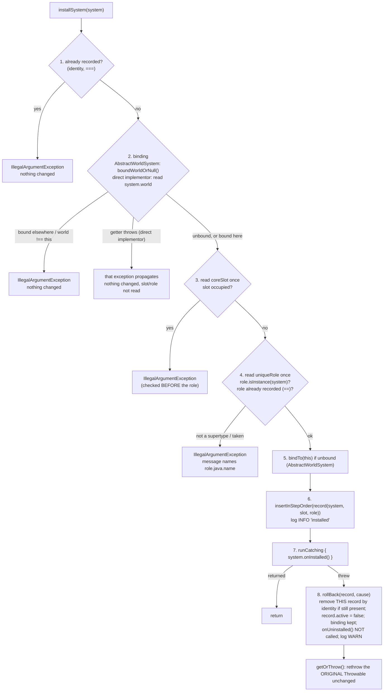

# Plan: `world-system-binding` — bind a `WorldSystem` to its `World` (`AbstractWorldSystem`, `uniqueRole`, roll-back, `systemOf`)

## Header / Association

- **Covers:** [SpartanLabsGaming/MyGameTools#77](https://github.com/SpartanLabsGaming/MyGameTools/issues/77)
  — *"World Systems Stage 2: wrap ZoneIndex as a WorldSystem"*. The design no longer wraps anything
  (architecture C9: `ZoneIndex` itself is the zone system), and the same PR reworks the
  already-merged `WorldSystem` core of
  [SpartanLabsGaming/MyGameTools#76](https://github.com/SpartanLabsGaming/MyGameTools/issues/76)
  (*"World Systems Stage 1: `WorldSystem` core mechanism (opt-in per-`World` system registry)"*,
  merged as PR #130). **This plan is the rework of #76's core** — `gametools-core` only.
- **Architecture:** [`docs/world-system-binding-architecture.md`](world-system-binding-architecture.md),
  unit `world-system-binding` (§10 row 1; slices §4.1–§4.5, §5, §6, §7.1, §7.4, §8, §9, §11.1,
  §12, §13). Its §1.2 C1–C22 are the user's binding decisions and are not re-litigated here.
  Sibling unit: `zone-world-system` (`docs/zone-world-system-plan.md`).
- **Branch:** `feature/77-zone-world-system` (exists; HEAD `b5e57b0`). One PR for both units (C12).
- **Commit:** TBD — this plan **and** `docs/world-system-binding-architecture.md` are committed in
  unit 1's **first** commit (Stage 1), so `git log --follow` binds them to the implementation.
- **PR:** TBD (shared with unit 2).
- **What this plans:** `WorldSystem` reworked to a bound, parameterless-hook contract with
  `uniqueRole`; the new `AbstractWorldSystem`; `World`'s install protocol (checks → bind → record →
  notify, with roll-back of a throwing `onInstalled()`); deletion of the reservation machinery; the
  new role-keyed lookup `World.systemOf` and its miss type `MissingWorldSystemException`;
  `CoreSystemSlot` KDoc; every existing core `WorldSystem` test; the README and `CHANGELOG.md`
  parts this unit owns; and **Step 0 — parking the superseded, uncommitted implementation in a
  path-limited stash** so `gametools-world` is back at `HEAD`.
- **Status:** planning only — **no open decisions remain** (OD5, the last one touching this unit,
  was resolved by the user on 2026-10-02: architecture C21, §9 here). No source, test, build or
  config file has been modified by this document.
- **Target release:** none. #76 and #47 are unreleased, `5.2.0` is not cut before #77 merges (C12),
  latest tag `v5.1.0`; the rework carries no semver weight. Every change is to
  `@ExperimentalGameToolsApi` surface, so per `CONTRIBUTING.md` §Versioning commits carry no `!` and
  no `BREAKING CHANGE:` footer.

---

## 1. Context

### 1.1 Why the merged core has to change

#77's design pass showed the merged #76 contract forces every stateful system to re-invent "which
`World` am I?" — the superseded `ZoneWorldSystem` needed a bind-for-life field, the planned
`ExperienceSystem` an `IdentityHashMap<World, Subscription>` — and keeps uniqueness as an in-hook
guard. The user decided (C1–C8, C14–C21): a system is bound to exactly one `World` for life and
reads it as `system.world`; hooks lose their `World` parameter; `World` does the binding; uniqueness
is a role the system declares and `World` enforces; a throwing `onInstalled()` is rolled back; a
role-keyed `World.systemOf` lookup exists, returning a `Result` whose miss carries a dedicated,
stackless `MissingWorldSystemException` that names the role.

### 1.2 Where it plugs in (verified at `HEAD`; `World.kt` and `WorldSystem.kt` are unmodified in the working tree)

| What | Where | Fate |
|---|---|---|
| Three hook call sites | `World.kt:395` `installOn(this)`, `:434` `uninstallFrom(this)`, `:477` `step(this)` | become `onInstalled()`, `onUninstalled()`, `step()` |
| Record | `World.kt:303-307` `InstalledSystemRecord(system, slot)` | gains `role` |
| Reservation machinery | `World.kt:309-311` `Reservation`, `:322-327` `installReservations`, `:384-398` its use | **deleted** (dead once no user code runs between "checks passed" and "recorded") |
| Single ordered record list | `World.kt:313-320` `installedRecords`, `:332-349` `insertInStepOrder` | **kept unchanged** — the determinism property (no hash of a slot or role is ever iterated) must survive |
| `installSystem` / `uninstallSystem` / `installedSystems` / `stepSystems` | `World.kt:351-481` | reworked / KDoc-reversed / `step()` call |
| Multi-`World` policy and "check `installedSystems` inside `installOn`" advice | `WorldSystem.kt:12-22` | reversed / replaced by `uniqueRole` |
| "adapter" wording | `CoreSystemSlot.kt:15`, `:39` (HEAD); the working tree's `:42` edit names `ZoneWorldSystem` | rewritten; `:42` is reset by Step 0 first |
| Only main-code implementers of the old hooks | none at `HEAD` (`git grep -n "WorldSystem\|installOn" HEAD -- gametools-world gametools-net` is empty) | the untracked `ZoneWorldSystem.kt` is superseded and parked by Step 0 |
| Core tests implementing the old hooks | 9 files (§6) | migrated |
| `gametools-core/build.gradle.kts` test-only opt-in block (`compileTestKotlin`) | `:13-18` | **stays as is** |

### 1.3 Acceptance criteria (architecture §1.3, restricted to `gametools-core`)

1. A `World` that installs nothing behaves exactly as before (`tick()` untouched).
2. A system written against the new contract is constructed with no `World`, installed once, reads
   `world` from its hooks and from `step()`, and cannot be installed on a second `World` (for life).
3. Two systems declaring the same `uniqueRole` cannot coexist on one `World`; the second is rejected
   by `World` before any of its code runs (beyond the `coreSlot`/`uniqueRole`/`world` getters).
4. A system whose `onInstalled()` throws is absent from `installedSystems` afterwards, never stepped,
   still bound, its slot and role free, and the caller sees the original exception unchanged.
5. `world.systemOf(role)` finds the installed system that declared exactly `role`; a role no
   installed system declared is a `Result.failure` (C18) carrying a `MissingWorldSystemException`
   whose `role` is the queried role and which has no stack trace (C21). The reified
   `world.systemOf<T>()` behaves identically (C19).
6. Steps 1–8 of architecture §5.1 hold, including the `stepSystems()` R2/R9 semantics.

---

## 2. Design

### 2.1 Stages (ordered, each independently landable; every commit compiles and is green)

| Stage | Commit | Content | Blocked on |
|---|---|---|---|
| **0** | none (working-tree operation) | Park the superseded implementation in a path-limited stash, returning its paths to `HEAD` (§4.0) | — |
| **1** | `feat(gameobjects): bind a WorldSystem to its World` | `WorldSystem`, `AbstractWorldSystem`, `World` registry rework (no `systemOf`), `CoreSystemSlot` KDoc, migration of the 9 existing tests, new binding / uniqueness / roll-back / re-entrancy tests, **this plan + the architecture doc** | — |
| **2** | `feat(gameobjects): add World.systemOf, a role-keyed lookup of installed systems` | `systemOf` in both forms — `KClass` and reified, each returning `Result<T>` (C18, C19) — and its miss type, the new `MissingWorldSystemException` (C21, §4.8); their tests; the `systemOf` KDoc sentences deferred from Stage 1 (§4.3.g) | Stage 1 only (OD5 resolved 2026-10-02, C21) |
| **3** | `docs(gameobjects): document the bound WorldSystem contract in README and CHANGELOG` | README + `CHANGELOG.md` (§4.6) | Stage 2 (they name `systemOf` and `MissingWorldSystemException`) |

Why `systemOf` is a stage of its own: it is a separable, additive feature — the lookup plus its new
miss type — that the rest of the rework does not depend on. (It was first split off because OD5 was
open; with OD5 resolved the split stays, for a reviewable history.) Why its KDoc mentions wait for
Stage 2: a `[World.systemOf]` or `[MissingWorldSystemException]` link in Stage 1 would be a dangling
KDoc reference at that commit (`dokkaGeneratePublicationHtml`).

### 2.2 Install protocol (architecture §5.1 made concrete)



Steps 1–4 only read. Steps 5–6 cannot fail. Step 7 is the only place user code runs with the system
recorded; from inside it `installedSystems` contains the system, `systemOf` finds it, and
`stepSystems()` / `uninstallSystem(self)` are legal-but-discouraged (C15).

### 2.3 Calls this plan makes where the architecture leaves room (not open decisions)

- **`bindTo` semantics.** Write-once means: unbound → store; already bound to the **same** `World`
  → no-op; already bound to a **different** `World` → `IllegalStateException` (a programmer error
  that `World`'s step-2 check makes unreachable through the public API; it exists so the class is
  safe on its own).
- **Roll-back uses `runCatching { … }.onFailure { rollBack(…) }.getOrThrow()`** — the repo's
  "functional recovery over `try-catch`" rule. `getOrThrow()` rethrows the stored `Throwable`
  instance itself, so "unchanged" holds (locked by `assertSame` tests). `runCatching` catches every
  `Throwable` including `Error`s; that is intended (roll back, then rethrow unchanged).
- **Roll-back log level: `WARN`**, no stack trace attached (the exception propagates to the caller,
  who owns it; logging it too would double-report). Not `ERROR`: the `World` is left consistent.
- **Install `INFO` line is emitted right after the record is inserted and before `onInstalled()`**
  (chronologically honest: from that moment the system is visible as installed; a later roll-back
  or self-uninstall then logs after it). The message gains the role.
- **`systemOf` logs nothing at any level** (it can run every `step()`).
- **Rejections (the four `IllegalArgumentException` families) are not logged**: the exception is the
  report, and the existing code does not log them either.
- **No shared test-fixture file in `gametools-core`**: fakes stay private per test class, as the nine
  existing tests do (a shared fixture is `gametools-world`'s `ZoneFixtures.kt` precedent, needed there
  because five test classes share one space/grid/recorder).

### 2.4 Error-handling design (per new or changed signature)

| Signature | Failure path | Expected (→ `Result`/value) vs programmer error (→ throw) | Unwrapped where |
|---|---|---|---|
| `WorldSystem.world` (abstract `val`) | `AbstractWorldSystem`: `IllegalStateException` (via `check`) when read before the first `installSystem` call whose checks pass; a direct implementor may throw anything | programmer error (reading an unbound system) → throw | caller; `World.installSystem` does **not** catch a direct implementor's throwing getter (propagates, nothing changed) |
| `onInstalled()` / `onUninstalled()` / `step()` | return `Unit`; whatever the body throws | system's own failures; `World` never converts them | `installSystem` (roll-back then rethrow unchanged); `uninstallSystem` (system already removed, rethrow unchanged); `stepSystems` (ends the pass, rethrow unchanged) |
| `uniqueRole` / `coreSlot` (`val`, read once) | none; a non-constant value is undefined behaviour (documented) | — | — |
| `AbstractWorldSystem.bindTo(World)` | `IllegalStateException` if already bound to a *different* `World` | programmer error → throw | unreachable through `World` |
| `AbstractWorldSystem.boundWorldOrNull(): World?` | never throws; `null` = unbound | expected absence → `null` (precedent: `World.byId`) | `World.installSystem` step 2 |
| `World.installSystem(system)` | `IllegalArgumentException` for: already installed; bound to another `World` / `world !== this`; slot occupied; role not a supertype / role taken. Any `Throwable` from `onInstalled()` → rolled back, rethrown unchanged | call-site misuse = programmer error → throw (existing `World` precondition style, `require`); hook failure is the system's, passed through. **Not `Result`**: a `Result` return would either swallow the hook's exception or force a wrapper the caller must unwrap to recover the *original* exception, and misuse is not an operational failure | caller. The only `Result` in the path is the private `runCatching`, unwrapped in the same expression by `getOrThrow()` |
| `World.uninstallSystem(system)` | none of its own (idempotent no-op if absent); `onUninstalled()` exception propagates after removal | — | caller |
| `World.installedSystems` | none | — | — |
| `World.stepSystems()` | `IllegalStateException` on re-entry from a `step()` (R2); a `step()` exception propagates | programmer error → throw | caller |
| `World.systemOf(role): Result<T>` and `World.systemOf<T>(): Result<T>` | a miss — no installed system declared the role — is `Result.failure(MissingWorldSystemException(role))` (C21); never thrown, never `null` | expected absence → `Result` (C18; the repo rule `.aiassistant/rules/CLAUDE.md` §2) | the caller: `getOrThrow()` for a required peer (inside `onInstalled()` the throw rolls the install back — C14), `getOrNull()` / `onSuccess` / `fold` for an optional one |
| `MissingWorldSystemException(role)` (new, §4.8) | none: the constructor cannot fail, and `fillInStackTrace()` returns `this` without walking the stack | — it *is* the expected-failure value, carried inside `Result` | never thrown by `World`; it reaches a `catch` only through a caller's `getOrThrow()` |
| private `rollBack(record, cause)`, `requireBindableHere(system)` | `rollBack` cannot fail (list removal by identity, a flag, a log call); `requireBindableHere` throws `IllegalArgumentException` | — | `installSystem` |

### 2.5 Logging events

| Event | Level | Message (slf4j `{}` style, package-level `log` from `GameObject.kt:20`) |
|---|---|---|
| System recorded (install step 6) | `INFO` | `"World installed a {} (slot={}, role={})"` — `system::class.simpleName`, `slot`, `role?.java?.name` |
| Roll-back of a throwing `onInstalled()` (step 8) | `WARN` | `"World rolled back the install of a {} (slot={}, role={}): onInstalled() threw {}: {}"` — simple name, slot, role name, `cause.javaClass.name`, `cause.message`; **no** throwable argument (no stack trace) |
| System uninstalled | `INFO` | `"World uninstalled a {} (slot={}, role={})"` (existing line, role added) |
| Uninstall of a non-installed system | `DEBUG` | existing line, unchanged |
| Step pass | `DEBUG` | existing `"World stepping {} system(s)"`, unchanged |
| `systemOf`, rejections, `bindTo`, `boundWorldOrNull` | none | — |

---

## 3. Documentation rings touched

| Ring | What moves in this change |
|---|---|
| 1 — in-editor | `//region` / `//endregion` markers and numbered import groups in the new `AbstractWorldSystem.kt` and `MissingWorldSystemException.kt` and the edited files (house style); the `// 1.2 Spartan Gaming` / `// 3.2.1 Standard library` groups gain `kotlin.reflect.KClass` where used; a Level-1 line comment on `MissingWorldSystemException.fillInStackTrace` (it runs from `Throwable`'s constructor and must read nothing) |
| 2 — component / API contract | Level-2 KDoc (`@param`/`@return`/`@throws`) on every new or changed public declaration: `WorldSystem` and all its members, `AbstractWorldSystem` and its public `world`, `World.installSystem` / `uninstallSystem` / `installedSystems` / `stepSystems` / `systemOf`, `MissingWorldSystemException` and its `role`; `CoreSystemSlot` / `CoreWorldSystemSlot` |
| 3 — boundary / protocol | The install protocol (this plan's §2.2 flowchart; KDoc on `installSystem`), the hook ordering guarantees, bind-for-life, C15's legal-but-discouraged calls, the exact-key lookup rule; README feature bullet; CHANGELOG |
| 4 — architectural | `docs/world-system-binding-architecture.md` (committed in Stage 1); README class diagram. Older architecture docs are the planner's (§11.2 of the architecture — approved and applied 2026-10-01, landing as a separate `docs:` commit — **not this unit's**) |

**README currency:** this change alters a public protocol and adds public types, so the **same PR**
updates `README.md` (Stage 3, §4.6) and `CHANGELOG.md`. `CONTRIBUTING.md`: no edit (its core row is
the package glob `com.spartanlabs.gaming.{gameobjects,…}.*`).

---

## 4. File-by-file changes

Paths are under `D:\Documents\Programming\MyGameTools`. `MAIN` = `gametools-core/src/main/kotlin/com/spartanlabs/gaming/gameobjects`,
`TEST` = `gametools-core/src/test/kotlin/com/spartanlabs/gaming/testing`.

### 4.0 Step 0 — park the superseded implementation (Stage 0; takes uncommitted work out of the tree, recoverably)

Every path below was checked against `git status --short` on 2026-09-30 (first column: state).

**Mechanism — one path-limited stash, not a discard** (alignment pass, 2026-09-30). A single
`git stash push --include-untracked -m "superseded #77 ZoneWorldSystem implementation (2026-09-29)" -- <the 16 paths below>`
restores each listed tracked path to `HEAD` and removes each listed untracked file, and **touches
nothing else** — verified on git 2.55 (this machine's version) in a throwaway repository: other
modified and untracked files were left exactly as they were, and the stash held both kinds. The
superseded work then stays recoverable (`git stash show -p stash@{n}`, `git stash apply`) until the
PR merges; drop that stash afterwards. List every path explicitly: a stash **without** a pathspec
is forbidden (see "Never use" below).

**Paths returned to `HEAD`** (tracked, modified — 11 paths):

| State | Path |
|---|---|
| `M` | `gametools-core/src/main/kotlin/com/spartanlabs/gaming/gameobjects/CoreSystemSlot.kt` (the `:42` edit names `ZoneWorldSystem`; Stage 1 then edits the `HEAD` text) |
| `M` | `gametools-world/src/main/kotlin/com/spartanlabs/gaming/world/zone/ZoneIndex.kt` |
| `M` | `gametools-world/src/main/kotlin/com/spartanlabs/gaming/world/zone/ZoneGrid.kt` |
| `M` | `gametools-world/src/main/kotlin/com/spartanlabs/gaming/world/zone/EntityChangedZone.kt` |
| `M` | `gametools-world/src/test/kotlin/com/spartanlabs/gaming/testing/component/world/zone/EntityChangedZoneTest.kt` |
| `M` | `gametools-world/src/test/kotlin/com/spartanlabs/gaming/testing/component/world/zone/ZoneIndexTest.kt` |
| `M` | `gametools-world/src/test/kotlin/com/spartanlabs/gaming/testing/e2e/world/zone/ZoneDrivenSimulationE2ETest.kt` |
| `M` | `gametools-world/src/test/kotlin/com/spartanlabs/gaming/testing/integration/world/zone/ZoneRefreshWorldIntegrationTest.kt` |
| `M` | `README.md`, `CHANGELOG.md`, `CONTRIBUTING.md` (every uncommitted hunk is superseded zone wording — architecture §11 classification: README `:161` world row, `:180` clause, `:194` zone bullet; CHANGELOG #47/#77 hunks; CONTRIBUTING `:36`) |

**Paths removed from the working tree** (untracked, `??` — 5 paths; they go into the same stash via
`--include-untracked`. A second, session-scoped copy also exists at
`C:\Users\spart\AppData\Local\Temp\claude\D--Documents-Programming-MyGameTools\842ff068-cf8d-4379-8724-8eac1b9dd6d7\scratchpad\backup\superseded-impl\`,
but the stash is the durable one):

- `gametools-world/src/main/kotlin/com/spartanlabs/gaming/world/zone/ZoneWorldSystem.kt`
- `gametools-world/src/test/kotlin/com/spartanlabs/gaming/testing/component/world/zone/ZoneWorldSystemTest.kt`
- `gametools-world/src/test/kotlin/com/spartanlabs/gaming/testing/deterministic/world/zone/ZoneWorldSystemDeterminismTest.kt`
- `gametools-world/src/test/kotlin/com/spartanlabs/gaming/testing/e2e/world/zone/ZoneWorldSystemSimulationLoopE2ETest.kt`
- `gametools-world/src/test/kotlin/com/spartanlabs/gaming/testing/integration/world/zone/ZoneWorldSystemOrderingIntegrationTest.kt`

**Keep, untouched and never staged by unit 1:**

- untracked `gametools-world/src/test/kotlin/com/spartanlabs/gaming/testing/component/world/zone/ZoneFixtures.kt`
  (unit 2 commits it). Verified to compile against `HEAD`: it imports only `Space`, `World`,
  `EntityChangedZone`, `ZoneGrid` and geometry types, all present at `HEAD`; its top-level
  `internal` `FixtureSpace` / `fixtureGrid` / `recorder` share a package with `HEAD` tests that
  declare *private nested* members of the same names (`EntityChangedZoneTest`, `ZoneGridTest`,
  `ZoneIndexTest`) — a nested member shadows a top-level declaration, no redeclaration error.
- the uncommitted test-only opt-in block in `gametools-world/build.gradle.kts` (unit 2 commits it;
  harmless without a `WorldSystem` in `gametools-world`).
- every uncommitted `docs/*.md` hunk (`docs/api-openness-decisions-6.0.0.md`, `docs/issue-47-zones-plan.md`,
  `docs/phase-1-map-and-space-plan.md`, `docs/physics-world-system-plan.md`,
  `docs/world-system-core-architecture.md`, `docs/world-system-core-plan.md`,
  `docs/world-system-graduation-plan.md`, `docs/world-systems-implementation-architecture.md`,
  `docs/zone-world-system-plan.md`) — planner-owned (§11.2) or unit 2's; never staged here.

**Never use** `git clean`, `git checkout .`, `git restore .`, a `git stash`/`git stash -u` **without
a pathspec**, or `git add -A`/`git add .` in this PR: each would destroy, park or sweep in
`ZoneFixtures.kt`, the `build.gradle.kts` block, the architecture document or the pending doc
hunks. The one allowed stash is Step 0's, with all 16 paths spelled out. Stage by explicit path only.

**Verification after Step 0:** `git status --short` lists exactly the kept items above (plus this
plan and the architecture doc as `??`); `git stash show --include-untracked --name-status stash@{0}`
lists exactly the 16 paths; `./gradlew :gametools-world:compileTestKotlin` compiles.
(Step 0 is what makes unit 1 build on its own: nothing in `gametools-world` at `HEAD` implements
`WorldSystem`.)

### 4.1 Changed: `MAIN/WorldSystem.kt`

```kotlin
package com.spartanlabs.gaming.gameobjects

//region 1. Organization Internal
// 1.2 Spartan Gaming
import com.spartanlabs.gaming.annotation.ExperimentalGameToolsApi
//endregion

//region 3. Utility / Catch-all
// 3.2 Kotlin
// 3.2.1 Standard library
import kotlin.reflect.KClass
//endregion

@SubclassOptInRequired(ExperimentalGameToolsApi::class)
interface WorldSystem {
    val world: World
    fun onInstalled() {}
    fun onUninstalled() {}
    fun step() {}

    @ExperimentalGameToolsApi
    val coreSlot: CoreSystemSlot?
        get() = null

    @ExperimentalGameToolsApi
    val uniqueRole: KClass<out WorldSystem>?
        get() = null
}
```

Removed: `installOn(world)`, `uninstallFrom(world)`, `step(world)`. `coreSlot` is textually unchanged.
`world` has no default (abstract): a system with no `World` yet says so by throwing from the getter.
Adding the defaulted `uniqueRole` is binary-safe under Kotlin 2.2's default `-jvm-default=enable`
and moot while unreleased.

**KDoc to rewrite (Level 2; drop every `[installOn]`/`[uninstallFrom]`/`step(world)` reference):**

- *Class KDoc* (replaces `:8-30`) must state: what a system is; tier 1 (`coreSlot`) versus tier 2;
  **a system serves exactly one `World` for its life** — it is bound by the first
  `World.installSystem` call whose checks pass, before `onInstalled()` runs, and never unbound (not
  by `uninstallSystem`, not by a rolled-back `onInstalled()`), so it is **not reusable across `World`s — build one per `World` (a factory)**;
  a bound system keeps its `World` reachable after uninstall (a long-lived/static system pins the
  whole `World`); **uniqueness is declared with `uniqueRole`** and enforced by `World` (this
  *replaces* the old advice to "check `installedSystems` inside `installOn`", old `:15-17`); extend
  `AbstractWorldSystem` for the common case or implement this interface and supply `world` yourself
  (`World` then requires `world === this World` at install); single-threaded like `World` (every
  hook runs on the thread driving the `World`; the binding needs no synchronisation for that
  reason); opt-in note (implementing requires `ExperimentalGameToolsApi`, so does reading
  `coreSlot`/`uniqueRole`; may change in a Feature release until it graduates); `@see AbstractWorldSystem`.
- *`world`*: the one `World` this system serves; read-only to a consumer; constant once it has
  returned; `@throws IllegalStateException` for an `AbstractWorldSystem` read before the first
  `installSystem` call whose checks pass; a direct implementor supplies it before install (it may throw if it has none
  yet — `World.installSystem` propagates that exception with nothing changed).
- *`onInstalled()`*: a **notification**, not a gate — returning completes the install. Runs once per
  install, after every check passed, the system was bound and recorded; so `world.installedSystems`
  contains it and it may read `world`. If it **throws**, `World` removes this attempt's record (slot
  and role released), does **not** call `onUninstalled()`, keeps the binding, and rethrows the
  original exception unchanged — so **release whatever you acquired before throwing**; helper systems
  it installed on `world` stay installed. **Legal but discouraged (C15):** `world.stepSystems()`
  from here (when no step pass is already running) steps this system before `onInstalled()` has
  returned; `world.uninstallSystem(this)` removes it and runs `onUninstalled()` before
  `onInstalled()` returns. Re-installing this same system, or a claimant of its slot, from here is
  rejected with `IllegalArgumentException` (it is already recorded). Default: no-op.
- *`onUninstalled()`*: runs once, immediately after `uninstallSystem` removed this system; **must
  fully undo what `onInstalled()` acquired** because the same system may be installed again on the
  same `World` (the binding is kept). Not called for a system that was never installed or whose
  install was rolled back. Default: no-op.
- *`step()`*: once per `World.stepSystems()` while installed, in step order; exception ends the pass;
  `World.stepSystems()` from inside is `IllegalStateException`; `installSystem`/`uninstallSystem`
  legal (see their KDoc). Default: no-op. (Drop the `@param world`.)
- *`coreSlot`*: text unchanged; add "read exactly once by `installSystem`, after the binding check and
  before `uniqueRole`".
- *`uniqueRole`* (new): `null` (default) = no uniqueness constraint. Non-null: **read exactly once,
  by `installSystem`; must be constant for the object's life**; must be a supertype of the system
  (`role.isInstance(system)`; otherwise `IllegalArgumentException`); two installed systems may not
  declare equal roles (`==`); the second is **rejected, never replaces**. Granularity is the author's:
  exact class (`override val uniqueRole get() = Me::class`) or a family base type/interface. For a
  slot-claiming system the slot check runs first and guards the same thing (overlap accepted). It is
  also the key of `World.systemOf` *(sentence added in Stage 2)*. Experimental like `coreSlot`.

> **As built (2026-10-08):** the QA pass corrected the binding wording in the KDoc of `WorldSystem`
> and `WorldSystem.world`. A system is bound by the first `World.installSystem` call whose checks
> pass, before `onInstalled()` runs, and keeps that binding even if the install is rolled back; the
> KDoc had said "first successful install".

### 4.2 New: `MAIN/AbstractWorldSystem.kt`

```kotlin
@SubclassOptInRequired(ExperimentalGameToolsApi::class)
abstract class AbstractWorldSystem : WorldSystem {

    private lateinit var bound: World

    final override val world: World
        get() {
            check(::bound.isInitialized) {
                "${this::class.simpleName ?: this::class.java.name}.world was read before this system was installed on a World"
            }
            return bound
        }

    @JvmSynthetic
    internal fun bindTo(world: World) {
        check(!::bound.isInitialized || bound === world) {
            "${this::class.simpleName ?: this::class.java.name} is already bound to a different World"
        }
        if (!::bound.isInitialized) bound = world
    }

    @JvmSynthetic
    internal fun boundWorldOrNull(): World? = if (::bound.isInitialized) bound else null
}
```

- **No `init` block, no constructor parameters, no read of any open member** (`coreSlot`, `uniqueRole`,
  `world`) — a base-class `init` would see subclass initialisers as `null` (architecture §12).
- Storage is a **private** `lateinit` (a non-private `lateinit … internal set` compiles to a public JVM
  field — architecture §2 finding 4); `world` is `final` so a subclass cannot lie to `World`'s mismatch
  check; both hooks are `@JvmSynthetic internal` (`World` is the only caller, same module).
- Mutability: one `var`, written at most once, never reset. Concurrency: none — single-threaded like `World`.
- Errors: `world` → `IllegalStateException`; `bindTo` → `IllegalStateException` only on a different
  `World` (§2.3); `boundWorldOrNull` never throws. Logging: none (storage only).
- `@SubclassOptInRequired` (not `@OptIn`) on the class: `@OptIn` would drop the requirement for its
  own subclasses.
- **KDoc (Level 2)**: the class KDoc is the *worked example* for a consumer — a ~10-line sample
  (`class Counter : AbstractWorldSystem() { override val uniqueRole get() = Counter::class; override fun onInstalled() { … world.events.subscribe … } }`
  with the `@OptIn` a consumer needs), the statement that it is a helper not a seam (`WorldSystem` is the
  substitution point), bind-for-life, "constructible before it has a `World`", and the
  read-before-install failure. `world` KDoc: `@throws IllegalStateException`.

> **As built (2026-10-08):** the same binding-wording correction landed in the KDoc of
> `AbstractWorldSystem`, `AbstractWorldSystem.world` and `boundWorldOrNull`. And by the user's
> decision C39 (architecture §1.2), `world`'s runtime message now matches it:
> `"<class>.world was read before any World.installSystem call for this system passed its checks"`,
> where `<class>` is the simple name, or the Java name for an anonymous class, as above.

### 4.3 Changed: `MAIN/World.kt` (registry region `:295-482`, plus the class KDoc `:46-51` and the imports)

**a. Imports.** Add `// 3.2.1 Standard library` `import kotlin.reflect.KClass` (alphabetical with the existing `kotlin.random.Random`: `kotlin.random.Random`, then `kotlin.reflect.KClass`).

**b. `InstalledSystemRecord`** (`:296-307`):

```kotlin
/** One install attempt that passed its checks; recorded before `onInstalled()` runs, so it can be rolled back. … */
@OptIn(ExperimentalGameToolsApi::class)
private class InstalledSystemRecord(
    val system: WorldSystem,
    val slot: CoreSystemSlot?,
    val role: KClass<out WorldSystem>?,        // read once from system.uniqueRole at install; never re-read
) {
    var active: Boolean = true                 // cleared by uninstallSystem and by rollBack
}
```

Two records for the same instance stay distinct (the R9 rule) — KDoc says so; roll-back targets
*this attempt's record by identity*. **Delete** `Reservation` (`:309-311`) and `installReservations`
(`:322-327`). `installedRecords` (`:313-320`), `stepping` (`:329-330`) and `insertInStepOrder`
(`:332-349`) are unchanged; update `installedRecords` KDoc to say it is the only backing structure
for `installedSystems`, slot occupancy, role uniqueness, `systemOf` and step order (never a hash-
or tree-keyed collection — `KClass.hashCode` is identity-based per run).

**c. `installSystem`** (replaces `:351-401`; `@ExperimentalGameToolsApi`, returns `Unit`):

```kotlin
@ExperimentalGameToolsApi
fun installSystem(system: WorldSystem) {
    // 1. identity duplicate (never equals(): a consumer's system may be a data class)
    require(installedRecords.none { it.system === system }) {
        "system $system is already installed on this World"
    }
    // 2. binding: a direct implementor's throwing getter propagates here, nothing changed
    requireBindableHere(system)
    // 3. slot - read once, checked BEFORE the role
    val slot = system.coreSlot
    if (slot != null) {
        val occupant = installedRecords.firstOrNull { it.slot == slot }?.system
        require(occupant == null) { "slot $slot is already claimed by $occupant" }
    }
    // 4. role - read once; KClass compared with ==, never ===; messages use role.java.name, never the KClass
    val role = system.uniqueRole
    if (role != null) {
        require(role.isInstance(system)) {
            "system $system declares uniqueRole ${role.java.name} but is not an instance of it"
        }
        val holder = installedRecords.firstOrNull { it.role == role }?.system
        require(holder == null) { "uniqueRole ${role.java.name} is already held by $holder" }
    }
    // 5. bind (AbstractWorldSystem only; a direct implementor already knows its World)
    (system as? AbstractWorldSystem)?.takeIf { it.boundWorldOrNull() == null }?.bindTo(this)
    // 6. record in step order
    val record = InstalledSystemRecord(system, slot, role)
    insertInStepOrder(record)
    log.info("World installed a {} (slot={}, role={})", system::class.simpleName, slot, role?.java?.name)
    // 7 + 8. notify; a throw rolls this attempt back and is rethrown UNCHANGED
    runCatching { system.onInstalled() }
        .onFailure { cause -> rollBack(record, cause) }
        .getOrThrow()
}
```

Private helpers (both `@OptIn(ExperimentalGameToolsApi::class)`, like `insertInStepOrder`):

```kotlin
/** Step 2. Throws IllegalArgumentException if [system] is bound to, or reports, a World other than this one. */
private fun requireBindableHere(system: WorldSystem) {
    when (system) {
        is AbstractWorldSystem -> require(system.boundWorldOrNull().let { it == null || it === this }) {
            "system $system is already bound to a different World"      // bound-for-life elsewhere
        }
        else -> require(system.world === this) {                          // a throwing getter propagates
            "system $system reports a world that is not this World"
        }
    }
}

/** Step 8. Cannot fail. Removes THIS record (identity) if still present; never touches another record of the same instance. */
private fun rollBack(record: InstalledSystemRecord, cause: Throwable) {
    val index = installedRecords.indexOfFirst { it === record }
    if (index != -1) installedRecords.removeAt(index)
    record.active = false
    log.warn("World rolled back the install of a {} (slot={}, role={}): onInstalled() threw {}: {}",
        record.system::class.simpleName, record.slot, record.role?.java?.name, cause.javaClass.name, cause.message)
}
```

Roll-back semantics, exactly architecture §4.3 "Roll-back": remove this attempt's own record by
identity if still present; mark it inactive; **keep the binding**; **do not call `onUninstalled()`**;
rethrow the original exception unchanged; **do not touch** helpers the failing hook installed, nor a
record created by a re-install inside the failing hook (it completed its own `onInstalled()`), nor the
record of a hook that already uninstalled itself (nothing is left to remove). The slot and the role are
released by the removal itself (both are derived from the record list).

Edge table the code must satisfy (each has a test in §6):

| Hook does | Result after `installSystem` throws |
|---|---|
| throws immediately | no record; binding kept |
| installs helper, then throws | helper stays; outer record gone |
| `uninstallSystem(self)` (legal), then throws | nothing to remove; `onUninstalled()` ran once (from the uninstall, not the roll-back) |
| `uninstallSystem(self)`, `installSystem(self)` (nested re-install completes), then throws | the **newer** record survives; system installed once; original exception reaches the caller |
| `installSystem(self)` / second claimant of own slot | `IllegalArgumentException` from the nested call → the outer install is rolled back and that exception is rethrown unchanged |

**d. `uninstallSystem`** (`:403-435`): semantics unchanged (remove, `record.active = false`, log, then
`system.onUninstalled()`; idempotent no-op if absent; the binding is kept). Changes: call
`onUninstalled()`; log line gains `role`; KDoc: `uninstallFrom` → `onUninstalled`, add "the binding is
kept — re-install on the same `World` is legal, another `World` is rejected", and "called from inside
the system's own `onInstalled()` it genuinely uninstalls (C15, legal but discouraged)".

**e. `installedSystems`** (`:437-449`): implementation unchanged; **KDoc reversed**: "*Contains* a
system while its own `onInstalled()` is running (it is recorded first); does not contain one whose
install was rolled back."

**f. `stepSystems`** (`:451-481`): unchanged except `record.system.step()` (no argument). KDoc: drop
the parameter wording; add the C15 sentence ("a call from inside a system's `onInstalled()`, when no
pass is running, steps that system before `onInstalled()` returns — legal, discouraged"). **R2** (re-entry →
`IllegalStateException`) and **R9** (snapshot + `active` flag) preserved verbatim.

**g. `installSystem` KDoc** (Level 2; replaces `:351-381`) must carry: the ordered protocol (checks →
bind → record → `onInstalled()`); the four `IllegalArgumentException` families in `@throws`
(already installed — including a re-entrant self-install from `onInstalled()`; bound to another `World` /
`world !== this`; `coreSlot` already claimed, **checked before the role**; `uniqueRole` not a supertype or
already held); that a direct implementor's `world` getter is read here and its exception propagates with
nothing changed; the roll-back contract (C14) and that the original exception is rethrown unchanged;
the C15 legal-but-discouraged calls; the snapshot rule for installs during a pass (steps from the
*next* call); single-threaded; Experimental. **Deferred to Stage 2:** any `[systemOf]` link.

**h. Class KDoc "Installed systems"** (`:46-51`): add "bound to exactly one `World` for life" and
(Stage 2) "and looked up by role with [systemOf], a miss being a [Result.failure] carrying a
[MissingWorldSystemException]".

**i. `systemOf`** (Stage 2; architecture §4.4 and C17–C21 — member of `World`; linear scan of the
single record list comparing the **recorded** role with `==`; `Result<T>`, typed `T` via
`role.java.cast`; at most one; a miss is `Result.failure(MissingWorldSystemException(role))`, never a
throw or `null`; pure read; callable from anywhere on the `World`'s thread incl. every hook and
`step()`; live registry, never a pass snapshot; both forms `@ExperimentalGameToolsApi`, graduating with
the registry at #79; logs nothing):

```kotlin
// inside World, registry region, after installedSystems
@ExperimentalGameToolsApi
fun <T : WorldSystem> systemOf(role: KClass<T>): Result<T> =
    installedRecords.firstOrNull { it.role == role }                          // exact key on the RECORDED role
        ?.let { Result.success(role.java.cast(it.system)) }                   // sound: install checked role.isInstance(system)
        ?: Result.failure(MissingWorldSystemException(role))                  // C21: stackless; its message names role.java.name

@ExperimentalGameToolsApi                                                     // the inline member needs its own marker
inline fun <reified T : WorldSystem> systemOf(): Result<T> = systemOf(T::class)   // no @PublishedApi: delegates to a public member
```

The miss's message is built by `MissingWorldSystemException` itself from the role (§4.8) and names it by
`role.java.name`, never the `KClass` (architecture §4.3) — `World` passes only the role. `systemOf` is
annotated with the marker, so its body constructs the marked exception with no `@OptIn`
(compile-verified, architecture §4.5). The reified form adds no logic, so its tests check only that it
equals the `KClass` form (§6.2.2).

KDoc must carry (Level 2): the exact-key rule and its three consequences (a role-less system is never
found; a member of a family role is found under the family type, **not** under its own class; a substitute
that declared a different role is not found under this one — spelled out with a generic `Base`/`Derived`
example, no zone class named in core); at most one result; pure read/no hooks; what it sees (finds a
system from inside its own `onInstalled()`; not after roll-back or uninstall; during a step pass a system
uninstalled earlier in the pass is not found and one installed mid-pass is found although it steps next
pass); that the reified form reads like `filterIsInstance<T>()` but is the same exact-key lookup; and
the three usage bullets, verbatim in substance from architecture §4.4:

- *Look a peer up when you use it, or be ready for it to disappear: a reference cached in `onInstalled()`
  goes stale if the peer is uninstalled later, and nothing notifies the holder.*
- *A system that requires a peer unwraps the lookup in `onInstalled()` with `getOrThrow()`: if the peer is
  absent, the [MissingWorldSystemException] naming the missing role is thrown, the roll-back undoes the
  install, and nothing stays recorded. The exception carries no stack trace, so its message — and the
  roll-back's log line — is the diagnostic. The peer must already be installed when the lookup runs —
  the lookup neither waits for nor orders installs.*
- *A system that can live without a peer unwraps it with `getOrNull()`, `onSuccess { … }` or `fold(…)`. A
  miss is cheap but not free: it allocates one stackless [MissingWorldSystemException] (no stack walk),
  so polling for an absent optional peer on every `step()` costs one small allocation each frame.*

KDoc tags: `@param role` (the exact role a system declared as its `uniqueRole`), `@return` "[Result.success]
with the installed system that declared exactly [role], or [Result.failure] carrying a
[MissingWorldSystemException] whose [MissingWorldSystemException.role] is [role] if none did". No `@throws`:
`systemOf` throws nothing of its own.

> **As built (2026-10-08):** KDoc changes from the QA pass in `World`:
> - `installSystem` documents `@throws MissingWorldSystemException` (the required-peer pattern's
>   failure) and states that an exception from `onInstalled()` is rethrown unchanged after the
>   roll-back. `uninstallSystem` and `stepSystems` state the same for their hooks in a sentence,
>   because a KDoc `@throws` needs a concrete type.
> - The Roll-back paragraph documents the single `WARN` line the roll-back logs.
> - The reified `systemOf` gained `@param T`, and both forms say a miss costs two small allocations
>   (the exception and its `Result` box).
> - The KDoc of the private helpers `requireBindableHere` and `rollBack` cites code by name.
> - The constructor's `@param seed` links `[rng]`.

### 4.4 Changed: `MAIN/CoreSystemSlot.kt` (KDoc only; base = `HEAD` text after Step 0)

- `:14-16` (class KDoc) — replace "(a deliberate replacement of a shipped adapter)" with: a consumer's
  own `WorldSystem` may return an *existing* `CoreWorldSystemSlot` value to stand in for the shipped
  system that claims it — [World.installSystem]'s one-claimant-per-slot check rejects it while the
  shipped system is installed, so install it instead of, not beside, the shipped one.
- `:39` — `PHYSICS`: ``/** Claimed by `gametools-world`'s `PhysicsSystem` (#49), once that system ships. */``
- `:42` — `ZONE`: ``/** Claimed by `gametools-world`'s `ZoneIndex`. */``

Backticks, not `[links]`, for classes in other modules (`gametools-core` cannot link into `gametools-world`).
No "adapter" remains. (`ZONE`'s text is true once unit 2 lands in the same PR; `PhysicsSystem` does not
exist yet, hence "once that system ships".) Code is unchanged.

### 4.5 Changed tests — see §6 (nine existing files migrated; nine new files — eight at level 2, including `MissingWorldSystemExceptionTest`, and one at level 4a).

### 4.6 Changed: `README.md` and `CHANGELOG.md` (Stage 3; line numbers are `HEAD`'s, valid after Step 0)

**`README.md`** — none of the text below names a zone class (unit 2 adds the `ZoneIndex` clauses):

| Anchor | Change |
|---|---|
| `:83-88` class diagram `WorldSystem` block | Members become `+World world`, `+onInstalled()`, `+onUninstalled()`, `+step()`, `+CoreSystemSlot coreSlot`, `+KClass uniqueRole`. Add `class AbstractWorldSystem { <<abstract>> +World world }` right after it. World block (`:75-79` region) gains `+systemOf(role)`. Relationships: add `AbstractWorldSystem ..|> WorldSystem` and `WorldSystem "*" --> "1" World : serves exactly one`. (Existing `World "1" o-- "*" WorldSystem` stays.) |
| `:142` `World` row | "…and hosts opt-in installed `WorldSystem`s (Experimental)" → "…hosts opt-in installed `WorldSystem`s — each bound to it for life — and finds one by role with `systemOf` (Experimental)". |
| `:145` `WorldSystem` row | "Opt-in, per-frame or event-driven add-on behaviour for a `World` (Experimental): a system serves exactly one `World` (`system.world`); `World.installSystem` binds it and calls `onInstalled()`, a driver calls `World.stepSystems` (`step()`), `uninstallSystem` calls `onUninstalled()`; it may declare a `uniqueRole` so `World` rejects a second system holding it; built-in systems claim a library-reserved `CoreSystemSlot` and step first, everything else steps after them in install order". **Insert a new row directly under it:** "`AbstractWorldSystem` \| abstract \| The ready-made base class that holds a `WorldSystem`'s `World` binding and fails clearly if `world` is read before install (Experimental)". |
| `:159` core row | "`World`, `WorldSystem` (Experimental)" → "`World`, `WorldSystem` and `AbstractWorldSystem` (both Experimental)". |
| `:180` installed-systems bullet (rewritten from `HEAD`'s text) | See below. |

The `:180` bullet, full replacement text (it names `MissingWorldSystemException`, C21; unit 2's
README text names `UnzonedEntityException` the same way):

> - **Opt-in installed systems** (Experimental) — a `WorldSystem` adds per-frame or event-driven behaviour to a `World` without subclassing it: extend `AbstractWorldSystem` (or implement `WorldSystem` and supply `world` yourself) and override `onInstalled()` / `step()` / `onUninstalled()` as needed — no hook takes a `World`; a system reads `this.world` — then `World.installSystem(it)` and call `World.stepSystems()` once per frame from your own driver, e.g. `SimulationLoop(world, onTick = { world.stepSystems() })` — `World.tick()` never calls it. `installSystem` checks first (already installed, core slot, role), then binds the system to that `World`, records it and only then calls `onInstalled()`; if that throws, the install is rolled back and the exception reaches you unchanged. A system serves exactly one `World` for life: `uninstallSystem` (which calls `onUninstalled()`) keeps the binding, so re-install it only on the same `World`; another `World` needs another instance. A system may declare a `uniqueRole`, and `World` rejects a second installed system holding the same one; `World.systemOf(role)` — or `world.systemOf<T>()` — returns the installed system that declared it as a `Result`, a failure carrying a `MissingWorldSystemException` (which names the role) if none did (unwrap a peer you cannot do without with `getOrThrow()` in `onInstalled()`, and the install is rolled back when it is missing). Built-in systems claim a library-reserved `CoreSystemSlot` (`CoreWorldSystemSlot.PHYSICS`, then `ZONE`) and always step first, in that order, whatever order they were installed in; your own systems step after them, in install order. Experimental: opt in with `@OptIn(ExperimentalGameToolsApi::class)` or the `-opt-in=com.spartanlabs.gaming.annotation.ExperimentalGameToolsApi` compiler flag — the shape may change incompatibly in a Feature release until it graduates.

Unit 2 inserts its clause at the anchor "`(CoreWorldSystemSlot.PHYSICS`, then `ZONE`)`" (the parenthetical is
`HEAD`'s and is kept verbatim).

**`CHANGELOG.md`** `[Unreleased]` → `### Added`: amend **in place** the #76 bullet that begins
``- `WorldSystem` — an opt-in, per-frame or event-driven add-on contract for a `World`, with`` and
ends `(#76)` (`HEAD` `:83-91`; locate it by content). Replacement text (names the new
`MissingWorldSystemException`, C21):

> - `WorldSystem` — an opt-in, per-frame or event-driven add-on contract for a `World`. A system is bound to exactly one `World` for life and reads it as `system.world`; its hooks `onInstalled()` / `onUninstalled()` / `step()` take no parameters. `AbstractWorldSystem` is the ready-made base class that holds the binding and fails clearly if `world` is read before install. A system may claim a library-reserved `CoreWorldSystemSlot` via `coreSlot` (`PHYSICS`, then `ZONE`), which steps in that relative order whatever order the systems were installed in, and may declare a `uniqueRole` so `World` rejects a second installed system holding the same role; every other system steps afterwards, in install order. `World` gains `installSystem` / `uninstallSystem` / `installedSystems` / `stepSystems` to host it — `installSystem` checks, binds, records, then calls `onInstalled()`, and rolls the install back (rethrowing the original exception) if that throws — and `systemOf(role)` (or the reified `systemOf<T>()`) to find an installed system by its `uniqueRole`, returned as a `Result` — a failure carrying the new `MissingWorldSystemException`, a stackless `NoSuchElementException` that names the role, if no installed system declared that role. `World.tick()` is unchanged and never calls `stepSystems()` — a driver does, e.g. from a `SimulationLoop`'s `onTick`. Ships Experimental: implementing `WorldSystem` or `AbstractWorldSystem`, or using `World`'s new members, the slot types, `coreSlot`, `uniqueRole` or `MissingWorldSystemException`, requires opting in to `ExperimentalGameToolsApi`. (#76, #77)

The #47 and #77 bullets belong to unit 2. `CONTRIBUTING.md`: no edit (its core row is a package glob,
which covers `MissingWorldSystemException`). The README core row (`:159`) is a curated list and does
not name the exception type — the #76 precedent documents such types in KDoc, not in the module table.

> **As built (2026-10-08):** the QA pass changed two README texts. The installed-systems bullet
> now also states the binding check, and the core row lists `MissingWorldSystemException`
> (Experimental) after all.

### 4.7 Unchanged, asserted

`gametools-core/build.gradle.kts` (the `compileTestKotlin` opt-in block, `:13-18`, stays: tests still
implement an Experimental interface until #79); `SimulationLoop`, `EventBus`, `GameServer`,
`StandardCommandApplier` (architecture §7.1 verdicts); `CoreWorldSystemSlotTest` (implements no `WorldSystem`).

### 4.8 New: `MAIN/MissingWorldSystemException.kt` (Stage 2; architecture C21, §4.4, §4.5)

```kotlin
package com.spartanlabs.gaming.gameobjects

//region 1. Organization Internal
// 1.2 Spartan Gaming
import com.spartanlabs.gaming.annotation.ExperimentalGameToolsApi
//endregion

//region 3. Utility / Catch-all
// 3.2 Kotlin
// 3.2.1 Standard library
import kotlin.reflect.KClass
//endregion

@ExperimentalGameToolsApi
class MissingWorldSystemException(val role: KClass<out WorldSystem>) :
    NoSuchElementException("no system installed on this World declared uniqueRole ${role.java.name}") {

    // Throwable's constructor calls this before `role` is assigned, so it must read nothing.
    override fun fillInStackTrace(): Throwable = this
}
```

- **The user's (C21):** the name, the `NoSuchElementException` parent, `val role: KClass<out WorldSystem>`,
  stackless by overriding `fillInStackTrace`, this file, `@ExperimentalGameToolsApi`, graduating with
  `systemOf` at #79.
- **The planner's (architecture §4.5 — the shape unit 2's `UnzonedEntityException` shares exactly):**
  `final` — not an extension point, since the library is the only producer and consumers catch the type
  rather than extend it; a public constructor taking only the role; the message built here from
  `role.java.name`, never the `KClass` (whose `toString()` without `kotlin-reflect` reads "(Kotlin
  reflection is not available)"); no cause.
- `NoSuchElementException` is the `kotlin` typealias of `java.util.NoSuchElementException`, so it needs
  no import. Mutability: immutable (one `val`). Concurrency: none — an immutable value. Errors: none of
  its own (the constructor cannot fail). Logging: none.
- Opt-in: `World.systemOf` carries the marker, so it constructs the exception with no `@OptIn`; every
  other use (`is`, `catch`, a constructor call) needs the opt-in — compile-verified on Kotlin 2.2.0
  (architecture §4.5).
- **KDoc (Level 2).** Class: what it signals — a `World.systemOf` lookup found no installed system that
  declared [role] as its `uniqueRole`. It is the *value* of an expected failure: `systemOf` never throws
  it but returns it inside [Result.failure], and it is thrown only by a caller that unwraps with
  `getOrThrow()` — for instance the required-peer pattern in `onInstalled()`, where the throw rolls the
  install back. It is a [NoSuchElementException], so code that handles that type handles this one too.
  **Stackless by design**: it records no stack trace, so a miss costs one allocation and no stack walk;
  diagnose from the message and [role] (and, for a failed install, `World`'s roll-back log line). The
  Experimental paragraph in house wording ("may change incompatibly in a Feature release until it
  graduates; see [ExperimentalGameToolsApi]"). `@property role` — the role that was looked up; compare it
  with `==` and print it with `role.java.name`, never the `KClass` itself. `@see World.systemOf`.

> **As built (2026-10-08):** the KDoc says a miss costs two small allocations, the exception and
> the `Result` failure box that carries it, rather than one.

---

## 5. Adoption / blast radius (architecture §7.1, §7.4)

- `git grep` at `HEAD` for `WorldSystem|installOn|uninstallFrom` outside `gametools-core`: **no hit** in
  `gametools-net`, `gametools-world`, `src/`, `website/` — no cross-repo surface and no main-code
  implementer to migrate. Inside `gametools-core`: `World.kt`, `WorldSystem.kt`, `CoreSystemSlot.kt` and
  the tests below.
- Mechanism superseded: "a hook that takes a `World` argument" plus in-hook guards. Verdict for its
  only in-repo main users: none exist (the superseded `ZoneWorldSystem` is untracked and parked by
  Step 0); `ExperienceSystem` (#78) and `PhysicsSystem` (#49) are unbuilt — **named follow-ups** in
  their own plans (§10), not refactors now.
- `systemOf` supersedes "scan `installedSystems` with `is`": no main-code caller exists; the registry
  tests that assert `installedSystems` membership are **Never** refactored (they test the registry).

---

## 6. Test plan (5-level hierarchy)

Framework: `kotlin.test` on the JUnit 5 platform, per the repo's actual convention (no MockK anywhere;
nothing here makes an external call to mock). One test class per file; backtick names; private fakes per
class; each class keeps `@OptIn(ExperimentalGameToolsApi::class)`. All paths are under `TEST/`. A fake is
`private class Fake(...) : AbstractWorldSystem()` unless a row says "direct implementor"
(`object : WorldSystem { override val world: World get() = … }`).

### 6.1 Level 1 — gating (no checked-in test files; this repo has no `testing.gating` package)

Level 1 = `./gradlew :gametools-core:componentTest :gametools-core:deterministicTest` green before
every commit (CONTRIBUTING: "run before every push"), plus these owed checks, none checked in:

1. **Main compiles with `@SubclassOptInRequired` on both types.** `./gradlew :gametools-core:compileKotlin`
   accepts `AbstractWorldSystem : WorldSystem` with `@SubclassOptInRequired` only (no `@OptIn`). If it does
   not, stop and report to the caller — do not substitute `@OptIn` (it would leak the requirement away,
   architecture §2 finding 4).
2. **The opt-in gate is real for the new members.** With the test opt-in block temporarily removed, confirm
   compile errors at `uniqueRole`, `systemOf`, `installSystem`, at subclassing `AbstractWorldSystem`, and
   (Stage 2) at any reference to `MissingWorldSystemException`; restore the block.
3. **Dokka**: `./gradlew dokkaGeneratePublicationHtml` shows no new unresolved KDoc link (in particular none
   to `systemOf` or `MissingWorldSystemException` from a Stage-1 commit, and none from `gametools-core`
   into `gametools-world`).
4. **gametools-world still compiles**: `./gradlew :gametools-world:compileTestKotlin` after Stage 1.

### 6.2 Level 2 — component (`TEST/component/gameobjects/`)

**Migrated existing files** (hook renames per C1: `installOn(w)`→`onInstalled()`, `uninstallFrom(w)`→
`onUninstalled()`, `step(w)`→`step()`; the `World` comes from `world`/`self.world`):

| File | Existing test (line) | Change |
|---|---|---|
| `WorldInstallSystemTest.kt` | fake `RecordingSystem` | → `AbstractWorldSystem`; ctor `(coreSlot, uniqueRole = null, onInstall: (RecordingSystem) -> Unit)`; `installCount` unchanged |
| | `installOn is called exactly once, with the installing World` (`:47`) | rename to `onInstalled is called exactly once, and world is the installing World`; assert `self.world === world` inside the hook |
| | `installedSystems excludes the system while installOn is running` (`:59`) | **FLIPS** → `installedSystems contains the system while onInstalled is running`; `assertTrue(sawSelf)` |
| | duplicate instance (`:70`), occupied slot (`:81`: message has slot + occupant, hook not called), equal data class (`:130`), `coreSlot read once` (`:143`), `changing coreSlot after install` (`:167`) | hook rename only (`:167` uses a direct implementor whose `world` returns the World it is installed on) |
| | `if installOn throws, nothing is recorded…` (`:95`) | **survives, hook renamed**; also `assertSame` on the thrown instance |
| | `a system whose installOn threw can be installed again later` (`:105`) | **survives, hook renamed** |
| | `a tier-1 system whose installOn threw releases its slot` (`:118`) | **survives, hook renamed** |
| | re-entrant self-install (`:189`) and re-entrant same-slot install (`:197`) | survive (still `IllegalArgumentException`, now "already installed" / "slot occupied" — no reservation); additionally assert the outer install was rolled back (`installedSystems` empty) |
| | `…installs an unrelated helper… recorded before the outer system` (`:208`) | **FLIPS** → helper recorded **after** the outer: `listOf(outer, helper)` |
| | `…uninstalls itself from inside its own installOn is a no-op…` (`:219`) | **FLIPS** → `…genuinely uninstalls`: `installSystem` returns normally, system `!in installedSystems`, `onUninstalled` ran once *before* `onInstalled` returned (trace order), `boundWorldOrNull() === world` |
| | `if installOn installs a helper and then throws…` (`:229`) | **survives, hook renamed** (helper stays, outer absent) |
| `WorldInstalledSystemsTest.kt` | `NoOpSystem` | → `AbstractWorldSystem`; three tests unchanged in intent |
| `WorldStepSystemsTest.kt` | `RecordingSystem(name, coreSlot, trace, onStep: (World) -> Unit)` | → `AbstractWorldSystem`, `override fun step() { …; onStep(world) }`; all 10 tests unchanged in intent. Add: `step() reads the World the system was installed on` |
| `WorldSystemDefaultsTest.kt` | `MinimalSystem` | → `AbstractWorldSystem` (drop the `installed` flag; assert `system.world === world` instead). Tests: `onUninstalled does nothing by default` (was `uninstallFrom`), `step does nothing by default`, `coreSlot is null by default`; **new** `onInstalled does nothing by default` (call it again directly: `World` state and binding unchanged), `uniqueRole is null by default`; **new** `a direct implementor inherits the no-op hooks and null coreSlot and uniqueRole` |
| `WorldUninstallSystemTest.kt` | `RecordingSystem` | → `AbstractWorldSystem`, `onUninstall: (RecordingSystem) -> Unit`; five of six tests unchanged in intent; `a system can be uninstalled and reinstalled` also asserts `onInstalled` ran twice and `world` is unchanged |

> **As built (2026-10-05):** two test-fake details the table does not spell out, both needed to
> observe what it asks for. `WorldInstallSystemTest`'s `RecordingSystem` also overrides
> `onUninstalled` and counts it (`uninstallCount`): the flipped "…genuinely uninstalls" test reads
> it to show that `onUninstalled` ran before `onInstalled` returned. And each direct implementor in
> the migrated tests (in `WorldInstallSystemTest` and `WorldSystemDefaultsTest`) captures the
> installing `World` in a `host` local and returns that from its `world` getter: inside an
> anonymous `object : WorldSystem`, `get() = world` resolves to the object's own `world` property,
> so the getter would call itself.

**New files:**

| File | Behaviours locked down |
|---|---|
| `AbstractWorldSystemTest.kt` | `world` read before install → `IllegalStateException` whose message contains the class simple name and "before"; for an anonymous subclass the message falls back to `java.name` (non-null, not "null"); after install `world === installing World`; `boundWorldOrNull()` is `null` before and the `World` after and never throws; binding survives uninstall; `bindTo(sameWorld)` is a no-op; `bindTo(otherWorld)` → `IllegalStateException`; constructible with no `World`; **`init` reads no open member** (a subclass whose `coreSlot`/`uniqueRole` getters count reads: zero after construction); reflection locks: `AbstractWorldSystem::class.java.fields` is empty (no public JVM field — finding 4) and `getWorld` is `final` |
| `WorldInstallSystemBindingTest.kt` | system is bound before `onInstalled()` (hook reads `world`); `world` readable from `step()`; **bound elsewhere**: installed on A, then on B → `IllegalArgumentException` ("different World"), B's registry unchanged, hooks not called, B's slot not occupied; the binding check precedes the slot check; **bind-for-life**: after `uninstallSystem` re-install on the same `World` works and `world` is unchanged, installing on a second `World` still rejected; **direct implementor**: `world === this` installs; `world !== this` → `IllegalArgumentException`; a throwing `world` getter propagates the very same exception, nothing recorded, `coreSlot`/`uniqueRole` never read; `world` is read on each install attempt; a rejected system stays unbound (`boundWorldOrNull() == null`) when rejected at step 1/3/4 |
| `WorldInstallSystemUniquenessTest.kt` | second system with the same `uniqueRole` → `IllegalArgumentException` naming `role.java.name` (assert the message contains the name and **not** "Kotlin reflection is not available"), its hooks not run, it stays unbound, first stays installed; **non-supertype role** → `IllegalArgumentException`, nothing recorded; **family role** (shared base type): two different classes declaring the same base → second rejected; different roles coexist; `null` role: unlimited distinct instances of one class; role freed by `uninstallSystem` and by roll-back; **slot checked before role**: a second claimant of the same slot with the same role fails with the *slot* message; a first system keeps installing after a rejected second; `uniqueRole` read exactly once across install/step/uninstall (counting getter); changing what it returns after install changes nothing |
| `WorldInstallSystemRollbackTest.kt` | throw → absent from `installedSystems`, never stepped, `onUninstalled` **not** called; `assertSame` on the original instance for a `RuntimeException`, an `IllegalStateException` and a custom `Error`; **binding kept** (`boundWorldOrNull() === world`; install on another `World` still rejected; retry on the same `World` succeeds and runs `onInstalled` again); slot and role released (another claimant / holder installs); helper installed by the failing hook stays; tier-1 roll-back leaves the other records' order intact; self-uninstall then throw → nothing removed twice, `onUninstalled` once, exception rethrown; **self-uninstall + nested re-install + throw → the newer record survives**, system installed exactly once, stepped once next pass, `onInstalled` ran twice, `onUninstalled` once; `uninstallSystem` on a rolled-back system is a no-op (no `onUninstalled`); one `WARN` log event names the class and the cause type (logback `ListAppender` on `com.spartanlabs.gaming.gameobjects`, level `WARN` is enabled by `logback-test.xml`'s root) |
| `WorldInstallSystemReentrancyTest.kt` | **C15**: `stepSystems()` from `onInstalled()` (no pass running) steps the just-recorded system and its peers — trace `install-begin, step, install-end`, no exception; `stepSystems()` from an `onInstalled()` reached *inside* a step pass → `IllegalStateException` (R2), install rolled back, guard reset (next `stepSystems()` works); `uninstallSystem(self)` from `onInstalled()` removes it and runs `onUninstalled()` before `onInstalled()` returns, slot/role free afterwards; `installedSystems` contains self inside the hook; no in-flight guard exists (nothing throws for either call) |
| `WorldSystemOfTest.kt` (Stage 2) | see §6.2.1 |
| `WorldSystemOfReifiedTest.kt` (Stage 2; the reified form, C19) | see §6.2.2 |
| `MissingWorldSystemExceptionTest.kt` (Stage 2; C21) | the same five properties, as five tests, that unit 2's `UnzonedEntityExceptionTest` checks for its type: (1) `role is the role that was looked up` — `MissingWorldSystemException(Probe::class).role == Probe::class` (with `==`); (2) `it is a NoSuchElementException` — `assertIs<NoSuchElementException>(e)`, and a `catch (x: NoSuchElementException)` around `throw e` catches the same instance; (3) `it is stackless` — `e.stackTrace` is empty right after construction, still empty after `throw e` is caught, and `e.fillInStackTrace()` returns `e` itself with the trace still empty; (4) `its message names the role by its Java name` — contains `Probe::class.java.name` and not "Kotlin reflection is not available"; (5) `it has no cause` — `e.cause == null` |

> **As built (2026-10-05):** in `WorldInstallSystemBindingTest`, the step-1 case (§2.2's
> flowchart) cannot assert "stays unbound": only a system that is already installed, and so
> already bound, is rejected at step 1 ("already installed"). Its test,
> `a system rejected as already installed keeps its existing binding unchanged`, asserts that
> `boundWorldOrNull()` is still the `World` it was installed on. The step-3 and step-4 cases
> (`a system rejected by the slot check stays unbound`, `a system rejected by the role check stays
> unbound`) assert unbound, as the row says.

> **As built (2026-10-08):** test changes from the QA pass.
> - `WorldInstallSystemBindingTest` gained `the identity check runs before the binding check - an
>   installed direct implementor is rejected as already installed without reading world`.
> - The `val host = world` aliases carry a comment explaining why they exist, and so do the
>   assertions that guard against `KClass.toString()`'s fallback text when `kotlin-reflect` is
>   absent (in `MissingWorldSystemExceptionTest`, `WorldInstallSystemUniquenessTest` and
>   `WorldSystemOfTest`).
> - `WorldSystemOfTest`'s `find` helper KDoc names the two tests that assert the failure itself,
>   instead of citing them by number.

#### 6.2.1 `WorldSystemOfTest` — the `KClass` form, one adapter helper

Most tests only care *whether* and *what* `systemOf` finds, so the class reads the `Result` through
one private adapter; only the miss-shape tests (3, and the `getOrThrow()` half of 9) look at the
failure itself:

```kotlin
/** Hit → the system; miss → null. The failure itself is asserted only in tests 3 and 9. */
private fun <T : WorldSystem> World.find(role: KClass<T>): T? = systemOf(role).getOrNull()
```

Tests (names are final as written):

1. `systemOf returns the installed system that declared the role as a success` — `assertTrue(result.isSuccess)`, `assertSame(system, result.getOrThrow())`.
2. `systemOf returns the role-typed result without a cast` — `val found: Result<Probe> = world.systemOf(Probe::class)` (compile-time lock) and `found.getOrThrow().probeOnlyMember()`.
3. **`systemOf returns a failure carrying MissingWorldSystemException when no installed system declared the role`** — `val r = world.systemOf(Probe::class)`; `assertTrue(r.isFailure)`; `val e = assertIs<MissingWorldSystemException>(r.exceptionOrNull())`; `assertEquals(Probe::class, e.role)`; `assertTrue(e.message!!.contains(Probe::class.java.name))` and `assertFalse(e.message!!.contains("Kotlin reflection is not available"))`; `assertTrue(e.stackTrace.isEmpty())`; and calling `systemOf` on a miss throws nothing (the call itself completes).
4. `systemOf matches the exact declared key, not the subtype` — a `Derived` declaring `Base::class`: found under `Base`, a failure under `Derived`.
5. `a system that declared no role is never found` — a failure under its own class and under every supertype.
6. `systemOf finds a system from inside its own onInstalled` — capture `find(role)` in the hook, `assertSame(self)`.
7. `systemOf no longer finds a system after its install was rolled back`; `…after it is uninstalled`; `…finds it again after a re-install`.
8. `systemOf sees the live registry, not a step pass snapshot` — inside a pass: a system uninstalled earlier in the pass is a failure; a system installed mid-pass is found (and does not step until the next pass).
9. `systemOf is callable from onInstalled, step and onUninstalled` — from `onUninstalled` the uninstalled system is a failure (removed first); from a later system's `onInstalled` the earlier peer is found; **the required-peer pattern**: a system whose `onInstalled()` does `world.systemOf(Peer::class).getOrThrow()` with no `Peer` installed → `installSystem` throws a `MissingWorldSystemException` (`assertFailsWith`) whose `role == Peer::class` and whose message names `Peer`, the install is rolled back and nothing is recorded; with `Peer` installed first, the same system installs.
10. `systemOf uses the role recorded at install, not a re-read` — a `uniqueRole` getter that returns a different class after install (counting reads = 1): still found under the original role, a failure under the new one.
11. `systemOf has no side effect` — `installedSystems` and every hook counter unchanged across calls, hits and misses alike.
12. `two Worlds hold independent roles` — same role on two `World`s, each lookup returns its own instance.

> **As built (2026-10-05):** `WorldSystemOfTest` has 14 tests, not 12. Item 7 names three tests,
> and all three were written (`systemOf no longer finds a system after its install was rolled
> back`, `systemOf no longer finds a system after it is uninstalled`, `systemOf finds a system again
> after a re-install`), so items 8–12 are the file's tests 10–14. The required-peer pattern sits
> inside item 9's test, `systemOf is callable from onInstalled, step and onUninstalled`, as item 9
> places it.

#### 6.2.2 `WorldSystemOfReifiedTest` — the reified form (C19)

The reified overload adds no logic of its own, so this class pins its equivalence with the `KClass`
form: `world.systemOf<Probe>()` returns the same instance as `world.systemOf(Probe::class)` on a hit,
and on a miss a failure carrying a `MissingWorldSystemException` with an equal `role` and the same
message as the `KClass` form's; the family case
(`systemOf<Base>()` finds a `Derived` declaring `Base`; `systemOf<Derived>()` is a failure); the result is
typed (`val found: Result<Probe> = world.systemOf()` compiles — type inference from the expected type);
and calling it from inside a system's own `onInstalled()` finds that system.

### 6.3 Level 3 — integration (`TEST/integration/gameobjects/`)

`WorldSystemEventBusIntegrationTest.kt` (real `EventBus`, no fake):

- `EventRecordingSystem` → `AbstractWorldSystem`; subscribes `world.events` in `onInstalled()`, cancels in `onUninstalled()`. First test (`:61`) unchanged in intent.
- **`:84` FLIPS** — delete `MultiWorldEventRecordingSystem` and `one WorldSystem instance installed on two different Worlds…`; replace with `a WorldSystem instance installed on one World is rejected by a second World, and keeps receiving only its own World's events` (`IllegalArgumentException` from `worldB.installSystem`; an entity added to `worldB` is not recorded; one added to `worldA` is).
- New: `uninstall then re-install on the same World re-subscribes exactly once` (each event delivered once — the binding survives uninstall, the subscription does not).

### 6.4 Level 4a — deterministic (`TEST/deterministic/gameobjects/`)

- `WorldSystemOrderingLawsTest.kt` — `NamedSystem` → `AbstractWorldSystem`, `step()` no argument; both tests unchanged in intent.
- **New** `WorldSystemOfDeterminismTest.kt` (Stage 2) — for all 24 install permutations of four systems with distinct roles (two slot-claiming, two not), `find(role)` returns the same system for each role regardless of install order, and a lookup of an undeclared role is, in every permutation, a failure carrying a `MissingWorldSystemException` whose `role` is the queried role; two identically driven `World`s give identical lookup traces; lookups depend only on recorded roles (shuffling uninstall/re-install sequences that end in the same set gives the same answers); the scan never consults a hash-ordered structure (asserted indirectly by the permutation law).

### 6.5 Level 4b — e2e (`TEST/e2e/gameobjects/`)

`WorldSystemSimulationLoopE2ETest.kt`: `RecordingSystem` → `AbstractWorldSystem` (`step() = onStep(world)`); both tests unchanged in intent. **New:** `a system built with no World is bound by installSystem, stepped by a SimulationLoop, survives uninstall and re-install on the same World` — the architecture's acceptance shape §1.3 end to end (assert `world` readable in `step()`, tick counts seen, and no steps between uninstall and re-install).

### 6.6 Level 4c — non-functional (`TEST/nonfunctional/gameobjects/`)

`WorldSystemRegistryRobustnessTest.kt`: `NoOpSystem`/`thrower` → `AbstractWorldSystem` (`step() = throw StepFailure()`); existing three tests unchanged in intent (the 10 000-cycle test reuses one instance on one `World` — legal under bind-for-life). **New:** `many throwing installs leave the registry empty and the slot and role free` (10 000 install attempts of a system whose `onInstalled` throws, on one `World`; then a healthy claimant of the same slot and role installs); `systemOf over roughly 1000 installed systems stays within a generous time budget` (1 000 role-less systems plus one role-bearing; 10 000 hits **and** 10 000 misses — each miss allocates one stackless `MissingWorldSystemException` (C21; architecture §12), and the test also asserts that every miss's exception has an empty `stackTrace` — same `< 10 s` framing as the existing step-throughput test; not a hard SLA).

> **As built (2026-10-05):** the throwing-install loop throws the test's own private
> `InstallFailure`, not `StepFailure`, whose KDoc describes a failing `step()`.

> **As built (2026-10-08):** that loop raises the `com.spartanlabs.gaming.gameobjects` logger to
> `ERROR` while it runs, and restores the previous level afterwards, so 10 000 roll-back `WARN`
> lines do not flood the test output.

### 6.7 Level 5 — UAT

Not planned in #77. By the user's decision of 2026-10-08, Level 5 (UAT) is deferred to a
separate, later plan. Related issue: #133, which defines a selective Level-5 `testing.uat` level.

### 6.8 What cannot be tested automatically

- `@RequiresOptIn`'s ERROR gate and `@SubclassOptInRequired` propagation on `AbstractWorldSystem` —
  compile-time only; proved by §6.1 items 1–2, not by a checked-in assertion.
- Java-caller visibility (the `Result`-returning `KClass` form is name-mangled — `systemOf-<hash>` —
  and erased to `Object` for Java, and the reified form is invisible to Java; architecture §12) — there
  is no Java test source set.
- `RollBack`'s `record.active = false` is not externally observable (no pass snapshot can contain the
  record of an install that has not returned); it is a defensive invariant, covered by review.
- Dokka link integrity — §6.1 item 3.

---

## 7. Risks & edge cases

- **Step 0 takes uncommitted work out of the tree** (the superseded `ZoneWorldSystem`
  implementation and its tests, plus superseded zone wording in README/CHANGELOG/CONTRIBUTING). It
  parks it in one named, path-limited stash, so it stays recoverable until the PR merges; the
  session-scoped copy under `…\scratchpad\backup\superseded-impl\` is a second, non-durable copy.
  Do it only after the caller confirms the plan, and drop the stash only after the merge.
- **Breaking changes:** none with semver weight (C12; Experimental surface; no `!`). Process risk: `5.2.0`
  must not be cut between #76's merge (already on `master`) and #77's.
- **Reversed, tested guarantees** (architecture §6): `installedSystems` now contains the system in its
  own hook; helpers install after the outer; self-uninstall in the hook now works; one instance per
  `World`. The flipped tests in §6.2 are the complete list.
- **Bind-for-life pins the `World`**: a static/long-lived system keeps the whole `World` reachable after
  uninstall (documented in `WorldSystem` KDoc; cure = one system per `World`).
- **Half-initialised system stepped** by `stepSystems()` from inside `onInstalled()` — accepted (C15);
  mitigated only by KDoc.
- **Exact-key surprise** of `systemOf`: `systemOf<Base>()` / `systemOf(Base::class)` is not
  `filterIsInstance` — the reified form invites that reading most. KDoc spells out the three
  consequences (§4.3.i).
- **A miss allocates an exception** (`Result.failure` carries a freshly built
  `MissingWorldSystemException` — stackless, C21, so one small allocation and no stack walk): a system
  polling for an absent optional peer every `step()` pays that allocation per frame. KDoc says so
  (§4.3.i); the robustness test measures it and checks the traces are empty (§6.6).
- **Stackless means no stack trace** (C21): when the required-peer pattern's `getOrThrow()` fails inside
  `onInstalled()`, the exception reaching the caller of `installSystem` shows no frames. The diagnostic is
  its message (naming the role), its `role`, and the roll-back `WARN` line (naming the system and the
  cause's type and message). Tests read misses with `getOrNull()`/`isFailure`, or catch the exception and
  assert on its properties, never relying on a trace.
- **First custom exception type in the repo** (with unit 2's `UnzonedEntityException`; no main source
  declared one before). Both follow the one shape of architecture §4.5 — keep them identical; the
  alignment pass (architecture §14) checks this.
- **Java callers** have no clean path to `systemOf` (mangled `Result` return; reified form invisible) —
  a recorded consequence of C18/C19 (architecture §12). `MissingWorldSystemException` itself is plain for
  Java (constructor and `getRole()` unmangled — `javap`, architecture §4.5).
- **`KClass` facts (compile-verified on Kotlin 2.2.0, architecture §2 f.5):** compare with `==`, never
  `===`; `isInstance` and `role.java.cast` need no `kotlin-reflect`; never put a `KClass` in a message —
  its `toString()` prints "(Kotlin reflection is not available)"; use `role.java.name`.
- **`runCatching` catches `Error`s too**: an `OutOfMemoryError` thrown by a hook is rolled back and
  rethrown; acceptable (the rollback is allocation-light: one list removal, one log call).
- **Messages interpolate `$system`** (the existing style; `toString()` of a consumer class). A
  `toString()` that reads `world` on an unbound `AbstractWorldSystem` would throw
  `IllegalStateException` *instead of* the rejection while building a message — the pre-existing
  message style already carries this; left as is, noted for the implementer of systems.
- **Determinism:** the registry stays one ordered list; `uniqueRole` only ever compared with `==` in a
  list scan; never stored in a hash-ordered collection that is iterated (`Class.hashCode` is
  identity-based per run). Covered by §6.4.
- **Performance:** install adds two list scans; `stepSystems` cost unchanged (the `world` argument
  disappears); `systemOf` is one scan over a handful of records.
- **Forward reference in KDoc:** `CoreWorldSystemSlot.ZONE` reads "Claimed by `ZoneIndex`" from Stage 1,
  although `ZoneIndex` becomes a system in unit 2 — both land in the one PR; backticks (not links) so
  no Dokka error in between.
- **Cross-repo impact:** none (no other module, wire type, or repo references `WorldSystem`;
  `website/` is clean).
- **Pending working-tree changes that must not ride along:** `ZoneFixtures.kt`, the
  `gametools-world/build.gradle.kts` block (unit 2's), and every uncommitted `docs/*.md` hunk
  (planner-owned, §11.2 of the architecture — approved and applied 2026-10-01; its own `docs:` commit).

---

## 8. Version control

- **Branch:** `feature/77-zone-world-system` (existing). Conventional Commits; scope `gameobjects`;
  no `!`/`BREAKING CHANGE:` footer (Experimental surface only — `CONTRIBUTING.md` §Versioning).
- **Commit sequence** (unit 1 lands before unit 2; stage files by explicit path only):

| # | Message | Stages / files |
|---|---|---|
| 0 | — (no commit) | Stage 0: the path-limited stash (§4.0) |
| 1 | `feat(gameobjects): bind a WorldSystem to its World` | `MAIN/WorldSystem.kt`, `MAIN/AbstractWorldSystem.kt` (new), `MAIN/World.kt` (no `systemOf`), `MAIN/CoreSystemSlot.kt`; the nine migrated tests (including the robustness file, plus its new "many throwing installs" test); new `AbstractWorldSystemTest`, `WorldInstallSystemBindingTest`, `WorldInstallSystemUniquenessTest`, `WorldInstallSystemRollbackTest`, `WorldInstallSystemReentrancyTest`; **`docs/world-system-binding-plan.md` and `docs/world-system-binding-architecture.md`** |
| 2 | `feat(gameobjects): add World.systemOf, a role-keyed lookup of installed systems` | `MAIN/World.kt` (`systemOf` in both forms, returning `Result<T>`), **`MAIN/MissingWorldSystemException.kt` (new, C21)**, the deferred `systemOf` KDoc sentences in `MAIN/WorldSystem.kt` and `MAIN/World.kt`; `WorldSystemOfTest`, `WorldSystemOfReifiedTest`, `WorldSystemOfDeterminismTest`, **`MissingWorldSystemExceptionTest`**; the `systemOf` lookup-budget test added to `WorldSystemRegistryRobustnessTest`. Needs only commit 1 (OD5 resolved 2026-10-02). |
| 3 | `docs(gameobjects): document the bound WorldSystem contract in README and CHANGELOG` | `README.md`, `CHANGELOG.md` |

> **As built (2026-10-05):** Step 0 ran as planned, but all three units were then implemented in
> one working tree before any commit, so commits 1–3 above are cut from that tree by path and, where
> a file is shared, by hunk. One line is shared with unit 2: README's Features installed-systems
> bullet carries this unit's rewrite (commit 3) and unit 2's `ZoneIndex` clause (unit 2's commit 5)
> on a single line, so the manager hand-splits it and stages the bullet without the clause for
> commit 3. This unit's CHANGELOG change, the #76 bullet, is a hunk of its own.

> **As built (2026-10-08):** the QA pass adds to what each commit carries. `World.kt` spans commits
> 1 and 2, as planned (`systemOf` arrives in commit 2), and now also holds the QA pass's KDoc fixes
> (§4.3). The README carries this unit's new fixes (§4.6): its core row, and the installed-systems
> bullet already shared with unit 2. C39's message reword in `AbstractWorldSystem` rides with this
> unit.

- Message bodies: what & why (binding, `uniqueRole`, roll-back; "reworks #76's unreleased core";
  commit 2 also names the new `MissingWorldSystemException`, the repo's first custom exception type),
  `Part of #77`. **Trailers:** use exactly the attribution rule the caller supplies at commit time,
  and state it explicitly when delegating to the `manager` agent — never infer it from history,
  which is mixed (verified 2026-09-30: 59 commits up to 2026-09-24 carry a `Co-Authored-By` trailer;
  the commits since, including #76's, carry none).
- **Never stage:** `ZoneFixtures.kt`, `gametools-world/build.gradle.kts`, any other `docs/*.md` (their
  uncommitted hunks are planner-owned or unit 2's). The planner's §11.2 doc edits (approved and applied
  2026-10-01) — and §11.3's (approved 2026-10-02 and applied) — are a separate `docs:` commit in the
  same PR, not this unit's.
- Pre-push: `./gradlew componentTest deterministicTest`, then `integrationTest e2eTest nonfunctionalTest`
  (serialised by `GameServerPortsLock`; a `BindException` is an environment problem), then
  `dokkaGeneratePublicationHtml`.

---

## 9. Decisions on `World.systemOf` — all resolved

No open decision remains in this unit.

### Resolved by the user on 2026-10-01 (architecture §13.1, C18–C20) — applied throughout this plan

- **OD4a → `Result<T>`** (C18): `systemOf` returns `Result.success(system)` on a hit and
  `Result.failure(MissingWorldSystemException(role))` on a miss (the type per C21, below) — never a
  throw, never `null`. A required peer is unwrapped with `getOrThrow()` (inside `onInstalled()` the
  throw rolls the install back); an optional one with `getOrNull()` / `onSuccess` / `fold`.
- **OD4b → also the reified form** (C19):
  `@ExperimentalGameToolsApi inline fun <reified T : WorldSystem> systemOf(): Result<T> = systemOf(T::class)`,
  tested by `WorldSystemOfReifiedTest` (§6.2.2).
- **OD4c → graduates with the registry at #79** (C20): both forms are in #79's removal list like
  every other registry member, and #79's completeness check ("a repo-wide search for
  `ExperimentalGameToolsApi` finds only the marker's own declaration") stays as it is.

### Resolved by the user on 2026-10-02 (architecture §13.1, C21) — applied throughout this plan

- **OD5 → (c), a dedicated exception type: `MissingWorldSystemException`.** It extends
  `NoSuchElementException`, carries `val role: KClass<out WorldSystem>`, is stackless (overrides
  `fillInStackTrace`), lives in the new file `MAIN/MissingWorldSystemException.kt`, is
  `@ExperimentalGameToolsApi`, and graduates with `systemOf` at #79. Specified in §4.8; the shape it
  shares with unit 2's `UnzonedEntityException` is architecture §4.5.

Where the former `X` token now reads `MissingWorldSystemException`:

| Where | Now |
|---|---|
| §2.4, the `systemOf` row (and a new row for the type itself) | a miss is `Result.failure(MissingWorldSystemException(role))` |
| §4.3.i, the `KClass` form's body | `?: Result.failure(MissingWorldSystemException(role))` — the type builds the message from `role.java.name` |
| §4.3.i, the KDoc `@return` and usage bullets | "…or [Result.failure] carrying a [MissingWorldSystemException] whose [MissingWorldSystemException.role] is [role] if none did"; the stackless, one-allocation miss |
| §6.2.1 tests 3 and 9 | `assertIs<MissingWorldSystemException>(…)`, its `role`, an empty `stackTrace`; `assertFailsWith<MissingWorldSystemException>` for the required-peer pattern |
| §6.2.2 | "a failure carrying a `MissingWorldSystemException` with an equal `role`" |
| §7, the miss-cost risk | one stackless allocation, no stack walk |
| §10, the interface sketch | `miss = Result.failure(MissingWorldSystemException(role))` |

What C21 adds beyond the substitution: the file and its Level-2 KDoc (§4.8), its component tests
(`MissingWorldSystemExceptionTest`, §6.2), a miss clause in the determinism and robustness tests (§6.4,
§6.6), the type's name in the README `:180` bullet and the #76 CHANGELOG bullet (§4.6), and two risks
(§7). The calls C21 left to the planner — `final`, a public constructor taking only the role, the
message built inside the type, no cause — are architecture §4.5's, and the user can overturn any of
them in review.

The sibling unit reads `systemOf` only through `getOrNull()` / `isFailure`, so no unit-2 test
references `MissingWorldSystemException`; unit 2's own miss type, `UnzonedEntityException` (C22), is
built in the same shape and lands in unit 2.

---

## 10. Interfaces with sibling units

### Unit `zone-world-system` (unit 2, `docs/zone-world-system-plan.md`) consumes exactly this

```kotlin
// gametools-core, package com.spartanlabs.gaming.gameobjects
@SubclassOptInRequired(ExperimentalGameToolsApi::class)
interface WorldSystem {
    val world: World
    fun onInstalled() {}
    fun onUninstalled() {}
    fun step() {}
    @ExperimentalGameToolsApi val coreSlot: CoreSystemSlot? get() = null
    @ExperimentalGameToolsApi val uniqueRole: KClass<out WorldSystem>? get() = null
}
@SubclassOptInRequired(ExperimentalGameToolsApi::class)
abstract class AbstractWorldSystem : WorldSystem {        // no-arg constructor
    final override val world: World                        // IllegalStateException (check) if read before the first installSystem call whose checks pass
    @JvmSynthetic internal fun bindTo(world: World)
    @JvmSynthetic internal fun boundWorldOrNull(): World?
}
// members of the final class World, each @ExperimentalGameToolsApi:
fun installSystem(system: WorldSystem)    // IAE: already installed; bound to another World / world !== this; slot occupied (checked BEFORE the role); role not a supertype or already taken. onInstalled() throws → rolled back, original exception rethrown, binding kept
fun uninstallSystem(system: WorldSystem)  // idempotent; removes, then onUninstalled(); binding kept
val installedSystems: List<WorldSystem>   // fresh copy, step order; contains the system during its own onInstalled()
fun stepSystems()                         // unchanged; IllegalStateException on re-entry from a step()
fun <T : WorldSystem> systemOf(role: KClass<T>): Result<T>   // exact key on the recorded uniqueRole; miss = Result.failure(MissingWorldSystemException(role))
inline fun <reified T : WorldSystem> systemOf(): Result<T>   // = systemOf(T::class)

// new file MissingWorldSystemException.kt (C21; §4.8) — unit 2 does not reference it
@ExperimentalGameToolsApi
class MissingWorldSystemException(val role: KClass<out WorldSystem>) : NoSuchElementException(/* names role.java.name */) {
    override fun fillInStackTrace(): Throwable = this    // stackless
}
```

Refinements from this investigation (none contradicts the contract above):

- `bindTo` is idempotent for the same `World` and throws `IllegalStateException` for a different one
  (unreachable through `World`); unit 2 never calls it (it is `internal` to `gametools-core` anyway).
- `World` **does not** call `onUninstalled()` for a rolled-back install, and does **not** touch helper
  systems a failing hook installed.
- A `ZoneIndex` that overrides `coreSlot` / `uniqueRole` needs the opt-in (they are
  `@ExperimentalGameToolsApi`); `uniqueRole` for `ZoneIndex` is `ZoneIndex::class` (C16) and the
  second-`ZoneIndex` rejection is the **slot** message (slot checked before role).
- Test-side: `gametools-core` tests can call `bindTo`/`boundWorldOrNull` (same module); `gametools-world`
  tests cannot — they observe the binding through `zoneIndex.world` and `installSystem` rejections.

**Also provides to unit 2:**

- README `:180` bullet **without any zone clause** (§4.6); unit 2 inserts "`gametools-world`'s `ZoneIndex`
  is the first shipped system, claiming `ZONE`" at the anchor `` (`CoreWorldSystemSlot.PHYSICS`, then `ZONE`) ``.
- The #76 CHANGELOG bullet (amended in place, §4.6). Unit 2 owns the #47 and #77 bullets.
- `CoreSystemSlot.kt` KDoc that already says `ZONE` is claimed by `ZoneIndex`.
- After Step 0 (which this unit performs) `gametools-world` is at `HEAD`, `ZoneFixtures.kt` and the
  `build.gradle.kts` opt-in block remain uncommitted for unit 2 to commit.

**Consequence for unit 2's plan (reported, not silently fixed):** Step 0 restores `README.md`,
`CHANGELOG.md` and `CONTRIBUTING.md` to `HEAD`, so `CONTRIBUTING.md:36`'s `ZoneWorldSystem (#77)`, the
README `:161` world-row `ZoneWorldSystem` clause and the CHANGELOG `ZoneWorldSystem` bullet **no longer
exist** — "drop `ZoneWorldSystem (#77)`" is a no-op and unit 2 edits `HEAD` text there (the world row
and the #47 bullet still need unit 2's rewrite; `CONTRIBUTING.md` needs only unit 2's addition of
`UnzonedEntityException` to the world row's zone list, new with C22).

### Other units (named follow-ups, nothing to build now)

- **#78 `ExperienceSystem`** (`docs/experience-system-plan.md`): extends `AbstractWorldSystem`, one
  subscription in `onInstalled()` cancelled in `onUninstalled()`, `uniqueRole = ExperienceSystem::class`;
  the per-`World` `IdentityHashMap` and the `installedSystems.none { it is ExperienceSystem }` guard are
  deleted from its plan (that guard would now see *itself* and reject every install).
- **#79 graduation**: additionally tags `AbstractWorldSystem` `@SupportedExtension`, graduates `uniqueRole`
  with the seam, and graduates both forms of `systemOf` with the rest of the registry (C20) and
  `MissingWorldSystemException` with them (C21: its class-level marker joins #79's removal list, or the
  completeness check — only the marker's own declaration remains — fails); checkpoint Q1–Q2 now have a
  supported answer, `systemOf`.
- **#49 / #80**: `PhysicsSystem` extends `AbstractWorldSystem`, claims `PHYSICS`, declares
  `uniqueRole = PhysicsSystem::class`; its `step()` takes no `World`.

---

## 11. Sequencing & follow-ups

**Order:** (1) confirm this plan with the caller → (2) Step 0 → (3) Stage 1 commit (plan + architecture
doc in it) → (4) Stage 2 commit (`systemOf` and `MissingWorldSystemException`) → (5) Stage 3 commit →
(6) unit 2 lands on top. Nothing waits on a decision any more (OD5 resolved 2026-10-02, C21).

**Deliberately left for later:**

- The architecture's planner-owned doc edits (§11.2) — approved by the user and applied by the planner
  on 2026-10-01 as uncommitted edits; they ride the same PR as a separate `docs:` commit, not this unit's.
  The further callouts of architecture §11.3 (C21–C22), approved by the user on 2026-10-02 and
  applied, join that commit.
- `ExperienceSystem` (#78), `PhysicsSystem` (#49) and #79's graduation — their own plans (#79 graduates
  both forms of `systemOf` with the registry, C20, and `MissingWorldSystemException` with them, C21).
- A dedicated `IllegalArgumentException` subtype for the install rejections, a slot-keyed lookup
  (`systemIn(CoreSystemSlot)`), an uninstall notification to dependants of a looked-up peer, and a
  resettable binding — each additive later if a consumer needs it (architecture §4.3, §4.4, §9, §12).
- Removing the `gametools-core` (and `gametools-world`) test-only opt-in blocks — #79.
- Website updates — wait for #86.
