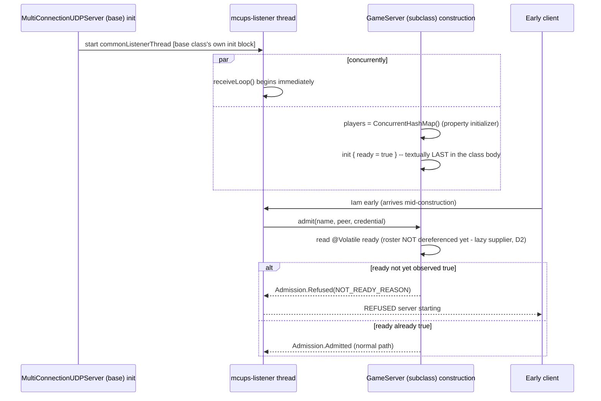

# Plan: adopt `webtools-udp` 2.0.0 in `gametools-net`

## Header / Association

- **Covers:** [SpartanLabsGaming/MyGameTools#124](https://github.com/SpartanLabsGaming/MyGameTools/issues/124)
  — *"Adopt webtools-udp 2.0.0 in gametools-net"*, milestone `6.0.0`.
- **Architecture:** `docs/webtools-udp-2.0.0-upgrade-architecture.md`, unit slug
  `webtools-udp-2.0.0-upgrade` (its only plannable unit, §12). This plan makes that design
  concrete, file by file; it does not revisit any decision in the architecture's §6 — where this
  plan makes an additional staging call the architecture left implicit, it says so.
- **Branch:** `feature/124-webtools-udp-2.0.0`, cut from a clean `master` only after the last
  `5.x` feature release (the pending `CHANGELOG.md` `[Unreleased]` `WorldSystem`/`CoreSystemSlot`
  work) is tagged. Not cut yet — see Preconditions.
- **Commit:** TBD.
- **PR:** TBD — `Closes #124`.
- **Status:** planning only; aligned with the architecture by the planner (see the architecture's
  "Cross-plan alignment" section for what that pass changed here). No source, test, or build file
  has been modified by this document.
- **Target version:** ships in `6.0.0` (Phase 2 Major), bumped on a later `release/6.0.0` branch,
  **not** on this feature branch. The module `coordinates(...)` calls are untouched here.
- **Baseline:** `master` @ `e2192b0` (2026-09-26), `./gradlew :gametools-net:test` green on
  2026-09-28, 56 tests:
  - component 7;
  - deterministic 19;
  - integration 21 (Broadcast 4, Capacity 4, Command 4, Handshake 4, Input 5);
  - e2e 7;
  - nonfunctional 2.

  Every `path:line` citation below is checked against that commit and against the unpacked
  `webtools-udp:2.0.0` / retired `WebTools:2.0.0c` sources. Remote `master` has since gained
  PR #125 (`0c19715`, docs-only: `CONTRIBUTING.md` slimmed to defer shared process to the
  [organization guide](https://github.com/SpartanLabsGaming/.github/blob/main/CONTRIBUTING.md)).
  No `gametools-net` file changed.
- **Recommended prerequisite PR:** this plan document plus the architecture document, committed
  together, docs-only, `Refs #124`, branch `docs/124-webtools-udp-2.0.0-plan`, staging **only**
  those two files (D11). See Version control.

---

## 1. Context and acceptance criteria

### 1.1 What this plan implements

`gametools-net` depends on the retired, monolithic `io.github.spartanlaboratories:WebTools:2.0.0c`
(`gametools-net/build.gradle.kts:9`). The split successor `io.github.spartanlaboratories:webtools-udp:2.0.0`
is on Maven Central and drops every dependency `gametools-net` never used (Selenium, jsoup,
bundled browser drivers — architecture §3). Porting onto it requires:

1. the dependency swap and package rename (`com.spartanlabs.webtools` →
   `com.spartanlabs.webtools.udp`) throughout `GameServer.kt`, `FakeClientHarness.kt`,
   `CommonPort.kt`, and `logback-test.xml`'s logger name — the only four places in the repo that
   reference the old package (architecture §7.1, confirmed by grep);
2. `GameServer`'s migration off the deprecated `Connection.actuate`/`push(String)` onto
   `connection.channel(DeliveryMode.UNRELIABLE)` (D6);
3. moving the `maxConnections` cap (and a blank-name and not-ready guard) from
   accept-then-silently-drop into `webtools-udp`'s new pre-accept `admit()` hook, so a refused
   client is told `REFUSED <reason>` instead of believing it connected (D2/D3/D4);
4. rebuilding the test double: `FakeClientHarness` becomes a thin wrapper over the real
   `MultiConnectionUDPClient` for every well-formed flow, plus a new, narrow `RawSocketClient`
   for the handful of malformed/adversarial inputs the real client cannot produce (D9);
5. the six implementation-time doc edits named in the brief (`README.md`, `CHANGELOG.md`,
   `GameServer` KDoc, `website/index.html`, `docs/framework-vision-and-roadmap.md`,
   `docs/api-openness-decisions-6.0.0.md`).

### 1.2 Acceptance criteria (from the architecture, §1.3)

- `gametools-net` compiles and its 56 tests (adapted to the framed wire, plus the new ones
  below) stay green under `webtools-udp:2.0.0`, with zero remaining reference to
  `com.spartanlabs.webtools` (non-`.udp`).
- An over-cap, blank-name, or pre-ready handshake is refused at the transport level (`REFUSED
  <reason>`), not accepted and then dropped.
- A refused client observes the refusal as `HandshakeRefusedException` whose `reason` equals the
  matching `GameServer.*_REASON` constant; a returning player under an already-connected name is
  still admitted when full.
- A player who reconnects under their own name — after `GameServer.disconnect()` or a prior
  capacity refusal — can rejoin from the same socket (fact 5).
- A near-maximum framed datagram (~60,000 payload bytes, comfortably under the 65,507-byte
  ceiling with CI margin) reaches `GameServer` intact.
- `README.md`, `CHANGELOG.md`, `website/index.html`, and the roadmap describe the 2.0 wire, the
  handshake-time refusal, and the new dependency; `GameServer`'s KDoc carries the new contract.
- No module outside `gametools-net`, and no downstream repo, is touched.

---

## 2. Design

### 2.1 Approach, inherited from the architecture

Same shape the architecture settled on: one dependency swap, one channel-API migration, one new
pre-accept admission hook, one test-double rebuild. §6 D1–D9 of the architecture is authoritative;
this section only adds the **commit staging** the architecture's §6/§11 described in prose but did
not spell out file-by-file — see 2.2.

### 2.2 A staging call this plan makes explicit (not decided by the architecture)

The architecture's D11 says commit 1 lands "the port itself ... admission is still post-accept at
the end of this commit" and commit 2 lands "`admit`-based refusal." It does not say which of D5's,
D6's, and D9's *sub-parts* land in which commit. Reading `HandshakeCoordinator.kt` settles it:

- **D5 (dropping the redundant `stale.terminate()` call) and D6 (the channel-API migration) are
  properties of `webtools-udp` 2.0.0 itself, independent of whether `GameServer` overrides
  `admit()`.** The moment the dependency swaps, `Connection.terminate()` **fully deregisters**
  (`UDPConnection.kt:67-69` → `HandshakeCoordinator.deregister`) instead of merely unbinding the
  handler (`WebTools:2.0.0c`'s behaviour). This means two of the architecture's §9 "behaviour
  change" bullets are already true in commit 1, before `admit()` exists at all:
  - **fact 5 (same-socket rejoin)** — `GameServer.disconnect()` already calls
    `connection.terminate()`, so it already fully deregisters from commit 1 onward;
  - **`pushToAllPlayers`'s "WebTools never prunes" KDoc claim already becomes false in commit 1**
    — an over-cap client's connection, terminated by `GameServer`'s own post-accept
    `admit(connection)`/`onClientConnect` failure path (unchanged code in commit 1), is now fully
    pruned from `webtools-udp`'s registration table too, not merely orphaned.

  So this plan lands D5, D6, the channel-API and wire-version parts of D7's KDoc rewrite (**not**
  the admission-rules/reason-meaning parts, which need `admit()` to exist), `CommonPort.kt`'s KDoc
  fix, the `logback-test.xml` rename, `FakeClientHarness`/`RawSocketClient`, and the
  wire-framing-only test changes (robustness reframing, legacy-unframed-drop, non-zero-channel,
  the fact-5 rejoin test) all in **commit 1** — none of them need `admit()` to exist. Only the
  capacity-refusal-visible tests, the pure decision, the `ready` flag, and the companion constants
  need **commit 2**.
- **The "not re-screened on retransmit" test is placed in commit 2, not commit 1**, even though
  the coordinator's retransmit branch (`HandshakeCoordinator.kt:248-254`) never calls `admit()` in
  either commit — because the point worth locking in is that commit 2's *refusing* `admit()`
  still isn't re-invoked for a retransmit; that claim is vacuous before commit 2 exists (the base
  class's default `admit()` never refuses anything, so there is nothing to prove yet).

This means `GameServerRobustnessTest.kt`, `GameServerHandshakeTest.kt`, and
`GameServerCapacityTest.kt` are each touched in **both** commits — once for the wire port, once
for the admission behaviour. The file-by-file section below tags every change `[commit 1]` or
`[commit 2]`.

### 2.3 Flow diagrams

```mermaid
sequenceDiagram
    participant C as Client (MultiConnectionUDPClient)
    participant L as mcups-listener (HandshakeCoordinator)
    participant GS as GameServer
    participant AD as decideAdmission (pure, commit 2 only)

    Note over C,GS: Commit 2 end state
    C->>L: Iam bob
    L->>GS: admit(name="bob", peer, credential)
    GS->>AD: decideAdmission("bob", ready, maxConnections) { players.keys }
    AD-->>GS: Admission.Refused(SERVER_FULL_REASON)
    GS-->>L: Admission.Refused(SERVER_FULL_REASON)
    L-->>C: REFUSED server full
    Note over L,GS: nothing registered; onClientConnect never fires;<br/>C's handshake() returns Result.failure(HandshakeRefusedException)
```



---

## 3. File-by-file changes

### Commit 1 — `feat(networking)!:` the wire port (admission still post-accept)

#### `gametools-net/build.gradle.kts`

- Line 9: `api("io.github.spartanlaboratories:WebTools:2.0.0c")` →
  `api("io.github.spartanlaboratories:webtools-udp:2.0.0")`. The scoping comment at `:7-8` stays
  verbatim (still correct: this is still networking-only, still kept off the shared convention
  plugin).
- Line 16 (pom `description`): `"The UDP GameServer, built on WebTools, plus the MouseAction wire
  type."` → `"The UDP GameServer, built on webtools-udp, plus the MouseAction wire type."`
- Line 13 `coordinates(..., "5.1.0")`: **unchanged** — the version bump rides `release/6.0.0`.

#### `gametools-net/src/main/kotlin/com/spartanlabs/gaming/networking/GameServer.kt`

- **Imports** (region 1.1): `com.spartanlabs.webtools.MultiConnectionUDPServer` /
  `com.spartanlabs.webtools.Connection` → `com.spartanlabs.webtools.udp.MultiConnectionUDPServer`
  / `com.spartanlabs.webtools.udp.Connection` / `com.spartanlabs.webtools.udp.DeliveryMode`
  (alphabetical within 1.1: `Connection`, `DeliveryMode`, `MultiConnectionUDPServer`).
  `com.spartanlabs.webtools.udp.Admission` is **not** imported here yet — it is added in commit 2
  alongside the `admit` override.
- **`listenTo`** — the only behavioural change in this file this commit:

  ```kotlin
  private fun listenTo(connection: Connection): Result<Unit> {
      if (players.put(connection.name, connection) != null) {
          log.info("'{}' reconnected; the previous connection is already gone", connection.name)
      }
      log.info("'{}' joined ({}/{})", connection.name, players.size, maxConnections)
      return connection.channel(DeliveryMode.UNRELIABLE).actuate { message -> dispatch(connection.name, message) }
  }
  ```

  (`put`'s return is only tested for non-null: binding it to an unused `stale` lambda parameter
  would raise an unused-variable warning.)

  Removes the `stale.terminate()` call (D5 — `webtools-udp`'s own same-name supersede
  (`HandshakeCoordinator.kt:277-287`) has already fully deregistered `stale` before this runs; a
  second `terminate()` would be a no-op, `UDPConnection.kt:67-69` → idempotent `deregister`).
  Reworded the log line to say the old connection is already gone rather than that this call is
  what tears it down. **Return type, mutability unchanged** (`Result<Unit>`, still a `private
  fun`); this is a signature-stable, body-only edit.
- **`pushToAllPlayers`** and **`push`** — fetch the channel per call (D6, `UdpChannel`'s own
  contract that either is fine):

  ```kotlin
  fun pushToAllPlayers(message: String): Result<Unit> {
      log.debug("Pushing a message to all {} player(s)", players.size)
      return players.values.fold(Result.success(Unit)) { pushed, connection ->
          val outcome = connection.channel(DeliveryMode.UNRELIABLE).send(message)
          pushed.andThen { outcome }
      }
  }

  fun push(playerName: String, message: String): Result<Unit> =
      players[playerName]?.channel(DeliveryMode.UNRELIABLE)?.send(message)
          ?: Result.failure(NoSuchElementException("No connected player named '$playerName'"))
  ```

  Signatures, `Result<Unit>` error type, and the attempt-everyone fold in `pushToAllPlayers` are
  **unchanged** — only the send target changes from the deprecated `connection.push(...)` to
  `connection.channel(DeliveryMode.UNRELIABLE).send(...)`.
- **`admit(connection: Connection): Result<Connection>` and the `onClientConnect` chain that calls
  it stay exactly as they are today** (still checking `!isFullyConstructed` /
  `players.size >= maxConnections` **after** acceptance) — this is the literal meaning of
  "admission is still post-accept at the end of this commit." Only the `Connection` type they
  operate on is now `com.spartanlabs.webtools.udp.Connection`.
- **`decodeInput`, `dispatch`, `broadcast` (both overloads), `disconnect`, `shutDown`,
  `STATE_VERB`/`INPUT_VERB`/`inputMessage`, the private `Result.andThen`**: unchanged — none of
  them touch `Connection`'s deprecated members or the admission model.
- **KDoc — the parts that change regardless of admission staging (D7, partial)**:
  - class KDoc: `REGISTERED` → `REGISTERED 2`; the keepalive contract changes from a bare text
    `KA` token to a framed `0x80` datagram, sent by the client via
    `MultiConnectionUDPClient.startKeepAlive()` or a bare `sendKeepAlive()` — `GameServer` itself
    arms none of `webtools-udp`'s opt-in scheduled features;
  - `onClientConnect`'s KDoc: replace the now-stale "the base class has, by this point, already
    told the client it is `REGISTERED`, so a refusal cannot be a handshake rejection" paragraph
    with a note that (in this commit) capacity is still enforced here, post-accept, and that
    changes in commit 2;
  - `pushToAllPlayers`'s KDoc: the "WebTools never prunes a registration" rationale
    (`GameServer.kt:256`, current text) is corrected per §2.2 above — `pushToAll` now reaches only
    currently-registered connections, same as `pushToAllPlayers`, except for the transient window
    before `onClientConnect` completes and the rare orphaned-registration case (architecture §13
    R4); `pushToAllPlayers` stays the roster-defined broadcast for "every player *I* currently
    track";
  - `disconnect`'s KDoc: its existing "free to handshake again" claim is now **actually true**
    (fact 5) — confirm this in prose, no wording change owed beyond that;
  - a new KDoc paragraph naming which upstream members are deprecated and unused
    (`actuate`/`push(String)`), and a warning against the inherited, now-visible
    `start`/`startBytes`/`startReliable`/`pushToAll(String/ByteArray)`/`pushToAllReliable`: each
    rebinds every connection's handler or reaches registrations `GameServer` itself no longer
    tracks; these are `final` in the base so only a KDoc warning is possible; the composition
    question that would let `GameServer` hide them is recorded against #103, named here;
  - the name-hijack caveat (anyone sending `Iam <connected-name>` from a new origin is admitted
    and supersedes the real player) — pre-existing, unchanged, closed by #102's credentials.
  - **Deferred to commit 2**: the admission-rules-and-reason-meanings KDoc, since `admit()` and
    the `*_REASON` constants do not exist yet in this commit.
- **Logging**: no new log statements beyond the reworded `listenTo` line above.

#### `gametools-net/src/test/kotlin/com/spartanlabs/gaming/testing/integration/networking/FakeClientHarness.kt` — rewrite

Becomes a thin wrapper over the real `MultiConnectionUDPClient` (D9). Public call shape kept
where practical:

```kotlin
internal class FakeClientHarness : AutoCloseable {
    private val client = MultiConnectionUDPClient(InetAddress.getLoopbackAddress())
    private val inbox = LinkedBlockingQueue<String>()

    fun handshake(name: String, timeoutMillis: Int = REPLY_TIMEOUT_MILLIS): Result<Unit> =
        client.handshake(name, timeoutMillis).also { result ->
            // Bind only on success - "handshake-then-bind" - so a refused/timed-out handshake
            // never starts the listener thread. handshake()'s own Result reports the handshake
            // outcome only; a (practically unreachable) bind failure is logged, not folded in.
            result.onSuccess {
                client.channel(DeliveryMode.UNRELIABLE).actuate { message -> inbox.put(message) }
                    .onFailure { cause -> log.error("Could not bind '{}''s inbound handler", name, cause) }
            }
        }

    fun receive(timeoutMillis: Int = REPLY_TIMEOUT_MILLIS): Result<String> =
        inbox.poll(timeoutMillis.toLong(), TimeUnit.MILLISECONDS)
            ?.let { Result.success(it) }
            ?: Result.failure(TimeoutException("No message arrived within ${timeoutMillis}ms"))

    fun send(message: String): Result<Unit> = client.channel(DeliveryMode.UNRELIABLE).send(message)

    fun sendKeepAlive(): Result<Unit> = client.sendKeepAlive()

    override fun close() {
        client.stop().onFailure { cause -> log.warn("Client did not stop cleanly", cause) }
    }

    private companion object {
        private val log = LoggerFactory.getLogger(FakeClientHarness::class.java)
        const val REPLY_TIMEOUT_MILLIS = 4000
    }
}
```

- **`handshake`**: delegates straight to `MultiConnectionUDPClient.handshake`, which already
  returns exactly the `Result<Unit>` contract this harness's callers need (`Result.success` on
  `REGISTERED 2`; `Result.failure(HandshakeRefusedException)` on a refusal;
  `Result.failure(IncompatibleProtocolException)` on a cross-major peer; a timeout otherwise). On
  success, binds the queue-feeding handler — **"handshake-then-bind"**: the bind only happens once
  the handshake itself is known to have succeeded, so a refused/timed-out handshake never starts
  the listener thread. `parseReply`/`HANDSHAKE_REPLY_VERB`/`VERB_INDEX`-style constants are
  **removed entirely** — there is nothing left to hand-parse; the real client owns that.
- **`receive`**: **queue-fed**, not a second blocking socket read — the actuate handler bound in
  `handshake` is the only thing that ever calls `inbox.put`, from `MultiConnectionUDPClient`'s own
  `mcupc-dispatch` thread; `receive` just polls with a timeout. Returns `Result.failure` (a
  `java.util.concurrent.TimeoutException`, an **expected**, not a programmer, failure) rather than
  `null`, so every existing `.getOrThrow()` call site keeps working unchanged.
- **`send`**: delegates to `client.channel(DeliveryMode.UNRELIABLE).send(message)` — same
  `Result<Unit>` shape as before.
- **`sendKeepAlive`**: delegates to `client.sendKeepAlive()` (one 0x80 datagram) — same contract as
  today, mirrors `Connection.keepAlive()`'s one-shot nature.
- **`close`**: calls `client.stop()` and logs (does not throw or propagate) a teardown failure.
  `MultiConnectionUDPClient` is **not** `AutoCloseable` (documented), so this harness's own
  `AutoCloseable` conformance is what every existing `harness.close()` / `use {}` call site keeps
  relying on; a teardown failure is logged rather than propagated, matching `ServerFixture.close()`'s
  existing pattern of not letting teardown failures fail a test that has already finished asserting.
- **Threading note (KDoc)**: the bound `actuate` handler runs on `mcupc-dispatch`, not the caller's
  test thread — `receive()`'s blocking poll is what makes that safe to consume from the test
  thread.
- **Class KDoc rewrite**: replace the "one socket per client, same socket for handshake and data"
  description (already correct in spirit) with the 2.0 framing detail: post-handshake traffic is
  now a framed `0x90` datagram, decoded and trimmed by the real client's `channel(UNRELIABLE)`
  before `receive()` ever sees it; a second `handshake()` call on the same harness is **undefined
  behaviour** on the real client (not "seen as a retransmit and repeats the first reply" as the
  old KDoc said) — tests that need that scenario use `RawSocketClient` instead.
- **What is *not* kept**: the harness's own socket, `BUFFER_BYTES`, `HANDSHAKE_VERB`, and every
  other hand-rolled wire literal — retired per the adoption verdict (architecture §7.1): well-
  formed flows now go through the real client's own wire handling.

#### `gametools-net/src/test/kotlin/com/spartanlabs/gaming/testing/integration/networking/RawSocketClient.kt` — new

The narrow raw-socket helper (D9), built on `webtools-udp`'s **public**
`HandshakeWireFormat`/`TransportWireFormat` builders rather than hand-rolled byte arrays — this is
what retires `FakeClientHarness`'s old private wire literals (`"Iam"`, `"REGISTERED"`, `"KA"`) per
architecture §7.1, and closes the duplication `SpartanLaboratories/WebTools#3` was filed about.

```kotlin
internal class RawSocketClient : AutoCloseable {
    private val address = InetAddress.getLoopbackAddress()
    private val socket = DatagramSocket()

    fun sendHandshake(name: String, credential: String = ""): Result<Unit> =
        sendText(HandshakeWireFormat.handshakeMessage(name, credential))

    fun sendText(text: String): Result<Unit> = runCatching {
        val payload = text.toByteArray(Charsets.UTF_8)
        socket.send(DatagramPacket(payload, payload.size, address, MultiConnectionUDPServer.COMMON_LISTEN_PORT))
    }

    fun sendFramed(payload: ByteArray, channel: Byte): Result<Unit> = runCatching {
        val datagram = TransportWireFormat.unreliableDatagram(payload, channel)
        socket.send(DatagramPacket(datagram, datagram.size, address, MultiConnectionUDPServer.COMMON_LISTEN_PORT))
    }

    fun receive(timeoutMillis: Int = REPLY_TIMEOUT_MILLIS): Result<String> = runCatching {
        socket.soTimeout = timeoutMillis
        val packet = DatagramPacket(ByteArray(BUFFER_BYTES), BUFFER_BYTES)
        socket.receive(packet)
        String(packet.data, 0, packet.length, Charsets.UTF_8).trim()
    }

    /** Composes [sendHandshake] and [receive] - the same fallible-step chain the production code uses. */
    fun handshakeRaw(name: String, credential: String = "", timeoutMillis: Int = REPLY_TIMEOUT_MILLIS): Result<String> =
        sendHandshake(name, credential).andThen { receive(timeoutMillis) }

    override fun close() { socket.close() }

    private companion object {
        private val log = LoggerFactory.getLogger(RawSocketClient::class.java)
        const val REPLY_TIMEOUT_MILLIS = 4000
        const val BUFFER_BYTES = 8192
    }
}
```

Each `send*` method logs at DEBUG on success (`"Raw client sent {} byte(s)"`) and the shared
`runCatching` failure is logged at WARN before being returned as `Result.failure` — mirrors
`FakeClientHarness`'s existing logging level choices (info-level lifecycle events would be too
noisy for a helper that intentionally sends malformed traffic in bursts).

- `sendHandshake(name = "", credential = "x")` is exactly how the blank-name raw case is produced:
  `HandshakeWireFormat.handshakeMessage("", "x")` returns `"Iam  x"` (a double space — the empty
  name sits between the verb and the credential), which `HandshakeCoordinator`'s
  `text.split(' ')` (`HandshakeCoordinator.kt:227`) parses as `tokens[1] == ""`
  (`HandshakeProtocol.kt:55-58` has no blank check — `SpartanLaboratories/WebTools#38`). No
  hand-rolled string needed.
- `sendFramed(payload, channel)` is how the non-zero-channel-byte case is produced:
  `TransportWireFormat.unreliableDatagram`'s `channel` parameter defaults to `0x00` but is
  overridable — pass `1` (or any non-zero byte) to build a datagram
  `HandshakeCoordinator.deliverData` (`HandshakeCoordinator.kt:301-316`) WARN-drops.
- `sendText` is the legacy-unframed path: an arbitrary raw string (`"KA"`, `"INPUT {...}"`, or
  `""`) with no `DatagramType` prefix — classified `null` by `ofTagByte` and, since it does not
  start with `"Iam"`, WARN-dropped (`HandshakeCoordinator.kt:220-232`).
- **Error handling**: every method returns `Result`; `runCatching` wraps the one possible checked
  failure (`java.io.IOException` from `DatagramSocket.send`/`.receive`), which is an **expected**
  I/O failure (a closed socket, a full send buffer), not a programmer error. Nothing here throws.
- Reuses `TestResultExtensions.andThen` (kept — see §3's note below) rather than either duplicating
  the chaining or leaving it to die.

**Note on `TestResultExtensions.kt`**: after the harness rewrite, `FakeClientHarness` no longer
calls `.andThen` (it delegates straight to `MultiConnectionUDPClient.handshake`, which already
composes send+receive+parse internally). This plan keeps `TestResultExtensions.kt` rather than
deleting it, because `RawSocketClient.handshakeRaw` above gives it a new, direct consumer with the
exact same "send, then receive" shape its own KDoc describes. **This is a call this plan makes,
not something the architecture states** — flagged in the return to the caller.

#### `gametools-net/src/test/kotlin/com/spartanlabs/gaming/testing/integration/networking/ServerFixture.kt`

- New field: `private val rawClients = mutableListOf<RawSocketClient>()`.
- New method, mirroring `client()`:

  ```kotlin
  /** @return a raw-socket helper that will be closed with this fixture */
  fun rawClient(): RawSocketClient = RawSocketClient().also { rawClients.add(it) }
  ```
- `close()`: add `rawClients.forEach(RawSocketClient::close)` alongside the existing
  `harnesses.forEach(FakeClientHarness::close)`.
- `client()`, `startServer`, `awaitPlayers`, `awaitPlayerMessage`/`Input`/`Command`, `settle`:
  unchanged.

#### `gametools-net/src/test/kotlin/com/spartanlabs/gaming/testing/integration/networking/CommonPort.kt`

- Import: `com.spartanlabs.webtools.MultiConnectionUDPServer` →
  `com.spartanlabs.webtools.udp.MultiConnectionUDPServer`.
- KDoc correction (D9): the claim that `stop()` "signals its listener thread to close the shared
  socket rather than closing it inline" is wrong under **either** WebTools version —
  `MultiConnectionUDPServer.stop()` (`MultiConnectionUDPServer.kt:512-524`) joins the listener
  thread (up to 1 s) and then calls `commonChannel.closeResult()` **on the calling thread**, after
  signalling the listener, not from it. Replace with: "`stop()` closes the socket inline on the
  calling thread, but only after joining the listener thread for up to a second — the flake this
  guards against was observed (commit `3f2a788`); the previously-stated cause was not accurate."
  No functional change.

#### `gametools-net/src/test/resources/logback-test.xml`

- Line 21: `<logger name="com.spartanlabs.webtools" level="INFO"/>` →
  `<logger name="com.spartanlabs.webtools.udp" level="INFO"/>`. Cosmetic only — Logback's
  dot-hierarchy already made the old name the ancestor logger; this is precision now that the
  monolithic artifact is retired. (`gametools-core`'s own `logback-test.xml` carries the same stale
  line although that module has no WebTools dependency at all — out of this unit's scope, left
  untouched.)

#### `gametools-net/src/test/kotlin/com/spartanlabs/gaming/testing/integration/networking/GameServerHandshakeTest.kt`

- **`a retransmitted Iam from the same origin does not register a second player`** — rewritten to
  use `fixture.rawClient()` instead of two `handshake()` calls on one `FakeClientHarness` (which is
  now undefined behaviour on the real client):

  ```kotlin
  @Test
  fun `a retransmitted Iam from the same origin does not register a second player`() {
      val server = fixture.startServer(maxConnections = 4)
      val raw = fixture.rawClient()

      val first = raw.handshakeRaw("alice").getOrThrow()
      assertTrue(HandshakeWireFormat.isRegistered(first))
      assertTrue(fixture.awaitPlayers(expected = 1))

      val second = raw.handshakeRaw("alice").getOrThrow()
      assertTrue(HandshakeWireFormat.isRegistered(second), "a retransmit repeats the accepted reply")
      fixture.settle()

      assertEquals(1, server.playerCount, "a retransmit registers nothing new")
      assertEquals(setOf("alice"), server.playerNames)
  }
  ```
- The other three tests (`a client that completes the handshake becomes a tracked player`,
  `reconnecting under the same name from a new origin does not count twice`,
  `an unrecognised message is ignored rather than admitting a player`): **no change** beyond
  compiling against the rewritten harness — each already uses one `handshake()` call per
  `fixture.client()` instance, which is well-formed on the real client.
- **New test [fact 5, D9]**:

  ```kotlin
  @Test
  fun `a disconnected player can re-handshake from the same socket`() {
      val server = fixture.startServer(maxConnections = 4)
      val raw = fixture.rawClient()

      assertTrue(HandshakeWireFormat.isRegistered(raw.handshakeRaw("alice").getOrThrow()))
      assertTrue(fixture.awaitPlayers(expected = 1))

      assertTrue(server.disconnect("alice").isSuccess)
      fixture.settle()

      assertTrue(HandshakeWireFormat.isRegistered(raw.handshakeRaw("alice").getOrThrow()),
          "the same socket should be able to rejoin after being disconnected")
      assertTrue(fixture.awaitPlayers(expected = 1))
      assertEquals(setOf("alice"), server.playerNames)
  }
  ```

  This is the fact-5 fix, real starting in commit 1 (§2.2) — placed here, not deferred to commit 2,
  because it needs nothing from `admit()`.

#### `gametools-net/src/test/kotlin/com/spartanlabs/gaming/testing/integration/networking/GameServerInputTest.kt`

- No change to the four existing tests beyond compiling against the rewritten harness.
- **New test — legacy unframed datagram dropped**:

  ```kotlin
  @Test
  fun `a legacy unframed datagram is dropped without reaching either callback or evicting the player`() {
      val (_, server) = connectedClient("alice")
      // A registered origin that then speaks the pre-2.0 unframed wire - the realistic legacy case,
      // since the text handshake itself is unchanged and still completes.
      val raw = fixture.rawClient()
      assertTrue(HandshakeWireFormat.isRegistered(raw.handshakeRaw("legacy").getOrThrow()))
      assertTrue(fixture.awaitPlayers(expected = 2))

      raw.sendText("KA").getOrThrow()
      raw.sendText("${GameServer.INPUT_VERB} {\"x\":1}").getOrThrow()
      raw.sendText("").getOrThrow()

      assertNull(fixture.awaitPlayerMessage(NEGATIVE_TIMEOUT_MILLIS), "unframed text must never reach onPlayerMessage")
      assertNull(fixture.awaitPlayerInput(NEGATIVE_TIMEOUT_MILLIS), "unframed INPUT must never reach onPlayerInput")
      assertEquals(2, server.playerCount, "dropping unframed traffic must not evict its sender or anyone else")
  }
  ```

  (Registering the raw origin first is what makes this test prove the *unframed* drop
  (`HandshakeCoordinator.kt:229-231`) rather than the separate unregistered-origin drop.)
- **New test — non-zero channel byte dropped**:

  ```kotlin
  @Test
  fun `an unreliable datagram on a non-zero channel is dropped rather than delivered`() {
      val (_, server) = connectedClient("alice")
      val raw = fixture.rawClient()
      assertTrue(HandshakeWireFormat.isRegistered(raw.handshakeRaw("chan-test").getOrThrow()))
      assertTrue(fixture.awaitPlayers(expected = 2))

      raw.sendFramed("CHAT hi".toByteArray(), channel = 1).getOrThrow()

      assertNull(fixture.awaitPlayerMessage(NEGATIVE_TIMEOUT_MILLIS))
      assertEquals(2, server.playerCount, "the drop must not evict the sender either")
  }
  ```

  (Registers a second player via the raw origin first, since the channel-byte guard only applies
  to a *registered* origin — `HandshakeCoordinator.deliverData` drops an unregistered origin's
  traffic at DEBUG before it ever reaches the channel check.)
- The existing `a keepalive datagram from a player is swallowed rather than reaching
  onPlayerMessage` test needs **no change** — it already calls `client.sendKeepAlive()`, which
  after the harness rewrite sends a real `0x80` framed keepalive instead of a bare `"KA"` text
  token; the assertion (never reaches either callback, roster unaffected) holds either way.

#### `gametools-net/src/test/kotlin/com/spartanlabs/gaming/testing/integration/networking/GameServerBroadcastTest.kt`, `GameServerCommandTest.kt`

- No test-body changes. Both already exercise `client.receive()` / `client.send(...)` through
  `FakeClientHarness`; the harness rewrite is transparent to them (same public call shape).

#### `gametools-net/src/test/kotlin/com/spartanlabs/gaming/testing/e2e/ClientServerRoundTripTest.kt`

- No test-body changes. `FakeClientHarness` is constructed directly here
  (`private val harness = FakeClientHarness()`); the rewrite's public shape
  (`handshake`/`send`/`receive`/`close`) is unchanged, so every existing assertion keeps compiling
  and passing.
- Comment fix only (`ClientServerRoundTripTest.kt:92-93`): "WebTools frees the shared port
  off-thread" repeats the inaccuracy D9 corrects in `CommonPort.kt`. Reword it to "`shutDown()`
  closes the shared socket inline, but the port has been seen to linger briefly; wait for it so the
  next test method's `GameServer` can bind it. See `awaitCommonPortFree`."

#### `gametools-net/src/test/kotlin/com/spartanlabs/gaming/testing/nonfunctional/GameServerRobustnessTest.kt`

- **`the server absorbs a burst of malformed datagrams...`** — kept, but now genuinely exercises
  `GameServer`'s own decoders rather than the wire classifier, since every `garbage` entry now
  travels **framed** through the real client's `channel(UNRELIABLE).send(...)` (via
  `harness.send(...)`, unchanged call site) instead of as raw unframed text. No test-body change
  needed beyond the harness rewrite — the garbage payloads themselves (malformed `INPUT`, empty
  string, the embedded binary-ish literal) are still valid **application payloads** once framed;
  only their journey through the transport changed.
- **`an oversized datagram does not take down the listener`** — renamed and reframed as a
  **positive** case per D9 (D9 explicitly asks for a delivered-intact assertion, not merely
  "does not crash"):

  ```kotlin
  @Test
  fun `a near-maximum framed datagram is delivered intact`() {
      connect("whale")
      val nearMax = "x".repeat(60_000) // margin under the 65,507-byte ceiling; ubuntu-latest (CI) has
                                        // no low UDP maxdgram - a local macOS run defaults to 9,216 and
                                        // would need `sudo sysctl net.inet.udp.maxdgram=65535` first
      harness.send(nearMax).getOrThrow()

      assertTrue(await { lastMessage == nearMax }, "the near-maximum payload did not arrive intact")
      assertEquals(1, server.playerCount)
  }
  ```

  This locks in the 65507-byte default receive buffer as a **fix** (architecture §9(3)), not merely
  "does not crash" — the old test's own comment ("it should be read (truncated) or dropped, never
  fatal") described `WebTools:2.0.0c`'s 1024-byte truncation; that comment is removed.
- **New — legacy unframed burst is dropped without disturbing the connected player** (a *separate*
  case from the framed burst above, per D9):

  ```kotlin
  @Test
  fun `a legacy unframed burst is dropped without disturbing the connected player`() {
      connect("stress")
      repeat(300) { raw.sendText(listOf("KA", "INPUT {}", "", "garbage").random(random)).getOrThrow() }

      harness.send("chat still here").getOrThrow()
      assertTrue(await { lastMessage == "chat still here" })
      assertEquals(1, server.playerCount)
  }
  ```

  The class keeps its no-fixture style: a class-level `private val raw = RawSocketClient()` field
  beside the existing `harness`/`server` fields, closed in `tearDown`.
- **`tearDown` [commit 1]**: becomes `harness.close(); raw.close(); server.shutDown();
  awaitCommonPortFree()` (import `com.spartanlabs.gaming.testing.integration.networking.awaitCommonPortFree`).
  Every other port-binding test class already waits for the common port (`ServerFixture.close()`,
  `ClientServerRoundTripTest.kt:94`); this class did not. It now grows from two to four
  port-binding methods, each constructing its own `GameServer` (JUnit makes one class instance per
  method), so the missing wait becomes a real `BindException` flake risk.
- The refusal-storm test is **not** added in this commit — see commit 2 below (§2.2).

---

### Commit 2 — `feat(networking)!:` `admit`-based refusal

#### `gametools-net/src/main/kotlin/com/spartanlabs/gaming/networking/PlayerAdmission.kt` — new

```kotlin
package com.spartanlabs.gaming.networking

//region 1. Organization Internal
// 1.1 Spartan Laboratories
import com.spartanlabs.webtools.udp.Admission
//endregion

/**
 * Pure, socket-free admission decision for one parsed `Iam` handshake - see
 * [GameServer.admit]. Evaluated in a fixed order: not-ready, then a blank
 * name, then capacity. Never throws.
 *
 * **Evaluation-order invariant.** [connectedNames] must not be invoked until
 * [ready] has been observed `true`: during [GameServer]'s own construction
 * race, [ready] can be read (its default `false`) safely, but the backing
 * roster it supplies is not yet initialized. Passing it as a lazy supplier -
 * rather than an eager `Set<String>` - is what keeps this ordering a
 * property of the call site rather than something this function has to
 * re-check; do not change [connectedNames] to an eager parameter.
 *
 * @param name the client's chosen name, exactly as parsed from `Iam`
 * @param ready whether the owning [GameServer] has finished constructing
 * @param maxConnections the server's configured player cap
 * @param connectedNames supplies the currently-connected player names;
 * invoked at most once, and only once [ready] and the blank-name check have
 * both passed
 * @return [Admission.Admitted], or [Admission.Refused] carrying
 * [GameServer.NOT_READY_REASON], [GameServer.BLANK_NAME_REASON], or
 * [GameServer.SERVER_FULL_REASON]
 */
internal fun decideAdmission(
    name: String,
    ready: Boolean,
    maxConnections: Int,
    connectedNames: () -> Set<String>,
): Admission = when {
    !ready -> Admission.Refused(GameServer.NOT_READY_REASON)
    name.isBlank() -> Admission.Refused(GameServer.BLANK_NAME_REASON)
    else -> {
        val connected = connectedNames()
        if (connected.size >= maxConnections && name !in connected) {
            Admission.Refused(GameServer.SERVER_FULL_REASON)
        } else {
            Admission.Admitted
        }
    }
}
```

- **Error handling**: never throws for any input (`String.isBlank()`, `Set.size`, `in` never
  throw); it has no `Result` because it has no failure mode to encapsulate — its "failure" *is*
  its return value (`Admission.Refused`), which is the success path for the caller
  (`HandshakeCoordinator.handleHandshake`, `HandshakeCoordinator.kt:260-263`, treats a *thrown*
  exception, not a `Refused`, as the failure to guard against).
- **Mutability**: pure function of immutable parameters; `connected` is a local `val`.
- **Logging**: none — deliberately. `HandshakeCoordinator` already logs every refusal at INFO with
  name/origin/reason (`HandshakeCoordinator.kt:265`); a second log call here would double-log every
  refusal.
- **KDoc**: Level-2, as above (`@param`/`@return`, the ordering invariant stated as prose *and* the
  reason it must stay that way — the architecture requires this exact framing, D2/D4).

#### `gametools-net/src/main/kotlin/com/spartanlabs/gaming/networking/GameServer.kt`

- **Imports**: add `com.spartanlabs.webtools.udp.Admission` (region 1.1, alphabetical:
  `Admission`, `Connection`, `DeliveryMode`, `MultiConnectionUDPServer`); add
  `java.net.InetSocketAddress` to region 2 ("Intended Function" — it is now integral to the
  admission decision, the class's own responsibility per the system inventory, not a catch-all
  utility type), ordered before `java.util.concurrent.ConcurrentHashMap` alphabetically
  (`java.net` < `java.util`).
- **Remove**: the private `admit(connection: Connection): Result<Connection>` method and its
  `isFullyConstructed` companion check (`GameServer.kt:134-142`, `:208-216` in the pre-port
  baseline) — both fully replaced.
- **Add, right after `players`'s declaration** (property order matters — see below):

  ```kotlin
  /**
   * Flips `true` once every field this instance owns has been assigned - see
   * [decideAdmission]'s ordering invariant. `webtools-udp`'s listener thread
   * can call [admit] while this instance is still mid-construction (the base
   * class starts listening from its own `init` block, before this subclass
   * body finishes); reading this `@Volatile` flag first, before touching
   * [players], is what gives that read a real happens-before edge rather
   * than a timing-dependent null check.
   *
   * MUST stay the class's own textually-last initializer below this point -
   * an `init { ready = true }` block below every other property initializer.
   * Adding a new property below that block would silently reopen the race.
   */
  @Volatile
  private var ready = false
  ```
- **`onClientConnect`** simplifies — `admit()` no longer runs here at all (it now runs on
  `webtools-udp`'s own listener thread, before this is ever called):

  ```kotlin
  override fun onClientConnect(connection: Connection) {
      listenTo(connection).onFailure { cause ->
          log.warn("Dropping '{}': {}", connection.name, cause.message)
          players.remove(connection.name, connection)
          connection.terminate()
      }
  }
  ```

  The remove-by-value + terminate + log failure path is **kept** verbatim — it now only fires for
  a genuine `listenTo` failure (the `channel(UNRELIABLE).actuate` call), not for a capacity
  refusal, which no longer reaches this method at all.
- **New `admit` override**:

  ```kotlin
  /**
   * Screens a fresh `Iam` handshake before `webtools-udp` accepts it. In order:
   * a handshake that arrives before this server has finished constructing is
   * refused with [NOT_READY_REASON]; a blank name with [BLANK_NAME_REASON]; a
   * new name while [maxConnections] players are already connected with
   * [SERVER_FULL_REASON]. A name that is already connected is always admitted -
   * a returning player replaces their own slot. [peer] and [credential] are
   * accepted (to match the base class's signature) but not consulted here;
   * credential screening is deferred to #102's `AuthProvider`.
   * (Public KDoc: the delegate is internal, so it is described, not linked.)
   *
   * Runs inline on `webtools-udp`'s listener thread, before any reply or
   * registration - see [MultiConnectionUDPServer.admit]'s own contract
   * (must return promptly, must never throw).
   *
   * @param name the client's chosen name, exactly as parsed from `Iam`
   * @param peer the client's observed post-NAT origin; unused
   * @param credential the opaque credential from `Iam <name> <credential>`; unused
   * @return [Admission.Admitted], or [Admission.Refused] carrying
   * [NOT_READY_REASON], [BLANK_NAME_REASON], or [SERVER_FULL_REASON]
   */
  override fun admit(name: String, peer: InetSocketAddress, credential: String): Admission =
      decideAdmission(name, ready, maxConnections) { players.keys }
  ```
- **The final `init` block** (textually last in the class body, after every property/`init`
  above it, including the companion object's members which do not participate in instance
  initialization order):

  ```kotlin
  // Must stay the LAST initializer in this class body - see [ready]. Kotlin runs property
  // initializers and init blocks in textual order; anything initialized below this line
  // would be read by the listener thread before it is assigned.
  init {
      ready = true
  }
  ```

  This Level-1 comment is required (architecture D4): the `ready` KDoc states the invariant for
  API readers; this comment guards the edit site itself.
- **Companion object — three new constants**:

  ```kotlin
  /** The [Admission.Refused] reason for a handshake that arrives before this server finished constructing. */
  const val NOT_READY_REASON = "server starting"

  /** The [Admission.Refused] reason for a blank (or whitespace-only) handshake name. */
  const val BLANK_NAME_REASON = "blank name"

  /** The [Admission.Refused] reason when [maxConnections] is already reached under a new name. */
  const val SERVER_FULL_REASON = "server full"
  ```

  **Tier: Stable Core** (D3) — these strings are part of the wire contract exactly as
  `STATE_VERB`/`INPUT_VERB` already are; changing one is a wire-behaviour break, governed by
  semver like the verbs.
- **KDoc — the admission-rules half of D7 deferred from commit 1**: add to the class KDoc the
  admission rules (not-ready / blank name / over-cap, in that order) and each reason constant's
  meaning; state the threading contract explicitly (`admit`/`onClientConnect` inline on
  `mcups-listener`; message routing on `mcups-dispatch`).
- **Logging**: no new log call in `admit` itself (see `PlayerAdmission.kt`'s note above — would
  double-log).

#### `gametools-net/src/test/kotlin/com/spartanlabs/gaming/testing/deterministic/networking/PlayerAdmissionTest.kt` — new

Level 4a — every branch of `decideAdmission`, no port bound, mirrors the production package
(`com.spartanlabs.gaming.networking` → `com.spartanlabs.gaming.testing.deterministic.networking`).
One test class, `kotlin.test` assertions (matches the rest of `gametools-net`'s test style — no
MockK needed here, there is nothing to mock: `connectedNames` is a plain lambda). At minimum:

- `not ready refuses with NOT_READY_REASON regardless of name or capacity`
- **`connectedNames is never invoked while not ready`** — pass
  `connectedNames = { error("must not be evaluated") }` with `ready = false` and assert the call
  does not throw; this is the executable form of D2's evaluation-order constraint.
- `a blank name refuses with BLANK_NAME_REASON even under capacity` (blank beats capacity: pass a
  cap that is not yet reached, prove it still refuses on the name)
- `a blank name refuses with BLANK_NAME_REASON even over capacity` ("blank beats full" — the
  explicit precedence the architecture calls out)
- `an unconnected name at or over capacity refuses with SERVER_FULL_REASON`
- `an already-connected name is admitted even at or over capacity` (the returning-player bypass)
- `a valid name under capacity is admitted`
- `zero capacity refuses every new name with SERVER_FULL_REASON`

#### `gametools-net/src/test/kotlin/com/spartanlabs/gaming/testing/integration/networking/GameServerCapacityTest.kt`

- **`players beyond maxConnections are refused`** — the doomed handshake now observably fails:

  ```kotlin
  val refusal = fixture.client().handshake("p3")
  assertTrue(refusal.isFailure, "an over-cap handshake must be refused, not silently dropped")
  val cause = assertIs<HandshakeRefusedException>(refusal.exceptionOrNull())
  assertEquals(GameServer.SERVER_FULL_REASON, cause.reason)
  ```

  (drops the old `fixture.settle()` for this handshake — nothing was ever registered, so there is
  no async window to wait out for it; the cap/roster assertions below it are unchanged.)
- **`a refusal does not evict the players already connected`** — same refusal-assertion swap for
  `"intruder"`.
- **`a server with no capacity admits nobody`** — same swap; `maxConnections = 0` refuses on the
  very first handshake.
- **`a returning player is admitted even when the server is full`** — **no change**: the
  already-connected-name bypass produces the same `Result.success` observation either side of this
  commit (architecture D2, confirmed against `GameServerCapacityTest.kt:59`).
- **New — retransmit-not-re-screened, at capacity**:

  ```kotlin
  @Test
  fun `a retransmit from an already-registered origin is not re-screened even at capacity`() {
      val server = fixture.startServer(maxConnections = 1)
      val raw = fixture.rawClient()
      assertTrue(HandshakeWireFormat.isRegistered(raw.handshakeRaw("alice").getOrThrow()))
      assertTrue(fixture.awaitPlayers(expected = 1))

      // A retransmit is keyed on ORIGIN, not on the name it carries: the coordinator echoes
      // REGISTERED 2 without re-running admit(). Were admit() run, "bob" would be refused as
      // SERVER_FULL (1/1 and "bob" is not connected) - so a REGISTERED reply proves no re-screening.
      raw.sendHandshake("bob").getOrThrow()
      val reply = raw.receive().getOrThrow()

      assertTrue(HandshakeWireFormat.isRegistered(reply), "a retransmit from a known origin is never re-screened")
      assertEquals(setOf("alice"), server.playerNames, "the roster must be unaffected by the retransmit's token")
  }
  ```

  (Not `sendHandshake("")`: that sends `Iam `, which the server trims to `Iam`
  (`CommonChannel.kt:78`) and then fails to parse (`HandshakeProtocol.kt:57`, fewer than two
  tokens) *before* the known-origin branch runs. No reply comes back and the test times out.)
- **New — a refused client can retry from the same socket once a slot frees**:

  ```kotlin
  @Test
  fun `a refused client can retry from the same socket once a slot frees`() {
      val server = fixture.startServer(maxConnections = 1)
      assertTrue(fixture.client().handshake("keeper").isSuccess)
      assertTrue(fixture.awaitPlayers(expected = 1))

      val raw = fixture.rawClient()
      val refusal = raw.handshakeRaw("latecomer").getOrThrow()
      assertTrue(HandshakeWireFormat.isRefused(refusal))
      assertEquals(GameServer.SERVER_FULL_REASON, HandshakeWireFormat.refusalReason(refusal))

      assertTrue(server.disconnect("keeper").isSuccess)

      val accepted = raw.handshakeRaw("latecomer").getOrThrow()
      assertTrue(HandshakeWireFormat.isRegistered(accepted), "the same socket should be able to retry once a slot frees")
      assertTrue(fixture.awaitPlayers(expected = 1))
      assertEquals(setOf("latecomer"), server.playerNames)
  }
  ```
- Class KDoc: the "an over-cap player still receives a `REGISTERED` reply and is dropped
  immediately afterwards" rationale is now wrong — replace with "an over-cap, blank-name, or
  pre-ready handshake is refused before anything is registered; see `PlayerAdmissionTest` for the
  pure decision and this class for its effect over the real wire."

#### `gametools-net/src/test/kotlin/com/spartanlabs/gaming/testing/nonfunctional/GameServerRobustnessTest.kt`

- **New — refusal storm**:

  ```kotlin
  @Test
  fun `many over-cap handshakes are all refused, the roster stays at cap, and the sitting player is still served`() {
      // Fills this file's existing maxConnections = 2 field to capacity with two legitimate
      // players, rather than constructing a second GameServer - a second instance would race the
      // class-level `server` field for the same fixed common port (both bind it in their
      // constructor) and fail with a BindException. Filling the existing cap needs no new server.
      val keeper1 = FakeClientHarness()
      val keeper2 = FakeClientHarness()
      val attackers = List(25) { FakeClientHarness() }
      try {
          keeper1.handshake("keeper1").getOrThrow()
          keeper2.handshake("keeper2").getOrThrow()
          assertTrue(await { server.playerCount == 2 })

          attackers.forEachIndexed { index, attacker ->
              val refusal = attacker.handshake("attacker-$index")
              assertTrue(refusal.isFailure)
              assertEquals(
                  GameServer.SERVER_FULL_REASON,
                  (refusal.exceptionOrNull() as HandshakeRefusedException).reason,
              )
          }
          assertEquals(setOf("keeper1", "keeper2"), server.playerNames, "the storm must not have grown the roster")
          assertTrue(server.push("keeper1", "still here").isSuccess, "the sitting player must still be served")
          assertEquals("still here", keeper1.receive().getOrThrow())
      } finally {
          attackers.forEach(FakeClientHarness::close)
          keeper1.close()
          keeper2.close()
      }
  }
  ```

  Uses this file's existing class-level `server` field (`maxConnections = 2`) as-is — filling it
  to capacity with two players sidesteps the `BindException` a second, locally-scoped `GameServer`
  would hit racing that same field for the fixed common port, and needs no separate Open decision.

---

## 4. Documentation impact (Audience-Reach rings)

| Ring | Touched? | What moves |
|---|---|---|
| **Inner core** | No | No new `//region` groups beyond the import-region shuffles already itemised above. |
| **Component ring** (KDoc) | **Yes, primary** | `GameServer` class + `admit`/`onClientConnect`/`listenTo`/`pushToAllPlayers`/`disconnect` KDoc (split across commits 1/2, §2.2); the new `PlayerAdmission.kt`'s KDoc; `FakeClientHarness`'s and `RawSocketClient`'s KDoc; `CommonPort`'s corrected KDoc. |
| **Boundary ring** (protocol) | **Yes, primary** | The wire itself changes (framed datagrams, `REGISTERED 2`, `REFUSED <reason>`) — `README.md`, `CHANGELOG.md`, and `website/index.html` all carry the new contract; the 6.0.0 wire break is cross-process (a hand-rolled client, and the separate client project, must move too) — CHANGELOG-only per the user's scope limit, no downstream issue filed. |
| **Architectural outer layer** | Yes | `docs/framework-vision-and-roadmap.md` §3/§7 (upstream prerequisite now satisfied, capability table updated); `docs/api-openness-decisions-6.0.0.md`'s Follow-up re-homed to #103. |

Per the repo's README-currency rule (global `~/.claude/CLAUDE.md` + this repo's own convention):
this changes a dependency, a wire protocol, and a KDoc-visible contract, so `README.md` moves in
commit 3, the same PR.

### Commit 3 — `docs:`

#### `README.md`

- Line 27 (Overview bullet): `"a single shared multiplexed socket"` stays accurate in spirit;
  append the framed-wire detail: `"— A **UDP `GameServer`** built on top of Spartan Laboratories'
  `webtools-udp`, handling client handshakes (with handshake-time capacity/name screening),
  a single shared multiplexed socket, input decoding, and JSON world-state broadcast."`
- Line 197 (Networking feature bullet) — replace the whole sentence:

  > `GameServer`, built on Spartan Laboratories' `webtools-udp` `MultiConnectionUDPServer`: screens
  > the `Iam <name>` handshake before accepting it - refusing a blank name, a still-starting
  > server, or a full roster with `REFUSED <reason>` rather than a silent drop - then replies
  > `REGISTERED 2` and multiplexes every player's traffic - application data, broadcasts, and
  > keepalives - over one shared, framed socket, decodes `INPUT` datagrams into structured
  > `MouseAction` events and `COMMAND` datagrams into typed `ClientCommand`s, and routes everything
  > else to your own callback. Clients must speak `webtools-udp` 2.0.0's framed wire - use its
  > `MultiConnectionUDPClient`, which surfaces a refusal as `HandshakeRefusedException` - and keep
  > their NAT mapping warm with `MultiConnectionUDPClient.startKeepAlive()` (or a bare `0x80`
  > keepalive datagram) rather than a hand-timed text token.
- Line 250 (transitive-deps note): `"Spartan Laboratories' [`WebTools`](...)"` →
  `"Spartan Laboratories' [`webtools-udp`](...)"`.
- Line 374 (Tech Stack Dependencies row): `[WebTools](...)` → `[webtools-udp](...)`.
- No install-snippet version bump here (rides `release/6.0.0`).

#### `CHANGELOG.md` `[Unreleased]`

```markdown
### Added
- `GameServer.SERVER_FULL_REASON`, `GameServer.BLANK_NAME_REASON`, `GameServer.NOT_READY_REASON` -
  the wire-stable `REFUSED <reason>` strings a handshake-time refusal carries.

### Changed
- **BREAKING — `webtools-udp` 2.0.0 (was `WebTools` 2.0.0c).** Three independent breaks at once:
  - *Package.* `GameServer`'s public supertype `MultiConnectionUDPServer`, and `Connection`, move
    from `com.spartanlabs.webtools` to `com.spartanlabs.webtools.udp` - any code that imports or
    names these types fails to compile until its imports move too. `GameServer` also now inherits
    `webtools-udp` 2.0.0's new public members (`admit`, `onClientDisconnect`, `startBytes`,
    `startReliable`, `pushToAll(ByteArray)`, `pushToAllReliable`). `GameServer` itself uses none
    of them except `admit`; do not call the inherited `start`/`startBytes`/`startReliable` on a
    `GameServer` - each rebinds every player's handler and bypasses its message routing.
  - *Wire.* The handshake reply is now `REGISTERED 2` (was bare `REGISTERED`); every
    post-handshake datagram is now framed with a 1-byte type tag (a keepalive is `0x80`,
    application data is `0x90 <channel> <payload>`). **This is a full transport break - every
    client process must move to `webtools-udp` 2.0.0+ to speak to a `6.0.0` `GameServer`; a
    pre-2.0 client fails the handshake cleanly rather than silently misbehaving.** Server-side
    code built only on `GameServer`'s own Kotlin API needs no code change beyond import paths, if
    it names WebTools types directly.
  - *Behaviour.* A handshake over capacity, under a blank name, or arriving before construction
    finished is now refused at handshake time (`REFUSED <reason>`, nothing registered) instead of
    accepted and then silently dropped. A returning player under an already-connected name is
    still admitted when full.

### Fixed
- A player dropped by `GameServer.disconnect()` (or previously refused for capacity) can now
  actually rejoin from the same socket - under `WebTools` 2.0.0c that origin was stuck on an
  "already-registered" echo forever.
- A client datagram up to ~65,505 payload bytes now reaches `GameServer` intact - the previous
  1024-byte receive buffer silently truncated anything larger.

### Dependencies
- `io.github.spartanlaboratories:WebTools:2.0.0c` → `io.github.spartanlaboratories:webtools-udp:2.0.0`
  (the monolithic `WebTools` artifact is retired upstream). `gametools-net` no longer brings in
  WebTools' unrelated baggage: `selenium-java`, `jsoup`, `unirest-java` and `skrapeit` (runtime
  scope), the bundled browser-driver executables, and its `GeneralTools` 2.0.1 (GameTools already
  declares `GeneralTools` 2.2.0 directly). A consumer that relied on any of these transitively
  must declare it itself.
```

Do **not** list upstream's own `@Deprecated` ladder (`actuate`/`push(String)` etc.) under this
repo's `### Deprecated` — those are `webtools-udp`'s API, not GameTools'.

#### `website/index.html`

- Line 374 (Transitive dependencies note): `WebTools` link text/label → `webtools-udp`, same target
  org page.

#### `docs/framework-vision-and-roadmap.md`

- Lines 164-170 (Phase 3 upstream-prerequisite callout): replace with — the prerequisite transport
  work shipped as `webtools-udp` `1.1.0`–`2.0.0` and is adopted by `gametools-net` via #124; Phase 3
  planning is unblocked.
- Lines 297-305 (§7 "Belongs in WebTools" table): mark #8/#9/#11 **Released & adopted** (binary
  path, receive buffer, handshake reject+credential — #124 adopts the pre-accept refusal half of
  #11; the credential half is still deferred to #102); #10 **Released, not yet adopted** (Phase 3
  `SessionRegistry`'s job); #12/#13 **Released, not yet adopted** (each Phase 3 item's home
  unchanged); #14 **Released, not yet adopted** (Phase 3+ reliable channel). Cross-reference
  architecture §7.2/D8's table for the exact Phase 3 home of each.
- Line 187 (Phase 3 item 7, "`GameServer` rework"): append a note that the composition-vs-
  inheritance question and the `GameServer`/`ClientCommandCodec`/`ApplyResult` openness review are
  now recorded against #103 (2026-09-27), not open items of this phase-7 bullet itself.

#### `docs/api-openness-decisions-6.0.0.md`

- "Follow-up" section (~lines 216-221): amend the `gametools-net` review bullet to record that
  Spartak re-homed it to #103 on 2026-09-27, rather than leaving it silently contradicted by that
  decision. The `gametools-world` half of that same bullet (`TiledMap`, `TerrainLayer`,
  `StaticGeometry`, `ZoneGrid`, `ZoneIndex`) is **untouched** — still owed, unrelated to this unit.

---

## 5. Test plan (5-level hierarchy)

Commands per level: `componentTest`, `integrationTest`, `deterministicTest`, `e2eTest`,
`nonfunctionalTest` (each a Gradle task scoped by package, `build-logic/.../gametools.kotlin-
library.gradle.kts:51-70`); `./gradlew :gametools-net:test` runs all of them together.

| Level | Package | Path | Test class | Behaviours locked down | New/changed |
|---|---|---|---|---|---|
| 1 — gating | — | — | — | `./gradlew componentTest deterministicTest` (the pre-push gate in `CONTRIBUTING.md` §Running the build and tests) plus compile; no dedicated gating folder or task in this repo | unaffected, must stay green throughout |
| 2 — component | `com.spartanlabs.gaming.testing.component.*` | — | — | **None for this unit.** `GameServer` has no fake-`Connection`-based component tests today (a pre-existing gap, not introduced here); constructing any `GameServer` binds port 9998, which is why the pure decision moved to Level 4a instead of a mocked Level 2 test | none |
| 3 — integration | `...testing.integration.networking` | `gametools-net/src/test/kotlin/.../testing/integration/networking/` | `GameServerHandshakeTest` | tracked-player handshake; reconnect-from-new-origin dedup; retransmit-from-same-origin (now via `RawSocketClient`) registers nothing new; unrecognised message ignored; **new:** same-socket rejoin after `disconnect()` (fact 5) | commit 1 |
| 3 | same | same | `GameServerCapacityTest` | **new:** `REFUSED` + `SERVER_FULL_REASON` for over-cap/zero-capacity; returning player admitted when full (unchanged); **new:** retransmit-while-full not re-screened; **new:** a refused client retries from the same socket once a slot frees | commit 2 |
| 3 | same | same | `GameServerInputTest` | `INPUT`→`MouseAction`; malformed `INPUT` dropped; non-`INPUT` to `onPlayerMessage`; keepalive swallowed (now the real `0x80`); **new:** legacy unframed datagram dropped without evicting; **new:** non-zero channel byte dropped | commit 1 |
| 3 | same | same | `GameServerBroadcastTest`, `GameServerCommandTest` | broadcast filtering/tagging, per-player push isolation, `COMMAND` routing — all unchanged, harness-transparent | commit 1 (harness swap only) |
| 4a — deterministic | `...testing.deterministic.networking` | `.../testing/deterministic/networking/` | `PlayerAdmissionTest` | every `decideAdmission` branch: not-ready (and that the roster supplier is never invoked while not ready), blank-name-beats-capacity in both directions, over-cap refusal, returning-player bypass, zero-capacity, valid-name-under-capacity | new, commit 2 |
| 4b — e2e | `...testing.e2e` | `.../testing/e2e/` | `ClientServerRoundTripTest` | full client→server→simulation→client loop over the real client; unchanged assertions | commit 1 (harness swap only) |
| 4c — nonfunctional | `...testing.nonfunctional` | `.../testing/nonfunctional/` | `GameServerRobustnessTest` | framed malformed burst still reaches `GameServer`'s own decoders; **new:** legacy unframed burst dropped without disturbing the connected player; near-maximum (~60,000-byte) framed datagram delivered intact (was: "does not crash" on an unframed oversized string); **new:** refusal storm — many over-cap handshakes are all refused, roster stays at cap, sitting player still served | commits 1 (burst reframe + near-max + legacy-burst) and 2 (refusal storm) |
| 5 — UAT | — | — | — | interop with the separate client project once *it* moves to `webtools-udp` 2.0.0; real-NAT exploratory testing | manual, out of automated scope |

### What cannot be automated

- **Real NAT traversal.** Loopback tests prove the framed protocol shape, not that a
  symmetric/port-restricted NAT stays open across it — that is `webtools-udp`'s own UAT territory.
- **Interop with the real downstream client(s).** `MyGameServer`/`GameGraphics` and the separate
  client project must move to `webtools-udp` 2.0.0 first; no issue is filed against them per the
  user's binding scope limit (§6 R1 below) — the CHANGELOG is the only notice they get.
- **The construction-race `NOT_READY` branch, live.** Firing a real `Iam` at a server mid-
  construction is inherently racy and would be flaky under CI load (architecture §11); it is
  instead covered deterministically at Level 4a (`PlayerAdmissionTest`'s not-ready case) and the
  `ready` flag's ordering invariant is carried by KDoc, a Level-1 line comment, and review.
- **WARN log volume during the malformed burst.** `SpartanLaboratories/WebTools#41` (unbounded
  per-datagram WARN volume) is a known, separately-tracked upstream characteristic — the
  robustness tests assert on server *behaviour*, never on log volume.

---

## 6. Risks and edge cases

- **R1 — Breaking change, by design, cross-repo.** Package, wire, and behaviour all break at once.
  No downstream-repo issue is filed per the user's binding scope limit — `MyGameServer`,
  `GameGraphics`, and the separate client project discover the break only through the CHANGELOG.
  Both consumer repos and the client project must move to `webtools-udp` 2.0.0 in lockstep with
  this release or interoperation stops the moment a `6.0.0` `gametools-net` is in the loop.
- **R2 — Upstream JDK mismatch, `SpartanLaboratories/WebTools#47`.** `webtools-udp:2.0.0` ships JDK
  23 bytecode against its own README's JDK 11+ claim — already filed, no action needed here since
  GameTools already targets JDK 23.
- **R3 — Known upstream issues relevant to this repo's own tests.** `#38` (a double-space `Iam  x`
  parses to an empty name) is exactly why `BLANK_NAME_REASON`'s branch exists — mitigated by this
  design, not merely noted. `#39` (the client screens datagram origin only on its reliable branch)
  *does* touch this port's tests: the rebuilt `FakeClientHarness` receives through the real
  client's unreliable branch, which accepts `0x90`/`0x80` datagrams from any source. It is
  harmless for loopback-only tests with nothing else sending to the client's ephemeral port, but no
  test may rely on client-side origin isolation. `#41` (unbounded WARN log volume) — the robustness
  tests must not assert on log volume (§5).
- **The near-maximum datagram size is platform-sensitive.** The reframed 4c test sends a
  ~60,000-byte framed datagram over loopback. It must pass on ubuntu (CI) **and on Windows**, the
  maintainer's platform, where the 2026-09-28 baseline ran. macOS's default
  `net.inet.udp.maxdgram` (9216) would need raising locally. If either required platform rejects
  the send, stop and report rather than shrinking the payload silently. Any size above 1024 bytes
  still proves the old truncation is gone, but choosing the replacement size is a call to surface,
  not to make in passing.
- **Two unfiled upstream defect candidates (documented, not filed this run, per architecture §13 R4)**:
  (i) a registration is added before its `REGISTERED` reply is confirmed sent, so a failed send
  leaves an orphaned registration with no `onClientConnect` ever having fired and no retransmit
  recovery; (ii) `stop()`'s listener-thread join always waits the full second (no `SO_TIMEOUT` on
  the blocked `receive()`), so teardown is slower than it needs to be. Both pre-exist in
  `WebTools:2.0.0c` too; noted here for a future maintainer who sees either as a flaky test or slow
  teardown, not filed against `WebTools` in this run per the run's explicit scope.
- **The name-hijack caveat.** Anyone sending `Iam <connected-name>` from a new origin is admitted
  and supersedes the real player — pre-existing, unchanged by this port, closed only once #102's
  credentials land.
- **The inherited `start`/`startBytes`/`startReliable` hazard.** Each is `public` (inherited,
  `final` in the base) and rebinds *every* connection's handler in one call, silently detaching
  `GameServer.dispatch` for every player at once. Only a KDoc warning is possible in this unit; the
  composition change that would let `GameServer` hide them is recorded against #103.
- **Concurrency.** `admit` and `onClientConnect` both run inline on `mcups-listener`; `decideAdmission`
  is deliberately O(1) and allocation-light (a size compare and a set-membership check) so it
  cannot become the slow-`admit` hazard the upstream KDoc warns against.
  `MultiConnectionUDPClient`'s listener/dispatch split means `FakeClientHarness.receive()` reads
  from a queue fed by a different thread than the test thread — already accounted for by the
  queue-fed design (§3, commit 1).
- **Performance.** The default receive buffer grows from 1024 to 65,507 bytes — a per-server, not
  per-connection, allocation; negligible at the roadmap's medium-scale target.
- **The plan going stale before execution.** The implementation branch is cut only after the last
  `5.x` feature release tags — by then, line numbers in this plan (and in the architecture) may
  have drifted; re-run the blast-radius grep (§7, Preconditions) before trusting any citation
  verbatim.
- **The working-tree WIP.** `CHANGELOG.md`, `CONTRIBUTING.md`, `README.md`, and
  `docs/framework-vision-and-roadmap.md` all carry unrelated uncommitted edits as of this plan's
  writing (`git status`, confirmed) — none of them may ride along with this unit's commits; the
  executor must confirm `master` is clean of them (or that they have since landed) before
  branching.

---

## 7. Preconditions / gates (re-check before cutting the branch)

1. The last `5.x` feature release (the pending `CHANGELOG.md` `[Unreleased]` `WorldSystem`/
   `CoreSystemSlot` work) is tagged.
2. `master` is clean of the unrelated uncommitted edits noted in §6 — re-run `git status`.
3. The baseline is re-run: `./gradlew :gametools-net:test` green, 56 tests, before touching
   anything.
4. The blast-radius grep is re-run — `grep -rn "com\.spartanlabs\.webtools\b" gametools-net/src`
   (note the word boundary: excludes `com.spartanlabs.webtools.udp`) — confirming the four-file
   surface (`GameServer.kt`, `FakeClientHarness.kt`, `CommonPort.kt`, `logback-test.xml`) is still
   the complete surface; every `path:line` citation in this plan and the architecture may have
   drifted and should be re-verified before being trusted verbatim.
5. `io.github.spartanlaboratories:webtools-udp:2.0.0` still resolves from Maven Central. **If any
   `webtools-udp` release newer than `2.0.0` exists by branch time, stop and ask the user before
   deviating from `2.0.0`** (the version the user specified) — never a silent upgrade. Bring the
   newer release's changelog to that question, noting in particular whether it fixes
   `SpartanLaboratories/WebTools#38` / `#39` / `#41`.
6. Local `master` is up to date with `origin/master`. At planning time the local checkout sat at
   `e2192b0`, one docs-only merge behind origin (PR #125, `0c19715`, slimmed `CONTRIBUTING.md`).
   The working tree's uncommitted `CONTRIBUTING.md` edits predate #125 and will need reconciling
   by their owner — not part of this unit.

---

## 8. Version control

- **Branch:** `feature/124-webtools-udp-2.0.0`, cut from a clean `master` once §7's gates pass.
- **Commit 1** — files: `gametools-net/build.gradle.kts`; `GameServer.kt`;
  `FakeClientHarness.kt` (rewrite); `RawSocketClient.kt` (new); `ServerFixture.kt`;
  `CommonPort.kt`; `logback-test.xml`; `GameServerHandshakeTest.kt`; `GameServerInputTest.kt`;
  `GameServerRobustnessTest.kt` (partial — burst reframe, near-max, legacy-burst; refusal storm is
  commit 2). Gradle before committing: `./gradlew :gametools-net:test` (every level, including
  the unchanged `componentTest`/`deterministicTest` suites) then `./gradlew
  dokkaGeneratePublicationHtml` (this commit rewrites most of `GameServer`'s KDoc).

  ```
  feat(networking)!: port gametools-net onto webtools-udp 2.0.0

  Swap the retired WebTools:2.0.0c dependency for webtools-udp:2.0.0, migrate
  GameServer off the deprecated Connection.actuate/push(String) onto
  channel(DeliveryMode.UNRELIABLE), and rebuild the test double: FakeClientHarness
  becomes a thin wrapper over the real MultiConnectionUDPClient, with a new
  RawSocketClient for the malformed/adversarial cases the real client cannot
  produce. Admission is still post-accept at the end of this commit - the
  admit()-based refusal lands in the next commit.

  Two behaviour changes are already true from this dependency swap alone:
  Connection.terminate() now fully deregisters (was: unbind-only), so a
  disconnected player can rejoin from the same socket, and the default
  65,507-byte receive buffer replaces the old 1024-byte truncating one.

  Refs #124

  BREAKING CHANGE: gametools-net now depends on
  io.github.spartanlaboratories:webtools-udp:2.0.0. GameServer's public
  supertype moves from com.spartanlabs.webtools.MultiConnectionUDPServer to
  com.spartanlabs.webtools.udp.MultiConnectionUDPServer (Connection likewise) -
  any code that imports or names these types must update its imports. The wire
  itself breaks: REGISTERED becomes REGISTERED 2 and every post-handshake
  datagram is now framed; every client must move to webtools-udp 2.0.0+, and a
  pre-2.0 client cannot talk to this server.
  ```
- **Commit 2** — files: `PlayerAdmission.kt` (new); `GameServer.kt`; `PlayerAdmissionTest.kt`
  (new); `GameServerCapacityTest.kt`; `GameServerRobustnessTest.kt` (refusal storm only). Gradle:
  `./gradlew :gametools-net:test` then `./gradlew dokkaGeneratePublicationHtml` (the new `admit`
  and constant KDoc; the public KDoc deliberately does not link the `internal` `decideAdmission`).

  ```
  feat(networking)!: refuse over-cap, blank-name, and pre-ready handshakes at admit()

  Move the maxConnections cap into a new admit() override, backed by a pure,
  internal decideAdmission() decision (not-ready, then blank name, then
  capacity, in that order; a returning player under an already-connected name
  bypasses the cap). Replaces the old accept-then-silently-drop pattern and the
  timing-dependent isFullyConstructed null check with an @Volatile ready flag
  that gives the listener thread's read a real happens-before edge.

  Refs #124

  BREAKING CHANGE: an over-capacity, blank-name, or still-starting handshake
  now receives REFUSED <reason> (GameServer.SERVER_FULL_REASON /
  BLANK_NAME_REASON / NOT_READY_REASON) instead of REGISTERED followed by a
  silent drop. A MultiConnectionUDPClient surfaces this as
  HandshakeRefusedException. A returning player under an already-connected
  name is still admitted when full.
  ```
- **Commit 3** — files: `README.md`; `CHANGELOG.md`; `website/index.html`;
  `docs/framework-vision-and-roadmap.md`; `docs/api-openness-decisions-6.0.0.md`. Gradle:
  `./gradlew dokkaGeneratePublicationHtml` (catches a broken KDoc cross-reference from the
  `GameServer.kt` rewrite).

  ```
  docs: describe the webtools-udp 2.0.0 wire and handshake-time refusal

  Update README, CHANGELOG, the website, and the roadmap for the webtools-udp
  2.0.0 dependency, the framed wire, and the new REFUSED <reason> handshake
  contract; re-home the owed GameServer/ClientCommandCodec/ApplyResult openness
  review to #103 per Spartak's 2026-09-27 decision.

  Refs #124
  ```
- **PR:** title `feat(networking)!: adopt webtools-udp 2.0.0 in gametools-net` (a valid
  Conventional Commit covering all three commits; it becomes the merge-commit subject); body
  summarises the three commits and the three breaking axes; `Closes #124` in the PR body only
  (commits carry `Refs #124`). Every job in `.github/workflows/ci.yml` must be green: fast tests,
  integration tests, API docs (Dokka), assemble, build-logic TestKit. **Update with rebase** to
  stay current with `master`; merge commit only (`--no-ff`); delete the branch after merge.
- **Process rules.** Since PR #125 (merged 2026-09-28) these live in the organization guide,
  <https://github.com/SpartanLabsGaming/.github/blob/main/CONTRIBUTING.md>:
  - §Planning large work (planning PRs `Refs`, only the implementing PR `Closes`);
  - §Branching model;
  - §Commit messages;
  - §Pull requests;
  - §Merge strategy;
  - §Versioning;
  - §Releasing.

  The repo's own `CONTRIBUTING.md` keeps only the GameTools specifics (commit scopes, test
  commands, and where each module's version lives).
- **Later, separately: `release/6.0.0`.** Bumps **all four** published `coordinates(...)` calls
  (`gametools-core`, `gametools-net`, `gametools-world`, `gametools`). The repo `CONTRIBUTING.md`
  §Versioning and §Releasing name all four as of PR #125, which resolves the "three coordinates"
  drift the pre-#125 file had. The release branch also:
  - moves `CHANGELOG.md` `[Unreleased]` under `## [6.0.0]`;
  - bumps the README install snippets;
  - tags `v6.0.0`;
  - then runs the manual `./gradlew publishAndReleaseToMavenCentral`, a deliberate human step.
- **No downstream issues.** Per the user's binding scope limit, no issue is filed against
  `MyGameServer`, `GameGraphics`, or the separate client project.
- **Trailers**: each commit ends with this session's own `Co-Authored-By`/`Claude-Session` trailer
  per the repo's existing convention — filled in by the executing agent, not fabricated here.
- **Recommended prerequisite PR** (D11): this plan document plus the architecture document,
  committed together, docs-only, `Refs #124`, branch `docs/124-webtools-udp-2.0.0-plan`, staging
  **only** those two files — not the working tree's unrelated pending edits.

---

## 9. Interfaces with sibling units

The architecture's decomposition (§12) has exactly one unit — this one. The two relevant
"siblings in time" are the not-yet-planned #102 and #103:

- **Provides to #103** (`GameServer`'s eventual composition-vs-inheritance redesign and the
  `GameServer`/`ClientCommandCodec`/`ApplyResult` openness review): this unit leaves `GameServer`
  extending `MultiConnectionUDPServer` directly (dependency stays `api`), and leaves
  `start`/`startBytes`/`startReliable`/`pushToAll(String/ByteArray)`/`pushToAllReliable` as a
  **KDoc-only** hazard warning, not hidden. #103's design must account for `admit`'s override
  already existing (non-`open`, delegates to `decideAdmission`) and for `PlayerAdmission.kt`'s
  shape when it decides whether/how to make admission policy pluggable.
- **Provides to #102** (`AuthProvider`, `SessionRegistry` reconnect grace): `admit`'s `credential`
  parameter exists and is threaded through from the wire (`Iam <name> <credential>`) but is
  deliberately **unused** by `decideAdmission` — #102 is expected to either extend
  `decideAdmission`'s inputs or wrap `GameServer.admit` with its own credential check ahead of (or
  instead of) this one. `onClientDisconnect` (a new base-class hook this port does not override) is
  left for #102's liveness/reconnect-grace design to claim.
- **Expects nothing from #102/#103** — this unit does not block on either; it is a leaf change in
  the dependency graph among currently-planned work.

---

## 10. Open decisions

None.

The plan-writer's two draft items were resolved in the planner's alignment pass:

- Where the robustness test's legacy-burst case gets its `RawSocketClient` is a test-construction
  detail, now settled in §3: a class-level field, matching the file's no-fixture style.
- A `webtools-udp` release newer than `2.0.0` appearing by branch time is conditional. The user
  specified `2.0.0`, so it is an execution-time stop-and-ask gate (§7 precondition 5), not a
  planning decision.

Everything else this plan touches was already decided by the user's binding interview answers
(architecture §1.2, §10) or by the staging call this plan makes explicit and justifies in §2.2.
