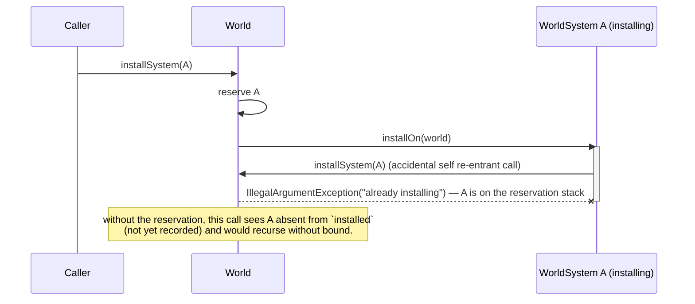
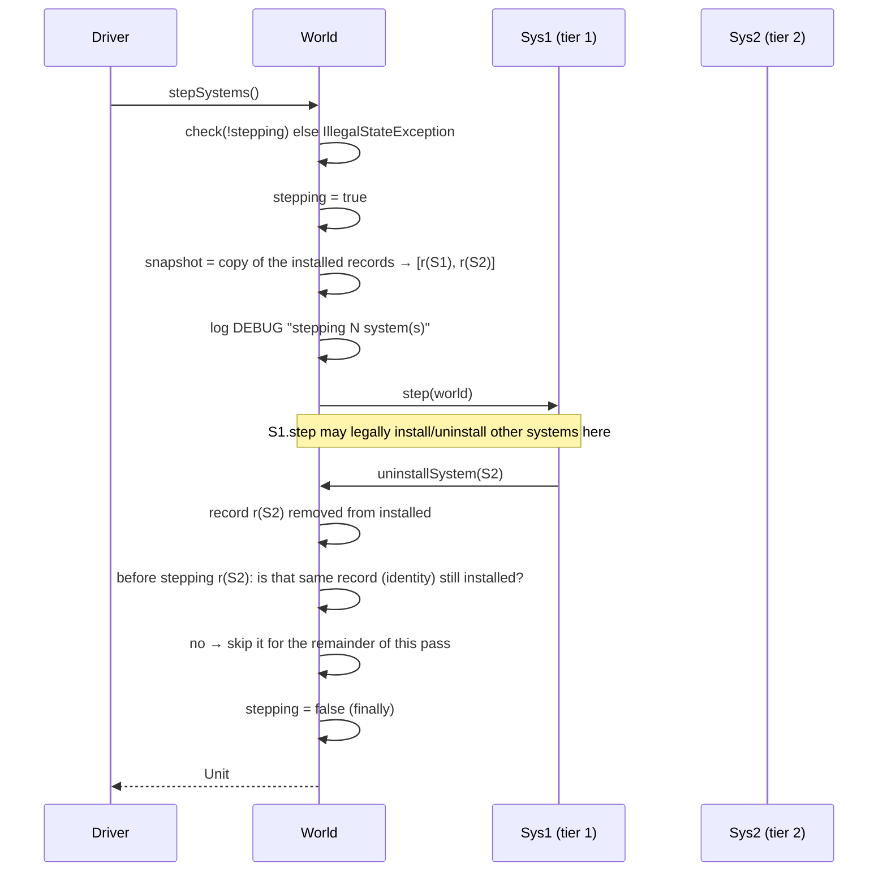
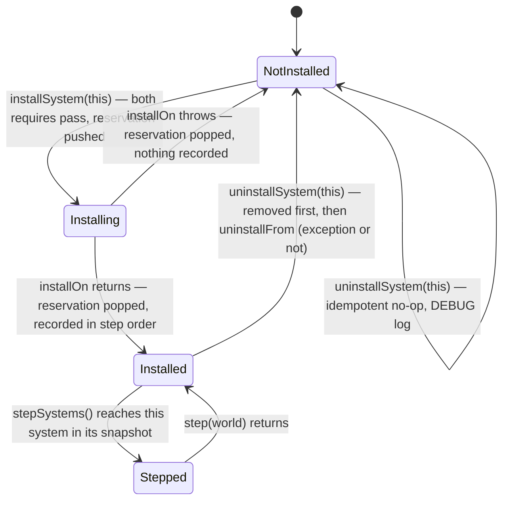

# Architecture: `WorldSystem` Core Mechanism (#76)

## Header / Association

- **Covers:** [SpartanLabsGaming/MyGameTools#76](https://github.com/SpartanLabsGaming/MyGameTools/issues/76)
  — *"World Systems Stage 1: `WorldSystem` core mechanism (opt-in per-`World` system registry)"*.
- **What this designs:** the systems-level shape of #76 itself, one level finer than the binding
  grand design — the registry's internal state model, its install/uninstall/step flows including
  re-entrancy and failure paths, the exact stability marker on every #76 declaration, and the
  points where this re-plan refines, completes, or (in one case) knowingly deviates from the
  grand design's literal text. This document does not restate what the grand design already says
  at the #76 level; it references it by section number throughout.
- **Status:** systems design — implementation plan: `docs/world-system-core-plan.md`. No source,
  test, or build file has been modified by this document.
- **Baseline:** `master` @ `540513a` (PR #83 merged). Every `path:line` below is against that
  commit unless it names the `feature/71-combat-package` branch (`dcb396e`) explicitly.
- **Subordinate to:** `docs/world-systems-implementation-architecture.md` (the grand design; all
  five `#76`–`#80` stages, binding constraints C1–C5, research findings, and the resolved open
  decisions OD1–OD4 live there). Sections cited below as "grand design §N" refer to that document.
- **Related docs:** `docs/physics-core-seams-plan.md` §2.2/§3.1 (the verbatim `SupportedExtension`
  shape this design reuses); `CONTRIBUTING.md` (module table, Coding rules, Versioning table —
  all three edited by this unit per I1, below); `docs/api-openness-decisions-6.0.0.md` D4 (`World`
  stays closed to subclassing — unaffected by this design, which touches only `World`'s own
  members).
- **Does not cover:** `ZoneWorldSystem` (#77), `ExperienceSystem`/the `ExperienceGrantor` reshape
  (#78), graduation (#79), or `PhysicsWorldSystem` (#80) — each is the grand design's own unit,
  designed there, not re-opened here.

---

## 1. Requirements

### 1.1 The settled ask (grand design §1.1 point 1, §1.3, narrowed to #76)

Give `World` a general, opt-in, zero-cost-when-unused way to host add-on per-frame behaviour: the
`WorldSystem` contract, a two-tier ordering model (`CoreSystemSlot`/`CoreWorldSystemSlot`), and
`World`'s own registry (`installSystem`, `uninstallSystem`, `installedSystems`, `stepSystems`),
plus the `com.spartanlabs.gaming.annotation` package that gates the whole seam Experimental until
#79. Acceptance: a `World` that installs nothing behaves exactly as it does today; a `World` with
systems installed steps them in a well-defined order (tier 1 by declared `order`, tier 2 in
install order) from an explicit driver call, never from `World.tick()`.

### 1.2 Binding constraints carried forward (grand design §1.2 C1, C4, C5 — not re-litigated)

- **C1** — both annotations live in a new `com.spartanlabs.gaming.annotation` package in
  `gametools-core`: `ExperimentalGameToolsApi` (`@RequiresOptIn(ERROR)`) and `SupportedExtension`
  (verbatim from `docs/physics-core-seams-plan.md` §2.2, parameterless).
- **C4** — `uninstallSystem` for symmetric teardown; read-only `installedSystems`.
- **C5** — two-tier ordering via `sealed interface CoreSystemSlot { val order: Int }` and
  `enum class CoreWorldSystemSlot(override val order: Int) : CoreSystemSlot { PHYSICS(0), ZONE(1) }`;
  `WorldSystem` a plain interface gated `@SubclassOptInRequired(ExperimentalGameToolsApi::class)`.
- Duplicate-instance and occupied-slot checks run before `installOn`, `IllegalArgumentException`
  either way; nothing recorded if `installOn` throws; `installedSystems` never contains a system
  mid-`installOn` (#78's `ExperienceSystem` depends on this); `stepSystems` snapshots tier-1-by-
  order then tier-2-by-install-order; uninstalled-mid-pass is skipped; exceptions propagate;
  never called by `World.tick()`; single-threaded; INFO on install/uninstall, DEBUG per
  `stepSystems` call; test-only opt-in lives in `gametools-core`'s build file; #76 does not wait
  on #71.

### 1.3 This re-plan's interview answers (binding)

- **I1 — `CONTRIBUTING.md`, three edits, all owned by #76** (an addition to the grand design's
  §7 stage-duties table, which only names the module-table row — see §7 below):
  1. `annotation` added to the `gametools-core` row's package list.
  2. One sentence under **Coding rules** naming the three tiers (Stable Core untagged; Supported
     Extension `@SupportedExtension`; Experimental `@ExperimentalGameToolsApi`).
  3. One row in the **Versioning** table: an incompatible change limited to
     `@ExperimentalGameToolsApi`-tagged surface bumps **Feature**, not Major, with graduation
     recorded in `CHANGELOG.md`.
- **I2 — no website change in #76.** `website/index.html:206,259`'s `World` description is
  accurate but silent on installed systems; that edit is owed to #79 (§12 follow-up F1).
- **I3** — planner-internal, no design impact.

---

## 2. Research findings applied

Only the conclusions that changed something in this document; the rest of the planner's synthesis
is design input already reflected below without being separately restated.

1. **`java.lang.Enum.hashCode()` is final and identity-based per JVM run**, so iterating any
   `HashMap`/`HashSet` keyed by `CoreSystemSlot`/`WorldSystem` would make step order vary run to
   run — a direct violation of `World`'s determinism contract (`World.kt:41-43`, "given the same
   seed and the same sequence of external calls, two worlds produce the same result"). This is why
   §4 below specifies a single list of installation records, kept in step order at insert time, as
   the *only* backing structure, never a hash- or tree-keyed collection — a stronger and more
   specific constraint than the grand design states at its own grain (§4.4 only says
   "single-threaded", not how ordering is stored). Sources:
   https://docs.oracle.com/en/java/javase/23/docs/api/java.base/java/lang/Enum.html#hashCode(),
   https://alidg.me/blog/2020/7/15/hash-code.
2. **Hook-then-record on install is already the settled shape (grand design §3, §4.4), but no
   surveyed engine's version of it defends re-entrant `installSystem` calls** — a system's
   `installOn` calling `world.installSystem` again, for itself (unbounded recursion) or for a
   second system claiming the same slot (two recorded claimants, since neither's `require` sees
   the other mid-flight). Spring's `DefaultSingletonBeanRegistry` "currently in creation" set
   (`BeanCurrentlyInCreationException`) is the direct precedent for closing this without changing
   the settled install shape at all — see §4.2's reservation.
3. **Ashley's `Engine.update()` rejects a re-entrant call with `IllegalStateException`** via an
   `updating` flag reset in `finally`, precisely to stop a system's own `update()` from re-running
   the whole engine (and thus itself) unboundedly. `EventBus.publish` (`EventBus.kt:50,73-89`)
   independently converged on the same shape (a `delivering` boolean) for the same reason. This is
   why `stepSystems()` gains the one exception to grand design §4.4's "rejects nothing" line — see
   §7 R2, flagged there as a deviation, not silently applied.

---

## 3. Subsystem inventory (by reference to grand design §4.1)

| Subsystem | Grand design ref | This document adds |
|---|---|---|
| `com.spartanlabs.gaming.annotation` package (`ExperimentalGameToolsApi`, `SupportedExtension`) | §4.1 rows 1–2, §8 | Exact meta-annotation completion for `ExperimentalGameToolsApi` (§6); the three `CONTRIBUTING.md` edits (I1). |
| `WorldSystem` contract | §4.1 row 3, §4.2 | The explicit marker on `coreSlot` (§6); the multi-`World`, no-back-reference policy statement owed to its KDoc (already named in grand design §4.2's prose; restated as a marker-table entry here). |
| `CoreSystemSlot` / `CoreWorldSystemSlot` slot model | §4.1 row 4, §4.3 | Occupancy is checked per slot (slot equality), never per `order` value; the distinct-`order` invariant is kept as a contract of the slot set, because it is what makes tier-1 order independent of install order (§7 R5). |
| `World` registry (`installSystem`/`uninstallSystem`/`installedSystems`/`stepSystems`) | §4.1 row 5, §4.4 | The internal state model, the reservation guard, the `stepSystems` re-entrancy guard, and the finer-grained flows — this document's main content, §4 below. |

`ZoneWorldSystem`, `ExperienceSystem`/`ExperienceGrantor`, graduation, and `PhysicsWorldSystem`
are out of scope here (grand design §4.5–§4.8, §10 rows 2–5).

---

## 4. The registry — internal state model and flows

Everything in this section lives inside `World`, in the same new region grand design §4.4
describes (landing after `reindexSpatial()`, `World.kt:278-284`, before the class's closing brace,
`World.kt:285` — see §5 for why that placement matters). It is a design of *shape*, not
signatures: field names and types below are illustrative of the state the registry must hold, not
a prescription of the exact private declarations — that is the implementer's call.

### 4.1 State the registry holds

| State | Shape | Why |
|---|---|---|
| **Installed systems** | one list of private, identity-compared *installation records* `(system, slot)` — one fresh record per successful install — kept **in step order** | The single source of truth for "is this system installed" (identity scan over `record.system`), "who occupies this slot" (slot-equality scan over `record.slot`), and step order itself (its own list order). One structure, not two kept in sync (§8). |
| **In-flight installations ("reservations")** | a LIFO stack of `(system, provisional slot)`, pushed immediately before `installOn` runs, popped in a `finally` | Closes the re-entrant-install gap (§2 finding 2, §4.2) without touching the settled check-then-`installOn`-then-record shape. A stack, not a single field, because a composite system's `installOn` may itself call `installSystem` for more than one helper (§8). |
| **Stepping flag** | one boolean, set at `stepSystems()` entry, cleared in `finally` | Detects re-entrant `stepSystems()` calls (§2 finding 3, §4.4). |

**Step order is maintained at install time, not recomputed per frame.** A tier-1 record
(`slot != null`) is inserted immediately before the first record that is tier 2 or whose slot has
a greater `order`, so equal orders (never expected, §7 R5) would fall back to install order; a
tier-2 record (`slot == null`) is appended. Removal preserves the relative order of everything
else. The list is therefore always "tier 1 by `order`, then tier 2 in install order", so
`installedSystems` and the per-pass snapshot are both plain copies of it, and each frame costs a
copy rather than a sort. No hash- or tree-keyed traversal exists anywhere in the registry, by
construction (§2 finding 1).

**Why records, not bare systems.** A record is created per *installation*, so it has identity of
its own. That is what lets a step pass tell "this installation was removed after my snapshot was
taken" apart from "the same `WorldSystem` instance was removed and installed again", without ever
calling `equals` on a consumer's `WorldSystem` (which may be a `data class`) — see §4.4.

### 4.2 Install: checks → reservation → `installOn` → promote, or clear on throw

```mermaid
sequenceDiagram
    participant Caller
    participant World
    participant Sys as WorldSystem (installing)

    Caller->>World: installSystem(sys)
    World->>World: require sys not in installed AND not reserved (IAE)
    World->>World: slot = sys.coreSlot (read once)
    World->>World: require slot unoccupied by installed OR reserved (IAE, if slot != null)
    World->>World: push (sys, slot) onto the reservation stack
    World->>Sys: installOn(world)
    alt installOn returns normally
        Sys-->>World: (returns)
        World->>World: pop reservation (finally)
        World->>World: insert a fresh record (sys, slot) at its step-order position; log INFO
        World-->>Caller: Unit
    else installOn throws
        Sys--xWorld: exception
        World->>World: pop reservation (finally) — nothing appended to installed
        World-->>Caller: exception propagates
    end
```

`coreSlot` is read exactly once per `installSystem` call. That one value is what the slot check
tests, what the reservation claims, and what the record stores; `uninstallSystem` and every step
pass use the recorded value and never call `coreSlot` again, so a system whose `coreSlot` getter
changed its answer after install cannot corrupt the registry.

The reservation is consulted by **both** `require`s, so a re-entrant call sees not only the
permanent `installed` list but also every installation currently in flight up the call stack:



A **legitimate** re-entrant install — a composite system installing an unrelated helper with no
slot conflict — is explicitly allowed; only a conflicting identity or slot claim is rejected:

```mermaid
sequenceDiagram
    participant Caller
    participant World
    participant A as WorldSystem A (composite, installing)
    participant B as WorldSystem B (A's helper)

    Caller->>World: installSystem(A)
    World->>World: reserve A
    World->>A: installOn(world)
    activate A
    A->>World: installSystem(B)
    World->>World: require B not in installed/reserved, slot unoccupied — passes
    World->>World: reserve B
    World->>B: installOn(world)
    World->>World: pop reservation B; record B; log INFO
    A-->>World: (installOn returns)
    deactivate A
    World->>World: pop reservation A; record A; log INFO
```

`World` does not roll back nested work: if A's `installOn` installs helper B and then throws, B
stays installed (its own install completed) and A is not recorded. Undoing B is A's job, under the
failure-atomicity clause in §4.6.

`uninstallSystem` needs no matching reservation: it removes from `installed` *before* calling
`uninstallFrom` (grand design §4.4), so a system is never "half torn down but still found
installed" the way an un-reserved install would be "half installed but not yet rejected." A
self-uninstall attempted from inside a system's own `installOn` simply misses (the system is not
yet in `installed`) and resolves as the existing idempotent no-op.

### 4.3 Uninstall: find → remove → `uninstallFrom`

```mermaid
sequenceDiagram
    participant Caller
    participant World
    participant Sys as WorldSystem

    Caller->>World: uninstallSystem(sys)
    alt sys found in installed (identity scan)
        World->>World: remove its record (now absent from installedSystems and from step order); log INFO
        World->>Sys: uninstallFrom(world)
        alt uninstallFrom throws
            Sys--xWorld: exception
            World-->>Caller: propagates — sys stays removed either way
        else uninstallFrom returns
            World-->>Caller: Unit
        end
    else sys not found
        World->>World: log DEBUG "not installed — no-op"
        World-->>Caller: Unit
    end
```

### 4.4 Step pass: guard → snapshot → skip deactivated → step



- **Re-entrant `stepSystems()`** (a system's own `step()` calling `world.stepSystems()`) is
  rejected with `IllegalStateException` at the guard — this is the one place this document departs
  from the grand design's literal "`stepSystems()` rejects nothing" (§4.4); flagged as R2 in §7,
  with the Ashley/`EventBus` precedent above. `install`/`uninstall` remain fully legal mid-pass, as
  the grand design already states; only re-entering `stepSystems()` itself is new ground.
- **A system installed mid-pass** has no record in the snapshot taken at the top of the call, so
  it steps from the *next* `stepSystems()` call — no special-casing needed, this falls out of
  "snapshot once at entry."
- **A system uninstalled mid-pass** is skipped for the rest of the pass: before stepping each
  snapshot entry, the pass checks that *that record* is still installed (an identity check; an
  "active" flag the record carries, cleared at removal, is an equivalent O(1) implementation). This
  is the only point at which the pass consults live state.
- **A system uninstalled and re-installed mid-pass** gets a *new* record, which is not in the
  snapshot; its old record is gone, so it is not stepped again in this pass and steps from the next
  call. This is the grand design's "installed mid-pass steps from the next call" rule applied
  consistently — and the reason the snapshot holds records rather than systems (§7 R9).
- **A `step()` that throws** ends the pass: the exception propagates, the systems after it are not
  stepped this pass, the registry is untouched, and the stepping flag is cleared by `finally`, so
  the next `stepSystems()` call runs normally.

### 4.5 One system's lifecycle relative to one `World`



### 4.6 Contract clauses the KDoc must carry

These are behavioural promises, stated here once so the implementation plan's KDoc carries all of
them (Component Ring, Level 2). Each follows from §4.1–§4.5 or from the grand design section
cited.

- **`installOn`** runs once per successful `installSystem`, before the system is recorded, so
  `world.installedSystems` never contains it during the call (grand design §4.4; #78 depends on
  it). It must be **failure-atomic**: if it throws, `World` records nothing and never calls
  `uninstallFrom` for that attempt, so the implementation must leave nothing behind, including any
  helper system it installed. Re-installing itself, or installing a system that claims the same
  core slot, from inside `installOn` is rejected with `IllegalArgumentException`.
- **At most one per `World` is the implementor's job.** `World` rejects the same *instance* twice
  and a second claimant of a core *slot*, but not two distinct instances of the same class; a
  tier-2 system that must be unique per `World` checks `world.installedSystems` in its own
  `installOn` (the pattern #78's `ExperienceSystem` uses).
- **Multi-`World` use.** Every hook receives the `World` as a parameter and the interface needs no
  back-reference field (unlike Ashley's `EntitySystem.engine`), so one instance may be installed
  on several worlds. An
  implementation that keeps per-`World` state keys it by `World`, or rejects a second `World` in
  its own `installOn` via `check` (`IllegalStateException`) — grand design Cross-plan alignment,
  item 1.
- **`uninstallFrom`** runs once per successful `uninstallSystem`, after the system has been
  removed; it releases what `installOn` acquired. Default: no-op.
- **`step`** runs once per `stepSystems()` pass while installed, in step order. Default: no-op.
  An exception propagates to the `stepSystems()` caller and ends that pass. Calling
  `world.stepSystems()` from inside `step` is rejected with `IllegalStateException`.
- **`coreSlot`** is read once, at install; it must return the same value for the lifetime of the
  object. `null` (the default) means tier 2. Tier-2 systems always step after every tier-1 system
  (grand design §11).
- **Slot set.** Library-defined slots have pairwise-distinct `order` values; only relative order is
  contractual; new slots may be added in a Feature release, so consumers must not write an
  exhaustive `when` over `CoreWorldSystemSlot` without an `else` (grand design §4.3).
- **Threading.** Single-threaded, like the rest of `World`: all four registry members, and every
  hook they call, run on the thread that drives the `World`.

---

## 5. Integration with existing systems, and coexistence with #71

| Existing system | How they meet |
|---|---|
| **`World.tick()`** | Untouched — no new call in its five-step body (`World.kt:218-245`). The new region lands after `reindexSpatial()` (`World.kt:278-284`) and before the closing brace (`World.kt:285`), so it never disturbs the three KDoc lines #71 already rewrote (`World.kt:70-71,108-109,200-201` in `dcb396e`); #76 and #71 merge cleanly in either order. |
| **Determinism contract** | `World.kt:41-43`'s "same seed, same sequence of external calls, same result" is extended (grand design §4.4) to cover install/uninstall/step call order. §4.1's all-list, no-hash-collection state model is what makes that extension actually true rather than aspirational (§2 finding 1). |
| **`EventBus`** | Not touched by #76 directly — no #76 declaration publishes or subscribes. `EventBus`'s own `delivering` re-entrancy guard (`EventBus.kt:50,73-89`) is this document's structural precedent for `stepSystems()`'s `stepping` guard (§4.4, §7 R2). |
| **`SimulationLoop`** | Remains the natural driver, calling `stepSystems()` from its `onTick` closure (`SimulationLoop.kt:118-119`) — no change to `SimulationLoop` itself; it is a consumer of the new members, not a subsystem #76 touches. |
| **`Capability`/`CoreCapability` pattern** (`interface X { val id }` / `enum class CoreX : X`, confirmed on `master` at flat `gametools-core/.../gameobjects/Capability.kt:18-34`) | `CoreSystemSlot`/`CoreWorldSystemSlot` follow the same shape (grand design §4.3, C5). **Coexistence constraint:** #71 relocates `Capability`/`CoreCapability` into `gameobjects.combat`. #76's own KDoc (on `WorldSystem`, `CoreSystemSlot`) must name this precedent in prose only — never a resolvable `[Capability]`/`[CoreCapability]` KDoc link — since the type's real package differs depending on merge order relative to #71, and a dangling link is a Dokka warning a Level-1 check must catch (`./gradlew dokkaGeneratePublicationHtml`, `CONTRIBUTING.md:125`). |
| **`gametools-core/build.gradle.kts`** | #76 inserts the test-only `compileTestKotlin` opt-in block (below) **before** the existing `dokka {}` block, not appended at end of file — #71 already appends a `dependencies { implementation(kotlin("reflect")) }` block at EOF (`dcb396e`), and appending #76's block there too would force a real merge decision instead of two independent, non-overlapping hunks. |
| **`ExperienceSystem` (#78, not designed here)** | Depends on one specific guarantee this document makes precise: `installedSystems` never contains a system mid-`installOn` (§4.2's reservation exists on the *installing* side of that boundary, never leaking into the *installed* list or `installedSystems`'s view of it). Confirmed unaffected by the reservation guard — the reservation stack is deliberately invisible outside the registry's own checks. |

**Test-only opt-in** (gametools-core, exact shape, matching #77's own gametools-world copy per the
grand design; the two are additive and independent):

```kotlin
tasks.named<org.jetbrains.kotlin.gradle.tasks.KotlinCompilationTask<*>>("compileTestKotlin") {
    compilerOptions.optIn.add("com.spartanlabs.gaming.annotation.ExperimentalGameToolsApi")
}
```

**`CONTRIBUTING.md` edits owned by #76 (I1):**

1. Module table (`CONTRIBUTING.md:33`): the `gametools-core` row's package list gains `annotation`,
   appended so the diff stays one token — `com.spartanlabs.gaming.{gameobjects,spatial,event,simulation,annotation}.*`
   (the README's Modules-table core row, `README.md:148`, gets the identical edit).
2. Coding rules (`CONTRIBUTING.md:18-24`): one added sentence naming the three tiers, e.g.
   *"Public surface is tiered: Stable Core is untagged, a likely-but-non-core seam carries
   `@SupportedExtension`, and an unproven seam is gated `@ExperimentalGameToolsApi` until it
   graduates."* (illustrative wording; the implementer finalises the exact sentence).
3. Versioning table (`CONTRIBUTING.md:139-144`): one new row — an incompatible change limited to
   `@ExperimentalGameToolsApi`-tagged surface bumps **Feature**, not Major; graduation recorded in
   `CHANGELOG.md`.

**Website (I2):** no change in #76. `website/index.html:206,259` stays as-is; the installed-systems
description is owed to #79 (§12 F1).

---

## 6. Extension & stability — exact marker per declaration

| Declaration | Marker | Tier now | Tier after #79 |
|---|---|---|---|
| `ExperimentalGameToolsApi` (annotation class) | none (it *is* the marker) — `@MustBeDocumented`, `@Retention(BINARY)`, `@Target(CLASS, FUNCTION, PROPERTY, CONSTRUCTOR, TYPEALIAS)`, `@RequiresOptIn(level = ERROR, message = "...")` | N/A, permanent | unchanged, never deleted |
| `SupportedExtension` (annotation class) | none — verbatim shape, `docs/physics-core-seams-plan.md` §2.2/§3.1 | Stable Core, untagged | unchanged |
| `WorldSystem` (interface) | `@SubclassOptInRequired(ExperimentalGameToolsApi::class)` | Experimental (implementing gated; calling members on a held reference is not) | `@SupportedExtension` (#79's edit, not #76's) |
| `WorldSystem.installOn(world)` | none — no experimental type in its own signature | gated only via the interface's `@SubclassOptInRequired` | untagged |
| `WorldSystem.uninstallFrom(world) {}` | none | same | untagged |
| `WorldSystem.step(world) {}` | none | same | untagged |
| `WorldSystem.coreSlot: CoreSystemSlot? get() = null` | **`@ExperimentalGameToolsApi`, explicit** — its signature exposes the plain-marked `CoreSystemSlot`, so `WorldSystem.kt` does not compile without an opt-in here; `@OptIn` would compile but the requirement would still propagate to every caller through the signature type (kotlinlang.org opt-in docs, "signature" rule), so the propagating marker is the honest, self-documenting choice | Experimental | untagged (bare Stable-Core type after #79) |
| `CoreSystemSlot` (sealed interface) | `@ExperimentalGameToolsApi` | Experimental | untagged, Stable Core |
| `CoreSystemSlot.order: Int` | none — inherits from the marked containing type | Experimental | untagged |
| `CoreWorldSystemSlot` (enum) incl. `PHYSICS`, `ZONE` | `@ExperimentalGameToolsApi` on the class; constants inherit | Experimental | untagged, Stable Core |
| `World.installSystem` | `@ExperimentalGameToolsApi` | Experimental | untagged |
| `World.uninstallSystem` | `@ExperimentalGameToolsApi` | Experimental | untagged |
| `World.installedSystems` | `@ExperimentalGameToolsApi` | Experimental | untagged |
| `World.stepSystems` | `@ExperimentalGameToolsApi` | Experimental | untagged |
| `World`'s private registry state whose *type* mentions `CoreSystemSlot` (e.g. a reservation/installed record's `slot` field) | `@OptIn(ExperimentalGameToolsApi::class)` on those private declarations only — never class- or file-level on `World` | n/a (private) | removed at #79 along with the public markers |

Domain-vs-infrastructure split: `WorldSystem` is systems/infrastructure (interface + the tier
model is its parameterised policy), matching the library's own rule — no domain/entity type is
introduced by #76. `CoreSystemSlot` is `sealed` because the closed set of library-defined slots
*is* the contract here (grand design §4.3, OD1, resolved). Everything in this table is either
directly settled by C1/C4/C5 or a completion the research called out (`coreSlot`'s own marker,
`ExperimentalGameToolsApi`'s meta-annotations) — see §7 for which is which.

**Level-1 verification owed:** whether the `gametools-core` `compileTestKotlin` `-opt-in` flag
also satisfies `@SubclassOptInRequired` for test fakes implementing `WorldSystem` (documented as
equivalent to a module-wide `@OptIn`, which does satisfy it, but not shown for this exact
combination). If it does not, each test fake carries `@OptIn(ExperimentalGameToolsApi::class)`.
Also owed at Level 1: removing the flag locally must make the test sources fail to compile at every
use of the gated surface, which proves the markers are in place. Both are compile-time facts, not
design choices, recorded so the implementer checks them rather than assumes.

---

## 7. Refinements and deviations from the grand design

Each is either a **completion** (the grand design under-specifies, this fills the gap without
contradicting it), an **addition** (new ground the grand design does not cover), or a **deviation**
(contradicts the grand design's literal text). All are confidently resolved here, not raised as
open decisions — reasons and evidence below.

1. **R1 — Addition: the reservation guard on `installSystem`.** The grand design's install flow
   (§4.4) does not address a re-entrant `installSystem` call from inside another `installOn`. §4.2
   adds a reservation stack, consulted by the existing two `require`s, so the settled check-then-
   `installOn`-then-record shape is unchanged in the non-re-entrant case and closes an unguarded
   path in the re-entrant one. Evidence: Spring's `BeanCurrentlyInCreationException`
   (`DefaultSingletonBeanRegistry`); no surveyed engine leaves this open. Does not affect any
   downstream (#77–#80) consumer, since none of their plans rely on re-entrant `installSystem`
   going unrejected.
2. **R2 — Deviation: `stepSystems()` rejects a re-entrant call.** Grand design §4.4 states
   "`stepSystems()` rejects nothing." §4.4 above narrows that to: it rejects exactly one thing — a
   call to `stepSystems()` made from inside a system's own `step()` — via `IllegalStateException`.
   Evidence: Ashley's `Engine.update()` guard and `EventBus`'s own `delivering` flag
   (`EventBus.kt:50,73-89`) both independently converged on rejecting exactly this shape of
   self-recursion. `World.tick()` is unaffected (it never called `stepSystems()` and still does
   not); `install`/`uninstall` remain fully legal mid-pass, unchanged.
3. **R3 — Completion: `coreSlot` carries its own explicit marker.** Neither the grand design's C5
   sketch nor its §8 table states this for `coreSlot` specifically (only for the slot types and
   `World`'s four members). It is not optional: `coreSlot`'s signature exposes the plain-marked
   `CoreSystemSlot`, so `WorldSystem.kt` does not compile without an opt-in on it, and
   `@SubclassOptInRequired` on the interface does not provide one (it gates implementing only).
   Between the two ways to satisfy the compiler, the propagating `@ExperimentalGameToolsApi` is
   chosen over `@OptIn` because `@OptIn` would not stop the requirement reaching callers anyway
   (the documented signature-type rule), so the marker states the truth. Evidence:
   https://kotlinlang.org/docs/opt-in-requirements.html.
4. **R4 — Completion: `ExperimentalGameToolsApi`'s meta-annotations spelled out.** C1 names the
   marker only as "`@RequiresOptIn(ERROR)`". §6 adds `@MustBeDocumented`, `@Retention(BINARY)`, and
   the same five-target `@Target` list as `SupportedExtension` — Dokka has no special rendering for
   `@RequiresOptIn` markers and needs `@MustBeDocumented` to show the tag at all; `SOURCE` retention
   or an `EXPRESSION`/`FILE`/`TYPE`/`TYPE_PARAMETER` target are illegal for a marker used the way
   this one is used. Not a new decision — it is `SupportedExtension`'s already-settled shape,
   applied consistently to its sibling marker.
5. **R5 — Refinement: occupancy is per slot; the distinct-`order` invariant stays, for a different
   reason.** The grand design's own Cross-plan alignment appendix (written for the earlier #76
   pass) records a unique-`order` test and KDoc invariant "because `World`'s tier-1 `TreeMap` is
   keyed on `order`." Here occupancy is checked by **slot equality**, never by `order` value, so
   the registry itself no longer needs unique orders to stay consistent: two slots sharing an
   order would tie-break by install order instead of colliding. The invariant is still required,
   because tier 1's whole promise ("`PHYSICS` steps before `ZONE` regardless of install order",
   grand design §4.8) holds only if the slots that must be ordered have distinct orders. A tie
   would silently turn a guaranteed order back into install order. So pairwise-distinct `order`
   values across all library-defined slots is a KDoc contract of `CoreSystemSlot` (§4.6), guarded
   by a cheap test over `CoreWorldSystemSlot.entries`; it is no longer a precondition the registry
   depends on.
6. **R6 — Refinement: the internal state model is a single list kept in step order, never hash- or
   tree-keyed.** Not stated at the grand design's own grain; driven by §2 finding 1 (identity-hash
   nondeterminism). A `TreeMap<Int, WorldSystem>` would in fact iterate deterministically (its keys
   sort numerically, not by hash), but it would need a second structure for tier 2's install
   order, and it keys occupancy by `order` rather than by slot (R5). One list, ordered at insert,
   needs neither (§8).
7. **R7 — Scope addition, not a defect fix: I1's Coding-rules sentence and Versioning-table row.**
   The grand design's §7 stage-duties table assigns #76 only the module-table package row; this
   re-plan's interview (I1) adds two more `CONTRIBUTING.md` edits. Recorded here as new, user-given
   scope for this document's decomposition unit, not as a correction of anything wrong upstream.
8. **R8 — Scope clarification: I2 explicitly defers the website edit.** The grand design does not
   mention `website/index.html` for #76 at all (silence, not a decision); I2 makes the deferral to
   #79 explicit rather than leaving it implicit.
9. **R9 — Completion: the step-pass snapshot holds installation records, compared by identity.**
   The grand design says a system uninstalled earlier in a pass is skipped and a system installed
   mid-pass steps from the next call, but not how the pass tells them apart. Checking whether the
   *system* is still installed would step a system that was uninstalled and re-installed mid-pass
   a second time in that pass, contradicting "installed mid-pass steps from the next call". It
   would also call `equals` on a consumer type that may be a `data class`. Checking whether the
   *record* is still installed gets both cases right with no `equals` call (§4.1, §4.4).

---

## 8. Alternatives considered (beyond grand design §9)

- **`TreeMap<Int, WorldSystem>` keyed by `order` for tier-1 storage**, the shape the grand
  design's appendix records for the earlier #76 pass. Rejected: it needs a second structure for
  tier 2 (install order) kept in sync with it, and it makes occupancy a property of the `order`
  value rather than of the slot (§7 R5, R6). One list kept in step order at insert is simpler and
  just as deterministic. Would win only if tier-1 population were large enough for ordered-map
  lookups to matter; the slot count is 2 today and a handful ever.
- **Recomputing step order on every access** (partition by tier, then a stable sort by `order`).
  Correct and deterministic, and it was this document's first draft. Rejected in favour of
  ordering at insert time: installs are rare and passes run every frame, so doing the ordering
  work once per install makes `installedSystems` and the per-pass snapshot plain copies.
- **Checking whether the *system* is still installed during a pass** (instead of the record).
  Rejected (§7 R9): a system uninstalled and re-installed mid-pass would be stepped twice in that
  pass, and the check would rely on a consumer type's `equals`.
- **`HashMap<CoreSystemSlot, WorldSystem>` for O(1) slot-occupancy lookups, or
  `IdentityHashMap<WorldSystem, ...>` for O(1) duplicate-instance lookups.** Both would be
  perfectly deterministic in isolation (point lookups don't depend on iteration order); rejected
  anyway, because introducing either creates a second structure to keep in sync with the
  order-preserving list that must still exist for step order, for a performance gain nothing here
  needs (tier-1 population is a small, fixed set; a linear identity/equality scan over it costs
  nothing measurable per install/uninstall call). A design with no hash-collection anywhere in the
  registry is also structurally impossible to regress into hash-order iteration by accident later.
- **A single nullable "currently installing" field instead of a reservation stack.** Rejected: it
  cannot represent a composite system's `installOn` installing more than one helper (§4.2's third
  diagram) — the second nested `installSystem` call would have nowhere to record its own
  provisional claim once the first occupied the single field.
- **Silently ignoring (no-op) a re-entrant `stepSystems()` call instead of throwing.** Rejected —
  masks a caller bug (a system's `step()` accidentally calling `world.stepSystems()`) the same way
  Ashley's own `Engine.update()` throws rather than silently skipping the nested call.
- **A new in-process compile-testing dependency (`dev.zacsweers.kctfork`) to verify the opt-in gate
  automatically.** Considered for testing that `@SubclassOptInRequired`/`@RequiresOptIn` actually
  block a non-opted-in caller (ABI dumps and reflection cannot see a `BINARY`-retained annotation).
  Rejected for #76: a documented Level-1 manual/compiler-error procedure is enough for one seam,
  and adds no dependency coupled to the Kotlin compiler version. Would win if this repo ever gates
  several independent seams behind opt-in markers and manual verification stops scaling.

---

## 9. Decomposition

| Slug | Scope | Depends on | Landing order | Branch |
|---|---|---|---|---|
| `world-system-core` | `com.spartanlabs.gaming.annotation` (`ExperimentalGameToolsApi`, `SupportedExtension`); `WorldSystem`; `CoreSystemSlot`/`CoreWorldSystemSlot`; `World`'s `installSystem`/`uninstallSystem`/`installedSystems`/`stepSystems` and their internal state model (§4); the three `CONTRIBUTING.md` edits (I1); the `gametools-core` test-only opt-in Gradle block. | none | 1 | `feature/76-world-system-core`, off `master` |

This is the only plannable unit in this document. It sits at position 1 of the grand design's own
five-unit sequence (§10 there); `zone-world-system` (#77), `experience-system` (#78),
`world-system-graduation` (#79), and `physics-world-system` (#80) all depend on it and are
designed in the grand design, not here.

---

## 10. Risks at the systems level

- **R1/R2 above change documented behaviour relative to the grand design's literal text.** Risk:
  a sibling unit plan drafted against the grand design's exact wording (`docs/zone-world-system-plan.md`,
  `docs/experience-system-plan.md`, `docs/world-system-graduation-plan.md`,
  `docs/physics-world-system-plan.md` — all pre-date this re-plan) could still assert "`stepSystems()`
  rejects nothing" verbatim, or assume no reservation guard exists. Mitigation: neither #77's,
  #78's, nor #80's known design calls `stepSystems()` from inside a `step()`, or relies on an
  unguarded re-entrant `installSystem`, so no known consumer breaks — but each sibling plan should
  be re-verified against this document when #76 actually lands, per the same Cross-plan alignment
  discipline the grand design already applies to its own five units (named as a follow-up, §11 F2).
- **Precedent shift** (`World` hosting externally supplied behaviour for the first time) and **the
  tier-2 ordering limitation** are both already covered at the systems level by grand design §11;
  nothing about this document's finer-grained internal model changes either risk's shape or
  mitigation.
- **Breaking changes:** none. Every #76 declaration is new; nothing existing changes signature.
- **Cross-repo impact:** none — no wire/protocol change, `gametools-net` untouched.
- **Concurrency/performance:** unchanged from grand design §11 — single-threaded; the reservation
  stack and stepping flag add O(1) bookkeeping per call; install and uninstall are O(n) (an identity
  scan plus a list insert or removal); a step pass is one O(n) copy plus n virtual calls, with an
  O(1) skip check per entry if records carry an "active" flag. n is expected to stay small (tier 1
  bounded by the number of built-in slots; tier 2 by however many systems a consumer installs).
  A `World` that installs nothing pays nothing in `tick()` and one empty copy per
  `stepSystems()` call.
- **Migration:** none required for an existing `World` consumer.

---

## 11. Open decisions

None. Every choice in this document is either directly dictated by the grand design's resolved
C1/C4/C5 constraints and this re-plan's binding interview answers (I1, I2), or a refinement
confidently resolved above with named precedent and no known conflict with a downstream (#77–#80)
consumer (§7, §10). In particular, R2 (`stepSystems()`'s one rejection case) is recorded as a
confident refinement rather than raised here, because the research backing it is already verified
and its blast radius against the other four units' known designs is already checked (§10).

---

## 12. Follow-ups

- **F1 (I2).** `website/index.html:206,259`'s `World` description should gain a line on installed
  systems once the mechanism is Stable Core — owed to #79, not #76.
- **F2.** Re-verify `docs/zone-world-system-plan.md`, `docs/experience-system-plan.md`,
  `docs/world-system-graduation-plan.md`, and `docs/physics-world-system-plan.md` against this
  document's §7 refinements (the reservation guard, `stepSystems()`'s one rejection case) once
  #76 lands, the same way the grand design's own Cross-plan alignment pass re-verifies siblings
  against each other.
- **F3.** The #76 GitHub issue body still lists the annotation types as out of scope, superseded
  by C1 (grand design §1.2). Recommend the user update the issue body to match the settled scope;
  not done here (no issue-editing from this pass).
- **F4.** `docs/world-systems-implementation-architecture.md`'s own Cross-plan alignment section
  describes the earlier #76 planning pass. It should gain a one-line pointer to this document
  (`docs/world-system-core-architecture.md`) once this docs-only PR lands — it cannot be edited
  from this checkout (working tree is on `feature/71-combat-package`, and only this new file is in
  scope here).

---

## Cross-plan alignment

Appended by the planner after stage 4. This design has one plannable unit, so the pass checked
its one plan (`docs/world-system-core-plan.md`) against this note, against the grand design's
binding constraints, and against the #76 contract that the four already-landed downstream plans
consume.

### What was checked

- **Plan vs. this note.** State model (§4.1), install, uninstall and step flows (§4.2–§4.5),
  contract clauses (§4.6), marker matrix (§6), refinements R1–R9 (§7). After the fixes below, the
  plan's private declarations, algorithms, KDoc and tests implement all of them.
- **The seam #77–#80 consume** (read from each plan's contract section on `master`):
  - names, signatures and nullability;
  - `IllegalArgumentException` for a duplicate instance or occupied slot, thrown before `installOn`;
  - nothing recorded if `installOn` throws;
  - `installedSystems` never containing the system mid-`installOn`, which #78's
    second-`ExperienceSystem` guard depends on (`docs/experience-system-plan.md:444-451`);
  - remove-then-`uninstallFrom`;
  - tier 1 by `order` then tier 2 by install order, which #77's and #80's headline tests depend on;
  - `installSystem`/`uninstallSystem` at INFO, `stepSystems` at DEBUG;
  - `@SubclassOptInRequired` on `WorldSystem`, plain markers elsewhere;
  - the `gametools-core` test opt-in block, identical in shape to #77's
    (`docs/zone-world-system-plan.md:423-424`).

  All hold. R1, R2 and R9 are additive: no downstream design installs re-entrantly, calls
  `stepSystems()` from a `step()`, or relies on a mid-pass uninstall-and-reinstall being stepped
  twice.
- **#79's removal list.** The markers this re-plan adds beyond the grand design's §8 table are the
  one on `WorldSystem.coreSlot` and the `@OptIn`s on `World`'s private declarations. All of them
  appear in #79's completeness gate, a repo-wide `grep` for `ExperimentalGameToolsApi`
  (`docs/world-system-graduation-plan.md` §2.4). The plan's §9 names them explicitly.
- **Binding constraints:**
  - C1: both annotations are present, and `SupportedExtension`'s declaration is verbatim.
  - C4 and C5/OD1 are satisfied.
  - OD3: no wait on #71, and #71 coexistence is re-verified against `dcb396e`.
  - I1: all three `CONTRIBUTING.md` edits are present.
  - I2: no website change; F1 records it.
- **Standards:**
  - file-by-file changes, with signatures carrying their error handling, mutability and logging;
  - the 5-level test plan, with level and path for every class;
  - the four documentation rings;
  - README, CONTRIBUTING and CHANGELOG currency;
  - a version-control sequence in which every commit compiles.

### What the pass changed

In this note:
- **R5 reversed.** The distinct-`order` invariant is kept as a contract of the slot set, with a
  test. The drafted "no uniqueness invariant needed" was true for occupancy but not for tier 1's
  ordering guarantee.
- **State model.** Changed from recomputing a partition and stable sort per access (with an
  `installIndex` field) to one list of installation records kept in step order at insert time.
- **Step-pass skip.** Changed from checking the *system* against the live list to checking the
  *record* (new R9). This removes the drafted "reinstalled mid-pass is stepped twice" edge case,
  which contradicted the grand design's "installed mid-pass steps from the next call".
- **Contracts made explicit.**
  - `coreSlot` is read once, and every later path uses the recorded value.
  - The nested no-rollback rule is stated.
  - §4.6's contract clauses were added.
  - R3's rationale was corrected: the marker is a compile requirement, and `@OptIn` would not stop
    the requirement propagating to callers.
- **CONTRIBUTING package-list example** made append-only, to match the README row.

In the plan:
- **Commit sequence.** The test opt-in block moved into commit 1: that commit's own
  `ExperimentalGameToolsApiTest` uses marked fixtures and would not compile without it.
- **Docs PR scope.** The header and §8 no longer say the docs PR carries the four sibling plans,
  which are already on `master` via PR #83.
- **§2 (R5/R6).** Rewritten so the `TreeMap` is superseded but the unique-`order` test survives.
- **KDoc:**
  - `SupportedExtension`'s em dashes are normalised to the repo's ASCII ` - ` (no `.kt` on `master`
    contains an em dash).
  - `WorldSystem`: an inaccurate paragraph was removed (it called the sealed slot model a
    "plain interface" like `Capability`); the opt-in sentence was made precise (`coreSlot` does
    need opt-in); a threading sentence was added.
  - `CoreSystemSlot`: the mention of tests was dropped.
  - `World`'s new class-KDoc section moved after the determinism paragraph, so it doesn't swallow
    it under its heading when rendered.
- **Docs text:**
  - README: the Modules row, the `WorldSystem` Layering row, the mermaid member syntax, and the
    Features bullet, which no longer invites consumers to claim built-in slots.
  - CONTRIBUTING: the Versioning row now says "commit it without `!` or a `BREAKING CHANGE:`
    footer", without which it conflicts with the existing Major row.
  - CHANGELOG: the bullets no longer say implementing "requires `@SubclassOptInRequired`", and no
    longer use internal rollout jargon.
- **Tests added:** nested install then throw leaves the helper installed; an occupied-slot
  rejection never calls `installOn`.
- **§9 and follow-ups:** §9 lists the markers #79 must remove. F4 was corrected, and F5 added
  (`docs/experience-system-plan.md:451` cites the old plan's §3.5; the fact now lives in §4.5).

### Shared risks the pass could not resolve

- **Downstream plans still carry the old #76 contract.** The four downstream plans, and the grand
  design's own Cross-plan alignment section, describe the older #76 contract. They are `master`-only
  files and cannot be edited from this checkout. Nothing in them breaks, but F2, F4 and F5 are owed
  when the docs-only PR lands.
- **The `-opt-in` × `@SubclassOptInRequired` interaction is unconfirmed** until the Level-1 check
  runs. The fallback, `@OptIn` on each test fake, is specified.
- **Dokka warnings are non-fatal in this repo.** A leaked link into `gameobjects.combat` would only
  be caught by the Level-1 read of the Dokka output.
- **No open decisions.**
