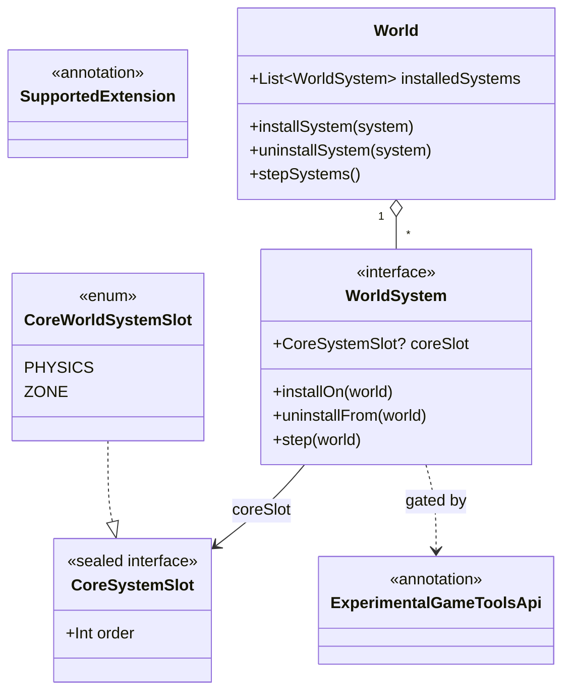

# Plan: `world-system-core` — `WorldSystem` core mechanism (opt-in per-`World` system registry)

## Header / Association

- **Covers:** [SpartanLabsGaming/MyGameTools#76](https://github.com/SpartanLabsGaming/MyGameTools/issues/76)
  — *"World Systems Stage 1: `WorldSystem` core mechanism (opt-in per-`World` system registry)"*.
  The issue body's own "annotation types are out of scope" line is superseded by C1 (both
  architecture documents below); see Follow-ups F3.
- **Architecture:** `docs/world-system-core-architecture.md` (unit slug `world-system-core`,
  the systems-level design this plan makes concrete — §4 internal state model, §6 marker matrix,
  §7 R1–R9 refinements/deviations, §9 decomposition), subordinate to
  `docs/world-systems-implementation-architecture.md` (the grand design; §1.2 C1/C4/C5, §10
  decomposition row 1, Cross-plan alignment). Where the two disagree on the registry's internal
  shape (they do, on tier-1 storage — see "Deviations" below), the newer, more specific
  `world-system-core-architecture.md` governs; that document is itself the source of truth cited
  throughout this plan.
- **Supersedes:** this plan replaces the older draft at this same path in place — re-planned from
  scratch at the user's request against the newer architecture note, not layered on top of the
  prior draft.
- **Branch:** `feature/76-world-system-core`, off the latest `master`.
- **Baseline:** `master` @ `540513a`.
- **Commit:** TBD
- **PR:** TBD — closes #76. **This plan document is not part of that PR.** Per the settled
  version-control point (grand design §1.2, "this planning pass lands via a docs-only PR"), this
  document and the architecture note land together in a separate docs-only PR off `master`
  (replacing the older draft at this path; the four sibling unit plans are already on `master`,
  PR #83), before `feature/76-world-system-core` is cut. See §8 (Version control) for the
  implementation branch's own commit sequence.
- **What this plans:** the `com.spartanlabs.gaming.annotation` package
  (`ExperimentalGameToolsApi`, `SupportedExtension`); `WorldSystem`; `CoreSystemSlot`/
  `CoreWorldSystemSlot`; `World`'s `installSystem`/`uninstallSystem`/`installedSystems`/
  `stepSystems` and their internal state model; the three `CONTRIBUTING.md` edits (I1); the
  `gametools-core` test-only opt-in Gradle block.
- **Status:** planning only. No source, test, or build file has been modified by this document.
- **Target release:** not settled independently — grand design §12 OD3 (resolved: #76/#77 need
  not wait on #71 and may ship in their own Feature release). This unit's commits land under
  `CHANGELOG.md`'s `[Unreleased]` heading; no version bump in this plan (`CONTRIBUTING.md`
  §Releasing is a release-branch step, out of scope here).
- **Dependencies:** none. This is decomposition position 1 of 5; `zone-world-system` (#77),
  `experience-system` (#78), `world-system-graduation` (#79), and `physics-world-system` (#80)
  all depend on it.

---

## 1. Context

### 1.1 The settled ask

Give `World` a general, opt-in, zero-cost-when-unused way to host add-on per-frame behaviour: the
`WorldSystem` contract, a two-tier ordering model (`CoreSystemSlot`/`CoreWorldSystemSlot`), and
`World`'s own registry (`installSystem`, `uninstallSystem`, `installedSystems`, `stepSystems`),
plus the `com.spartanlabs.gaming.annotation` package that gates the whole seam Experimental until
#79.

### 1.2 Acceptance criteria

- A `World` that installs nothing behaves exactly as it does today — `World.tick()` is unchanged
  and never calls `stepSystems()`.
- A `World` with systems installed steps them in a well-defined order — tier 1 by declared
  `order`, then tier 2 in install order — from an explicit driver call.
- `installSystem`/`uninstallSystem` are symmetric, idempotent on the uninstall side, and
  failure-atomic on the install side (nothing recorded if `installOn` throws).
- `installedSystems` never contains a system while its own `installOn` is running (#78 depends on
  this).
- Re-entrant `installSystem` (a system installing itself, or a second claimant of an in-flight
  slot) and re-entrant `stepSystems()` are both rejected, not silently accepted (R1, R2).
- Outside `gametools-core`'s own test source set (which opts in module-wide), every entry point to
  the seam requires opting in to `ExperimentalGameToolsApi` (`@OptIn(ExperimentalGameToolsApi::class)`
  or the equivalent compiler flag): `World`'s four new members, `CoreSystemSlot`/
  `CoreWorldSystemSlot`, `WorldSystem.coreSlot`, and implementing `WorldSystem` (gated by
  `@SubclassOptInRequired`). Only calling `installOn`/`uninstallFrom`/`step` on a `WorldSystem`
  reference already obtained through one of those gated paths needs no further opt-in.
- `CONTRIBUTING.md` gains the three I1 edits; README/CONTRIBUTING/CHANGELOG all reflect this
  unit's new surface in this unit's own commits.

### 1.3 Where this plugs into the existing design

`World` (`gametools-core/src/main/kotlin/com/spartanlabs/gaming/gameobjects/World.kt`, 285 lines,
`final class`) has no reference to any add-on system today. The new registry lands in a fresh
`//region INSTALLED SYSTEMS` after `reindexSpatial()` (`World.kt:278-284`) and before the class's
closing brace (`World.kt:285`) — verified: `class World(...)` opens at `World.kt:48`, the imports
region is `World.kt:3-18`, `tick()`'s body starts at `World.kt:218`. `#71`
(`feature/71-combat-package` @ `dcb396e`) touches only `World.kt:70-71,108-109,200-201` — three
KDoc links rewritten to the moved `combat.Alive` — none of which this plan's new region or import
line touches, so #76 and #71 merge cleanly in either order (confirmed by reading `dcb396e`'s own
diff to `World.kt`).

---

## 2. Deviations from the grand design

`docs/world-system-core-architecture.md` §7 records nine refinements/deviations (R1–R9) against
`docs/world-systems-implementation-architecture.md`'s own literal text; this plan implements all
nine. The two worth calling out explicitly:

- **R2 — the one literal contradiction.** The grand design states `stepSystems()` "rejects
  nothing" (grand design §4.4). This plan's `stepSystems()` rejects exactly one thing — a
  re-entrant call made from inside a system's own `step()` — via `IllegalStateException`, per the
  architecture note's Ashley/`EventBus`-precedented decision (architecture §4.4, §7 R2). `tick()`
  is unaffected either way; `install`/`uninstall` remain fully legal mid-pass.
- **R5/R6 — the registry is one list, never a `TreeMap`.** The grand design's own Cross-plan
  alignment section (its item 4, written for an earlier #76 pass) records a tier-1 `TreeMap` keyed
  on `order`, with an explicit `import java.util.TreeMap`, and "a `CoreWorldSystemSlot`
  unique-`order` test and KDoc invariant" justified by that `TreeMap`. **The `TreeMap` and its
  import are not implemented by this plan.** The whole registry — tier 1 and tier 2 alike — is one
  `MutableList<InstalledSystemRecord>` kept in step order at insert time, never a hash- or
  tree-keyed collection (R6), and slot occupancy is checked by slot *equality*, never by `order`
  value (R5). **The unique-`order` invariant and its test are kept, for a different reason:** the
  registry no longer needs them to stay consistent, but tier 1's promise ("`PHYSICS` steps before
  `ZONE` regardless of install order") holds only if the slots have distinct orders (R5). Follow-up
  F4 (§11) records the correction owed to the grand design's item 4.

The other six (R1, R3, R4, R7, R8, R9) are additions or completions, not contradictions, and are
folded into §4 below without further flag.

---

## 3. Design

### 3.1 Overview



### 3.2 Install → step → uninstall flow

The full sequence diagrams (normal install, re-entrant self-install rejection, legitimate
re-entrant helper install, uninstall, and one step pass with a mid-pass uninstall) are already
drawn precisely in `docs/world-system-core-architecture.md` §4.2–§4.4 and are not redrawn here;
this plan implements them literally. The single diagram below is the composite happy path, for
orientation:

```mermaid
sequenceDiagram
    participant Caller
    participant World
    participant Sys as WorldSystem

    Caller->>World: installSystem(sys)
    World->>World: require not installed / not reserved (IAE)
    World->>World: slot = sys.coreSlot (read once)
    World->>World: require slot unoccupied, if non-null (IAE)
    World->>World: push reservation
    World->>Sys: installOn(world)
    World->>World: pop reservation (finally)
    World->>World: insert record at step-order position; log INFO
    Caller->>World: stepSystems()
    World->>World: check(!stepping) else ISE; stepping = true
    World->>World: snapshot = installedRecords.toList(); log DEBUG
    World->>Sys: step(world)  [skipped if record.active == false]
    World->>World: stepping = false (finally)
    Caller->>World: uninstallSystem(sys)
    World->>World: remove record; record.active = false; log INFO
    World->>Sys: uninstallFrom(world)
```

### 3.3 Internal state model (per `docs/world-system-core-architecture.md` §4.1)

Everything below lives as private state inside `World`, in the new region. Exact declarations,
not an illustrative sketch — the implementer follows this literally:

| State | Declaration | Why |
|---|---|---|
| Installation records | `private val installedRecords: MutableList<InstalledSystemRecord>` | The single source of truth for "is this system installed", "who occupies this slot", and step order itself. One structure, never two kept in sync. |
| In-flight reservations | `private val installReservations: ArrayDeque<Reservation>` (`kotlin.collections.ArrayDeque`, no import needed — same as `EventBus.kt`'s `queued: ArrayDeque<GameEvent>`) | LIFO: pushed with `addLast`, popped with `removeLast`. Closes the re-entrant-install gap (R1) without changing the settled check-then-`installOn`-then-record shape. A stack, not one field, because a composite system's `installOn` may install more than one helper. |
| Stepping guard | `private var stepping: Boolean = false` | Detects re-entrant `stepSystems()` (R2). |

`InstalledSystemRecord` and `Reservation` are both **private, non-`data` classes** — deliberately
*not* `data class`, so their default `equals`/`hashCode` stay reference-identity (Kotlin's default
for a plain class), which is exactly the identity comparison the registry needs and never calls
`equals` on a consumer's `WorldSystem` (which may itself be a `data class`, R9):

```kotlin
/**
 * One successful [installSystem] call for a [WorldSystem]. Two records for the same [WorldSystem]
 * instance (e.g. uninstalled then reinstalled) are distinct - what lets a step pass tell "this
 * installation was removed after my snapshot was taken" apart from "this instance was reinstalled",
 * without ever calling [equals] on a consumer's [WorldSystem].
 */
@OptIn(ExperimentalGameToolsApi::class)
private class InstalledSystemRecord(val system: WorldSystem, val slot: CoreSystemSlot?) {
    /** Cleared by [uninstallSystem] at the moment this record is removed; [stepSystems] skips a record whose [active] is false. */
    var active: Boolean = true
}

/** An [installSystem] call still inside [WorldSystem.installOn], not yet recorded. */
@OptIn(ExperimentalGameToolsApi::class)
private class Reservation(val system: WorldSystem, val slot: CoreSystemSlot?)
```

Both classes carry `@OptIn(ExperimentalGameToolsApi::class)` individually — never a class- or
file-level `@OptIn` on `World` itself (per the architecture's explicit instruction) — because
their constructors take `CoreSystemSlot?`, itself a plain-`@ExperimentalGameToolsApi`-marked type.

**Step order is maintained at insert time, not recomputed per access.** A tier-1 record
(`slot != null`) is inserted immediately before the first record that is tier 2 or whose slot has
a greater `order`; a tier-2 record (`slot == null`) is appended:

```kotlin
/** Inserts [record] at its step-order position (tier 1 by [CoreSystemSlot.order], else appended). */
@OptIn(ExperimentalGameToolsApi::class)
private fun insertInStepOrder(record: InstalledSystemRecord) {
    val slot = record.slot
    if (slot == null) {
        installedRecords.add(record)
        return
    }
    val insertAt = installedRecords.indexOfFirst { it.slot == null || it.slot.order > slot.order }
    installedRecords.add(if (insertAt == -1) installedRecords.size else insertAt, record)
}
```

No hash- or tree-keyed collection exists anywhere in the registry, by construction (R6):
`java.lang.Enum.hashCode()` is identity-based and varies per JVM run, so a hash-keyed traversal of
`CoreWorldSystemSlot`/`WorldSystem` would make step order non-deterministic across runs — a direct
violation of `World`'s existing determinism contract (`World.kt:41-43`).

---

## 4. File-by-file changes

### 4.1 New: `gametools-core/src/main/kotlin/com/spartanlabs/gaming/annotation/ExperimentalGameToolsApi.kt`

No imports needed (`kotlin.annotation.*`, `kotlin.RequiresOptIn` resolve via Kotlin's default
imports; no import-region comment required, matching `SupportedExtension`'s own precedent).

```kotlin
package com.spartanlabs.gaming.annotation

/**
 * Marks a public declaration as **Experimental**: a seam whose shape has not yet been proven by a
 * real consumer. Unlike [SupportedExtension], a declaration tagged [ExperimentalGameToolsApi] may
 * change incompatibly in a Feature release, not only a Major one - see `CONTRIBUTING.md`
 * §Versioning - until it graduates to Stable Core (untagged) or [SupportedExtension].
 *
 * Gated at [RequiresOptIn.Level.ERROR] - deliberate opt-in is the whole point of this tier (this
 * is a small, deliberate seam an unintentional touch should fail to compile against, not a vast,
 * everyday surface a consumer is expected to brush against constantly). A consumer opts in with
 * `@OptIn(ExperimentalGameToolsApi::class)` at the narrowest scope that needs it, or the
 * `-opt-in=com.spartanlabs.gaming.annotation.ExperimentalGameToolsApi` compiler flag for a whole
 * module.
 *
 * Never deleted, even once nothing in this library still uses it: a consumer's own
 * `@OptIn(ExperimentalGameToolsApi::class)` would fail to compile with an unresolved reference if
 * this class were removed. It stays live as the tier's permanent marker for the next Experimental
 * seam.
 */
@MustBeDocumented
@Retention(AnnotationRetention.BINARY)
@Target(
    AnnotationTarget.CLASS, AnnotationTarget.FUNCTION, AnnotationTarget.PROPERTY,
    AnnotationTarget.CONSTRUCTOR, AnnotationTarget.TYPEALIAS,
)
@RequiresOptIn(
    level = RequiresOptIn.Level.ERROR,
    message = "This declaration is Experimental: it may change incompatibly in a Feature release until it graduates to Stable Core or Supported Extension.",
)
annotation class ExperimentalGameToolsApi
```

**Error handling:** none applicable — an annotation class has no execution path.
**Mutability:** none applicable — no properties, no state.
**Logging:** none applicable.
**Stability tier:** this class is itself the Experimental-tier mechanism, permanent, not tagged.

### 4.2 New: `gametools-core/src/main/kotlin/com/spartanlabs/gaming/annotation/SupportedExtension.kt`

Reused verbatim from `docs/physics-core-seams-plan.md` §2.2/§3.1 (its `@SupportedExtension` half
is explicitly superseded onto this unit — see that document's own top-of-file callout), with one
correction: its KDoc's mention of the Experimental tier is now a link to the sibling marker that
did not exist when that plan was drafted, and "a minor release" is corrected to "a Feature
release" to match this repo's actual `Major.Feature.MinorChange` scheme (`CONTRIBUTING.md:139-144`)
rather than generic semver terminology. Its em dashes are also normalised to ` - `: no `.kt` file on
`master` contains an em dash (verified by `git grep`), and every existing KDoc in the repo uses the
ASCII form. The declaration itself is copied verbatim.

```kotlin
package com.spartanlabs.gaming.annotation

/**
 * Marks a public declaration as **Supported Extension**: a seam for a likely-but-non-core need
 * - something a fair number of consumers will plausibly want, that is not what the surrounding
 * library exists fundamentally to provide.
 *
 * This tier carries **the same semver guarantee as Stable Core** - the tag marks *purpose*, not
 * a weaker stability promise. A breaking change to a `@SupportedExtension` declaration is a
 * breaking change to the library, governed by the same versioning rules
 * (`CONTRIBUTING.md` §Versioning) as anything else public. Contrast with an
 * [ExperimentalGameToolsApi]-gated seam, whose shape may still change in a Feature release
 * because no real consumer has built against it yet - nothing tagged `@SupportedExtension` is
 * unproven in that sense.
 *
 * Where this tag lands on an `interface`, its shipped default implementation(s) double as the
 * seam's **worked example** of how to extend it: written to be read, not merely to work.
 *
 * Purely documentary - `BINARY` retention, no `@RequiresOptIn` gate, no parameters. It changes
 * nothing about how the annotated declaration compiles or runs; it exists for Dokka, IDE
 * navigation, and a human deciding whether to extend something, not for the compiler to enforce.
 * Modelled on JetBrains' `org.jetbrains.annotations.ApiStatus.NonExtendable` precedent for a
 * documentary stability marker.
 */
@MustBeDocumented
@Retention(AnnotationRetention.BINARY)
@Target(
    AnnotationTarget.CLASS, AnnotationTarget.FUNCTION, AnnotationTarget.PROPERTY,
    AnnotationTarget.CONSTRUCTOR, AnnotationTarget.TYPEALIAS,
)
annotation class SupportedExtension
```

**Error handling / Mutability / Logging:** none applicable, as §4.1.
**Stability tier:** Stable Core, untagged — "infrastructure for stability itself must be stable."

### 4.3 New: `gametools-core/src/main/kotlin/com/spartanlabs/gaming/gameobjects/WorldSystem.kt`

```kotlin
package com.spartanlabs.gaming.gameobjects

//region 1. Organization Internal
// 1.2 Spartan Gaming
import com.spartanlabs.gaming.annotation.ExperimentalGameToolsApi
//endregion

/**
 * Opt-in, per-frame or event-driven add-on behaviour for a [World], installed via
 * [World.installSystem] and stepped via [World.stepSystems].
 *
 * A [WorldSystem] may claim a library-reserved slot via [coreSlot] for a guaranteed relative step
 * order (tier 1), or default to `null` (tier 2) for trust-the-caller install order, always
 * stepped after every tier-1 system. A [World] rejects installing the same instance twice and a
 * second claimant of the same [CoreSystemSlot], but not two distinct instances of the same class;
 * an implementation that must be unique per [World] checks [World.installedSystems] inside its own
 * [installOn] - it never contains this system while [installOn] is running.
 *
 * A single [WorldSystem] instance may be installed on more than one [World]: every hook receives
 * the relevant [World] as a parameter and this interface holds no back-reference to any one
 * [World]. An implementation that keeps per-[World] state keys it by the [World] instance, or
 * rejects a second, different [World] from its own [installOn] with [IllegalStateException].
 *
 * Single-threaded, like [World]: every hook runs on the thread driving the [World] it is given.
 *
 * Implementing this interface requires opting in to [ExperimentalGameToolsApi], and so does reading
 * [coreSlot]; the whole interface may change incompatibly in a Feature release until it graduates.
 * Calling [installOn], [uninstallFrom] or [step] on a reference obtained some other way needs no
 * opt-in of its own.
 */
@SubclassOptInRequired(ExperimentalGameToolsApi::class)
interface WorldSystem {

    /**
     * Runs once, immediately after [World.installSystem]'s checks pass and before it records this
     * system - [world]'s [World.installedSystems] does not contain this system while this call is
     * running. Must be failure-atomic: if this throws, [world] records nothing for this system and
     * never calls [uninstallFrom] for this attempt, so an implementation must leave nothing behind,
     * including any helper [WorldSystem] it installed on [world] itself. Installing this same
     * system again, or a system claiming the same [coreSlot], from inside this call is rejected by
     * [world] with [IllegalArgumentException].
     *
     * @param world the [World] this system is being installed on
     */
    fun installOn(world: World)

    /**
     * Runs once, immediately after [World.uninstallSystem] removes this system from [world] -
     * releases whatever [installOn] acquired. Default: no-op. Never called for a system that was
     * never installed on [world] (an [World.uninstallSystem] call for one is an idempotent no-op).
     *
     * @param world the [World] this system is being uninstalled from
     */
    fun uninstallFrom(world: World) {}

    /**
     * Runs once per [World.stepSystems] call while this system is installed on [world], in step
     * order. Default: no-op. An exception thrown here propagates to the [World.stepSystems] caller
     * and ends that pass early - systems later in the pass do not step this time. Calling
     * [World.stepSystems] on [world] from inside this call throws [IllegalStateException].
     *
     * @param world the [World] driving this step
     */
    fun step(world: World) {}

    /**
     * The tier-1 [CoreSystemSlot] this system claims, or `null` (the default) for tier 2 - always
     * stepped after every tier-1 system, in install order. Read exactly once, by
     * [World.installSystem], at install time; must return the same value for the lifetime of this
     * object - changing what it returns afterward has no effect on an already-installed system.
     */
    @ExperimentalGameToolsApi
    val coreSlot: CoreSystemSlot?
        get() = null
}
```

**Error handling:** the interface's own default bodies (`uninstallFrom`, `step`) never throw. What
an *implementation* of `installOn`/`step` throws is the implementor's choice; the KDoc above states
exactly what `World` does with it in each case (never wrapped in `Result` — matches `World`'s own
`require`/`check`-based convention, §4.4/§4.5).
**Mutability:** stateless as an interface; an implementation's own fields are its business.
**Logging:** none in the interface itself — `World`'s registry logs install/uninstall/step
lifecycle events (§4.5); an implementation may log its own domain-specific work inside its hooks.

### 4.4 New: `gametools-core/src/main/kotlin/com/spartanlabs/gaming/gameobjects/CoreSystemSlot.kt`

```kotlin
package com.spartanlabs.gaming.gameobjects

//region 1. Organization Internal
// 1.2 Spartan Gaming
import com.spartanlabs.gaming.annotation.ExperimentalGameToolsApi
//endregion

/**
 * A library-reserved "tier 1" ordering slot a [WorldSystem] may claim via [WorldSystem.coreSlot]
 * for a guaranteed relative step order, regardless of install order.
 *
 * `sealed` so only this module can declare a slot - a consumer cannot mint a competing
 * "core-looking" slot; every library-defined slot is a [CoreWorldSystemSlot] constant. A
 * consumer's own [WorldSystem] may still legitimately return an *existing* [CoreWorldSystemSlot]
 * value (a deliberate replacement of a shipped adapter) - [World.installSystem]'s
 * one-claimant-per-slot check makes that safe.
 *
 * Only *relative* [order] across slots is contractual; a future built-in slot may be inserted
 * between two existing ones, renumbering them - do not compare [order] against a literal
 * constant. Library-defined slots always have pairwise-distinct [order] values, so the relative
 * step order of any two claimed slots never depends on install order.
 *
 * May change incompatibly in a Feature release until it graduates - see [ExperimentalGameToolsApi].
 */
@ExperimentalGameToolsApi
sealed interface CoreSystemSlot {
    /** This slot's position relative to every other [CoreSystemSlot]; a lower value steps first. */
    val order: Int
}

/**
 * The library-defined [CoreSystemSlot]s, in ascending [order]. New constants may be added in a
 * Feature release - do not write an exhaustive `when` over this enum without an `else` branch.
 *
 * @property order see [CoreSystemSlot.order]
 */
@ExperimentalGameToolsApi
enum class CoreWorldSystemSlot(override val order: Int) : CoreSystemSlot {
    /** Reserved for a future physics `WorldSystem` adapter. */
    PHYSICS(0),

    /** Reserved for a future zone-membership `WorldSystem` adapter. */
    ZONE(1),
}
```

Note the deliberate generic phrasing ("a future physics/zone-membership `WorldSystem` adapter")
rather than naming `PhysicsWorldSystem`/`ZoneWorldSystem` directly: neither type exists yet, so a
`[PhysicsWorldSystem]`/`[ZoneWorldSystem]` KDoc link would be an unresolved Dokka reference at this
point in the sequence, and a bare backticked forward-reference to a not-yet-designed-here type name
is still an internal-planning detail that does not belong in published KDoc — the constant's own
doc comment (`@property order`) and its position in the enum already carry the necessary meaning.

**Error handling:** none — no function bodies, `order` is a simple property.
**Mutability:** `order` is `val`, fixed per enum constant; `CoreWorldSystemSlot.entries` is
JVM-immutable.
**Logging:** none.

### 4.5 Changed: `gametools-core/src/main/kotlin/com/spartanlabs/gaming/gameobjects/World.kt`

**Import block** (`World.kt:3-18`, group "1.2 Spartan Gaming") — one new line, alphabetically
first in that group:

```kotlin
//region 1. Organization Internal
// 1.2 Spartan Gaming
import com.spartanlabs.gaming.annotation.ExperimentalGameToolsApi
import com.spartanlabs.gaming.event.EventBus
import com.spartanlabs.gaming.event.GameEvent
import com.spartanlabs.gaming.simulation.RandomSource
import com.spartanlabs.gaming.simulation.SeededRandom
import com.spartanlabs.gaming.spatial.Quadtree
import com.spartanlabs.gaming.spatial.QuadtreeSpatialIndex
import com.spartanlabs.gaming.spatial.SpatialIndex
//endregion
```

**Class KDoc** (`World.kt:20-47`) — insert a new subsection at the *end* of the prose, after the
determinism sentence (`World.kt:42-43`) and before the blank `*` line and `@param seed`
(`World.kt:44-45`). Placing it any earlier would put the World-wide determinism paragraph under
this new heading in the rendered KDoc:

```
 *
 * ### Installed systems
 * A [World] can also host opt-in [WorldSystem]s ([installSystem], [uninstallSystem],
 * [installedSystems]). [tick] never steps them: a driver calls [stepSystems] once per frame after
 * [tick], e.g. `SimulationLoop(world, onTick = { world.stepSystems() })`. Systems that claim a
 * [CoreSystemSlot] step first, in slot order; the rest follow in install order. A [World] with
 * nothing installed pays nothing for this. Experimental - see [ExperimentalGameToolsApi].
```

And extend the existing determinism sentence (`World.kt:41-43`) in place:

Before:
```
 * [GameEvent]s are delivered synchronously as they are published, not batched at the end.
 * Given the same [seed] and the same sequence of external calls, two worlds produce the same
 * result.
```

After:
```
 * [GameEvent]s are delivered synchronously as they are published, not batched at the end.
 * Given the same [seed] and the same sequence of external calls - including [installSystem],
 * [uninstallSystem], and [stepSystems] - two worlds produce the same result.
```

**`tick()` KDoc** (`World.kt:215-217`) — one added sentence:

Before: `Advances the world by one frame. See the class doc for the exact order of operations.`

After: `Advances the world by one frame. See the class doc for the exact order of operations.
Never steps an installed [WorldSystem] - see [stepSystems].`

**New region**, after `reindexSpatial()` (`World.kt:278-284`), before the class's closing brace
(`World.kt:285`):

```kotlin
    //region INSTALLED SYSTEMS
    /**
     * One successful [installSystem] call for a [WorldSystem]. Two records for the same
     * [WorldSystem] instance (e.g. uninstalled then reinstalled) are distinct - what lets a step
     * pass tell "this installation was removed after my snapshot was taken" apart from "this
     * instance was reinstalled", without ever calling [equals] on a consumer's [WorldSystem]
     * (which may itself be a `data class`).
     */
    @OptIn(ExperimentalGameToolsApi::class)
    private class InstalledSystemRecord(val system: WorldSystem, val slot: CoreSystemSlot?) {
        /** Cleared by [uninstallSystem] at removal; [stepSystems] skips a record whose [active] is false. */
        var active: Boolean = true
    }

    /** An [installSystem] call still inside [WorldSystem.installOn], not yet recorded. */
    @OptIn(ExperimentalGameToolsApi::class)
    private class Reservation(val system: WorldSystem, val slot: CoreSystemSlot?)

    /**
     * Every installed system's [InstalledSystemRecord], kept in step order at insert time: tier 1
     * ([InstalledSystemRecord.slot] non-null) by [CoreSystemSlot.order], then tier 2 (`slot ==
     * null`) in install order. The only backing structure for [installedSystems], slot occupancy,
     * and [stepSystems]'s own order - never a hash- or tree-keyed collection, so iteration order
     * never depends on a [CoreWorldSystemSlot] constant's (identity-based, per-run) hash code.
     */
    private val installedRecords: MutableList<InstalledSystemRecord> = mutableListOf()

    /**
     * In-flight [installSystem] calls, most recently pushed last. Consulted by both `require`s in
     * [installSystem] so a re-entrant call sees every installation still in progress up the call
     * stack, not just [installedRecords].
     */
    private val installReservations: ArrayDeque<Reservation> = ArrayDeque()

    /** `true` for the duration of one [stepSystems] call, so a re-entrant call is rejected. */
    private var stepping: Boolean = false

    /**
     * Inserts [record] at its step-order position: immediately before the first record that is
     * tier 2 or whose slot has a greater [CoreSystemSlot.order] than [record]'s (tier 1), or at
     * the end (tier 2).
     */
    @OptIn(ExperimentalGameToolsApi::class)
    private fun insertInStepOrder(record: InstalledSystemRecord) {
        val slot = record.slot
        if (slot == null) {
            installedRecords.add(record)
            return
        }
        // A tier-1 record goes before the first record that is tier 2 or has a strictly greater
        // order. "Strictly" means an equal order (library slots never share one) lands after the
        // existing record, so install order breaks the tie deterministically.
        val insertAt = installedRecords.indexOfFirst { it.slot == null || it.slot.order > slot.order }
        installedRecords.add(if (insertAt == -1) installedRecords.size else insertAt, record)
    }

    /**
     * Installs [system] onto this [World]: calls [WorldSystem.installOn] once, then - only if it
     * returns normally - records [system] in step order so a later [stepSystems] call steps it.
     *
     * Checked, both as [IllegalArgumentException], before [WorldSystem.installOn] runs:
     * - [system] must not already be installed on this [World], and must not itself be in the
     *   middle of an [installSystem] call further up the call stack (a re-entrant self-install).
     * - if [WorldSystem.coreSlot] (read exactly once, right here) is non-null, that slot must not
     *   already be claimed by another installed or currently-installing system.
     *
     * [WorldSystem.installOn] must be failure-atomic: if it throws, this [World] records nothing
     * for [system] and never calls [WorldSystem.uninstallFrom] for this attempt - any partial
     * state [system] itself acquired (e.g. a helper [WorldSystem] it installed) is [system]'s own
     * responsibility to undo. The exception propagates to the caller unchanged, and [system] may
     * be installed again later.
     *
     * [installedSystems] never contains [system] while [WorldSystem.installOn] is still running.
     * Single-threaded, like every other [World] member: call this only from the thread driving
     * this [World]. This member, [uninstallSystem], [installedSystems], and [stepSystems] are
     * gated [ExperimentalGameToolsApi] - their shape may still change incompatibly in a Feature
     * release until they graduate.
     *
     * @param system the system to install
     * @throws IllegalArgumentException if [system] is already installed, is already being
     *   installed (a re-entrant call), or claims a [WorldSystem.coreSlot] another installed or
     *   currently-installing system already holds
     */
    @ExperimentalGameToolsApi
    fun installSystem(system: WorldSystem) {
        require(installedRecords.none { it.system === system } && installReservations.none { it.system === system }) {
            "system $system is already installed on, or is already being installed on, this World"
        }
        val slot = system.coreSlot
        if (slot != null) {
            val occupant = installedRecords.firstOrNull { it.slot == slot }?.system
                ?: installReservations.firstOrNull { it.slot == slot }?.system
            require(occupant == null) { "slot $slot is already claimed by $occupant" }
        }
        installReservations.addLast(Reservation(system, slot))
        try {
            system.installOn(this)
        } finally {
            installReservations.removeLast()
        }
        insertInStepOrder(InstalledSystemRecord(system, slot))
        log.info("World installed a {} (slot={})", system::class.simpleName, slot)
    }

    /**
     * Removes [system] from this [World]'s installed systems, then calls
     * [WorldSystem.uninstallFrom] once. Idempotent: a [system] that is not currently installed is
     * a no-op.
     *
     * [system] is removed - absent from [installedSystems] and from the next [stepSystems] pass -
     * *before* [WorldSystem.uninstallFrom] runs, the mirror image of [installSystem]'s own
     * ordering. If [WorldSystem.uninstallFrom] throws, [system] stays removed either way and the
     * exception propagates to the caller unchanged.
     *
     * Single-threaded, like every other [World] member.
     *
     * @param system the system to uninstall
     */
    @ExperimentalGameToolsApi
    fun uninstallSystem(system: WorldSystem) {
        val index = installedRecords.indexOfFirst { it.system === system }
        if (index == -1) {
            log.debug("World received an uninstallSystem call for a {} that was not installed - no-op", system::class.simpleName)
            return
        }
        val record = installedRecords.removeAt(index)
        record.active = false
        log.info("World uninstalled a {} (slot={})", system::class.simpleName, record.slot)
        system.uninstallFrom(this)
    }

    /**
     * The [WorldSystem]s currently installed on this [World], tier 1 (by [CoreSystemSlot.order])
     * then tier 2 (in [installSystem] order) - the exact order [stepSystems] steps them in. A
     * fresh copy on every read; mutating it does not affect this [World]'s registry. Never
     * contains a system that is still inside its own [WorldSystem.installOn] call. Empty for a
     * [World] with nothing installed.
     */
    @ExperimentalGameToolsApi
    val installedSystems: List<WorldSystem>
        get() = installedRecords.map { it.system }

    /**
     * Steps every currently-installed [WorldSystem] once, tier 1 (by [CoreSystemSlot.order]) then
     * tier 2 (in [installSystem] order), over a snapshot taken at the start of this call - not
     * [installedSystems] recomputed mid-pass. Never called by [tick]; a driver (typically
     * [com.spartanlabs.gaming.simulation.SimulationLoop]'s `onTick`) calls it once per frame, e.g.
     * `SimulationLoop(world, onTick = { world.stepSystems() })`.
     *
     * A system [uninstallSystem]-ed earlier in this same pass is skipped for the rest of the pass.
     * A system [installSystem]-ed during this pass steps from the *next* [stepSystems] call, not
     * this one. If a [WorldSystem.step] throws, the exception propagates to the caller, no system
     * after it steps this pass, and this [World]'s registry is left exactly as [WorldSystem.step]
     * left it - the next [stepSystems] call runs normally.
     *
     * @throws IllegalStateException if called re-entrantly - from inside a [WorldSystem.step] this
     *   same call is already running, directly or indirectly
     */
    @ExperimentalGameToolsApi
    fun stepSystems() {
        check(!stepping) { "World.stepSystems() was called re-entrantly, from inside a WorldSystem.step() this same call is already running" }
        stepping = true
        try {
            val snapshot = installedRecords.toList()
            log.debug("World stepping {} system(s)", snapshot.size)
            snapshot.forEach { record -> if (record.active) record.system.step(this) }
        } finally {
            stepping = false
        }
    }
    //endregion
```

**Error handling:** none of the four new members return `Result` — both `installSystem`'s
rejection cases and `stepSystems`'s re-entrancy guard are caller-wiring errors, matching this
repo's existing `require`-based precedent (`TiledMap.addSpawnPoint`,
`gametools-world/src/main/kotlin/com/spartanlabs/gaming/world/map/TiledMap.kt:113-116`) rather
than an operational failure. `uninstallSystem` has no failure mode (idempotent, returns `Unit`).
An exception a `WorldSystem`'s own hook throws is never caught by `World` — it propagates
unchanged, exactly like `World.tick()`'s own `GameObject.tick()` calls.

**Mutability:** `installedRecords` (`MutableList`) is mutated only by `installSystem` (insert) and
`uninstallSystem` (remove); `installReservations` (`ArrayDeque`) only by `installSystem`
(push/pop, always paired via `try`/`finally`); `stepping` (`var`) only by `stepSystems`
(set/cleared, always paired via `try`/`finally`); `InstalledSystemRecord.active` (`var`) only by
`uninstallSystem` (set `false` once, never back to `true` — a record is never reactivated,
reinstalling creates a new record).

**Concurrency:** unchanged from the rest of `World` — single-threaded by convention, no
synchronisation added. `installReservations`/`stepping` are plain fields, safe only because
`World` is already documented as driven from one thread.

**Logging (slf4j, lazy `{}` placeholders, matching `World`'s existing house style — no
`World.methodName:`-prefixed messages, per the existing `"World tick: ..."`/`"World removing
..."`/`"World created with seed {}"` precedent):**

| Event | Level | Message |
|---|---|---|
| A system is installed | INFO | `"World installed a {} (slot={})"`, `system::class.simpleName`, `slot` |
| A system is uninstalled (before `uninstallFrom` runs) | INFO | `"World uninstalled a {} (slot={})"`, `system::class.simpleName`, `record.slot` |
| `uninstallSystem` called for a system not installed | DEBUG | `"World received an uninstallSystem call for a {} that was not installed - no-op"`, `system::class.simpleName` |
| Once per `stepSystems()` call | DEBUG | `"World stepping {} system(s)"`, `snapshot.size` |

No log line precedes either `require` throw in `installSystem` or the `check` throw in
`stepSystems`, matching the repo's existing convention that the exception message is the
diagnostic (`TiledMap.addSpawnPoint`, `ZoneGrid`'s constructor).

### 4.6 Changed: `gametools-core/build.gradle.kts`

Insert between the existing `mavenPublishing { }` block (lines 5–11) and the `dokka { }` block
(line 13) — never appended at end of file, since `#71`'s branch appends its own, unrelated
`dependencies { implementation(kotlin("reflect")) }` block there:

```kotlin
tasks.named<org.jetbrains.kotlin.gradle.tasks.KotlinCompilationTask<*>>("compileTestKotlin") {
    compilerOptions.optIn.add("com.spartanlabs.gaming.annotation.ExperimentalGameToolsApi")
}
```

Identical shape to #77's own `gametools-world` copy (`docs/zone-world-system-plan.md:423-424`);
#79 removes both. No main-source-set opt-in, ever.

### 4.7 Changed: `README.md`

**Modules table, core row (`README.md:148`).**

Before:
```
| **core** | `io.github.spartanlabsgaming:gametools-core` | `com.spartanlabs.gaming.{gameobjects,spatial,event,simulation}.*` — the object hierarchy, stats & buffs, `SpatialIndex`, `Quadtree`, `UniformGrid`, `QuadtreeSpatialIndex`, `Space`, `EntityId`, `World`, `EventBus`, `SimulationLoop` — plus `com.spartanlabs.geometry.serializations.*` (the `@Serializable` geometry DTOs) | — |
```

After:
```
| **core** | `io.github.spartanlabsgaming:gametools-core` | `com.spartanlabs.gaming.{gameobjects,spatial,event,simulation,annotation}.*` — the object hierarchy, stats & buffs, `SpatialIndex`, `Quadtree`, `UniformGrid`, `QuadtreeSpatialIndex`, `Space`, `EntityId`, `World`, `WorldSystem` (Experimental), `EventBus`, `SimulationLoop`, and the `@SupportedExtension` / `@ExperimentalGameToolsApi` API-stability markers — plus `com.spartanlabs.geometry.serializations.*` (the `@Serializable` geometry DTOs) | — |
```

**Layering table** (`README.md:124` header) — `World` row (`README.md:132`) gains a clause; a new
row for `WorldSystem` immediately after the `SimulationLoop` row (`README.md:134`):

Before (`World` row):
```
| `World` | final | Owns every `GameObject`, reconciles its pluggable `spatialIndex` and rebuilds the `EntityId` index each frame, drives the tick loop, and publishes lifecycle/combat `GameEvent`s on its `EventBus` |
```

After:
```
| `World` | final | Owns every `GameObject`, reconciles its pluggable `spatialIndex` and rebuilds the `EntityId` index each frame, drives the tick loop, publishes lifecycle/combat `GameEvent`s on its `EventBus`, and hosts opt-in installed `WorldSystem`s (Experimental) |
```

New row, inserted after the `SimulationLoop` row:
```
| `WorldSystem` | interface | Opt-in, per-frame or event-driven add-on behaviour for a `World` (Experimental): installed via `World.installSystem`, stepped by a driver via `World.stepSystems`; built-in systems claim a library-reserved `CoreSystemSlot` and step first, everything else steps after them in install order |
```

**Architecture mermaid diagram** (`README.md:34-120`) — insert a `WorldSystem` `<<interface>>`
class block immediately after the existing `class World { ... }` block (ends `README.md:80`,
before `class Space {` at `README.md:81`):

```mermaid
    class WorldSystem {
        <<interface>>
        +CoreSystemSlot coreSlot
        +installOn(world)
        +uninstallFrom(world)
        +step(world)
    }
```

(`+CoreSystemSlot coreSlot`, without `?`: the existing diagram never marks nullability — e.g. it
lists no `?` anywhere in `README.md:34-120` — and puts properties before methods, as in
`class Space`.)

And add one association, immediately after the existing `World "1" o-- "0..1" Space` line
(`README.md:115`):
```
    World "1" o-- "*" WorldSystem
```

Do **not** add `CoreSystemSlot`/`CoreWorldSystemSlot` to the diagram — the class list already
runs long, and the slot types are `WorldSystem`'s own internal ordering detail, not a top-level
architectural relationship.

**Features, Game Objects section (`README.md:157-169`)** — one new bullet after "Opt-in
fixed-timestep loop" (`README.md:168`), before "Serializable snapshots" (`README.md:169`):

```
- **Opt-in installed systems** (Experimental) — a `WorldSystem` adds per-frame or event-driven behaviour to a `World` without subclassing it: implement `installOn` (and `step` / `uninstallFrom` as needed), `World.installSystem(it)`, then call `World.stepSystems()` once per frame from your own driver, e.g. `SimulationLoop(world, onTick = { world.stepSystems() })` — `World.tick()` never calls it. `uninstallSystem` tears a system down symmetrically. Built-in systems claim a library-reserved `CoreSystemSlot` (`CoreWorldSystemSlot.PHYSICS`, then `ZONE`) and always step first, in that order, whatever order they were installed in; your own systems step after them, in install order. Experimental: opt in with `@OptIn(ExperimentalGameToolsApi::class)` or the `-opt-in=com.spartanlabs.gaming.annotation.ExperimentalGameToolsApi` compiler flag — the shape may change incompatibly in a Feature release until it graduates.
```

### 4.8 Changed: `CONTRIBUTING.md` (the three I1 edits)

**1. Module layout table, core row (`CONTRIBUTING.md:33`).**

Before:
```
| `gametools-core` | `io.github.spartanlabsgaming:gametools-core` | `com.spartanlabs.gaming.{gameobjects,spatial,event,simulation}.*`, `com.spartanlabs.geometry.serializations.*` | — |
```

After:
```
| `gametools-core` | `io.github.spartanlabsgaming:gametools-core` | `com.spartanlabs.gaming.{gameobjects,spatial,event,simulation,annotation}.*`, `com.spartanlabs.geometry.serializations.*` | — |
```

**2. Coding rules paragraph (`CONTRIBUTING.md:18-24`)** — one sentence appended at the end:

Before (ends): `` ...structured slf4j logging, KDoc on every public declaration, region-grouped imports, one test class per file. Tests are organised by the five-level hierarchy into `com.spartanlabs.gaming.testing.<level>` packages. ``

After (append): `` Public surface is tiered: Stable Core is untagged, a likely-but-non-core seam carries `@SupportedExtension` (the same semver guarantee as Stable Core), and an unproven seam is gated `@ExperimentalGameToolsApi` until it graduates. ``

**3. Versioning table (`CONTRIBUTING.md:139-144`)** — one new row, immediately after the `feat!:`
row (`CONTRIBUTING.md:143`):

Before/after context:
```
| `feat!:` / `BREAKING CHANGE:` | Major release | `1.9.0` → `2.0.0` |
| An incompatible change limited to `@ExperimentalGameToolsApi` surface (commit it without `!` or a `BREAKING CHANGE:` footer) | Feature release, not Major | `1.9.0` → `1.10.0`; graduation out of Experimental is recorded in `CHANGELOG.md` |
| `docs` / `chore` / `ci` / `test` / `build` / `refactor` | none — rides the next release | |
```

(the first and third rows are unchanged, existing rows; only the middle row is new.) The
parenthetical is what keeps the table consistent: without it, an Experimental-only breaking change
committed the Conventional-Commits way (`feat!:`) would match both the Major row above it and this
row.

### 4.9 Changed: `CHANGELOG.md`

Two `[Unreleased] ### Added` bullets, appended at the end of the existing `### Added` list
(after the "Project website" bullet, before the `### Changed` heading at `CHANGELOG.md:76`),
matching the file's existing register (backticked type — dash — prose — `(#issue)`):

```markdown
- `com.spartanlabs.gaming.annotation` — the library's API-stability tier markers.
  `ExperimentalGameToolsApi` is an `@RequiresOptIn(level = ERROR)` gate for a seam whose shape is
  not yet proven by a real consumer and may change incompatibly in a Feature release until it
  graduates; opt in with `@OptIn(ExperimentalGameToolsApi::class)` or
  `-opt-in=com.spartanlabs.gaming.annotation.ExperimentalGameToolsApi`. `SupportedExtension` is
  purely documentary (no compiler gate, `BINARY` retention): it marks a likely-but-non-core seam
  that carries the same semver guarantee as Stable Core. Nothing carries `SupportedExtension` yet.
  (#76)
- `WorldSystem` — an opt-in, per-frame or event-driven add-on contract for a `World`, with
  `installOn`/`uninstallFrom`/`step` hooks and an optional `coreSlot` claim on a library-reserved
  `CoreWorldSystemSlot` (`PHYSICS`, then `ZONE`), which steps in that relative order whatever order
  the systems were installed in; every other system steps afterwards, in install order. `World`
  gains `installSystem`/`uninstallSystem`/`installedSystems`/`stepSystems` to host it;
  `World.tick()` is unchanged and never calls `stepSystems()` — a driver does, e.g. from a
  `SimulationLoop`'s `onTick`. Ships Experimental: implementing `WorldSystem`, or using `World`'s
  new members, the slot types or `coreSlot`, requires opting in to `ExperimentalGameToolsApi`.
  (#76)
```

Note: the annotation bullet is credited `(#76)`, not `(#49)`. `docs/physics-core-seams-plan.md`
§3.6's own draft bullet cited `(#49)` and named `CollisionResolver` as the reason
`SupportedExtension` exists; that half of that plan is superseded onto this unit, and the
annotation has no user until #79 applies it to `WorldSystem`.

---

## 5. Documentation impact (Audience-Reach rings)

- **Inner Core (in-editor):** the new `//region INSTALLED SYSTEMS` / `//endregion` block in
  `World.kt` (§4.5); one Level-1 line comment inside `insertInStepOrder` explaining the tie-break
  rule (already included in §4.5's code block).
- **Component Ring (KDoc/API contracts):** the primary ring this unit touches. Full Level-2 KDoc
  on every new public declaration (§4.1–§4.5): both annotations, `WorldSystem` and its four
  members, `CoreSystemSlot`/`CoreWorldSystemSlot`, and `World`'s four new members plus its
  extended class/`tick()` KDoc. Must render without a *new* unresolved-link warning under
  `./gradlew dokkaGeneratePublicationHtml` — an unresolved KDoc link is a Dokka **warning**, not a
  build failure, in this repo (`CONTRIBUTING.md`'s own note describes the task as "also catches
  broken KDoc links", not that it fails the build over one) — but this unit's own new KDoc must
  not *introduce* one, and per the #71-coexistence constraint (below) must never link to a type
  #71 moves into `gameobjects.combat`.
- **Boundary Ring (protocol/integration):** not touched — no wire format, no cross-service
  concern.
- **Architectural Outer Layer:** `docs/world-system-core-architecture.md` already documents this
  unit's design; no update owed to it by this plan. `docs/world-systems-implementation-
  architecture.md`'s own Cross-plan alignment section needs a one-line pointer to the newer
  architecture note once this docs-only PR lands — named as Follow-up F4 (§11), not this plan's to
  edit (out of scope per the boundary rules governing this plan-writing pass).
- **README / CONTRIBUTING / CHANGELOG currency:** all three updated in this unit's own commits
  (§4.7–§4.9), per the grand design's own "each unit documents its own surface" rule.

**#71 coexistence constraint (hard, verified):** none of this unit's KDoc `[link]`s or test
imports may reference `Alive`, `Buff`, `Capability`, `CoreCapability`, `CombinedStat`,
`ExperienceReceiver`, `DefaultExperienceReceiver`, `Intent`, `Idle`, `Move`, `AttackIntent`,
`ModularStat`, or `StatMod` — all of which `#71` (`dcb396e`) moves into `gameobjects.combat`, and
whose real package differs depending on merge order relative to #71. None of this unit's KDoc
names `Capability`/`CoreCapability` at all (the precedent is recorded in the architecture note
instead), so the constraint in `docs/world-system-core-architecture.md` §5 is met trivially. Test fixtures use
`Actor`/`VisibleObject`/`GameObject` (not moved by #71) or no game object at all, matching the
existing `WorldLifecycleEventsTest`/`WorldTest` precedent (`Actor(location = Point(x, 0.0))`).

---

## 6. Test plan (5-level hierarchy)

All new tests live in `gametools-core`. `kotlin.test` on the JUnit 5 platform, per this repo's
actual convention (no MockK anywhere in the repo) — nothing in this unit makes an external call to
mock in any case. One test class per file.

### Level 1 — gating

No `testing.gating` package exists in this repo; per its own convention, Level 1 in practice means
"compiles and passes `componentTest deterministicTest` before every push", using the Level 2/4a
tests below. Additionally, three commands/procedures this unit specifically owes, none checked in
as a test file:

1. **The opt-in gate is real.** Temporarily remove the `compileTestKotlin` block (§4.6) from
   `gametools-core/build.gradle.kts`, run `./gradlew :gametools-core:compileTestKotlin`, and
   confirm a compile error at every use of the gated surface in the new test sources: implementing
   `WorldSystem`, calling any of `World`'s four new members, referencing `CoreSystemSlot`/
   `CoreWorldSystemSlot`, and reading `coreSlot`. Restore the block afterward.
2. **The unconfirmed `-opt-in`/`@SubclassOptInRequired` interaction (architecture §6, "Level-1
   verification owed").** With the module-wide `compileTestKotlin` opt-in flag in place (its
   normal state), confirm a test fixture can `class Fake : WorldSystem` with **no** per-class
   `@OptIn(ExperimentalGameToolsApi::class)`. If that fails to compile, the module flag does not
   satisfy `@SubclassOptInRequired` for this combination — fall back to
   `@OptIn(ExperimentalGameToolsApi::class)` on every test fake class that implements
   `WorldSystem`, and note the fallback was needed in this file's own commit message.
3. **Dokka output.** Run `./gradlew dokkaGeneratePublicationHtml`; read its output for any new
   unresolved-KDoc-link warning this unit's own KDoc introduced (in particular, confirm no link
   into `gameobjects.combat` leaked in regardless of merge order relative to #71). A pre-existing,
   unrelated warning does not block this unit — the task does not fail the build over one either
   way.

### Level 2 — component

`gametools-core/src/test/kotlin/com/spartanlabs/gaming/testing/component/annotation/`:

- **`ExperimentalGameToolsApiTest.kt`**
  - `it can be applied to a class, function, property, constructor, and type alias` — a
    compile-time fixture per target (a marked class, a marked top-level function, a marked
    property, a marked secondary constructor, a marked type alias), each referenced once in the
    test body so an unused-fixture warning cannot hide a future accidental `@Target` narrowing.
  - `it carries @MustBeDocumented, observable via the compiled JVM annotation` —
    `ExperimentalGameToolsApi::class.java.isAnnotationPresent(java.lang.annotation.Documented::class.java)`.
    (Not `MustBeDocumented::class.java` — Kotlin's `@MustBeDocumented` compiles to the JVM's own
    `java.lang.annotation.Documented`, and that is the certain, toolchain-independent fact to
    assert; the level of Kotlin-specific reflection needed to see `@MustBeDocumented` itself is
    not relied upon.)
  - `usage is invisible at runtime (BINARY retention)` — apply `@ExperimentalGameToolsApi` to a
    test-local class; assert
    `marked::class.java.isAnnotationPresent(ExperimentalGameToolsApi::class.java) == false`.
  - `it declares no members` — `ExperimentalGameToolsApi::class.java.declaredMethods.isEmpty()`.
  - **Not asserted here, by design:** `@RequiresOptIn`'s own presence/level via reflection.
    `RequiresOptIn` is itself `BINARY`-retained, so it is invisible to `isAnnotationPresent` at
    runtime; the ERROR-level opt-in gate is a compile-time fact, verified at Level 1 above, not
    here.
- **`SupportedExtensionTest.kt`** — the same shape as `physics-core-seams-plan.md` §5's own design
  for this class (compile fixture across the five targets; `@MustBeDocumented`
  usage-invisibility), with the same correction as above: assert `@MustBeDocumented` via
  `java.lang.annotation.Documented`, not by attempting to reflect on `MustBeDocumented` itself; and
  the same "no members" check.

`gametools-core/src/test/kotlin/com/spartanlabs/gaming/testing/component/gameobjects/`:

- **`WorldSystemDefaultsTest.kt`**
  - `uninstallFrom does nothing by default` — a minimal `WorldSystem` overriding only `installOn`;
    calling `uninstallFrom` directly does not throw and has no observable effect.
  - `step does nothing by default` — same shape for `step`.
  - `coreSlot is null by default` — a minimal `WorldSystem`'s `coreSlot` is `null`.
- **`CoreWorldSystemSlotTest.kt`**
  - `PHYSICS orders before ZONE` — `CoreWorldSystemSlot.PHYSICS.order < CoreWorldSystemSlot.ZONE.order`.
  - `every library-defined slot has a pairwise-distinct order` — over `CoreWorldSystemSlot.entries`,
    `entries.map { it.order }.distinct().size == entries.size` (the R5 invariant this KDoc
    promises and the registry itself no longer depends on, but consumers do).
- **`WorldInstallSystemTest.kt`**
  - `installOn is called exactly once, with the installing World` — a recording fake.
  - `installedSystems excludes the system while installOn is running` — a fake whose `installOn`
    asserts `world.installedSystems` does not contain it.
  - `installing the same instance twice throws IllegalArgumentException and does not call
    installOn again`.
  - `installing a second system claiming an occupied slot throws IllegalArgumentException naming
    the slot and the occupant, and does not call its installOn` — assert the message mentions both
    and the second system's recording `installOn` never ran.
  - `if installOn throws, nothing is recorded and the exception propagates` — the fake is absent
    from `installedSystems` afterward.
  - `a system whose installOn threw can be installed again later` — same instance, second call
    succeeds.
  - `two distinct instances of an equal data class WorldSystem are both installed` — proves
    identity, not `equals`, drives the duplicate-instance check.
  - `coreSlot is read exactly once` — a fake whose `coreSlot` getter increments a counter; after
    one `installSystem` call the counter is `1`, and stays `1` through a subsequent `uninstallSystem`/
    `stepSystems` call.
  - `a system that re-entrantly installs itself from its own installOn throws
    IllegalArgumentException`.
  - `a system that re-entrantly installs a second claimant of its own in-flight slot throws
    IllegalArgumentException`.
  - `a system that installs an unrelated helper from its own installOn succeeds, and the helper is
    recorded before the outer system` — assert `installedSystems == listOf(helper, outer)`.
  - `a system that uninstalls itself from inside its own installOn is a no-op, and the outer
    install still succeeds` — the system ends up installed.
  - `if installOn installs a helper and then throws, the helper stays installed and the outer
    system is not` — pins the documented no-rollback rule: `World` never undoes work a nested,
    completed `installSystem` did; undoing it is the outer system's own failure-atomicity duty.
- **`WorldUninstallSystemTest.kt`**
  - `the system is removed from installedSystems before uninstallFrom runs` — a fake whose
    `uninstallFrom` asserts it is already absent from `world.installedSystems`.
  - `uninstalling a system that was never installed is a no-op` — no exception, `uninstallFrom`
    not called.
  - `uninstallSystem is idempotent` — calling it twice on the same system has the same effect as
    once.
  - `if uninstallFrom throws, the system stays removed and the exception propagates`.
  - `uninstalling a tier-1 system frees its slot for a later install` — install a second system on
    the same slot after the first is uninstalled; it succeeds.
  - `a system can be uninstalled and reinstalled` — reinstalling succeeds and the system appears
    in `installedSystems` again.
- **`WorldInstalledSystemsTest.kt`**
  - `installedSystems is empty for a World with nothing installed`.
  - `installedSystems is a fresh copy on every read` — two consecutive reads are `equals` but not
    the same reference (or: mutating a `toMutableList()` copy of one read does not affect a later
    read).
  - `installedSystems reflects step order: tier 1 by order, then tier 2 by install order`
    regardless of the order systems were installed in.
- **`WorldStepSystemsTest.kt`**
  - `stepSystems on an empty World does nothing and does not throw`.
  - `stepSystems steps every installed system once, tier 1 by order then tier 2 by install order` —
    install four fakes (PHYSICS-slot, ZONE-slot, two tier-2) in a scrambled order; assert the
    recorded step order matches tier rules regardless.
  - `a system uninstalled by an earlier system's step is skipped for the rest of that pass`.
  - `a system installed by an earlier system's step is not stepped until the next stepSystems call`.
  - `a system uninstalled and reinstalled mid-pass is not stepped again this pass, and steps
    normally next call`.
  - `if a step throws, later systems in the pass do not step, the exception propagates, and the
    registry is unchanged`.
  - `the next stepSystems call after a throwing step runs normally`.
  - `a re-entrant stepSystems call throws IllegalStateException, and the stepping guard resets
    afterward` — a fake whose `step` calls `world.stepSystems()`; assert the ISE, then assert a
    following, non-nested `stepSystems()` call succeeds.
  - `World.tick() never steps installed systems` — install a recording fake, call `world.tick()`
    several times, assert it was never stepped.

### Level 3 — integration

`gametools-core/src/test/kotlin/com/spartanlabs/gaming/testing/integration/gameobjects/`:

- **`WorldSystemEventBusIntegrationTest.kt`** — drives the real `EventBus` (no fake), covering
  `WorldSystem`'s only sanctioned integration point onto existing infrastructure:
  - `a system that subscribes in installOn and cancels in uninstallFrom receives
    EntitySpawned/EntityRemoved only while installed` — install the system, `world.add(Actor(...))`
    (fires `EntitySpawned`), assert received; `world.uninstallSystem(it)`; add/remove another
    `Actor`; assert nothing further received.
  - `one WorldSystem instance installed on two different Worlds tracks each World's own events
    independently, keyed by the World instance` — per `WorldSystem`'s multi-`World` contract
    (§4.3's KDoc).

### Level 4a — deterministic

`gametools-core/src/test/kotlin/com/spartanlabs/gaming/testing/deterministic/gameobjects/`
(mirroring production package — the repo's existing flat `testing.deterministic.*` files are
drift from an earlier convention, not the pattern to copy):

- **`WorldSystemOrderingLawsTest.kt`**
  - `step order and installedSystems are the same law-shaped result for every install permutation`
    — four fakes (`PHYSICS`-slot, `ZONE`-slot, two tier-2, named so their relative tier-2 identity
    is trackable), all 24 permutations (`4!`) of install order; for each, the expected order is
    derived from the rule itself (tier 1 by `order`, tier 2 by that permutation's own relative
    install order) and compared against the actual `installedSystems`/step trace — a property
    test, not 24 hard-coded expectations.
  - `identical install/uninstall/step call sequences on two different Worlds produce identical
    traces` — same fakes, same call sequence, on `World()` and `World()`; assert the two recorded
    step traces are equal.

### Level 4b — e2e

`gametools-core/src/test/kotlin/com/spartanlabs/gaming/testing/e2e/gameobjects/` (this package
does not exist yet in `gametools-core` — this is the first e2e test to drive `SimulationLoop`):

- **`WorldSystemSimulationLoopE2ETest.kt`**
  - `a SimulationLoop with onTick = { world.stepSystems() } steps installed systems once per tick,
    in tier order, after tick() runs` — drive via `SimulationLoop.advance(realElapsedNanos)`
    (`SimulationLoop.kt:112-127`; no thread needed), a tier-1 and a tier-2 fake each recording the
    `World.tickCount` they observed; assert both were stepped every tick, in tier order, and each
    observed the `tickCount` value `tick()` had already advanced to that frame.
  - `uninstalling a system between two advance() calls stops it from stepping on the next one`.

### Level 4c — non-functional

`gametools-core/src/test/kotlin/com/spartanlabs/gaming/testing/nonfunctional/gameobjects/`:

- **`WorldSystemRegistryRobustnessTest.kt`**
  - `many install/uninstall cycles leave the registry empty` — install and uninstall the same (or
    several) systems a large number of times; assert `installedSystems.isEmpty()` at the end and
    that no exception escaped.
  - `roughly 1,000 no-op tier-2 systems each step roughly 1,000 times within a generous time
    budget` — a throughput sanity check, not a strict benchmark (matching `WorldTickThroughputTest`'s
    own "sane time budget" framing, not a hard numeric SLA).
  - `a system that throws on every step does not corrupt the registry` — install it alongside a
    normal system; call `stepSystems()` several times (each throws and propagates); after each
    call, assert `installedSystems` is unchanged and a following `stepSystems()` call still runs
    (the `stepping` flag never gets stuck `true`).

### Level 5 — UAT

No `testing.uat` package exists in this repo. A registry that a `World` opts into and a driver
calls once per frame produces no UI or gameplay effect in isolation to evaluate — there is nothing
to "feel" until a real adapter (`ZoneWorldSystem`, #77) exists. Written rationale, no test
artifact: this mechanism's actual UAT signal belongs to whichever downstream unit first ships an
observable, player-facing `WorldSystem` (`zone-world-system` or later), not this one.

### What genuinely cannot be tested automatically

- **`@RequiresOptIn`'s ERROR-level gate itself**, at Level 2 — `RequiresOptIn` is `BINARY`-retained
  and invisible to runtime reflection; the Level-1 compile-error procedure (§6, Level 1 item 1) is
  the only real proof, and it is manual/CI-console-observed, not a checked-in assertion.
- **Whether the module-wide `-opt-in` flag alone satisfies `@SubclassOptInRequired`** for a fake
  implementing `WorldSystem`, until actually tried (Level 1 item 2) — a fact about this exact
  Kotlin/Gradle combination, not something a unit test can assert about itself.
- **That a real downstream consumer's future `@OptIn(ExperimentalGameToolsApi::class)` usage
  survives graduation cleanly** — only #79's own landing proves this for real.

---

## 7. Risks & edge cases

- **`#71` merge order.** No conflict either way: #71 touches only `World.kt:70-71,108-109,200-201`
  (KDoc links), verified against `dcb396e`'s actual diff; this unit's new region and single import
  line land elsewhere in the file. Mitigation: none needed beyond what is already true.
- **The unconfirmed `-opt-in`/`@SubclassOptInRequired` interaction** (architecture §6). Mitigation:
  Level-1 procedure with a named fallback (§6), decided empirically before this unit's tests are
  considered done, not assumed.
- **Dokka warnings are non-fatal in this repo.** `dokkaGeneratePublicationHtml` does not fail the
  build over an unresolved link; a stray warning from an unrelated, pre-existing doc issue must
  not be mistaken for this unit's own regression. Mitigation: the Level-1 procedure specifically
  diffs *new* warnings this unit's own KDoc could introduce, not the task's exit code.
- **Downstream plans (`#77`–`#80`) were drafted against the grand design's literal contract**,
  which this unit's own architecture note refines in nine places (R1–R9) and contradicts in one
  (R2). None of the four known downstream designs call `stepSystems()` re-entrantly or rely on an
  unguarded re-entrant `installSystem` (grand design §10's own risk entry, confirmed still true
  reading each plan's contract section), so no known consumer breaks — but each should be
  re-verified against R1–R9 once this unit actually lands (Follow-up F2, §11).
- **Consumers writing an exhaustive `when` over `CoreWorldSystemSlot`.** A future Feature release
  may add a slot, which turns a consumer's `else`-less exhaustive `when` into a compile error. The
  compiler accepts such a `when` today and cannot flag it in advance; the KDoc warning is the only
  guard, and the Experimental tier's Feature-release allowance covers the break.
- **The pending Kotlin 2.4.20 dependabot bump** (repo-wide, unrelated to this unit). No effect
  expected on anything in this plan — nothing here depends on a Kotlin-version-specific compiler
  behaviour beyond what is already stable in 2.2.0 (`@SubclassOptInRequired` has been stable since
  2.1; `-jvm-default=enable` is 2.2's own default). Worth a quick re-run of the Level-1 procedure
  if that bump lands before this branch merges, not a blocking dependency.
- **Breaking changes:** none — every declaration in this unit is new.
- **Cross-repo impact:** none — no wire/protocol change, `gametools-net` untouched.
- **Concurrency/performance:** single-threaded, matching the rest of `World`; install/uninstall are
  `O(n)` (an identity scan plus a list insert/removal); a step pass is one `O(n)` copy plus `n`
  virtual calls with an `O(1)` skip check per entry. `n` stays small in practice (tier 1 bounded by
  the number of built-in slots; tier 2 by however many systems a consumer installs). A `World`
  that installs nothing pays nothing extra in `tick()`.

---

## 8. Version control

- **Branch:** `feature/76-world-system-core`, off the latest `master`.
- **This branch's commits carry no unrelated changes** — in particular, none of #71's in-flight
  `gameobjects.combat` package move rides here; branch fresh off `master`, not off
  `feature/71-combat-package`.
- **The plan document and architecture note do not land in this branch** — they land in a separate
  docs-only PR off `master` (replacing the older draft of this plan; the four sibling plans are
  already on `master`), ahead of this branch being cut (per the settled version-control point,
  grand design §1.2). This branch's commits reference them by path, not by carrying them.
- **Commit sequence** (each compiles and passes `componentTest deterministicTest` on its own; the
  `compileTestKotlin` opt-in block lands in the first commit, because that commit's own tests
  already need it):
  1. `feat(annotation): add ExperimentalGameToolsApi and SupportedExtension stability markers` —
     `annotation/ExperimentalGameToolsApi.kt`, `annotation/SupportedExtension.kt`, the
     `gametools-core/build.gradle.kts` test-only opt-in block (§4.6), and the two annotations'
     component tests (§4.1, §4.2, §6). The block must ride here: `ExperimentalGameToolsApiTest`
     applies the marker to test-local fixtures and references them, which does not compile without
     an opt-in. Body: why the marker pair and package placement; `Refs #76`.
  2. `feat(gameobjects): add WorldSystem and CoreSystemSlot contracts` — `WorldSystem.kt`,
     `CoreSystemSlot.kt` (§4.3, §4.4), and their component tests (`WorldSystemDefaultsTest.kt`,
     `CoreWorldSystemSlotTest.kt`). Body: `Refs #76`.
  3. `feat(gameobjects): add World's installed-systems registry` — `World.kt`'s import, class/
     `tick()` KDoc, and new region (§4.5), plus the Level-2 install/uninstall/installedSystems/
     stepSystems tests (§6). Body: cites R1/R2/R9 by name; `Refs #76`.
  4. `test(gameobjects): add integration, deterministic, e2e, and non-functional coverage for
     WorldSystem` — the Level 3/4a/4b/4c test files (§6). Body: `Refs #76`.
  5. `docs: document WorldSystem and the API-stability tiers` — `README.md`, `CONTRIBUTING.md`,
     `CHANGELOG.md` (§4.7–§4.9). Body: notes these are this unit's own documentation obligations;
     `Refs #76`.
- **PR title** (becomes the merge-commit subject, must be a valid Conventional Commit):
  `feat(gameobjects): add WorldSystem core mechanism (opt-in per-World system registry)`.
- **PR body:** `Closes #76`. Calls out: this is an Experimental seam gated
  `@ExperimentalGameToolsApi`/`@SubclassOptInRequired`; R1 (re-entrant-install reservation), R2
  (the one `stepSystems()` rejection case) and R9 (the step pass snapshots installation records,
  so an uninstall-then-reinstall mid-pass is not stepped twice) as deliberate refinements over the
  grand design's literal text, with R2 named as the one place this unit's behaviour differs from
  that document's words; the Level-1 opt-in-gate result (and whether the test fakes needed the
  `@OptIn` fallback); #71 coexistence (no KDoc link or test import into `gameobjects.combat`,
  verified either merge order).
- **Merge strategy:** rebase this branch onto `master` before merging (never rebase `master`
  itself); merge to `master` as a merge commit (`--no-ff`), per `CONTRIBUTING.md` §Merge strategy.
- **No version bump** in this PR — `CHANGELOG.md`'s entry stays under `[Unreleased]`; a release
  branch decides the actual version number later (grand design §12 OD3).
- **Trailer reminder:** attribute each commit per the repo's existing convention; no
  `BREAKING CHANGE:` footer on any commit in this branch — every declaration this unit adds is new.

---

## 9. Interfaces with sibling units

**Depends on:** nothing in the decomposition.

**Provides to `zone-world-system` (#77), `experience-system` (#78), `world-system-graduation`
(#79), and `physics-world-system` (#80)** — the exact contract each already assumes, verified
against their own plan documents:

- `interface WorldSystem { fun installOn(world: World); fun uninstallFrom(world: World) {}; fun step(world: World) {}; val coreSlot: CoreSystemSlot? get() = null }`,
  gated `@SubclassOptInRequired(ExperimentalGameToolsApi::class)`.
- `sealed interface CoreSystemSlot { val order: Int }` and
  `enum class CoreWorldSystemSlot(override val order: Int) : CoreSystemSlot { PHYSICS(0), ZONE(1) }`,
  both plain `@ExperimentalGameToolsApi`, both in `com.spartanlabs.gaming.gameobjects`
  (`gametools-core`) so a `gametools-world` adapter can reference them (the dependency edge runs
  `gametools-world → gametools-core` only).
- `World.installSystem(system: WorldSystem)` — `IllegalArgumentException` for a duplicate instance
  or an occupied slot, checked and thrown *before* `installOn` runs; nothing recorded if
  `installOn` itself throws.
- `World.uninstallSystem(system: WorldSystem)` — idempotent, removes then calls `uninstallFrom`.
- `World.installedSystems: List<WorldSystem>` — fresh copy, step order, **never contains a system
  while its own `installOn` is running** (#78's `ExperienceSystem` second-instance guard depends on
  this exact guarantee).
- `World.stepSystems()` — tier 1 by `order` then tier 2 by install order; never called by `tick()`;
  rejects a re-entrant call with `IllegalStateException` (R2 — an **addition** relative to the
  grand design's own text, not a removal of anything a sibling plan relies on: no known #77–#80
  design calls `stepSystems()` from inside a `step()`).
- The re-entrant-`installSystem` reservation guard (R1) — likewise additive; no known sibling
  design installs re-entrantly in a way this would reject.
- `com.spartanlabs.gaming.annotation.ExperimentalGameToolsApi`/`SupportedExtension`, and the
  `gametools-core`-side `compileTestKotlin` opt-in Gradle block (#77 owns the `gametools-world`
  equivalent; #79 removes both).
- **For #79 specifically — every `ExperimentalGameToolsApi` usage this unit leaves in main
  source**, beyond the grand design's §8 list: the marker on `WorldSystem.coreSlot` (R3), and
  `@OptIn(ExperimentalGameToolsApi::class)` on `World`'s two private record classes and on
  `insertInStepOrder` (§4.5). All of them surface in #79's own completeness gate
  (`docs/world-system-graduation-plan.md` §2.4, a repo-wide `grep` for `ExperimentalGameToolsApi`),
  and its §6 already names the leftover-marker risk (with `CoreWorldSystemSlot` as its example);
  #79's §3.1 edit to `WorldSystem.kt` should add removing `coreSlot`'s marker explicitly. The `@OptIn`s become inert once
  the markers go, so removing them is tidiness, not correctness. The `coreSlot` marker is the
  correctness case: leaving it would keep `coreSlot` Experimental on a graduated interface.
- The exception-type split later units' own adapters should follow (already unified in the grand
  design's Cross-plan alignment pass, not renegotiated here): a guard on an adapter's **own state**
  throws `IllegalStateException` via `check`; a conflict with what `World` already holds throws
  `IllegalArgumentException` via `require`.

---

## 10. Open decisions

None. Every choice in this plan is directly dictated by `docs/world-system-core-architecture.md`
(itself confidently resolved, per its own §11) or by this brief's binding settled requirement
(C1/C4/C5/OD1, I1–I3). The one genuinely unconfirmed point — whether the module-wide test opt-in
flag alone satisfies `@SubclassOptInRequired` for a test fake — is a compile-time fact, not a
design choice, and is handled as a Level-1 verification procedure with a named fallback (§6), not
an open decision requiring the user's input.

---

## 11. Sequencing & follow-ups

- Lands first in the five-unit decomposition; `zone-world-system` (#77) is cut only after this
  branch's PR merges to `master` (no stacking).
- **F1 (carried from architecture §12).** `website/index.html:206,259`'s `World` description
  should gain a line on installed systems once the mechanism is Stable Core — owed to #79, not
  this unit.
- **F2 (carried from architecture §12).** Re-verify `docs/zone-world-system-plan.md`,
  `docs/experience-system-plan.md`, `docs/world-system-graduation-plan.md`, and
  `docs/physics-world-system-plan.md` against this unit's actual landed shape and its R1–R9
  refinements once this branch merges — in particular, confirm none of them assumed
  `stepSystems()` "rejects nothing" literally, or relied on an unguarded re-entrant
  `installSystem`.
- **F3 (carried from architecture §12).** The #76 GitHub issue body still lists the annotation
  types as out of scope, superseded by C1. Recommend the user update the issue body; not done by
  this plan (no issue-editing from a planning pass).
- **F4 (carried from architecture §12).** `docs/world-systems-implementation-architecture.md`'s
  own Cross-plan alignment section should gain a one-line pointer to
  `docs/world-system-core-architecture.md` once the docs-only PR carrying both lands — out of
  scope for this plan to edit (it plans `world-system-core` only, not the grand design document).
  Its Cross-plan alignment section's item 4 (the fix list for an earlier #76 pass) should be
  annotated at the same time: its `TreeMap` storage and `import java.util.TreeMap` are superseded
  (R6); its unique-`order` test and KDoc invariant survive, re-justified by R5 (§2 above).
- **F5 (found in this re-plan's alignment pass).** `docs/experience-system-plan.md:451` cites
  "`docs/world-system-core-plan.md` §3.5" for `World.installSystem` logging at `INFO`. The fact
  still holds, but it now lives in this plan's §4.5 (logging table). Re-point the citation in the
  same docs-only PR, or when #78 is next touched.
- No release is cut by this plan; this unit's commits add to `CHANGELOG.md`'s `[Unreleased]`
  heading like everything else currently in flight (grand design §12 OD3).
