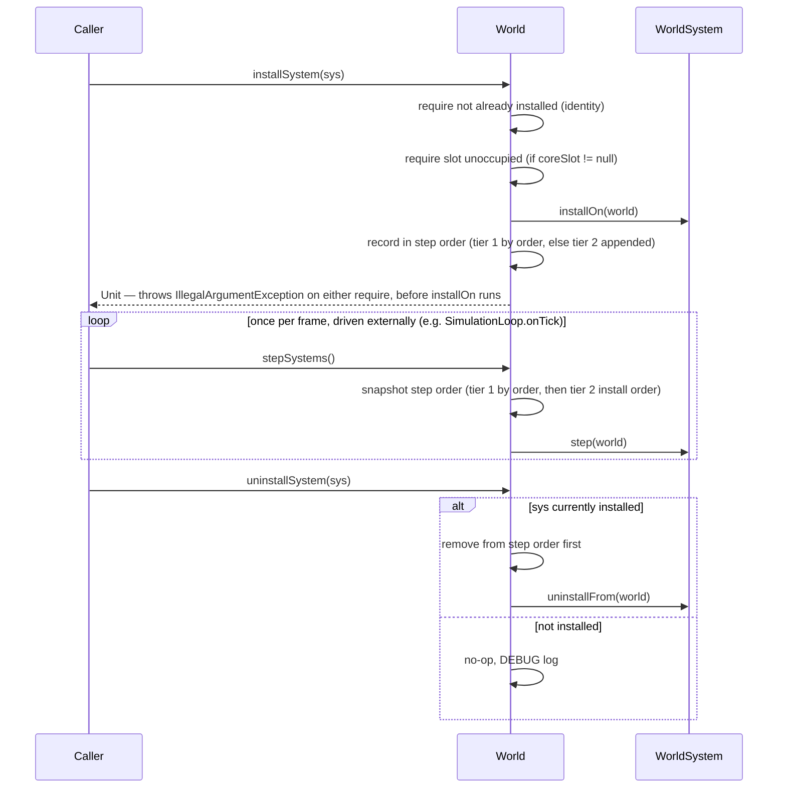

# Plan: `world-system-core` — the `WorldSystem` mechanism, its slots, and `World`'s registry

## Header / Association

- **Covers:** [SpartanLabsGaming/MyGameTools#76](https://github.com/SpartanLabsGaming/MyGameTools/issues/76)
  — *"World Systems Stage 1: `WorldSystem` core mechanism (opt-in per-`World` system registry)"*.
- **Architecture:** `docs/world-systems-implementation-architecture.md`, unit slug
  `world-system-core` (§10 decomposition table, row 1; scope in §4.1–§4.4, §8, §10).
- **Branch:** `feature/76-world-system-core`, off current `master` (`f727608`) — **not** off
  `feature/71-combat-package`. None of #71's uncommitted or committed working-tree changes ride
  in this unit's commits.
- **Commit:** TBD
- **PR:** TBD. This plan document is **not** part of the implementation PR: it lands earlier,
  together with the architecture and the other four unit plans, in the docs-only planning PR off
  `master` (architecture §1.2, "Other settled points"). The implementation PR references it.
- **What this plans:** a new `com.spartanlabs.gaming.annotation` package in `gametools-core`
  (`ExperimentalGameToolsApi`, `SupportedExtension`); `WorldSystem` and the sealed
  `CoreSystemSlot`/`CoreWorldSystemSlot` slot types in `com.spartanlabs.gaming.gameobjects`; four
  new members on the existing `final class World` (`installSystem`, `uninstallSystem`,
  `installedSystems`, `stepSystems`); the test-source-set-only Gradle opt-in in
  `gametools-core/build.gradle.kts`; and this unit's own README/CONTRIBUTING/CHANGELOG duties.
  No concrete `WorldSystem` (zone, experience, physics) is added here.
- **Status:** planning only. No source, test, or build file has been modified by this document.
- **Target release:** unresolved project-wide — architecture §12 OD3 recommends not blocking this
  unit on #71/#78; see this plan's §9 OD3 (carried).
- **Dependencies:** none (architecture §10). Landing order 1 of 5; `zone-world-system` (#77) and
  `experience-system` (#78) both depend on this unit.
- **Related docs:** `docs/world-systems-implementation-architecture.md` (binding); the superseded
  `docs/world-systems-plan-draft.md`; `docs/physics-core-seams-plan.md` (source of
  `SupportedExtension`'s exact declaration, §2.2/§3.1, copied here per C1); `docs/issue-47-zones-plan.md`
  (plan-doc skeleton precedent; `ZoneIndex.entitiesIn`'s "fresh copy" precedent,
  `gametools-world/src/main/kotlin/com/spartanlabs/gaming/world/zone/ZoneIndex.kt:68`);
  `docs/api-openness-decisions-6.0.0.md` D4 (`World` stays closed to subclassing — unaffected by
  this design, per architecture §7 item 5).

---

## 1. Context

### 1.1 The problem, restated

`World` (`gametools-core/src/main/kotlin/com/spartanlabs/gaming/gameobjects/World.kt`) has no
general, opt-in way to host add-on per-frame or event-driven behaviour. The issue that originally
proposed this (`docs/world-systems-plan-draft.md`) design has already been superseded by the
architecture document's two-tier model; this unit builds the mechanism the architecture settled
on: `WorldSystem`, its two ordering tiers, and `World`'s registry of four members. Concrete
adapters (zone, experience, physics) are explicitly out of scope — #77/#78/#80.

### 1.2 Current state (verified against `master` @ `f727608`)

- `World` is `final class World(val seed: Long = Random.nextLong())`
  (`World.kt:48`; D4, `docs/api-openness-decisions-6.0.0.md:132-150`, ruled closed). Its class doc
  (`World.kt:20-47`) states `tick()`'s five-step order and the determinism contract: *"Given the
  same [seed] and the same sequence of external calls, two worlds produce the same result"*
  (`World.kt:41-43`). `tick()` (`World.kt:218-245`) never references any add-on system today.
  `reindexSpatial()` (`World.kt:278-284`) is the last member before the closing brace at
  `World.kt:285` — the new registry region is appended immediately after it, so it lands nowhere
  near the KDoc lines `dcb396e` rewrites on `feature/71-combat-package` (`World.kt:70-71,
  108-109, 200-201` on master, citing `Alive`/`Actor.world` in prose) — #71 and #76 can then merge
  in either order with no conflict on those lines.
- No `com.spartanlabs.gaming.annotation` package and no `@RequiresOptIn`/`@SupportedExtension`
  type exists anywhere in the repo (verified: `gametools-core/src/main/kotlin/com/spartanlabs/gaming`
  has only `event`, `gameobjects`, `simulation`, `spatial`). `com.spartanlabs.gaming.annotation.SupportedExtension`'s
  exact, parameterless shape is already fixed by `docs/physics-core-seams-plan.md` §2.2/§3.1 — this
  plan copies it verbatim (C1), adjusting only the sentences that name the Experimental tier's own
  marker.
- `EventBus` (`gametools-core/src/main/kotlin/com/spartanlabs/gaming/event/EventBus.kt`) is the
  direct precedent for symmetric subscribe/cancel: `subscribe` returns a `fun interface
  Subscription { fun cancel() }` documented "Idempotent" (`EventBus.kt:39-41`); `publish`
  (`EventBus.kt:73-89`) catches and logs a throwing listener rather than aborting delivery.
- `Capability`/`CoreCapability` (`gametools-core/src/main/kotlin/com/spartanlabs/gaming/gameobjects/combat/Capability.kt:18-34`)
  is the direct precedent for an open interface plus a closed, ordered, library-defined enum
  implementing it, both declared in one file — this plan follows that same one-file convention for
  `CoreSystemSlot`/`CoreWorldSystemSlot`.
- `SimulationLoop.advance` (`gametools-core/src/main/kotlin/com/spartanlabs/gaming/simulation/SimulationLoop.kt:112-127`)
  calls `world.tick()` then `onTick(world.tickCount)` once per whole tick, with no `dt` — the
  documented, public (`advance` is not `private`) hook a driver wires `world.stepSystems()` into,
  and the one this unit's deterministic test drives directly with no thread involved.
  `SimulationLoop` itself never adopts `WorldSystem` — it is the driver, not a system.
- `TiledMap.addSpawnPoint` (`gametools-world/src/main/kotlin/com/spartanlabs/gaming/world/map/TiledMap.kt:113-116`)
  is the repo's established precedent for `require`-based duplicate-registration rejection,
  throwing `IllegalArgumentException` for a caller-wiring error rather than returning `Result`.
- `GameObject.kt:23` declares `internal val log: Logger = LoggerFactory.getLogger("com.spartanlabs.gaming.gameobjects")`,
  shared by every file in the `gameobjects` package including `World.kt` — `World`'s new members
  log through this same instance, matching `World`'s existing `log.info`/`log.debug` calls.
- `gametools-core/build.gradle.kts:6` and `gametools-world/build.gradle.kts:14` both still read
  `5.1.0`. `gametools-world/build.gradle.kts:9` depends on core via `api(project(":gametools-core"))`
  — the dependency edge runs one way, which is why the slot types must live in `core` (C5) for a
  `gametools-world` adapter to reference them later.
- `build-logic/src/main/kotlin/gametools.kotlin-library.gradle.kts` is the convention plugin both
  `gametools-core/build.gradle.kts` and `gametools-world/build.gradle.kts` apply (via
  `gametools.published-library`); it registers `componentTest`/`integrationTest`/`deterministicTest`/
  `e2eTest`/`nonfunctionalTest` Gradle tasks filtering on `com.spartanlabs.gaming.testing.<level>.*`,
  and declares `testImplementation("org.jetbrains.kotlin:kotlin-test")` — no MockK dependency
  exists anywhere in the repo. It does **not** currently configure `compileTestKotlin`'s
  `compilerOptions.optIn` — this unit adds that block directly to `gametools-core/build.gradle.kts`
  (not the shared convention plugin, since `gametools-world`'s equivalent line is #77's own to add,
  per this unit's stated out-of-scope list).

### 1.3 Acceptance criteria (architecture §1.3, narrowed to this unit's scope)

1. `gametools-core` gains a new, public `com.spartanlabs.gaming.annotation` package with
   `ExperimentalGameToolsApi` (`@RequiresOptIn(level = ERROR)`) and `SupportedExtension`
   (documentary, no gate), exactly as specified in architecture §4.1/§8 and
   `docs/physics-core-seams-plan.md` §2.2.
2. `WorldSystem` exists as a `@SubclassOptInRequired(ExperimentalGameToolsApi::class)` interface
   with `installOn`, a default-no-op `uninstallFrom`, a default-no-op `step`, and a default-`null`
   `coreSlot: CoreSystemSlot?`.
3. `CoreSystemSlot` (`sealed interface`) and `CoreWorldSystemSlot` (`enum class`, `PHYSICS(0)`,
   `ZONE(1)`) exist, both `@ExperimentalGameToolsApi`, in the same package as `World`.
4. `World` gains `installSystem`, `uninstallSystem`, `installedSystems`, `stepSystems` — each
   `@ExperimentalGameToolsApi` — with the exact registry semantics in §3.4 below. A `World` that
   never calls any of the four behaves exactly as it does today; `World.tick()` never calls
   `stepSystems()`.
5. A consumer building against these types from `gametools-core`'s own test source set can do so
   with a single `compilerOptions.optIn` line, with no main-source-set-wide flag anywhere.
6. `README.md`, `CONTRIBUTING.md`, and `CHANGELOG.md` document this unit's own new surface in this
   unit's own commits (architecture §7).

---

## 2. Design

### 2.1 Package/file placement — confirmed, not changed, from architecture §4.1–§4.3

- `com.spartanlabs.gaming.annotation` (new top-level package in `gametools-core`) — matches the
  precedent `docs/physics-core-seams-plan.md` §2.1 already established (flat, dedicated,
  cross-cutting concern package, mirroring `org.jetbrains.annotations`/`kotlin.annotation`). Two
  files: `ExperimentalGameToolsApi.kt`, `SupportedExtension.kt` (one type per file, matching the
  package's own later precedent).
- `WorldSystem.kt` and `CoreSystemSlot.kt` both land in the **existing**
  `com.spartanlabs.gaming.gameobjects` package, beside `World` — not a new `world.system` package
  (architecture §7 item 4 explicitly retires that sketch). `CoreSystemSlot`/`CoreWorldSystemSlot`
  are declared together in one file, `CoreSystemSlot.kt`, following the `Capability.kt` precedent
  (§1.2) of one interface plus its closed built-in enum sharing a file.
- `World`'s four new members are added as genuine members of the existing `World.kt`, inside a new
  `//region INSTALLED SYSTEMS` block appended immediately after `reindexSpatial()` (currently the
  last member, `World.kt:278-284`) and before the class's closing brace (`World.kt:285`) — never
  as extension functions, since the installed-system list is private mutable state that must live
  inside the class (`World` is `final`, D4).

### 2.2 `ExperimentalGameToolsApi` — exact declaration (C1, architecture §4.1/§8)

```kotlin
// gametools-core/src/main/kotlin/com/spartanlabs/gaming/annotation/ExperimentalGameToolsApi.kt
package com.spartanlabs.gaming.annotation

@MustBeDocumented
@Retention(AnnotationRetention.BINARY)
@Target(
    AnnotationTarget.CLASS, AnnotationTarget.FUNCTION, AnnotationTarget.PROPERTY,
    AnnotationTarget.CONSTRUCTOR, AnnotationTarget.TYPEALIAS,
)
@RequiresOptIn(
    level = RequiresOptIn.Level.ERROR,
    message = "This is an experimental GameTools API: its seam is not yet proven by a real " +
        "consumer and may change in a minor release. Opt in explicitly to use it.",
)
annotation class ExperimentalGameToolsApi
```

`ERROR`, not `WARNING` — architecture §8/§9: a small, deliberate seam where an unintentional touch
should fail the build, matching `kotlin.ExperimentalStdlibApi`'s own precedent, not
`kotlinx`'s `WARNING`-level marker for a vast everyday surface. One library-wide marker, not a
per-feature one, per architecture §9's rejected-alternative reasoning: three seams (`WorldSystem`,
the slot types, `World`'s four members) share exactly one lifecycle (Experimental until #79), and
the marker class is never deleted even after everything it once gated graduates (§4.7) — a
consumer's `@OptIn(ExperimentalGameToolsApi::class)` would fail to compile ("unresolved
reference") if it were.

### 2.3 `SupportedExtension` — copied verbatim from `docs/physics-core-seams-plan.md` §2.2/§3.1 (C1)

```kotlin
// gametools-core/src/main/kotlin/com/spartanlabs/gaming/annotation/SupportedExtension.kt
package com.spartanlabs.gaming.annotation

@MustBeDocumented
@Retention(AnnotationRetention.BINARY)
@Target(
    AnnotationTarget.CLASS, AnnotationTarget.FUNCTION, AnnotationTarget.PROPERTY,
    AnnotationTarget.CONSTRUCTOR, AnnotationTarget.TYPEALIAS,
)
annotation class SupportedExtension
```

Identical declaration and identical KDoc content to `docs/physics-core-seams-plan.md` §3.1, with
one adjustment: that plan's KDoc does not yet name a sibling Experimental marker (none existed
when it was written). This unit's copy adds one sentence contrasting the two tiers by the marker's
real name:

> Contrast with an `@ExperimentalGameToolsApi`-gated *Experimental* seam, whose shape may still
> change in a minor release because no real consumer has built against it yet — nothing tagged
> `@SupportedExtension` is unproven in that sense.

No other prose changes. **This plan does not claim `CollisionResolver` is `@SupportedExtension`'s
first user** — per this unit's explicit scope instruction, its first real application is
`WorldSystem` at #79 (architecture §4.7), not any physics type. Any KDoc sentence in the copied
source that named `CollisionResolver` as the worked example is dropped, not carried forward,
since #49/#80 is unbuilt and out of scope here; the KDoc instead names `WorldSystem`'s eventual
graduation (§4.7) as the seam this tier's first real, in-repo consumer.

### 2.4 `WorldSystem` — the mechanism (architecture §4.2)

```kotlin
// gametools-core/src/main/kotlin/com/spartanlabs/gaming/gameobjects/WorldSystem.kt
package com.spartanlabs.gaming.gameobjects

@SubclassOptInRequired(ExperimentalGameToolsApi::class)
interface WorldSystem {
    fun installOn(world: World)
    fun uninstallFrom(world: World) {}
    fun step(world: World) {}
    val coreSlot: CoreSystemSlot? get() = null
}
```

- `@SubclassOptInRequired(ExperimentalGameToolsApi::class)` on the interface itself, not a plain
  `@ExperimentalGameToolsApi` — stable since Kotlin 2.1, gives an implementor "requires opt-in to
  be implemented" rather than a generic opt-in error (architecture Research finding 2). No extra
  Gradle opt-in is needed for `SubclassOptInRequired` itself; it is unconditionally stable.
- Plain `interface`, not `fun interface` — it is a stateful lifecycle participant with a
  default-bodied teardown hook and a property, not a single computation; alternatives in §7.
- `uninstallFrom` defaults to a no-op. It is the instance-side counterpart `World.uninstallSystem`
  needs to release what `installOn` acquired (a live `EventBus.Subscription`, a held guard) —
  without it, teardown could only ever drop a system from the step list, never let it clean up
  after itself (architecture Research finding 4, four independent ECS/engine precedents). Adding
  it now costs nothing binary- or source-compatibility-wise under this repo's Kotlin 2.2 toolchain
  (`-jvm-default=enable` by default, Research finding 5), so it ships from #76 rather than being
  deferred to whichever adapter first needs it.
- `coreSlot` defaults to `null` (tier 2). Read once, at install time (§3.4) — a system must not
  change what it returns after installation.

### 2.5 `CoreSystemSlot` / `CoreWorldSystemSlot` — tier-1 slots (architecture §4.3)

```kotlin
// gametools-core/src/main/kotlin/com/spartanlabs/gaming/gameobjects/CoreSystemSlot.kt
package com.spartanlabs.gaming.gameobjects

@ExperimentalGameToolsApi
sealed interface CoreSystemSlot {
    val order: Int
}

@ExperimentalGameToolsApi
enum class CoreWorldSystemSlot(override val order: Int) : CoreSystemSlot {
    PHYSICS(0), // reserved for #80's PhysicsWorldSystem
    ZONE(1),    // #77's ZoneWorldSystem
}
```

`sealed interface`, not the plain `interface` in the relayed sketch — carried from architecture
§4.3/§9 OD1 exactly. A plain `interface` would let any module declare a competing, core-looking
slot type, defeating C5's own stated intent that "only library-defined slots exist." Sealed direct
subtypes must share module and package (architecture Research finding 3, independently
compiler-verified) — a `gametools-world` type may still *return* an existing
`CoreWorldSystemSlot` value from a `CoreSystemSlot?`-typed `coreSlot` property; it just cannot
mint a new subtype of the sealed interface itself. This is confirmed to the user again as OD1,
carried in §9 below.

`order` is compared, never `ordinal`; only relative order across slots is contractual — a future
slot inserted between two existing ones may renumber. `CoreWorldSystemSlot`'s KDoc states
explicitly that the enum may gain entries in a later feature release (a reserved `VISION` slot is
named as the anticipated example, for #50) and that a consumer must not write an exhaustive
`when` over it without an `else` branch.

### 2.6 `World` registry members (architecture §4.4)

```kotlin
// appended to the existing World.kt, in a new region after reindexSpatial()
//region INSTALLED SYSTEMS
@ExperimentalGameToolsApi
fun installSystem(system: WorldSystem)

@ExperimentalGameToolsApi
fun uninstallSystem(system: WorldSystem)

@ExperimentalGameToolsApi
val installedSystems: List<WorldSystem>

@ExperimentalGameToolsApi
fun stepSystems()
//endregion
```

Backing state, private to `World`, declared at the top of the same region:

```kotlin
private val tier1: TreeMap<CoreSystemSlot, WorldSystem> = TreeMap(compareBy { it.order })
private val tier2: MutableList<WorldSystem> = mutableListOf()
```

(`TreeMap` keyed by a `Comparator` over `order`, not `Comparable<CoreSystemSlot>` on the slot type
itself, since `CoreSystemSlot` carries no natural ordering of its own beyond `order` — avoids
forcing `CoreSystemSlot` to implement `Comparable` for a `World`-internal bookkeeping detail.)

All four are exactly the members architecture §4.4 specifies, none returning `Result` — see §3.4
for the full semantics and their `@throws`/logging contracts, and §7 for why `Result` is rejected
here (mirrors `TiledMap.addSpawnPoint`/`ZoneGrid`'s existing `require`-based convention).

### 2.7 `World`'s class-KDoc and determinism-contract update

The class doc's determinism sentence (`World.kt:41-43` on master: *"Given the same [seed] and the
same sequence of external calls, two worlds produce the same result."*) is extended with one
clause naming install/uninstall call order as one of those external calls:

> `installSystem`/`uninstallSystem` call order is one such external call — the same fixed sequence
> against a fixed seed reproduces the same step order and the same result.

A new short paragraph is added after the existing five-step `tick()` list (not replacing any of
its five points, which are untouched) naming `stepSystems()` as a *separate*, driver-called
operation `tick()` never invokes:

> `stepSystems()` is a separate, opt-in operation a driver calls once per frame (typically from
> [com.spartanlabs.gaming.simulation.SimulationLoop]'s `onTick`) — [tick] never calls it. A
> [World] that installs no [WorldSystem] behaves exactly as before this existed.

This is the one class-doc edit in this unit and lands in the same commit as the new region; it
does not touch any of the three KDoc anchors `dcb396e` rewrites on `feature/71-combat-package`
(§1.2), so #71 and #76 merge cleanly in either order.

### 2.8 Precedent shift, stated explicitly (architecture §6, §11)

This is the first time `World` hosts externally supplied behaviour. The mitigation is structural:
`World` depends only on the `WorldSystem` interface, declared in its own package — never a
concrete adapter, never another module — continuing the deliberate rule three historical commits
already state (`0d586b5`, `a0f1717`, `34db6bc`: "add-ons import `World`, never the reverse"). The
mechanism is opt-in with zero behavioural change when nothing is installed, matching D4's own
anticipated compositional answer for "a per-frame phase a consumer wants to add"
(`docs/api-openness-decisions-6.0.0.md:132-150`).

### 2.9 Flow



---

## 3. File-by-file changes

### 3.1 New: `gametools-core/src/main/kotlin/com/spartanlabs/gaming/annotation/ExperimentalGameToolsApi.kt`

New file, new package. No imports needed (`MustBeDocumented`, `Retention`, `Target`,
`RequiresOptIn` and their nested types resolve from `kotlin.*`/`kotlin.annotation.*` without an
explicit import).

```kotlin
package com.spartanlabs.gaming.annotation

/**
 * Marks a public declaration as **Experimental**: a seam whose shape has not yet been proven by
 * a real consumer and may still change in a minor release. Use of anything so annotated must be
 * an explicit, deliberate opt-in (`@OptIn(ExperimentalGameToolsApi::class)` or a propagating
 * annotation on the using declaration) — never a blanket compiler flag on a main source set.
 *
 * `ERROR`-level: an unintentional touch of an Experimental seam should fail the build outright,
 * the same posture Kotlin's own `kotlin.ExperimentalStdlibApi` takes, not the `WARNING` level
 * `kotlinx` reserves for a vast, everyday surface a consumer is expected to brush against
 * constantly.
 *
 * One marker shared by every Experimental GameTools seam, not one per feature: every seam this
 * annotates shares the same meaning ("unproven shape, may change in a minor") and, in practice,
 * the same graduation lifecycle. This class is **never deleted**, even once nothing in the
 * library carries it any more — a consumer's own `@OptIn(ExperimentalGameToolsApi::class)` would
 * fail to compile ("unresolved reference") if it were, so it remains, undeprecated, as the
 * tier's permanent marker for the next seam that needs it.
 */
@MustBeDocumented
@Retention(AnnotationRetention.BINARY)
@Target(
    AnnotationTarget.CLASS, AnnotationTarget.FUNCTION, AnnotationTarget.PROPERTY,
    AnnotationTarget.CONSTRUCTOR, AnnotationTarget.TYPEALIAS,
)
@RequiresOptIn(
    level = RequiresOptIn.Level.ERROR,
    message = "This is an experimental GameTools API: its seam is not yet proven by a real " +
        "consumer and may change in a minor release. Opt in explicitly to use it.",
)
annotation class ExperimentalGameToolsApi
```

**Error handling:** none applicable — an annotation class has no execution path.
**Mutability:** none applicable.
**Logging:** none applicable.
**Stability tier:** N/A — it *is* the Experimental marker (architecture §8).

### 3.2 New: `gametools-core/src/main/kotlin/com/spartanlabs/gaming/annotation/SupportedExtension.kt`

Per §2.3 — identical declaration to `docs/physics-core-seams-plan.md` §3.1, KDoc adjusted per
§2.3's one added sentence and with no `CollisionResolver` reference.

**Error handling / Mutability / Logging:** none applicable, same reasoning as §3.1.
**Stability tier:** Stable Core (architecture §8: "infrastructure for stability itself must be
stable").

### 3.3 New: `gametools-core/src/main/kotlin/com/spartanlabs/gaming/gameobjects/WorldSystem.kt`

Per §2.4. Full KDoc on the interface and each member:

```kotlin
/**
 * An opt-in add-on that hosts per-frame or event-driven behaviour on a [World] without [World]
 * itself knowing anything about it. Install with [World.installSystem], step every installed
 * system once per frame with [World.stepSystems] (called by a driver — [World.tick] never calls
 * it), and tear down symmetrically with [World.uninstallSystem].
 *
 * Requires opt-in to implement: `@SubclassOptInRequired(ExperimentalGameToolsApi::class)`. This
 * seam has not yet been proven by a real consumer and may still change in a minor release before
 * it graduates to `@SupportedExtension`.
 *
 * A plain interface, not a functional interface — a [WorldSystem] is a stateful lifecycle
 * participant ([installOn]/[uninstallFrom] pair with acquiring/releasing a resource), not a
 * single computation.
 *
 * Whether one instance may be installed on several worlds at once is the implementation's call,
 * and its KDoc should say which. `ZoneWorldSystem` refuses it, because its `ZoneIndex` holds
 * per-world state; `ExperienceSystem` allows it.
 *
 * Known limitation: a system without a [coreSlot] always steps after every slotted system. It can
 * never run before `PHYSICS` or between `PHYSICS` and `ZONE`. Per-entity work that must precede
 * physics belongs in [GameObject.tick], which [World.tick] runs before any driver calls
 * [World.stepSystems].
 */
@SubclassOptInRequired(ExperimentalGameToolsApi::class)
interface WorldSystem {

    /**
     * Called once, by [World.installSystem], before this system is recorded in
     * [World.installedSystems]. Wire up whatever this system needs from [world] here (e.g.
     * subscribe to [World.events]).
     *
     * @param world the world this system is being installed on
     * @throws Exception any exception this method throws propagates to the [World.installSystem]
     *   caller and aborts the install — nothing is recorded when this throws
     */
    fun installOn(world: World)

    /**
     * Called once, by [World.uninstallSystem], immediately after this system has already been
     * removed from [World.installedSystems] — this system is never present in that list while
     * its own [uninstallFrom] runs. Release here whatever [installOn] acquired. No-op by
     * default, for a system with nothing to release.
     *
     * @param world the world this system is being uninstalled from
     */
    fun uninstallFrom(world: World) {}

    /**
     * Called once per [World.stepSystems] call, in this system's step-order position. No-op by
     * default, for a system with no per-frame work of its own (e.g. a purely event-reactive
     * system that does everything in [installOn]).
     *
     * @param world the world this system is stepping on
     */
    fun step(world: World) {}

    /**
     * `null` (the default) enrolls this system in tier 2: install-order, always stepped after
     * every tier-1 system. A non-null value claims that [CoreSystemSlot] in tier 1, sorted by
     * [CoreSystemSlot.order] regardless of install order — a second system claiming an already
     * occupied slot is rejected by [World.installSystem]. Read once, at install time; this
     * system must not change what it returns afterward.
     */
    val coreSlot: CoreSystemSlot? get() = null
}
```

**Error handling:** `installOn`/`uninstallFrom`/`step` are implementor-supplied; their exceptions
are the implementor's own — expected failures (e.g. "world already has an `ExperienceSystem`")
are the implementor's `require`, matching `installSystem`'s own convention (§3.4), not `Result` —
this interface prescribes no wrapping. **Mutability:** none of its own; implementors decide their
own state. **Logging:** none of its own — `World`'s registry logs the lifecycle events (§3.4).
**Stability tier:** Experimental (`@SubclassOptInRequired(ExperimentalGameToolsApi::class)`);
graduates to `@SupportedExtension` at #79 (out of scope here).

### 3.4 New: `gametools-core/src/main/kotlin/com/spartanlabs/gaming/gameobjects/CoreSystemSlot.kt`

Per §2.5. Full KDoc, matching `Capability`/`CoreCapability`'s own KDoc register:

```kotlin
/**
 * A library-reserved tier-1 slot a [WorldSystem] may claim via [WorldSystem.coreSlot], giving it
 * a guaranteed relative step order against every other tier-1 system regardless of install order.
 * The built-in hierarchy uses [CoreWorldSystemSlot]; unlike [com.spartanlabs.gaming.gameobjects.combat.Capability],
 * this is `sealed` — only library-defined slots exist, by construction, not by convention. A
 * consumer may still have their own [WorldSystem] *return* an existing [CoreWorldSystemSlot]
 * value (a deliberate replacement of a shipped adapter); what a consumer cannot do is declare a
 * *new* [CoreSystemSlot] subtype that looks core but is not.
 *
 * @property order this slot's position among tier-1 systems, ascending, and unique across every
 *   [CoreSystemSlot]. It is compared, never [Enum.ordinal]. Only the *relative* order across slots
 *   is contractual: a slot inserted between two existing ones may renumber both.
 */
@ExperimentalGameToolsApi
sealed interface CoreSystemSlot {
    val order: Int
}

/**
 * The tier-1 slots GameTools itself reserves. May gain entries in a later feature release (a
 * `VISION` slot, positioned after [PHYSICS], is anticipated for a future vision system) — do not
 * write an exhaustive `when` over this enum without an `else` branch.
 *
 * @property order the stable wire/ordering key, matching [CoreSystemSlot.order]
 */
@ExperimentalGameToolsApi
enum class CoreWorldSystemSlot(override val order: Int) : CoreSystemSlot {

    /** Reserved for `gametools-world`'s `PhysicsWorldSystem` (issue #80). */
    PHYSICS(0),

    /** Reserved for `gametools-world`'s `ZoneWorldSystem` (issue #77). */
    ZONE(1),
}
```

**Error handling / Mutability:** none applicable — pure value types. **Logging:** none applicable.
**Stability tier:** Experimental (`@ExperimentalGameToolsApi` — plain marker, not
`@SubclassOptInRequired`, since nothing here is meant to be subclassed by a consumer at all; a
consumer only *reads* `order` or *returns* an existing constant). Graduates to untagged Stable
Core at #79.

### 3.5 Changed: `gametools-core/src/main/kotlin/com/spartanlabs/gaming/gameobjects/World.kt`

Two edits, both additive:

1. **Class doc** (§2.7) — extend the determinism sentence and add the `stepSystems()` /
   `tick()` separation paragraph. No existing line in the five-step `tick()` list changes.
2. **New region**, appended after `reindexSpatial()` (currently `World.kt:278-284`), before the
   closing brace:

```kotlin
    //region INSTALLED SYSTEMS
    private val tier1: TreeMap<CoreSystemSlot, WorldSystem> = TreeMap(compareBy { it.order })
    private val tier2: MutableList<WorldSystem> = mutableListOf()

    /**
     * Installs [system] on this world: [WorldSystem.installOn] runs first, then [system] is
     * recorded in [installedSystems]' step order. If [system] declares a [WorldSystem.coreSlot],
     * it joins tier 1, sorted by [CoreSystemSlot.order] regardless of install order; otherwise it
     * joins tier 2, appended after every tier-1 system, in install order.
     *
     * @param system the system to install
     * @throws IllegalArgumentException if [system] (by reference identity) is already installed
     *   on this world, or if [system] declares a [WorldSystem.coreSlot] already claimed by
     *   another installed system — both checked, and both throw, before [WorldSystem.installOn]
     *   runs. If [WorldSystem.installOn] itself throws, nothing is recorded and that exception
     *   propagates instead.
     */
    @ExperimentalGameToolsApi
    fun installSystem(system: WorldSystem) {
        require(tier1.values.none { it === system } && tier2.none { it === system }) {
            "$system is already installed on this world"
        }
        val slot = system.coreSlot
        if (slot != null) {
            val occupant = tier1[slot]
            require(occupant == null) { "slot $slot is already claimed by $occupant" }
        }
        system.installOn(this)
        if (slot != null) tier1[slot] = system else tier2.add(system)
        log.info("World installed a {} system{}", system::class.simpleName, slot?.let { " (slot $it)" } ?: "")
    }

    /**
     * Uninstalls [system] from this world: removed from [installedSystems] first, then
     * [WorldSystem.uninstallFrom] runs — [system] is never present in [installedSystems] while
     * its own [WorldSystem.uninstallFrom] executes. Idempotent: uninstalling a system not
     * currently installed is a no-op.
     *
     * @param system the system to uninstall
     */
    @ExperimentalGameToolsApi
    fun uninstallSystem(system: WorldSystem) {
        val slot = tier1.entries.find { it.value === system }?.key
        val removed = if (slot != null) tier1.remove(slot) != null else tier2.removeAll { it === system }
        if (!removed) {
            log.debug("World.uninstallSystem: {} was not installed, no-op", system::class.simpleName)
            return
        }
        system.uninstallFrom(this)
        log.info("World uninstalled a {} system", system::class.simpleName)
    }

    /**
     * Every system currently installed, in the order [stepSystems] would step them: tier 1 by
     * [CoreSystemSlot.order], then tier 2 in install order. A fresh copy on every access, not a
     * live view — mutating the returned list has no effect on this world.
     */
    @ExperimentalGameToolsApi
    val installedSystems: List<WorldSystem>
        get() = tier1.values.toList() + tier2

    /**
     * Steps every installed system once, in [installedSystems]' order, over a snapshot taken
     * before this pass — a system uninstalled earlier in the same pass is skipped for the rest of
     * it; a system installed mid-pass steps from the *next* call. A separate, opt-in operation a
     * driver calls once per frame (typically from
     * [com.spartanlabs.gaming.simulation.SimulationLoop]'s `onTick`); [tick] never calls this.
     *
     * @throws Exception any exception a [WorldSystem.step] throws propagates uncaught, exactly
     *   as an exception from [GameObject.tick] does during [tick] — it is not this method's job
     *   to isolate a misbehaving system from its caller
     */
    @ExperimentalGameToolsApi
    fun stepSystems() {
        val order = installedSystems
        log.debug("World.stepSystems: stepping {} system(s)", order.size)
        order.forEach { system ->
            if (tier1.values.any { it === system } || tier2.any { it === system }) system.step(this)
        }
    }
    //endregion
```

(The `if (tier1... || tier2...)` re-check in `stepSystems()` implements "a system uninstalled
earlier in the same pass is skipped for the remainder of that pass" against the snapshot already
taken — a cheap `O(k)` membership re-check against the still-small installed-system count, not a
second full pass.)

**Error handling:** `installSystem` throws `IllegalArgumentException` for its two caller-wiring
checks (duplicate instance, occupied slot) — an expected, documented *caller* error, matching
`TiledMap.addSpawnPoint`/`ZoneGrid`'s existing `require` convention (§1.2), not an operational
failure warranting `Result` (this toolchain has no must-use checker, so an ignored `Result` would
silently leave a system uninstalled — architecture §4.4/§9). `uninstallSystem` has no failure mode
(idempotent, returns `Unit`). `stepSystems`/`installedSystems` reject nothing; a thrown exception
from a system's own hook propagates uncaught, exactly like `tick()`'s own `GameObject.tick()`
pass.

**Mutability:** `tier1`/`tier2` are private mutable collections (`TreeMap`, `MutableList`),
exactly like `World`'s existing `gameObjects`/`byId`/`announced`. `installedSystems` always
returns a fresh, immutable-from-the-caller's-view `List` copy — the `ZoneIndex.entitiesIn`
precedent (§1.2).

**Concurrency:** unchanged — `World` remains single-threaded by convention; no synchronisation is
added, matching every other member of the class.

**Logging (via the shared `internal val log` in `GameObject.kt:23`):**
- `INFO` — `"World installed a {} system{}"` on a successful `installSystem`.
- `INFO` — `"World uninstalled a {} system"` on a successful `uninstallSystem`.
- `DEBUG` — `"World.uninstallSystem: {} was not installed, no-op"` on the idempotent no-op path.
- `DEBUG` — `"World.stepSystems: stepping {} system(s)"` once per `stepSystems()` call, mirroring
  `tick()`'s own `log.debug("World tick: advancing {} game object(s)", ...)` pattern
  (`World.kt:224`).

**Stability tier:** Experimental (`@ExperimentalGameToolsApi` on each of the four members
individually). Each member needs the marker explicitly. `WorldSystem` carries
`@SubclassOptInRequired`, which gates only *implementing* it: merely naming `WorldSystem` in a
signature (as `installSystem`, `uninstallSystem` and `installedSystems` do) does not gate a
caller. `stepSystems()`'s signature does not mention it at all. Without the marker, all four would
be callable with no opt-in. Graduates to untagged Stable Core at #79.

**Imports added to `World.kt`**, in the file's existing numbered regions:
- `com.spartanlabs.gaming.annotation.ExperimentalGameToolsApi` under `1. Organization Internal` /
  `1.2 Spartan Gaming`;
- `java.util.TreeMap` under `3. Utility / Catch-all` / a new `3.1 Java Standard library`
  subgroup, placed above the existing `3.2 Kotlin` subgroup.

`WorldSystem` and `CoreSystemSlot` share `World`'s package and need no import.
`WorldSystem.kt` and `CoreSystemSlot.kt` each import only `ExperimentalGameToolsApi`, under
`1.2 Spartan Gaming`.

**Invariant the `TreeMap` relies on.** The comparator keys tier 1 on `order` alone, so two
distinct slots with equal `order` would collide as one key. Slot `order` values must therefore be
unique across every `CoreSystemSlot`. The sealed interface makes that a library-internal
invariant: only `gametools-core` can declare slots. It is locked in by a test (§5,
`CoreWorldSystemSlotTest`), and `CoreSystemSlot.order`'s KDoc states it.

### 3.6 Changed: `gametools-core/build.gradle.kts`

Add the test-source-set-only opt-in (architecture §8's "Gradle test-only opt-in" row), immediately
after the existing `dependencies { }` block:

```kotlin
tasks.named<org.jetbrains.kotlin.gradle.tasks.KotlinCompilationTask<*>>("compileTestKotlin") {
    compilerOptions.optIn.add("com.spartanlabs.gaming.annotation.ExperimentalGameToolsApi")
}
```

No main-source-set flag, ever — production code that wants to use `WorldSystem`/the slot
types/`World`'s four members opts in explicitly per call site or per class, the same as any other
consumer (architecture §8, last row). This line is removed at #79 (out of scope here).
`gametools-world`'s equivalent line is #77's own to add — not touched by this unit.

**Error handling / Logging:** N/A — build configuration, not runtime code.

---

## 4. Documentation impact (Audience-Reach rings)

- **Inner Core (in-editor).** The one new `//region INSTALLED SYSTEMS` / `//endregion` block in
  `World.kt` (§3.5); the two new annotation files need no import-region comments (no imports).
- **Component Ring (KDoc/API contracts).** The primary ring this unit touches. Full KDoc, per
  §3.1–§3.5, on every new public declaration: `ExperimentalGameToolsApi`, `SupportedExtension`,
  `WorldSystem` and its four members, `CoreSystemSlot`/`CoreWorldSystemSlot`, and `World`'s four
  new members plus the class-doc update. Every KDoc must render correctly under
  `./gradlew dokkaGeneratePublicationHtml`.
- **Boundary Ring.** Not touched — no wire format, no protocol, no cross-service concern in this
  unit.
- **Architectural Outer Layer.**
  - `README.md`:
    - **Modules table, core row** (currently `README.md:147`) — add `annotation` to the package
      list and name both new types.
    - **Architecture Mermaid class diagram** (`README.md:33-119`):
      - add an `interface WorldSystem` node (`installOn`, `uninstallFrom`, `step`, `coreSlot`);
      - add `CoreSystemSlot` with `CoreWorldSystemSlot`, in the diagram's existing `<<interface>>`
        / `<<enumeration>>` notation;
      - add `World "1" o-- "*" WorldSystem : installed`, beside the existing
        `World "1" o-- "*" GameObject` edge (`README.md:112`).
      This is an architectural shift, and the README rule wants it shown.
    - **Layer table** (`README.md:120-138`) — add one row, e.g. `| WorldSystem | interface
      (Experimental) | An opt-in add-on a World hosts: installed with installSystem, stepped by a
      driver via stepSystems once per frame, never by tick; library-reserved CoreWorldSystemSlots
      give built-in systems a guaranteed order |`. `World`'s own row is left as is, because
      installed systems are a separate, driver-called operation (§2.7).
    - **Features** — add a bullet under **Game Objects** naming `WorldSystem`, the registry and
      the two-tier model, explicitly marked Experimental.
  - `CONTRIBUTING.md` — the Module layout table's `gametools-core` row (currently
    `CONTRIBUTING.md:33`) gains `annotation` to its package list, mirroring README exactly (same
    drift risk `docs/physics-core-seams-plan.md` §7 already flagged — kept in sync here too).
  - `CHANGELOG.md` — one `[Unreleased] ### Added` entry (draft below).
  - `docs/world-systems-implementation-architecture.md` already documents this unit's design; no
    update owed to it from this unit. The eight documentation-correction pointer edits in the
    architecture's §7 table are the planner's own docs-only-PR responsibility, not this
    implementation unit's — not duplicated here.

### `CHANGELOG.md` — `[Unreleased] ### Added` draft

```markdown
- `com.spartanlabs.gaming.annotation` — two API-stability-tier markers: `ExperimentalGameToolsApi`
  (`@RequiresOptIn(level = ERROR)`, for a seam not yet proven by a real consumer) and
  `SupportedExtension` (documentary only, no compiler gate, for a likely-but-non-core seam that
  carries the same semver guarantee as Stable Core). Both purely documentary/opt-in
  infrastructure — neither adds any domain surface on its own.
- `WorldSystem` — an opt-in, `@ExperimentalGameToolsApi`-gated interface for hosting per-frame or
  event-driven add-on behaviour on a `World`: `installOn`/`uninstallFrom` (symmetric lifecycle
  hooks), a no-op-default `step`, and an optional `coreSlot` claiming one of the library-reserved
  `CoreWorldSystemSlot`s (`PHYSICS`, `ZONE`) for a guaranteed relative step order regardless of
  install order. `World` gains `installSystem`/`uninstallSystem`/`installedSystems`/`stepSystems`
  — all additive; a `World` that installs nothing behaves exactly as before. `World.tick()` never
  calls `stepSystems()` — a driver calls it explicitly, once per frame (e.g. from
  `SimulationLoop`'s `onTick`). No concrete system ships yet — `ZoneWorldSystem` (#77),
  `ExperienceSystem` (#78), and `PhysicsWorldSystem` (#80) follow. (#76)
```

---

## 5. Test plan (5-level hierarchy)

Per-package tree under `com.spartanlabs.gaming.testing.<level>`, mirroring the production
packages exactly (`annotation`, `gameobjects`). One test class per file; `kotlin.test` on the
JUnit 5 platform (no MockK in this repo — hand-rolled recording fakes throughout, matching
`WorldLifecycleEventsTest`'s own `recorder(world)` pattern); backtick test names.

### Level 1 — gating

No `testing.gating` package exists in this repo (verified). Per the established convention, level
1 in practice is `./gradlew componentTest deterministicTest` before pushing, using the level 2/4a
tests below — no separate artifact.

### Level 2 — component

**New:** `gametools-core/src/test/kotlin/com/spartanlabs/gaming/testing/component/annotation/ExperimentalGameToolsApiTest.kt`
- `it fails to compile if a documented annotation target is removed` — a compile-time fixture
  (one `@ExperimentalGameToolsApi`-annotated usage per target: class, top-level function,
  property, secondary constructor, type alias), same rationale as
  `docs/physics-core-seams-plan.md` §5's `SupportedExtensionTest` (`AnnotationTarget.PROPERTY`/
  `TYPEALIAS` do not reliably round-trip through plain JVM reflection).
- `carries @MustBeDocumented` — checked through its JVM form,
  `ExperimentalGameToolsApi::class.java.isAnnotationPresent(java.lang.annotation.Documented::class.java)`
  (the Kotlin compiler emits `@Documented` for `@MustBeDocumented`). If the implementer finds
  that surface not observable, drop the assertion and record it in §6, as
  `docs/physics-core-seams-plan.md` already flagged.
- `@RequiresOptIn`'s `ERROR` level is **not** asserted by reflection. `kotlin.RequiresOptIn` is
  itself `BINARY`-retained, so it is invisible at runtime. The level is proven at compile time
  instead: the test source set only compiles because of the opt-in flag (§3.6, §6).
- `retention is BINARY (not visible on a usage at runtime)` — same negative-test shape as
  `docs/physics-core-seams-plan.md` §5: apply the annotation to a test-local class, assert
  `isAnnotationPresent(ExperimentalGameToolsApi::class.java) == false` at runtime.

**New:** `gametools-core/src/test/kotlin/com/spartanlabs/gaming/testing/component/annotation/SupportedExtensionTest.kt`
— identical structure and assertions to `docs/physics-core-seams-plan.md` §5's own
`SupportedExtensionTest` (compile fixture across the five targets; `@MustBeDocumented` check;
`BINARY`-retention runtime-invisibility check). Not duplicating that plan's own flagged caveat
about the exact JVM-reflection surface of `@Retention`/`@Target` themselves — carried forward
identically here (§6).

**New:** `gametools-core/src/test/kotlin/com/spartanlabs/gaming/testing/component/gameobjects/CoreWorldSystemSlotTest.kt`
- `` `order` is compared, PHYSICS before ZONE `` — `CoreWorldSystemSlot.PHYSICS.order < CoreWorldSystemSlot.ZONE.order`.
- `` every slot's `order` is unique `` —
  `CoreWorldSystemSlot.entries.map { it.order }.toSet().size == CoreWorldSystemSlot.entries.size`.
  Guards the invariant `World`'s `order`-keyed `TreeMap` relies on (§3.5) when a slot such as
  `VISION` is added later.
- `` `CoreWorldSystemSlot` implements `CoreSystemSlot` `` — a compile-time fact, asserted via a
  `val slot: CoreSystemSlot = CoreWorldSystemSlot.ZONE` fixture (forces the subtyping relationship
  to keep compiling).

**New:** `gametools-core/src/test/kotlin/com/spartanlabs/gaming/testing/component/gameobjects/WorldInstalledSystemsTest.kt`
— the primary behavioural suite, using a test-local hand-rolled fake:

```kotlin
@OptIn(ExperimentalGameToolsApi::class)
private class RecordingSystem(
    override val coreSlot: CoreSystemSlot? = null,
    private val onInstall: (World) -> Unit = {},
    private val onUninstall: (World) -> Unit = {},
    private val onStep: (World) -> Unit = {},
) : WorldSystem {
    val installed = mutableListOf<World>()
    val uninstalled = mutableListOf<World>()
    val stepped = mutableListOf<World>()
    override fun installOn(world: World) { installed += world; onInstall(world) }
    override fun uninstallFrom(world: World) { uninstalled += world; onUninstall(world) }
    override fun step(world: World) { stepped += world; onStep(world) }
}
```

Behaviours locked in (each its own `@Test`, backtick-named):
- `` `installSystem` calls `installOn` then records the system `` — order asserted via a shared
  mutable log both the fake and a post-install check append to.
- `` a tier-1 system claiming PHYSICS and one claiming ZONE step PHYSICS then ZONE regardless of
  install order `` — install ZONE first, then PHYSICS; assert `installedSystems` and the
  `stepSystems()`-observed order both put PHYSICS first.
- `` a test-local system claiming an existing CoreWorldSystemSlot is accepted `` — claiming
  `CoreWorldSystemSlot.PHYSICS`/`.ZONE` from a test-local `WorldSystem` is legal (locks in "claiming
  an existing slot is legal," architecture §4.3).
- `` installing a second instance with an already-installed reference is rejected `` —
  `installSystem(sameInstance)` twice throws `IllegalArgumentException`, and `installOn` is called
  exactly once (`installed.size == 1` after the failed second call).
- `` installing a second system claiming an occupied slot is rejected, and its installOn never
  runs `` — asserts the second `RecordingSystem`'s `installed` log stays empty after the thrown
  `IllegalArgumentException`.
- `` if `installOn` throws, nothing is recorded `` — a `RecordingSystem(onInstall = { throw
  IllegalStateException() })`; assert the thrown exception propagates and `installedSystems` does
  not contain it afterward.
- `` `uninstallSystem` on an absent system is an idempotent no-op `` — no exception, no log call
  recorded on the fake.
- `` `uninstallSystem` removes the system before calling `uninstallFrom` `` — the fake's
  `onUninstall` callback asserts `world.installedSystems` does not contain `this` system at the
  moment it runs.
- `` `uninstallSystem` frees a claimed slot for a new claimant `` — uninstall a `PHYSICS`-slot
  system, then install a second, distinct `PHYSICS`-slot system successfully.
- `` a system uninstalled mid-`stepSystems` pass is skipped for the rest of that pass `` — a
  `RecordingSystem` whose `onStep` callback calls `world.uninstallSystem` on a second,
  later-in-order system installed alongside it; assert the second system's `stepped` log stays
  empty for that call.
- `` a system installed mid-`stepSystems` pass steps from the next call, not the current one `` —
  symmetric case: one system's `onStep` installs a third system; assert the third system's
  `stepped` log is empty after the current `stepSystems()` call and non-empty after the next.
- `` `installedSystems` is a fresh copy in step order — mutating it does not affect the world ``
  — `(world.installedSystems as MutableList).clear()` (or attempt `+=`) does not change a
  subsequent `stepSystems()`'s observed step count.
- `` a `stepSystems` call with no installed systems is a no-op `` — no exception, `DEBUG` log path
  exercised (not asserted directly — logging is not test-asserted in this repo's existing
  convention; see §6).
- `` a throwing `step` propagates out of `stepSystems`, and does not prevent the DEBUG log from
  having already fired for the call `` — `assertFailsWith<IllegalStateException> { world.stepSystems() }`.
- `` `World.tick()` never calls `stepSystems()` `` — install a `RecordingSystem`, call
  `world.tick()` several times with no `stepSystems()` call, assert `stepped` stays empty.

### Level 3 — integration

Not applicable. No external interface, database, or third-party service is touched. No test
added — matching `docs/physics-core-seams-plan.md` §5's own precedent for a similarly-scoped
mechanism-only unit.

### Level 4a — deterministic

**New:** `gametools-core/src/test/kotlin/com/spartanlabs/gaming/testing/deterministic/gameobjects/WorldInstalledSystemsDeterminismTest.kt`
- `` identical install sequences on identically-seeded worlds produce identical step order `` —
  build two fresh `World(seed = 42)` instances, install the same sequence of `RecordingSystem`s
  (mixed tier 1/tier 2, deliberately out-of-slot-order) on each, call `stepSystems()` on both, and
  assert both worlds' recorded step-order class-name sequences are `assertContentEquals`.
- `` a `SimulationLoop` driven via `advance(...)` with `onTick = { world.stepSystems() }` steps
  installed systems exactly once per whole tick `` — construct
  `SimulationLoop(world, onTick = { world.stepSystems() })`, install a `RecordingSystem`, call
  `advance(oneWholeTickWorthOfNanos)` a fixed number of times (no thread — `advance` is public and
  called directly), and assert the fake's `stepped.size` equals the tick count. This is the
  concrete proof that `stepSystems()` composes with the documented `SimulationLoop.onTick` driver
  pattern named in architecture §1.3/§4.4, exercised without starting `start()`'s daemon thread.

### Level 4b — e2e

Not applicable. No full client↔server flow is implicated by a mechanism with no concrete adapter
yet — matches architecture §1.3's own framing that only #80 gets an end-to-end physics-ordering
regression test, out of this unit's scope.

### Level 4c — non-functional

Not applicable. `stepSystems()` adds one list snapshot plus N virtual calls per frame — negligible
next to `tick()`'s own per-object work (architecture §11); nothing to benchmark with zero
concrete systems installed anywhere in the repo yet.

### Level 5 — UAT

No `testing.uat` package exists in this repo. Not invented here. A registry mechanism with no
concrete, observable system produces nothing a human evaluator can meaningfully assess in
isolation — any UAT signal belongs to whichever unit first ships an observable system (#77/#78),
matching `docs/physics-core-seams-plan.md` §5's own reasoning for a mechanism-only unit.

---

## 6. What genuinely cannot be tested automatically

- **Compile-time enforcement of `@SubclassOptInRequired`/`@RequiresOptIn`.** No automated test in
  this repo's suite can assert "implementing `WorldSystem` without opt-in fails to compile" —
  that would require a separate, deliberately-failing compilation harness this repo does not have
  today (the same limitation `docs/physics-core-seams-plan.md` §6 notes for its own annotation).
  The `compileTestKotlin`-scoped opt-in (§3.6) is itself the proof that opt-in is required at all:
  if it were not, that Gradle block would be unnecessary and every test in `WorldInstalledSystemsTest`
  would compile without it. Verified manually once by temporarily removing that block and
  confirming the test module fails to compile — not something to keep as a standing automated
  check.
- **The exact JVM-reflection surface of `@Retention`/`@Target` on the annotations themselves** —
  same flagged uncertainty `docs/physics-core-seams-plan.md` §5/§6 already carries; not
  independently re-verified here.
- **Cross-module use of `CoreWorldSystemSlot` from `gametools-world`.** This unit's own test suite
  runs inside `gametools-core`, which has no test dependency on `gametools-world` — proving a
  `gametools-world` adapter can return an existing `CoreWorldSystemSlot` from `coreSlot` is #77's
  own test suite's job, not provable here (mirrors `docs/physics-core-seams-plan.md` §6's
  identical cross-module limitation for `reconcileSpatialIndex`).

---

## 7. Risks & edge cases

- **Breaking changes:** none. Every new member on `World` is additive; `WorldSystem`/the slot
  types are wholly new types. No existing public signature changes.
- **API surface commitment:** from this commit, everything added here is genuinely public,
  Experimental API — `@ExperimentalGameToolsApi`'s `ERROR` gate stops an accidental production
  dependency, but the *shape* is still a real commitment the moment #77/#78 build against it; a
  shape problem found there is architecture §4.7's named review checkpoint before #79 graduates.
- **`sealed interface CoreSystemSlot` (OD1, carried below):** low cost to confirm now
  (unreleased); high cost to reverse later (narrowing an already-open interface to `sealed` is a
  breaking change; widening `sealed` to open is additive).
- **The two-tier ordering limitation** (architecture §11): a tier-2 system always steps after
  every tier-1 system — it can never run before `PHYSICS` or between `PHYSICS` and `ZONE`. Not a
  defect in this unit's scope; documented on `WorldSystem.coreSlot`'s KDoc and carried to §10 as a
  named future additive extension (`runsBefore: CoreSystemSlot? = null`), not built here.
- **Concurrency:** unchanged — `World` remains single-threaded by convention; no new
  synchronisation. `stepSystems()`'s snapshot-then-membership-recheck approach (§3.5) assumes no
  concurrent mutation during the pass, exactly as `tick()`'s own `gameObjects.toList()` snapshot
  does.
- **Performance:** `installSystem`/`uninstallSystem`/`stepSystems` are all `O(k)` in the (expected
  small) installed-system count; `installedSystems`'s fresh-copy-per-access cost is the same order
  as `ZoneIndex.entitiesIn`'s already-accepted precedent.
- **Cross-repo impact:** none. No wire/protocol change; `gametools-net` is untouched. Per standing
  "no downstream consumer issues" guidance, `MyGameServer`/`GameGraphics` are not filed against.
- **Migration:** none required — nothing behaves differently for an existing `World` consumer
  until they explicitly call one of the four new members.
- **Documentation drift risk (inherited, not new):** README's Modules table and CONTRIBUTING's
  module-layout table list the same `core` package set in two places; this unit's edit to both
  keeps them in sync, per the same risk `docs/physics-core-seams-plan.md` §7 already flagged.

---

## 8. Version control

- **Branch:** `feature/76-world-system-core`, off current `master` — fresh, not off
  `feature/71-combat-package`. None of #71's changes (committed or working-tree) ride in this
  unit's commits.
- **Commit sequence** (each a coherent, independently reviewable unit):
  1. `feat(annotation): add ExperimentalGameToolsApi and SupportedExtension stability-tier markers`
     — both new annotation files (§3.1, §3.2) and their component tests (§5). This plan document
     is not in this commit: it already landed in the docs-only planning PR. Body: cites #76,
     `docs/world-system-core-plan.md`, and `docs/physics-core-seams-plan.md` §2.2/§3.1 as the
     source of `SupportedExtension`'s exact shape (C1).
  2. `feat(gameobjects): add the WorldSystem mechanism and its tier-1 slots` — `WorldSystem.kt`,
     `CoreSystemSlot.kt` (§3.3, §3.4), plus their component tests. Body: cites architecture §4.2/
     §4.3 and the `Capability`/`CoreCapability` precedent for the one-file interface+enum shape.
  3. `feat(gameobjects): add World's installSystem/uninstallSystem/installedSystems/stepSystems registry`
     — `World.kt`'s class-doc update and new region (§3.5), the `gametools-core/build.gradle.kts`
     test-only opt-in (§3.6), and the component/deterministic tests (§5). Body: cites architecture
     §4.4 for the exact registry semantics and states explicitly that `World.tick()` is untouched.
  4. `docs: document the WorldSystem mechanism` — `README.md`, `CONTRIBUTING.md`, `CHANGELOG.md`
     (§4). Body: notes these are this unit's own documentation obligations per architecture §7's
     per-unit-documents-its-own-surface rule.

  (Commits 1–3 are each independently compilable and testable; splitting further is not needed —
  each is small and self-contained.)
- **PR title** (valid Conventional Commit, becomes the merge-commit subject):
  `feat(core): add the WorldSystem mechanism and World's opt-in system registry`.
- **PR body:** `Closes #76`. No `BREAKING CHANGE:` footer — nothing here breaks an existing
  caller. No version bump in this PR — the release branch does that (per every prior unit's
  precedent in this repo's history).
- Trailer reminder: attribute per the repo's existing commit convention.

---

## 9. Interfaces with sibling units

**Provides to `zone-world-system` (#77):**
- `com.spartanlabs.gaming.gameobjects.WorldSystem` — `@SubclassOptInRequired(ExperimentalGameToolsApi::class) interface WorldSystem { fun installOn(world: World); fun uninstallFrom(world: World) {}; fun step(world: World) {}; val coreSlot: CoreSystemSlot? get() = null }`.
  `ZoneWorldSystem` implements this, returning `CoreWorldSystemSlot.ZONE` from `coreSlot`.
- `com.spartanlabs.gaming.gameobjects.CoreWorldSystemSlot.ZONE: CoreSystemSlot` (non-null,
  `order = 1`), ready to return from `coreSlot`.
- `World.installSystem(system: WorldSystem): Unit` (throws `IllegalArgumentException` on
  duplicate-instance or occupied-slot), `World.uninstallSystem(system: WorldSystem): Unit`
  (idempotent no-op if absent), `World.installedSystems: List<WorldSystem>` (fresh copy, step
  order), `World.stepSystems(): Unit` (never called by `World.tick()`) — all `@ExperimentalGameToolsApi`.
  #77 must import these from `com.spartanlabs.gaming.gameobjects`, not redeclare them.
- The Gradle `compileTestKotlin`-scoped `compilerOptions.optIn` pattern (§3.6) as the template for
  `gametools-world/build.gradle.kts`'s own equivalent line — #77's to add, not built here.

**Provides to `experience-system` (#78):** the same `WorldSystem`/registry contract as above,
tier 2 (`coreSlot` left `null` — the default). `ExperienceSystem`'s own duplicate-instance guard
(architecture §4.6) relies on `World.installedSystems` never containing the system currently being
installed (§3.5's `installSystem` ordering: the identity/slot `require`s run, then `installOn`
runs, *then* the system is recorded) — #78's plan must not assume `installedSystems` already
contains the system mid-`installOn`.

**Provides to `world-system-graduation` (#79):** every `@ExperimentalGameToolsApi`/
`@SubclassOptInRequired` marker added by this unit, all removable in one pass once #77/#78 land;
`@SupportedExtension`, ready to apply to `WorldSystem` only (architecture §4.7); the
`compileTestKotlin` opt-in line in `gametools-core/build.gradle.kts`, ready to remove.

**Provides to `physics-world-system` (#80):** `CoreWorldSystemSlot.PHYSICS: CoreSystemSlot`
(`order = 0`, lower than `ZONE`'s `1`) — the slot `PhysicsWorldSystem` claims; the same
`WorldSystem`/registry contract, used post-graduation (no Experimental marker needed by #80 if it
lands after #79, per architecture §4.8).

**Depends on:** nothing (architecture §10) — the only unit in the decomposition with no
dependency on another.

**Does not provide:** any concrete `WorldSystem` implementation, and no change to `ZoneIndex`,
`Alive`, `SimulationLoop`, or `EventBus`. Does not widen `World.reconcileSpatialIndex()` (that
remains #49's physics-core-seams unit's own job, unaffected by this unit landing one stage
earlier than #49 originally planned per C1).

---

## 10. Open decisions

Carried from architecture §12, plus none genuinely new to this unit's own scope:

1. **OD1 (carried) — confirm `sealed interface CoreSystemSlot`.** The relayed sketch (C5) shows a
   plain `interface`; this plan uses `sealed interface` instead (§2.5), because a plain interface
   lets a consumer mint a competing "core-looking" slot, contradicting C5's own stated intent that
   only library-defined slots exist. **Recommendation: confirm `sealed`.** Low cost to confirm now
   (unreleased); high cost to reverse after release (narrowing `sealed` later is a breaking
   change; widening it is not).
2. **OD3 (carried, restated for this unit only) — release targeting.** Not settled by the
   interview. This unit (`#76`) is a purely additive `feat:` change with no dependency on #71 and
   could ship Experimental in its own next Feature release without waiting on #71's Major.
   **Recommendation: do not block this unit's release on #71** — let #76/#77 ship as their own
   Feature release if convenient (architecture §12 OD3), and let #78/#79/#80 ride whichever Major
   release #71 lands in.

Architecture OD2 (the reshaped `ExperienceGrantor`/`AOEGrantor` tier) and OD4 (the two candidate
XP defects) belong entirely to `experience-system` (#78) and are not restated here — this unit
touches neither type.

---

## 11. Sequencing & follow-ups

- Lands first, per architecture §10 — `zone-world-system` (#77) and `experience-system` (#78)
  both branch off `master` only after this unit merges.
- **Documented limitation, not built here:** a tier-2 system can never step before `PHYSICS` or
  between `PHYSICS` and `ZONE` (§7). The natural future extension, named but explicitly not
  designed or built in this unit, is an additive `runsBefore: CoreSystemSlot? = null` on
  `WorldSystem`, following the shape precedent of Unity's `UpdateBefore`/Flecs's phase branching
  (architecture §11). Build it only if a real future system's ordering need actually falls
  outside the two-tier model — nothing in #76–#80's own scope needs it yet.
- **Follow-up owed elsewhere, not here:** the architecture's §7 documentation-correction pointer
  edits (the eight anchors across five stale docs) are the planner's own docs-only-PR
  responsibility, landing alongside these five plan documents — not part of this implementation
  unit's own commits.
- `com.spartanlabs.gaming.annotation.ExperimentalGameToolsApi` is never deleted, even after #79
  strips every use of it from this unit's own surface — it remains live for whatever the next
  Experimental seam in the library turns out to be (architecture §4.7, D3's `EventBus` extraction
  named as one candidate).
