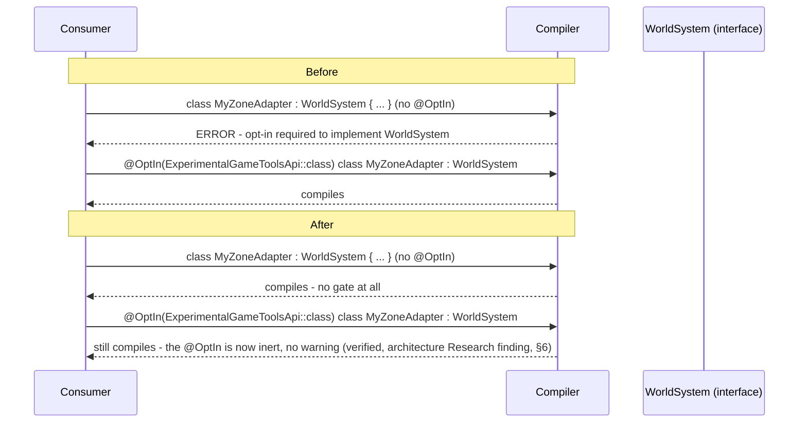

# Plan: `world-system-graduation` — promote `WorldSystem` from Experimental to `@SupportedExtension`

## Header / Association

- **Covers:** [SpartanLabsGaming/MyGameTools#79](https://github.com/SpartanLabsGaming/MyGameTools/issues/79)
  — *"World Systems Stage 4: graduate `WorldSystem` from Experimental to `@SupportedExtension`"*.
- **Architecture:** `docs/world-systems-implementation-architecture.md`, unit slug
  `world-system-graduation` (§10 decomposition table, row 4; scope defined in §4.7, §7's
  per-stage documentation table, §8 tier table, §12).
- **Branch:** `feature/79-world-system-graduation`, off `master`, opened only after `#77`
  (`zone-world-system`) and `#78` (`experience-system`) have both merged.
- **Commit:** TBD
- **PR:** TBD. This plan document is **not** part of the implementation PR: it lands earlier,
  together with the architecture and the other four unit plans, in the docs-only planning PR off
  `master` (architecture §1.2, "Other settled points"). The implementation PR references it and
  closes `#79`.
- **What this plans:** removing every `@ExperimentalGameToolsApi` / `@SubclassOptInRequired`
  marker that `#76`–`#78` will have applied to the `WorldSystem` seam, applying `@SupportedExtension`
  to `WorldSystem` alone, and the documentation/CHANGELOG/README/CONTRIBUTING updates that record
  the promotion. No new type, no new consumer, no interface change.
- **Status:** planning only. No source, test, or build file has been modified by this document.
  **`#76`, `#77`, `#78` are all still open and unimplemented as of this writing** (verified: no
  `feature/76-*`/`feature/77-*`/`feature/78-*` branch exists, no `annotation`/`WorldSystem` file
  exists anywhere in the repo — confirmed by a repo-wide grep). This plan is therefore written
  against the architecture document's **designed contract** for those three stages, not against
  landed code. §2.1 below is the mandatory gate that reconciles the two once they are real.
- **Target release:** inherited from the architecture's own open decision (§12 OD3, not
  re-litigated here): `#78`/`#79` can only ship in the first release containing `#71`
  (`refactor(gameobjects)!:`, a Major trigger per `CONTRIBUTING.md`'s versioning table), so this
  unit's commits land on `master` under `[Unreleased]` and ride whatever Major release `#71`
  lands in. This plan does not bump any version number or cut a release.
- **Dependencies:** `#76` (`world-system-core`), `#77` (`zone-world-system`), `#78`
  (`experience-system`) — all three merged. `#80` (`physics-world-system`) depends on this unit
  having landed but is out of scope here.
- **Related docs:** `docs/world-systems-implementation-architecture.md` (the binding architecture
  for all five stages); `docs/world-systems-plan-draft.md` (superseded aggregator, carries a
  "fully landed" addendum from this unit, §4.6); `docs/physics-core-seams-plan.md` (the
  `@SupportedExtension` declaration this plan reuses verbatim, §2.2/§3.1); `docs/api-openness-decisions-6.0.0.md`
  D1 (`Movement`) and D3 (`EventBus`) — D1 already uses `@SupportedExtension`, and D3 is tiered
  `Experimental (@RequiresOptIn)` for a future `6.0.0` seam, confirming `ExperimentalGameToolsApi`
  outlives this unit's own use of it and must not be touched by it.

---

## 1. Context

### 1.1 What `#76`–`#78` will have landed (the designed contract this plan graduates)

Per architecture §4.2–§4.6 and §8, by the time this branch opens the following will exist,
every one of them gated behind the shared, library-wide `@RequiresOptIn(level = ERROR)` marker:

| Declaration | File (package) | Current gate |
|---|---|---|
| `interface WorldSystem { fun installOn(world: World); fun uninstallFrom(world: World) {}; fun step(world: World) {}; val coreSlot: CoreSystemSlot? get() = null }` | `gametools-core/.../gameobjects/WorldSystem.kt` | `@SubclassOptInRequired(ExperimentalGameToolsApi::class)` |
| `sealed interface CoreSystemSlot { val order: Int }` | `gametools-core/.../gameobjects/CoreSystemSlot.kt` | `@ExperimentalGameToolsApi` |
| `enum class CoreWorldSystemSlot(override val order: Int) : CoreSystemSlot { PHYSICS(0), ZONE(1) }` | same file | `@ExperimentalGameToolsApi` |
| `World.installSystem(system: WorldSystem)` (member of `World`) | `gametools-core/.../gameobjects/World.kt` | `@ExperimentalGameToolsApi` |
| `World.uninstallSystem(system: WorldSystem)` (member) | same file | `@ExperimentalGameToolsApi` |
| `World.installedSystems: List<WorldSystem>` (member) | same file | `@ExperimentalGameToolsApi` |
| `World.stepSystems()` (member) | same file | `@ExperimentalGameToolsApi` |
| `class ZoneWorldSystem(val zoneIndex: ZoneIndex) : WorldSystem` | `gametools-world/.../world/zone/ZoneWorldSystem.kt` | `@ExperimentalGameToolsApi` |
| `class ExperienceSystem : WorldSystem` | `gametools-core/.../gameobjects/combat/ExperienceSystem.kt` | `@ExperimentalGameToolsApi` |
| a `compileTestKotlin` opt-in for `ExperimentalGameToolsApi` | `gametools-core/build.gradle.kts`, `gametools-world/build.gradle.kts` | test-source-set only |

Also already built by `#76` and **not modified by this unit** (architecture §1.2 C1):
`com.spartanlabs.gaming.annotation.ExperimentalGameToolsApi` (the marker itself) and
`com.spartanlabs.gaming.annotation.SupportedExtension` (parameterless, `@MustBeDocumented`,
`BINARY` retention — verbatim from `docs/physics-core-seams-plan.md` §2.2, already built one
stage before it originally expected to be).

### 1.2 Mandatory review checkpoint — before any edit in §3

Architecture §4.7 requires re-reading `#77`/`#78`'s **actually-merged** code and tests before
graduating, because a shape problem discovered there is a design revision to raise, not something
this unit silently absorbs (issue `#79`'s own "Out of scope" section says the same). This plan
cannot execute that checkpoint now — `#77`/`#78` do not exist yet — so it is Step 0 of the
implementation sequence (§7), to run once both branches are merged and before touching any file
in §3. Answer every question below against the real, merged code; if any answer is "yes, a shape
change is needed," **stop before editing anything in §3** and raise it as a new, separately
designed follow-up (see §9 OD1) rather than folding a fix into this graduation PR.

1. Did `ZoneWorldSystem.installOn`/`uninstallFrom` need anything beyond the per-`World`
   concurrent-install guard architecture §4.5 designed — in particular, did it need to *inspect*
   `world.installedSystems` (an install-time view of other installed systems) to detect a
   conflicting or missing peer system?
2. Did `ExperienceSystem.installOn` need anything beyond subscribing to `world.events` and
   guarding against a second instance (architecture §4.6) — specifically, did it need install-time
   visibility into other installed systems? (This is the literal example issue `#79`'s own "Out"
   section names — note it is already moot for `uninstallSystem` itself, since architecture C4
   built that into `#76` from the start; re-check only for a *new* need neither issue anticipated.)
3. Is `World.uninstallSystem`'s return type still `Unit` (idempotent, no failure mode, per
   architecture §4.4), or did either adapter's tests reveal a real caller need for it to report
   whether a system was actually present?
4. Did either adapter need a `runsBefore`/relative-ordering anchor within tier 2 — the limitation
   architecture §11 names as a known, deliberately-deferred gap (precedent: Unity's
   `UpdateBefore`, Flecs's phase branching), or does trust-the-caller install order still suffice
   for both `ZoneWorldSystem` and `ExperienceSystem`?
5. Did `coreSlot`'s "read once, at install time; must not change afterward" contract
   (architecture §4.4) hold for `ZoneWorldSystem`, or did anything need to change its claimed slot
   after installation?
6. Does `WorldSystem.step(world: World)`'s no-`dt` signature still suffice for both shipped
   adapters — confirm neither silently needed a per-frame delta the architecture's "no `dt`
   anywhere" constraint (§1.2 "Other settled points") does not provide?
7. Does a repo-wide grep for `ExperimentalGameToolsApi` restricted to `#77`/`#78`'s own diffs turn
   up any usage **outside** the ten declarations/two Gradle lines listed in §1.1 — e.g. an
   `@OptIn`/`@file:OptIn` in main source (not just test source), which would signal the interface
   itself leaked somewhere this plan does not expect?

If every answer confirms the architecture's designed shape held, proceed to §3 exactly as
written. If not, this plan's file list and KDoc deltas in §3 need the corresponding correction
before they are applied — do not apply them as-is against a materially different `#77`/`#78`.

### 1.3 Acceptance criteria for this unit

- Every declaration in §1.1's table carries no `@ExperimentalGameToolsApi`/`@SubclassOptInRequired`
  annotation; `WorldSystem` alone carries `@SupportedExtension`.
- `com.spartanlabs.gaming.annotation.ExperimentalGameToolsApi` itself is untouched — not deleted,
  not deprecated, not modified — since `docs/api-openness-decisions-6.0.0.md` D3 (`EventBus`,
  targeted for `6.0.0`) is already tiered to reuse it.
- A repo-wide search for `ExperimentalGameToolsApi` (main **and** test source, both modules, plus
  both `build.gradle.kts` files) returns exactly one hit: the marker's own declaration file. This
  is the plan's completeness check (§4, §5) — not a subjective judgment call.
- A `gametools-core` consumer can implement `WorldSystem` and call all four `World` registry
  members with zero `@OptIn` anywhere in their code. A `gametools-world` consumer can construct
  `ZoneWorldSystem`/reference `CoreWorldSystemSlot` with zero `@OptIn`.
- CHANGELOG, README, CONTRIBUTING, `docs/world-systems-plan-draft.md`'s callout, and
  `docs/world-systems-implementation-architecture.md`'s header Status line all record the
  promotion in this unit's own commits (architecture §7's per-stage table, row `#79`).

---

## 2. Design

### 2.1 The graduation is a pure annotation transform, not a shape change

Every change in §3 is one of exactly three kinds, applied to the ten items in §1.1's table:

1. **Remove** `@ExperimentalGameToolsApi` (nine declarations) or
   `@SubclassOptInRequired(ExperimentalGameToolsApi::class)` (`WorldSystem` only).
2. **Add** `@SupportedExtension` — `WorldSystem` only (architecture §4.7: "only").
3. **Remove** the two Gradle `compileTestKotlin` opt-in blocks, and every `@OptIn(ExperimentalGameToolsApi::class)`
   / `@file:OptIn(ExperimentalGameToolsApi::class)` that `#77`/`#78`'s own test files carry (they
   become either unnecessary or, if left, silently inert — see §6).

No signature changes, no new types, no new consumers. This is deliberately narrow: architecture
§4.7 assigns this unit *only* the annotation swap plus its documentation; any shape change
surfaced by §1.2's checkpoint is explicitly **not** this unit's to absorb.

### 2.2 Why `@SupportedExtension` lands on `WorldSystem` alone

`WorldSystem` is the seam a consumer actually implements — the substitution point. The slot
types, `World`'s four registry members, and the two shipped adapters are its *supporting
infrastructure and worked examples*, not separate seams a consumer picks between; they graduate
to plain, untagged Stable Core (architecture §8's tier table, confirmed unchanged by this plan).
This mirrors the two existing tier rulings in this repo's docs. In both, the interface is tagged
and its shipped default implementations are left untagged:
- `docs/issue-49-physics-architecture.md` §8: `CollisionResolver` is `@SupportedExtension`;
  `PositionalCorrectionResolver` is untagged Stable Core.
- `docs/api-openness-decisions-6.0.0.md` D1: `Movement` is `@SupportedExtension`; `Targeting`,
  `Persistent`, `Directional` and `Homing` are its worked examples.

`SupportedExtension` itself is deliberately *not* tagged with itself (`docs/physics-core-seams-plan.md`
§3.1).

### 2.3 Flow — before and after this unit, for one consumer call site



### 2.4 Completeness check — the grep sweep

Run before every commit in §7 and again before opening the PR:

```
grep -rn "ExperimentalGameToolsApi" --include="*.kt" --include="*.kts" .
```

Expected output after §3 is fully applied: **exactly one line**, the declaration in
`gametools-core/src/main/kotlin/com/spartanlabs/gaming/annotation/ExperimentalGameToolsApi.kt`.
Any other hit — a leftover annotation usage, an `@OptIn`, a `@file:OptIn`, or a Gradle
`compilerOptions.optIn.add(...)` line — means §3 is incomplete.

---

## 3. File-by-file changes

Exact line numbers are not cited because `#76`–`#78` have not landed; locate each declaration by
the signature in §1.1's table. Every change below is Component-ring (KDoc) plus a one-line
annotation swap — no executable logic changes anywhere in this section.

### 3.1 Changed: `gametools-core/.../gameobjects/WorldSystem.kt`

- Remove `@SubclassOptInRequired(ExperimentalGameToolsApi::class)`. Add `@SupportedExtension`
  (import `com.spartanlabs.gaming.annotation.SupportedExtension`; the `ExperimentalGameToolsApi`
  import is dropped along with the annotation using it, per the region-grouped import rule's
  "clean up unused imports").
- KDoc: remove the Experimental-tier paragraph (every Experimental declaration's KDoc states it
  per the binding constraint in the caller's brief — locate by the words "Experimental" / "may
  change in a minor"). Add a Supported-Extension purpose paragraph naming `ZoneWorldSystem` and
  `ExperienceSystem` as this seam's worked examples, e.g.:

  ```kotlin
  /**
   * A named, installable per-[World] behaviour: one-time [installOn] wiring, an optional
   * per-frame [step], and an optional claim on a library-reserved [coreSlot].
   *
   * **Supported Extension.** The seam a consumer implements to add per-frame or event-reactive
   * behaviour to a [World] without [World] itself knowing anything about it — a
   * likely-but-non-core need proven by two shipped consumers:
   * [com.spartanlabs.gaming.world.zone.ZoneWorldSystem] (per-tick, tier-1) and
   * [com.spartanlabs.gaming.gameobjects.combat.ExperienceSystem] (event-only, tier-2). Both
   * double as this seam's worked examples - read them before writing your own. Carries the same
   * semver guarantee as Stable Core.
   *
   * @see CoreSystemSlot for the fixed, library-reserved tier-1 ordering a system may opt into.
   */
  @SupportedExtension
  interface WorldSystem { /* members unchanged */ }
  ```

  Exact prose is the implementer's to finalize against `#76`'s actual landed KDoc; the two
  required additions are the tier statement and the two named worked examples.
- **Error handling / mutability / concurrency:** unaffected — no member signature changes.
- **Logging:** none added; this is a type declaration.
- **Stability tier after this unit:** `@SupportedExtension`.

### 3.2 Changed: `gametools-core/.../gameobjects/CoreSystemSlot.kt`

- Remove `@ExperimentalGameToolsApi` from both `CoreSystemSlot` and `CoreWorldSystemSlot`. No
  annotation replaces it — untagged Stable Core (architecture §8: "the closed set genuinely is
  the contract here," not a bespoke extension seam needing its own badge).
- KDoc: remove each declaration's Experimental-tier paragraph. No new paragraph needed.
- **Stability tier after this unit:** untagged Stable Core.

### 3.3 Changed: `gametools-core/.../gameobjects/World.kt`

- Remove `@ExperimentalGameToolsApi` from all four registry members: `installSystem`,
  `uninstallSystem`, `installedSystems`, `stepSystems`. No annotation replaces them.
- KDoc: remove each member's Experimental-tier paragraph. No new paragraph needed — `World`'s own
  class doc and the members' existing behavioural KDoc (install/uninstall/step semantics,
  architecture §4.4) are unaffected.
- **Stability tier after this unit:** untagged Stable Core, on all four members.

### 3.4 Changed: `gametools-world/.../world/zone/ZoneWorldSystem.kt`

- Remove `@ExperimentalGameToolsApi` from the class. No annotation replaces it.
- KDoc: remove the Experimental-tier paragraph; add one sentence naming it as a worked example,
  e.g. `"Doubles as [WorldSystem]'s worked example of a per-tick, tier-1 system - read this
  before writing your own tier-1 adapter."`
- **Stability tier after this unit:** untagged Stable Core.

### 3.5 Changed: `gametools-core/.../gameobjects/combat/ExperienceSystem.kt`

- Remove `@ExperimentalGameToolsApi` from the class. No annotation replaces it.
- KDoc: remove the Experimental-tier paragraph; add one sentence naming it as a worked example,
  e.g. `"Doubles as [WorldSystem]'s worked example of an event-only, tier-2 system - read this
  before writing your own reactive adapter."`
- **Stability tier after this unit:** untagged Stable Core.
- **Explicitly not touched here:** `ExperienceGrantor`/`AOEGrantor`'s own tier is architecture §12
  OD2, owned by `#78`, independent of the `WorldSystem` seam's Experimental gate — this unit does
  not add or remove any annotation on either of them.

### 3.6 Changed: `gametools-core/build.gradle.kts`, `gametools-world/build.gradle.kts`

Remove the `compileTestKotlin` opt-in block each module's `#76`/`#77` commit will have added:

```kotlin
tasks.named<org.jetbrains.kotlin.gradle.tasks.KotlinCompilationTask<*>>("compileTestKotlin") {
    compilerOptions.optIn.add("com.spartanlabs.gaming.annotation.ExperimentalGameToolsApi")
}
```

This is the change that actually proves the graduation at the build level: once removed, every
test in both modules' test source sets must still compile — a test file that still needs the
flag has a leftover `@ExperimentalGameToolsApi` usage the grep sweep (§2.4) will also catch.

### 3.7 Changed: every test file under both modules carrying a leftover opt-in

Per §2.4's sweep, remove any `@OptIn(ExperimentalGameToolsApi::class)` / `@file:OptIn(ExperimentalGameToolsApi::class)`
line in `#76`/`#77`/`#78`'s own test files (their exact paths are unknown until those branches
land). Leaving one behind is not a compile error post-graduation (§6) but is dead, misleading
code this unit's whole job is to remove.

### 3.8 New tests — see §5 (Level 2)

### 3.9 Changed: `CHANGELOG.md` — see §4

### 3.10 Changed: `README.md`, `CONTRIBUTING.md` — see §4

### 3.11 Changed: `docs/world-systems-plan-draft.md`

Append one line to the existing top-of-file callout (do not rewrite it) — architecture §7 item 8
already assigns this unit the closing note:

> **`#79` landed:** the two-tier `WorldSystem` model this callout forward-references is fully
> implemented and graduated to `@SupportedExtension` as of this commit — see
> `docs/world-systems-implementation-architecture.md`.

### 3.12 Changed: `docs/world-systems-implementation-architecture.md`

Update the header `**Status:**` line (currently "systems design — implementation plans to
follow. No source, test, or build file has been modified by this document.") to record that all
five stages have landed, e.g.:

> **Status:** implemented. `#76`–`#79` have landed; `WorldSystem` is `@SupportedExtension` as of
> `#79`. `#80` (`PhysicsWorldSystem`) remains blocked on `#49`.

---

## 4. Documentation impact (Audience-Reach rings)

- **Inner Core (in-editor):** none — no `//region`/`TODO` markers touched.
- **Component Ring (KDoc/API contracts):** the primary ring this unit touches. Every KDoc delta
  in §3.1–§3.5. `WorldSystem`'s KDoc is the one genuinely new piece of prose (the Supported-
  Extension purpose statement); the other four declarations and two adapters only lose their
  Experimental paragraph (plus the adapters gain one worked-example sentence each). Must render
  cleanly under `./gradlew dokkaGeneratePublicationHtml` — check for a dangling KDoc `[link]` to
  a since-removed Experimental-paragraph cross-reference (e.g. if `WorldSystem`'s old Experimental
  paragraph linked to `[ExperimentalGameToolsApi]` and another declaration's KDoc linked *into*
  that paragraph, removing it must not orphan the second link).
- **Boundary Ring (protocol/integration):** not touched — no wire format, no `ClientCommand`, no
  cross-service concern.
- **Architectural Outer Layer:** `docs/world-systems-plan-draft.md`'s callout addendum (§3.11) and
  `docs/world-systems-implementation-architecture.md`'s header Status line (§3.12), both in this
  unit's own commit — architecture §7 item 8 and §7's per-stage table assign both explicitly to
  `#79`.
- **CHANGELOG (Keep a Changelog, `[Unreleased]`):** exactly one of the two branches below applies
  — check which is true when this branch opens, not before.

  **Branch A — a release has already been cut containing `#76`'s `[Unreleased]` entry** (i.e.
  `#76`'s bullet now sits under a dated `## [X.Y.Z]` heading, not `[Unreleased]`). Add a new
  bullet under the current `## [Unreleased]` → `### Changed` (create the subsection if the
  current `[Unreleased]` block does not yet have one):

  ```markdown
  ### Changed
  - `WorldSystem` is no longer Experimental - promoted to `@SupportedExtension` now that
    `ZoneWorldSystem` (#77) and `ExperienceSystem` (#78) are real consumers. `CoreSystemSlot` /
    `CoreWorldSystemSlot`, `World.installSystem` / `uninstallSystem` / `installedSystems` /
    `stepSystems`, `ZoneWorldSystem`, and `ExperienceSystem` all drop their
    `@ExperimentalGameToolsApi` gate and become untagged Stable Core alongside it.
    Source-compatible widening - an existing `@OptIn(ExperimentalGameToolsApi::class)` a consumer
    already wrote keeps compiling; it is simply no longer required. (#79)
  ```

  **Branch B — `#76`'s entry is still under `[Unreleased]`** (both fall in the same unreleased
  window). Amend `#76`'s own `### Added` bullet in place: locate the bullet introducing
  `WorldSystem`/`CoreSystemSlot`/`World`'s four registry members/the `annotation` package (it will
  describe them as Experimental / gated behind `@RequiresOptIn`), strip every clause describing
  the opt-in gate or Experimental status, and fold in the graduation, e.g. (illustrative — adapt
  to `#76`'s actual wording, do not invent capability claims beyond what `#76` documented):

  ```markdown
  ### Added
  - `WorldSystem` - an installable per-`World` behaviour (`installOn`/`uninstallFrom`/`step`, an
    optional tier-1 `coreSlot`); `CoreSystemSlot`/`CoreWorldSystemSlot` (`PHYSICS`, `ZONE`) for a
    fixed, library-reserved step order; `World.installSystem`/`uninstallSystem`/`installedSystems`/
    `stepSystems` for the registry itself. `@SupportedExtension` from the moment `ZoneWorldSystem`
    (#77) and `ExperienceSystem` (#78) proved the shape - no separate Experimental phase ships in
    this release. (#76, #79)
  ```

  Either way, do **not** add both a new `### Changed` bullet and amend the `### Added` bullet —
  pick the one branch that matches the actual state of `CHANGELOG.md` when this PR opens.

- **README.md / CONTRIBUTING.md tier mentions:** `#76`/`#77`/`#78` will each have added prose
  naming `WorldSystem`/`ZoneWorldSystem`/`ExperienceSystem`/`CoreSystemSlot` to the Modules table
  and/or Features prose (architecture §7's per-stage table), and — since they ship gated — that
  prose almost certainly says something like "(Experimental, requires
  `@OptIn(ExperimentalGameToolsApi::class)`)". Grep `README.md`/`CONTRIBUTING.md` for
  "Experimental" / "RequiresOptIn" / "opt-in" restricted to those sections and delete the
  qualifying clause, leaving the rest of the sentence intact — matching how every other Stable
  Core / `@SupportedExtension` entry in those files reads today (no bespoke "graduated" badge;
  compare `docs/api-openness-decisions-6.0.0.md` D1's plain "Supported Extension" framing for
  `Movement`, with no residual Experimental language once decided).

---

## 5. Test plan (5-level hierarchy)

### Level 1 — gating

No `testing.gating` package exists in this repo (confirmed, matching `docs/physics-core-seams-plan.md`'s
own finding). In practice: `./gradlew componentTest deterministicTest` before every push, **plus**
the grep sweep (§2.4) run manually — not a checked-in artifact.

### Level 2 — component

**New:** `gametools-core/src/test/kotlin/com/spartanlabs/gaming/testing/component/gameobjects/WorldSystemGraduationTest.kt`
(package `com.spartanlabs.gaming.testing.component.gameobjects`, `kotlin.test` on the JUnit 5
platform — matching this repo's actual, verified convention, not the global standard's MockK
default; no module in this repo depends on MockK and nothing here makes an external call to
mock). **The file must contain zero `@OptIn`/`@file:OptIn` of any kind** — that absence is the
load-bearing proof of graduation, stronger than any assertion inside the test body:

- `a WorldSystem can be implemented with no opt-in annotation` — a minimal test-local class
  implementing only `installOn`; construct it, `world.installSystem(it)`, assert it appears in
  `world.installedSystems`.
- `stepSystems steps an installed tier-2 system` — a test-local `WorldSystem` with a `step` that
  increments a counter; `world.installSystem(...)`, `world.stepSystems()`, assert the counter.
- `installSystem rejects a second system claiming the same coreSlot` — two test-local systems
  both returning `CoreWorldSystemSlot.ZONE`; assert the second `installSystem` call throws
  `IllegalArgumentException`.
- `uninstallSystem is idempotent for a system that was never installed` — call it directly on a
  fresh `world`; assert no throw.
- `CoreWorldSystemSlot.ZONE.order` and `.PHYSICS.order` are directly referenceable with no opt-in`
  — a one-line assertion that is really about the reference compiling at all.

**New:** `gametools-world/src/test/kotlin/com/spartanlabs/gaming/testing/component/world/zone/ZoneWorldSystemGraduationTest.kt`
(package `com.spartanlabs.gaming.testing.component.world.zone`), same zero-opt-in constraint:

- `ZoneWorldSystem can be constructed and installed with no opt-in annotation` — construct it
  over a real `ZoneIndex` fixture (reuse `#77`'s own component-test fixture helpers once they
  exist — a minimal `Space`/`ZoneGrid`/`ZoneIndex`, not re-derived here), install it on a `World`,
  call `stepSystems()`, assert `zoneIndex`'s state reflects a refresh (whatever observable
  `#77`'s own test already asserts after a manual `refresh(world)` call).

**Changed:** every existing `#76`/`#77`/`#78` component/deterministic test file that currently
carries a `@file:OptIn(ExperimentalGameToolsApi::class)` (or relies solely on the removed Gradle
flag) — strip the annotation per §3.7; continuing to compile and pass with the Gradle flag gone
(§3.6) is the regression proof that nothing in production code still requires opt-in. Exact file
list is unknown until `#76`–`#78` land; the grep sweep (§2.4) is the completeness gate, not a
named list here.

### Level 3 — integration

Not applicable. No external interface, database, or third-party service is touched.

### Level 4a — deterministic

No new test. Any existing seeded-`World` determinism coverage from `#76`/`#77`/`#78` that
exercises `installSystem`/`stepSystems`/`uninstallSystem` keeps passing unchanged — a pure
annotation transform has no input→output behaviour of its own to newly assert.

### Level 4b — e2e

Not applicable. No full client↔server flow is implicated.

### Level 4c — non-functional

No new test. Annotations have zero runtime cost; no measurable performance effect.

### Level 5 — UAT

No `testing.uat` package exists in this repo. Not invented here. A documentary annotation swap
produces no observable behaviour for a human or AI evaluator to assess — there is nothing to
"feel," matching `docs/physics-core-seams-plan.md`'s own finding for its analogous unit.

### What genuinely cannot be tested automatically

- **`@SupportedExtension`'s presence on `WorldSystem`.** `BINARY` retention is deliberately
  invisible to runtime reflection (`AnnotationRetention.BINARY` sits below `RUNTIME`) — a test
  asserting `WorldSystem::class.annotations` or `WorldSystem::class.java.isAnnotationPresent(...)`
  would either fail to compile against a Kotlin-reflection-only annotation or, if it did compile,
  assert `false` regardless of whether the annotation is actually there, making it worse than no
  test at all. The load-bearing proof is the compile-time absence of the opt-in gate (Level 2
  above) plus code review / the grep sweep confirming the annotation's textual presence in source
  — not a runtime check.
- **That a real downstream consumer's already-published `@OptIn(ExperimentalGameToolsApi::class)`
  stays inert with no compiler warning post-graduation.** This is a compiler-behavior fact the
  architecture document states was independently verified against the Kotlin 2.2.0 compiler by
  the research agent (architecture §4.7, §9's "never deleted" reasoning); nothing in this repo's
  own test tree has a downstream consumer artifact to exercise this against. Rests on the
  architecture's own verification, not re-verified here.
- **`./gradlew dokkaGeneratePublicationHtml` succeeding with no broken KDoc link** — a build-level
  check (per `CONTRIBUTING.md`'s own note that this task "also catches broken KDoc links"), not a
  JUnit test; run manually as part of Level 1.
- **That `#77`/`#78` did not need a shape this plan does not anticipate** (§1.2's checkpoint) —
  answered by human/code review against the real merged diff, not by any automated test.

---

## 6. Risks & edge cases

- **A leftover marker on one declaration, not another.** If the implementer removes
  `@ExperimentalGameToolsApi` from, say, `World`'s four members but misses `CoreWorldSystemSlot`,
  the result is an inconsistent surface: a `@SupportedExtension` `WorldSystem` whose `coreSlot`
  property type (`CoreSystemSlot?`) still requires opt-in to *reference* — a consumer can
  implement `WorldSystem` with no gate, but referencing `CoreWorldSystemSlot.ZONE` from their own
  `coreSlot` override still fails to compile. Caught by the grep sweep (§2.4): a nonzero
  remaining-hit count after §3 is applied means exactly this.
- **An inert `@OptIn` in a consumer's own code, post-graduation.** Documented as expected
  behaviour, not a defect: a consumer who wrote `@OptIn(ExperimentalGameToolsApi::class)` against
  the pre-`#79` gated API keeps compiling with no warning at all (architecture's compiler-verified
  finding, §4.7/§9) — Kotlin does not flag an unnecessary opt-in annotation. This is a one-way,
  silently-safe direction (removing the annotation is optional for them), stated in the CHANGELOG
  bullet (§4) so a downstream consumer reading it understands they need not do anything.
- **Breaking changes:** none. Every change in §3 either removes a compiler gate (strictly
  widening — anything that compiled before still compiles) or adds a purely documentary,
  `BINARY`-retention annotation with zero compile or runtime effect. No signature changes.
- **Wire/schema compatibility:** unaffected — no serialized type, no protocol message, no
  `ClientCommand` is touched.
- **Concurrency:** unaffected — `World` remains single-threaded by convention; nothing in this
  unit changes any runtime code path.
- **Performance:** unaffected — annotations carry zero runtime cost.
- **Cross-repo impact:** none identified. Per standing "no downstream consumer issues" guidance,
  `MyGameServer`/`GameGraphics` are not filed against; neither currently references `WorldSystem`
  (it does not exist in any released version yet).
- **`ExperimentalGameToolsApi` must not be touched.** `docs/api-openness-decisions-6.0.0.md` D3
  already commits a future `6.0.0` unit (`EventBus` interface extraction) to reusing this exact
  marker. Deleting, deprecating, or renaming it here — even though `#79` happens to be the moment
  every *current* use of it disappears — would break that future unit before it is even planned.
  This plan's §3 list has no line item that touches the marker's own file; that omission is
  deliberate, not an oversight.
- **Scope creep at the review checkpoint (§1.2).** If `#77`/`#78` land with an ad hoc shape
  addition neither issue nor the architecture anticipated (e.g. a `runsBefore` parameter added
  informally to unblock a test), this unit's job is to notice and flag it (§9 OD1), not to either
  silently graduate a larger surface than architecture intended or silently strip the addition.

---

## 7. Version control

- **Branch:** `feature/79-world-system-graduation` (`CONTRIBUTING.md`'s `feature/<issue#>-<slug>`
  convention, per architecture §10's assigned slug), opened only after `#77` and `#78` merge to
  `master` — **Step 0 is §1.2's review checkpoint, run before the first commit below.**
- **Commit type: `feat`, not `refactor`.** `CONTRIBUTING.md`'s versioning table treats `refactor`
  (no `!`) as "no product change... rides the next release," reserved for internal-only changes
  with no consumer-visible effect. This unit is consumer-visible: a `gametools-core`/`gametools-world`
  consumer who could not previously implement `WorldSystem` or call its registry members without
  `@OptIn` now can, with zero code change on their end required. That is new, directly usable
  capability delivered without changing any signature — a `feat`, matching how `#76`/`#77`/`#78`
  themselves are each planned as `feat:` commits. Not `feat!:` — nothing here is a breaking
  change (§6).
- **This unit's commits carry no unrelated changes.** Branch fresh off `master` after `#77`/`#78`
  merge; do not carry forward any other in-flight working-tree state.
- **Commit sequence** (each a coherent, independently-reviewable unit):
  1. `feat(gameobjects): promote WorldSystem to @SupportedExtension` — the annotation swap and
     KDoc rewrite on `WorldSystem.kt` (§3.1). This plan document is not in this commit: it
     already landed in the docs-only planning PR. Body: cites `#79`, `#76`,
     `docs/world-system-graduation-plan.md`, and the review checkpoint's outcome
     (confirm-and-proceed, or a link to whatever follow-up it raised).
  2. `feat(gameobjects): drop ExperimentalGameToolsApi from CoreSystemSlot, World's registry, and the shipped adapters` —
     `CoreSystemSlot.kt`, `World.kt`, `ZoneWorldSystem.kt`, `ExperienceSystem.kt` (§3.2–§3.5).
     Body: cites `#76`, `#77`, `#78`.
  3. `build: remove ExperimentalGameToolsApi test opt-in` — both `build.gradle.kts` files (§3.6)
     and any leftover `@OptIn`/`@file:OptIn` in test sources (§3.7). Body: notes the grep sweep
     (§2.4) as the completeness proof.
  4. `test(gameobjects): prove WorldSystem graduation requires no opt-in` — the two new
     component tests (§5) and any test-file edits from step 3 that were deferred here instead.
  5. `docs: mark WorldSystem graduation landed` — `CHANGELOG.md`, `README.md`, `CONTRIBUTING.md`,
     `docs/world-systems-plan-draft.md`'s callout, `docs/world-systems-implementation-architecture.md`'s
     header Status line (§4).
- **PR title** (becomes the merge-commit subject): `feat(gameobjects): promote WorldSystem to @SupportedExtension`.
  Body: `Closes #79`, `Refs #76, #77, #78`. No `BREAKING CHANGE:` footer.
- Trailer reminder: attribute per the repo's existing commit convention.

---

## 8. Interfaces with sibling units

**Consumes from `world-system-core` (`#76`):**
- `com.spartanlabs.gaming.annotation.ExperimentalGameToolsApi` — the marker every current
  usage this unit removes; the class itself is read-only to this unit, never modified.
- `com.spartanlabs.gaming.annotation.SupportedExtension` — parameterless, `@MustBeDocumented`,
  `BINARY`-retention; this unit is the **first place it is applied** in the `WorldSystem` seam
  (built by `#76`, applied by `#79` — architecture §1.2 C1).
- `interface WorldSystem { fun installOn(world: World); fun uninstallFrom(world: World) {}; fun step(world: World) {}; val coreSlot: CoreSystemSlot? get() = null }`
  — currently `@SubclassOptInRequired(ExperimentalGameToolsApi::class)`; this unit's target.
- `sealed interface CoreSystemSlot { val order: Int }`, `enum class CoreWorldSystemSlot(override val order: Int) : CoreSystemSlot { PHYSICS(0), ZONE(1) }`
  — currently `@ExperimentalGameToolsApi`.
- `fun World.installSystem(system: WorldSystem): Unit` (throws `IllegalArgumentException` on a
  duplicate instance or an occupied `coreSlot`), `fun World.uninstallSystem(system: WorldSystem): Unit`
  (idempotent no-op if absent), `val World.installedSystems: List<WorldSystem>` (fresh copy per
  access), `fun World.stepSystems(): Unit` — all four currently `@ExperimentalGameToolsApi`.
- `gametools-core/build.gradle.kts`'s `compileTestKotlin` opt-in block — this unit removes it.

**Consumes from `zone-world-system` (`#77`):**
- `class ZoneWorldSystem(val zoneIndex: ZoneIndex) : WorldSystem { override val coreSlot = CoreWorldSystemSlot.ZONE; override fun step(world: World) = zoneIndex.refresh(world); override fun installOn(world: World) { /* guard */ }; override fun uninstallFrom(world: World) { /* release guard */ } }`
  — currently `@ExperimentalGameToolsApi`; this unit's target, and `WorldSystem`'s first named
  worked example (§3.1).
- `gametools-world/build.gradle.kts`'s `compileTestKotlin` opt-in block — this unit removes it.
- **Expects from `#77`:** its own merged component test fixtures (a minimal `Space`/`ZoneGrid`/
  `ZoneIndex`) reusable by this unit's new `ZoneWorldSystemGraduationTest` (§5) rather than
  re-derived from scratch.

**Consumes from `experience-system` (`#78`):**
- `class ExperienceSystem : WorldSystem { override fun installOn(world: World) { /* subscribe + guard */ }; override fun uninstallFrom(world: World) { /* cancel subscription */ } }`
  (tier 2 — no `step` override, no `coreSlot` override) — currently `@ExperimentalGameToolsApi`;
  this unit's target, and `WorldSystem`'s second named worked example (§3.5).
- **Explicitly not consumed/changed:** `ExperienceGrantor`/`AOEGrantor`'s own stability tier
  (architecture §12 OD2) — that is `#78`'s decision, independent of the `WorldSystem` seam this
  unit graduates. This unit adds and removes no annotation on either type.

**Provides to `physics-world-system` (`#80`):** a fully Stable Core `WorldSystem`/`CoreSystemSlot`/
`World` registry with zero remaining Experimental gate, so `PhysicsWorldSystem` (landing after
this unit, per architecture §4.8) needs **no** `@ExperimentalGameToolsApi` propagation at all —
it is Stable Core from birth. If `#80` somehow lands before this unit (architecture §4.8's
contingency), it would carry the propagating marker like the other two adapters and this unit
would need to strip a third adapter — not expected, per the decomposition's landing order (§10),
but noted since it changes this unit's own file list if it happens.

---

## 9. Open decisions

1. **OD1 (new) — how to handle a shape gap the §1.2 review checkpoint finds.** Not anticipated by
   the architecture as a concrete scenario, only as a procedural rule ("stop and raise it"). This
   plan's own recommendation, made explicit since the architecture leaves the *mechanics* of
   "raise it" unstated: if §1.2 surfaces a real gap (e.g. `runsBefore` genuinely needed, or an
   install-time view of other systems genuinely needed), **do not fix it inside this PR** —
   pause `#79`, file the gap as its own issue (or a `docs/` addendum to the architecture) with a
   proposed shape, get it designed and reviewed on its own, then resume graduation once the fix
   has landed as `#76`/`#77`/`#78` follow-up work or is deliberately deferred with the gap
   documented as a known limitation. Rationale: graduating to `@SupportedExtension` while
   simultaneously changing the shape being graduated conflates two decisions that each deserve
   their own review, and issue `#79`'s own "Out" section already says a shape change is explicitly
   not this issue's to silently absorb.
2. **Inherited, not re-litigated — release targeting (architecture §12 OD3).** Whether `#76`/`#77`
   ship in their own Feature release ahead of `#71`, or everything rides `#71`'s eventual Major,
   is unchanged by this plan and stays the architecture's own open decision. This unit's commits
   land under `[Unreleased]` regardless of which branch of §4's CHANGELOG conditional applies.

---

## 10. Sequencing & follow-ups

- Lands fourth of five, strictly after `#77` and `#78` merge (architecture §10). `#80`
  (`physics-world-system`) is blocked on both this unit and `#49`'s own re-implementation, and is
  out of scope here.
- **Follow-up owed elsewhere, not here:** the physics-wide README prose and roadmap Open
  Decision C correction remain `#49`'s re-plan to carry (architecture §7's scope note). This
  unit's README/CONTRIBUTING edits (§4) touch only the `WorldSystem` seam's own tier language,
  nothing physics-specific. `docs/api-openness-decisions-6.0.0.md` needs nothing further either:
  the planning PR already added its note that `@SupportedExtension`/`@ExperimentalGameToolsApi`
  are created by `#76`.
- **Follow-up owed elsewhere, not here:** architecture §12 OD4 (filing the two XP-crediting
  defects) is `#78`'s to decide, not `#79`'s — this unit does not gate on it and does not raise it
  again.
- If §1.2's checkpoint raises a gap (§9 OD1), that follow-up's own plan is written separately,
  by whoever picks it up, once its shape is settled — not folded into a revision of this document.
