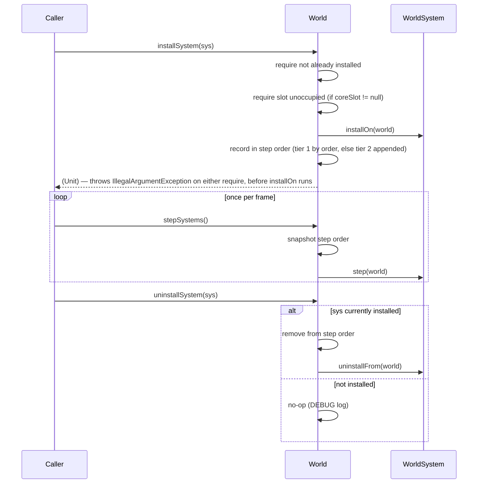
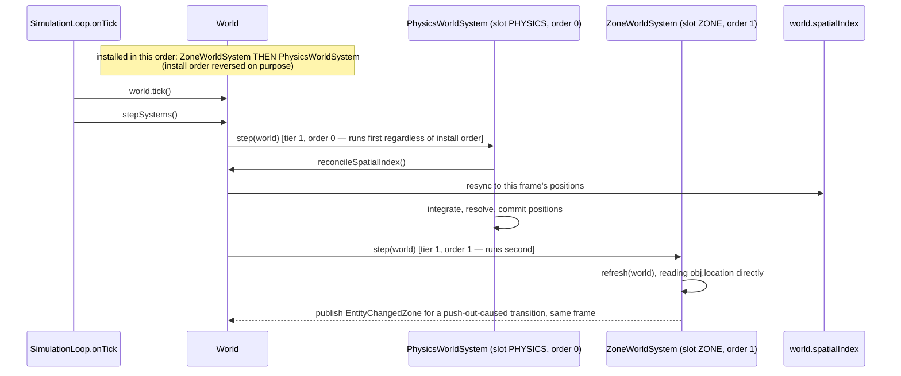
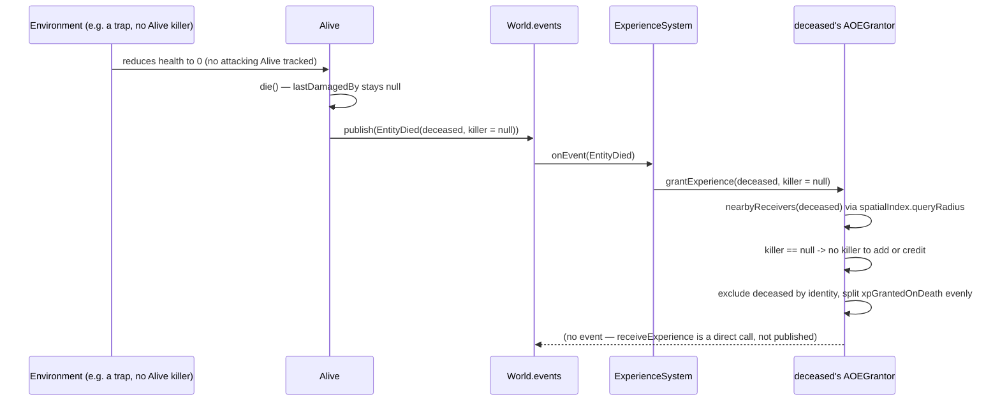

# Architecture: World Systems Implementation — `WorldSystem`, `ZoneIndex`/`ExperienceSystem` adapters, graduation, physics adapter

## Header / Association

- **Covers:** [SpartanLabsGaming/MyGameTools#76](https://github.com/SpartanLabsGaming/MyGameTools/issues/76)
  (`WorldSystem` core mechanism), [#77](https://github.com/SpartanLabsGaming/MyGameTools/issues/77)
  (`ZoneIndex` wrapped as a `WorldSystem`), [#78](https://github.com/SpartanLabsGaming/MyGameTools/issues/78)
  (`ExperienceSystem`, the Combat Package deliverable), [#79](https://github.com/SpartanLabsGaming/MyGameTools/issues/79)
  (graduate `WorldSystem` to `@SupportedExtension`), [#80](https://github.com/SpartanLabsGaming/MyGameTools/issues/80)
  (physics `WorldSystem` adapter, blocked on [#49](https://github.com/SpartanLabsGaming/MyGameTools/issues/49)).
  Also touches [#71](https://github.com/SpartanLabsGaming/MyGameTools/issues/71) (Combat Package —
  branch `feature/71-combat-package`, not designed here; #78 modifies what #71 lands).
- **What this designs:** the systems-level shape of the five-stage rollout that replaces the
  superseded, closed `WorldSystems(world, zoneIndex?, physicsSystem?)` aggregator
  (`docs/world-systems-plan-draft.md`) with an open, opt-in registry on `World` — `WorldSystem`,
  a two-tier install-order model, and the three concrete adapters (`ZoneWorldSystem`,
  `ExperienceSystem`, `PhysicsWorldSystem`) that occupy it.
- **Status:** systems design — implementation plans to follow. No source, test, or build file has
  been modified by this document.
- **Baseline commit:** `feature/71-combat-package` @ `dcb396e` (`master` @ `f727608`) plus the
  uncommitted working-tree changes listed in §3. `dcb396e` does not compile
  gametools-core (its own commit body says so); every fact below is cited against the actual
  working tree, with the compile state noted where it matters.
- **Related docs:** `docs/world-systems-plan-draft.md` (superseded aggregator, kept as historical
  record); `docs/issue-49-physics-architecture.md` (physics's own design, units 1–6, decomposition
  §10); `docs/physics-core-seams-plan.md` (unit 1, plan for the `@SupportedExtension`/
  `reconcileSpatialIndex` half of #49, now split — see §7); `docs/physics-system-plan.md`
  (`PhysicsSystem`'s last-planned shape); `docs/phase-1-map-and-space-plan.md` (original
  `world.system`/`world.geometry` sketches); `docs/api-openness-decisions-6.0.0.md` (D3 `EventBus`,
  D4 `World` — both bear on this design); `docs/framework-vision-and-roadmap.md` (Phase 2 item 5,
  Open Decision E); `docs/issue-47-zones-plan.md` (`ZoneIndex`, deferred `WorldSystems` to #49).

---

## 1. Requirements

### 1.1 The settled ask

Give a `World` a general, opt-in way to host add-on per-frame/event-driven behaviour —
starting with zone-membership refresh, combat-death XP granting, and (once #49 is
re-implemented) physics — without hardcoding any one of them into `World`, and without baking a
fixed cardinality of "systems" into a type signature the way the superseded `WorldSystems` class
did. Land it as five ordered stages so each is independently plannable and reviewable:

1. **#76** — the `WorldSystem` mechanism itself: the interface, the two-tier ordering model, the
   `World` registry (`installSystem`/`uninstallSystem`/`installedSystems`/`stepSystems`), and the
   annotation package that gates it Experimental.
2. **#77** — wrap the existing `ZoneIndex` in a `WorldSystem` adapter.
3. **#78** — `ExperienceSystem`, a `WorldSystem` that reacts to death and grants XP — the Combat
   Package (#71) deliverable, reshaping `ExperienceGrantor`/`AOEGrantor`'s contract along the way.
4. **#79** — graduate `WorldSystem` from Experimental to `@SupportedExtension`.
5. **#80** — a thin `PhysicsWorldSystem` adapter over #49's `PhysicsSystem`, once #49 is
   re-implemented. This document designs only the adapter and its regression test, not physics
   itself.

### 1.2 Binding constraints (the user's interview answers — not re-litigated)

- **C1 (#76 annotations).** Both annotations live in a new `com.spartanlabs.gaming.annotation`
  package in `gametools-core`: an Experimental `@RequiresOptIn` marker, and `@SupportedExtension`
  copied verbatim from `docs/physics-core-seams-plan.md` §2.2/§3.1 — parameterless,
  `@MustBeDocumented`, `BINARY` retention, targeting `CLASS`/`FUNCTION`/`PROPERTY`/
  `CONSTRUCTOR`/`TYPEALIAS`. #79 only *applies* `@SupportedExtension`; it does not redesign it.
  Stages 1–4 have **no** dependency on #49. Physics-core-seams (#49 unit 1) keeps only its other
  half — widening `World.reconcileSpatialIndex()` to public — since `@SupportedExtension` itself
  is now built here, one stage earlier than #49 originally planned.
- **C2 (#78 XP contract).** `ExperienceSystem` calls the dead entity's grantor on *every* death,
  passing the dead entity and a nullable killer; the grantor owns the credit policy. `AOEGrantor`
  shares XP among nearby receivers even when the killer is null or not a receiver (fixes the
  ranged/tower/environment-kill gap). No back-reference — `class Hero(...) : Alive(...),
  ExperienceGrantor by AOEGrantor()` must compile; today's `by AOEGrantor(this)` does not (Kotlin
  forbids `this` in a delegation clause — verified against the 2.2.0 compiler by the research
  agent). `ExperienceGrantor`/`AOEGrantor` are unreleased, so their signatures may change freely.
  Also fix `DefaultExperienceReceiver`'s stale KDoc (still mentions the removed `myLoc`).
- **C3 (documentation corrections).** Superseded-pointers, in the style of the callout at the top
  of `docs/world-systems-plan-draft.md`, are owed to five stale docs plus two roadmap notes — see
  §7. **Framing (binding):** the superseded closed `WorldSystems(world, zoneIndex?, physicsSystem?)`
  aggregator was *not* wrong because it was closed. `ZoneIndex` and `PhysicsSystem` were always
  fine as extensible pieces on their own. Specifically, the aggregator's fixed two-slot
  cardinality baked "today there are only two cases" into a type signature — exactly what the
  open-by-default rule warns against. This document does not render a blanket "closed = bad"
  verdict anywhere below.
- **C4 (teardown and introspection, #76).** `world.uninstallSystem(system)` for symmetric teardown
  (precedent: `EventBus.subscribe` returning a cancellable `Subscription`,
  `gametools-core/src/main/kotlin/com/spartanlabs/gaming/event/EventBus.kt:39-42`); a read-only
  `world.installedSystems: List<WorldSystem>`.
- **C5 (two-tier ordering via hard slots, #76).** Modelled on `Capability`/`CoreCapability`
  (`gametools-core/src/main/kotlin/com/spartanlabs/gaming/gameobjects/combat/Capability.kt:18-34`):

  ```kotlin
  interface CoreSystemSlot { val order: Int }
  enum class CoreWorldSystemSlot(override val order: Int) : CoreSystemSlot {
      PHYSICS(0), // reserved; #80
      ZONE(1),    // #77
  }
  interface WorldSystem {
      fun installOn(world: World)
      fun step(world: World) {}
      val coreSlot: CoreSystemSlot? get() = null
  }
  ```

  Tier 1 (`coreSlot` non-null) is a fixed bucket sorted by `order`; a second system claiming an
  occupied slot is a caller error. Tier 2 (`coreSlot == null`, the default) is trust-the-caller
  install order, always stepped after every tier-1 system. `CoreSystemSlot`/`CoreWorldSystemSlot`
  live in `gametools-core` beside `WorldSystem`, even though the adapters that use `ZONE`/
  `PHYSICS` live in `gametools-world`. Only library-defined slots exist — enums cannot be extended
  by outside code.
- **Other settled points:** `world.installSystem(system)` calls `installOn` then records the
  system; `world.stepSystems()` is called by a driver once per frame (e.g.
  `SimulationLoop(world, onTick = { world.stepSystems() })`) — `World.tick()` never calls it;
  `WorldSystem` ships Experimental and graduates at #79; branching is #76/#77 fresh off `master`,
  #78 after both #71 and #76 merge, #79 after #77 and #78, #80 after #49 (and #76); none of #71's
  changes ride in these stages' commits; #71's own PR closes #71, #78's PR closes #78 and refs
  #71; this planning pass lands via a docs-only PR off `master`, as #73 did for the physics plans,
  and that PR also carries `docs/world-systems-plan-draft.md`'s rename/callout; release targeting
  is an open decision (§12 OD3), not settled here.

### 1.3 Acceptance shape

A `gametools-core` consumer can install any number of `WorldSystem`s on a `World` — some claiming
a library-reserved core slot with a guaranteed relative order, most not — call `stepSystems()`
once per frame from any driver, and uninstall a system symmetrically, with zero behavioural
change for a `World` that installs nothing. A `gametools-world` consumer gets `ZoneWorldSystem`
and (once #49 lands) `PhysicsWorldSystem` as drop-in adapters over the pieces that already exist.
A `gametools-core` consumer building combat gets `ExperienceSystem` reacting to every death with
correct multi-recipient, killer-may-be-null AOE crediting. All of this ships Experimental through
#78, graduates to `@SupportedExtension` at #79, and #80's physics adapter lands already Stable
(post-graduation), with a regression test proving physics-before-zone ordering holds regardless
of install order.

---

## 2. Research findings applied

Only the conclusions that actually shaped a decision below; the rest of the research synthesis is
not re-summarised.

1. **Kotlin forbids `this` in a delegation clause, so `by AOEGrantor(this)` cannot compile once a
   `Hero` needs both `Alive` and `by AOEGrantor(...)`.** This is why C2's reshape removes
   `AOEGrantor`'s `self: Alive` constructor parameter entirely and instead passes the dead entity
   into `grantExperience(deceased, killer)` per call — the grantor becomes stateless with respect
   to *which* entity died. Verified against the 2.2.0 compiler by the research agent; independently
   confirmed here by reading the current `AOEGrantor(val self: Alive)` constructor
   (`gametools-core/src/main/kotlin/com/spartanlabs/gaming/gameobjects/combat/ExperienceGrantor.kt:30`)
   — exactly the shape that would fail the moment a consumer tried `by AOEGrantor(this)`.
2. **`SubclassOptInRequired` (stable since Kotlin 2.1) gives implementors of an Experimental
   interface a clearer diagnostic than plain `@RequiresOptIn` on the interface would**
   ("requires opt-in to be implemented" vs. a generic opt-in error), with a real precedent in
   kotlinx's `SharedFlow`. This drove marking `WorldSystem` itself with
   `@SubclassOptInRequired(ExperimentalGameToolsApi::class)` rather than plain
   `@ExperimentalGameToolsApi`, while the plain marker still goes on the slot types, the `World`
   members, and the shipped adapters (§8). Source:
   https://kotlinlang.org/docs/whatsnew21.html,
   https://github.com/Kotlin/KEEP/blob/master/proposals/subclass-opt-in-required.md.
3. **Sealed direct subtypes must share module and package.** Verified by an independent
   compiler probe: another module cannot declare a new `CoreSystemSlot` subtype
   ("extending sealed classes or interfaces from a different module is prohibited"), while a
   `gametools-world` class *can* return an existing `CoreWorldSystemSlot` value from a
   `CoreSystemSlot?`-typed property. This is why `CoreSystemSlot` is designed as `sealed
   interface` rather than the plain `interface` in the relayed sketch (§4.3, flagged) — a plain
   `interface` would let a downstream consumer declare a *competing* built-in-looking slot type,
   defeating the "only library-defined slots exist" intent C5 states outright.
4. **Every surveyed ECS/engine framework pairs a system's install/create hook with an explicit
   teardown hook** — Ashley's `addedToEngine`/`removedFromEngine`, Unity DOTS's
   `OnCreate`/`OnDestroy`, Artemis's `initialize`/`dispose`, Fleks's `onInit`/`onDispose`. This
   confirms C4's `uninstallSystem` needs a matching instance-side hook, not just a registry-list
   removal — added here as `WorldSystem.uninstallFrom(world)` (flagged as an addition to the
   relayed sketch, §4.2), the only way `ExperienceSystem` (§4.6) can cancel its own
   `EventBus.Subscription` on teardown. Sources:
   https://github.com/libgdx/ashley/blob/master/ashley/src/com/badlogic/ashley/core/EntitySystem.java,
   https://github.com/needle-mirror/com.unity.entities/blob/master/Documentation~/systems-update-order.md,
   https://github.com/Quillraven/Fleks/releases.
5. **Kotlin 2.2's default `-jvm-default=enable` emits real JVM default methods**, so adding
   `uninstallFrom` as a new default-bodied interface member is source- and binary-compatible with
   no build change — verified by the research agent by inspecting the compiled bytecode. This is
   why `uninstallFrom` can be added to `WorldSystem` now, in #76, without threatening #79's later
   graduation. Source: https://kotlinlang.org/docs/whatsnew22.html.

---

## 3. Current state (verified)

- **`World`** (`gametools-core/src/main/kotlin/com/spartanlabs/gaming/gameobjects/World.kt`) is a
  `final class` (D4, `docs/api-openness-decisions-6.0.0.md:132-150`, ruled closed — "the fragile
  base-class case in its purest form"). Its class doc (`World.kt:20-47`) documents `tick()`'s
  five-step order and a determinism contract: "Given the same [seed] and the same sequence of
  external calls, two worlds produce the same result" (`World.kt:41-43`). `tick()`
  (`World.kt:218-245`) reconciles the spatial index (step 2, `World.kt:220`, `internal fun
  reconcileSpatialIndex()` at `World.kt:258-270`, still `internal` — unit 1's widening has **not**
  landed), reindexes entities (step 3), ticks every `GameObject` over a fresh `gameObjects.toList()`
  snapshot (step 4, `World.kt:223-225`), then drains `removeList` (step 5). `World` has no
  reference to any add-on system today. Three historical commits state the deliberate rule this
  design must not break: `0d586b5` ("SimulationLoop imports World, never the reverse... nothing in
  World / GameObject / GameServer references it — World.tick() stays the primitive"), `a0f1717`
  ("ZoneIndex is an external consumer of World... World/core are unchanged"), and `34db6bc`
  (`World.space` added as a generic, inert port, not a reference to any specific consumer).
- **`EventBus`** (`gametools-core/src/main/kotlin/com/spartanlabs/gaming/event/EventBus.kt`) is
  the direct precedent for symmetric subscribe/cancel: `subscribe` returns a `fun interface
  Subscription { fun cancel() }` documented "Idempotent" (`EventBus.kt:39-41`), and `publish`
  (`EventBus.kt:73-89`) catches and logs a throwing listener (`runCatching { ... }.onFailure { ...
  log.warn(...) }`, `EventBus.kt:82-83`) rather than letting it abort delivery — the reason a
  throwing `ExperienceGrantor` cannot break `stepSystems()`/`tick()` (§5.3, §11).
- **`SimulationLoop`** (`gametools-core/src/main/kotlin/com/spartanlabs/gaming/simulation/SimulationLoop.kt`)
  threads no `dt`: `advance()` (`SimulationLoop.kt:112-127`) calls `world.tick()` then
  `onTick(world.tickCount)` once per whole tick (`SimulationLoop.kt:118-119`) — an `onTick` closure
  is exactly where a driver calls `world.stepSystems()`, mirroring how `docs/world-systems-plan-draft.md`'s
  superseded design was meant to be driven.
- **`ZoneIndex`** (`gametools-world/src/main/kotlin/com/spartanlabs/gaming/world/zone/ZoneIndex.kt`)
  is a plain, concrete class with one entry point, `refresh(world: World)` (`ZoneIndex.kt:38-62`),
  that iterates `world.gameObjects` and reads `obj.location` directly — it never references
  `world.spatialIndex` anywhere in the file (confirmed: zero occurrences of `spatialIndex` in
  `ZoneIndex.kt`), so wrapping it needs no reconcile call of its own.
- **`Alive.die()`** (`gametools-core/src/main/kotlin/com/spartanlabs/gaming/gameobjects/combat/Alive.kt:381-400`)
  applies `deathResponse` before publishing: a `RESPAWN` actor is moved to `respawn` and healed to
  full (`Alive.kt:392-393`) *before* `world?.events?.publish(GameEvent.EntityDied(this,
  lastDamagedBy))` fires (`Alive.kt:399`) — so any AOE grantor keyed off `deceased.location` at
  the moment `ExperienceSystem` reacts measures from the respawn point, not the death point
  (documented limitation (a), §4.6). `Alive.faction` defaults to `"neutral"` for every instance
  (`Alive.kt:95`, `DEFAULT_FACTION` at `Alive.kt:478`) — there is no built-in per-faction split.
  `AttackIntent` (`Alive.kt:493-514`) is the existing precedent for a per-object, self-cancelling
  `EventBus.Subscription` (`Alive.kt:496-513`) — the same shape `ExperienceSystem` uses at the
  `World` level instead of the object level.
- **`Projectile.dealDamageTo`** (`gametools-core/src/main/kotlin/com/spartanlabs/gaming/gameobjects/Projectile.kt:33-39`)
  writes `target.health.current -= damage` directly (`Projectile.kt:34`), bypassing
  `Alive`'s private `takeDamage`/`lastDamagedBy` bookkeeping entirely — a projectile kill reports a
  `null` or stale killer to `GameEvent.EntityDied` (documented limitation (b), §4.6).
- **`ExperienceGrantor`/`ExperienceReceiver` on `master` vs. this branch.** `master` has no
  `gameobjects.combat` package and no `ExperienceGrantor` at all (verified: `git show
  master:gametools-core/.../gameobjects/ExperienceGrantor.kt` — path does not exist on `master`);
  `master`'s `ExperienceReceiver.kt` lives at `gameobjects/ExperienceReceiver.kt` (not `combat`),
  is a plain interface plus a `class DefaultExperienceReceiver` with no stale KDoc. On this branch,
  `dcb396e` moved both into `gameobjects.combat` and introduced `ExperienceGrantor`/`AOEGrantor`
  for the first time — `AOEGrantor(val self: Alive)` (working tree,
  `.../combat/ExperienceGrantor.kt:30`) is exactly the shape C2/finding 1 says cannot compose with
  delegation. The working tree's `ExperienceReceiver.kt` still has the pre-move
  `DefaultExperienceReceiver` KDoc claiming "Requires the using class to implement `myLoc`"
  (`.../combat/ExperienceReceiver.kt:33-35`) — `myLoc` does not exist anywhere in the current file,
  and three imports (`GameEvent`, `log`, `Point`, `.../combat/ExperienceReceiver.kt:3-5`) are
  unused. Both are C2's named cleanup, owned by #78.
- **The annotation package does not exist.** No `com.spartanlabs.gaming.annotation` package and no
  `@RequiresOptIn`/`@SupportedExtension`-shaped type exists anywhere in the repo today (confirmed:
  `gametools-core/src/main/kotlin/com/spartanlabs/gaming` has only `event`, `gameobjects`,
  `simulation`, `spatial`). `com.spartanlabs.gaming.annotation.SupportedExtension`'s exact,
  parameterless shape was already settled by `docs/physics-core-seams-plan.md` §2.2/§10 item 1,
  resolving a discrepancy against `docs/issue-49-physics-architecture.md` §4.2's own `note:
  String = ""`-carrying sketch in favour of **no parameters** — this design reuses that resolved,
  parameterless shape (C1) rather than the architecture doc's superseded one.
- **`World.reconcileSpatialIndex()` visibility.** Still `internal fun` on this branch
  (`World.kt:258`), unchanged from `master`. #49's re-planned unit 1 (`physics-core-seams`, now
  narrowed per C1) still owns widening it to `public` — this design's stages 1–4 do not touch it
  and do not depend on it.
- **`SpatialIndex.queryRadius(Point, Double)`** exists only as an uncommitted working-tree addition
  (`gametools-core/src/main/kotlin/com/spartanlabs/gaming/spatial/SpatialIndex.kt:76`, a default
  method delegating to the four-`Double` overload) — not yet on `master` or in `dcb396e`. `AOEGrantor`'s
  reshape (§4.6) depends on this overload existing; it is #71/#78's to carry forward, not this
  design's to introduce.
- **Precedent for `require`-based duplicate-registration rejection:** `TiledMap.addSpawnPoint`
  (`gametools-world/src/main/kotlin/com/spartanlabs/gaming/world/map/TiledMap.kt:113-116`,
  `require(spawn.name !in spawnPointsByName) { ... }`) and `ZoneGrid`'s constructor
  (`gametools-world/src/main/kotlin/com/spartanlabs/gaming/world/zone/ZoneGrid.kt:36`,
  `require(columns > 0 && rows > 0) { ... }`) — both throw `IllegalArgumentException` for a
  caller-wiring error rather than returning `Result`. `World`'s registry (§4.4) follows the same
  convention.
- **Module/version facts.** `gametools-core/build.gradle.kts:6` and
  `gametools-world/build.gradle.kts:14` both still read `"5.1.0"`; `gametools-world/build.gradle.kts:9`
  depends on core via `api(project(":gametools-core"))` — the dependency edge runs one way, so
  `WorldSystem`'s built-in slot types being defined in `core` (C5) is the only placement that lets
  a `gametools-world` adapter (`ZoneWorldSystem`, `PhysicsWorldSystem`) reference them.
  `CONTRIBUTING.md:139-144`'s versioning table lists `feat!:`/`BREAKING CHANGE:` → Major and
  `refactor` (no `!`) → "none — rides the next release"; it does not spell out `refactor!:`
  verbatim, but `dcb396e`'s own subject line (`refactor(gameobjects)!: move combat classes...`)
  already uses the `!`-suffix convention the table's Major row is keyed on, so #71 riding a Major
  release (P13, §12 OD3) is consistent with, not contradicted by, the table's literal text.

---

## 4. Design

### 4.1 System inventory

| System | Module / package | Owns | Does not own |
|---|---|---|---|
| **`ExperimentalGameToolsApi`** | `gametools-core` / `com.spartanlabs.gaming.annotation` (new) | The library-wide `@RequiresOptIn(ERROR)` marker for an unproven seam. | Any specific seam's design; never deleted, even after everything it once gated graduates. |
| **`SupportedExtension`** | `gametools-core` / `com.spartanlabs.gaming.annotation` (new) | The documentary "same semver guarantee as Stable Core, likely-but-non-core" marker (verbatim from `docs/physics-core-seams-plan.md` §2.2). | Any enforcement — `BINARY` retention, no compiler gate. |
| **`WorldSystem`** | `gametools-core` / `com.spartanlabs.gaming.gameobjects` (existing package, beside `World`) | The one-shot `installOn`/`uninstallFrom` lifecycle contract, the no-op-default `step`, and the `coreSlot` opt-in to tier 1. | Its own scheduling — that is `World`'s job; any concrete behaviour. |
| **`CoreSystemSlot` / `CoreWorldSystemSlot`** | `gametools-core` / `com.spartanlabs.gaming.gameobjects` | The closed, library-defined set of tier-1 slots and their relative `order`. | Whether a slot is actually claimed by an installed system (that's `World`'s registry). |
| **`World` registry members** (`installSystem`, `uninstallSystem`, `installedSystems`, `stepSystems`) | `gametools-core` / `com.spartanlabs.gaming.gameobjects` (members of the existing `World` class) | The install/uninstall bookkeeping, the tier-1-then-tier-2 step order, duplicate-instance and duplicate-slot rejection. | Any system's own behaviour; `World.tick()` is untouched and never calls `stepSystems()`. |
| **`ZoneWorldSystem`** | `gametools-world` / `com.spartanlabs.gaming.world.zone` (existing package, beside `ZoneIndex`) | Wiring an existing `ZoneIndex` into the tier-1 `ZONE` slot; a per-`World` concurrent-install guard. | `ZoneIndex`'s own refresh logic — untouched. |
| **`ExperienceSystem`** | `gametools-core` / `com.spartanlabs.gaming.gameobjects.combat` (existing package) | Subscribing to `world.events`, dispatching every `EntityDied` to the dead entity's `ExperienceGrantor`, and its own subscription's lifecycle. | Credit policy — that moves to the grantor (C2). |
| **`ExperienceGrantor` / `AOEGrantor`** (reshaped) | `gametools-core` / `com.spartanlabs.gaming.gameobjects.combat` (existing package) | Who receives XP on one entity's death and how much, given the deceased and a nullable killer. | Detecting death, or when to check — that is `ExperienceSystem`'s job. |
| **`PhysicsWorldSystem`** | `gametools-world` / `com.spartanlabs.gaming.world.physics` (new, #80) | Wiring an already-built `PhysicsSystem` into the tier-1 `PHYSICS` slot, including the pre-step `reconcileSpatialIndex()` call if #49 still needs it. | Physics itself — entirely #49's concern. |

### 4.2 `WorldSystem` — the mechanism (#76)

```kotlin
// gametools-core/.../gameobjects/WorldSystem.kt
@SubclassOptInRequired(ExperimentalGameToolsApi::class)
interface WorldSystem {
    fun installOn(world: World)
    fun uninstallFrom(world: World) {}   // flagged addition — see Research finding 4
    fun step(world: World) {}
    val coreSlot: CoreSystemSlot? get() = null
}
```

`uninstallFrom` is **not** in the relayed sketch (C5) and is added here, flagged explicitly: C4's
teardown symmetry is only real if a system gets a chance to release what it acquired in
`installOn` — for `ExperienceSystem` (§4.6), that is cancelling its `world.events`
`EventBus.Subscription`. Without it, `world.uninstallSystem(system)` could only ever remove a
system from the step list, leaving its side effects (a live subscription, a held guard) running
forever. Research finding 4 lists four other frameworks that independently converged on the same
paired-hook shape; finding 5 confirms adding it costs nothing binary- or source-compatibility-wise
under this repo's Kotlin 2.2 toolchain. It defaults to a no-op so `ZoneWorldSystem`'s
uninstall-side guard release is its only real user before #78 lands, and every implementor from
#76 onward gets it whether or not they need it yet.

`WorldSystem` is a **plain interface, not `fun interface`.** It would compile as a SAM today (one
abstract member plus two defaults), but it is a stateful lifecycle participant — the moment a
second genuinely abstract member is ever needed, SAM-ness breaks for every existing implementor.
Alternatives considered in §9.

### 4.3 `CoreSystemSlot` / `CoreWorldSystemSlot` — tier-1 slots (#76)

```kotlin
// gametools-core/.../gameobjects/CoreSystemSlot.kt
@ExperimentalGameToolsApi
sealed interface CoreSystemSlot {
    val order: Int
}

@ExperimentalGameToolsApi
enum class CoreWorldSystemSlot(override val order: Int) : CoreSystemSlot {
    PHYSICS(0), // reserved for #80's PhysicsWorldSystem
    ZONE(1),    // #77's ZoneWorldSystem
}
```

**Flagged deviation from the relayed sketch: `sealed interface`, not plain `interface`.** Research
finding 3 makes this load-bearing, not stylistic — a plain `interface CoreSystemSlot` is
implementable by *any* module, including a consumer's own code, which would let a consumer mint a
type that looks like a library-reserved slot and collide with a real one in the `order` space. A
`sealed interface` restricts direct subtypes to this module and package, so `CoreWorldSystemSlot`
is (and, absent a further core release, remains) the only subtype — matching C5's own stated
intent ("only library-defined slots exist, because enums can't be extended by outside code") for
real, rather than as an unenforced convention. This is carried into §12 as **OD1**, since it is a
real shape change from the relayed sketch and deserves the user's confirmation, not a silent
substitution.

Consumer-side substitution is still fully intended and still safe: nothing stops a consumer's own
`WorldSystem` from returning the *existing* `CoreWorldSystemSlot.ZONE` from its `coreSlot` — that
is a deliberate replacement of the shipped zone adapter, and `World`'s one-claimant-per-slot check
(§4.4) makes that safe by construction. What `sealed` forecloses is a consumer *inventing a new
slot value* that looks core but is not.

`coreSlot` is always typed `CoreSystemSlot?`, never the concrete enum. A future built-in slot
(e.g. `VISION` for #50, which needs post-physics positions) is expected to be a new
`CoreWorldSystemSlot` constant; typing `coreSlot` to the sealed interface additionally leaves room
for a second library-defined slot family later without changing `WorldSystem`'s own contract.
`order` is compared, never `ordinal`;
only *relative* order across slots is contractual (a slot inserted between two existing ones may
renumber), and the enum may gain entries in a later feature release — a consumer must not write an
exhaustive `when` over `CoreWorldSystemSlot` without an `else` branch (precedent:
https://github.com/androidx/androidx/blob/androidx-main/docs/api_guidelines/kotlin.md).

### 4.4 `World` registry members (#76)

New members on the existing `final class World`, added in a fresh region so they do not disturb
the KDoc `dcb396e` already rewrote at `World.kt:70-71`, `108-109`, `200-201` — #71 and #76 can then
merge in either order without a merge conflict on those lines.

```kotlin
class World(val seed: Long = Random.nextLong()) {
    // ... existing members unchanged ...

    //region INSTALLED SYSTEMS
    @ExperimentalGameToolsApi
    fun installSystem(system: WorldSystem)

    @ExperimentalGameToolsApi
    fun uninstallSystem(system: WorldSystem)

    @ExperimentalGameToolsApi
    val installedSystems: List<WorldSystem>

    @ExperimentalGameToolsApi
    fun stepSystems()
    //endregion
}
```

All four are genuine **members** of `World`, not extension functions — the installed-system list
and its ordering are `World`'s own private state, exactly like `gameObjects`/`byId`/`announced`
today, so they cannot live outside the class (and `World` is `final`, D4).

- **`installSystem(system)`:** `require`s the system is not already installed (by reference
  identity) and, if `system.coreSlot != null`, that the slot is unoccupied — both
  `IllegalArgumentException`, naming the slot and its current occupant on the second check,
  matching the `TiledMap.addSpawnPoint`/`ZoneGrid` `require` precedent (§3). Then calls
  `system.installOn(this)`; if that throws, nothing is recorded. Then records the system — tier 1
  at its `order` position, tier 2 appended — and logs at `INFO`. `coreSlot` is read once, at
  install time; a system must not change what it returns afterward.
- **`uninstallSystem(system)`:** idempotent — a system not currently installed is a `DEBUG`-logged
  no-op. Otherwise removes it from the list *first*, then calls `system.uninstallFrom(this)` — the
  mirror image of install's order, so a system is never present in `installedSystems` while its
  own install/uninstall hook is running. If the hook throws, the system stays uninstalled and the
  exception propagates. Returns `Unit`, mirroring `EventBus.Subscription.cancel()`'s "Idempotent"
  contract (`EventBus.kt:41`) and `SimulationLoop.stop()`'s.
- **`stepSystems()`:** steps a snapshot of the current step order — tier 1 by `order`, then tier 2
  in install order — mirroring `World.tick()`'s own `gameObjects.toList()` snapshot discipline
  (`World.kt:223`). A system uninstalled earlier in the same pass is skipped for the remainder of
  that pass; a system installed mid-pass steps from the next call. Exceptions propagate uncaught,
  matching `tick()`'s own behaviour. `DEBUG`-logged per call. **Never called by `tick()`** — a
  driver calls it explicitly, typically from `SimulationLoop`'s `onTick`.
- **`installedSystems`:** a fresh copy in step order every access, matching `ZoneIndex.entitiesIn`'s
  "a fresh copy, not a live view" precedent (`ZoneIndex.kt:68`).
- `World`'s existing determinism contract (`World.kt:41-43`) is extended to cover install/uninstall
  call order as one of the "sequence of external calls" a fixed seed reproduces.
- Single-threaded, exactly like the rest of `World` — no synchronisation is added.

None of the four returns `Result`. `installSystem` **throws** (`IllegalArgumentException`) on its
two rejection cases, because both are caller-wiring errors, not operational failures — the same
line `TiledMap.addSpawnPoint` and `ZoneGrid` already draw — and this Kotlin 2.2.0 toolchain has
no must-use checker, so an ignored `Result` would silently leave a system uninstalled.
`uninstallSystem` has no failure mode at all (idempotent). `stepSystems` rejects nothing; it only
lets a system's own exception propagate, exactly as `tick()` does. See §9 for the rejected
`Result` alternative.

### 4.5 `ZoneWorldSystem` (#77)

```kotlin
// gametools-world/.../world/zone/ZoneWorldSystem.kt
@ExperimentalGameToolsApi
class ZoneWorldSystem(val zoneIndex: ZoneIndex) : WorldSystem {
    override val coreSlot = CoreWorldSystemSlot.ZONE
    override fun step(world: World) = zoneIndex.refresh(world)
    override fun installOn(world: World) { /* guard: reject a second concurrent install */ }
    override fun uninstallFrom(world: World) { /* release the guard */ }
}
```

Lands in `com.spartanlabs.gaming.world.zone`, beside `ZoneIndex` — package-by-feature, the same
placement rule `ExperienceSystem` follows into `gameobjects.combat` (§4.6) and `PhysicsWorldSystem`
follows into `world.physics` (§4.7). The now-retired `world.system` package
(`docs/phase-1-map-and-space-plan.md:237,404`) existed only for the superseded aggregator and is
not reused. `installOn` guards only against the *same instance* being installed on a second
`World` concurrently. The guard throws `IllegalStateException` via `check`, because it tests this
receiver's own state; the exception rule is set out under "Cross-plan alignment" below. It
deliberately does **not** refresh at install time, which would publish
`EntityChangedZone` outside the frame loop the way `ZoneIndex.refresh` is documented to run inside
(`ZoneIndex.kt:12-14`). No change to `ZoneIndex` itself; its existing manual-`refresh` call sites
stay valid, since `ZoneWorldSystem` is a pure additive wrapper around a public method.

### 4.6 `ExperienceSystem` and the grantor reshape (#78)

`ExperienceSystem` is #78's own new type, landing after #71 and #76 both merge; the grantor
reshape modifies whatever `AOEGrantor` #71 lands with (creating it if #71 dropped it — #71 stays a
package move per its own branch's scope).

```kotlin
// gametools-core/.../gameobjects/combat/ExperienceSystem.kt
@ExperimentalGameToolsApi
class ExperienceSystem : WorldSystem {
    // tier 2, no coreSlot, no step() override
    override fun installOn(world: World) { /* subscribe to world.events; guard against a second instance on the same World */ }
    override fun uninstallFrom(world: World) { /* cancel this World's subscription */ }
}
```

- `installOn` subscribes to `world.events` and keeps the returned `Subscription` keyed per
  `World` (one `ExperienceSystem` instance may legitimately serve several worlds). On
  `GameEvent.EntityDied`, it calls `(event.entity as? ExperienceGrantor)?.grantExperience(event.entity,
  event.killer)`. `uninstallFrom` cancels that `World`'s subscription.
- A second, *distinct* `ExperienceSystem` instance installed on the same `World` would double-grant
  every death — `installSystem`'s identity check does not catch this (different instances, same
  class), and tier 2 carries no slot conflict check. `installOn` therefore guards against it
  itself: it `require`s that no other `ExperienceSystem` is already present in
  `world.installedSystems` (which never contains the system currently being installed, §4.4), so
  a second instance fails with `IllegalArgumentException` before subscribing — the same
  wiring-error convention `installSystem` uses, and since `installOn` threw, `installSystem`
  records nothing.
- Uninstalling during an in-flight `EntityDied` delivery: `EventBus.publish` iterates a copy of
  its listener list (`EventBus.kt:79-85`), so an `ExperienceSystem` uninstalled from inside
  another listener may still receive the one event already being delivered; it receives nothing
  after that. Documented, not guarded.
- A throwing grantor is caught and logged by `EventBus.publish` (`EventBus.kt:82-83`) — it never
  aborts `stepSystems()`/`tick()`.

**Reshaped contract:**

```kotlin
interface ExperienceGrantor {
    val xpGrantedOnDeath: Double
    fun grantExperience(deceased: Alive, killer: Alive?)
}

open class AOEGrantor(
    override var xpGrantedOnDeath: Double = 10.0,
    var xpGrantingRange: Double = 1000.0,
) : ExperienceGrantor {
    /** Template method: gathers, filters, splits. Final — it owns the invariants below. */
    final override fun grantExperience(deceased: Alive, killer: Alive?) { /* see below */ }

    /** Receivers within [xpGrantingRange] of [deceased]; default queries its world's spatial index. */
    protected open fun nearbyReceivers(deceased: Alive): List<ExperienceReceiver>
    /** Which receiver, if any, the killer's credit goes to; default `killer as? ExperienceReceiver`. */
    protected open fun creditedKiller(killer: Alive?, deceased: Alive): ExperienceReceiver?
    /** Extra policy filter (e.g. enemy-faction only); default admits everyone. */
    protected open fun isEligible(receiver: ExperienceReceiver, deceased: Alive): Boolean = true
}
```

`grantExperience` is `final` inside `AOEGrantor` because it maintains two invariants no hook
override may break — **the deceased never receives its own death XP** (identity exclusion,
applied after every hook) and **an empty recipient set grants nothing** (no divide-by-zero) —
following the library rule that the methods maintaining a class's invariants stay `final` while
its policy is exposed through `protected open` hooks. A consumer wanting entirely different logic
implements `ExperienceGrantor` directly; that interface is the substitution seam, `AOEGrantor`
the shipped default and worked example.

- `grantExperience` replaces `grantExperienceTo`, because the grantor — not the caller — now
  decides who is credited. The killer is a raw `Alive?`, not a pre-cast `ExperienceReceiver?`: a
  raw `Alive?` lets a grantor credit e.g. a tower's owning player even when the killer itself
  (the tower) is not a receiver; pre-casting in `ExperienceSystem` would bake a policy decision
  into the caller that C2 explicitly assigns to the grantor.
- `AOEGrantor.grantExperience` gathers `nearbyReceivers(deceased)` — by default the
  `ExperienceReceiver`s within `xpGrantingRange` of `deceased.location` via
  `deceased.world?.spatialIndex?.queryRadius(...)` (no `!!`; a world-less deceased yields none) —
  adds `creditedKiller(killer, deceased)` if it is non-null and not already in that set (the
  existing always-credit-the-killer rule, now able to credit e.g. a tower's owner), keeps only
  receivers passing `isEligible`, excludes the deceased by identity (a **bug fix** — today's
  `getFullReceiverList` can hand a dying `Hero` a share of its own death XP), splits
  `xpGrantedOnDeath` evenly, and grants nothing if the set is empty (no divide-by-zero).
- **No faction filter by default.** `Alive.faction` defaults to `"neutral"` for every instance
  (`Alive.kt:95,478`), so a default same-faction filter would silently grant nothing in any game
  that never sets factions — the AOEGrantor's own existing KDoc already names faction sorting as
  the documented example override, and Dota 2/LoL grant XP to the enemy side within roughly
  1500–1600 units, motivating that as the worked example rather than the shipped default
  (https://leagueoflegends.fandom.com/wiki/Experience_(champion),
  https://dota2.fandom.com/wiki/Experience).
- **Known, documented limitations, not fixed here** (§3), labelled as in §12 OD4:
  (a) `Projectile.dealDamageTo` bypasses `takeDamage`, so a projectile kill reports a null or
  stale killer — softened by the reshape, since a null killer no longer blocks AOE sharing;
  (b) RESPAWN relocation/heal happens before `EntityDied` fires, so AOE measures from the respawn
  point and gives the wrong recipients entirely — the more damaging of the two for the MOBA
  hero case; (c) the spatial index holds start-of-tick positions (at most one tick of movement
  stale), an approximation every in-tick spatial query in the engine already shares. (a) and (b)
  are candidate defects — §12 OD4.
- Also fixed: `DefaultExperienceReceiver`'s stale `myLoc` KDoc and the three unused imports
  (§3), and (separately) the compiler-forced removal of `AOEGrantor(val self: Alive)`'s
  constructor parameter (Research finding 1).

### 4.7 Graduation (#79)

Removes every `@ExperimentalGameToolsApi`/`@SubclassOptInRequired` marker added in #76–#78 and the
two test-source-set `compilerOptions.optIn` Gradle lines (§8), and adds `@SupportedExtension` to
`WorldSystem` **only** — the slot types, `World`'s four members, and the shipped adapters become
untagged Stable Core. A CHANGELOG `[Unreleased]` promotion entry is added (or #76's own entry is
amended in place, if both land in the same unreleased window). `ExperimentalGameToolsApi` the
class is **never deleted** — a consumer's `@OptIn(ExperimentalGameToolsApi::class)` would fail to
compile ("unresolved reference") if it were, so it stays, undeprecated, as the tier's permanent
marker exactly as `@SupportedExtension` does regardless of current use. A review checkpoint before
graduating: if #77/#78 revealed a shape problem, raise it before locking the surface to Stable
Core's semver guarantee.

### 4.8 `PhysicsWorldSystem` (#80 — adapter only, physics itself is #49's design)

```kotlin
// gametools-world/.../world/physics/PhysicsWorldSystem.kt
class PhysicsWorldSystem(val physicsSystem: PhysicsSystem) : WorldSystem {
    override val coreSlot = CoreWorldSystemSlot.PHYSICS
    override fun step(world: World) {
        world.reconcileSpatialIndex()   // drop this call if #49 moves the reconcile inside PhysicsSystem.step
        physicsSystem.step(world)
    }
}
```

The unit plan (`docs/physics-world-system-plan.md` §2.4, its OD1) recommends the same per-instance
`installOn` guard as `ZoneWorldSystem` (`check` → `IllegalStateException`). The reason is the
same: the last-planned `PhysicsSystem` keys its body registry by per-`World` `EntityId` alone.
That recommendation is to be re-confirmed against #49's real shape.
Lands after #79, so no Experimental marker is needed at all (should #49 somehow land before #79,
this adapter carries the propagating `@ExperimentalGameToolsApi` like the other two adapters
and #79 strips it with them). Treats `PhysicsSystem`'s final shape
as an unknown dependency — its last-planned shape,
`class PhysicsSystem(resolver) { fun step(world: World) }`, comes from
`docs/physics-system-plan.md`, itself now stale pending #49's re-plan (§7). The one fact this
adapter leans on is `World.reconcileSpatialIndex()` becoming public, which is #49's re-planned
unit 1's job, not this document's. This design's headline contribution over the superseded
`WorldSystems` aggregator: because `PHYSICS` and `ZONE` are now tier-1 slots with a fixed relative
`order` rather than install-order-dependent, a game that installs `ZoneWorldSystem` *before*
`PhysicsWorldSystem` still gets physics stepped first, every frame — the adapter's own regression
test (§10, adapted from `docs/world-systems-plan-draft.md` §5's headline test) proves exactly this.

---

## 5. Interactions

### 5.1 Install → step → uninstall (#76)



### 5.2 One frame with physics + zone — tier-1 order holds regardless of install order (#80)



### 5.3 Death → XP with a null killer (#78)



---

## 6. Integration with existing systems, and adoption verdicts

| Existing system | How they meet | Adoption verdict |
|---|---|---|
| **`World`** | Gains the four registry members (§4.4); `WorldSystem`/`CoreSystemSlot` live in its own package. This is the first time `World` hosts externally supplied behaviour (P12) — it stays consistent with the "add-ons import `World`, never the reverse" history (`0d586b5`, `a0f1717`) by referencing only the core `WorldSystem` interface, never a concrete adapter or another module. | **In scope now** (#76). |
| **`EventBus`** | `ExperienceSystem`/`ZoneIndex.refresh` both publish/subscribe through it, exactly as `AttackIntent` already does at the object level (`Alive.kt:496-513`). | **No change needed.** D3 (`docs/api-openness-decisions-6.0.0.md:104-129`) already tracks opening `EventBus` by interface extraction, independent of this design; not revisited here. |
| **`SimulationLoop`** | The natural driver of `stepSystems()`, via its `onTick` closure — no `dt` involved, matching its existing no-`dt` contract. | **Never adopts `WorldSystem` itself** — it is the driver, not a system. No change. |
| **`ZoneIndex`** | Wrapped, unmodified, by `ZoneWorldSystem` (§4.5). | **Adopt now (#77).** `ZoneIndex.refresh` stays independently callable — a consumer not using the adapter loses nothing. |
| **Combat death → XP** | `ExperienceSystem` replaces any hand-rolled per-object death→XP wiring a consumer might have built ad hoc against `GameEvent.EntityDied` directly. | **Adopt now (#78).** |
| **`PhysicsSystem`** (#49, not yet re-implemented) | `PhysicsWorldSystem` wraps it once it exists. | **Adopt later (#80),** blocked on #49. |
| **`GameServer`** (`gametools-net/.../networking/GameServer.kt`) | No per-frame work of its own and no `World.events` subscription today (confirmed by search — zero matches for `events`/`subscribe` in the file). | **Never.** Nothing in `GameServer` does per-frame or event-reactive work that a `WorldSystem` would centralise. |
| **`StandardCommandApplier` / `ClientCommand.applyTo`** | Per-datagram request handling, not per-frame or event-driven. | **Never.** |
| **`Alive`'s own event publishing** (`DamageDealt`, `EntityDied`, etc.) | Per-object, not a world-level concern. | **Never.** |
| **`AttackIntent`'s self-clear subscription** (`Alive.kt:493-514`) | Intent-scoped, tied to one actor's one standing order — the same *shape* `ExperienceSystem` uses, but at the wrong granularity to centralise. | **Never.** Named as the precedent `ExperienceSystem`'s subscription pattern follows, not a candidate to convert. |
| **`IntentSource`** (`docs/intent-source-plan.md`) | A per-object poll from `Alive.onUpdate`, not a world-level per-frame concern. | **Never.** |
| **Actor-intent-orders / client-command-protocol designs** | Per-object / per-datagram, respectively. | **Never.** |

---

## 7. Documentation corrections owed

**Scope note, raised mid-design by a parallel review of `docs/issue-49-physics-architecture.md`
§10 and confirmed against that document directly (`docs/issue-49-physics-architecture.md:707-717`,
row 6): the superseded `world-systems` unit's ownership was never limited to the `WorldSystems`
class.** That unit's row also assigned it (a) the cross-cutting documentation/roadmap corrections
listed in the architecture doc's own §7 — including the false `DirectionalProjectile`-sweeps claim
in `docs/framework-vision-and-roadmap.md` Open Decision C — and (b) the README Architecture/
Features prose for physics as a whole. **Only the `WorldSystems` class itself is superseded by
#76–#80.** Those other two duties are *not* absorbed by #80 (the thin `PhysicsWorldSystem`
adapter, scoped narrowly per this brief to "the adapter plus its regression test"). They remain
owed to whoever re-plans #49 as a whole, and must be explicitly re-assigned to one of #49's
re-planned units when that planning happens — flagged again in §11 as a gap risk so no later plan
silently assumes someone else carries them.

The planner applies the edits below in this same planning pass, as pointer-style superseded
callouts (in the register of `docs/world-systems-plan-draft.md`'s own callout), not as rewrites of
the underlying historical text.

| # | File : anchor | Heading | What the pointer says |
|---|---|---|---|
| 1 | `docs/issue-49-physics-architecture.md:1-31` (header), plus §1.2 constraints 1 and 4, §4.1 (`@SupportedExtension` and `WorldSystems` rows), §4.2, §4.9, §8 (`WorldSystems` row), §9 (first bullet, the rejected registry), §10 rows 1 and 6, §12 OD1 | Header/Association (one top-of-document callout naming every section) | The `WorldSystems` design in this document is superseded by #76–#80 (`docs/world-systems-implementation-architecture.md`); the physics→zone *ordering requirement* survives unchanged as tier-1 slot order (`PHYSICS(0)`, `ZONE(1)`). The §7/README-prose duties this unit's row also carried (see scope note above) are **not** resolved by this document and remain outstanding for #49's re-plan. |
| 2 | `docs/physics-core-seams-plan.md:1-34` (header) | Header/Association | This unit's `@SupportedExtension`/annotation-package half is superseded — that annotation, plus its sibling `ExperimentalGameToolsApi`, is now built in #76 (`docs/world-systems-implementation-architecture.md` §4.1/§8), one stage earlier than #49 originally planned. Only this plan's other half — widening `World.reconcileSpatialIndex()` `internal` → `public` — remains #49's to re-plan. |
| 3 | `docs/physics-system-plan.md:1-38` (header) | Header/Association | `PhysicsSystem`'s cross-unit contract (`class PhysicsSystem(resolver) { fun step(world: World) }`) is treated as an unknown dependency by #80's `PhysicsWorldSystem` adapter (`docs/world-systems-implementation-architecture.md` §4.8); this plan's own detailed design is stale pending #49's re-plan and should be revised or superseded there, not assumed current. |
| 4 | `docs/phase-1-map-and-space-plan.md:237,404` (`world.system` package row) | §2.1 package table; §2.5 directory listing | The `world.system`/`WorldSystems` sketch is superseded twice over: first by the aggregator's own retirement (`docs/world-systems-plan-draft.md`'s callout), and now by #76–#80's `WorldSystem` mechanism, which places its built-in slot types in `gametools-core`'s existing `gameobjects` package, not a new `gametools-world` `world.system` package. |
| 5 | `docs/api-openness-decisions-6.0.0.md` (D1's `@SupportedExtension` footnote area, and D3/D4) | D1 Follow-up; D3 `EventBus`; D4 `World` | `@SupportedExtension`'s home and final, parameterless shape are now fixed by #76, one stage ahead of #49 — no further design owed for its shape. D4's compositional answer ("Phase 1's `WorldSystems.step()` is purpose-built for 'run my own systems each frame'") is superseded by name only: the *purpose* it named is now met by `World.installSystem`/`stepSystems` instead of the retired `WorldSystems` class — D4's underlying ruling (keep `World` closed to subclassing) is unaffected and not reopened here. |
| 6 | `docs/framework-vision-and-roadmap.md:140-148` (Phase 2 item 5) | Phase 2 — Rich combat, item 5 | "Kill-credit resolution + XP/leveling hooks (event-driven; curve pluggable — Open Decision E)" is now concretely `ExperienceSystem` + the reshaped `ExperienceGrantor`/`AOEGrantor` contract (#78), landing ahead of the rest of Phase 2/`gametools-combat`, inside `gametools-core`'s existing `gameobjects.combat` package rather than a new module. |
| 7 | `docs/framework-vision-and-roadmap.md:249` (Open Decision E) | §5 Open Decisions table, row E | "How opinionated is XP/leveling?" is partly answered by #78: the *credit* policy (who receives, how split) is now fully pluggable via `ExperienceGrantor`/`AOEGrantor`'s open hooks; the *leveling curve* question (`LevelCurve` interface vs. fixed formula) is untouched by this design and stays open — see §12 OD2 for the one related, still-open tier question. |
| 8 | `docs/world-systems-plan-draft.md` (already-staged rename with its Superseded callout) | Top-of-file callout | Append a short addendum, without rewriting the existing callout: the callout's own replacement design (every system stepped in plain installation order, physics→zone as a caller-kept convention) was itself refined before implementation into the two-tier model of §4.3/§4.4 — `PHYSICS`/`ZONE` are library-reserved slots whose relative order holds regardless of install order — and this document plus its five plans are the "revised plan" the callout forward-references. #79 later marks the callout fully landed. |

**README/CONTRIBUTING/CHANGELOG duties per stage** (each stage documents its own new surface, per
the precedent `docs/issue-49-physics-architecture.md` §10's closing paragraph already established
for the six physics units):

| Stage | Owns |
|---|---|
| #76 | README/CONTRIBUTING: new `com.spartanlabs.gaming.annotation` package row (core), `WorldSystem`/slot types/`World` members in the `gameobjects` row. CHANGELOG `[Unreleased] ### Added` entry. |
| #77 | README/CONTRIBUTING: `ZoneWorldSystem` added to the `world.zone` package mention. CHANGELOG entry. |
| #78 | README: the Leveling bullet (now wired via `ExperienceSystem`, with the reshaped `ExperienceGrantor`/`AOEGrantor`). CONTRIBUTING: no edit — its `gametools-core` row is a package glob that already covers `gameobjects.*` (corrected in the alignment pass). CHANGELOG: `ExperienceSystem` bullet (#78), plus the `ExperienceGrantor`/`AOEGrantor` bullet. That bullet amends #71's own if #71 added one; otherwise it is written fresh and credited `(#71)` — #71's branch has none today. |
| #79 | CHANGELOG `### Changed` promotion entry ("no longer Experimental — promoted to `@SupportedExtension`"), or an amendment to #76's own still-`[Unreleased]` entry if both fall in the same window. README/CONTRIBUTING: strip the "Experimental" qualifiers #76/#77/#78 added (added in the alignment pass). Marks the draft doc's callout "fully landed" and updates this document's Status line. |
| #80 | README/CONTRIBUTING: `PhysicsWorldSystem` added to the (re-planned) physics package mention. CHANGELOG entry. **Does not** carry the physics-as-a-whole README prose or the roadmap Open Decision C correction — those remain #49's, per the scope note above. |

**What the planner applies now vs. per stage:** the eight documentation-correction anchors above
(table, this section) are applied by the planner in this same docs-only PR, as pointer edits —
they are not implementation work and do not block any of the five stages. The README/CONTRIBUTING/
CHANGELOG duties in the second table are each stage's own commit, applied when that stage's
implementation lands, exactly as every other unit in this repo's history has done its own
documentation.

---

## 8. Extension & stability

| Surface | Tier during #76–#78 | Tier after #79 | Opt-in mechanics |
|---|---|---|---|
| `ExperimentalGameToolsApi` | N/A (it *is* the marker) | Unchanged, permanent | `@RequiresOptIn(level = ERROR)` — ERROR, not WARNING, because deliberate opt-in is the whole point (stdlib's `ExperimentalStdlibApi` uses ERROR; kotlinx reserves WARNING for vast, everyday surfaces). Never deleted (§4.7). |
| `SupportedExtension` | Stable Core (infrastructure for stability itself must be stable) | Unchanged | No gate — purely documentary, `BINARY` retention. |
| `WorldSystem` | Experimental | **`@SupportedExtension`** | `@SubclassOptInRequired(ExperimentalGameToolsApi::class)` during #76–#78 (Research finding 2) — clearer "requires opt-in to be implemented" diagnostic than a plain marker; interface + supplied defaults, per the systems/infrastructure rule. |
| `CoreSystemSlot` / `CoreWorldSystemSlot` | Experimental | Stable Core, untagged | Plain `@ExperimentalGameToolsApi` — without it, `CoreWorldSystemSlot.PHYSICS.order` would leak with no opt-in at all, since nothing in its own signature mentions `WorldSystem`. `sealed`/closed by design (§4.3) — the closed set genuinely is the contract here. |
| `World.installSystem` / `uninstallSystem` / `installedSystems` / `stepSystems` | Experimental | Stable Core, untagged | Plain `@ExperimentalGameToolsApi` on each. `stepSystems()` needs it explicitly for the same reason as the slot types — its own signature never mentions `WorldSystem`. |
| `ZoneWorldSystem` | Experimental | Stable Core, untagged — doubles as `WorldSystem`'s worked example | Plain `@ExperimentalGameToolsApi` — propagates so *constructing* it is gated too, not just implementing `WorldSystem`. |
| `ExperienceSystem` | Experimental | Stable Core, untagged | Same as `ZoneWorldSystem`. |
| `ExperienceGrantor` / `AOEGrantor` (reshaped) | Open decision — see §12 OD2 | — | Recommendation: Stable Core, untagged, matching `ExperienceReceiver`'s own existing (untagged) tier — XP crediting is core combat functionality (roadmap Phase 2 item 5), the interface + shipped default is exactly the parameterised-policy shape the library rule asks for, and its shape is exercised in-repo by `ExperienceSystem` and `AOEGrantor` themselves. Not gated by the Experimental marker, since it is not part of the `WorldSystem` seam. |
| `PhysicsWorldSystem` | — (lands after #79) | Stable Core from birth, no marker ever needed | Lands post-graduation. |
| Gradle test-only opt-in | `compileTestKotlin` in `gametools-core`/`gametools-world` `build.gradle.kts`, adding `com.spartanlabs.gaming.annotation.ExperimentalGameToolsApi` to `compilerOptions.optIn` | Removed at #79 | No main-source-set flag, ever — production code that wants to use these types opts in explicitly per call site or per class, the same as any other consumer. |

**Domain vs. infrastructure split, applied:** `WorldSystem`, `ZoneWorldSystem`, `ExperienceSystem`,
`PhysicsWorldSystem` are all systems/infrastructure → interface-plus-default-implementation
(`WorldSystem` is the interface; the three adapters are each a supplied default for their own
concern, and are plain `final` classes — a consumer substitutes the interface, not a subclass).
`ExperienceGrantor` is likewise a policy seam with a supplied default (`AOEGrantor`); `AOEGrantor`
is additionally `open` with `protected open` hooks and a `final` template method (§4.6), so a game
can adjust one policy aspect — eligibility, killer crediting, the receiver search — without
reimplementing the split or breaking its invariants.

---

## 9. Alternatives considered

- **The old two-slot `WorldSystems` class**, kept exactly as designed. Rejected per C3's own
  framing: not because closed is inherently wrong, but because a fixed two-slot constructor
  cardinality is precisely the "today there are only two cases" pattern the open-by-default rule
  warns against, and #78's `ExperienceSystem` — a system with no per-frame work at all — proved
  the two slots didn't generalize the moment a second real consumer showed up.
- **Pure install order, no slots at all.** Simpler, and was in fact the first generalisation
  proposed (`docs/world-systems-plan-draft.md`'s own superseding callout). Rejected because it
  makes physics-before-zone a *documented convention* a caller can silently violate by installing
  in the wrong order, reintroducing the one-frame `EntityChangedZone` lag #49's own flip was
  designed to eliminate — with no compiler signal. Would win if no ordering guarantee were ever
  needed for any built-in system, which #49/#77 already falsify.
- **Priority `Int`s for every system, not just a fixed enum.** Considered as a middle ground.
  Rejected: an open-ended priority space reintroduces exactly the fragile, uncoordinated-collision
  risk a closed set of named slots avoids, for a benefit (arbitrary consumer-defined ordering)
  nothing in this design's scope actually needs — tier 2's trust-the-caller install order already
  covers the "I don't care about a guarantee" case.
- **An open (non-`sealed`) `CoreSystemSlot`.** The literal relayed sketch. Rejected per Research
  finding 3 (§9 OD1) — it would let a consumer mint a competing "core-looking" slot, defeating the
  stated intent that only library-defined slots exist. Would win if a future design genuinely
  wanted third-party-defined core-tier slots, which nothing here asks for.
- **`fun interface WorldSystem`.** Rejected — it is a stateful lifecycle participant with a
  default-bodied teardown and a property, not a single computation; SAM conversion buys nothing
  here and would break the moment `WorldSystem` gained a second genuinely abstract member.
- **`Result<Unit>` returns from `installSystem`/`uninstallSystem`/`stepSystems`.** Rejected,
  matching `TiledMap.addSpawnPoint`/`ZoneGrid`'s existing `require`-based precedent: both failure
  modes are caller-wiring errors, and this toolchain has no must-use checker, so an ignored
  `Result` would silently leave a system uninstalled with no signal at all.
- **A per-feature `@RequiresOptIn` marker for each of `WorldSystem`, `ZoneWorldSystem`,
  `ExperienceSystem`** instead of one library-wide `ExperimentalGameToolsApi`. Rejected — these
  three seams share exactly one lifecycle (all Experimental until #79, all graduate together), so
  a shared marker communicates that shared fate; and the tier itself has one meaning ("unproven
  shape, may change in a minor"), the same grouping-by-reason kotlinx uses. The decisive cost is
  graduation: a marker class a consumer has referenced in `@OptIn(X::class)` can never be deleted
  without breaking their build (compiler-verified: "unresolved reference"), so every per-feature
  marker would outlive its feature as permanent dead surface, while the one shared marker simply
  stops being applied here and stays live for the next Experimental seam
  (`docs/api-openness-decisions-6.0.0.md` D3's `EventBus` extraction).
- **A `WARNING`-level opt-in instead of `ERROR`.** Rejected — `WARNING` fits a vast, everyday
  surface a consumer is expected to brush against constantly (kotlinx's own use case); this is a
  small, deliberate seam where an unintentional touch should fail the build, matching stdlib's own
  `ExperimentalStdlibApi` precedent.
- **A same-faction filter as `AOEGrantor`'s default eligibility rule.** Rejected — `Alive.faction`
  defaults to `"neutral"` for everyone (`Alive.kt:95,478`), so this would silently grant zero XP in
  any game that never sets factions; the existing KDoc already frames faction sorting as the
  intended *override*, not the default, and genre precedent (Dota 2/LoL) only motivates that
  override, not a forced default.

---

## 10. Decomposition

| Slug | Issue | Scope | Depends on | Landing order | Branch |
|---|---|---|---|---|---|
| `world-system-core` | #76 | `com.spartanlabs.gaming.annotation` (`ExperimentalGameToolsApi`, `SupportedExtension`); `WorldSystem`, `CoreSystemSlot`/`CoreWorldSystemSlot`; `World`'s `installSystem`/`uninstallSystem`/`installedSystems`/`stepSystems`. | none | 1 | `feature/76-world-system-core`, off `master` |
| `zone-world-system` | #77 | `ZoneWorldSystem` wrapping the existing `ZoneIndex` into the `ZONE` tier-1 slot. | `world-system-core` | 2 | `feature/77-zone-world-system`, off `master` after #76 merges (`CONTRIBUTING.md`: branch off the latest `master`; no stacking) |
| `experience-system` | #78 | `ExperienceSystem`; the `ExperienceGrantor`/`AOEGrantor` reshape (C2); `DefaultExperienceReceiver` KDoc/import cleanup. | `world-system-core`, **and #71 merged** | 3 | `feature/78-experience-system`, off `master` after both #71 and #76 merge |
| `world-system-graduation` | #79 | Remove all Experimental markers from #76–#78's surface; add `@SupportedExtension` to `WorldSystem`; CHANGELOG promotion entry; mark the draft doc's callout fully landed. | `zone-world-system`, `experience-system` | 4 | `feature/79-world-system-graduation`, off `master` after #77 and #78 merge |
| `physics-world-system` | #80 | `PhysicsWorldSystem` adapter (`PHYSICS` slot) plus its regression test proving tier-1 order holds regardless of install order. Physics itself is out of scope — designed by #49's own re-plan. | `world-system-core`, **and #49 re-implemented** | 5 | `feature/80-physics-world-system`, off `master` after #49 (re-planned and merged) and #76 |

Plan documents land as `docs/world-system-core-plan.md`, `docs/zone-world-system-plan.md`,
`docs/experience-system-plan.md`, `docs/world-system-graduation-plan.md`,
`docs/physics-world-system-plan.md`. Sequencing relative to #71/#49: #71 and #76/#77 are mutually
independent and may proceed in parallel; #78 is the first stage that requires #71's package move
to have landed (it edits the `AOEGrantor` #71 introduces); #80 is gated on #49's own re-plan and
re-implementation, which this document does not design.

**`physics-world-system` (#80) is narrower than the physics-side duties the superseded
`world-systems` unit (`docs/issue-49-physics-architecture.md` §10 row 6) used to carry.** That
unit also owned the §7 cross-cutting documentation/roadmap corrections (the false
`DirectionalProjectile`-sweeps claim, etc.) and the README physics-as-a-whole prose — see §7's
scope note above. Neither duty is a row in this table, and none of the five units listed here
claims them. Whoever re-plans #49 must add a unit (or extend an existing one) that explicitly
absorbs both, or they go permanently unowned — carried forward as a gap risk in §11.

---

## 11. Risks at the systems level

- **Precedent shift.** #76 is the first time `World` hosts externally supplied behaviour (P12).
  The mitigation is structural, not just documented: `World` depends only on the `WorldSystem`
  interface in its own package, the mechanism is opt-in with zero behaviour change when nothing is
  installed, and it is the compositional answer D4 (`docs/api-openness-decisions-6.0.0.md:132-150`)
  already anticipated for "a per-frame phase a consumer wants to add." The residual risk is social,
  not technical: a future contributor could be tempted to give `World` a *specific* system
  reference (e.g. `World.zoneIndex: ZoneIndex?`) instead of going through `WorldSystem` — this
  design's own §6 table exists partly to make that temptation visible and reviewable.
- **The tier-2 ordering limitation.** A tier-2 system always steps after every tier-1 system; it
  can never run before `PHYSICS`, or between `PHYSICS` and `ZONE`. Pre-physics per-entity work
  belongs in `GameObject.tick`/`Movement`, which already runs inside `World.tick()` before
  `stepSystems()`. Documented, not built: a future additive `runsBefore: CoreSystemSlot? = null`
  extension is the natural next step if this limitation is ever hit for real (shape precedent:
  Unity's `UpdateBefore`, Flecs's phase branching — contrast Unreal's tick groups, which let
  consumer code choose pre-/post-physics directly). Not designed here because nothing in #76–#80's
  own scope needs it yet.
- **The XP limitations (§4.6).** All three are real and shipped, not hypothetical — labelled as in
  §12 OD4: (a) projectile kill misattribution, (b) RESPAWN relocation-before-`EntityDied`,
  (c) start-of-tick spatial positions. (b) is the one worth landing a fix for *before* the
  release that ships #78: it sends a respawning hero's death XP to whoever stands at its respawn
  point, i.e. the wrong recipients entirely, in exactly the MOBA-hero case `AOEGrantor` exists
  for. (a) is softened by the reshape itself — a null killer no longer blocks AOE sharing — and
  mostly costs the out-of-range killer bonus (§12 OD4).
- **#80's dependency drift.** This document treats `PhysicsSystem`'s shape
  (`class PhysicsSystem(resolver) { fun step(world: World) }`) as an *unknown*, sourced from a
  stale plan (`docs/physics-system-plan.md`) that itself predates #49's reopening. If #49's
  re-plan changes that shape — most plausibly, folding `reconcileSpatialIndex()` into
  `PhysicsSystem.step` itself — `PhysicsWorldSystem.step` loses its own explicit call, a small,
  contained, single-call-site change. The bigger drift risk is scope, not shape: §7's scope note
  already flags that the physics-wide documentation/roadmap corrections and README prose are
  *not* covered by #80 and must be re-homed when #49 is re-planned — an omission here would leave
  those corrections permanently unowned.
- **The #71 timing.** #78 modifies the `AOEGrantor` #71 introduces and cannot be planned in
  concrete-signature detail until #71's branch is compiling and merged. #76/#77 have no such
  dependency and can proceed in parallel. If #71 lands with a different `ExperienceGrantor` shape
  than assumed here (e.g. if it drops `AOEGrantor` entirely, per the branch's own scope note), #78
  creates it fresh rather than modifying an existing one — already anticipated in §1.1/§4.6, not a
  new risk, but worth restating as the one place this document's design depends on another
  in-flight branch's exact landed shape.
- **Breaking changes:** none to any existing public signature — every new member on `World` is
  additive, and `WorldSystem`/the adapters are wholly new types. `ExperienceGrantor.grantExperienceTo`
  → `grantExperience` is a signature change, but the interface is unreleased (§3), so it carries no
  semver weight.
- **Cross-repo impact:** none identified. No wire/protocol change; `gametools-net` is untouched by
  #76–#80. Per standing "no downstream consumer issues" guidance, `MyGameServer`/`GameGraphics` are
  not filed against.
- **Concurrency/performance shape:** unchanged — `World` remains single-threaded by convention;
  `stepSystems()` adds one list snapshot and N virtual calls per frame, negligible next to
  `tick()`'s own per-object work. `PhysicsWorldSystem`'s `reconcileSpatialIndex()` call (if still
  needed post-#49-re-plan) is the one non-trivial added cost, and it is #49's own to measure.
- **Migration:** none required for an existing `World`/`ZoneIndex`/`Alive` consumer — nothing
  behaves differently until a consumer explicitly installs a system.

---

## 12. Open decisions

1. **OD1 — confirm `sealed interface CoreSystemSlot`. RESOLVED 2026-09-22: confirmed sealed.**
   The relayed sketch (C5) shows a plain `interface`; this design uses `sealed interface` instead
   (§4.3), because a plain interface lets a consumer mint a competing "core-looking" slot, which
   contradicts C5's own stated intent that only library-defined slots exist. Low cost either way
   before #76 ships (unreleased), high cost to reverse afterward (widening `sealed` to open is
   additive; narrowing an open interface to `sealed` later is not).
2. **OD2 — tier of the reshaped `ExperienceGrantor`/`AOEGrantor`. RESOLVED 2026-09-22: Stable
   Core, untagged.** Matches `ExperienceReceiver`'s own existing (untagged) tier — both are
   domain-adjacent contracts a game author is expected to subclass from day one, not an
   infrastructure seam whose shape is still being proven.
3. **OD3 — release targeting. RESOLVED 2026-09-22: do not block #76/#77 on #71.** #76/#77 are
   additive `feat:` changes and can ship Experimental in the next Feature release without waiting
   on #71. #78/#79 can only ship in the first release containing #71, and #71 is a
   `refactor(gameobjects)!:` commit — per `CONTRIBUTING.md`'s versioning table
   (`CONTRIBUTING.md:139-144`), a `!`-suffixed type is a Major trigger (the table names
   `feat!:`/`BREAKING CHANGE:` explicitly; it does not spell out `refactor!:` verbatim, but #71's
   own commit already uses that exact convention, so treating it as a Major-triggering breaking
   change is consistent with, not a stretch of, the table's stated rule). #76/#77 ship as their own
   Feature release if convenient; #78/#79/#80 ride whatever Major release #71 lands in.
4. **OD4 — file two defects against `SpartanLabsGaming/MyGameTools`? RESOLVED 2026-09-22: yes,
   filed as [#81](https://github.com/SpartanLabsGaming/MyGameTools/issues/81) (a) and
   [#82](https://github.com/SpartanLabsGaming/MyGameTools/issues/82) (b), both `priority: p1`.**
   #78 ships with both documented as known limitations either way; (b) should still ideally land
   before the release that ships #78, since it directly undermines AOE crediting accuracy for the
   most common respawn-enabled game shape.
   - (a) Projectile kill attribution: `Projectile.dealDamageTo` bypasses `Alive.takeDamage`
     (`Projectile.kt:33-39`). Proposed fix: give a projectile a source and route its damage through
     a source-aware damage path on `Alive`.
   - (b) RESPAWN relocation/heal happens before `EntityDied` fires (`Alive.kt:381-400`). Proposed
     fix: a death-position snapshot carried on the event.

---

## Cross-plan alignment

Appended by the planner after stage 4. The five unit plans were drafted in parallel by agents
that could not see each other. Every plan was then read in full and checked against this
architecture and against its siblings:

- `docs/world-system-core-plan.md` (#76)
- `docs/zone-world-system-plan.md` (#77)
- `docs/experience-system-plan.md` (#78)
- `docs/world-system-graduation-plan.md` (#79)
- `docs/physics-world-system-plan.md` (#80)

### What was checked

- **Contracts at the seams.** Every consumer plan's copy of #76's surface matches #76's plan
  exactly, including nullability and exceptions:
  - `WorldSystem.installOn` / `uninstallFrom` / `step` / `coreSlot: CoreSystemSlot?`;
  - `sealed interface CoreSystemSlot`, `CoreWorldSystemSlot.PHYSICS(0)` / `ZONE(1)`;
  - `World.installSystem` (IAE for a duplicate instance or occupied slot, checked before
    `installOn`), `uninstallSystem` (idempotent, removes then calls `uninstallFrom`),
    `installedSystems` (fresh copy, step order, never contains the system mid-`installOn`),
    `stepSystems`;
  - `ExperimentalGameToolsApi`, and the `@SubclassOptInRequired` vs plain-marker split.

  #78's second-instance guard relies on `installedSystems` excluding the system being installed.
  #76 guarantees that by recording the system only after `installOn`.
- **Duplicated work: none.**
  - The test-source-set opt-in is split without overlap: #76 adds `gametools-core`'s block, #77
    adds `gametools-world`'s, and #79 removes both.
  - #77 and #80 each build test-local PHYSICS-slot and recording fakes, deliberately: test
    fixtures cannot be shared across modules without a test-fixtures source set, which the repo
    does not have.
- **Gaps: none remaining.**
  - README/CONTRIBUTING duties are covered per stage (§7's table, corrected here).
  - The physics-wide README prose and roadmap Open Decision C correction remain explicitly owed
    to #49's re-plan (§7 scope note), not to any of these five plans.
- **Ordering.** Every plan's branch and dependency statement matches §10:
  - #76 first;
  - #77 after #76;
  - #78 after #71 and #76;
  - #79 after #77 and #78;
  - #80 after #49 (in practice after #79).

  Each unit is independently landable.
- **Coverage.**
  - C1: #76 builds both annotations; #79 applies `@SupportedExtension`.
  - C2: #78's reshape — raw `Alive?` killer, `deceased` parameter, no back-reference,
    `by AOEGrantor()` compiles, AOE shares with no receiver killer — plus the stale KDoc.
  - C3: the pointers applied in this PR and the §9 framing.
  - C4: `uninstallSystem` + `installedSystems` + the `uninstallFrom` hook.
  - C5: the two-tier slots, with `sealed` flagged as OD1.
  - Every adoption verdict in §6 is honoured.
- **Standards.** Each plan now has:
  - file-by-file changes with signatures carrying error handling and mutability;
  - a 5-level test plan with level and path for every class;
  - four-ring documentation with README/CHANGELOG currency;
  - a version-control section.

### What the pass changed

1. **One exception rule for the three shipped adapters' `installOn` guards.** #77 and #80 were
   drafted with different exception types for the same kind of guard. They are unified:
   - a guard on the adapter's **own state** ("this instance is already installed on a World")
     throws `IllegalStateException` via `check` — `ZoneWorldSystem`, `PhysicsWorldSystem`;
   - a conflict with what the **World already holds** throws `IllegalArgumentException` via
     `require` — `World.installSystem`'s duplicate-instance and occupied-slot checks, and
     `ExperienceSystem`'s second-instance check.

   #80's guard, KDoc and tests were changed from `require`/IAE to `check`/ISE.
2. **Logging levels.** `World.installSystem`/`uninstallSystem` own the `INFO` lifecycle line.
   Adapters log their own install/uninstall at `DEBUG` only: #78 was changed from `INFO`.
   No adapter logs per `step`, because `World.stepSystems()` logs once per call at `DEBUG`:
   #80's per-step line was removed.
3. **Where the plan documents are committed.** All five plans originally had the implementation's
   first commit carry the plan document. They now reference it from the docs-only planning PR,
   per the settled version-control point (§1.2). Headers and commit sequences were corrected.
4. **#76 (`world-system-core`) fixes:**
   - explicit imports for `World.kt` (`ExperimentalGameToolsApi`, `java.util.TreeMap`);
   - a `CoreWorldSystemSlot` unique-`order` test and KDoc invariant, because `World`'s tier-1
     `TreeMap` is keyed on `order`;
   - the `@RequiresOptIn` level is no longer asserted by reflection, since `RequiresOptIn` is
     `BINARY`-retained. `@MustBeDocumented` is checked via JVM `@Documented`;
   - a corrected note on why each `World` member needs the marker: `@SubclassOptInRequired`
     gates implementing only;
   - README Architecture Mermaid and Layer-table additions;
   - the tier-2 limitation and multi-World policy added to `WorldSystem`'s KDoc.
5. **#77 (`zone-world-system`) fixes:**
   - the README zone-bullet text no longer says "once #76 lands" in a PR that lands after #76;
   - the published KDoc no longer points at a repo-internal plan document.
6. **#78 (`experience-system`) fixes:**
   - the `ExperienceGrantor.kt` import list is settled (only `log`);
   - limitation (a) is restated accurately;
   - README/CONTRIBUTING duties are reconciled with the real `CONTRIBUTING.md` table (§7);
   - **test packages now mirror `gameobjects.combat`** under `testing.<level>`, per the global
     testing standard and matching #76/#77/#79/#80. They had copied the flat placement that #71
     left behind when it moved the production classes. Relocating those pre-existing drifted
     tests is named as a follow-up.
7. **#79 (`world-system-graduation`) fixes:**
   - the precedent is corrected to `CollisionResolver`/`Movement`, not "`SupportedExtension`
     itself";
   - a stale "D1 footnote owed to #49" follow-up was removed, since the planning PR already
     added it;
   - `World` members are shown as members;
   - README/CONTRIBUTING tier-mention duty added to §7's table.
8. **#80 (`physics-world-system`) fixes:**
   - the headline test's install-order labels were swapped and are corrected;
   - the sequence diagram now shows `reconcileSpatialIndex()` on `World`;
   - its e2e test is correctly the *second* `gametools-world` test to drive `SimulationLoop`,
     after #77's.

### Shared risks the pass could not resolve

- **#71's landed shape.** #78 is planned against the uncommitted working tree of
  `feature/71-combat-package`. Neither of these is committed or documented on that branch today:
  - `AOEGrantor` and `SpatialIndex.queryRadius(Point, Double)` are uncommitted;
  - there is no CHANGELOG/README entry for `ExperienceGrantor`/`AOEGrantor`.

  #78's plan carries a re-verification checklist and two-branch doc instructions for this.
- **#49's re-plan.** #80 is provisional end to end:
  - `PhysicsSystem.step(world)`;
  - where the spatial-index reconcile lives;
  - whether `PhysicsSystem` itself becomes a `WorldSystem`, which would make the adapter
    unnecessary.

  #80's plan carries a re-verification checklist and a decision table.
- **Plans written against an unbuilt #76.** #77–#80 all reproduce #76's contract as designed.
  Any divergence in #76's actual landed code forces a re-verification pass on the downstream
  plans. Each plan names this.
- **The tier-2 ordering limitation** (§11), accepted and documented.
- **Open decisions:** §12 OD1–OD4 resolved 2026-09-22 (see each entry above). Each plan's own
  lower-stakes open decisions are accepted as recommended in place, per that plan's own text.
