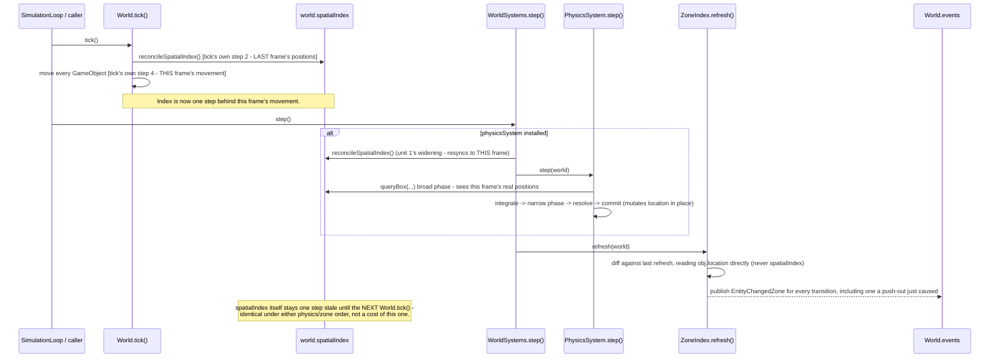

# Plan: `world-systems` — the fixed-order per-frame aggregator + Phase 1 physics documentation corrections

## Header / Association

- **Covers:** [SpartanLabsGaming/MyGameTools#49](https://github.com/SpartanLabsGaming/MyGameTools/issues/49)
  — *"Phase 1: physics — motion integration + collision resolution (push-out / slide)"* (item 4
  of 5 in `docs/framework-vision-and-roadmap.md` §3 Phase 1). This plan covers **unit 6 of 6**,
  the last to land.
- **Architecture:** `docs/issue-49-physics-architecture.md`, unit slug `world-systems` (§10
  decomposition table, row 6; scope defined in §4.9, §7, §10's last paragraph, §12 Open Decision
  1).
- **Branch:** `feature/49-world-systems`, off `master` **after** units 1–5 have merged (this unit
  depends on unit 5, `physics-system`, and on the already-landed #47 `ZoneIndex`).
- **Commit:** TBD
- **PR:** TBD — this plan document is committed together with the first commit of its
  implementation (the `WorldSystems.kt` addition, §4.1 below) so `git log --follow` binds the two.
- **What this plans:** the `WorldSystems` per-frame aggregator
  (`com.spartanlabs.gaming.world.system`, `gametools-world`) with the fixed **physics → zone**
  order; and the cross-cutting documentation/roadmap corrections architecture §7 assigns to this
  unit specifically — the false `DirectionalProjectile`-sweeps claim in
  `docs/framework-vision-and-roadmap.md`, the superseded sketches in
  `docs/phase-1-map-and-space-plan.md`, the `@SupportedExtension` footnote in
  `docs/api-openness-decisions-6.0.0.md`, and the `README.md` Architecture/Features prose for
  physics as a whole. Every other unit (1–5) owns its own `CHANGELOG.md` entry for the surface it
  lands (architecture §10); this unit adds `WorldSystems`'s own entry plus one summary line naming
  the full Phase 1 physics feature set.
- **Status:** planning only. No source, test, or build file has been modified by this document.
- **Target release:** `5.3.0`. **`5.2.0` has not been cut yet** — all four published coordinates
  still read `5.1.0` and #42/#46/#47/#48 sit under `CHANGELOG.md`'s `[Unreleased]` heading.
  `5.2.0` must release before `5.3.0`'s branches are cut, per `docs/phase-1-map-and-space-plan.md`'s
  own sequencing. **This plan does not bump any version number or cut a release** — that is
  `5.2.0`'s and then `5.3.0`'s own release-branch step (`CONTRIBUTING.md` §Releasing).
- **Dependencies:** unit 5 (`physics-system`, providing `PhysicsSystem`) and the already-landed
  `ZoneIndex` (#47). Lands last of the six; nothing in the decomposition depends on this unit.
- **Related docs:** `docs/issue-49-physics-architecture.md` (§4.1 system inventory, §4.7 hazard 1
  and 8, §4.9, §7, §8 stability tiers, §10 decomposition, §12 Open Decision 1);
  `docs/physics-core-seams-plan.md` (unit 1 — settles `World.reconcileSpatialIndex()` public and
  `@SupportedExtension`'s exact, parameterless shape); `docs/phase-1-map-and-space-plan.md` (§2.5,
  §9 Open Decisions 3/4/6, §10); `docs/issue-47-zones-plan.md` (§2.3, §3.5 — narrows Open Decision
  3 to #47's own scope and explicitly defers `WorldSystems` to #49); `docs/framework-vision-and-roadmap.md`
  (§3 Phase 1 item 4, §5 Open Decision C); `docs/api-openness-decisions-6.0.0.md` (D1, Follow-up).

---

## 1. Context

### 1.1 What exists today (verified against `master` at `56ae9bc`; unit 6's own branch will be cut
after units 1–5 land, so some facts below describe the **state this unit assumes at branch time**,
not `master` as of this writing — flagged explicitly where that matters)

- **`World.tick()`** (`World.kt:218-245`, class doc `World.kt:20-47`) runs, in order: `tickCount++`
  → `reconcileSpatialIndex()` (its own step 2) → `reindexEntities()` → every `GameObject.tick()` in
  insertion order, which is where `Movement` mutates `location` (step 4) → drains `removeList`. On
  return, `spatialIndex` reflects the *previous* frame's positions, not this one's — `tick()`
  reconciles before it moves anything.
- **`World.reconcileSpatialIndex()`** is `internal fun` **as of `master` today** (`World.kt:258`).
  Unit 1 (`physics-core-seams`, `docs/physics-core-seams-plan.md`) widens it to `public` with a
  rewritten KDoc naming `WorldSystems` as the intended second caller — **this unit's branch
  assumes that widening has already landed**, since unit 1 lands first in the decomposition
  (architecture §10). If, at implementation time, unit 1 has not actually merged yet, this unit
  cannot compile and must not be started — see §7 risks.
- **`ZoneIndex.refresh(world: World)`** (`gametools-world/.../world/zone/ZoneIndex.kt:38-62`, landed
  under #47, real on `master` today) iterates `world.gameObjects` and reads `obj.location`
  directly; it never references `world.spatialIndex` at all (verified: zero occurrences of
  `spatialIndex` in `ZoneIndex.kt`). `ZoneGrid.zoneAt(point, clamped = false)` resolves each
  entity's current zone; a change publishes `EntityChangedZone` on `world.events`. #47's own plan
  (`docs/issue-47-zones-plan.md` §3.5) deliberately left `refresh` a plain, ordering-agnostic
  method and explicitly deferred building `WorldSystems` to this issue — "**#49 (physics) is the
  right place to resolve Open Decision 3 for real**... Its plan should read this issue's §3.5
  before designing `WorldSystems.step()`."
- **No `world.physics` or `world.system` package exists on `master` today.** `PhysicsSystem`
  (unit 5's own surface: `attach`/`detach`/`bodyFor`/`step(world)`, per the cross-unit contract
  given in this issue's decomposition) does not exist yet either. This unit's own test suite and
  implementation are therefore blocked on unit 5 landing first, exactly as architecture §10 states.
- **`gametools-world`'s only existing packages are `world.map` (#46) and `world.zone` (#47)** —
  confirmed by directory listing. Neither has ever used slf4j logging (grep across
  `gametools-world/src/main/kotlin` for `LoggerFactory` returns nothing) — `WorldSystems.kt` will
  be the first `gametools-world` production file to log anything.
- **`SimulationLoop`** (`gametools-core/.../simulation/SimulationLoop.kt`) calls `world.tick()`
  then an `onTick(tickCount: Long)` callback on its own thread, no `dt` anywhere in the call chain
  — confirmed, unchanged by this issue (architecture §6: "No change" for `SimulationLoop`).
- **The repo's logging convention** for a package-level logger is a **file-level**
  `private val log: Logger = LoggerFactory.getLogger("<package>")` (verified:
  `SimulationLoop.kt:20`, `EventBus.kt:10`; `GameObject.kt:23` uses `internal val log` so `World.kt`
  can share it within `gametools-core`) — **not** a companion-object logger. `WorldSystems.kt`
  follows the same file-level pattern (§4.1).
- **The repo has no MockK dependency anywhere** and every existing test in `gametools-world`
  (`ZoneIndexTest`, `TiledMapTest`, etc.) uses `kotlin.test` on the JUnit 5 platform against real
  collaborator objects, not mocks — confirmed by `docs/physics-core-seams-plan.md` §6 and by
  reading `ZoneDrivenSimulationE2ETest.kt`. This plan's tests follow the same convention (§6).

### 1.2 Why `WorldSystems` is exactly this shape, restated concretely for the implementer

Architecture §4.9 and §12 Open Decision 1 already settled the design; this section restates it as
binding, not as something this plan re-derives:

1. **Concrete, fixed order — not a registry.** Constraint 1 (binding, architecture §1.2) rules out
   a `List<(World) -> Unit>`-style registry outright. `#50` (vision, not part of this
   decomposition) either adds a third constructor-optional slot to this same class or motivates a
   later generalisation — neither is decided by this unit, and this unit's own `WorldSystems.kt`
   must not anticipate a shape for that (§9).
2. **Physics → zone, not zone → physics.** This was the architecture's own late flip (§4.9,
   §12 Open Decision 1) — an earlier draft leaned zone-first; the user reversed it, and the earlier
   objection to the flip (that it computes zones "against a position not yet reflected anywhere
   else that frame") was tested against the flipped pipeline and found **wrong**: post-physics
   positions *are* the frame's final positions. **Getting this order right is this unit's single
   most important correctness obligation** — the task brief explicitly flags this as "the ordering
   was flipped late," and the code in §4.1 below implements physics-then-zone, matching the
   architecture's final, resolved position, not the earlier lean still visible in
   `docs/phase-1-map-and-space-plan.md` §2.5 (§5 below corrects that document).
3. **Why `reconcileSpatialIndex()` runs immediately before `physicsSystem.step()`, and only when
   physics is installed.** `World.tick()` reconciles at its own step 2 and only moves objects at
   its step 4 (`World.kt:218-226`), so on return from `tick()` the index is one call behind. If
   `physicsSystem` is `null`, nothing this frame queries `world.spatialIndex` against fresh
   positions, so the extra `O(n)` scan buys nothing and is skipped (architecture §4.7 hazard 1,
   §4.9 point 1).
4. **Why no second reconcile is needed between physics and zones.** `ZoneIndex.refresh` reads
   `obj.location` directly (§1.1 above, verified) — it never touches `world.spatialIndex` — so
   physics committing final positions in place is immediately visible to the zone refresh that
   follows it in the same `step()` call, with no additional index work.
5. **What this ordering does *not* fix, and is not asked to.** `world.spatialIndex` itself sits at
   pre-physics positions from the moment `physicsSystem.step()` commits until the *next*
   `World.tick()` call, under **either** possible ordering — physics is the last thing that moves
   anything either way. This is a standing property of the design (architecture §4.9, §11), not a
   defect this unit introduces or is expected to close.

### 1.3 Acceptance criteria for this unit

- `gametools-world` compiles a new public class `WorldSystems` in
  `com.spartanlabs.gaming.world.system`, exactly matching the constructor and `step()` signature
  the architecture and this issue's cross-unit contract specify (§4.1).
- `WorldSystems.step()`, given a `physicsSystem`, reconciles the spatial index and runs physics
  before refreshing zones, and a zone transition a push-out causes in one frame is visible on the
  *same* `step()` call that performed the push-out (the regression the flip exists to prevent).
- `WorldSystems` has zero references to `com.spartanlabs.gaming.simulation.*` in its imports —
  usable from any driver, not only `SimulationLoop`.
- `WorldSystems` compiles and works with either or both of `zoneIndex`/`physicsSystem` absent, and
  neither present is a legal (if pointless) construction.
- The four documentation corrections named in architecture §7 are made, each marked superseded /
  corrected rather than silently deleted, plus the README physics prose and the `CHANGELOG.md`
  entries (own + summary) required by architecture §10's per-unit documentation rule.

---

## 2. Design

### 2.1 Package placement

New package `com.spartanlabs.gaming.world.system` in `gametools-world`, one file
(`WorldSystems.kt`) — matches the architecture's own package name (§4.1 system inventory) and the
one-class-per-file granularity `world.map`/`world.zone` already use.

### 2.2 `WorldSystems` — exact declaration

```kotlin
// gametools-world/src/main/kotlin/com/spartanlabs/gaming/world/system/WorldSystems.kt
class WorldSystems(
    val world: World,
    val zoneIndex: ZoneIndex? = null,
    val physicsSystem: PhysicsSystem? = null,
) {
    fun step() {
        if (physicsSystem != null) {
            world.reconcileSpatialIndex()
            physicsSystem.step(world)
        }
        zoneIndex?.refresh(world)
    }
}
```

This is the architecture's own code, reproduced verbatim as the binding signature (issue body,
architecture §4.9, cross-unit contract) — this plan adds KDoc, logging, and the file's import
regions around it (§4.1), and changes nothing about the control flow itself.

### 2.3 One frame, end to end



### 2.4 Stability tier

**Stable Core.** Per architecture §8: *"its documented order carries the same guarantee
`World.tick()`'s order does."* `WorldSystems` is a plain, closed (non-`open`) class with a
fixed order — there is no substitutable seam here (unlike `CollisionResolver`, unit 4's
`@SupportedExtension`); both constructor slots are already the extension point (constructor-
optional composition), and that is enough, per the architecture's own reasoning for keeping
`PhysicsSystem` and `WorldSystems` both closed while carving `CollisionResolver` out as the one
injected interface.

### 2.5 The documentation/roadmap corrections this unit owns (architecture §7)

Five items, each addressed file-by-file in §5:

1. `docs/framework-vision-and-roadmap.md:247` — the false `DirectionalProjectile` sweep claim
   (Open Decision C), corrected and marked partly resolved.
2. `docs/phase-1-map-and-space-plan.md` — §2.1's `world.geometry` package sketch, §2.5's
   `PhysicsSystem.step(dt)` sketch and single-pass resolve, and §9 Open Decisions 3/4/6, and §10's
   GeneralTools enhancement proposal — all superseded, marked in place.
3. `docs/api-openness-decisions-6.0.0.md` — record that `@SupportedExtension` (which D1 already
   assumes exists) was created by this issue, in `gametools-core`, in its final, parameterless
   shape (unit 1's own resolution of the discrepancy flagged in `docs/physics-core-seams-plan.md`
   §10 item 1).
4. `README.md` — the Architecture/Features prose for physics as a whole, and the `gametools-world`
   module-table row.
5. `CHANGELOG.md` — `WorldSystems`'s own `[Unreleased]` entry, plus the summary Phase 1 physics
   line architecture §10 assigns to whichever unit lands last.

---

## 3. File-by-file changes

### 3.1 New: `gametools-world/src/main/kotlin/com/spartanlabs/gaming/world/system/WorldSystems.kt`

```kotlin
package com.spartanlabs.gaming.world.system

//region 1. Organization Internal
// 1.2 Spartan Gaming
import com.spartanlabs.gaming.gameobjects.World
import com.spartanlabs.gaming.world.physics.PhysicsSystem
import com.spartanlabs.gaming.world.zone.ZoneIndex
//endregion

//region 4. Programming Infrastructure and Support
// 4.1 Logging
import org.slf4j.Logger
import org.slf4j.LoggerFactory
//endregion

private val log: Logger = LoggerFactory.getLogger("com.spartanlabs.gaming.world.system")

/**
 * The fixed, documented order in which a game's optional per-frame world-level systems run,
 * alongside [World.tick]. [zoneIndex] and [physicsSystem] are each constructor-optional, so a
 * game runs zones without physics, physics without zones, or neither - in which case
 * constructing this class at all is unnecessary. [WorldSystems] has no dependency on
 * [com.spartanlabs.gaming.simulation] - drive it by calling [step] once per frame, typically from
 * a [com.spartanlabs.gaming.simulation.SimulationLoop]'s `onTick` callback, or by a direct call
 * right after [World.tick] in a hand-rolled loop.
 *
 * ### What one [step] does, in order
 * 1. If [physicsSystem] is installed, [World.reconcileSpatialIndex] resyncs [World.spatialIndex]
 *    to the positions [World.tick] just produced. Necessary because [World.tick] reconciles at
 *    its own step 2 and only moves objects at its step 4 (see [World]'s class doc), so on return
 *    from [World.tick] the index is one step behind. Skipped entirely when [physicsSystem] is
 *    `null`, since nothing then queries [World.spatialIndex] against fresh positions this frame.
 * 2. [PhysicsSystem.step] integrates motion and resolves collisions, committing each attached
 *    body's final position by mutating its owner's `location` in place - the same idiom every
 *    other mover in this engine already uses.
 * 3. [ZoneIndex.refresh] recomputes zone membership against those final positions - run *last*,
 *    so a push-out or slide that carries an entity across a zone boundary is reported on the
 *    *same* [step] call that moved it, not the next one. [ZoneIndex.refresh] reads each object's
 *    `location` directly and never consults [World.spatialIndex], so no second reconcile is
 *    needed between steps 2 and 3.
 *
 * **What this ordering does not fix.** [World.spatialIndex] itself is left one step stale, from
 * the moment [physicsSystem] commits this frame's positions until the *next* [World.tick] call -
 * physics is the last thing that moves anything under either possible ordering of this class, so
 * that staleness is a standing property of the design, not a cost specific to running zones after
 * physics.
 *
 * @property world the world this instance drives each [step]
 * @property zoneIndex refreshed last, against the frame's final positions; `null` to run without
 *   zone tracking
 * @property physicsSystem stepped first (after resyncing [World.spatialIndex]); `null` to run
 *   without physics, in which case [World.reconcileSpatialIndex] is not called either
 */
class WorldSystems(
    val world: World,
    val zoneIndex: ZoneIndex? = null,
    val physicsSystem: PhysicsSystem? = null,
) {

    init {
        log.info(
            "WorldSystems configured: physics={}, zone={}",
            physicsSystem != null,
            zoneIndex != null,
        )
    }

    /**
     * Runs one frame's worth of installed world systems, in the fixed order documented on the
     * class: physics, then zones. Returns [Unit] unconditionally - neither installed system has
     * an expected, recoverable failure mode of its own for this method to encode as a [Result];
     * an exception raised inside [physicsSystem] or [zoneIndex] is a programmer error (e.g. a
     * body attached for an entity no longer in [world]) and is **not** caught here - it
     * propagates to the caller exactly as an exception raised inside [World.tick] itself would.
     */
    fun step() {
        if (physicsSystem != null) {
            world.reconcileSpatialIndex()
            physicsSystem.step(world)
        }
        zoneIndex?.refresh(world)
        log.debug("WorldSystems.step: physics={}, zone={}", physicsSystem != null, zoneIndex != null)
    }
}
```

**Error handling:** `step()` returns `Unit`, matching the bulk-operation precedent
(`World.tick()`, `ZoneIndex.refresh`) — there is no expected/operational failure for this method
to wrap in a `Result`; it takes no arguments and every branch is a plain delegated call. An
exception thrown by `physicsSystem.step(world)` or `zoneIndex.refresh(world)` is not caught,
wrapped, or logged as a failure here — it is a programmer error surfaced by whichever unit owns
that failure mode (unit 5 for `PhysicsSystem`, `ZoneIndex` for #47), and `WorldSystems` adds no
opinion about it, matching `World.tick()`'s own no-wrapping behaviour.

**Mutability:** `world`, `zoneIndex`, `physicsSystem` are all `val` — the three collaborators a
`WorldSystems` instance drives never change after construction (a consumer who needs a different
`World` or a different `physicsSystem` constructs a new `WorldSystems`, mirroring `ZoneGrid`'s own
"built once" posture). No internal mutable state of its own — `WorldSystems` holds no fields
beyond the three constructor properties.

**Concurrency:** single-threaded driver assumption, inherited unchanged from `World`/
`SimulationLoop` — `step()` does no synchronization of its own and none is added. Calling `step()`
from a different thread than whatever drives `World.tick()` already violates `World`'s documented
contract before this class is involved.

**Logging:** two new lifecycle events, both new to `gametools-world` (§1.1 — no `gametools-world`
file logs anything today):
- `INFO`, once per construction — `"WorldSystems configured: physics={}, zone={}"` — mirrors
  `World`'s own `init { log.info("World created with seed {}", seed) }` (`World.kt:50-52`)
  pattern: a one-time configuration fact, logged at construction, not per call.
- `DEBUG`, once per `step()` call — `"WorldSystems.step: physics={}, zone={}"` — mirrors
  `World.tick()`'s own per-call `log.debug("World tick: advancing {} game object(s)", ...)`
  (`World.kt:224`) granularity; slf4j's lazy `{}` placeholders make this a no-op at 10-20 Hz with
  debug logging disabled, matching the cost profile already accepted for `tick()`'s own per-frame
  debug line.

**No validation in the constructor.** Unlike `ZoneGrid`'s `require(columns > 0 && rows > 0)`,
there is nothing to validate here: any combination of `null`/non-`null` `zoneIndex` and
`physicsSystem` is legal (architecture §4.9: "in which case `WorldSystems` is simply not
constructed" describes a design recommendation for the all-`null` case, not an invariant this
class enforces — constructing it that way compiles and runs as a no-op `step()`).

**What is not checked, and cannot be checked here:** whether `zoneIndex`'s underlying `ZoneGrid`
or `physicsSystem`'s attached bodies were actually built against *this* `world` instance. Neither
`ZoneIndex` nor `PhysicsSystem` stores a `World` reference of its own — both take `world` as a
parameter to `refresh`/`step` — so `WorldSystems` has no state to cross-check against, and passing
mismatched instances (a `ZoneIndex` built over a different map's `ZoneGrid`, say) is an
undetected caller error, the same trust-the-caller posture `ZoneIndex.refresh(world: World)`
already has for its own `world` parameter.

### 3.2 Changed: `docs/framework-vision-and-roadmap.md`

Line 247, Open Decision C's row currently reads:

> `| C | **Discrete vs continuous collision.** | At 10–20 Hz a fast projectile can tunnel through a thin wall. `DirectionalProjectile` already sweeps along a line; a swept-shape check for fast movers may be enough without full continuous physics. |`

**Correct the notes cell** (removing the false claim, not just annotating around it — the task
brief is explicit that this line is false and must be corrected):

> `| C | **Discrete vs continuous collision — partly resolved, issue #49.** | At 10–20 Hz a fast projectile can tunnel through a thin wall. `DirectionalProjectile` does **not** sweep - it advances via `Movement.Directional` then tests overlap only at the *post-move* position (`DirectionalProjectile.kt:71-86`), a discrete test; the original claim here was wrong. `gametools-world`'s `PhysicsSystem` (issue #49) now gives an *opted-in* `gametools-world` body real swept resolution against other bodies, `StaticGeometry`, terrain and map bounds. `core`'s projectiles are unchanged - a consumer can already opt one into swept physics today via `physicsSystem.attach(projectile, ...)` (a `Projectile` **is** a `VisibleObject`), alongside its existing discrete damage test. Whether to also give `DirectionalProjectile`/`HomingProjectile` a first-class swept mode, or simply document the opt-in path as the answer, is a named follow-up (`docs/issue-49-physics-architecture.md` §6). |`

Immediately below the Open Decisions table (before the `---` at line 253), add one paragraph
recording the resolution, matching the "record the outcome, don't silently drop the note" pattern
`docs/api-openness-decisions-6.0.0.md` already uses for its own rulings:

> **Open Decision C — partly resolved (issue #49, `world-systems` unit).** `gametools-world`
> bodies attached to a `PhysicsSystem` get real swept collision resolution as of `5.3.0`; `core`'s
> `DirectionalProjectile`/`HomingProjectile` are unchanged and keep their discrete post-move
> overlap test. See `docs/issue-49-physics-architecture.md` §6 (adoption verdicts table) for the
> named follow-up and the already-available opt-in workaround.

### 3.3 Changed: `docs/phase-1-map-and-space-plan.md`

Four separate, non-adjacent edits, **each an in-place superseded-notice, not a deletion** — the
original sketch text stays, for the historical record architecture §7 asks to preserve:

1. **§2.1's package table, `world.geometry` row (line 236):** prepend a note directly above the
   table row (or as an appended clause on the same row, whichever renders more cleanly in the
   existing table) — *"**Superseded** (`docs/issue-49-physics-architecture.md` §1.2 constraint 8,
   Research finding 2): no `world.geometry` package was created. GeneralTools 2.2.0 (already the
   pinned dependency as of `CHANGELOG.md`'s `[Unreleased]` `#48` bump) ships `Segment`, `Ray`,
   `AxisAlignedBox`, `CenteredBox`, and the intersection/vector-algebra helpers this sketch
   proposed building internally — see §10 below, also superseded."*
2. **§2.5 (lines 302-341), the whole physics design sketch:** insert one callout block
   immediately above the `### 2.5 Physics (item 4)` heading:

   > **Superseded by `docs/issue-49-physics-architecture.md` (physics's actual design).** Kept
   > below verbatim as the historical record of Phase 1's original physics sketch. Three points
   > where the final design differs, each resolved in the architecture doc's own numbered section:
   > (a) `PhysicsSystem.step(dt)` is superseded by the no-`dt`, per-tick integrator (architecture
   > §4.8, §12 Open Decision 4) — `dt` was never an independently considered choice; it rode along
   > from the issue body's proposed API sketch into this plan, so dropping it is a correction, not
   > a reversal, of a deliberate decision. (b) The single-pass "resolve" step is superseded by the
   > iterated Jacobi positional-correction solver (architecture §4.5), needed specifically because
   > `SpatialIndex.queryBox`'s broad-phase candidate order is unspecified (architecture §2 finding
   > 1). (c) This section's own "zone then physics" lean (§2.5's last bullet, §9 Open Decision 3)
   > is superseded by **physics → zone** (architecture §4.9, §12 Open Decision 1) — the reverse of
   > what is written below.

3. **§9 Open Decisions table, rows 3, 4, 6 (lines 587, 588, 590):** append a **Resolution** cell
   note (or a trailing sentence within the existing "Notes / lean" cell) to each of the three rows:
   - Row 3 (`WorldSystems`/per-frame ordering): *"**Resolved** by `docs/issue-49-physics-architecture.md`
     §4.9 / §12 Open Decision 1: `WorldSystems.step()`, fixed order **physics → zone** (this
     table's own 'zone then physics' lean, above, was reversed) — narrower still than this row's
     three-way framing, since #47 (`docs/issue-47-zones-plan.md` §3.5) had already ruled out the
     `SimulationLoop.onTick`-hook and `World.systems`-list alternatives for its own scope before
     #49 settled the concrete-class-vs-registry question for real."*
   - Row 4 (physics ↔ `Movement` glue): *"**Resolved**, differently than this row's lean:
     `docs/issue-49-physics-architecture.md` §4.7 hazard 2 / §12 Open Decision 2 ships **no**
     glue and **no** `Movement` change in `5.3.0` — not the 'desired position diff' adapter this
     row proposed. The `hasSettled`/`Targeting` displacement limitation is documented rather than
     worked around; the real fix is deferred to the `6.0.0` `Movement` delta refactor (D1), as
     this row's own lean already anticipated for the *refactor*, just not for the interim
     adapter."*
   - Row 6 (collision shape): *"**Resolved**, matching this row's own lean: both `Circle` and
     `Aabb` (`docs/issue-49-physics-architecture.md` §4.3)."*
4. **§10 (lines 600-619), the GeneralTools geometry enhancement proposal:** insert a callout
   immediately above the `## 10. GeneralTools geometry enhancement (proposed upstream issue)`
   heading:

   > **Superseded — fulfilled by the dependency bump already in `CHANGELOG.md [Unreleased]`.**
   > GeneralTools `2.2.0` (up from `2.0.1`) ships `Segment`, `Ray`, `AxisAlignedBox`, `CenteredBox`,
   > and the `Point` vector-algebra / intersection helpers this section proposed requesting
   > upstream. `docs/issue-49-physics-architecture.md` (§2 Research finding 2, §1.2 constraint 8)
   > uses these directly; no `world.geometry` package was built. Kept below as the historical
   > record of the original ask. Whether the upstream tracking issue
   > (`SpartanLaboratories/GeneralTools#3`) should now be closed as fulfilled is flagged to
   > Spartak, not decided here (§9).

### 3.4 Changed: `docs/api-openness-decisions-6.0.0.md`

Two edits, both additive notes, no rewording of the existing rulings:

1. **D1's "Tier: Supported Extension" paragraph** (currently ending *"Same semver guarantee as
   the stable core."*, around line 71) — append: *"`@SupportedExtension` itself now exists,
   created by issue #49's `physics-core-seams` unit: `com.spartanlabs.gaming.annotation.SupportedExtension`
   in `gametools-core`, parameterless, `BINARY` retention (`docs/physics-core-seams-plan.md`
   §2.2-§2.3). D1's `6.0.0` work applies it to `Movement` directly; no further design is owed
   here."*
2. **Follow-up section** (currently ending with the D1/D3 bullets, lines 207-210) — append a new
   bullet: *"`@SupportedExtension`'s home and shape are now settled (see D1's note above); the
   `docs/physics-core-seams-plan.md` §10 item 1 discrepancy between the architecture doc's shown
   `note: String = ""` parameter and the binding no-parameter declaration was resolved in favour of
   **no parameters** — recorded here so a future reader of this document sees the final shape, not
   the two conflicting drafts."*

### 3.5 Changed: `README.md`

Two edits:

1. **Modules table, `world` row (`README.md:149`)** — currently ends *"...physics and vision are
   still to come."* Replace with a clause naming the new packages, following the same style the
   `#47` edit used for `world.zone`: *"...`com.spartanlabs.gaming.world.system.*`: `WorldSystems`
   — the fixed, per-frame `physics → zone` order a consumer runs alongside `World.tick()` (#49);
   `com.spartanlabs.gaming.world.physics.*`: `Shape` (`Circle`/`Aabb`), `PhysicsBody`, `Contact`,
   `CollisionResolver` (`@SupportedExtension`) + its default `PositionalCorrectionResolver`, and
   `PhysicsSystem` (`attach`/`detach`/`step`) (#49); vision is still to come (#50)."*
2. **A new Features subsection**, `### ⚙️ Physics`, inserted after the existing `### 🗺️ Map &
   Space` subsection (after `README.md:181`) and before `### 🌐 Networking`, mirroring that
   subsection's own register and level of detail (prose, not a full API reference — this is the
   Component-ring KDoc's job). Content to cover, drafted for the executor to finalize once units
   2-5's exact public shapes are real:
   - Opt-in per-`VisibleObject` attachment (`physicsSystem.attach(holder, shape, inverseMass,
     restitution)`), a bodyless object moves exactly as before.
   - What it resolves against: other attached bodies, `StaticGeometry`, non-walkable terrain, map
     bounds — swept, not just discrete, for a normal-speed mover.
   - The one substitutable seam, `CollisionResolver` (`@SupportedExtension`), with
     `PositionalCorrectionResolver` as the shipped, Jacobi-based default.
   - No `dt` — `velocity`/`acceleration` are in world units per tick / per tick², matching
     `Actor.speed`'s existing convention; a driver calls `worldSystems.step()` once per frame,
     alongside `world.tick()`.
   - The one documented limitation: a `Movement.Targeting` actor physics displaces *after* it has
     already reached its `destination` stays displaced rather than walking back (`Movement.Persistent`
     already does what a consumer wanting push-back needs) — cross-reference `PhysicsSystem`'s own
     KDoc (unit 5) rather than re-explaining the full reasoning here.
   - `WorldSystems` — the fixed `physics → zone` frame order, and why (one sentence: a push-out
     is reflected in the same frame's zone membership).

Also add `PhysicsSystem` and `WorldSystems` (and, opportunistically, the still-missing `Zone`/
`ZoneIndex` from #47, if the executor judges it low-risk to include — **flagged, not mandated**,
see §9) to the Architecture Mermaid class diagram (`README.md:33-119`), following the existing
`TiledMap ..|> Space` / `World "1" *-- "1" SpatialIndex` notation style, e.g. a
`WorldSystems "1" o-- "0..1" PhysicsSystem` / `WorldSystems "1" o-- "0..1" ZoneIndex` relationship
and a `WorldSystems ..> World` dependency edge.

### 3.6 Changed (only if the executor also fixes the pre-existing drift, §7): `CONTRIBUTING.md`

**In scope, required:** the module layout table's `gametools-world` row (`CONTRIBUTING.md:35`)
currently lists only the map (#46) and zone (#47) packages. Append, matching the row's existing
style: *"; `com.spartanlabs.gaming.world.physics.*` — `Shape`, `PhysicsBody`, `Contact`,
`CollisionResolver`, `PositionalCorrectionResolver`, `PhysicsSystem` (#49); `com.spartanlabs.gaming.world.system.*`
— `WorldSystems` (#49)"*.

**Out of scope, flagged as pre-existing drift, not fixed by this unit's commits unless the
executor opts in (§7, §9):** the Versioning section (`CONTRIBUTING.md:135-137`) still says *"all
three modules release together"*, unchanged since before `gametools-world` became the fourth
coordinate under #48. This predates every unit of this issue and is not caused by it — recorded
here so it is not silently perpetuated, not because fixing it is this unit's job.

### 3.7 Changed: `CHANGELOG.md`

Two `[Unreleased]` bullets under `### Added`, appended **after** the bullets units 1-5 land under
their own PRs (this unit lands last, so by the time its own commit is made, five other bullets
already exist above it in the file — this unit's edit is a pure append, no reordering of existing
entries):

```markdown
- `com.spartanlabs.gaming.world.system.WorldSystems` - the fixed, documented per-frame order a
  game runs alongside `World.tick()`: reconcile the spatial index and step physics (if a
  `PhysicsSystem` is installed), then refresh zone membership (if a `ZoneIndex` is installed) -
  in that order, so a push-out that carries an entity across a zone boundary is reported the same
  frame it happens, not the next one. Both slots are constructor-optional; neither installed is a
  legal no-op. Has no dependency on `com.spartanlabs.gaming.simulation`, so it composes with
  `SimulationLoop`'s `onTick` or a hand-rolled loop equally. (#49)

- **Phase 1 physics ships in full (issue #49).** Motion integration, broad/narrow-phase collision
  detection (`Shape.Circle`/`Aabb` bodies against other bodies, `StaticGeometry`, non-walkable
  terrain, and map bounds - swept, not just discrete, for a normal-speed mover), and Jacobi
  positional-correction + restitution resolution through the substitutable `CollisionResolver`
  seam (`@SupportedExtension`, shipped default `PositionalCorrectionResolver`). See the bullets
  above (and this release's earlier `[Unreleased]` entries) for each piece's own detail; this line
  is the single cross-reference confirming the whole roadmap item (`docs/framework-vision-and-roadmap.md`
  §3 Phase 1 item 4) landed. `gametools-core` gains exactly one new type
  (`com.spartanlabs.gaming.annotation.SupportedExtension`) and one visibility widening
  (`World.reconcileSpatialIndex()`, now public) to support it - no other `core` change.
```

The exact wording of the first four sub-clauses of the summary bullet should be reconciled against
units 2-5's actual landed `CHANGELOG` bullets at the time this unit's commit is written, since
their precise final shape is theirs to decide, not this plan's.

---

## 4. Documentation impact (Audience-Reach rings)

- **Inner Core (in-editor):** `WorldSystems.kt`'s import regions follow `.aiassistant/rules/CLAUDE.md`
  §6 exactly (§3.1) — a `1. Organization Internal` / `1.2 Spartan Gaming` group for the three
  production imports, a `4. Programming Infrastructure and Support` / `4.1 Logging` group for
  slf4j. No group is empty, so no placeholder comment is needed.
- **Component Ring (KDoc):** the primary ring this unit's *code* change touches — full KDoc on
  `WorldSystems`, its three constructor properties, and `step()`, with the frame order documented
  the way `World.tick()`'s own class doc documents its order (§3.1). Must render cleanly under
  `./gradlew dokkaGeneratePublicationHtml`.
- **Boundary Ring:** not touched — no wire format, no protocol change.
- **Architectural Outer Layer:** this is where most of this unit's *documentation* work lives —
  §3.2-3.4 correct `docs/framework-vision-and-roadmap.md`, `docs/phase-1-map-and-space-plan.md`,
  and `docs/api-openness-decisions-6.0.0.md` in place, each superseded/resolved note preserving the
  original text per architecture §7's instruction. `docs/issue-49-physics-architecture.md` itself
  needs no update — it already documents this unit's design fully; this plan is the concretisation
  of it, not a correction to it.
- **README / CONTRIBUTING currency:** both updated in this unit's own commits (§3.5, §3.6), since
  this unit adds a new public package, a new module-table entry, and (per the global README rule)
  changes what lands on `master`'s externally visible shape for the whole issue.

---

## 5. Test plan (5-level hierarchy)

Per-module tree under `com.spartanlabs.gaming.testing.<level>.world.system`, one class per file,
`kotlin.test` on the JUnit 5 platform against real collaborator objects — matching this repo's
actual convention (no MockK anywhere in the codebase; `docs/physics-core-seams-plan.md` §6 already
notes the same gap against the global "JUnit 5 + MockK, mock at level 2" standard). `PhysicsSystem`
and `ZoneIndex` are small, deterministic, in-process value/orchestration types, not external
services, so using the real thing at level 2 is consistent with how `ZoneIndexTest`/`TiledMapTest`
already test against real `ZoneGrid`/`TiledMap` instances rather than fakes.

### Level 1 — gating

No `com.spartanlabs.gaming.testing.gating` package exists anywhere in this repo (confirmed by
directory listing under every module's `testing/` root). This unit does not invent one. Per the
established convention (also stated in `docs/physics-core-seams-plan.md` §5), level 1 in practice
means `./gradlew componentTest deterministicTest` before pushing, using the level 2/4a tests below
— there is no separate checked-in artifact for this level.

### Level 2 — component (`gametools-world/src/test/kotlin/.../testing/component/world/system/WorldSystemsTest.kt`)

- `WorldSystems with both slots null is a no-op` — `step()` runs without throwing; `world`'s state
  (positions, `spatialIndex`, `world.events`) is unchanged by the call.
- `WorldSystems with only zoneIndex refreshes zones and never touches physics` — construct with
  `physicsSystem = null`; `step()` calls `zoneIndex.refresh(world)` (observed via an entity's
  `zoneOf` updating) and does not call `world.reconcileSpatialIndex()` — evidenced by the
  contrastive spatial-index-staleness test below, run with this same configuration.
- `WorldSystems with only physicsSystem steps physics and never touches zones` — construct with
  `zoneIndex = null`; `step()` moves an attached body (observable via its owner's `location`
  changing) and raises no exception from the absent `zoneIndex` (the `?.` call is a no-op).
- `reconcileSpatialIndex runs only when physicsSystem is installed` — the direct test for
  architecture §4.9 point 1: move an `Actor` via `world.tick()` so its position changes, then call
  `worldSystems.step()` twice, once configured with `physicsSystem = null` and once with a
  configured `PhysicsSystem` (even one with no attached bodies, so it contributes no additional
  movement of its own). Assert that `world.spatialIndex.queryBox(...)` around the actor's *new*
  location returns it only in the `physicsSystem`-installed case — proving the extra
  `reconcileSpatialIndex()` call actually ran (or didn't), not just that no exception was thrown.
- **Headline test — a push-out-caused zone transition is reported the same frame.** Build a real
  `World`, a `ZoneGrid`/`ZoneIndex` pair whose grid places two adjacent zones on either side of a
  line, a `PhysicsSystem` (default `PositionalCorrectionResolver`) with two overlapping attached
  bodies positioned so resolving their overlap pushes one of them across that zone line, and a
  `WorldSystems` wiring both. After exactly one `world.tick()` + one `worldSystems.step()` call,
  assert: (a) the pushed entity's `zoneIndex.zoneOf(...)` already reflects the *new* zone, and (b)
  a matching `EntityChangedZone(entity, oldZone, newZone)` was published on `world.events` during
  that same `step()` call — not requiring a second frame. This is the direct regression test for
  the physics→zone flip; a zone→physics implementation would fail assertion (a) (`zoneOf` would
  still report the *pre-push-out* zone until the following frame).
- `WorldSystems has no simulation-package import` — not independently automatable (no ArchUnit
  in this repo, §6) but recorded here as the property the file's own import list (§3.1) must
  maintain; a code-review checklist item, not a runtime assertion.

### Level 3 — integration (`.../testing/integration/world/system/WorldSystemsIntegrationTest.kt`)

- A real `World` with a `TiledMap`-backed `space`, a `ZoneGrid` over it, a `PhysicsSystem` with
  several attached `Actor`s (including one colliding with `StaticGeometry` and one crossing a
  non-walkable terrain boundary), driven for several `world.tick()` + `worldSystems.step()`
  cycles. Asserts `EntityChangedZone` events on `world.events` fire in the documented order
  relative to each frame's `Movement`/physics resolution, mirroring `ZoneRefreshWorldIntegrationTest`'s
  style (`docs/issue-47-zones-plan.md` §6) but adding physics into the composed pipeline for the
  first time. This test is also the practical proof that `World.reconcileSpatialIndex()` — widened
  to public by unit 1 — is genuinely callable across the `core`/`world` module boundary: unit 1's
  own test suite lives inside `gametools-core`, which cannot depend on `gametools-world`, and
  explicitly flagged this as something it could not prove itself
  (`docs/physics-core-seams-plan.md` §6, §9) — this test is where that promise is actually
  exercised.

### Level 4a — deterministic (`.../testing/deterministic/world/system/WorldSystemsDeterminismTest.kt`)

- Same `World(seed)`, same `ZoneGrid`/`PhysicsSystem` construction, and the same scripted sequence
  of `world.tick()` + `worldSystems.step()` calls produce the same sequence of published
  `EntityChangedZone` events and the same final positions across repeated runs — extending the
  engine's existing "same seed, same result" contract to the composed pipeline. This locks in that
  composing physics and zones inside `WorldSystems` introduces no incidental nondeterminism (e.g.
  from iteration order over `HashMap`-backed collaborator state) beyond what units 2-5 already
  guarantee individually.

### Level 4b — e2e (`.../testing/e2e/world/system/WorldSystemsSimulationE2ETest.kt`)

- The whole-stack check the task brief calls for: load `fixture-map.json` through `MapLoader`
  (reusing `world.map`'s existing fixture, matching `ZoneDrivenSimulationE2ETest`'s own precedent),
  build a `World` + `ZoneGrid`/`ZoneIndex` + `PhysicsSystem` + `WorldSystems`, and drive it with a
  real `com.spartanlabs.gaming.simulation.SimulationLoop` (unlike the two existing `world` e2e
  tests, which deliberately avoid `SimulationLoop` — this is the first e2e test in `gametools-world`
  to actually exercise it, since `WorldSystems` is `SimulationLoop`'s intended `onTick` payload) for
  a fixed tick count via `loop.advance(...)` calls, then asserts final positions, final zone
  membership, and that no `EntityChangedZone` for a physics-caused transition lags behind the tick
  that caused it.

### Level 4c — non-functional (`.../testing/nonfunctional/world/system/WorldSystemsFrameThroughputTest.kt`)

**Recommended, not strictly required by the architecture doc** (which asks only that hazard 1's
extra reconcile cost be measured "once implemented," without naming which unit's test suite should
carry it — architecture §11). Since `WorldSystems.step()` is the actual composed call a consumer
makes every frame, this unit is the natural place for a full-frame throughput measurement (physics
+ reconcile + zone refresh together) at the roadmap's medium-scale target (~10k entities, ~2k
physics-active, 10-20 Hz), complementing (not duplicating) a narrower `PhysicsThroughputTest` unit
5 may carry on `PhysicsSystem` alone. If time-boxed out of this unit's first PR, this is a
reasonable named follow-up rather than a blocking requirement (§10).

### Level 5 — UAT

No `com.spartanlabs.gaming.testing.uat` package exists anywhere in this repo. Not invented here.
**Worth noting explicitly:** `WorldSystems` is arguably the first genuinely "feelable" surface
across all six units of this issue — a human watching two units push apart and slide, or watching
a unit stop at a wall, is the first place Phase 1 physics produces something a UAT pass could
actually evaluate. This plan does not build the harness for that (out of scope — no `testing.uat`
convention exists project-wide yet), but flags it as the first real candidate for one, should the
project decide to start that tier.

### What genuinely cannot be tested automatically

- **That `WorldSystems.kt` has no dependency on `com.spartanlabs.gaming.simulation`.** No
  ArchUnit-style dependency-rule tool exists in this repo (verified: no `archunit` dependency
  anywhere). This is enforced by the file's own import list and code review, not a test — flagged
  in §5 Level 2 above rather than silently assumed.
- **That the documentation corrections in §3.2-§3.4 read correctly to a human.** Markdown-table
  edits and prose corrections have no automated correctness check beyond rendering; the executor
  should visually diff-review each edited file after making the change.
- **A genuine "feel" evaluation of push-out/slide behaviour** — see the Level 5 note above.

---

## 6. Risks & edge cases

- **Sequencing risk specific to this unit: it cannot be built or even meaningfully test-planned
  in detail against real code until units 1 and 5 exist on `master`.** This plan describes
  `PhysicsSystem`'s shape from the architecture doc's cross-unit contract, not from a landed
  implementation — if unit 5's actual public signature drifts from that contract during its own
  implementation, this unit's `WorldSystems.kt` and its tests must be re-verified against the real
  signature before this unit's PR opens. Flagged explicitly rather than assumed away.
- **Breaking changes:** none. `WorldSystems` is a brand-new type; the documentation edits are
  additive/corrective, not removals of any current guarantee.
- **Wire/schema compatibility:** unaffected — no `@Serializable` type, no wire format.
- **Concurrency:** none changed beyond `World`'s existing single-threaded-driver assumption (§3.1).
- **Performance:** the extra `O(n)` `reconcileSpatialIndex()` scan (paid only when `physicsSystem`
  is installed) is unit 1's own cost, already flagged as "real but cheap relative to a full
  rebuild" in `docs/physics-core-seams-plan.md`; this unit's own addition is a second `O(n)` pass
  (`ZoneIndex.refresh`, already existing and already measured as acceptable at the target scale per
  `docs/issue-47-zones-plan.md` §7) plus `PhysicsSystem.step()` itself (unit 5's cost to own).
  `WorldSystems.step()` itself adds no algorithmic cost beyond the two branches and two log calls.
- **Standing spatial-index staleness at end of frame** — restated in §1.2 point 5 and §3.1's own
  KDoc: identical under either physics/zone ordering, not introduced or worsened by this unit.
- **Cross-repo impact:** none identified, matching every other unit in this decomposition. No wire
  change; `MyGameServer`/`GameGraphics` are unaffected unless they opt in (no issue filed, per
  standing "no downstream consumer issues" guidance) — the CHANGELOG documents the new surface.
- **Migration:** none required for an existing `World`/`Actor`/`VisibleObject` — nothing runs
  differently until a consumer explicitly constructs a `WorldSystems` with a non-`null` slot.
- **Documentation-edit risk:** editing four separate, sizeable existing documents in place (§3.2-
  §3.4) risks an accidental deletion of surrounding content if the executor uses a broad
  find-and-replace; each edit in §3 above names its exact anchor line/heading precisely to keep
  the diff small and reviewable.

---

## 7. Version control

- **Branch:** `feature/49-world-systems`, cut from `master` only once units 1-5 have merged (this
  unit's own dependency chain, §10). If cut earlier for drafting purposes, it will not compile
  until unit 5 lands, and its final rebase onto `master` should be done right before this unit's PR
  opens, not speculatively earlier.
- **This unit's commits carry no unrelated changes.** The working tree currently holds an
  uncommitted, in-flight refactor moving `Alive`/`Buff`/`Capability`/`Intent`/`ModularStat`/
  `StatMod`/`CombinedStat`/`ExperienceReceiver` into a new `gameobjects.combat` subpackage
  (visible in `git status`: renames plus a new `BuffPlacer.kt`, touching `Actor.kt`,
  `GameObject.kt`, `VisibleObject.kt`, `World.kt`, `DirectionalProjectile.kt`,
  `HomingProjectile.kt`, `Player.kt`, `Moddable.kt`, `gametools-core/build.gradle.kts`). **None of
  it rides in this unit's commits.** Branch fresh off `master` at the point this unit actually
  starts (after units 1-5 land), not off the current dirty working tree.
- **Commit sequence** (each a coherent, independently-reviewable unit):
  1. `feat(world): add WorldSystems, the fixed physics-then-zone per-frame order` — adds
     `docs/world-systems-plan.md` (this document) and `WorldSystems.kt` (§3.1) plus its component,
     integration, deterministic, and e2e tests (§5). Body: cites the flipped ordering
     (`docs/issue-49-physics-architecture.md` §4.9, §12 Open Decision 1) and names the headline
     push-out/zone regression test.
  2. `docs: correct the physics roadmap/plan record for issue #49` — the
     `docs/framework-vision-and-roadmap.md`, `docs/phase-1-map-and-space-plan.md`, and
     `docs/api-openness-decisions-6.0.0.md` edits (§3.2-§3.4). Body: notes these are corrections/
     supersession marks, not new design, per architecture §7.
  3. `docs: physics-as-a-whole README/CONTRIBUTING/CHANGELOG updates for issue #49` — the
     `README.md`, `CONTRIBUTING.md`, `CHANGELOG.md` edits (§3.5-§3.7).
  4. **Optional, only if the nonfunctional test (§5 Level 4c) is included in this PR rather than
     deferred:** `test(world): add WorldSystems full-frame throughput benchmark` as its own commit,
     so a nonfunctional-only follow-up PR (if it is instead deferred, §10) has a clean, isolated
     precedent to land against later.
- **PR title:** `feat(world): add WorldSystems and land the Phase 1 physics documentation
  corrections`. Body references `Closes #49` (this is the unit that finally closes the issue,
  since it lands last) and cross-references units 1-5's own PR numbers once known.
- Trailer reminder: attribute per the repo's existing commit convention; no `BREAKING CHANGE:`
  footer — nothing here breaks an existing caller.

---

## 8. Interfaces with sibling units

- **Depends on unit 1 (`physics-core-seams`):** `World.reconcileSpatialIndex(): Unit`, public,
  called unconditionally when `physicsSystem != null` (§3.1). This unit's own test suite is the
  first to actually exercise that widening across the `core`/`world` module boundary — unit 1's
  own suite could not (`docs/physics-core-seams-plan.md` §6, §9).
- **Depends on unit 5 (`physics-system`):** `class PhysicsSystem { fun step(world: World) }`,
  constructed by the consumer and passed in as `WorldSystems.physicsSystem`. This plan treats
  `PhysicsSystem.step(world: World): Unit` as the whole of the contract it needs — `WorldSystems`
  never calls `attach`/`detach`/`bodyFor` itself, and does not need to know anything about
  `Shape`/`PhysicsBody`/`Contact`/`CollisionResolver` internals. If unit 5's `step` signature
  changes shape before it lands, only §3.1's one call site needs revisiting.
- **Depends on the already-landed #47 (`ZoneIndex`):** `class ZoneIndex { fun refresh(world:
  World) }` — used exactly as `docs/issue-47-zones-plan.md` §3.5 anticipated, with no change to
  `ZoneIndex`'s own public contract. #47's plan explicitly deferred building the "how per-frame
  systems run" aggregator to this issue; this unit is where that deferral is paid off.
- **Provides to #50 (vision — not part of this six-unit decomposition, tracked separately):**
  nothing directly — `WorldSystems` as built here has exactly two slots, and architecture §4.9's
  own closing paragraph says #50 "either slots in after physics alongside the zone refresh, or —
  if by then a hardcoded order is too rigid — motivates generalising `WorldSystems`; neither is
  decided here." This plan does not anticipate a third slot, a builder, or any other extensibility
  seam for vision — adding one now would be scope creep against constraint 1 (a fixed, hardcoded
  order is exactly what was asked for) and against "never guess intent." Whoever plans #50 should
  read this plan and architecture §4.9 before deciding whether `WorldSystems` needs to change
  shape or whether #50 composes alongside it as a second, independent per-frame call.
- **Does not provide, and is not asked to:** any physics type — `Shape`, `PhysicsBody`, `Contact`,
  `PhysicsSystem`'s own internals, and `CollisionResolver`'s shape are entirely units 2-5's
  concern. This unit's `gametools-world` diff is exactly `WorldSystems.kt`, its tests, and the
  documentation edits in §3.2-§3.7.

---

## 9. Open decisions

1. **Whether to add `Zone`/`ZoneIndex` (missing from the README's existing Architecture Mermaid
   diagram since #47 landed, despite that unit's own plan claiming parity with `TiledMap`'s
   treatment — `TiledMap` **is** in the diagram today, `Zone`/`ZoneIndex` are not) alongside this
   unit's own `PhysicsSystem`/`WorldSystems` diagram additions (§3.5).** **Recommendation:** add
   all four together while already editing that diagram — it is a small, low-risk addition and
   leaves the diagram internally consistent, but it is a pre-existing gap this unit did not create
   and is not strictly obligated to fix. Flagged rather than silently included or silently skipped.
2. **Whether to fix `CONTRIBUTING.md`'s stale "all three modules release together" Versioning
   sentence (§3.6) in this unit's `docs:` commit, file it separately, or leave it.**
   **Recommendation:** fix it in the same `docs:` commit as this unit's other `CONTRIBUTING.md`
   edit (§3.6) — it is a one-line, unambiguous accuracy correction directly adjacent to the table
   this unit is already touching, and the global README/CONTRIBUTING-currency rule favours keeping
   it accurate over deferring a known, small drift. Not blocking either way.
3. **Whether the nonfunctional throughput test (§5 Level 4c) ships in this unit's first PR or is
   deferred as a named follow-up.** **Recommendation:** defer if implementation time is tight —
   nothing in the architecture doc makes it a hard requirement for this unit specifically (§11
   there only says the cost is "worth a nonfunctional measurement once implemented," without
   naming an owner), and units 2-5 may already carry narrower throughput tests of their own pieces.
   Record the deferral explicitly in the PR description if taken.
4. **Whether `SpartanLaboratories/GeneralTools#3`** (the upstream geometry-primitives enhancement
   issue, now apparently fulfilled by the 2.2.0 dependency bump already in `[Unreleased]`) **should
   be closed.** Not this plan's call, and not something this plan or its executor should do
   unilaterally per the hard "no filing/commenting on GitHub issues" boundary and the standing
   "surface issues, ask before filing/closing" guidance — flagged in §3.3 item 4's edit for
   Spartak's own decision, not acted on here.

---

## 10. Sequencing & follow-ups

- Lands last, per architecture §10 and this issue's own dependency chain — after units 1-5, and
  after the already-landed #47. Nothing in the six-unit decomposition depends on this unit.
- This unit's PR is the one that closes issue #49 (§7 PR title).
- **`docs/framework-vision-and-roadmap.md` §3 Phase 1 item 4 "physics" being marked done** is a
  **release-PR edit** at `5.3.0` release time (matching the #46/#47/#48 precedent
  `docs/issue-47-zones-plan.md` §10 item 2 already established), **not** part of this unit's
  feature PR — this plan's §3.2 edit corrects the *false claim* in Open Decision C, which is a
  distinct, immediate correction owed now, from marking the *roadmap item* done, which waits for
  the release branch.
- **Named follow-ups this unit records but does not build:**
  - A first-class swept mode for `DirectionalProjectile`/`HomingProjectile` in `core`, or a
    decision to permanently document the opt-in `physicsSystem.attach(projectile, ...)` path
    instead (architecture §6, §3.2 above).
  - `#50` (vision)'s own decision about whether it slots into `WorldSystems` or motivates
    generalising it (§8 above).
  - The nonfunctional throughput test, if deferred (§9 item 3).
  - Widening `TerrainCollisionIndex` past `internal` if a consumer later asks for debug tooling
    (architecture §12 Open Decision 3 — not this unit's job, recorded for completeness only).
