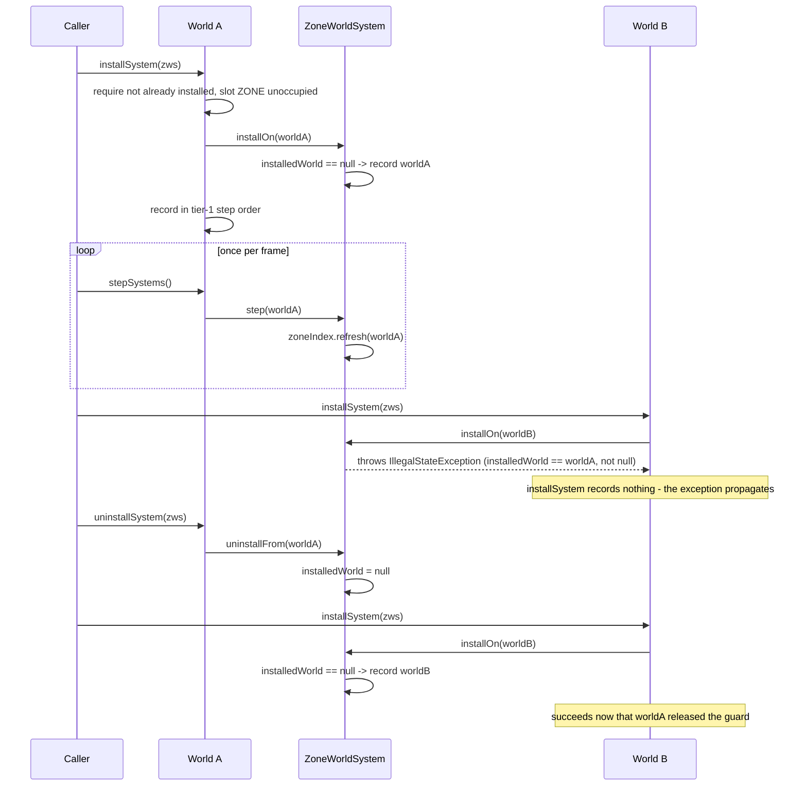
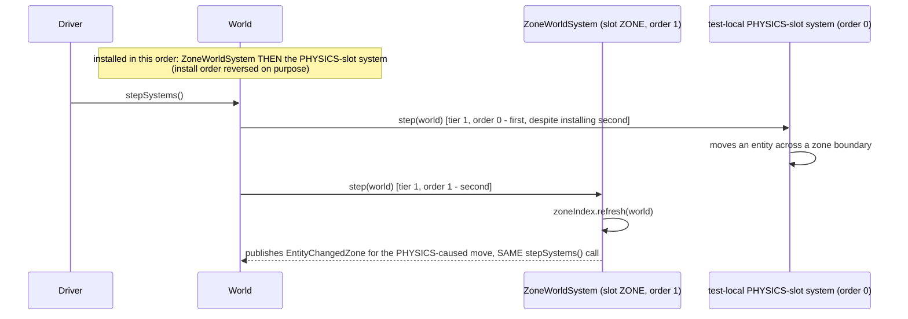

# Plan: `zone-world-system` — wrap `ZoneIndex` as a `WorldSystem`

## Header / Association

- **Covers:** [SpartanLabsGaming/MyGameTools#77](https://github.com/SpartanLabsGaming/MyGameTools/issues/77)
  — *"World Systems Stage 2: wrap ZoneIndex as a WorldSystem"*.
- **Architecture:** `docs/world-systems-implementation-architecture.md`, unit slug
  `zone-world-system` (§10 decomposition table, row 2; scope defined in §4.5, §6, §7, §8).
- **Branch:** `feature/77-zone-world-system`, off `master` **after** `feature/76-world-system-core`
  merges (`CONTRIBUTING.md`: branch off the latest `master`; no stacking — this branch is not cut
  until #76's PR is merged).
- **Commit:** TBD
- **PR:** TBD. This plan document is **not** part of the implementation PR: it lands earlier,
  together with the architecture and the other four unit plans, in the docs-only planning PR off
  `master` (architecture §1.2, "Other settled points"). The implementation PR references it.
- **What this plans:** one new production file, `ZoneWorldSystem`, wrapping the existing,
  unmodified `ZoneIndex` into the `WorldSystem` mechanism's tier-1 `ZONE` slot; the
  `gametools-world`-side test-only opt-in Gradle line; four new test classes across the 5-level
  hierarchy; and this unit's own README/CONTRIBUTING/CHANGELOG duties per architecture §7.
- **Status:** planning only. No source, test, or build file has been modified by this document.
  This plan is written **against #76's contract as designed** (`docs/world-systems-implementation-architecture.md`
  §4.2–§4.4) — #76 has not landed yet (verified: no `com.spartanlabs.gaming.annotation` package,
  no `ExperimentalGameToolsApi`/`WorldSystem`/`CoreSystemSlot` symbol anywhere in the repo today).
  #77's branch is not cut until #76 actually merges (landing order 1 before 2, §10).
- **Target release:** not settled independently of #76 — architecture §12 OD3 ("release
  targeting") is a systems-wide open decision this plan does not re-litigate. Both modules
  (`gametools-core`, `gametools-world`) still read `5.1.0` in their `coordinates(...)` calls
  (verified: `gametools-world/build.gradle.kts`, `gametools-core/build.gradle.kts`); this unit's
  commits land under `CHANGELOG.md`'s `[Unreleased]` heading like everything else currently
  in flight. No version bump in this plan — that is a release-branch step (`CONTRIBUTING.md`
  §Releasing), out of scope here.
- **Dependencies:** `world-system-core` (#76) — see §8 for the exact contract elements consumed.
  Depends on the already-landed #47 (`ZoneIndex`) — no change needed there.
- **Related docs:** `docs/world-systems-implementation-architecture.md` (§4.5 `ZoneWorldSystem`
  design, §6 adoption verdict "Adopt now (#77)", §7 doc duties, §8 stability tiers, §10
  decomposition); `docs/issue-47-zones-plan.md` (`ZoneIndex`'s own plan — untouched by this unit);
  `docs/world-system-core-plan.md` (#76's own plan, sibling — not yet written/read by this plan
  beyond the architecture's binding contract, since #76 has not landed).

---

## 1. Context

### 1.1 What exists today (verified)

- `ZoneIndex.refresh(world: World)` (`gametools-world/src/main/kotlin/com/spartanlabs/gaming/world/zone/ZoneIndex.kt:38-62`)
  is a plain public method: it iterates `world.gameObjects`, reads `obj.location` and
  `obj.entityId` directly, and never references `world.spatialIndex` anywhere in the file
  (confirmed by reading the whole file — zero occurrences of `spatialIndex`). Wrapping it needs
  no reconcile call of its own; a `ZoneWorldSystem.step` can delegate to it verbatim.
- `ZoneIndex`'s bookkeeping (`ZoneIndex.kt:20-24`, `indexed: MutableMap<EntityId, Pair<GameObject, Zone>>`,
  `entitiesByZone: MutableMap<Zone, MutableSet<EntityId>>`) is keyed by `EntityId`. `World`
  assigns `EntityId`s from its own private `nextRawId`, starting at `1` independently per
  instance (`World.kt:126-127,163-166`) — two different `World`s hand out the same raw
  `EntityId` value to unrelated objects. This is the fact the install guard (§3) and the risk
  in §6 are both built on.
- `World` (`gametools-core/src/main/kotlin/com/spartanlabs/gaming/gameobjects/World.kt`) has no
  reference to any add-on system today; `tick()` (`World.kt:218-245`) never calls anything named
  `stepSystems` (it does not exist yet — #76 adds it). `World.seed` is logged at `INFO` on
  construction (`World.kt:50-52`), a fact §3's logging design reuses for log correlation.
- `EventBus.subscribe`/`Subscription` (`gametools-core/src/main/kotlin/com/spartanlabs/gaming/event/EventBus.kt:38-42,59-65`)
  is the repo's existing precedent for symmetric attach/release, cited by #76's own
  `uninstallFrom` design; not otherwise used by `ZoneWorldSystem`, which has nothing to
  subscribe (`ZoneIndex.refresh` runs synchronously inside `step`, it does not use `world.events`
  as a *subscriber*, only as a *publisher* it calls into).
- **No logger exists anywhere in `gametools-world`'s main source set** (verified: `grep -rn
  LoggerFactory gametools-world/src/main` returns nothing). `EventBus.kt:10` is the file-level
  package-logger precedent this plan follows: `private val log: Logger =
  LoggerFactory.getLogger("com.spartanlabs.gaming.event")` — a file-private `val` named after the
  *package*, not the file/class.
- **Reusable test fixtures**, all under `gametools-world/src/test/kotlin/com/spartanlabs/gaming/testing/`:
  - `integration/world/zone/ZoneRefreshWorldIntegrationTest.kt:38-44` — `fixtureMap()`, a 4×3
    all-grass `TiledMap` (40×30 world units, `tileSize = 10.0`).
  - Same file, `:46-47` — `recorder(world)`, subscribing a `MutableList<EntityChangedZone>` to
    `world.events`.
  - `e2e/world/zone/ZoneDrivenSimulationE2ETest.kt:36-39,66-69` — loads `fixture-map.json` via
    `MapLoader`, drives several `World.tick()`s with a manual `refresh` after each.
  - `component/world/zone/ZoneIndexTest.kt:32-38` — a private `FixtureSpace`/`fixtureGrid()` (a
    40×30 space, 4×3 grid of 10×10 zones), no `TiledMap` required.
- **No `com.spartanlabs.gaming.annotation` package and no `WorldSystem`/`CoreSystemSlot`/
  `CoreWorldSystemSlot`/`World.installSystem` etc. exist yet** — confirmed by search. This plan's
  entire design is written against #76's contract as specified in the architecture document,
  reproduced exactly in §2 below, and will need re-verification against #76's actual landed shape
  before #77's branch is cut (§10).
- `gametools-world/build.gradle.kts` has no `compileTestKotlin` block today (it is a
  `plugins {}` + `dependencies {}` + `mavenPublishing {}` + `dokka {}` file only, verified by
  reading it in full) — the opt-in line this unit adds (§3) is a genuinely new block, not an
  edit to an existing one.

### 1.2 The exact #76 contract this plan builds against

Reproduced verbatim from `docs/world-systems-implementation-architecture.md` §4.2–§4.4 (the task
brief's own binding names), since #76 is unimplemented and this is the only source of truth
available:

```kotlin
// gametools-core, com.spartanlabs.gaming.annotation
@RequiresOptIn(level = RequiresOptIn.Level.ERROR)
annotation class ExperimentalGameToolsApi

// gametools-core, com.spartanlabs.gaming.gameobjects
@SubclassOptInRequired(ExperimentalGameToolsApi::class)
interface WorldSystem {
    fun installOn(world: World)
    fun uninstallFrom(world: World) {}
    fun step(world: World) {}
    val coreSlot: CoreSystemSlot? get() = null
}

@ExperimentalGameToolsApi
sealed interface CoreSystemSlot { val order: Int }

@ExperimentalGameToolsApi
enum class CoreWorldSystemSlot(override val order: Int) : CoreSystemSlot {
    PHYSICS(0), // reserved for #80
    ZONE(1),    // this unit
}

class World(val seed: Long = Random.nextLong()) {
    @ExperimentalGameToolsApi fun installSystem(system: WorldSystem)     // throws IllegalArgumentException: duplicate instance, or occupied slot — before installOn runs; if installOn throws, nothing is recorded
    @ExperimentalGameToolsApi fun uninstallSystem(system: WorldSystem)   // idempotent; removes from the list, then calls uninstallFrom
    @ExperimentalGameToolsApi val installedSystems: List<WorldSystem>    // fresh copy, step order
    @ExperimentalGameToolsApi fun stepSystems()                         // snapshot; tier 1 by order, then tier 2 in install order; never called by World.tick()
}
```

### 1.3 Acceptance criteria for this unit

1. `ZoneWorldSystem` exists in `gametools-world`'s `com.spartanlabs.gaming.world.zone` package,
   implements `WorldSystem`, claims `CoreWorldSystemSlot.ZONE`, and its `step` produces identical
   observable behaviour (same `EntityChangedZone` sequence, same `zoneOf`/`entitiesIn` state) to
   calling `zoneIndex.refresh(world)` directly.
2. Installing a `ZoneWorldSystem` does **not** publish any `EntityChangedZone` — `installOn` does
   no refresh work.
3. A `World` with `ZoneWorldSystem` installed alongside a tier-1 `PHYSICS`-slot system steps
   `PHYSICS` before `ZONE` regardless of which was *installed* first, and a same-frame
   `stepSystems()` call observes a `PHYSICS`-caused zone change immediately.
4. `ZoneIndex` itself is unmodified; every existing manual-`refresh` call site and test keeps
   passing unchanged.
5. One instance of `ZoneWorldSystem` cannot be installed on two different `World`s at the same
   time; it can be re-installed on a different `World` after being uninstalled from the first.
6. README, CONTRIBUTING, and CHANGELOG each name `ZoneWorldSystem` in this unit's own commits, not
   deferred (architecture §7's per-stage doc-duties table, row `#77`).
7. Ships `@ExperimentalGameToolsApi`, consistent with #76's tier (graduates at #79, out of scope
   here).

---

## 2. Design

### 2.1 Package placement

`com.spartanlabs.gaming.world.zone`, beside `ZoneIndex`, `ZoneGrid`, `Zone`, `EntityChangedZone`
— package-by-feature, exactly as architecture §4.5 specifies and as `docs/issue-47-zones-plan.md`
§3.1 already established as this module's convention (one small type per file, grouped by
domain concern rather than by technical layer). The retired `world.system` package
(`docs/phase-1-map-and-space-plan.md:237,404`) is not reused — confirmed not created.

### 2.2 `ZoneWorldSystem` — shape and lifecycle

```kotlin
@ExperimentalGameToolsApi
class ZoneWorldSystem(val zoneIndex: ZoneIndex) : WorldSystem {
    private var installedWorld: World? = null

    override val coreSlot: CoreSystemSlot = CoreWorldSystemSlot.ZONE

    override fun installOn(world: World) {
        check(installedWorld == null) { "..." }   // see §3 for the exact message
        installedWorld = world
        log.debug(...)
    }

    override fun uninstallFrom(world: World) {
        installedWorld = null
        log.debug(...)
    }

    override fun step(world: World) = zoneIndex.refresh(world)
}
```

- **`installOn` does not refresh.** A refresh at install time would publish `EntityChangedZone`
  outside the frame loop `ZoneIndex.refresh` is documented to run inside (`ZoneIndex.kt:12-14`),
  ahead of the caller's own first `stepSystems()` call. `installOn`'s only job is the guard.
- **The guard covers exactly one hazard: the *same instance* on two `World`s concurrently**, per
  §1.1's `EntityId`-collision fact. It does **not** (and structurally cannot) detect *two
  different* `ZoneWorldSystem` instances sharing one `zoneIndex` across two `World`s — see §6.
- **Guard failure mode: `check()` → `IllegalStateException`, not `require()` →
  `IllegalArgumentException`.** This is a deliberate, narrower choice than #76's own
  `installSystem` duplicate-instance/slot checks (both `IllegalArgumentException`, since both are
  about the validity of the `system` *argument* `installSystem` was handed). Here the condition
  being tested is this **receiver's own current state** (already attached elsewhere), not the
  validity of the `world` parameter — exactly the line Kotlin's stdlib draws between `require`
  (argument validity) and `check` (object-state validity). Both are still **thrown, not
  `Result`-wrapped**, for the same reason architecture §4.4/§9 gives for `installSystem` itself:
  this is a caller-wiring error, not an operational failure, and this Kotlin 2.2.0 toolchain has
  no must-use checker — an ignored `Result` would silently leave the guard in an inconsistent
  state. `installOn`'s signature (`fun installOn(world: World)`, `WorldSystem`'s own contract)
  returns `Unit` and cannot express `Result` without contradicting #76's interface shape, which
  is not this unit's to change.
- **`uninstallFrom` is unconditional.** It always clears `installedWorld`, regardless of which
  `world` argument is passed. `World.uninstallSystem`'s own idempotency (§1.2) means this is only
  ever called for a system actually in `installedSystems`, so the normal path is safe by
  construction; a caller invoking `zoneWorldSystem.uninstallFrom(wrongWorld)` directly, bypassing
  `World`, is a misuse this does not detect — documented in KDoc (§3), not guarded against, since
  `WorldSystem`'s lifecycle hooks are designed to be driven by `World`, not called directly by
  application code (the same assumption `World.installSystem`/`uninstallSystem` themselves make).
- **`step` is a pure delegation.** `override fun step(world: World) = zoneIndex.refresh(world)` —
  identical observable behaviour to a consumer calling `zoneIndex.refresh(world)` by hand today;
  `ZoneWorldSystem` adds no logic of its own here, and no per-step log line (see §3's logging
  rationale — `World.stepSystems()` itself already logs once per call at `DEBUG`, per #76's
  design; a second per-system per-frame log line would be redundant noise at 20 Hz).
- **Mutability/concurrency:** `zoneIndex` is a `val` (immutable reference; `ZoneIndex`'s own
  internal maps are mutable, unchanged by this unit). `installedWorld` is the one private `var` —
  single-threaded by the same convention `World`/`EventBus` already assume; no synchronisation is
  added, matching architecture §4.4's "no synchronisation added" note for `World`'s own registry.

### 2.3 Sequence: install → step → uninstall, with the guard



### 2.4 Tier-1 ordering and the same-frame proof (the precursor to #80's headline test)

Since `PhysicsWorldSystem` (#80) does not exist yet, the ordering guarantee is proven here with a
**test-local `WorldSystem` claiming the existing `CoreWorldSystemSlot.PHYSICS` slot** — a
legitimate substitution per architecture §4.3 ("nothing stops a consumer's own `WorldSystem` from
returning the existing `CoreWorldSystemSlot.PHYSICS`"). This is exactly the proof #80's own
regression test later repeats with the real `PhysicsWorldSystem` (architecture §4.8, §10 row 5).



### 2.5 Blast-radius / adoption check

Grepped `gametools-core` and `gametools-world` for any existing consumer of `ZoneIndex` beyond its
own test tree: none (matches architecture §6's own adoption table — "`ZoneIndex` is a pure
net-new capability" as of #47, still true). There is no hand-rolled `zoneIndex.refresh(world)`
call site anywhere in production code today to migrate onto `ZoneWorldSystem` — the adoption
verdict (architecture §6: "Adopt now (#77)") is satisfied by `ZoneWorldSystem` existing as a
drop-in alternative, not by rewriting a caller that does not exist yet. `ZoneIndex.refresh`
itself is untouched and stays independently callable (acceptance criterion 4).

---

## 3. File-by-file changes

### New: `gametools-world/src/main/kotlin/com/spartanlabs/gaming/world/zone/ZoneWorldSystem.kt`

```kotlin
package com.spartanlabs.gaming.world.zone

//region 1. Organization Internal
// 1.2 Spartan Gaming
import com.spartanlabs.gaming.annotation.ExperimentalGameToolsApi
import com.spartanlabs.gaming.gameobjects.CoreSystemSlot
import com.spartanlabs.gaming.gameobjects.CoreWorldSystemSlot
import com.spartanlabs.gaming.gameobjects.EntityId
import com.spartanlabs.gaming.gameobjects.World
import com.spartanlabs.gaming.gameobjects.WorldSystem
//endregion

//region 4. Programming Infrastructure and Support
// 4.1 Logging
import org.slf4j.Logger
import org.slf4j.LoggerFactory
//endregion

/**
 * Shared slf4j logger for the `world.zone` package. First logger in `gametools-world`'s main
 * source set (verified: no other `LoggerFactory` usage exists under `gametools-world/src/main`
 * before this file) — follows [com.spartanlabs.gaming.event.EventBus]'s file-level,
 * package-named-logger convention (`EventBus.kt:10`).
 */
private val log: Logger = LoggerFactory.getLogger("com.spartanlabs.gaming.world.zone")

/**
 * Wires an existing [ZoneIndex] into a [World]'s tier-1 `ZONE` slot, so
 * `World.stepSystems()` refreshes zone membership once per frame at a slot-guaranteed position
 * relative to `PHYSICS` - always after it, regardless of install order - instead of a consumer
 * calling [ZoneIndex.refresh] by hand. A pure additive wrapper: [zoneIndex]'s own [ZoneIndex.refresh]
 * stays independently callable, and wrapping it changes nothing about how it works. Doubles as
 * `WorldSystem`'s worked example of a tier-1 adapter once it graduates to `@SupportedExtension`
 * (issue #79).
 *
 * [installOn] does **not** refresh at install time - that would publish [EntityChangedZone]
 * outside the frame loop [ZoneIndex.refresh] is documented to run inside.
 *
 * **One instance, one [World] at a time.** [zoneIndex]'s bookkeeping is keyed by [EntityId],
 * which a [World] assigns starting independently from its own counter - two different [World]s
 * can and do hand out the same [EntityId] value to unrelated objects. Installing one
 * `ZoneWorldSystem` instance on two [World]s concurrently would silently mix their entities'
 * zone bookkeeping together, so [installOn] rejects it outright. It does **not** detect the
 * related hazard of *two different* `ZoneWorldSystem` instances sharing one [zoneIndex] across
 * two [World]s: give each [World] its own [ZoneIndex].
 *
 * @param zoneIndex the index this system drives; usable independently of whether it is
 *   currently wrapped by a `ZoneWorldSystem`
 */
@ExperimentalGameToolsApi
class ZoneWorldSystem(val zoneIndex: ZoneIndex) : WorldSystem {

    /** The [World] this instance is currently installed on, or `null`. Guards [installOn]. */
    private var installedWorld: World? = null

    /** Claims the tier-1 `ZONE` slot, so [step] always runs after `PHYSICS`, regardless of install order. */
    override val coreSlot: CoreSystemSlot = CoreWorldSystemSlot.ZONE

    /**
     * Rejects installing this same instance on a second, different [World] while it is already
     * attached to one; otherwise records [world] as this instance's current one. Never touches
     * [zoneIndex] - no refresh runs here.
     *
     * @param world the world `World.installSystem` is installing this system on
     * @throws IllegalStateException if this instance is already installed on a *different*
     *   [World]. (Installing the same instance twice on the *same* `World` is already rejected
     *   by `World.installSystem` itself, before this is ever called.)
     */
    override fun installOn(world: World) {
        check(installedWorld == null) {
            "ZoneWorldSystem is already installed on a different World; uninstall it there first"
        }
        installedWorld = world
        log.debug("ZoneWorldSystem installed on World (seed={})", world.seed)
    }

    /**
     * Releases the install guard so this instance becomes installable on another [World].
     * Unconditional - always clears the guard regardless of which [world] is passed; calling
     * this directly (bypassing `World.uninstallSystem`) with the wrong [world] is a misuse this
     * does not detect.
     *
     * @param world the world `World.uninstallSystem` is uninstalling this system from
     */
    override fun uninstallFrom(world: World) {
        installedWorld = null
        log.debug("ZoneWorldSystem uninstalled from World (seed={})", world.seed)
    }

    /**
     * Refreshes [zoneIndex] against [world]'s current entity positions - identical to calling
     * [ZoneIndex.refresh] directly. The one piece of per-frame work this system schedules at a
     * guaranteed tier-1 position.
     *
     * @param world the world `World.stepSystems` is stepping
     */
    override fun step(world: World) = zoneIndex.refresh(world)
}
```

**Error handling summary:** `installOn` throws `IllegalStateException` for the one guarded
failure (caller-wiring error, not operational — no `Result`, per §2.2). `uninstallFrom` and `step`
have no failure mode of their own; `step`'s only call (`zoneIndex.refresh`) is itself total over
in-memory state (no expected failure, per `docs/issue-47-zones-plan.md`'s own analysis of
`refresh`). Nothing here is a programmer error in the "should never happen" sense — the guard
exists precisely because a caller *can* and, without it, silently *would* misuse this.

**Logging:** two new `DEBUG`-level lifecycle events — install and uninstall — using slf4j's lazy
`{}` placeholders. No per-`step` log line (§2.2 rationale — redundant with `World.stepSystems()`'s
own `DEBUG` log, once #76 lands). No log line on the guard's failure path, matching
`World.installSystem`'s own convention of throwing without a preceding log (the exception message
is the diagnostic).

**Stability tier:** Experimental (`@ExperimentalGameToolsApi`) through #78, per architecture §8.
Graduates to untagged Stable Core at #79 with no shape change — this unit does not add
`@SupportedExtension` itself (only `WorldSystem` gets that tag, per architecture §4.7). This
class's KDoc is written to double as `WorldSystem`'s worked example once graduated, per the
library's "shipped implementations double as worked examples" rule.

### Changed: `gametools-world/build.gradle.kts`

Add a `compileTestKotlin` opt-in block — the first `gametools-world` test source using an
Experimental GameTools API is this unit's own (§4). Per architecture §8's table, #76 owns
`gametools-core`'s equivalent block; this unit owns `gametools-world`'s, since #76's own tests
never leave `gametools-core`.

```kotlin
tasks.named<org.jetbrains.kotlin.gradle.tasks.KotlinCompilationTask<*>>("compileTestKotlin") {
    compilerOptions.optIn.add("com.spartanlabs.gaming.annotation.ExperimentalGameToolsApi")
}
```

Placed after the existing `dependencies {}` block, before `mavenPublishing {}`, matching where a
same-shaped block is expected to land in `gametools-core/build.gradle.kts` under #76 (kept
consistent between the two files so a future reader finds the block in the same relative
position). No main-source-set opt-in is added, ever, per architecture §8's explicit rule —
`ZoneWorldSystem.kt` itself opts in per-class via `@ExperimentalGameToolsApi` (§2's Kotlin opt-in
propagation: annotating a declaration with the same marker it depends on both propagates the
requirement outward *and* suppresses the diagnostic for uses of that marker inside the
declaration's own body — no additional `@OptIn` needed inside `ZoneWorldSystem.kt`).

### Unchanged: `ZoneIndex.kt`, `ZoneGrid.kt`, `Zone.kt`, `EntityChangedZone.kt`

No modification. `ZoneWorldSystem` is a pure additive wrapper (§1.3 acceptance criterion 4).

### Changed: `README.md`

- **Modules table, world row (`README.md:149`).** Today: `` `com.spartanlabs.gaming.world.zone.*`:
  `Zone`, `ZoneGrid`, `ZoneIndex`, `EntityChangedZone` (#47); physics and vision are still to come
  ``. After: append `, `ZoneWorldSystem`` to the `world.zone.*` type list and cite `(#47, #77)`.
- **Features prose, zone bullet (`README.md:181`).** Today ends: *"Nothing in `World`/`core`
  changes - `ZoneIndex` is an external consumer a caller drives explicitly, the seam Phase 3
  interest filtering and Phase 5 zone save/load build on."* This sentence is now only half true —
  `ZoneIndex` can *also* be driven through the new opt-in `WorldSystem` mechanism. Revise to:
  *"Nothing in `World`/`core` changes to add zones themselves - `ZoneIndex` stays independently
  callable, and `ZoneWorldSystem` (Experimental) wraps it into a `World`'s tier-1 `ZONE` slot via
  the opt-in `WorldSystem` mechanism, as a drop-in alternative to a hand-rolled per-frame call.
  The seam Phase 3 interest filtering and Phase 5 zone save/load build on."*

### Changed: `CONTRIBUTING.md`

Module layout table, `gametools-world` row (`CONTRIBUTING.md:35`). Today ends `` `Zone`,
`ZoneGrid`, `ZoneIndex`, `EntityChangedZone` (#47) ``. Append `, `ZoneWorldSystem` (#77)`.

### Changed: `CHANGELOG.md`

New `[Unreleased] ### Added` bullet, appended after the existing `com.spartanlabs.gaming.world.zone`
bullet (`CHANGELOG.md:62-69`, #47) so the two zone-package entries sit together:

> - `com.spartanlabs.gaming.world.zone.ZoneWorldSystem` — wraps an existing `ZoneIndex` in the new
>   opt-in `WorldSystem` mechanism's tier-1 `ZONE` slot (`CoreWorldSystemSlot.ZONE`), so
>   `World.stepSystems()` refreshes zone membership once per frame at a guaranteed position
>   relative to `PHYSICS`, regardless of install order. Purely additive — `ZoneIndex.refresh(world)`
>   stays independently callable, and installing `ZoneWorldSystem` does not refresh at install
>   time. Experimental (`@ExperimentalGameToolsApi`) until `WorldSystem` graduates to
>   `@SupportedExtension` (#79). (#77)

---

## 4. Documentation impact (Audience-Reach rings)

- **Inner Core (in-editor).** One `//region`/`//endregion` import grouping in the new file, per
  the repo's import-grouping rule; no `TODO`s.
- **Component Ring (KDoc/API contracts).** The primary ring this unit touches. Full KDoc on
  `ZoneWorldSystem` and its three overridden members (§3), written to double as `WorldSystem`'s
  worked example post-#79 (architecture §8's "shipped implementations double as worked examples"
  rule for a Supported-Extension-tier interface). Must render correctly under
  `./gradlew dokkaGeneratePublicationHtml`.
- **Boundary Ring (protocol/integration).** Not touched — no wire format, no `@Serializable`
  type, no cross-service concern.
- **Architectural Outer Layer.** `docs/world-systems-implementation-architecture.md` already
  documents this unit's design; no update owed to it by this plan. This plan document itself is
  the per-unit implementation-plan artifact the architecture's §10 names.
- **README / CONTRIBUTING / CHANGELOG currency.** All three updated in this unit's own commits
  (§3), per the global README-currency rule and architecture §7's per-stage doc-duties table
  (row `#77`).

---

## 5. Test plan (5-level hierarchy)

All new tests: `kotlin.test` assertions on the JUnit 5 platform (matching this repo's actual
convention, not MockK — no module in this repo depends on MockK, and nothing here makes an
external call to mock), one class per file, backtick-named test methods, hand-rolled
fakes/recorders (no mocking framework needed). No `testing.gating` or `testing.uat` package
exists anywhere in the repo today; neither is invented here.

### Level 1 — gating

No new artifact. Per repo convention (`CONTRIBUTING.md` §Running the build), level 1 in practice
is `./gradlew componentTest deterministicTest` before every push, exercising the level-2 and
level-4a tests below.

### Level 2 — component

**New:** `gametools-world/src/test/kotlin/com/spartanlabs/gaming/testing/component/world/zone/ZoneWorldSystemTest.kt`

- `` `coreSlot` is CoreWorldSystemSlot ZONE` `` — a bare property read.
- `` `installOn does not refresh - no EntityChangedZone before the first step` `` — construct a
  `World`, add an actor at a known location, `installOn(world)` directly (no `World.installSystem`
  needed to exercise this unit's own logic), assert the `recorder`'s list is still empty and
  `zoneIndex.zoneOf(actor.entityId)` is `null`.
- `` `step delegates to zoneIndex refresh - same events and same zoneOf as calling refresh directly` ``
  — two parallel `World` + `ZoneIndex` pairs over the same fixture grid, one driven via
  `zoneWorldSystem.step(world)` across several ticks, the other via a direct
  `zoneIndex.refresh(world)` call; assert both `recorder` lists and both final `zoneOf` results
  are equal.
- `` `installOn rejects a second, different World while already installed on one` `` — install on
  `worldA`, then call `installOn(worldB)` directly; assert it throws `IllegalStateException`, and
  that `zoneWorldSystem` is still functionally attached to `worldA` (a subsequent `step(worldA)`
  still updates `zoneIndex` normally — the failed install did not corrupt guard state).
- `` `installOn on the same World it is already installed on still throws` `` — documents that
  this unit's own guard does not special-case "same world twice" (that case is normally
  intercepted earlier by `World.installSystem`'s own duplicate-instance check, which this
  component test cannot exercise without #76's `World` — see the integration level for the real
  end-to-end proof); asserts `IllegalStateException` here too, for a caller that invokes
  `installOn` directly.
- `` `uninstallFrom releases the guard so installOn on a different World then succeeds` `` —
  install on `worldA`, `uninstallFrom(worldA)`, then `installOn(worldB)` succeeds without
  throwing.
- `` `uninstallFrom is safe to call when never installed` `` — a fresh instance's
  `uninstallFrom(world)` does not throw.

### Level 3 — integration

**New:** `gametools-world/src/test/kotlin/com/spartanlabs/gaming/testing/integration/world/zone/ZoneWorldSystemOrderingIntegrationTest.kt`

Uses #76's real `World.installSystem`/`stepSystems`/`uninstallSystem` (available once #76 has
landed and this branch is cut against it), a real `ZoneWorldSystem`, and a small test-local
`WorldSystem` fake claiming `CoreWorldSystemSlot.PHYSICS` (a legitimate substitution per
architecture §4.3), reusing `ZoneRefreshWorldIntegrationTest`'s `fixtureMap()`/`recorder()` shape.

- `` `a tier-1 PHYSICS-slot system installed after ZoneWorldSystem still steps before it` `` — a
  fake `PHYSICS`-slot system and `ZoneWorldSystem` installed in that order (zone first); one
  `stepSystems()` call; assert (via a shared, order-recording list both systems append their name
  to inside `step`) that the fake ran before `ZoneWorldSystem`.
- `` `a tier-2 system installed before ZoneWorldSystem still steps after it` `` — a fake tier-2
  (`coreSlot == null`) recording system installed *before* `ZoneWorldSystem`; assert it still
  records *after* `ZoneWorldSystem` in the same `stepSystems()` call, per §5.1/§4.4's ordering
  rule.
- `` `a PHYSICS-slot move that crosses a zone boundary is observed by ZoneWorldSystem in the same stepSystems call` ``
  — the precursor to #80's headline regression test: the fake `PHYSICS`-slot system's `step`
  relocates an actor from one zone to another; `world.installSystem(zoneWorldSystem)` installed
  *before* the fake (install order reversed on purpose, mirroring architecture §5.2); one
  `stepSystems()` call; assert the `recorder` observes the resulting `EntityChangedZone` from
  that same call, not one call later.
- `` `uninstallSystem removes ZoneWorldSystem from installedSystems and stops further refreshes` ``
  — install, step once (some state accrues), `uninstallSystem`, move an actor across a zone
  boundary, step `stepSystems()` again (now a no-op for zones since it's uninstalled — nothing new
  in `installedSystems`), assert no new `EntityChangedZone` fires and `zoneOf` is stale
  (unchanged since the last refresh before uninstall) — locking in that uninstalling truly stops
  the per-frame work, not just removes bookkeeping.

### Level 4a — deterministic

**New:** `gametools-world/src/test/kotlin/com/spartanlabs/gaming/testing/deterministic/world/zone/ZoneWorldSystemDeterminismTest.kt`

- `` `the same seeded World, ZoneWorldSystem, and scripted moves produce the same EntityChangedZone sequence across repeated runs, driven via installSystem stepSystems` ``
  — the `ZoneIndexRefreshDeterminismTest` (existing, unmodified) shape, but going through
  `world.installSystem(zoneWorldSystem)` + `world.stepSystems()` instead of a direct
  `zoneIndex.refresh(world)` call, confirming the adapter introduces no extra source of
  nondeterminism (no randomness, no ordering dependency beyond what's already covered at level 3).

### Level 4b — e2e

**New:** `gametools-world/src/test/kotlin/com/spartanlabs/gaming/testing/e2e/world/zone/ZoneWorldSystemSimulationLoopE2ETest.kt`

- `` `a ZoneWorldSystem installed on a World and driven by SimulationLoop advance refreshes zones exactly as manual refresh would` ``
  — reuses `ZoneDrivenSimulationE2ETest`'s `fixture-map.json`/`MapLoader`/spawn-point setup;
  installs `ZoneWorldSystem` via `world.installSystem`; drives the world with a
  `SimulationLoop(world, onTick = { world.stepSystems() })`, calling its public
  `advance(realElapsedNanos)` directly with a fixed nanosecond step (no thread — deterministic,
  matching `SimulationLoop.kt:112-127`'s documented direct-driver use) instead of `start()`;
  asserts final `zoneOf`/`entitiesIn` and the full `EntityChangedZone` history match
  `ZoneDrivenSimulationE2ETest`'s own manual-refresh expectations for the same scripted movement.

### Level 4c — nonfunctional

Not added. `ZoneWorldSystem.step` adds one virtual dispatch over `ZoneIndex.refresh`'s existing
`O(n)` pass — the same reasoning `docs/issue-47-zones-plan.md` §6 already gave for not adding a
nonfunctional tier to `ZoneIndex` itself applies here with even less new cost.

### Level 5 — UAT

No `testing.uat` package exists anywhere in the repo; not invented here. Nothing here is
user-observable in isolation (no UI, no gameplay effect) — this is register-and-delegate
infrastructure. Any UAT signal belongs to whichever unit first produces observable, playable
behaviour built on `WorldSystem` (out of this unit's scope).

### What can't be tested automatically

- **The two-different-instances-sharing-one-`ZoneIndex` hazard (§6) is not asserted by a test.**
  A test that reproduces it would only demonstrate "produces incorrect but unspecified results,"
  which is not a useful thing to lock in as a passing assertion — it is documented instead (KDoc,
  §6), following the same precedent `docs/issue-47-zones-plan.md` §7 set for `ZoneIndex`'s own
  "boundary flicker" characteristic (documented, not tested).
- **Real wall-clock `SimulationLoop` thread timing** is not exercised by the e2e test above — it
  drives `advance()` directly for determinism, the same choice `SimulationLoop`'s own test suite
  already makes for its threaded `start()`/`stop()` path.

---

## 6. Risks & edge cases

| Risk | Mitigation |
|---|---|
| **Two different `ZoneWorldSystem` instances wrapping one `ZoneIndex`, installed on two different `World`s.** Each instance's own `installedWorld` guard only ever sees itself — neither instance can observe the other, so both installs succeed, and `zoneIndex`'s `EntityId`-keyed maps silently mix entities from both `World`s (per §1.1's per-`World`-independent `EntityId` numbering fact). | Not preventable at the type level without `ZoneIndex` itself tracking an owning `World` (out of this unit's scope — `ZoneIndex` is unmodified, per acceptance criterion 4). Documented prominently in `ZoneWorldSystem`'s KDoc (§3) and here. A consumer wanting two `World`s zoned needs two `ZoneIndex`es (one `ZoneWorldSystem` each), which is already the natural, unsurprising pattern. |
| **The guard is per-instance, not per-`ZoneIndex`.** A caller could construct two separate `ZoneWorldSystem`s each wrapping a *different* `ZoneIndex` and install both on the same `World`, but only one may claim the `ZONE` slot — `World.installSystem`'s own slot-occupancy check (#76) already rejects the second, so this particular variant is already covered without any code in this unit. | No action needed — `World`'s own registry (§1.2) handles it. Noted here only so it is not mistaken for a gap this unit's own guard needs to also cover. |
| **`installOn`'s guard state (`installedWorld`) is not thread-safe.** | Documented as inheriting `World`'s own single-threaded convention (§2.2) — consistent with every other `WorldSystem`/`World` member; not a new risk this unit introduces. |
| **Published KDoc must not point at repo-internal planning docs** — consumers reading the Dokka javadoc jar cannot see `docs/`. | `ZoneWorldSystem`'s KDoc (§3) states the shared-`ZoneIndex` hazard and its remedy (one `ZoneIndex` per `World`) in place, with no plan-document reference. |
| **Breaking changes.** | None. `ZoneWorldSystem` is a wholly new type; `ZoneIndex` and every existing call site are untouched. |
| **Cross-repo impact.** | None. No wire/protocol change; `gametools-net` untouched. Per standing "no downstream consumer issues" guidance, `MyGameServer`/`GameGraphics` are not filed against. |
| **Concurrency/performance.** | Unchanged order of cost versus a hand-rolled `zoneIndex.refresh(world)` call — one extra virtual dispatch through `World.stepSystems()`'s snapshot loop, negligible next to `refresh`'s own `O(n)` pass. |
| **#76 not yet landed.** | This entire plan is written against #76's contract as specified in the architecture document (§1.2). If #76's actual landed shape differs from that contract (member names, exception types, `stepSystems()` ordering guarantee), this plan's §2–§5 need re-verification before `feature/77-zone-world-system` is cut — flagged in §10. |

**Breaking-change assessment:** none. Entirely additive, within the existing `world.zone`
package; `gametools-core` is untouched by this unit (only consumed, per §8).

---

## 7. Version control

- **Branch:** `feature/77-zone-world-system`, cut from `master` **after** #76 merges (no
  stacking, per `CONTRIBUTING.md` and architecture §1.2's "Other settled points").
- **This unit's commits carry no unrelated changes.** The working tree currently holds
  uncommitted changes on `feature/71-combat-package` (`Actor.kt`, `ExperienceGrantor.kt`,
  `ExperienceReceiver.kt`, `SpatialIndex.kt`, per the session's `git status`) — none of it rides
  in this branch's commits. `feature/77-zone-world-system` is cut fresh from `master` after #76,
  not from the current dirty working tree.
- **Commit sequence** (each a coherent, independently-reviewable unit):
  1. `feat(world): wrap ZoneIndex as a WorldSystem (ZoneWorldSystem)` — adds
     `ZoneWorldSystem.kt` (§3), the `compileTestKotlin` opt-in block in
     `gametools-world/build.gradle.kts` (§3), and all four new test classes (§5). This plan
     document is not in this commit: it already landed in the docs-only planning PR. Body: cites
     #77 and `docs/zone-world-system-plan.md`, and references the tier-1 `ZONE` slot and #76's
     `WorldSystem` contract.
  2. `docs: update README and CONTRIBUTING for ZoneWorldSystem` — the §3 README/CONTRIBUTING
     edits.
  3. `docs: changelog entry for ZoneWorldSystem` — the §3 `CHANGELOG.md` addition.
- **PR title** (becomes the merge-commit subject, must be a valid Conventional Commit):
  `feat(world): wrap ZoneIndex as a WorldSystem`. Body: `Closes #77`.
- Trailer: attribute per the repo's existing commit convention; no `BREAKING CHANGE:` footer.
- PR targets `master`, semi-linear merge (`--no-ff`), per `CONTRIBUTING.md`.
- Publishing to Maven Central is Spartak's manual step, not part of this feature PR.

---

## 8. Interfaces with sibling units

**Consumes from `world-system-core` (#76)** — exact names, per §1.2:

- `com.spartanlabs.gaming.annotation.ExperimentalGameToolsApi` — applied to the `ZoneWorldSystem`
  class itself.
- `com.spartanlabs.gaming.gameobjects.WorldSystem` — implemented; overrides `installOn(world:
  World)`, `uninstallFrom(world: World)`, `step(world: World)`, `coreSlot: CoreSystemSlot?`.
- `com.spartanlabs.gaming.gameobjects.CoreSystemSlot` (sealed interface, `val order: Int`) — the
  declared type of the `coreSlot` override.
- `com.spartanlabs.gaming.gameobjects.CoreWorldSystemSlot.ZONE` — the concrete slot value
  returned.
- `World.installSystem(system: WorldSystem)`, `World.uninstallSystem(system: WorldSystem)`,
  `World.installedSystems: List<WorldSystem>`, `World.stepSystems()` — exercised by this unit's
  level-3/4a/4b tests to prove end-to-end behaviour; not called from within `ZoneWorldSystem.kt`
  itself.
- `World.seed: Long` — read for log correlation only.

**Provides to `world-system-graduation` (#79):**

- `ZoneWorldSystem` itself as one of the two real `WorldSystem` consumers #79's own review
  checkpoint requires (architecture §4.7, alongside `ExperienceSystem` from #78) before locking
  the surface to Stable Core's semver guarantee.
- The single `@ExperimentalGameToolsApi` annotation on the `ZoneWorldSystem` class declaration,
  for #79 to remove (architecture §4.7: "removes every `@ExperimentalGameToolsApi`/
  `@SubclassOptInRequired` marker added in #76–#78").
- The `compileTestKotlin` opt-in block this unit adds to `gametools-world/build.gradle.kts` (§3),
  for #79 to remove alongside `gametools-core`'s equivalent block.
- `ZoneWorldSystem`'s KDoc as the permanent worked example for `WorldSystem`'s post-graduation
  `@SupportedExtension` tier (architecture §8's "shipped implementations double as worked
  examples" rule) — #79 should not need to rewrite it, only strip the Experimental marker line.

**Provides to `physics-world-system` (#80):**

- The concrete precedent pattern for a tier-1 adapter — a private per-instance `World?` guard
  field, a `check()`-based (not `require()`-based) failure mode for a receiver-state guard, and a
  `step` that purely delegates to an already-existing single-purpose class — that `PhysicsWorldSystem`
  should mirror where applicable (its own install guard needs, if any, is #80's own design call).
- `CoreWorldSystemSlot.ZONE` occupied at `order = 1`, real and installable, for #80's own
  regression test to install alongside the real `PhysicsWorldSystem` (`CoreWorldSystemSlot.PHYSICS`,
  `order = 0`).
- This unit's level-3 `` `a PHYSICS-slot move that crosses a zone boundary is observed by ZoneWorldSystem in the same stepSystems call` ``
  test (§5) as the direct precursor #80's own headline regression test should follow, replacing
  the test-local `PHYSICS`-slot fake with the real `PhysicsWorldSystem`.

**Depends on:** `world-system-core` (#76), as designed in §1.2 — not yet landed. Depends on the
already-landed #47 (`ZoneIndex`); no change needed there.

**Does not provide:** any change to `ExperienceSystem`/`ExperienceGrantor`/`AOEGrantor` (#78,
entirely out of scope); no `PhysicsWorldSystem` shape decisions (#80's own).

---

## 9. Open decisions

Most of this plan's choices are justified against existing codebase convention with a single
defensible answer (§2.2's `check`/`IllegalStateException` guard shape, `ZoneWorldSystem`'s
placement beside `ZoneIndex`, the file-level package logger). Two items are worth the human's
awareness rather than being blocking:

| ID | Item | Recommendation |
|----|------|-----------------|
| 1 | **Whether to add a component test locking in the two-instances-sharing-one-`ZoneIndex` hazard (§6) as a documented "produces wrong results" assertion**, versus documentation only. | **Recommendation: documentation only** (KDoc + this plan's §6), matching `docs/issue-47-zones-plan.md`'s own precedent for `ZoneIndex`'s "boundary flicker" characteristic. A test asserting "this misuse corrupts state in this specific way" has low value and risks calcifying an accidental implementation detail into a de facto contract. Low-stakes either way. |
| 2 | **Whether `ZoneWorldSystem`'s install guard should also reject re-installing on the *same* `World` it is already on** (currently: `check(installedWorld == null)` throws even for the same `world`, since `World.installSystem`'s own duplicate-instance check is expected to intercept that case first at the registry level, before `installOn` is ever called). | **Recommendation: leave as designed** — the component test at §5 (`` `installOn on the same World it is already installed on still throws` ``) locks in that this unit's own guard is defensively strict regardless of what `World.installSystem` does upstream, which costs nothing and is arguably the more honest contract for a caller invoking `installOn` directly rather than through `World`. |

Additionally, since #76 has not landed, **this plan's entire design is provisional on #76's
actual final shape matching §1.2's contract exactly.** Any divergence (member names, exception
types, `stepSystems()`'s tier-ordering guarantee) needs this plan re-verified before
`feature/77-zone-world-system` is cut — not an "open decision" in the human-judgment sense, but a
structural dependency worth restating here as the one thing that could force a rewrite of §2–§5.

---

## 10. Sequencing & follow-ups

1. **Do not cut `feature/77-zone-world-system` until #76 is merged to `master`.** Re-read #76's
   actual landed `WorldSystem.kt`/`CoreSystemSlot.kt`/`World.kt` diff against this plan's §1.2
   before starting implementation; if it diverges, revise this plan first (§9).
2. Land this unit's PR, closing #77.
3. **#78 (`experience-system`)** and **#79 (`world-system-graduation`)** are the next units in the
   decomposition; #79 depends on both this unit and #78 landing (architecture §10). Nothing in
   this plan blocks #78, which has its own dependency on #71 merging first.
4. **#80 (`physics-world-system`)**, blocked on #49's re-implementation, should read this plan's
   §5 level-3 same-frame test and §8 before designing its own regression test — the pattern is
   meant to be reused with the real `PhysicsWorldSystem` in place of this unit's test-local fake.
5. If a future measurement shows `ZoneWorldSystem`/`ZoneIndex.refresh`'s per-frame cost matters at
   scale, a nonfunctional tier can be added to either without a signature change (§5, level 4c) —
   not built speculatively now, matching `docs/issue-47-zones-plan.md`'s own precedent.
